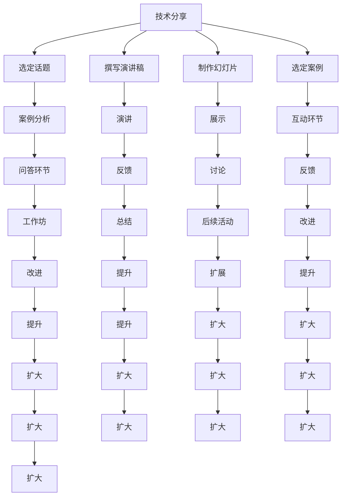

                 

# 从技术分享到付费研讨会：程序员的演讲之路

> 关键词：技术分享, 演讲, 程序员, 研讨会议题, 项目案例, 互动环节, 内容准备, 网络影响力, 职业发展

## 1. 背景介绍

在当今科技飞速发展的时代，技术的不断更新迭代对程序员来说既是挑战也是机遇。随着人工智能、大数据、区块链等前沿技术的崛起，程序员不仅需要不断提升自身的技术能力，也需要积极参与到行业内的交流和分享中。这种交流不仅能提升个人的影响力，还能为企业和团队带来新的视角和方法。

本文将从技术分享的视角出发，探讨如何有效进行技术分享，并通过付费研讨会的组织与参与，帮助程序员在技术分享的道路上更好地提升自我和影响力。

## 2. 核心概念与联系

### 2.1 核心概念概述

- **技术分享**：通过演讲、文章、教学视频等方式，将个人的技术经验和知识分享给同行或更广泛社群的过程。技术分享不仅能够促进知识传播，还能激发更多人的创新思维。

- **付费研讨会**：指以知识付费形式组织的研讨会，旨在通过付费的方式吸引专业人士参加，并提供高质量的讲座和讨论。这类活动通常具备更为专业的知识和互动环境。

- **演讲**：在研讨会等场合进行的现场或录播演讲，旨在向听众传递知识和经验。演讲通常需要良好的内容准备和表达技巧。

- **项目案例**：实际项目中的技术实现和成果展示，通过案例分析帮助听众理解和应用所学知识。

- **互动环节**：研讨会中的问答、讨论、工作坊等环节，旨在促进听众与讲师之间的交流和互动。

- **内容准备**：包括选定话题、撰写演讲稿、制作幻灯片等，是技术分享成功的重要环节。

- **网络影响力**：通过技术分享和参与付费研讨会，提升个人在行业内外的知名度和影响力。

### 2.2 核心概念原理和架构的 Mermaid 流程图



## 3. 核心算法原理 & 具体操作步骤

### 3.1 算法原理概述

技术分享和付费研讨会的核心算法原理是基于知识传播和交流的逻辑。通过精心准备的技术分享，结合互动环节的深入讨论，最终在听众中达成共识和知识传播的效果。这一过程类似于信息的编码、传输和解码，在技术层面可以简化为以下步骤：

1. **信息编码**：将复杂的知识和技术抽象成易于理解和传递的形式，如演讲稿、案例分析等。
2. **信息传输**：通过演讲和互动环节，将编码好的信息传递给听众。
3. **信息解码**：听众通过思考和讨论，对接收到的信息进行解码和吸收。

### 3.2 算法步骤详解

技术分享和付费研讨会的具体步骤包括：

**Step 1: 选定话题和案例**

- 选择与个人专业领域相关的热门话题，如人工智能、区块链、大数据等。
- 从实际项目中选择具有代表性的案例进行展示和分析。

**Step 2: 内容准备**

- 撰写详细的演讲稿，包括开场白、核心内容、结论和答疑等环节。
- 制作演示文稿（PPT），确保清晰易懂，图表和图片适当，不堆砌过多文字。
- 选择适当的互动工具和平台，如Zoom、Microsoft Teams等。

**Step 3: 组织和安排**

- 确定研讨会的时间、地点和形式（线上/线下）。
- 邀请同行的专家或资深人士作为演讲嘉宾，增强研讨会的权威性和互动性。
- 设置议程和讨论环节，确保活动有序进行。

**Step 4: 演讲和互动**

- 在演讲中清晰表达核心观点和案例分析，结合幻灯片辅助讲解。
- 设置问答环节，鼓励听众提问，进行互动。
- 通过工作坊等形式，让听众动手实践和讨论，加深理解。

**Step 5: 反馈和总结**

- 收集听众的反馈和建议，对演讲和案例分析进行改进。
- 总结活动成果，撰写活动报告，分享至行业平台。

### 3.3 算法优缺点

**优点**：
- 提升个人在行业内的知名度和影响力。
- 促进知识传播和创新思维的激发。
- 增强与同行的交流与合作，拓宽职业发展路径。

**缺点**：
- 需要耗费大量时间和精力进行内容准备。
- 演讲和互动环节的掌握需要一定的经验和技巧。
- 效果依赖于听众的质量和活跃度，难以预估。

### 3.4 算法应用领域

技术分享和付费研讨会在多个领域都有广泛应用：

- **企业内部**：通过技术分享和内部分享会，提升员工技术水平，促进团队合作和知识共享。
- **开源社区**：在GitHub等平台上发布技术分享和案例分析，吸引更多开发者参与。
- **技术会议和展会**：如IEEE、ACM等国际会议，以及本地的技术交流会。
- **在线平台**：如YouTube、Bilibili、CSDN等，通过录播和直播形式传播技术知识。
- **教育培训**：在各类线上线下教育机构进行技术分享，帮助学生和专业人士提升技能。

## 4. 数学模型和公式 & 详细讲解 & 举例说明

### 4.1 数学模型构建

在技术分享和付费研讨会的数学模型构建中，主要涉及信息传播和交流的优化模型。以一个简单的反馈模型为例：

假设演讲中的信息传递效率为 $E$，听众的接受效率为 $R$，互动环节的有效讨论度为 $D$，则总的知识传播效率可以表示为：

$$ K = E \times R \times D $$

其中，$E$、$R$、$D$ 的取值范围均为 $[0,1]$，$K$ 表示总的知识传播效率。

### 4.2 公式推导过程

- **信息传递效率 $E$**：取决于演讲者的表达能力和幻灯片的清晰度。假设演讲者表达能力为 $a$，幻灯片清晰度为 $b$，则 $E = a \times b$。
- **听众接受效率 $R$**：取决于听众的背景知识和参与度。假设听众背景知识为 $c$，参与度为 $d$，则 $R = c \times d$。
- **互动环节的有效讨论度 $D$**：取决于工作坊的设计和引导。假设工作坊设计为 $e$，引导质量为 $f$，则 $D = e \times f$。

### 4.3 案例分析与讲解

以一个关于人工智能在金融领域应用的技术分享为例：

- **信息传递效率 $E$**：演讲者深入浅出地讲解了人工智能在金融领域的最新应用案例，并通过清晰的PPT展示效果，因此 $E$ 较高。
- **听众接受效率 $R$**：参加研讨会的是来自金融行业的专业人士，背景知识丰富，且积极参与讨论，因此 $R$ 也较高。
- **互动环节的有效讨论度 $D$**：研讨会中设置了问答环节和工作坊，引导听众就具体的技术细节进行讨论，效果良好，因此 $D$ 较高。

最终，知识传播效率 $K = E \times R \times D = 0.8 \times 0.9 \times 0.95 = 0.72$，表示该技术分享在知识传播上取得了较高的效率。

## 5. 项目实践：代码实例和详细解释说明

### 5.1 开发环境搭建

在进行技术分享和研讨会组织时，需要搭建相应的开发环境。以下是使用Python进行开发的环境配置流程：

1. **安装Python和虚拟环境**：
   - 下载并安装最新版本的Python。
   - 创建虚拟环境，使用`pip`安装依赖库。

2. **安装依赖库**：
   - 安装Jupyter Notebook、JupyterLab、Markdown等用于文档编辑的库。
   - 安装Matplotlib、Seaborn等用于数据可视化的库。
   - 安装Scikit-learn、TensorFlow等用于机器学习的库。

3. **配置开发环境**：
   - 使用Jupyter Notebook或JupyterLab创建开发环境。
   - 设置代码编辑器，如VSCode、PyCharm等。

### 5.2 源代码详细实现

以下是一个简化的技术分享和研讨会组织流程的代码实现，以Python为例：

```python
import numpy as np
from matplotlib import pyplot as plt

# 设置信息传递效率、听众接受效率和互动环节的有效讨论度
E = 0.8
R = 0.9
D = 0.95

# 计算知识传播效率
K = E * R * D

# 绘制知识传播效率的折线图
plt.plot([0, 1], [0, 1], label='理论最大值')
plt.plot([0, 1], [E * R, E * R], label='演讲者表达能力')
plt.plot([0, 1], [E, E], label='幻灯片清晰度')
plt.plot([0, 1], [E * D, E * D], label='工作坊设计')
plt.plot([0, 1], [E * R * D, E * R * D], label='实际效果')
plt.legend()
plt.title('知识传播效率分析')
plt.xlabel('效率')
plt.ylabel('知识传播效率')
plt.show()
```

### 5.3 代码解读与分析

**代码结构**：
- 首先，通过Numpy库定义了信息传递效率、听众接受效率和互动环节的有效讨论度。
- 接着，计算了知识传播效率 $K$。
- 最后，使用Matplotlib库绘制了知识传播效率的折线图，展示了不同因素对知识传播效率的影响。

**代码解析**：
- `import numpy as np`：导入Numpy库，用于数值计算和绘图。
- `from matplotlib import pyplot as plt`：导入Matplotlib库，用于数据可视化。
- `E = 0.8`：设定演讲者表达能力为0.8。
- `R = 0.9`：设定听众背景知识为0.9。
- `D = 0.95`：设定工作坊引导质量为0.95。
- `K = E * R * D`：计算知识传播效率 $K$。
- `plt.plot`：绘制知识传播效率的折线图，展示不同因素对知识传播效率的影响。
- `plt.legend`：添加图例，解释各条线的含义。
- `plt.title`、`plt.xlabel`、`plt.ylabel`：设置图表标题和坐标轴标签。
- `plt.show()`：显示图表。

**代码运行结果**：
- 运行上述代码，将得到一个折线图，展示了信息传递效率、听众接受效率和互动环节的有效讨论度对知识传播效率的影响。通过图表可以直观地理解各因素对知识传播效率的贡献，从而指导技术分享和研讨会的组织。

## 6. 实际应用场景

### 6.1 企业内部

企业内部技术分享会可以提升团队的技术水平和凝聚力。通过定期的技术分享，员工可以了解最新的技术动态，共同探讨技术难题，激发创新思维。例如，某科技公司每周组织一次技术分享会，邀请不同部门的员工分享各自的技术项目和心得，通过问答环节和工作坊的互动，促进了跨部门的交流与合作，提升了整体的技术水平和创新能力。

### 6.2 开源社区

在GitHub等开源平台上，技术分享和案例分析可以吸引更多开发者参与项目。例如，一位开源项目的技术负责人定期在社区发布技术分享，详细讲解项目的实现细节和优化思路，通过评论和问题反馈，与社区成员进行深入交流，不仅提升了项目的知名度和质量，也吸引了更多开发者贡献代码。

### 6.3 技术会议和展会

技术会议和展会提供了广泛的交流平台，通过演讲和互动环节，可以与行业专家和同行进行深入讨论。例如，在IEEE、ACM等国际会议和本地的技术交流会上，技术分享者通过演讲和问答环节，展示了最新研究成果和实际应用案例，不仅提升了个人影响力，也为学术和产业界带来了新的视角和方法。

### 6.4 在线平台

在线平台如YouTube、Bilibili、CSDN等，通过录播和直播形式传播技术知识，覆盖更广泛的受众。例如，某知名程序员在YouTube上开设了技术分享频道，定期发布最新的技术进展和案例分析，吸引了全球数百万订阅者，成为技术社区的意见领袖，也提升了自己在行业内的知名度和影响力。

## 7. 工具和资源推荐

### 7.1 学习资源推荐

为了帮助程序员系统掌握技术分享和研讨会组织的技术，这里推荐一些优质的学习资源：

1. **《演讲的艺术》**：一本系统介绍演讲技巧和知识传播的书，适合初学者入门。
2. **TED演讲集**：观看TED演讲视频，学习优秀的演讲结构和技巧。
3. **Coursera《公共演讲技巧》课程**：斯坦福大学开设的公共演讲技巧课程，涵盖演讲准备、演讲技巧等。
4. **《技术分享之道》**：一本介绍技术分享和案例分析的书，适合技术分享者和组织者。
5. **GitHub技术分享模板**：GitHub上提供的技术分享模板和最佳实践，可以借鉴参考。

### 7.2 开发工具推荐

高效的开发离不开优秀的工具支持。以下是几款用于技术分享和研讨会组织开发的常用工具：

1. **Jupyter Notebook**：用于编写和展示技术分享文档，支持代码、图表和文本的混合编辑。
2. **Markdown编辑器**：如Typora、Atom等，用于编写和排版技术分享文档。
3. **Zoom、Microsoft Teams**：用于组织在线研讨会和技术分享会。
4. **Google Colab**：谷歌提供的免费Jupyter Notebook服务，支持GPU和TPU算力，方便进行高性能计算。
5. **GitHub**：开源社区，提供代码托管和协作功能，方便发布技术分享和案例分析。

### 7.3 相关论文推荐

技术分享和研讨会的理论研究涉及多个学科，以下是几篇相关的经典论文，推荐阅读：

1. **《公共演讲的心理学》**：心理学角度分析演讲技巧和影响因素。
2. **《知识传播的社交网络分析》**：从社交网络角度分析知识传播的机制和效果。
3. **《技术分享与创新关系》**：研究技术分享对企业创新能力的影响。
4. **《技术分享社区的构建与维护》**：介绍构建技术分享社区的最佳实践。
5. **《技术分享在开源项目中的作用》**：分析技术分享在开源项目中的影响和效果。

## 8. 总结：未来发展趋势与挑战

### 8.1 研究成果总结

技术分享和研讨会在提升个人技术水平、促进知识传播和创新思维方面具有重要作用。通过精心准备的技术分享和互动环节，可以有效传播知识和激发灵感，帮助企业和开发者在技术竞争中占据优势。

### 8.2 未来发展趋势

未来技术分享和研讨会在以下几个方面将有显著发展：

1. **多媒体形式**：除了传统的PPT演讲，更多采用视频、直播、虚拟现实等形式，提升互动性和沉浸感。
2. **跨界融合**：技术分享将更多地与其他学科如心理学、社会学等结合，探索更全面和深入的知识传播方式。
3. **实时反馈**：通过实时反馈系统和数据分析工具，优化演讲和互动环节，提升效果。
4. **个性化推荐**：利用推荐系统技术，为听众推荐最适合的技术分享内容，提升听众的参与度。
5. **持续学习**：技术分享平台将更多地采用在线学习和交互式学习方式，方便用户随时随地获取最新知识。

### 8.3 面临的挑战

尽管技术分享和研讨会在技术传播和创新中发挥了重要作用，但在实践中仍面临以下挑战：

1. **内容质量控制**：如何保证技术分享内容的准确性和实用性，避免误导听众。
2. **互动效果提升**：如何设计互动环节，激发听众的参与热情，增强学习效果。
3. **时间管理**：如何在有限的时间内高效传递知识，避免冗长和枯燥。
4. **技术平台建设**：如何搭建高效、稳定、易用的技术分享平台，提升用户体验。
5. **知识传播效率**：如何评估技术分享的知识传播效果，进行持续优化。

### 8.4 研究展望

未来技术分享和研讨会的关键在于持续创新和优化。以下是一些研究展望：

1. **自适应技术分享**：根据听众的反馈和行为，自动调整技术分享内容和形式，提升传播效果。
2. **多模态技术分享**：结合图像、视频、音频等多模态信息，提升技术分享的多样性和互动性。
3. **情感计算技术**：利用情感计算技术，分析听众的情感反应，优化技术分享内容和节奏。
4. **混合学习模式**：结合线上线下、同步异步等多种学习模式，提供更灵活和个性化学习体验。
5. **跨学科知识传播**：与心理学、社会学等学科结合，探索更全面和深入的知识传播方式。

## 9. 附录：常见问题与解答

**Q1：如何准备一场高效的技术分享会？**

A: 准备一场高效的技术分享会需要以下几个步骤：
1. 选择合适的话题，确保与自身技术能力和兴趣相符。
2. 收集和整理相关信息，形成清晰的演讲框架和案例分析。
3. 制作PPT和演示视频，确保内容简洁明了，视觉效果良好。
4. 设置互动环节，如问答、工作坊等，增强听众参与度。
5. 提前测试设备和软件，确保技术分享流畅进行。

**Q2：如何在技术分享中提高听众的参与度？**

A: 提高听众的参与度可以通过以下几个方式：
1. 通过互动问答环节，鼓励听众提问和讨论。
2. 设置小组讨论和工作坊，让听众动手实践和深入讨论。
3. 使用投票和测验工具，及时了解听众的理解情况。
4. 利用社交媒体和在线平台，扩展互动范围和时效性。

**Q3：如何评估技术分享的效果？**

A: 评估技术分享的效果可以通过以下几个指标：
1. 听众的反馈和评价，如满意度调查和评论。
2. 技术分享平台的数据分析，如观看次数、互动次数等。
3. 后续的技术交流和合作，如社区讨论和项目贡献等。
4. 技术分享对个人或团队的影响，如技术提升和创新成果等。

通过不断优化技术分享和研讨会的各个环节，将有助于提升整体的知识传播效果，推动技术发展和社会进步。

