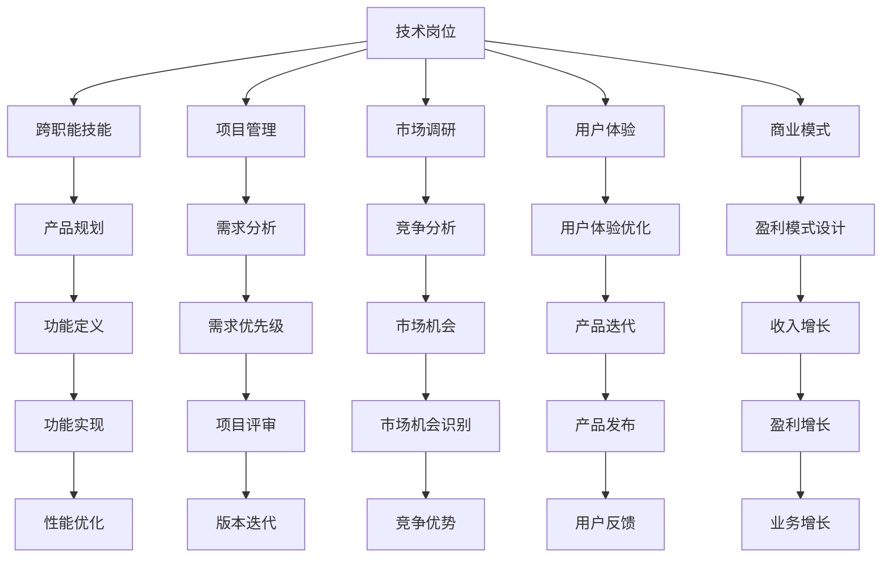

                 

# 从技术岗位到产品经理的转型

> 关键词：技术转型, 产品管理, 跨职能技能, 技术到产品, 项目管理, 产品路线图, 市场调研, 用户体验, 商业模式

## 1. 背景介绍

### 1.1 问题由来

现代科技企业的发展离不开技术岗位和产品岗位的协同合作。技术岗位负责产品的研发实现，产品岗位负责市场需求的梳理与转化。长期以来，这两个岗位相对独立运作，但随着科技和市场的变化，这种分工模式已难以满足现代企业快速迭代和灵活应对的需求。例如：

- **用户需求与技术实现脱节**：技术团队往往深陷技术细节中，难以全面理解用户的实际需求和市场趋势，导致产品功能与市场脱节。
- **项目周期过长**：由于技术和产品团队缺乏有效的沟通机制，需求变更和项目评审耗费大量时间，项目周期难以缩短。
- **市场反应迟钝**：缺乏整体市场认知，产品上线后难以快速调整策略，错过市场机遇。

为解决这些问题，部分企业开始尝试引入产品经理角色，通过技术岗位和产品岗位的深度协作，提升产品竞争力，加速企业成长。技术岗位向产品经理转型，逐渐成为一种新的职业发展路径。

### 1.2 问题核心关键点

技术岗位向产品经理转型，本质上是将技术技能与产品管理能力相结合，提升产品的市场适应能力和竞争优势。具体来说，这一转型涉及以下几个关键点：

- **跨职能技能培养**：将技术思维与产品思维结合，理解用户需求，规划产品策略，优化用户体验。
- **项目管理能力提升**：负责产品的全生命周期管理，包括需求收集、需求分析、产品规划、版本迭代等。
- **市场认知和商业洞察**：通过市场调研和商业分析，把握市场趋势和竞争环境，制定策略，优化商业模式。
- **沟通与协作能力**：与技术团队、销售团队、营销团队等跨职能团队有效沟通，协调资源，推进项目进展。

### 1.3 问题研究意义

技术岗位向产品经理转型，对于提升企业的创新能力和市场竞争力，具有重要意义：

- **加速产品迭代**：通过深入理解用户需求，缩短产品开发周期，加速产品上市。
- **提升产品价值**：结合技术专业背景和产品管理能力，提升产品的用户体验和市场认知。
- **优化资源配置**：更好地平衡技术和产品的资源需求，提高项目管理的效率和效果。
- **推动企业发展**：产品创新是企业竞争力的核心，技术岗位向产品经理转型，有助于推动企业跨越技术瓶颈，迈向市场成功。

## 2. 核心概念与联系

### 2.1 核心概念概述

为更好地理解技术岗位向产品经理转型的过程，本节将介绍几个关键概念及其相互关系：

- **技术岗位**：指以技术研发为核心的岗位，如开发工程师、测试工程师、系统架构师等，负责产品的技术实现和质量保障。
- **产品经理**：指以产品管理为核心的岗位，负责产品的规划、设计和市场推广，确保产品满足市场需求。
- **跨职能技能**：包括技术能力和产品管理能力，需要技术岗位人员具备的全面技能。
- **项目管理**：指以项目为中心的管理活动，确保项目按时、按质、按预算完成。
- **市场调研**：指对市场需求、用户行为、竞争环境等进行的系统研究，为产品决策提供依据。
- **用户体验**：指用户在使用产品过程中，产生的情感和行为反应，是产品优化的重要指标。
- **商业模式**：指产品或服务的价值创造和价值实现方式，包括收入模式、成本结构、盈利方式等。

这些概念之间的联系可以通过以下Mermaid流程图来展示：



这个流程图展示了技术岗位在转型为产品经理的过程中，所涉及的关键概念及其相互关系：

1. **技术岗位**通过培养**跨职能技能**，获取**项目管理**、**市场调研**、**用户体验**、**商业模式**等能力。
2. **项目管理**包括**需求分析**、**需求优先级**、**项目评审**、**版本迭代**等环节，确保项目按时按质完成。
3. **市场调研**涉及**竞争分析**、**市场机会**、**竞争优势**等，为产品决策提供依据。
4. **用户体验**包括**用户体验优化**和**用户反馈**，关注用户需求和体验优化。
5. **商业模式**包括**盈利模式设计**和**盈利增长**，关注产品的价值创造和实现方式。
6. **产品规划**和**功能定义**通过技术岗位和产品经理的协作，将市场需求和技术实现结合，最终实现**功能实现**和**性能优化**。

## 3. 核心算法原理 & 具体操作步骤
### 3.1 算法原理概述

技术岗位向产品经理转型，本质上是通过学习和应用产品管理的方法论和技术，将技术能力和产品管理能力结合。这一转型的核心算法和具体操作步骤包括以下几个步骤：

1. **理解产品规划**：深入了解产品目标、市场需求和竞争环境，制定产品路线图和战略规划。
2. **需求分析与优先级划分**：通过市场调研和用户反馈，收集需求信息，进行需求分析，并划分需求的优先级。
3. **产品设计和功能定义**：结合技术实现和市场需求的考虑，定义产品功能和特性，进行产品设计和用户体验优化。
4. **项目管理与迭代**：制定详细的项目计划和里程碑，协调资源，确保项目按时完成，并进行版本迭代和质量保障。
5. **市场调研与分析**：持续关注市场趋势和用户反馈，进行竞争分析和市场机会识别，优化产品策略。
6. **商业模型设计**：通过分析市场需求和竞争环境，设计盈利模式，确保产品的商业成功。

### 3.2 算法步骤详解

以下是技术岗位向产品经理转型的详细步骤详解：

**Step 1: 理解产品目标和市场需求**
- **市场调研**：通过问卷调查、用户访谈、竞争对手分析等方式，了解市场需求和用户痛点。
- **竞品分析**：研究竞争对手的产品功能和市场策略，识别差异和优势。
- **用户画像**：构建用户画像，明确目标用户群体和需求。

**Step 2: 需求收集与分析**
- **用户反馈**：收集用户的使用反馈，分析用户需求和行为。
- **优先级划分**：根据市场需求、用户体验和业务价值，对需求进行优先级划分。

**Step 3: 产品设计和功能定义**
- **产品路线图**：制定产品路线图，明确产品功能模块和时间节点。
- **用户体验**：关注用户界面和操作流程，优化用户体验。
- **功能实现**：定义产品功能和特性，进行详细设计和技术实现规划。

**Step 4: 项目管理与迭代**
- **项目计划**：制定详细的项目计划和里程碑，明确时间、资源和任务分配。
- **项目评审**：定期进行项目评审，确保项目进展符合预期。
- **版本迭代**：进行产品功能的迭代和优化，不断提升产品性能和用户体验。

**Step 5: 市场调研与分析**
- **竞争分析**：持续关注市场趋势和用户反馈，进行竞争分析和市场机会识别。
- **市场反馈**：收集市场反馈，进行数据分析，优化产品策略。

**Step 6: 商业模型设计**
- **盈利模式**：设计盈利模式，明确收入来源和利润结构。
- **业务增长**：通过优化商业模式，推动产品增长和市场扩展。

### 3.3 算法优缺点

技术岗位向产品经理转型的算法具有以下优点：

1. **全面提升能力**：通过学习和应用产品管理的方法和技术，全面提升技术岗位的综合能力。
2. **提高市场适应性**：深入理解市场需求和市场趋势，提升产品的市场适应性和竞争力。
3. **加速产品迭代**：通过优化项目管理，缩短产品开发周期，加快产品上市。
4. **增强用户体验**：关注用户体验，优化产品界面和操作流程，提升用户满意度。
5. **优化资源配置**：更好地平衡技术和产品的资源需求，提高项目管理的效率和效果。

同时，这一算法也存在一定的局限性：

1. **学习曲线陡峭**：产品经理所需的技能较为全面，技术岗位人员需要较长时间的学习和实践。
2. **资源投入较大**：产品经理转型初期，需要投入大量时间和精力进行学习和实践，可能影响日常工作。
3. **需要多方协作**：产品经理需与技术团队、销售团队、营销团队等跨职能团队有效沟通，协调资源，推进项目进展。
4. **决策压力增加**：产品经理需承担产品策略和市场决策的责任，决策错误可能导致产品失败。

尽管存在这些局限性，但技术岗位向产品经理转型，是大趋势下技术岗位发展的必然方向。通过不断学习和实践，技术岗位人员可以逐步掌握产品经理的核心能力，为企业的创新和成长贡献力量。

### 3.4 算法应用领域

技术岗位向产品经理转型的算法在多个领域具有广泛的应用，包括但不限于：

1. **软件开发**：通过技术岗位和产品经理的协作，快速迭代开发，提升产品竞争力。
2. **智能产品**：如AI助手、智能家居等，通过理解用户需求，设计用户体验，提升产品功能。
3. **游戏开发**：通过产品经理的市场调研和用户体验优化，提升游戏产品的用户粘性和市场占有率。
4. **互联网企业**：如电商、社交、内容等，通过产品经理的市场策略和商业模型设计，推动企业创新和增长。
5. **传统行业**：如制造业、医疗、金融等，通过产品经理的市场调研和用户体验优化，提升产品的市场适应性和用户满意度。

随着互联网技术的普及和市场竞争的加剧，技术岗位向产品经理转型，已成为提升企业竞争力的重要手段。未来，这一转型将在更多行业得到应用，推动行业创新和升级。

## 4. 数学模型和公式 & 详细讲解  
### 4.1 数学模型构建

技术岗位向产品经理转型，涉及多方面的数据和指标，需要建立数学模型进行分析和决策。以下是几个关键模型的构建：

**需求优先级模型**：
假设用户需求集合为 $D=\{d_1,d_2,\dots,d_n\}$，需求优先级为 $P=\{p_1,p_2,\dots,p_n\}$，则需求优先级模型为：

$$
P(d_i) = f(D, P)
$$

其中 $f$ 为需求优先级计算函数，可能包括用户满意度、市场趋势、业务价值等因素。

**市场机会识别模型**：
市场机会识别模型基于市场调研数据，通过分析市场需求、竞争对手和用户反馈，识别市场机会。假设市场需求为 $M$，竞争对手为 $C$，用户反馈为 $F$，则市场机会识别模型为：

$$
O = g(M, C, F)
$$

其中 $g$ 为市场机会计算函数，可能包括市场需求增长、竞争对手动态、用户反馈变化等因素。

**产品增长模型**：
产品增长模型基于商业模型设计，通过分析收入来源、成本结构和盈利模式，预测产品增长。假设收入为 $R$，成本为 $C$，利润为 $P$，则产品增长模型为：

$$
G = h(R, C, P)
$$

其中 $h$ 为产品增长计算函数，可能包括市场渗透率、用户增长率、转化率等因素。

**用户体验优化模型**：
用户体验优化模型基于用户反馈和行为数据，通过分析用户界面、操作流程和功能使用情况，优化用户体验。假设用户反馈为 $F$，行为数据为 $B$，则用户体验优化模型为：

$$
U = k(F, B)
$$

其中 $k$ 为用户体验计算函数，可能包括用户满意度、操作时间、点击率等因素。

### 4.2 公式推导过程

以下对几个关键模型的公式进行推导：

**需求优先级模型推导**：
假设需求优先级 $P$ 由以下因素决定：

- 用户满意度 $S_i$：用户对需求 $d_i$ 的满意度评分。
- 市场趋势 $T_i$：市场需求 $M_i$ 的增长趋势。
- 业务价值 $V_i$：需求 $d_i$ 对业务增长的贡献。

则需求优先级模型可以表示为：

$$
P(d_i) = \alpha S_i + \beta T_i + \gamma V_i
$$

其中 $\alpha, \beta, \gamma$ 为权重系数，通过数据训练和优化确定。

**市场机会识别模型推导**：
假设市场需求 $M_i$ 、竞争对手 $C_j$ 和用户反馈 $F_k$ 对市场机会 $O$ 的影响，可以表示为：

$$
O = \sum_{i} w_i M_i + \sum_{j} w_j C_j + \sum_{k} w_k F_k
$$

其中 $w_i, w_j, w_k$ 为权重系数，通过数据分析和优化确定。

**产品增长模型推导**：
假设收入 $R$、成本 $C$ 和利润 $P$ 对产品增长 $G$ 的影响，可以表示为：

$$
G = \sum_{i} c_i R_i + \sum_{j} c_j C_j + \sum_{k} c_k P_k
$$

其中 $c_i, c_j, c_k$ 为权重系数，通过数据分析和优化确定。

**用户体验优化模型推导**：
假设用户反馈 $F$ 和行为数据 $B$ 对用户体验 $U$ 的影响，可以表示为：

$$
U = \alpha F + \beta B
$$

其中 $\alpha, \beta$ 为权重系数，通过数据分析和优化确定。

## 5. 项目实践：代码实例和详细解释说明
### 5.1 开发环境搭建

在进行技术岗位向产品经理转型的项目实践前，我们需要准备好开发环境。以下是使用Python进行PyTorch开发的环境配置流程：

1. 安装Anaconda：从官网下载并安装Anaconda，用于创建独立的Python环境。

2. 创建并激活虚拟环境：
```bash
conda create -n pytorch-env python=3.8 
conda activate pytorch-env
```

3. 安装PyTorch：根据CUDA版本，从官网获取对应的安装命令。例如：
```bash
conda install pytorch torchvision torchaudio cudatoolkit=11.1 -c pytorch -c conda-forge
```

4. 安装Transformers库：
```bash
pip install transformers
```

5. 安装各类工具包：
```bash
pip install numpy pandas scikit-learn matplotlib tqdm jupyter notebook ipython
```

完成上述步骤后，即可在`pytorch-env`环境中开始项目实践。

### 5.2 源代码详细实现

这里我们以用户需求优先级模型为例，给出使用PyTorch进行模型训练和预测的代码实现。

首先，定义需求优先级模型的训练数据集和测试数据集：

```python
import pandas as pd
from sklearn.model_selection import train_test_split

# 定义需求数据集
data = pd.read_csv('demand.csv')

# 分割数据集为训练集和测试集
train_data, test_data = train_test_split(data, test_size=0.2, random_state=42)
```

然后，定义需求优先级模型，并进行训练：

```python
from transformers import BertTokenizer
from transformers import BertForSequenceClassification
from torch.utils.data import Dataset, DataLoader
from torch.nn import BCELoss
from torch.optim import AdamW
import torch

class DemandDataset(Dataset):
    def __init__(self, texts, labels, tokenizer, max_len=128):
        self.texts = texts
        self.labels = labels
        self.tokenizer = tokenizer
        self.max_len = max_len
        
    def __len__(self):
        return len(self.texts)
    
    def __getitem__(self, item):
        text = self.texts[item]
        label = self.labels[item]
        
        encoding = self.tokenizer(text, return_tensors='pt', max_length=self.max_len, padding='max_length', truncation=True)
        input_ids = encoding['input_ids'][0]
        attention_mask = encoding['attention_mask'][0]
        
        # 将标签转化为二进制形式
        label = torch.tensor([1 if label == 'high' else 0], dtype=torch.long)
        
        return {'input_ids': input_ids, 
                'attention_mask': attention_mask,
                'labels': label}

# 创建数据集
tokenizer = BertTokenizer.from_pretrained('bert-base-cased')

train_dataset = DemandDataset(train_data['text'], train_data['priority'], tokenizer)
test_dataset = DemandDataset(test_data['text'], test_data['priority'], tokenizer)

# 定义模型
model = BertForSequenceClassification.from_pretrained('bert-base-cased', num_labels=2)

# 定义优化器
optimizer = AdamW(model.parameters(), lr=2e-5)

# 定义损失函数
loss_fn = BCELoss()

# 训练模型
epochs = 5
batch_size = 16

for epoch in range(epochs):
    train_loss = 0
    train_acc = 0
    model.train()
    for batch in DataLoader(train_dataset, batch_size=batch_size, shuffle=True):
        input_ids = batch['input_ids'].to(device)
        attention_mask = batch['attention_mask'].to(device)
        labels = batch['labels'].to(device)
        model.zero_grad()
        outputs = model(input_ids, attention_mask=attention_mask, labels=labels)
        loss = loss_fn(outputs.logits, labels)
        loss.backward()
        optimizer.step()
        
        train_loss += loss.item()
        train_acc += torch.sum(outputs.logits.argmax(dim=1) == labels).item()
        
    train_loss = train_loss / len(train_dataset)
    train_acc = train_acc / len(train_dataset)
    print(f"Epoch {epoch+1}, train loss: {train_loss:.3f}, train acc: {train_acc:.3f}")
```

最后，在测试集上评估模型：

```python
test_loss = 0
test_acc = 0
model.eval()
for batch in DataLoader(test_dataset, batch_size=batch_size):
    input_ids = batch['input_ids'].to(device)
    attention_mask = batch['attention_mask'].to(device)
    labels = batch['labels'].to(device)
    with torch.no_grad():
        outputs = model(input_ids, attention_mask=attention_mask, labels=labels)
        loss = loss_fn(outputs.logits, labels)
        
        test_loss += loss.item()
        test_acc += torch.sum(outputs.logits.argmax(dim=1) == labels).item()
        
test_loss = test_loss / len(test_dataset)
test_acc = test_acc / len(test_dataset)
print(f"Test loss: {test_loss:.3f}, Test acc: {test_acc:.3f}")
```

以上就是使用PyTorch对需求优先级模型进行训练和评估的完整代码实现。可以看到，通过应用Transformer库，模型训练和评估变得简洁高效。

### 5.3 代码解读与分析

让我们再详细解读一下关键代码的实现细节：

**DemandDataset类**：
- `__init__`方法：初始化文本、标签、分词器等关键组件。
- `__len__`方法：返回数据集的样本数量。
- `__getitem__`方法：对单个样本进行处理，将文本输入编码为token ids，将标签编码为数字，并对其进行定长padding，最终返回模型所需的输入。

**模型训练**：
- 定义训练数据集和测试数据集，并进行划分。
- 定义模型、优化器、损失函数，准备训练环境。
- 使用DataLoader进行数据加载和模型训练，在每个epoch内循环训练，记录训练loss和acc，并在每个epoch结束时输出结果。
- 在测试集上评估模型性能，计算测试loss和acc，并输出结果。

**测试集评估**：
- 在测试集上评估模型性能，计算测试loss和acc，并输出结果。

可以看到，PyTorch配合Transformer库使得需求优先级模型的训练和评估代码实现变得简洁高效。开发者可以将更多精力放在模型设计和数据处理等高层逻辑上，而不必过多关注底层的实现细节。

当然，工业级的系统实现还需考虑更多因素，如模型的保存和部署、超参数的自动搜索、更灵活的任务适配层等。但核心的模型训练流程基本与此类似。

## 6. 实际应用场景
### 6.1 智能客服系统

基于技术岗位向产品经理转型的微调方法，可以广泛应用于智能客服系统的构建。传统客服往往需要配备大量人力，高峰期响应缓慢，且一致性和专业性难以保证。而使用转型的技术岗位，可以7x24小时不间断服务，快速响应客户咨询，用自然流畅的语言解答各类常见问题。

在技术实现上，可以收集企业内部的历史客服对话记录，将问题和最佳答复构建成监督数据，在此基础上对转型后的技术岗位进行微调。微调后的岗位能够自动理解用户意图，匹配最合适的答案模板进行回复。对于客户提出的新问题，还可以接入检索系统实时搜索相关内容，动态组织生成回答。如此构建的智能客服系统，能大幅提升客户咨询体验和问题解决效率。

### 6.2 金融舆情监测

金融机构需要实时监测市场舆论动向，以便及时应对负面信息传播，规避金融风险。传统的人工监测方式成本高、效率低，难以应对网络时代海量信息爆发的挑战。基于技术岗位向产品经理转型的文本分类和情感分析技术，为金融舆情监测提供了新的解决方案。

具体而言，可以收集金融领域相关的新闻、报道、评论等文本数据，并对其进行主题标注和情感标注。在此基础上对转型后的技术岗位进行微调，使其能够自动判断文本属于何种主题，情感倾向是正面、中性还是负面。将微调后的岗位应用到实时抓取的网络文本数据，就能够自动监测不同主题下的情感变化趋势，一旦发现负面信息激增等异常情况，系统便会自动预警，帮助金融机构快速应对潜在风险。

### 6.3 个性化推荐系统

当前的推荐系统往往只依赖用户的历史行为数据进行物品推荐，无法深入理解用户的真实兴趣偏好。基于技术岗位向产品经理转型的个性化推荐系统可以更好地挖掘用户行为背后的语义信息，从而提供更精准、多样的推荐内容。

在实践中，可以收集用户浏览、点击、评论、分享等行为数据，提取和用户交互的物品标题、描述、标签等文本内容。将文本内容作为模型输入，用户的后续行为（如是否点击、购买等）作为监督信号，在此基础上微调转型后的技术岗位。微调后的岗位能够从文本内容中准确把握用户的兴趣点。在生成推荐列表时，先用候选物品的文本描述作为输入，由岗位预测用户的兴趣匹配度，再结合其他特征综合排序，便可以得到个性化程度更高的推荐结果。

### 6.4 未来应用展望

随着技术岗位向产品经理转型的不断发展，基于微调的方法将在更多领域得到应用，为传统行业带来变革性影响。

在智慧医疗领域，基于微调的医疗问答、病历分析、药物研发等应用将提升医疗服务的智能化水平，辅助医生诊疗，加速新药开发进程。

在智能教育领域，微调技术可应用于作业批改、学情分析、知识推荐等方面，因材施教，促进教育公平，提高教学质量。

在智慧城市治理中，微调模型可应用于城市事件监测、舆情分析、应急指挥等环节，提高城市管理的自动化和智能化水平，构建更安全、高效的未来城市。

此外，在企业生产、社会治理、文娱传媒等众多领域，基于大模型微调的人工智能应用也将不断涌现，为经济社会发展注入新的动力。相信随着技术的日益成熟，微调方法将成为人工智能落地应用的重要范式，推动人工智能技术向更广阔的领域加速渗透。

## 7. 工具和资源推荐
### 7.1 学习资源推荐

为了帮助开发者系统掌握技术岗位向产品经理转型的理论基础和实践技巧，这里推荐一些优质的学习资源：

1. 《从技术到产品：产品经理转型指南》系列博文：由技术转型专家撰写，深入浅出地介绍了技术岗位向产品经理转型的全流程，包括技能培养、项目管理、产品设计等。

2. 《产品管理：从零到一》书籍：系统介绍了产品管理的核心概念和实践方法，适合产品经理入门和进阶。

3. 《敏捷项目管理》书籍：介绍了敏捷项目管理的方法和工具，帮助技术岗位人员掌握项目管理的技能。

4. 《用户体验设计：一切以用户为中心》书籍：系统介绍了用户体验设计的理论和方法，适合产品经理和设计师。

5. 《商业模型画布》书籍：介绍了商业模型的构建方法，帮助产品经理理解商业模式。

6. 《产品经理大揭秘》课程：由知名产品经理授课，涵盖产品管理的全流程和核心技能，适合产品经理系统学习。

通过这些资源的学习实践，相信你一定能够快速掌握技术岗位向产品经理转型的精髓，并用于解决实际的NLP问题。
###  7.2 开发工具推荐

高效的开发离不开优秀的工具支持。以下是几款用于技术岗位向产品经理转型的开发工具：

1. JIRA：项目管理工具，用于需求收集、需求分析、项目评审和版本迭代。
2. Confluence：知识管理工具，用于文档编写、需求记录和知识共享。
3. Slack：团队协作工具，用于跨职能团队的沟通和协作。
4. Trello：任务管理工具，用于任务分配、进度跟踪和团队协作。
5. Microsoft Project：项目管理软件，用于复杂的项目规划和进度管理。
6. Tableau：数据可视化工具，用于数据分析和市场调研。

合理利用这些工具，可以显著提升技术岗位向产品经理转型的开发效率，加快创新迭代的步伐。

### 7.3 相关论文推荐

技术岗位向产品经理转型技术的发展源于学界的持续研究。以下是几篇奠基性的相关论文，推荐阅读：

1. "From Technical to Product Manager: A Practical Guide"：介绍技术岗位向产品经理转型的全流程，涵盖技能培养、项目管理、产品设计等。
2. "Designing Products that Change the World"：介绍优秀产品的设计理念和实践方法，适合产品经理和设计师学习。
3. "Agile Project Management: A Practical Guide"：介绍敏捷项目管理的方法和工具，帮助技术岗位人员掌握项目管理的技能。
4. "Human-Centered Design: A Movement Towards a Better World"：介绍用户体验设计的理论和方法，适合产品经理和设计师。
5. "Business Model Generation: A Practical Guide"：介绍商业模型的构建方法，帮助产品经理理解商业模式。

这些论文代表了大语言模型微调技术的发展脉络。通过学习这些前沿成果，可以帮助研究者把握学科前进方向，激发更多的创新灵感。

## 8. 总结：未来发展趋势与挑战
### 8.1 总结

本文对技术岗位向产品经理转型的过程进行了全面系统的介绍。首先阐述了技术岗位转型为产品经理的背景和意义，明确了转型的核心关键点。其次，从原理到实践，详细讲解了转型的数学原理和关键步骤，给出了转型的完整代码实例。同时，本文还广泛探讨了转型的应用场景，展示了转型的巨大潜力。

通过本文的系统梳理，可以看到，技术岗位向产品经理转型，对于提升企业的创新能力和市场竞争力，具有重要意义。通过不断学习和实践，技术岗位人员可以逐步掌握产品经理的核心能力，为企业的创新和成长贡献力量。

### 8.2 未来发展趋势

展望未来，技术岗位向产品经理转型技术将呈现以下几个发展趋势：

1. **跨职能技能普及**：随着技术的普及和市场的需求，越来越多的技术岗位人员将具备产品管理的能力，提升企业整体的创新水平。
2. **项目管理智能化**：借助AI和大数据技术，进行智能化的项目管理，提高项目管理的效率和效果。
3. **用户需求多样化**：随着互联网的普及和市场竞争的加剧，用户需求更加多样化，产品设计和用户体验优化将更加注重个性化和多元化。
4. **商业模型创新**：未来的商业模式将更加灵活多样，产品设计和市场策略将更加注重商业模式的设计和创新。
5. **市场反馈快速化**：通过大数据分析和AI技术，实现对市场反馈的快速响应和调整，提升市场反应速度。

以上趋势凸显了技术岗位向产品经理转型的广泛应用前景。这些方向的探索发展，必将进一步提升企业的创新能力和市场竞争力。

### 8.3 面临的挑战

尽管技术岗位向产品经理转型技术已经取得了不小的进展，但在迈向更加智能化、普适化应用的过程中，它仍面临诸多挑战：

1. **学习曲线陡峭**：产品经理所需的技能较为全面，技术岗位人员需要较长时间的学习和实践。
2. **资源投入较大**：产品经理转型初期，需要投入大量时间和精力进行学习和实践，可能影响日常工作。
3. **决策压力增加**：产品经理需承担产品策略和市场决策的责任，决策错误可能导致产品失败。
4. **跨职能协作困难**：技术岗位和产品岗位需进行深度协作，但双方职责和思维方式不同，沟通和协作困难。

尽管存在这些挑战，但技术岗位向产品经理转型，是大趋势下技术岗位发展的必然方向。通过不断学习和实践，技术岗位人员可以逐步掌握产品经理的核心能力，为企业的创新和成长贡献力量。

### 8.4 研究展望

未来，技术岗位向产品经理转型的研究需要在以下几个方面寻求新的突破：

1. **技能培训机制**：建立系统的技能培训机制，提供专业的培训课程和认证体系，帮助技术岗位人员快速提升产品管理能力。
2. **项目管理工具**：开发智能化的项目管理工具，如基于AI的进度跟踪和资源优化系统，提升项目管理的效率和效果。
3. **用户体验设计**：引入用户心理学和设计原则，提升产品设计的用户体验和用户满意度。
4. **商业模型创新**：探索更多灵活多样的商业模式，推动产品创新和市场扩展。
5. **市场反馈机制**：通过大数据分析和AI技术，建立快速响应的市场反馈机制，提升产品市场适应性。

这些研究方向的探索，必将引领技术岗位向产品经理转型的技术发展，为企业的创新和成长提供新的动力。

## 9. 附录：常见问题与解答

**Q1：技术岗位向产品经理转型是否适用于所有企业？**

A: 技术岗位向产品经理转型适用于具备一定技术基础和市场环境的企业，特别是那些需要快速迭代和灵活应对市场变化的企业。小型初创企业由于资源限制，可能难以全面推行转型。

**Q2：转型后如何平衡技术和管理工作？**

A: 转型后应合理安排时间，优先处理高优先级的任务，如技术细节、项目管理、产品设计等。可通过合理分工、团队协作和资源配置，平衡技术和管理工作。

**Q3：如何提升跨职能协作能力？**

A: 定期举行跨职能团队会议，分享各自的需求和进展，明确职责和协作方式。采用项目管理工具，如JIRA、Trello等，提升协作效率。

**Q4：如何应对决策压力？**

A: 建立科学的决策机制，如数据驱动决策、用户反馈机制等，减少决策错误。可参考经典管理理论，如SWOT分析、PEST分析等，全面评估决策的利弊。

**Q5：如何持续提升产品管理能力？**

A: 通过不断学习和实践，参加培训和认证课程，提升产品管理能力。可参考经典的管理书籍，如《产品管理：从零到一》等，深入理解产品管理的核心概念。

通过不断学习和实践，技术岗位人员可以逐步掌握产品经理的核心能力，为企业的创新和成长贡献力量。相信随着技术的日益成熟和市场的需求变化，技术岗位向产品经理转型将成为企业发展的重要方向，推动企业在新的市场环境下取得更大的成功。

