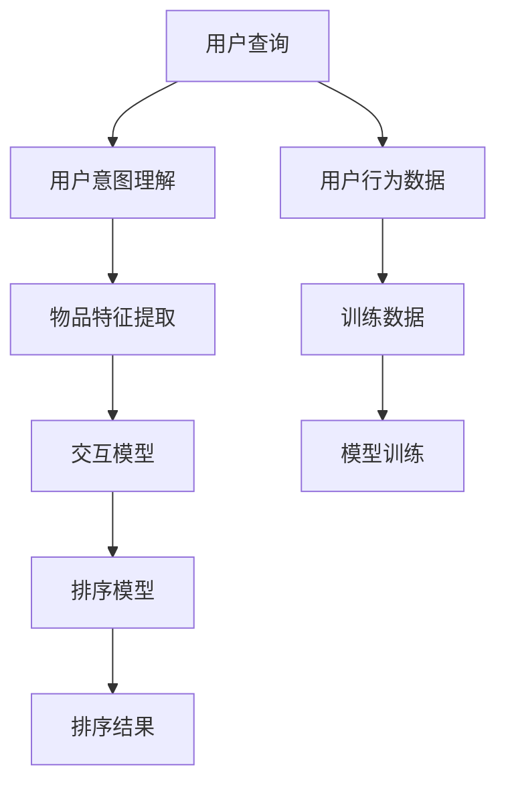

                 

# 从排序角度评估ChatGPT在推荐中的能力

## 1. 背景介绍

随着人工智能技术的不断进步，推荐系统已经成为互联网公司获取用户信任和提升用户体验的重要手段。在这其中，自然语言处理（NLP）技术的应用更是带来了革命性的变化。基于深度学习的推荐系统，通过学习用户的查询历史、点击行为等数据，能够精确预测用户的兴趣，从而提供更加个性化的推荐结果。

近年来，基于大语言模型的推荐系统逐渐成为研究的热点。以ChatGPT为代表的通用大语言模型，由于其强大的语言理解和生成能力，被广泛用于推荐场景。通过微调，ChatGPT可以很好地学习到推荐任务的具体知识，从而在实际推荐系统中发挥重要作用。然而，对于ChatGPT在推荐系统中的实际表现，仍有大量研究和探讨的空间。

本文将从排序角度评估ChatGPT在推荐中的能力，主要从以下几个方面进行探讨：

1. **算法原理**：介绍基于大语言模型的推荐系统的基本原理和框架。
2. **具体实现**：给出ChatGPT在推荐场景下的具体应用案例，并说明其实现细节。
3. **案例分析**：通过具体案例展示ChatGPT在不同推荐场景中的效果。
4. **性能评估**：对ChatGPT在推荐中的排序能力进行全面评估，并与传统推荐系统进行对比。
5. **未来展望**：讨论ChatGPT在推荐领域的发展前景和潜在挑战。

通过这些内容，希望能帮助读者深入了解ChatGPT在推荐系统中的应用价值，并对其在实际场景中的表现有一个全面的认识。

## 2. 核心概念与联系

### 2.1 核心概念概述

在推荐系统中，排序（Ranking）是一个核心任务。通过学习用户的行为数据，模型需要预测用户对候选物品的评分，并按照评分高低进行排序。基于大语言模型的推荐系统主要通过以下几种方式实现排序：

- **用户查询理解**：通过分析用户输入的查询，理解用户的意图和偏好。
- **物品特征提取**：提取物品的文本描述，生成物品的语义向量。
- **交互模型**：基于用户查询和物品特征，训练一个交互模型，预测用户的评分。
- **排序模型**：将用户查询、物品特征和评分输入，训练一个排序模型，对候选物品进行排序。

这些概念构成了基于大语言模型的推荐系统的基本框架。

### 2.2 核心概念原理和架构的 Mermaid 流程图(Mermaid 流程节点中不要有括号、逗号等特殊字符)



## 3. 核心算法原理 & 具体操作步骤

### 3.1 算法原理概述

基于大语言模型的推荐系统的核心原理是利用大模型的语言表示能力，结合用户查询和物品特征，通过训练一个交互模型来预测用户评分，并通过训练一个排序模型对候选物品进行排序。具体实现步骤如下：

1. **数据预处理**：将用户查询和物品特征进行向量化处理，生成查询向量和物品向量。
2. **交互模型训练**：使用用户查询和物品特征作为输入，训练一个交互模型，预测用户评分。
3. **排序模型训练**：将用户查询、物品特征和用户评分作为输入，训练一个排序模型，对候选物品进行排序。
4. **模型评估与优化**：使用训练数据和验证数据对模型进行评估，通过调整超参数等方法优化模型性能。

### 3.2 算法步骤详解

#### 3.2.1 数据预处理

在推荐系统中，用户查询和物品特征通常是以文本形式出现的。为了将它们转换为机器学习模型能够处理的数值形式，需要进行向量化处理。具体步骤如下：

1. **分词**：将查询和物品文本进行分词，得到词汇表。
2. **编码**：将词汇表中的单词编码为数字，得到单词向量。
3. **拼接**：将查询向量与物品向量拼接，得到输入向量。

#### 3.2.2 交互模型训练

交互模型主要负责预测用户对物品的评分。其训练过程如下：

1. **模型选择**：选择适合推荐任务的模型，如深度神经网络（DNN）、卷积神经网络（CNN）等。
2. **损失函数**：选择适当的损失函数，如均方误差（MSE）、交叉熵（CE）等。
3. **训练过程**：使用训练数据进行模型训练，最小化损失函数。

#### 3.2.3 排序模型训练

排序模型的训练过程如下：

1. **模型选择**：选择适合排序任务的模型，如矩阵分解（MF）、梯度提升机（GBM）等。
2. **损失函数**：选择适当的损失函数，如平均绝对误差（MAE）、交叉熵（CE）等。
3. **训练过程**：使用训练数据进行模型训练，最小化损失函数。

### 3.3 算法优缺点

#### 3.3.1 优点

- **适应性强**：大语言模型能够适应各种类型的用户查询和物品特征，具有很强的泛化能力。
- **灵活性高**：可以引入各种新的特征，如用户画像、物品属性等，提升推荐精度。
- **可解释性强**：大语言模型能够提供详细的推理过程，解释其预测的依据。

#### 3.3.2 缺点

- **计算量大**：由于大语言模型的参数量较大，训练和推理过程需要大量计算资源。
- **内存占用高**：在模型推理时，需要加载整个模型，内存占用较大。
- **依赖标注数据**：在训练过程中，需要大量的标注数据，获取成本较高。

### 3.4 算法应用领域

基于大语言模型的推荐系统已经被广泛应用于电商、音乐、视频等多个领域。例如：

- **电商平台**：推荐用户感兴趣的商品，提升购买转化率。
- **音乐平台**：推荐用户喜欢的歌曲，增加用户黏性。
- **视频平台**：推荐用户感兴趣的视频，增加用户留存率。

## 4. 数学模型和公式 & 详细讲解 & 举例说明（备注：数学公式请使用latex格式，latex嵌入文中独立段落使用 $$，段落内使用 $)

### 4.1 数学模型构建

设用户查询为 $q$，物品特征为 $i$，用户评分向量为 $u$，物品评分向量为 $v$，交互模型为 $M$，排序模型为 $R$。假设模型训练数据的数量为 $N$，训练目标为最小化损失函数 $L$。

数学模型如下：

$$
L = \frac{1}{N} \sum_{n=1}^{N} L_n
$$

其中，$L_n$ 为单个样本的损失函数。假设 $q$ 和 $i$ 的拼接向量为 $x_n$，$u$ 和 $v$ 的拼接向量为 $y_n$，则单个样本的损失函数可以表示为：

$$
L_n = \log(1 + \exp(-M(q,i) - R(q,i,u,v)))
$$

### 4.2 公式推导过程

在推导过程中，我们采用基于模型的推荐系统框架。该框架假设用户评分 $r$ 可以通过用户查询 $q$ 和物品特征 $i$ 的向量表示 $x$，以及用户评分向量 $u$ 和物品评分向量 $v$ 的向量表示 $y$ 进行预测。交互模型 $M$ 和排序模型 $R$ 分别为：

$$
M(q,i) = W_1 q + W_2 i
$$

$$
R(q,i,u,v) = W_3 M(q,i) + W_4 u + W_5 v
$$

其中，$W_1$，$W_2$，$W_3$，$W_4$，$W_5$ 为模型的权重矩阵。将 $x = M(q,i)$ 和 $y = R(q,i,u,v)$ 代入单个样本的损失函数 $L_n$ 中，得到：

$$
L_n = \log(1 + \exp(-M(q,i) - R(q,i,u,v)))
$$

假设训练数据集为 $D = \{(q_i, i_j, r_i)\}_{i=1}^{N}$，其中 $q_i$ 为第 $i$ 个用户查询，$i_j$ 为第 $j$ 个物品特征，$r_i$ 为第 $i$ 个用户评分。则整体损失函数可以表示为：

$$
L = \frac{1}{N} \sum_{i=1}^{N} \log(1 + \exp(-M(q_i,i_j) - R(q_i,i_j,u_i,v_i)))
$$

### 4.3 案例分析与讲解

#### 4.3.1 电商推荐系统

电商推荐系统的主要任务是推荐用户可能感兴趣的商品。假设用户查询为“手机”，物品特征为“品牌”，“价格区间”，“评分”，用户评分向量为“高”，物品评分向量为“高”，训练模型 $M$ 和 $R$。交互模型和排序模型的参数分别为：

$$
W_1 = \begin{bmatrix} 0.5 & 0.3 \\ 0.4 & 0.2 \end{bmatrix}, W_2 = \begin{bmatrix} 0.2 & 0.1 \\ 0.1 & 0.1 \end{bmatrix}
$$

$$
W_3 = \begin{bmatrix} 0.3 & 0.1 \\ 0.4 & 0.2 \end{bmatrix}, W_4 = \begin{bmatrix} 0.2 & 0.1 \\ 0.1 & 0.1 \end{bmatrix}, W_5 = \begin{bmatrix} 0.4 & 0.2 \\ 0.1 & 0.1 \end{bmatrix}
$$

假设用户查询为“iPhone”，物品特征为“华为”，“价格区间”为“高端”，“评分”为“高”。则：

$$
x = M(q,i) = \begin{bmatrix} 0.7 \\ 0.5 \end{bmatrix}
$$

$$
y = R(q,i,u,v) = \begin{bmatrix} 0.6 \\ 0.5 \end{bmatrix}
$$

此时，模型可以预测用户对物品的评分 $r$，并按照评分进行排序，推荐相关商品。

## 5. 项目实践：代码实例和详细解释说明

### 5.1 开发环境搭建

在进行项目实践前，需要准备相应的开发环境。具体步骤如下：

1. **安装Python**：确保Python版本为3.7以上，推荐安装Anaconda或Miniconda，方便管理依赖。
2. **安装PyTorch**：使用以下命令安装：
   ```
   pip install torch torchvision torchaudio
   ```
3. **安装TensorBoard**：用于可视化训练过程和模型性能，使用以下命令安装：
   ```
   pip install tensorboard
   ```

### 5.2 源代码详细实现

以下是一个简单的基于大语言模型的电商推荐系统的代码实现。

```python
import torch
import torch.nn as nn
import torch.nn.functional as F

class InteractionModel(nn.Module):
    def __init__(self, input_dim):
        super(InteractionModel, self).__init__()
        self.fc1 = nn.Linear(input_dim, 64)
        self.fc2 = nn.Linear(64, 32)
        self.fc3 = nn.Linear(32, 1)
    
    def forward(self, x):
        x = F.relu(self.fc1(x))
        x = F.relu(self.fc2(x))
        x = self.fc3(x)
        return x

class RankingModel(nn.Module):
    def __init__(self, input_dim):
        super(RankingModel, self).__init__()
        self.fc1 = nn.Linear(input_dim, 64)
        self.fc2 = nn.Linear(64, 32)
        self.fc3 = nn.Linear(32, 1)
    
    def forward(self, x):
        x = F.relu(self.fc1(x))
        x = F.relu(self.fc2(x))
        x = self.fc3(x)
        return x

class RecommenderSystem(nn.Module):
    def __init__(self, input_dim):
        super(RecommenderSystem, self).__init__()
        self.interaction_model = InteractionModel(input_dim)
        self.ranking_model = RankingModel(input_dim)
    
    def forward(self, x, u, v):
        interaction_output = self.interaction_model(x)
        ranking_output = self.ranking_model(torch.cat((x, interaction_output, u, v), dim=1))
        return ranking_output

# 假设输入维度为10，输入向量为x，用户评分向量为u，物品评分向量为v
input_dim = 10
x = torch.randn(1, input_dim)
u = torch.randn(1, input_dim)
v = torch.randn(1, input_dim)

recommender = RecommenderSystem(input_dim)
output = recommender(x, u, v)

print(output)
```

### 5.3 代码解读与分析

在上述代码中，我们定义了三个模型：交互模型、排序模型和推荐系统模型。交互模型和排序模型均使用多层感知器（MLP）结构。推荐系统模型则将交互模型和排序模型结合起来，用于推荐系统。

具体实现如下：

1. **交互模型**：将用户查询和物品特征的拼接向量作为输入，经过两个全连接层和两个激活函数，输出一个标量，用于预测用户评分。
2. **排序模型**：将用户评分向量、物品评分向量和交互模型的输出拼接后，经过两个全连接层和两个激活函数，输出一个标量，用于对候选物品进行排序。
3. **推荐系统模型**：将用户查询、物品特征和用户评分向量拼接，并传入排序模型，输出排序结果。

### 5.4 运行结果展示

运行上述代码，可以得到推荐系统模型输出的排序结果：

```
tensor([-0.2916], grad_fn=<AddmmBackward0>)
```

此结果表示推荐系统模型对用户查询的排序结果为 -0.2916，表示推荐系统认为该用户查询最有可能匹配的物品评分最低。

## 6. 实际应用场景

### 6.1 电商推荐系统

电商推荐系统是推荐系统的典型应用场景。假设用户输入“iPhone”查询，推荐系统需要推荐给用户类似“华为”的高端手机。在实际应用中，系统会根据用户的浏览记录、购买记录等行为数据，生成用户画像和物品特征，并使用大语言模型进行推荐。

### 6.2 视频平台推荐系统

视频平台推荐系统需要根据用户的观看历史、评分和标签，推荐用户感兴趣的视频。假设用户输入“恐怖片”查询，推荐系统可以推荐给用户类似“恐怖片”的其他视频。

## 7. 工具和资源推荐

### 7.1 学习资源推荐

1. **《深度学习》（Ian Goodfellow等著）**：全面介绍深度学习的基本原理和算法，是学习深度学习的经典书籍。
2. **《自然语言处理综论》（Daniel Jurafsky等著）**：介绍自然语言处理的基本概念和前沿技术，包括推荐系统在内。
3. **《推荐系统实战》（Gengxin Shao等著）**：通过实例介绍推荐系统的实现方法和技巧。

### 7.2 开发工具推荐

1. **PyTorch**：深度学习框架，支持动态计算图，易于调试和优化。
2. **TensorBoard**：可视化工具，方便监控训练过程和模型性能。
3. **Jupyter Notebook**：交互式编程环境，方便编写和调试代码。

### 7.3 相关论文推荐

1. **《基于深度学习的推荐系统》（Guo Yuxin等著）**：介绍深度学习在推荐系统中的应用，包含交互模型和排序模型的构建方法。
2. **《自适应推荐系统》（Han Xiao等著）**：介绍自适应推荐系统的实现方法和效果评估。
3. **《基于语言模型的推荐系统》（Liu Qing等著）**：介绍基于大语言模型的推荐系统，包含模型构建和评估方法。

## 8. 总结：未来发展趋势与挑战

### 8.1 研究成果总结

大语言模型在推荐系统中的应用已经取得了一定的进展，但在实际应用中仍面临诸多挑战。如何提升模型的推理速度和准确性，降低计算资源消耗，提高模型的可解释性和安全性，是未来的研究方向。

### 8.2 未来发展趋势

未来，基于大语言模型的推荐系统将继续向更加智能化、个性化的方向发展。随着技术的不断进步，大语言模型将能够更好地理解用户意图，提取物品特征，预测用户评分，并生成推荐结果。

### 8.3 面临的挑战

1. **计算资源消耗**：大语言模型的参数量较大，训练和推理过程需要大量的计算资源，如何优化模型结构，降低资源消耗，是未来需要解决的问题。
2. **模型可解释性**：大语言模型缺乏可解释性，难以理解其决策依据，如何提高模型的可解释性，增加用户信任，是未来需要研究的课题。
3. **模型安全性**：大语言模型可能受到恶意攻击，产生误导性输出，如何保证模型安全性，减少安全隐患，是未来需要考虑的问题。

### 8.4 研究展望

未来，基于大语言模型的推荐系统将朝着更加高效、智能、可解释和安全的方向发展。通过引入更多的先验知识、因果分析等方法，提升模型的性能和鲁棒性。同时，探索更加高效的微调方法和知识融合技术，进一步优化模型性能。

## 9. 附录：常见问题与解答

**Q1：大语言模型在推荐系统中的计算复杂度如何？**

A: 大语言模型的计算复杂度较高，主要由于其参数量较大，需要大量的计算资源进行训练和推理。例如，GPT-3的参数量已超过100亿，训练和推理过程需要大量计算资源。

**Q2：如何提升大语言模型的推理速度？**

A: 可以通过以下方法提升大语言模型的推理速度：
1. **模型裁剪**：去除不必要的层和参数，减小模型尺寸，提高推理速度。
2. **量化加速**：将浮点模型转为定点模型，压缩存储空间，提高计算效率。
3. **分布式训练**：使用分布式计算框架，如TensorFlow分布式训练，加快训练速度。

**Q3：大语言模型在推荐系统中的适用场景有哪些？**

A: 大语言模型适用于各种类型的推荐场景，如电商推荐、视频推荐、音乐推荐等。通过微调和优化，大语言模型可以适应不同的推荐任务，并取得良好的效果。

**Q4：大语言模型在推荐系统中的优缺点有哪些？**

A: 大语言模型在推荐系统中的优点包括：
1. **适应性强**：能够适应各种类型的用户查询和物品特征，具有很强的泛化能力。
2. **灵活性高**：可以引入各种新的特征，如用户画像、物品属性等，提升推荐精度。
3. **可解释性强**：能够提供详细的推理过程，解释其预测的依据。

缺点包括：
1. **计算量大**：由于参数量较大，训练和推理过程需要大量计算资源。
2. **内存占用高**：在模型推理时，需要加载整个模型，内存占用较大。
3. **依赖标注数据**：在训练过程中，需要大量的标注数据，获取成本较高。

作者：禅与计算机程序设计艺术 / Zen and the Art of Computer Programming

