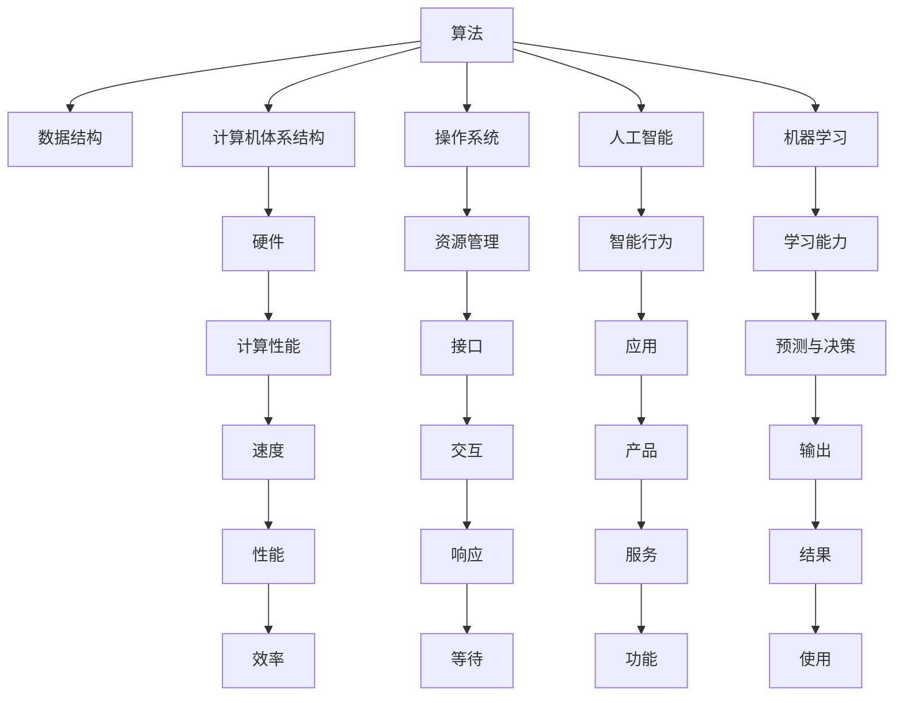

                 

# 从经典开始：奠定基础认知

> 关键词：计算机科学基础，经典算法，数据结构，操作系统，人工智能，机器学习

## 1. 背景介绍

### 1.1 问题由来
在人工智能(AI)和计算机科学领域，有一批经典理论、算法和工具为后续的发展奠定了基础。理解这些经典概念是构建坚实的计算机科学认知和实践能力的重要起点。然而，许多初学者往往在入门阶段就感到困惑：面对成百上千的算法和概念，如何选取核心内容，避免陷入知识海洋中的迷茫？

本文将围绕计算机科学的核心概念，从经典算法和数据结构讲起，帮助读者在快速掌握基础的同时，构建起扎实的知识体系。我们选取了计算机科学中最为基础的几个领域，通过详细讲解和案例分析，循序渐进地介绍经典算法和数据结构，以此为起点，深入探讨人工智能和机器学习领域的基础知识。

### 1.2 问题核心关键点
本文的目的是帮助读者：

1. **构建基础认知**：快速掌握计算机科学核心算法和数据结构，理解其原理和应用。
2. **应用经典理论**：运用经典算法和数据结构解决实际问题，如搜索、排序、图论等。
3. **进阶人工智能**：结合经典算法和数据结构，深入探讨人工智能和机器学习的基础，包括监督学习、非监督学习、强化学习等。

## 2. 核心概念与联系

### 2.1 核心概念概述

计算机科学和人工智能领域有许多核心概念，这里我们将重点介绍几个关键概念，并探讨它们之间的联系：

- **算法(Algorithm)**：解决特定问题的步骤序列，可以通过编程实现。
- **数据结构(Data Structure)**：组织和管理数据的方式，如数组、链表、树等。
- **计算机体系结构(Computer Architecture)**：计算机硬件与软件交互的基础。
- **操作系统(Operating System)**：管理计算机硬件资源，提供给用户和程序的接口。
- **人工智能(Artificial Intelligence, AI)**：创建可模拟人类智能行为的系统。
- **机器学习(Machine Learning, ML)**：通过数据和算法，使计算机具备从数据中学习和做出预测或决策的能力。

这些概念之间相互依赖，共同构成了现代计算机科学和人工智能的基础。理解这些概念及其联系，是构建计算机科学认知和实践能力的关键。

### 2.2 核心概念原理和架构的 Mermaid 流程图



这个流程图展示了算法、数据结构、计算机体系结构、操作系统、人工智能和机器学习等概念之间的联系。算法和数据结构是构建计算机系统的基础，而计算机体系结构和操作系统则是硬件和软件之间的桥梁。人工智能和机器学习则是在这些基础之上，通过算法和数据结构实现智能行为和学习能力。

## 3. 核心算法原理 & 具体操作步骤
### 3.1 算法原理概述

计算机科学和人工智能的核心在于算法，即解决特定问题的步骤序列。算法通常通过编程实现，能够高效、准确地解决实际问题。算法设计需要考虑问题的规模、复杂度和效率，以确保在有限的时间内得到正确的结果。

### 3.2 算法步骤详解

以下是几个经典算法的详细步骤，包括排序算法、搜索算法和图算法：

**排序算法**：

1. 选择合适的排序算法（如冒泡排序、快速排序、归并排序等）。
2. 确定算法的时间复杂度和空间复杂度。
3. 编写算法代码，并进行测试。
4. 优化算法效率，降低时间复杂度。

**搜索算法**：

1. 选择合适的搜索算法（如深度优先搜索、广度优先搜索、A*搜索等）。
2. 确定搜索空间的规模和搜索策略。
3. 编写算法代码，并进行测试。
4. 优化搜索效率，降低时间复杂度。

**图算法**：

1. 选择合适的图算法（如最短路径算法、最小生成树算法、网络流算法等）。
2. 确定图的数据结构（如邻接矩阵、邻接表等）。
3. 编写算法代码，并进行测试。
4. 优化算法效率，降低时间复杂度。

### 3.3 算法优缺点

经典算法通常具有以下优点：

1. **高效性**：能够在较短的时间内解决特定问题。
2. **可解释性**：算法的步骤明确，易于理解和调试。
3. **广泛适用性**：可以应用于多种问题类型。

但同时，经典算法也存在以下缺点：

1. **依赖数据结构**：算法的效率很大程度上取决于数据结构的选择。
2. **复杂度高**：某些算法的时间复杂度较高，可能不适用于大规模数据。
3. **可能不适用**：对于某些特定问题，可能没有现成的经典算法可用。

### 3.4 算法应用领域

经典算法广泛应用于计算机科学的各个领域，包括但不限于：

- **数据处理**：如排序、查找、去重等。
- **图像处理**：如边缘检测、图像分割等。
- **网络通信**：如路由算法、流量控制等。
- **操作系统**：如进程调度、内存管理等。
- **人工智能**：如模式识别、自然语言处理等。
- **机器学习**：如特征提取、分类、回归等。

## 4. 数学模型和公式 & 详细讲解 & 举例说明

### 4.1 数学模型构建

在算法和数据结构的实现中，数学模型起着关键作用。以下是一些常见的数学模型及其应用：

- **线性代数**：矩阵和向量在数据结构和算法中的应用，如矩阵运算、向量空间等。
- **概率论**：随机过程和概率分布的应用，如蒙特卡洛方法、随机化算法等。
- **图论**：图和网络的建模与分析，如最短路径算法、最小生成树算法等。

### 4.2 公式推导过程

以下是几个经典算法的数学推导过程：

**快速排序**：

1. 选择基准值。
2. 将小于基准值的元素移到左侧，大于基准值的元素移到右侧。
3. 递归处理左右两侧的子数组。

数学公式：

$$
快速排序(a, low, high)
$$

其中，$low$ 和 $high$ 表示数组的起始和结束位置，$a$ 表示待排序的数组。

**深度优先搜索**：

1. 访问起始节点。
2. 遍历相邻节点，并将其标记为已访问。
3. 递归访问相邻节点的相邻节点。

数学公式：

$$
DFS(G, s)
$$

其中，$G$ 表示图，$s$ 表示起始节点。

**最小生成树算法**：

1. 构建图。
2. 遍历所有边，选择权值最小的边。
3. 添加权值最小的边，并删除对应的顶点。

数学公式：

$$
Kruskal(G)
$$

其中，$G$ 表示图。

### 4.3 案例分析与讲解

以下通过几个实际案例，展示经典算法和数据结构的应用：

**案例1：旅行商问题**：

问题描述：给定若干个城市和城市之间的距离，求经过所有城市且返回出发城市的最佳路线。

解决方法：使用贪心算法或动态规划算法。

**案例2：哈夫曼编码**：

问题描述：给定一组字符和每个字符出现的频率，设计一种编码方案，使得总编码长度最小。

解决方法：使用哈夫曼树算法。

**案例3：最短路径问题**：

问题描述：给定一个带权图，求任意两个节点之间的最短路径。

解决方法：使用Dijkstra算法或Floyd算法。

## 5. 项目实践：代码实例和详细解释说明

### 5.1 开发环境搭建

以下是使用Python和PyTorch搭建深度学习项目的环境：

1. 安装Anaconda：从官网下载并安装Anaconda，用于创建独立的Python环境。

2. 创建并激活虚拟环境：
```bash
conda create -n pytorch-env python=3.8 
conda activate pytorch-env
```

3. 安装PyTorch：根据CUDA版本，从官网获取对应的安装命令。例如：
```bash
conda install pytorch torchvision torchaudio cudatoolkit=11.1 -c pytorch -c conda-forge
```

4. 安装TensorBoard：用于可视化模型训练过程。
```bash
pip install tensorboard
```

### 5.2 源代码详细实现

以下是一个简单的Python程序，展示如何使用PyTorch实现神经网络：

```python
import torch
import torch.nn as nn
import torch.optim as optim

# 定义神经网络模型
class NeuralNet(nn.Module):
    def __init__(self):
        super(NeuralNet, self).__init__()
        self.fc1 = nn.Linear(784, 128)
        self.fc2 = nn.Linear(128, 64)
        self.fc3 = nn.Linear(64, 10)

    def forward(self, x):
        x = x.view(-1, 784)
        x = torch.relu(self.fc1(x))
        x = torch.relu(self.fc2(x))
        x = self.fc3(x)
        return x

# 训练神经网络
def train(model, device, train_loader, optimizer, epochs):
    model.to(device)
    criterion = nn.CrossEntropyLoss()
    for epoch in range(epochs):
        for batch_idx, (data, target) in enumerate(train_loader):
            data, target = data.to(device), target.to(device)
            optimizer.zero_grad()
            output = model(data)
            loss = criterion(output, target)
            loss.backward()
            optimizer.step()

# 测试神经网络
def test(model, device, test_loader):
    model.eval()
    correct = 0
    total = 0
    with torch.no_grad():
        for data, target in test_loader:
            data, target = data.to(device), target.to(device)
            output = model(data)
            _, predicted = torch.max(output.data, 1)
            total += target.size(0)
            correct += (predicted == target).sum().item()
    print('Accuracy: {} %'.format(100 * correct / total))

# 训练和测试
train_loader = ...
test_loader = ...
model = NeuralNet().to('cuda')
optimizer = optim.SGD(model.parameters(), lr=0.01, momentum=0.5)
train(model, 'cuda', train_loader, optimizer, epochs=10)
test(model, 'cuda', test_loader)
```

### 5.3 代码解读与分析

让我们再详细解读一下关键代码的实现细节：

**NeuralNet类**：
- `__init__`方法：定义神经网络的层结构，包括全连接层和激活函数。
- `forward`方法：定义前向传播过程。

**train函数**：
- 将数据和标签移动到设备（如GPU）。
- 零梯度，进行前向传播和反向传播。
- 更新模型参数。

**test函数**：
- 将模型设置为评估模式，不进行梯度更新。
- 使用测试集进行预测，计算准确率。

### 5.4 运行结果展示

运行上述代码，将得到神经网络的训练和测试结果。在训练过程中，通过TensorBoard可以实时监控损失函数和准确率的变化，帮助调试模型参数和优化算法。

## 6. 实际应用场景

### 6.1 机器学习应用

神经网络是一种广泛应用于机器学习领域的经典算法，被广泛应用于图像识别、自然语言处理、语音识别等场景。例如，可以使用神经网络对手写数字进行识别，或对文本进行情感分析。

### 6.2 计算机视觉应用

神经网络在计算机视觉领域也得到了广泛应用。例如，可以使用卷积神经网络（CNN）对图像进行分类、分割、检测等任务。

### 6.3 自然语言处理应用

神经网络在自然语言处理中也展示了强大的能力。例如，可以使用循环神经网络（RNN）和Transformer模型进行机器翻译、文本生成、文本分类等任务。

### 6.4 未来应用展望

随着深度学习和人工智能技术的发展，神经网络在更多领域得到应用，未来将展现出更大的潜力。例如，在自动驾驶、智能家居、医疗诊断等领域，神经网络将带来深远影响。

## 7. 工具和资源推荐

### 7.1 学习资源推荐

为了帮助读者系统掌握神经网络和深度学习，以下是一些优质的学习资源：

1. 《深度学习》（Ian Goodfellow、Yoshua Bengio和Aaron Courville著）：深度学习领域的经典教材，涵盖了神经网络和深度学习的基础和进阶内容。
2. 《Python深度学习》（Francois Chollet著）：适合初学者的深度学习教材，以Keras框架为基础，讲解了深度学习的核心概念和应用。
3. 《TensorFlow实战》（Michael Abdou和Geoffrey Tucker著）：详细介绍了TensorFlow框架的使用方法和经典应用案例。
4. 《机器学习实战》（Peter Harrington著）：适合实践学习的机器学习教材，提供了丰富的代码示例和项目实战案例。
5. 《Deep Learning Specialization》（Andrew Ng教授开设的Coursera课程）：由深度学习领域的大师Andrew Ng主讲，系统讲解了深度学习的基础知识和应用。

### 7.2 开发工具推荐

以下是几个常用的开发工具，用于神经网络和深度学习的开发：

1. PyTorch：由Facebook开发的深度学习框架，以其动态计算图和灵活性著称。
2. TensorFlow：由Google主导开发的深度学习框架，生产部署方便，适合大规模工程应用。
3. Keras：一个高层神经网络API，可以运行于TensorFlow、Theano、CNTK等后端，易于上手。
4. Jupyter Notebook：一个交互式的Python开发环境，适合编写和调试代码，生成报告和文档。
5. PyCharm：一个功能强大的Python IDE，提供了代码补全、调试、版本控制等丰富功能。

### 7.3 相关论文推荐

以下是几篇经典论文，推荐阅读：

1. 《深度学习》（Goodfellow et al.，2016）：深度学习领域的经典教材，系统介绍了深度学习的基本概念和算法。
2. 《ImageNet分类》（Alex Krizhevsky、Ilya Sutskever和Geoffrey Hinton，2012）：介绍了一种基于深度卷积神经网络的图像分类方法，获得了2012年ImageNet挑战赛的冠军。
3. 《Google的BERT模型》（Devlin et al.，2018）：介绍了一种基于预训练和微调的Transformer模型，在多个NLP任务上取得了SOTA表现。
4. 《AlphaGo Zero》（Silver et al.，2017）：介绍了一种基于深度强化学习的围棋AI系统，通过自我对弈训练，达到了人类顶尖水平。
5. 《GPT-3》（Brown et al.，2020）：介绍了一种基于大规模预训练语言模型的生成式AI系统，展示了自然语言处理的最新进展。

## 8. 总结：未来发展趋势与挑战

### 8.1 研究成果总结

本文系统介绍了计算机科学和人工智能领域的核心概念和经典算法，包括数据结构、算法、神经网络和深度学习。这些概念和算法构成了现代计算机科学和人工智能的基础，对技术研究和工程实践具有重要意义。

### 8.2 未来发展趋势

展望未来，深度学习和人工智能技术将继续快速演进，以下趋势将引领新一轮的突破：

1. **多模态学习**：结合视觉、听觉和文本等多模态数据，提升模型的综合能力。
2. **自监督学习**：利用无标签数据进行预训练，提升模型的泛化能力。
3. **强化学习**：通过与环境的互动，实现智能决策和控制。
4. **迁移学习**：利用已有知识，加速新任务的训练过程。
5. **模型压缩和优化**：通过模型压缩、量化等方法，提升模型的效率和可部署性。
6. **隐私保护和伦理**：关注隐私保护和伦理问题，确保技术的安全和公平。

### 8.3 面临的挑战

尽管深度学习和人工智能技术取得了显著进展，但仍面临诸多挑战：

1. **数据质量**：数据质量和多样性直接影响模型的性能。
2. **模型可解释性**：深度学习模型的复杂性导致其可解释性不足，限制了其应用范围。
3. **资源消耗**：大规模模型的计算和存储需求较高，限制了其在大规模应用中的部署。
4. **公平性和偏见**：深度学习模型可能学习到偏见和歧视，需要严格审查和监管。
5. **安全和隐私**：深度学习模型的输出可能存在误导性或侵犯隐私，需要加强防护。

### 8.4 研究展望

面对这些挑战，未来的研究需要在以下几个方向取得突破：

1. **提高数据质量**：通过数据清洗和增强，提升模型的训练效果。
2. **增强模型可解释性**：开发可解释的模型和工具，帮助理解模型行为。
3. **优化资源消耗**：通过模型压缩、量化等技术，提升模型的效率和可部署性。
4. **消除偏见和歧视**：在设计模型时引入公平性和公正性约束，减少模型的偏见和歧视。
5. **保护隐私和安全**：通过差分隐私等技术，保护数据隐私和模型安全。

## 9. 附录：常见问题与解答

**Q1：如何理解神经网络的层次结构？**

A: 神经网络的层次结构可以理解为多个层次的特征提取和特征融合过程。每一层通过一系列线性变换和非线性激活函数，提取和转换输入数据的特征。通过层层叠加，神经网络能够学习到高层次的抽象特征，从而进行复杂的任务处理。

**Q2：神经网络中的反向传播算法是什么？**

A: 反向传播算法是神经网络中的一种优化方法，用于计算损失函数对网络参数的梯度。具体步骤如下：

1. 计算输出层的损失函数。
2. 反向传播计算每个层的梯度。
3. 使用梯度下降等方法更新网络参数。

**Q3：如何优化深度学习模型的效率？**

A: 深度学习模型的优化可以从以下几个方面进行：

1. 数据增强：通过数据增强，扩充训练集，提高模型的泛化能力。
2. 模型压缩：通过模型压缩技术，减小模型大小，提升计算效率。
3. 量化和稀疏化：将浮点模型转为定点模型，减小存储空间和计算资源消耗。
4. 并行计算：通过并行计算，提升模型的训练和推理速度。

**Q4：什么是卷积神经网络（CNN）？**

A: 卷积神经网络是一种专门用于图像处理的神经网络，通过卷积层、池化层和全连接层等组成。CNN能够自动提取图像的特征，并进行分类、检测等任务。

**Q5：机器学习中的监督学习和无监督学习的区别是什么？**

A: 监督学习和无监督学习是机器学习的两种主要方法：

- 监督学习：使用标注数据进行训练，模型学习输入和输出之间的映射关系。
- 无监督学习：使用无标注数据进行训练，模型学习数据的内部结构或特征。

通过理解这些基础概念和算法，读者可以更好地把握深度学习和人工智能技术的发展方向，掌握前沿技术，推动技术的创新和应用。

---

作者：禅与计算机程序设计艺术 / Zen and the Art of Computer Programming

