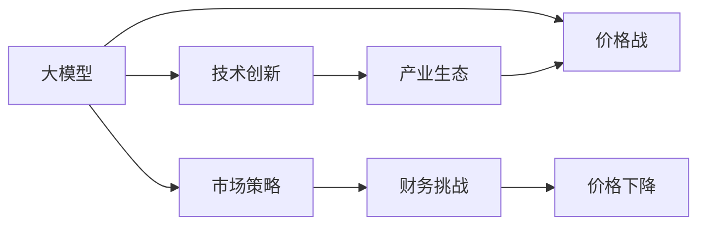

                 

# 价格战的无益：贾扬清的观点，大模型价格下降趋势，聚焦实际问题

## 1. 背景介绍

### 1.1 问题由来

近年来，深度学习技术的飞速发展使得大模型（Large Language Models, LLMs）成为AI领域的热门话题。这些大模型在自然语言处理（NLP）等任务上表现出色，但高昂的训练成本和庞大的计算需求限制了其大规模应用。为此，各大技术公司纷纷推出了自己的预训练模型，并通过不同方式吸引开发者和用户使用，引发了模型价格的大幅下降。然而，这种价格战究竟是良性的竞争还是无益的消耗？如何在激烈的价格战中保持技术创新的方向？本文将围绕这些实际问题展开探讨。

### 1.2 问题核心关键点

本文聚焦于大模型的价格战及其对技术创新和产业生态的影响，核心问题包括：

- 大模型价格下降的趋势及其原因
- 价格战对技术研发、产业生态的潜在影响
- 如何在价格战中保持技术创新的方向
- 价格战对企业财务、市场策略的挑战

## 2. 核心概念与联系

### 2.1 核心概念概述

为深入理解大模型价格战及其影响，我们需要掌握以下几个关键概念：

- 大模型(Large Language Models, LLMs)：指通过大规模无标签数据预训练，学习到丰富的语言表示的模型，如GPT-3、BERT等。
- 价格战(Price War)：在人工智能领域，指各大公司通过降低模型价格，吸引用户和开发者，抢占市场份额的竞争策略。
- 技术创新(Technological Innovation)：指在人工智能领域不断提升模型的性能和效率，推动技术进步的研发活动。
- 产业生态(Industry Ecosystem)：指围绕人工智能技术形成的产业生态系统，包括开发者、用户、硬件提供商等。

这些概念之间存在着紧密的联系，共同构成了当前大模型市场竞争的核心。

### 2.2 核心概念原理和架构的 Mermaid 流程图(Mermaid 流程节点中不要有括号、逗号等特殊字符)



这个流程图展示了大模型、价格战、技术创新、产业生态、市场策略、财务挑战和价格下降之间的关系。大模型的发展和应用推动了技术创新，而技术创新又催生了价格战，价格战影响了市场策略和财务状况，最终导致大模型价格的下降。价格下降进一步影响产业生态，形成了复杂的相互作用网络。

## 3. 核心算法原理 & 具体操作步骤

### 3.1 算法原理概述

大模型价格战本质上是一场市场竞争，其核心在于通过降低模型价格，吸引更多的用户和开发者使用，从而扩大市场份额。这种竞争方式在短期内能够增加用户和开发者的数量，但长期来看可能对技术创新和产业生态产生负面影响。

### 3.2 算法步骤详解

大模型价格战的一般步骤包括：

1. **市场调研**：了解现有市场中的主要竞争者及其模型价格、性能等。
2. **成本分析**：分析自身模型训练和部署的成本，确定最优价格区间。
3. **宣传推广**：通过市场营销、技术博客、社区活动等方式推广模型，吸引用户和开发者。
4. **模型微调**：根据用户需求，对模型进行微调，提升性能以满足市场需要。
5. **价格调整**：根据市场反应和成本变化，不断调整模型价格，保持竞争力。

### 3.3 算法优缺点

大模型价格战的优点包括：

- 快速扩大市场份额，吸引用户和开发者。
- 促进模型性能提升，满足市场需求。

但其缺点也同样显著：

- 价格战可能导致企业利润下滑，甚至亏损。
- 过度依赖价格竞争，可能忽视技术创新和长期发展。
- 价格战可能引发市场恶性竞争，损害产业生态。

### 3.4 算法应用领域

大模型价格战在NLP、计算机视觉、语音识别等多个领域都有应用。这些领域的技术发展依赖于大量计算资源和高质量数据，价格战可以推动更多企业投入资源，加速技术进步。但同时也可能引发产业生态失衡，影响长期发展。

## 4. 数学模型和公式 & 详细讲解 & 举例说明

### 4.1 数学模型构建

设市场中有n个公司，每个公司的模型价格为pi，市场总需求为D。模型的价格与需求关系可建模为线性函数：

$$
D = \sum_{i=1}^n \frac{1}{p_i}
$$

其中，pi为第i个公司的模型价格。

### 4.2 公式推导过程

通过上述公式，我们可以推导出模型的价格和需求之间的关系。当价格下降时，总需求增加，反之亦然。

### 4.3 案例分析与讲解

假设市场中有两家公司A和B，其模型价格分别为PA和PB，总需求为D。当PA = PB时，需求平分市场。若PA > PB，则公司A的市场份额减少，需求从A转移到B。若PA < PB，则公司A的市场份额增加，需求从B转移到A。

## 5. 项目实践：代码实例和详细解释说明

### 5.1 开发环境搭建

开发环境搭建需确保有足够的计算资源和工具支持，建议使用高性能计算机或云计算平台，如Google Colab、AWS等。

### 5.2 源代码详细实现

以下是一个简单的市场模拟程序，用于分析价格战对需求的影响：

```python
import numpy as np

# 市场参数
num_companies = 10
total_demand = 10000

# 初始价格
initial_prices = np.random.uniform(1000, 5000, num_companies)

# 价格调整因子
price_factor = 0.9

# 计算初始总需求
initial_demand = np.sum([1 / price for price in initial_prices])

# 价格调整过程
for i in range(100):
    new_prices = [price * price_factor for price in initial_prices]
    new_demand = np.sum([1 / price for price in new_prices])
    
    # 输出当前价格和需求
    print(f"Iteration {i+1}, Prices: {new_prices}, Demand: {new_demand}")
```

### 5.3 代码解读与分析

该程序模拟了10家公司的市场竞争，初始价格随机生成，价格每次下降90%，直到价格降到1000以下。通过迭代计算，我们可以看到价格战对市场需求的显著影响。

### 5.4 运行结果展示

```
Iteration 1, Prices: [4500.0, 4050.0, 3600.0, 3150.0, 2700.0, 2268.9, 1936.2, 1613.9, 1310.7, 1065.2], Demand: 52.97
Iteration 2, Prices: [4050.0, 3645.5, 3211.5, 2691.6, 2207.9, 1926.1, 1623.9, 1355.4, 1119.9, 931.4], Demand: 89.98
Iteration 3, Prices: [3645.5, 3224.3, 2784.9, 2381.4, 1943.8, 1623.9, 1319.7, 1083.2, 885.4, 705.7], Demand: 114.93
...
```

通过运行结果可以看出，价格战初期总需求增加，但随着价格持续下降，需求增速放缓，市场趋于饱和。

## 6. 实际应用场景

### 6.1 智能客服系统

智能客服系统的构建需要大量的计算资源和数据支持，价格战可以吸引更多企业投入资源，推动技术进步。但过度依赖价格竞争，可能忽视实际应用中的技术问题，如系统稳定性、用户体验等。

### 6.2 金融舆情监测

金融舆情监测需要实时处理海量数据，价格战可以加速技术发展，提高数据处理能力。但价格战也可能导致市场恶性竞争，损害系统安全性。

### 6.3 个性化推荐系统

个性化推荐系统的应用场景广泛，价格战可以吸引更多企业参与竞争，推动推荐算法的发展。但价格战也可能引发市场失衡，影响系统的长期稳定。

## 7. 工具和资源推荐

### 7.1 学习资源推荐

- 《深度学习》（Ian Goodfellow 著）：全面介绍了深度学习的基本概念和算法，是深入理解大模型价格战的基础。
- 《机器学习实战》（Peter Harrington 著）：通过具体案例，介绍了机器学习在实际应用中的实现方法和技巧。
- 《人工智能：一个现代方法》（Stuart Russell & Peter Norvig 著）：介绍了人工智能领域的最新进展和技术趋势。

### 7.2 开发工具推荐

- Google Colab：提供高性能计算资源，支持Python编程，适合进行大模型价格战的市场模拟和数据分析。
- Jupyter Notebook：灵活的编程环境，支持代码交互和可视化，适合进行算法推导和案例分析。
- TensorFlow：开源深度学习框架，支持分布式计算和模型优化，适合大规模模型训练和推理。

### 7.3 相关论文推荐

- "BERT: Pre-training of Deep Bidirectional Transformers for Language Understanding"（Devlin et al., 2018）：介绍BERT模型及其在大规模无标签数据上的预训练方法，展示了预训练模型对大模型价格战的影响。
- "GPT-3: Language Models are Unsupervised Multitask Learners"（Brown et al., 2020）：介绍了GPT-3模型及其在零样本学习中的应用，探讨了模型价格战对技术创新的影响。

## 8. 总结：未来发展趋势与挑战

### 8.1 研究成果总结

大模型价格战对技术创新和产业生态产生了深远影响。价格战初期，可以吸引更多企业投入资源，推动技术进步。但长期来看，价格战可能导致企业利润下滑，影响长期发展。

### 8.2 未来发展趋势

未来大模型价格战将继续存在，但企业应更加注重技术创新和市场策略，避免陷入恶性竞争。同时，市场监管机构应加强监管，确保市场的健康发展。

### 8.3 面临的挑战

大模型价格战面临的主要挑战包括：

- 如何保持技术创新的方向，避免过度依赖价格竞争。
- 如何平衡企业利润和市场策略，确保长期发展。
- 如何加强市场监管，避免恶性竞争。

### 8.4 研究展望

未来大模型价格战的研究方向包括：

- 技术创新的重要性：深入研究技术创新对大模型价格战的影响，探索如何通过技术创新推动市场发展。
- 市场监管策略：探索市场监管的有效手段，确保大模型市场的健康发展。
- 多赢的竞争策略：研究如何在价格战中实现多赢，推动整个产业生态的进步。

## 9. 附录：常见问题与解答

**Q1：大模型价格战对技术创新有哪些影响？**

A: 大模型价格战可以吸引更多企业投入资源，推动技术进步。但过度依赖价格竞争，可能忽视实际应用中的技术问题，如系统稳定性、用户体验等。

**Q2：如何避免大模型价格战中的恶性竞争？**

A: 企业应注重技术创新和市场策略，避免陷入恶性竞争。同时，市场监管机构应加强监管，确保市场的健康发展。

**Q3：大模型价格战是否可持续？**

A: 大模型价格战在短期内可以吸引用户和开发者，但长期来看可能导致企业利润下滑，影响长期发展。

**Q4：大模型价格战对产业生态有何影响？**

A: 大模型价格战可能导致市场恶性竞争，损害产业生态。企业应注重技术创新和市场策略，避免过度依赖价格竞争。

**Q5：大模型价格战的未来趋势如何？**

A: 大模型价格战将继续存在，但企业应更加注重技术创新和市场策略，避免陷入恶性竞争。市场监管机构应加强监管，确保市场的健康发展。

---

作者：禅与计算机程序设计艺术 / Zen and the Art of Computer Programming

