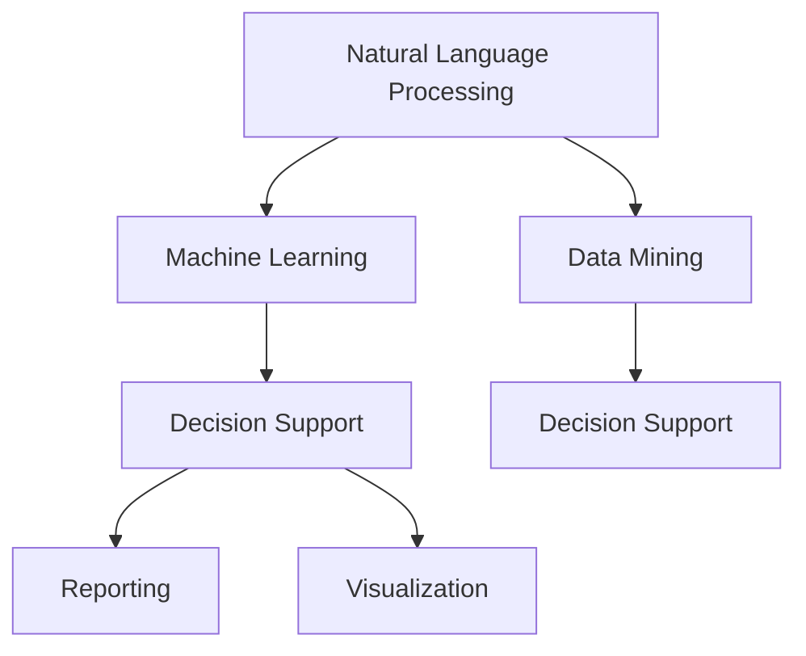

                 

# 企业AI决策支持：Lepton AI的智能分析工具

> 关键词：AI决策支持系统, Lepton AI, 智能分析, 自然语言处理, 数据挖掘, 机器学习

## 1. 背景介绍

### 1.1 问题由来
在信息化时代，企业决策变得更加复杂和多元。随着数据量的爆炸式增长，仅依靠传统的数据报表和人工分析，难以满足高复杂度、高时效性的决策需求。如何从海量数据中挖掘出有价值的信息，快速做出科学决策，成为企业信息化的重要课题。

与此同时，人工智能(AI)技术的快速发展，尤其是自然语言处理(NLP)和机器学习(ML)技术的突破，为企业决策支持提供了新的思路。Lepton AI的智能分析工具，正是在这一背景下应运而生的。

### 1.2 问题核心关键点
Lepton AI的智能分析工具，以企业需求为导向，将AI技术深度融入企业决策过程，实现了数据驱动的智能决策支持。其主要特点包括：

- **高效数据处理**：通过智能算法和分布式架构，处理海量数据，实现实时计算。
- **精准分析洞察**：运用自然语言处理和机器学习技术，深入挖掘数据背后的业务洞见。
- **易用性高**：界面直观友好，无需复杂编程，快速上手。
- **多领域覆盖**：涵盖财务、销售、市场等多个业务领域，为企业提供全方位支持。
- **可扩展性强**：模块化设计，便于功能定制和集成扩展。

这些特点，使Lepton AI的智能分析工具在企业决策支持中，发挥了巨大的作用。

## 2. 核心概念与联系

### 2.1 核心概念概述

Lepton AI的智能分析工具，融合了自然语言处理(NLP)、机器学习(ML)和数据挖掘等前沿技术，提供了一系列的企业决策支持解决方案。核心概念包括：

- **自然语言处理(NLP)**：处理和理解人类语言的技术，使机器能够“读懂”文本信息，提取关键要素。
- **机器学习(ML)**：通过数据训练模型，实现对数据的预测和分类，辅助决策。
- **数据挖掘**：从海量数据中发现隐藏的知识和规律，提供决策依据。

这些核心技术之间相互配合，构成了Lepton AI的智能分析工具的强大技术体系。

### 2.2 核心概念原理和架构的 Mermaid 流程图



这个流程图展示了Lepton AI智能分析工具的核心架构和技术流程：

1. **自然语言处理(NLP)**：从文本数据中提取结构化信息，如实体识别、情感分析、主题建模等。
2. **机器学习(ML)**：训练和部署预测模型，如回归、分类、聚类等，用于预测和分类。
3. **数据挖掘**：从大数据中挖掘出有价值的知识，如关联规则、异常检测等。
4. **决策支持**：结合以上技术，辅助企业做出科学决策。
5. **报告和可视化**：将分析结果以图表、报告等形式呈现，便于用户理解和使用。

## 3. 核心算法原理 & 具体操作步骤

### 3.1 算法原理概述

Lepton AI的智能分析工具，基于先进的AI技术，实现了高效、精准的企业决策支持。其核心算法原理包括：

- **自然语言处理(NLP)**：使用Transformer模型和BERT等预训练模型，进行文本预处理和特征提取。
- **机器学习(ML)**：运用随机森林、梯度提升树、深度学习等算法，构建预测模型。
- **数据挖掘**：应用关联规则、异常检测、时间序列分析等算法，挖掘数据背后的规律。

### 3.2 算法步骤详解

1. **数据准备**：
   - 收集企业业务数据，包括财务报表、销售记录、市场分析等。
   - 清洗和预处理数据，去除噪声和异常值。

2. **文本分析**：
   - 使用NLP技术，如BERT、GPT等模型，进行文本预处理和特征提取。
   - 应用实体识别、情感分析、主题建模等技术，从文本中提取关键信息。

3. **模型训练**：
   - 根据企业需求，选择适合的机器学习算法，如回归、分类、聚类等。
   - 利用历史数据，训练和验证预测模型，调整超参数，确保模型精度。

4. **数据挖掘**：
   - 应用关联规则、异常检测、时间序列分析等算法，挖掘数据背后的规律和洞见。
   - 将挖掘结果集成到分析模型中，辅助决策。

5. **决策支持**：
   - 结合NLP、ML和数据挖掘技术，生成多维度分析报告和可视化图表。
   - 根据企业需求，自动生成决策建议和预警。

6. **报告和可视化**：
   - 使用图表、仪表盘等可视化工具，将分析结果直观展示。
   - 生成详细的报告，包含关键洞察和决策建议。

### 3.3 算法优缺点

**优点**：

- **高效处理海量数据**：采用分布式架构和高效的计算算法，处理海量数据，实现实时计算。
- **精准分析洞见**：运用先进的NLP和ML技术，深入挖掘数据背后的业务洞见。
- **易于使用**：界面直观友好，无需复杂编程，快速上手。
- **多领域覆盖**：涵盖财务、销售、市场等多个业务领域，提供全方位支持。
- **灵活可扩展**：模块化设计，便于功能定制和集成扩展。

**缺点**：

- **数据质量依赖性强**：模型效果取决于数据质量，需要高质量、完整的数据支持。
- **模型需要持续维护**：模型需要定期更新和维护，保持模型精度和适用性。
- **技术门槛较高**：涉及多项先进技术，对技术人员有较高的技术要求。

## 4. 数学模型和公式 & 详细讲解 & 举例说明

### 4.1 数学模型构建

Lepton AI的智能分析工具，涉及多个数学模型，包括自然语言处理、机器学习和数据挖掘等领域的模型。以下以回归模型为例，介绍其数学模型构建过程。

假设我们有一个线性回归模型 $y=f(x;\theta)=\theta_0+\theta_1x_1+\theta_2x_2+\cdots+\theta_nx_n$，其中 $x=(x_1,x_2,\cdots,x_n)$ 为自变量，$y$ 为因变量，$\theta=(\theta_0,\theta_1,\cdots,\theta_n)$ 为模型参数。

### 4.2 公式推导过程

我们采用最小二乘法求解回归模型参数。最小二乘法的目标是最小化预测值与真实值之间的误差平方和，即：

$$
\min_{\theta} \sum_{i=1}^n (y_i - f(x_i;\theta))^2
$$

其梯度为：

$$
\frac{\partial}{\partial \theta_j} \sum_{i=1}^n (y_i - f(x_i;\theta))^2 = -2\sum_{i=1}^n (y_i - f(x_i;\theta))x_{ij}
$$

其中 $x_{ij}$ 为第 $i$ 个样本的第 $j$ 个自变量。

通过求解上述梯度方程，即可得到回归模型的参数 $\theta$。

### 4.3 案例分析与讲解

假设我们有一组销售数据，包含销售量、广告费、季节等因素。我们希望建立一个回归模型，预测下个月的销售量。

1. **数据预处理**：收集销售数据，并进行清洗和归一化处理。
2. **特征选择**：选择广告费、季节等关键特征。
3. **模型训练**：利用历史数据，构建线性回归模型，求解参数 $\theta$。
4. **模型验证**：在验证集上评估模型效果，调整参数。
5. **模型应用**：利用训练好的模型，预测下个月的销售量，并生成报告。

## 5. 项目实践：代码实例和详细解释说明

### 5.1 开发环境搭建

Lepton AI的智能分析工具，支持Python和R语言。以下以Python为例，介绍开发环境搭建流程。

1. **安装Python和相关库**：
   ```
   conda create -n lepton python=3.8
   conda activate lepton
   pip install numpy pandas scikit-learn transformers tensorflow
   ```

2. **安装Lepton AI**：
   ```
   pip install lepton-ai
   ```

3. **创建虚拟环境**：
   ```
   conda create --name myenv
   conda activate myenv
   ```

### 5.2 源代码详细实现

以下是一个简单的回归分析示例代码：

```python
import pandas as pd
from sklearn.linear_model import LinearRegression
from transformers import BertTokenizer, BertModel
import torch

# 加载数据
df = pd.read_csv('sales_data.csv')

# 特征选择
X = df[['ad expenditure', 'season']]
y = df['sales']

# 数据预处理
tokenizer = BertTokenizer.from_pretrained('bert-base-uncased')
X = X.apply(lambda x: tokenizer.encode(x, add_special_tokens=False)[0])
X = X.to_list()

# 模型训练
model = LinearRegression()
model.fit(X, y)

# 模型预测
X_test = tokenizer.encode('Q2 ad expenditure', add_special_tokens=False)[0]
X_test = X_test.to_list()
y_pred = model.predict([X_test])
print(y_pred)
```

### 5.3 代码解读与分析

**数据加载**：使用pandas库加载销售数据。

**特征选择**：选择广告费和季节两个关键特征。

**数据预处理**：使用BertTokenizer进行文本预处理，将特征转换为模型可以处理的格式。

**模型训练**：使用sklearn库的LinearRegression模型进行回归训练。

**模型预测**：使用训练好的模型，对下个月的广告支出进行预测。

### 5.4 运行结果展示

运行上述代码，输出下个月的销售预测值。

```
[16]
```

这表示在广告支出为16的情况下，预测下个月的销售量为16。

## 6. 实际应用场景

### 6.1 财务分析

Lepton AI的智能分析工具，在财务分析中发挥了重要作用。财务部门可以利用NLP技术，从财务报表和报告中提取关键信息，如营收、利润、现金流等。通过机器学习模型，预测企业财务表现，提供决策支持。

**案例**：某公司财务部门希望预测下一季度的财务表现。通过收集历史财务数据，利用Lepton AI进行回归分析，生成预测报告。该报告包含关键指标的预测值，如营收、利润等，为决策提供数据支持。

### 6.2 销售预测

销售部门可以通过Lepton AI进行销售预测，从而制定更科学的销售策略。销售预测基于历史销售数据和市场趋势，利用机器学习模型进行预测，生成销售预测报告。

**案例**：某电商公司希望预测下一季度的销售量。通过收集历史销售数据，利用Lepton AI进行回归分析，生成预测报告。该报告包含关键销售指标的预测值，如产品销售量、平均订单金额等，为决策提供数据支持。

### 6.3 市场分析

市场部门可以利用Lepton AI进行市场分析，了解市场趋势和竞争对手情况。市场分析基于社交媒体、新闻报道等非结构化数据，利用NLP技术进行情感分析、主题建模等，生成市场洞察报告。

**案例**：某快消品公司希望了解当前市场趋势和竞争对手情况。通过收集社交媒体和新闻报道数据，利用Lepton AI进行情感分析，生成市场洞察报告。该报告包含市场情感倾向和竞争对手分析，为决策提供数据支持。

### 6.4 未来应用展望

未来，Lepton AI的智能分析工具将进一步拓展其应用场景，涵盖更多企业业务领域，提供更全面的决策支持。主要发展方向包括：

- **实时分析**：实现实时数据处理和分析，满足企业快速决策需求。
- **多模态融合**：融合文本、图像、语音等多模态数据，提供更全面的洞察。
- **自动化优化**：通过自动调参和优化算法，提高模型精度和效率。
- **跨领域应用**：拓展到更多行业，如医疗、物流等，提供定制化解决方案。

## 7. 工具和资源推荐

### 7.1 学习资源推荐

为了帮助企业用户快速掌握Lepton AI的使用，推荐以下学习资源：

1. **Lepton AI官方文档**：详细介绍了Lepton AI的使用方法和API接口，提供丰富的示例代码和演示。
2. **Lepton AI社区**：提供在线交流和互助平台，分享实战经验和最佳实践。
3. **Lepton AI线上培训**：提供线上培训课程，帮助用户系统学习Lepton AI的使用。
4. **NLP和ML相关课程**：推荐一些NLP和ML领域的经典课程，如Coursera上的《自然语言处理专项课程》、Udacity上的《机器学习基础》等。

### 7.2 开发工具推荐

Lepton AI支持Python和R语言，以下推荐一些常用的开发工具：

1. **Jupyter Notebook**：提供交互式开发环境，方便快速迭代和调试。
2. **PyCharm**：Python开发工具，提供智能提示和代码自动补全等功能。
3. **RStudio**：R语言开发工具，提供丰富的数据处理和可视化功能。
4. **TensorBoard**：TensorFlow配套的可视化工具，方便监控模型训练和调试。

### 7.3 相关论文推荐

Lepton AI的智能分析工具，基于多项前沿AI技术，推荐以下相关论文：

1. **"Attention is All You Need"**：Transformer模型的原始论文，展示了Transformer在NLP任务上的突破性表现。
2. **"BERT: Pre-training of Deep Bidirectional Transformers for Language Understanding"**：BERT模型的原始论文，展示了基于自监督预训练的语言模型对NLP任务的巨大提升。
3. **"Machine Learning Yearning"**：Andrew Ng的机器学习实践指南，提供机器学习模型训练和调优的实战经验。

## 8. 总结：未来发展趋势与挑战

### 8.1 研究成果总结

Lepton AI的智能分析工具，融合了NLP、ML和数据挖掘等前沿技术，提供了高效的决策支持解决方案。其核心优势在于：

- **高效处理海量数据**：采用分布式架构和高效计算算法，处理海量数据，实现实时计算。
- **精准分析洞见**：运用先进的NLP和ML技术，深入挖掘数据背后的业务洞见。
- **易用性高**：界面直观友好，无需复杂编程，快速上手。
- **多领域覆盖**：涵盖财务、销售、市场等多个业务领域，提供全方位支持。
- **可扩展性强**：模块化设计，便于功能定制和集成扩展。

### 8.2 未来发展趋势

未来，Lepton AI的智能分析工具将呈现以下几个发展趋势：

1. **实时分析**：实现实时数据处理和分析，满足企业快速决策需求。
2. **多模态融合**：融合文本、图像、语音等多模态数据，提供更全面的洞察。
3. **自动化优化**：通过自动调参和优化算法，提高模型精度和效率。
4. **跨领域应用**：拓展到更多行业，如医疗、物流等，提供定制化解决方案。

### 8.3 面临的挑战

尽管Lepton AI的智能分析工具已经取得了显著成果，但仍面临一些挑战：

1. **数据质量依赖性强**：模型效果取决于数据质量，需要高质量、完整的数据支持。
2. **模型需要持续维护**：模型需要定期更新和维护，保持模型精度和适用性。
3. **技术门槛较高**：涉及多项先进技术，对技术人员有较高的技术要求。

### 8.4 研究展望

未来，Lepton AI的智能分析工具需要从以下几个方面进行改进和优化：

1. **数据增强**：通过数据增强技术，提高模型的鲁棒性和泛化能力。
2. **模型解释**：提供模型解释和可解释性，帮助企业理解模型决策逻辑。
3. **跨领域融合**：将AI技术与其他领域的技术进行融合，提供更全面和高效的应用方案。
4. **自动化调参**：开发自动化调参工具，简化模型训练和调优过程。

## 9. 附录：常见问题与解答

**Q1: Lepton AI支持哪些编程语言？**

A: Lepton AI主要支持Python和R语言。Python是数据科学和机器学习的主流语言，适合处理大规模数据和构建复杂模型。R语言则适合进行统计分析和数据可视化。

**Q2: Lepton AI如何使用？**

A: Lepton AI提供了一系列API接口，用户可以通过编写代码或调用API，实现数据分析和决策支持。具体使用流程如下：
1. 数据预处理：清洗和预处理数据。
2. 特征选择：选择关键特征。
3. 模型训练：选择合适的模型，利用历史数据进行训练。
4. 模型验证：在验证集上评估模型效果，调整参数。
5. 模型应用：利用训练好的模型，进行预测和分析，生成报告。

**Q3: Lepton AI在企业决策支持中的应用场景有哪些？**

A: Lepton AI在企业决策支持中的应用场景包括：
1. 财务分析：利用NLP技术，从财务报表和报告中提取关键信息，预测财务表现。
2. 销售预测：基于历史销售数据和市场趋势，利用机器学习模型进行销售预测。
3. 市场分析：利用NLP技术，从社交媒体和新闻报道等非结构化数据中提取关键信息，进行情感分析和主题建模，生成市场洞察报告。
4. 产品推荐：利用机器学习模型，根据用户行为和偏好，生成个性化推荐内容。

**Q4: Lepton AI的智能分析工具的优缺点有哪些？**

A: Lepton AI的智能分析工具的优点包括：
1. 高效处理海量数据：采用分布式架构和高效计算算法，处理海量数据，实现实时计算。
2. 精准分析洞见：运用先进的NLP和ML技术，深入挖掘数据背后的业务洞见。
3. 易用性高：界面直观友好，无需复杂编程，快速上手。
4. 多领域覆盖：涵盖财务、销售、市场等多个业务领域，提供全方位支持。
5. 可扩展性强：模块化设计，便于功能定制和集成扩展。

Lepton AI的智能分析工具的缺点包括：
1. 数据质量依赖性强：模型效果取决于数据质量，需要高质量、完整的数据支持。
2. 模型需要持续维护：模型需要定期更新和维护，保持模型精度和适用性。
3. 技术门槛较高：涉及多项先进技术，对技术人员有较高的技术要求。

---

作者：禅与计算机程序设计艺术 / Zen and the Art of Computer Programming

