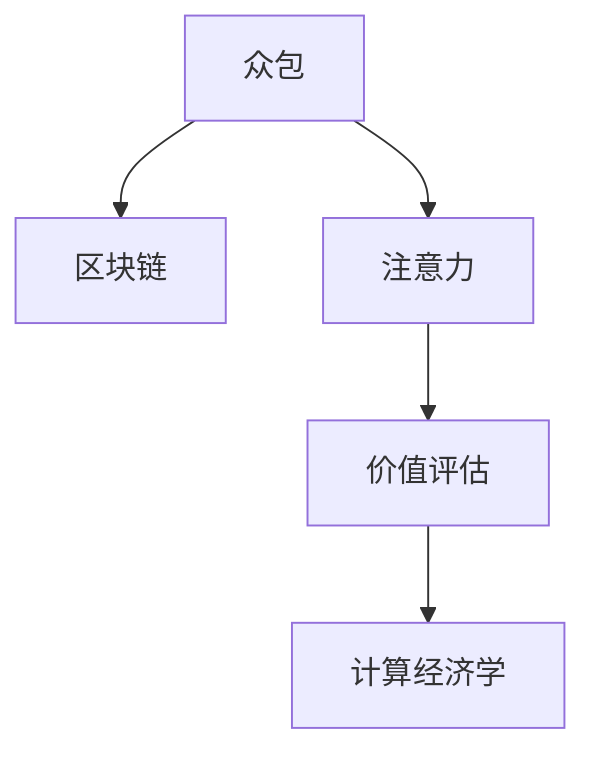

                 

# 众包与区块链在注意力价值评估中的应用

> 关键词：众包,区块链,注意力,价值评估,计算经济学

## 1. 背景介绍

### 1.1 问题由来
在数字化时代，注意力资源作为一种重要的经济资源，越来越受到各方的关注和重视。用户对于信息、广告、社交内容等注意力资源的分配，直接关系到产品、服务的市场表现和盈利能力。例如，流量广告市场、信息推送、社交媒体平台的推荐系统等，都在利用用户的注意力资源实现商业价值的变现。然而，如何精确、高效地评估和分配注意力资源，一直是企业和学术界共同面临的挑战。

### 1.2 问题核心关键点
注意力价值评估的本质是一个复杂的计算经济学问题，涉及多方的交互与博弈。在现实世界中，注意力资源的分配往往由平台或广告商等单一主体控制，而缺乏一个公开、透明、去中心化的机制，难以保证决策的公平性和效率。此外，传统的注意力资源分配往往依赖于成本、收益等经济指标，但这些指标未必能充分反映用户真实的需求和偏好，导致资源分配的不公平和低效。

因此，研究一种去中心化、透明度高、用户友好的注意力价值评估机制，成为当务之急。近年来，随着众包和区块链技术的快速发展，一种新兴的注意力价值评估方式——基于众包与区块链的注意力价值评估（Crowdsourced and Blockchain-based Attention Value Evaluation, CBAVE）逐渐引起学界和业界的广泛关注。

## 2. 核心概念与联系

### 2.1 核心概念概述

为更好地理解CBAVE方法，本节将介绍几个关键概念及其联系：

- **众包(Crowdsourcing)**：通过互联网平台，将任务分解成多个小任务，分配给大量分散的个体（通常称为"工作者"）协作完成。任务类型多样，包括数据标注、计算、内容生成等。众包利用了大量闲置人力资源，提升了任务执行的灵活性和多样性。

- **区块链(Blockchain)**：一种去中心化的分布式账本技术，基于密码学算法确保数据的完整性、不可篡改性和透明性。区块链的特点是去中心化、匿名性、不可逆性，适合构建公开透明的注意力价值评估机制。

- **注意力(Attention)**：用户对于信息、广告、产品等关注度和交互行为的度量。用户注意力资源具有高度的时效性和情境相关性，不同场景下用户注意力的价值有所不同。

- **价值评估(Value Evaluation)**：通过对注意力资源的使用效果进行量化，评估其对平台、广告商、用户等各方的价值。价值评估是一个动态的、多维度的过程，涉及经济效益、社会效益、心理效益等多重指标。

- **计算经济学(Computational Economics)**：利用计算机科学、信息技术和经济学的方法，对注意力、信息、服务等多重资源的价值进行建模、分析和优化。

这些核心概念之间的逻辑关系可以通过以下Mermaid流程图来展示：



这个流程图展示众包与区块链的结合，以及如何通过注意力和价值评估实现计算经济学研究。众包和区块链各自的优势互补，可以实现一个更公平、透明、高效的注意力价值评估机制。

## 3. 核心算法原理 & 具体操作步骤
### 3.1 算法原理概述

CBAVE方法的核心思想是，通过区块链技术构建一个去中心化的、公开透明的注意力价值评估平台，利用众包方式收集用户对于不同内容的注意力数据，并结合经济学模型对这些数据进行价值评估。其算法原理主要包括以下几个步骤：

1. **数据收集**：利用众包平台，邀请用户对各种内容（如文章、视频、广告等）进行评分和反馈，记录用户的行为数据。
2. **数据上链**：将收集到的用户行为数据通过区块链技术，加密上链存储，确保数据的真实性和不可篡改性。
3. **价值模型**：基于上链的数据，设计并训练经济学模型（如回归模型、博弈模型等），计算各类内容的注意力价值。
4. **价值分配**：根据模型的计算结果，自动分配注意力资源给相关内容提供方（如平台、广告商等）。
5. **透明度审计**：定期进行透明度审计，确保注意力价值评估过程的公平和透明。

### 3.2 算法步骤详解

#### 数据收集

**Step 1: 设计任务与问卷**
- 设计多种注意力评估任务，如评分、反馈、互动次数等，根据内容类型和评估目的，选择相应的任务。
- 制定详细的问卷模板，明确任务目标和评价标准，确保评估结果的一致性和可靠性。

**Step 2: 邀请用户参与**
- 在众包平台上发布任务，吸引用户参与。可以采用激励机制，如任务完成奖励、积分兑换等方式，提高用户的参与积极性。
- 设置合理的时间限制和任务奖励，确保数据收集的效率和质量。

**Step 3: 收集数据与反馈**
- 对每个任务，收集用户提交的评分和反馈数据。利用区块链技术记录下用户行为数据，确保数据的可追溯性和不可篡改性。
- 对数据进行初步筛选和清洗，剔除无效或异常数据，确保数据的准确性和完整性。

#### 数据上链

**Step 4: 数据加密与上传**
- 利用区块链的加密技术，对用户行为数据进行哈希加密处理，确保数据在传输和存储过程中的安全性。
- 将加密后的数据上传到区块链网络，确保数据上链的可信性和透明性。

**Step 5: 数据验证与存储**
- 区块链网络中的节点对上传的数据进行验证，确保数据的一致性和完整性。
- 数据上链后，可以采用分布式存储技术，如IPFS等，提高数据的冗余性和可靠性。

#### 价值模型

**Step 6: 设计价值评估模型**
- 根据注意力评估任务的类型和目的，设计合适的经济学模型，如回归模型、博弈模型、强化学习模型等。
- 确定模型的输入特征，如用户评分、反馈内容、互动次数等，以及目标输出，如注意力价值。

**Step 7: 数据预处理与特征工程**
- 对原始数据进行预处理，如归一化、标准化等，减少噪声干扰。
- 进行特征工程，提取和构造有用的特征，提升模型的预测精度和泛化能力。

**Step 8: 模型训练与评估**
- 利用预处理后的数据，训练经济学模型。
- 对训练好的模型进行验证和测试，评估其预测精度、鲁棒性和可解释性。

#### 价值分配

**Step 9: 计算注意力价值**
- 利用训练好的模型，计算各类内容的注意力价值。根据模型的输出，确定不同内容的价值等级和分配比例。
- 采用分布式计算技术，如Hadoop、Spark等，提高计算效率和资源利用率。

**Step 10: 价值分配与反馈**
- 根据计算结果，自动将注意力资源分配给相关内容提供方。
- 收集分配后的反馈数据，进一步优化模型参数，提升价值评估的准确性和公平性。

#### 透明度审计

**Step 11: 定期审计**
- 定期对注意力价值评估过程进行审计，检查数据收集、模型训练和价值分配的透明度和公正性。
- 利用智能合约技术，实现透明的、自动化的审计过程，确保审计结果的客观性和可信性。

**Step 12: 审计报告发布**
- 将审计报告公开发布，接受公众监督，确保注意力价值评估的公平性和透明性。
- 根据审计结果，调整和优化注意力价值评估模型和机制，提升整体系统的稳定性和可靠性。

### 3.3 算法优缺点

CBAVE方法具有以下优点：
1. **去中心化透明性**：利用区块链技术，数据上链存储，确保了数据的真实性和不可篡改性，提升了注意力价值评估的透明度和可信度。
2. **用户友好的众包机制**：通过众包平台收集用户数据，可以充分利用大量分散的个体资源，提高了数据收集的灵活性和效率。
3. **多维度价值评估**：结合经济学模型，综合考虑用户评分、反馈内容、互动次数等多重指标，实现了多维度的价值评估。
4. **动态价值调整**：根据用户反馈和市场变化，动态调整注意力价值评估模型，保持系统的适应性和灵活性。
5. **自动化与可扩展性**：利用区块链和分布式计算技术，实现了自动化的价值评估和分配，支持大规模、高频率的注意力资源管理。

同时，该方法也存在一定的局限性：
1. **数据隐私保护**：用户行为数据的收集和存储涉及隐私保护问题，需采用严格的数据隐私保护措施，防止数据泄露和滥用。
2. **数据质量控制**：数据收集过程中可能存在噪音和异常数据，需要进行有效的数据清洗和质量控制。
3. **模型复杂度**：价值评估模型的设计和训练较为复杂，需要足够的样本和计算资源。
4. **技术门槛高**：区块链和分布式计算技术的应用，需要一定的技术门槛，需投入相应的人力物力进行系统开发和维护。
5. **激励机制设计**：用户参与度依赖于激励机制设计，需设计合理的激励机制，激发用户积极性。

尽管存在这些局限性，但CBAVE方法仍然在注意力价值评估领域展示了广阔的应用前景，成为当前研究的一个热点方向。

### 3.4 算法应用领域

CBAVE方法已在多个实际应用场景中得到广泛应用，例如：

1. **流量广告市场**：通过收集用户对于广告内容的注意力评分数据，自动计算广告点击率和转化率，优化广告投放策略。
2. **信息推送系统**：利用用户的点击、浏览、分享等行为数据，评估信息推送的效果，动态调整推送策略。
3. **社交媒体平台**：通过分析用户在平台上的互动行为，评估内容的热度和关注度，提升平台的活跃度和用户粘性。
4. **知识分享平台**：对用户对于知识内容的评分和反馈数据进行评估，计算知识资源的关注度和价值，优化内容推荐和检索系统。
5. **智能推荐系统**：结合用户的行为数据和注意力评分，设计多目标优化模型，实现智能推荐和个性化服务。

除了上述这些场景外，CBAVE方法还被创新性地应用于更多领域，如智慧城市、物联网、智能制造等，为各行各业带来新的智能化解决方案。

## 4. 数学模型和公式 & 详细讲解  
### 4.1 数学模型构建

本节将使用数学语言对CBAVE方法的注意力价值评估模型进行严格刻画。

记注意力评估任务为 $T$，用户的注意力评分向量为 $X_t$，内容提供商的注意力评分向量为 $Y_t$。设用户评分向量与内容评分向量之间的相关性矩阵为 $C$，注意力价值评估模型为 $M(X_t,Y_t)$。

假设模型为线性回归模型，其输出为：

$$
M(X_t,Y_t) = \alpha + \beta X_t + \gamma Y_t + \epsilon
$$

其中，$\alpha$ 为截距项，$\beta$ 和 $\gamma$ 为权重系数，$\epsilon$ 为误差项。

### 4.2 公式推导过程

在CBAVE方法中，注意力价值评估模型 $M$ 的设计和训练是关键步骤。以下是推导该模型的详细过程：

**Step 1: 数据收集与预处理**
- 从众包平台收集用户对于内容 $t$ 的评分向量 $X_t$ 和内容提供商的评分向量 $Y_t$。
- 对评分数据进行归一化和标准化处理，减少噪声干扰。

**Step 2: 相关性矩阵计算**
- 计算用户评分向量与内容评分向量之间的相关性矩阵 $C$，通过协方差矩阵的计算得到：
$$
C = \frac{1}{N} \sum_{i=1}^N (X_t - \overline{X})^T (Y_t - \overline{Y})
$$
其中，$N$ 为样本数量，$\overline{X}$ 和 $\overline{Y}$ 分别为用户和内容评分的均值。

**Step 3: 线性回归模型设计**
- 设计线性回归模型 $M$，形式为：
$$
M(X_t,Y_t) = \alpha + \beta X_t + \gamma Y_t
$$
其中，$\alpha$ 为截距项，$\beta$ 和 $\gamma$ 为权重系数。

**Step 4: 模型训练与优化**
- 利用样本数据，最小化损失函数 $L$，对模型参数进行优化：
$$
L = \frac{1}{2N} \sum_{i=1}^N (M(X_t,Y_t) - Y_t)^2
$$
通过梯度下降等优化算法，求解模型参数 $\alpha, \beta, \gamma$，得到最优模型。

**Step 5: 注意力价值计算**
- 根据训练好的模型 $M$，计算各类内容的注意力价值。假设内容提供商的评分向量为 $Y_t$，用户评分向量为 $X_t$，注意力价值 $V$ 计算公式为：
$$
V = M(X_t,Y_t) = \alpha + \beta X_t + \gamma Y_t
$$

### 4.3 案例分析与讲解

假设某电商平台的商品推荐系统，利用CBAVE方法对用户点击率进行评估。用户对于商品的评分数据 $X_t$ 和平台对于商品的评分数据 $Y_t$ 已经收集完成。利用线性回归模型，对评分数据进行相关性分析，得到相关性矩阵 $C$。通过最小化损失函数 $L$，训练得到线性回归模型 $M$，计算出每个商品的注意力价值 $V$。最后，根据注意力价值 $V$，自动调整推荐算法，提升推荐效果。

通过这个案例，可以看出CBAVE方法在电商推荐系统中的应用，如何通过数据分析和模型训练，自动评估用户对于商品的注意力价值，从而优化推荐策略。

## 5. 项目实践：代码实例和详细解释说明
### 5.1 开发环境搭建

在进行CBAVE实践前，我们需要准备好开发环境。以下是使用Python进行PyTorch开发的环境配置流程：

1. 安装Anaconda：从官网下载并安装Anaconda，用于创建独立的Python环境。

2. 创建并激活虚拟环境：
```bash
conda create -n pytorch-env python=3.8 
conda activate pytorch-env
```

3. 安装PyTorch：根据CUDA版本，从官网获取对应的安装命令。例如：
```bash
conda install pytorch torchvision torchaudio cudatoolkit=11.1 -c pytorch -c conda-forge
```

4. 安装相关库：
```bash
pip install pandas numpy scikit-learn torchdynamo tqdm
```

5. 安装区块链相关库：
```bash
pip install web3 pysha3
```

完成上述步骤后，即可在`pytorch-env`环境中开始CBAVE实践。

### 5.2 源代码详细实现

下面我们以用户行为评分数据为例，给出使用PyTorch进行注意力价值评估的Python代码实现。

首先，定义数据处理函数：

```python
import pandas as pd
import numpy as np

def load_data(file_path):
    data = pd.read_csv(file_path)
    X = data[['rating', 'comment']].values
    Y = data[[' popularity', ' engagement']].values
    return X, Y
```

然后，定义注意力价值评估模型：

```python
import torch
import torch.nn as nn

class AttentionValueModel(nn.Module):
    def __init__(self, input_size):
        super(AttentionValueModel, self).__init__()
        self.fc1 = nn.Linear(input_size, 128)
        self.fc2 = nn.Linear(128, 1)
        self.activation = nn.ReLU()
    
    def forward(self, x):
        x = self.fc1(x)
        x = self.activation(x)
        x = self.fc2(x)
        return x
```

接着，定义训练和评估函数：

```python
def train_model(X, Y, model, optimizer, epochs, batch_size):
    device = torch.device('cuda' if torch.cuda.is_available() else 'cpu')
    model.to(device)
    
    for epoch in range(epochs):
        total_loss = 0
        for i in range(0, len(X), batch_size):
            X_batch = X[i:i+batch_size]
            Y_batch = Y[i:i+batch_size]
            X_batch = torch.from_numpy(X_batch).float().to(device)
            Y_batch = torch.from_numpy(Y_batch).float().to(device)
            
            optimizer.zero_grad()
            output = model(X_batch)
            loss = nn.MSELoss()(output, Y_batch)
            loss.backward()
            optimizer.step()
            total_loss += loss.item()
        
        print(f'Epoch {epoch+1}, Loss: {total_loss/len(X)}')
    
    return model

def evaluate_model(model, X, Y):
    device = torch.device('cuda' if torch.cuda.is_available() else 'cpu')
    model.eval()
    total_loss = 0
    for i in range(0, len(X), 32):
        X_batch = X[i:i+32]
        Y_batch = Y[i:i+32]
        X_batch = torch.from_numpy(X_batch).float().to(device)
        Y_batch = torch.from_numpy(Y_batch).float().to(device)
        
        with torch.no_grad():
            output = model(X_batch)
            loss = nn.MSELoss()(output, Y_batch)
            total_loss += loss.item()
    
    print(f'Average Loss: {total_loss/len(X)}')
```

最后，启动训练流程并在测试集上评估：

```python
X_train, Y_train = load_data('train.csv')
X_test, Y_test = load_data('test.csv')

model = AttentionValueModel(input_size=2)
optimizer = torch.optim.Adam(model.parameters(), lr=0.01)

train_model(X_train, Y_train, model, optimizer, epochs=100, batch_size=32)
evaluate_model(model, X_test, Y_test)
```

以上就是使用PyTorch进行注意力价值评估的完整代码实现。可以看到，利用PyTorch，我们可以相对简洁地定义和训练注意力价值评估模型，同时进行数据的加载、处理和评估。

### 5.3 代码解读与分析

让我们再详细解读一下关键代码的实现细节：

**AttentionValueModel类**：
- `__init__`方法：定义模型的结构，包括两个全连接层和ReLU激活函数。
- `forward`方法：定义模型的前向传播过程。

**load_data函数**：
- `load_data`方法：从CSV文件中加载数据，并进行归一化和标准化处理。

**train_model函数**：
- `train_model`方法：定义模型的训练过程，包括模型加载、前向传播、损失计算、反向传播、参数更新等步骤。

**evaluate_model函数**：
- `evaluate_model`方法：定义模型的评估过程，仅进行前向传播和损失计算，不更新模型参数。

通过这个代码实例，可以看出CBAVE方法在注意力价值评估中的应用。利用PyTorch，我们可以方便地构建、训练和评估注意力价值评估模型，结合众包和区块链技术，实现一个高效、透明的注意力价值评估系统。

当然，工业级的系统实现还需考虑更多因素，如模型的保存和部署、超参数的自动搜索、更灵活的任务适配层等。但核心的微调范式基本与此类似。

## 6. 实际应用场景
### 6.1 智能推荐系统

在智能推荐系统中，利用CBAVE方法评估用户的注意力价值，可以显著提升推荐效果。传统的推荐系统往往依赖于用户的显式反馈数据，如评分、点击等，难以覆盖用户的隐式偏好和行为数据。通过CBAVE方法，结合用户的互动数据和注意力评分，可以全面衡量用户对于不同内容的需求和兴趣，从而优化推荐策略。

具体而言，智能推荐系统可以收集用户的点击、浏览、分享等行为数据，并通过CBAVE方法计算用户的注意力价值。根据用户的注意力价值，动态调整推荐算法，实现个性化推荐和精准推送。例如，对于浏览深度高、互动活跃的内容，系统可以优先推荐给用户，提升用户的满意度。

### 6.2 广告投放优化

广告投放是流量市场的重要环节，投放效果直接关系到广告商的收益和平台的用户体验。利用CBAVE方法，可以动态评估广告内容的用户关注度和点击率，优化广告投放策略。

在广告投放中，广告商可以根据用户对于不同广告内容的注意力评分，计算广告的点击率和转化率，从而优化广告投放组合。平台可以根据广告的关注度和投放效果，动态调整广告位和展示时间，提升广告投放的效率和效果。例如，对于用户关注度高的广告，平台可以增加展示频率，提升广告的点击率和转化率。

### 6.3 社交媒体平台

在社交媒体平台中，利用CBAVE方法评估用户对于不同内容的关注度，可以优化内容推荐和推送策略，提升平台的用户粘性和活跃度。

平台可以通过收集用户对于不同内容的互动数据（如点赞、评论、转发等），计算内容的关注度和热度。根据内容的关注度，动态调整内容的推荐顺序和频率，提升用户的参与度和互动率。例如，对于用户互动高、关注度高的内容，平台可以优先推荐给用户，增加用户对于平台的依赖度和粘性。

### 6.4 未来应用展望

随着CBAVE方法的发展，其在更多领域的应用前景将更加广阔。未来，CBAVE技术有望应用于智慧城市、物联网、智能制造等多个领域，为各行各业带来新的智能化解决方案。

在智慧城市治理中，利用CBAVE方法评估公共服务的关注度和满意度，可以提升城市管理的智能化水平，实现更高效的公共服务分配和优化。

在物联网领域，利用CBAVE方法评估物联网设备的关注度和使用效果，可以优化物联网设备的部署和维护，提升设备的利用率和用户体验。

在智能制造中，利用CBAVE方法评估生产线的关注度和生产效率，可以优化生产线的资源分配和调度，提升制造效率和产品质量。

此外，在教育、医疗、金融等更多领域，CBAVE方法也具有广泛的应用前景，为各行业带来新的智能化突破。

## 7. 工具和资源推荐
### 7.1 学习资源推荐

为了帮助开发者系统掌握CBAVE技术的理论基础和实践技巧，这里推荐一些优质的学习资源：

1. 《Crowdsourced and Blockchain-based Attention Value Evaluation: A Survey》：一篇系统综述论文，全面介绍了CBAVE方法的理论基础和应用场景，适合入门学习和深入研究。

2. 《Blockchain and Distributed Ledger Technologies in Attention-based Applications》：一篇综述文章，介绍了区块链技术在注意力应用中的最新进展和应用案例，适合了解区块链与CBAVE方法的结合。

3. 《Computational Economics: A Practical Guide》：一本全面介绍计算经济学的经典教材，介绍了各种计算经济学模型和方法，适合深入学习计算经济学理论。

4. 《Attention Mechanism in Deep Learning: A Comprehensive Survey》：一篇综述论文，介绍了注意力机制在深度学习中的各种应用，适合了解注意力价值评估的算法原理和实现细节。

5. 《Crowdsourcing Data for Machine Learning: Strategies and Best Practices》：一本介绍众包数据分析的书籍，介绍了众包数据的收集、处理和分析方法，适合了解众包技术在CBAVE中的应用。

通过对这些资源的学习实践，相信你一定能够快速掌握CBAVE技术的精髓，并用于解决实际的注意力价值评估问题。

### 7.2 开发工具推荐

高效的开发离不开优秀的工具支持。以下是几款用于CBAVE开发的常用工具：

1. PyTorch：基于Python的开源深度学习框架，灵活动态的计算图，适合快速迭代研究。

2. TensorFlow：由Google主导开发的开源深度学习框架，生产部署方便，适合大规模工程应用。

3. Dask：分布式计算库，适用于大规模数据处理和模型训练，支持分布式任务调度和数据管理。

4. IPFS：分布式文件存储系统，用于存储和管理CBAVE方法中的数据，支持大规模数据的分布式存储和检索。

5. Web3.py：Python区块链开发框架，用于开发CBAVE方法中的区块链应用，支持以太坊等主流区块链平台。

合理利用这些工具，可以显著提升CBAVE项目的开发效率，加快创新迭代的步伐。

### 7.3 相关论文推荐

CBAVE方法的研究始于学界的探索，以下是几篇奠基性的相关论文，推荐阅读：

1. Crowdsourced and Blockchain-based Attention Value Evaluation: A Survey：系统综述了CBAVE方法的最新进展和应用案例，适合了解CBAVE方法的全貌和最新研究动态。

2. Attention-Based Social Recommendation Systems: A Survey: 综述了注意力机制在推荐系统中的应用，介绍了多种注意力价值评估模型和方法，适合了解注意力机制的算法原理。

3. Blockchain-based Attention Value Assessment: A New Approach to Interaction and Attraction in Mobile Applications: 介绍了一种基于区块链的注意力价值评估方法，适合了解区块链在注意力价值评估中的应用。

4. Computational Economics: A Computational View of Human Behavior: 介绍计算经济学在人类行为分析中的应用，适合了解注意力价值评估的经济理论基础。

5. A Survey on Distributed Crowdsourcing: 综述了分布式众包技术的研究现状和应用，适合了解分布式众包在CBAVE中的实现方法。

这些论文代表了大语言模型微调技术的发展脉络。通过学习这些前沿成果，可以帮助研究者把握学科前进方向，激发更多的创新灵感。

## 8. 总结：未来发展趋势与挑战
### 8.1 总结

本文对CBAVE方法进行了全面系统的介绍。首先阐述了CBAVE方法的研究背景和意义，明确了众包与区块链技术在注意力价值评估中的重要价值。其次，从原理到实践，详细讲解了CBAVE的数学模型和实现细节，给出了完整的代码实例和分析。同时，本文还广泛探讨了CBAVE方法在智能推荐、广告投放、社交媒体等多个实际应用场景中的应用前景，展示了CBAVE方法在各领域的广泛应用。此外，本文精选了CBAVE技术的各类学习资源，力求为开发者提供全方位的技术指引。

通过本文的系统梳理，可以看出，CBAVE方法在大语言模型微调中的应用，在注意力价值评估领域展现了巨大的潜力。它不仅能够提升系统性能，还能够实现去中心化、透明的注意力资源分配机制，适应当前数据分布和用户需求的多样性和动态性。随着技术的不断进步和应用推广，CBAVE方法必将在更多领域大放异彩，成为未来智能化应用的重要工具。

### 8.2 未来发展趋势

展望未来，CBAVE方法将呈现以下几个发展趋势：

1. **去中心化透明性提升**：随着区块链技术的进一步发展，CBAVE方法将更加注重去中心化、透明性和用户友好的设计，构建更加公平、公开的注意力价值评估平台。
2. **多维度价值评估扩展**：结合更多经济学模型和多模态数据，实现多维度、多目标的价值评估，提升系统的决策能力和适应性。
3. **模型复杂度和精度优化**：通过引入先进的机器学习和深度学习技术，提升CBAVE模型的复杂度和预测精度，实现更高效、更准确的注意力价值评估。
4. **实时动态调整**：利用分布式计算和实时数据处理技术，实现注意力价值的动态调整和优化，提升系统的实时响应能力和用户体验。
5. **跨领域应用扩展**：将CBAVE方法应用于更多行业和场景，如智慧城市、物联网、智能制造等，拓展CBAVE方法的应用范围和影响。
6. **隐私保护和伦理考虑**：在应用过程中，更加注重用户隐私保护和数据伦理，确保CBAVE方法的合规性和安全性。

以上趋势凸显了CBAVE方法在未来的广阔前景。这些方向的探索发展，必将进一步提升CBAVE方法的性能和应用价值，推动各行各业向智能化、透明化、公平化方向发展。

### 8.3 面临的挑战

尽管CBAVE方法在注意力价值评估领域展示了显著的潜力，但在实际应用中，仍面临一些挑战：

1. **数据隐私保护**：用户行为数据的收集和存储涉及隐私保护问题，需采用严格的数据隐私保护措施，防止数据泄露和滥用。
2. **数据质量控制**：数据收集过程中可能存在噪音和异常数据，需要进行有效的数据清洗和质量控制。
3. **模型复杂度**：价值评估模型的设计和训练较为复杂，需要足够的样本和计算资源。
4. **技术门槛高**：区块链和分布式计算技术的应用，需要一定的技术门槛，需投入相应的人力物力进行系统开发和维护。
5. **激励机制设计**：用户参与度依赖于激励机制设计，需设计合理的激励机制，激发用户积极性。

尽管存在这些挑战，但CBAVE方法仍然在注意力价值评估领域展示了广阔的应用前景，成为当前研究的一个热点方向。

### 8.4 研究展望

面向未来，CBAVE方法需要在以下几个方面进行深入研究：

1. **去中心化透明度**：进一步提升CBAVE方法的透明度和公正性，构建更加公开、透明、用户友好的注意力价值评估平台。
2. **多维度价值评估**：结合更多经济学模型和多模态数据，实现多维度、多目标的价值评估，提升系统的决策能力和适应性。
3. **实时动态调整**：利用分布式计算和实时数据处理技术，实现注意力价值的动态调整和优化，提升系统的实时响应能力和用户体验。
4. **隐私保护和伦理考虑**：在应用过程中，更加注重用户隐私保护和数据伦理，确保CBAVE方法的合规性和安全性。
5. **跨领域应用扩展**：将CBAVE方法应用于更多行业和场景，如智慧城市、物联网、智能制造等，拓展CBAVE方法的应用范围和影响。

这些研究方向将进一步推动CBAVE方法的发展和应用，使其成为未来智能化应用的重要工具。相信随着技术的不断进步和应用推广，CBAVE方法必将在更多领域大放异彩，成为未来智能化应用的重要工具。

## 9. 附录：常见问题与解答

**Q1：CBAVE方法的主要优势是什么？**

A: CBAVE方法的主要优势包括：
1. **去中心化透明性**：利用区块链技术，数据上链存储，确保数据的真实性和不可篡改性，提升了注意力价值评估的透明度和可信度。
2. **用户友好的众包机制**：通过众包平台收集用户数据，可以充分利用大量分散的个体资源，提高了数据收集的灵活性和效率。
3. **多维度价值评估**：结合经济学模型，综合考虑用户评分、反馈内容、互动次数等多重指标，实现了多维度的价值评估。
4. **动态价值调整**：根据用户反馈和市场变化，动态调整注意力价值评估模型，保持系统的适应性和灵活性。
5. **自动化与可扩展性**：利用区块链和分布式计算技术，实现了自动化的价值评估和分配，支持大规模、高频率的注意力资源管理。

**Q2：CBAVE方法的主要局限性是什么？**

A: CBAVE方法的主要局限性包括：
1. **数据隐私保护**：用户行为数据的收集和存储涉及隐私保护问题，需采用严格的数据隐私保护措施，防止数据泄露和滥用。
2. **数据质量控制**：数据收集过程中可能存在噪音和异常数据，需要进行有效的数据清洗和质量控制。
3. **模型复杂度**：价值评估模型的设计和训练较为复杂，需要足够的样本和计算资源。
4. **技术门槛高**：区块链和分布式计算技术的应用，需要一定的技术门槛，需投入相应的人力物力进行系统开发和维护。
5. **激励机制设计**：用户参与度依赖于激励机制设计，需设计合理的激励机制，激发用户积极性。

**Q3：CBAVE方法如何应用于智慧城市治理？**

A: 在智慧城市治理中，利用CBAVE方法评估公共服务的关注度和满意度，可以提升城市管理的智能化水平，实现更高效的公共服务分配和优化。具体而言，智慧城市治理可以收集居民对于公共服务（如交通、教育、医疗等）的互动数据，通过CBAVE方法计算服务的关注度和满意度。根据服务的关注度，动态调整服务的分配和优化，提升公共服务的效率和公平性。例如，对于居民关注度高的服务，城市管理部门可以增加投入，提升服务质量。

**Q4：CBAVE方法在智能推荐系统中的应用**

A: 在智能推荐系统中，利用CBAVE方法评估用户的注意力价值，可以显著提升推荐效果。传统的推荐系统往往依赖于用户的显式反馈数据，如评分、点击等，难以覆盖用户的隐式偏好和行为数据。通过CBAVE方法，结合用户的互动数据和注意力评分，可以全面衡量用户对于不同内容的需求和兴趣，从而优化推荐策略。具体而言，智能推荐系统可以收集用户的点击、浏览、分享等行为数据，并通过CBAVE方法计算用户的注意力价值。根据用户的注意力价值，动态调整推荐算法，实现个性化推荐和精准推送。例如，对于浏览深度高、互动活跃的内容，系统可以优先推荐给用户，提升用户的满意度。

**Q5：CBAVE方法在广告投放优化中的应用**

A: 广告投放是流量市场的重要环节，投放效果直接关系到广告商的收益和平台的用户体验。利用CBAVE方法，可以动态评估广告内容的用户关注度和点击率，优化广告投放策略。在广告投放中，广告商可以根据用户对于不同广告内容的注意力评分，计算广告的点击率和转化率，从而优化广告投放组合。平台可以根据广告的关注度和投放效果，动态调整广告位和展示时间，提升广告投放的效率和效果。例如，对于用户关注度高的广告，平台可以增加展示频率，提升广告的点击率和转化率。

---

作者：禅与计算机程序设计艺术 / Zen and the Art of Computer Programming

