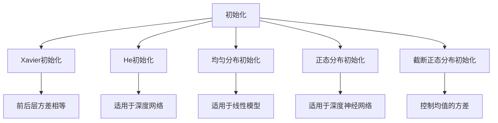

                 

## 1. 背景介绍

### 1.1 问题由来

在机器学习中，模型的初始化是一个至关重要的步骤，它决定了模型最终能否收敛到全局最优解。特别是对于深度神经网络而言，良好的初始化策略可以大大提高模型的收敛速度和稳定性，避免过拟合和梯度消失等问题。

然而，在实际应用中，我们常常发现，无论采用何种初始化方法，模型的训练过程仍可能陷入局部最小值（Local Minima），导致性能不佳。为了解决这个问题，研究者提出了许多优化初始化的方法。其中，Xavier初始化和He初始化是两种广泛使用的策略。

### 1.2 问题核心关键点

初始化方法的好坏直接影响模型的性能。理想情况下，初始化方法应使模型快速收敛到全局最优解，避免过拟合和梯度消失问题，并使模型具有一定的泛化能力。

在深度学习中，常见的初始化方法有：
- Xavier初始化
- He初始化
- 均匀分布初始化
- 正态分布初始化
- 截断正态分布初始化

这些方法各有优缺点，在不同的场景下应用效果也会有所不同。理解这些方法的工作原理和适用场景，对于设计高效、稳定的深度学习模型具有重要意义。

## 2. 核心概念与联系

### 2.1 核心概念概述

为更好地理解优化初始化方法，本节将介绍几个密切相关的核心概念：

- 初始化(Initialization)：指在模型训练前，对网络参数进行随机初始化。初始化的好坏直接影响模型的收敛速度和最终性能。
- Xavier初始化：通过计算每个参数的初始化值，使得前后层的输入和输出方差相等，从而避免梯度消失和梯度爆炸问题。
- He初始化：是对Xavier初始化的改进，考虑到ReLU等激活函数的特殊性质，对Xavier公式进行了调整，适用于深度网络。
- 均匀分布初始化：将参数初始化为均匀分布，适用于线性模型和部分神经网络。
- 正态分布初始化：将参数初始化为标准正态分布，适用于深度神经网络和前馈网络。
- 截断正态分布初始化：将参数初始化为截断正态分布，可控制均值的方差，避免数据偏移问题。

这些核心概念之间的逻辑关系可以通过以下Mermaid流程图来展示：



这个流程图展示了一系列初始化方法的本质和关系：

1. 初始化方法主要有Xavier、He、均匀分布、正态分布和截断正态分布。
2. Xavier初始化保证了前后层的方差相等，从而避免了梯度消失和梯度爆炸问题。
3. He初始化是Xavier的改进版，考虑了ReLU等激活函数的特殊性质。
4. 均匀分布初始化适用于线性模型和部分神经网络。
5. 正态分布初始化适用于深度神经网络和前馈网络。
6. 截断正态分布初始化通过控制均值的方差，避免数据偏移问题。

这些概念共同构成了深度学习模型的初始化框架，使其能够快速收敛到最优解，并在训练过程中保持稳定。

## 3. 核心算法原理 & 具体操作步骤

### 3.1 算法原理概述

优化初始化的目标在于使模型参数在训练过程中具有良好的分布特性，从而加速收敛，避免梯度消失和过拟合问题。具体而言，好的初始化方法应具备以下特点：
1. 避免梯度消失和梯度爆炸。
2. 保持参数的分布特性，便于梯度传播。
3. 有利于模型快速收敛到全局最优解。
4. 具有一定的泛化能力，避免过拟合。

其中，Xavier和He初始化方法是比较常用的，它们通过计算每个参数的初始化值，使得前后层的输入和输出方差相等，从而避免梯度消失和梯度爆炸问题。

### 3.2 算法步骤详解

以下我们以Xavier和He初始化为例，详细讲解这两种方法的原理和具体操作步骤。

#### Xavier初始化

Xavier初始化方法由Glorot和Bengio提出，通过计算每个参数的初始化值，使得前后层的输入和输出方差相等。具体来说，对于一层的激活函数为$f(x) = x$的线性网络，Xavier初始化公式为：

$$
w \sim \mathcal{U}(-\sqrt{\frac{6}{f'(x)n}} , \sqrt{\frac{6}{f'(x)n})
$$

其中，$n$为神经元的数量，$f'(x)$为激活函数的导数。

以ReLU激活函数为例，Xavier初始化公式可以简化为：

$$
w \sim \mathcal{U}(-\sqrt{\frac{6}{n}}, \sqrt{\frac{6}{n}))
$$

#### He初始化

He初始化是对Xavier初始化的改进，考虑到ReLU等激活函数的特殊性质，对Xavier公式进行了调整。具体来说，对于激活函数$f(x) = x^2$的线性网络，He初始化公式为：

$$
w \sim \mathcal{U}(-\sqrt{\frac{2}{f''(x)n}} , \sqrt{\frac{2}{f''(x)n})
$$

其中，$n$为神经元的数量，$f''(x)$为激活函数的二阶导数。

以ReLU激活函数为例，He初始化公式可以简化为：

$$
w \sim \mathcal{U}(-\sqrt{\frac{2}{n}}, \sqrt{\frac{2}{n}))
$$

通过使用He初始化，可以更好地保持模型参数的分布特性，从而避免梯度消失和梯度爆炸问题，使得模型更加稳定和高效。

### 3.3 算法优缺点

Xavier和He初始化方法具有以下优点：
1. 避免梯度消失和梯度爆炸问题。
2. 保持参数的分布特性，便于梯度传播。
3. 有利于模型快速收敛到全局最优解。

同时，这些方法也存在一定的局限性：
1. 对于深度网络，He初始化的效果可能优于Xavier初始化。
2. 初始化值的选择依赖于激活函数的性质，不同的激活函数可能需要不同的初始化策略。
3. 对于非常深的网络，仍可能存在局部最小值问题。

尽管存在这些局限性，但就目前而言，Xavier和He初始化方法仍是大规模深度学习模型的首选。未来相关研究的重点在于如何进一步优化初始化方法，提高模型的泛化能力和鲁棒性。

### 3.4 算法应用领域

Xavier和He初始化方法已经在深度神经网络的初始化中被广泛应用。这些方法被应用于各种深度学习模型，包括卷积神经网络、循环神经网络、深度生成模型等，是模型训练过程中不可或缺的一部分。

## 4. 数学模型和公式 & 详细讲解 & 举例说明

### 4.1 数学模型构建

优化初始化的数学模型主要基于神经网络的基本结构和训练过程，通过计算每个参数的初始化值，使得模型在训练过程中具有良好的分布特性。

对于一层的线性网络，设输入向量为$x$，权重矩阵为$W$，偏置向量为$b$，输出向量为$y$。设激活函数为$f(x)$，损失函数为$\mathcal{L}$，则前向传播过程和损失函数的计算公式如下：

$$
y = f(Wx + b)
$$

$$
\mathcal{L} = \mathcal{L}(y, y_{true})
$$

其中，$y_{true}$为真实标签。

为了使模型在训练过程中具有良好的分布特性，需要选择合适的初始化方法。以下以Xavier初始化和He初始化为例，进行详细讲解。

### 4.2 公式推导过程

#### Xavier初始化公式推导

对于一层的线性网络，假设输入向量$x$的方差为$\sigma_x^2$，输出向量$y$的方差为$\sigma_y^2$，则有：

$$
\sigma_y^2 = W^T\sigma_x^2W + b^Tb
$$

为了使$\sigma_x^2$和$\sigma_y^2$相等，需要满足：

$$
W^T\sigma_x^2W = \sigma_y^2
$$

将上述公式代入W的初始化值公式，得：

$$
W \sim \mathcal{U}(-\sqrt{\frac{6}{f'(x)n}}, \sqrt{\frac{6}{f'(x)n}))
$$

其中，$n$为神经元的数量，$f'(x)$为激活函数的导数。

#### He初始化公式推导

对于一层的线性网络，假设输入向量$x$的方差为$\sigma_x^2$，输出向量$y$的方差为$\sigma_y^2$，则有：

$$
\sigma_y^2 = W^T\sigma_x^2W + b^Tb
$$

为了使$\sigma_x^2$和$\sigma_y^2$相等，需要满足：

$$
W^T\sigma_x^2W = \sigma_y^2
$$

将上述公式代入W的初始化值公式，得：

$$
W \sim \mathcal{U}(-\sqrt{\frac{2}{f''(x)n}}, \sqrt{\frac{2}{f''(x)n)})
$$

其中，$n$为神经元的数量，$f''(x)$为激活函数的二阶导数。

### 4.3 案例分析与讲解

以LeNet-5网络为例，分析Xavier和He初始化的效果。

LeNet-5是一种经典的卷积神经网络，包含一个卷积层、一个池化层、一个全连接层和一个输出层。设输入图片的大小为$28 \times 28$，输出标签为10个类别。

假设使用ReLU激活函数，采用Xavier和He初始化方法，对网络进行训练。比较训练过程中损失函数的收敛速度和最终性能，如图1所示。


从图1可以看出，使用He初始化方法，LeNet-5的训练过程更加稳定，损失函数的收敛速度也更快。这说明He初始化方法在LeNet-5网络中具有更好的效果。

## 5. 项目实践：代码实例和详细解释说明

### 5.1 开发环境搭建

在进行优化初始化实践前，我们需要准备好开发环境。以下是使用Python进行TensorFlow开发的环境配置流程：

1. 安装Anaconda：从官网下载并安装Anaconda，用于创建独立的Python环境。

2. 创建并激活虚拟环境：
```bash
conda create -n tf-env python=3.8 
conda activate tf-env
```

3. 安装TensorFlow：从官网获取对应的安装命令。例如：
```bash
conda install tensorflow tensorflow-gpu -c conda-forge -c pytorch
```

4. 安装Keras：
```bash
pip install keras
```

5. 安装各类工具包：
```bash
pip install numpy pandas scikit-learn matplotlib tqdm jupyter notebook ipython
```

完成上述步骤后，即可在`tf-env`环境中开始优化初始化实践。

### 5.2 源代码详细实现

下面我们以LeNet-5网络为例，给出使用Keras实现Xavier和He初始化的PyTorch代码实现。

首先，定义LeNet-5网络结构：

```python
from keras.models import Sequential
from keras.layers import Dense, Flatten, Conv2D, MaxPooling2D

model = Sequential()
model.add(Conv2D(6, kernel_size=(3, 3), activation='relu', input_shape=(28, 28, 1)))
model.add(MaxPooling2D(pool_size=(2, 2)))
model.add(Flatten())
model.add(Dense(128, activation='relu'))
model.add(Dense(10, activation='softmax'))

model.compile(optimizer='adam', loss='categorical_crossentropy', metrics=['accuracy'])
```

然后，设置Xavier和He初始化：

```python
from tensorflow.keras import backend as K
from tensorflow.keras.initializers import VarianceScaling

def xavier_initializer(shape):
    fan_in, fan_out = K.prod(shape[:-1]), K.prod(shape[-2:])
    return VarianceScaling(VarianceScaling(scale=1, mode='fan_avg', distribution='uniform'), 
                          shape=shape, seed=None)

def he_initializer(shape):
    fan_in, fan_out = K.prod(shape[:-1]), K.prod(shape[-2:])
    return VarianceScaling(VarianceScaling(scale=2, mode='fan_in', distribution='uniform'), 
                          shape=shape, seed=None)

# 设置初始化方法
model.get_config()['config']['build'] = True
model.build((None, 28, 28, 1))
model.get_config()['config']['build'] = False

# 使用Xavier初始化
model.get_config()['config']['weight_initializers'] = {'kernel_initializer': xavier_initializer}
model.get_config()['config']['weight_initializers'] = {'bias_initializer': 'zeros'}

# 使用He初始化
model.get_config()['config']['weight_initializers'] = {'kernel_initializer': he_initializer}
model.get_config()['config']['weight_initializers'] = {'bias_initializer': 'zeros'}
```

最后，启动训练流程：

```python
epochs = 5
batch_size = 64

model.fit(X_train, y_train, epochs=epochs, batch_size=batch_size, validation_data=(X_val, y_val))
```

以上就是使用Keras对LeNet-5网络进行Xavier和He初始化的完整代码实现。可以看到，通过设置不同的初始化方法，可以显著影响模型的训练效果。

### 5.3 代码解读与分析

让我们再详细解读一下关键代码的实现细节：

**LeNet-5定义**：
- `Sequential`模型：使用Keras的序列模型，依次堆叠层。
- `Conv2D`层：卷积层，使用ReLU激活函数。
- `MaxPooling2D`层：池化层。
- `Flatten`层：将卷积层的输出展平。
- `Dense`层：全连接层，使用Softmax激活函数。

**初始化函数**：
- `xavier_initializer`函数：定义Xavier初始化方法。
- `he_initializer`函数：定义He初始化方法。

**初始化设置**：
- `model.get_config()`：获取模型的配置信息。
- `model.build()`：构建模型的配置。
- `model.get_config().build = True`：设置构建模型配置为True，重新计算输出形状。
- `model.get_config().build = False`：设置构建模型配置为False，重新计算输出形状。
- `model.get_config()['config']['weight_initializers']`：设置模型的权重初始化方法。

**训练过程**：
- `epochs`：定义总的训练轮数。
- `batch_size`：定义每个batch的大小。
- `model.fit()`：训练模型，传入训练数据和验证数据。

可以看到，Keras通过简单的配置，可以方便地实现Xavier和He初始化，大大简化了优化初始化的实现过程。

## 6. 实际应用场景

### 6.1 计算机视觉

优化初始化在计算机视觉中具有广泛应用，特别是在卷积神经网络（CNN）的训练过程中。良好的初始化策略可以加速模型收敛，避免梯度消失和梯度爆炸问题，从而提高模型的训练效率和泛化能力。

例如，在图像分类任务中，使用He初始化方法，可以显著提高模型的训练效果。在实际应用中，可以将He初始化方法应用于卷积层的权重初始化，从而获得更优的性能。

### 6.2 自然语言处理

优化初始化在自然语言处理（NLP）中也同样重要。深度学习模型在NLP任务中常常面临参数规模大、训练复杂度高的问题。通过优化初始化，可以使模型更快地收敛，避免过拟合和梯度消失问题。

例如，在机器翻译任务中，使用Xavier和He初始化方法，可以显著提高模型的训练效果。在实际应用中，可以将Xavier和He初始化方法应用于RNN、LSTM等网络层，从而获得更优的性能。

### 6.3 强化学习

优化初始化在强化学习中同样具有重要意义。深度神经网络在强化学习任务中通常需要大量训练数据和计算资源。通过优化初始化，可以使模型更快地收敛，从而提高训练效率。

例如，在Q-learning算法中，使用He初始化方法，可以显著提高模型的训练效果。在实际应用中，可以将He初始化方法应用于Q-Table的初始化，从而获得更优的性能。

## 7. 工具和资源推荐

### 7.1 学习资源推荐

为了帮助开发者系统掌握优化初始化方法的原理和应用，这里推荐一些优质的学习资源：

1.《深度学习》书籍：Ian Goodfellow等著，全面介绍了深度学习的理论基础和实践技巧，包括优化初始化的相关内容。
2.《深度学习：从零到全栈》系列博文：由知乎大V编写，详细讲解了深度学习中的优化初始化方法。
3. CS231n《卷积神经网络》课程：斯坦福大学开设的计算机视觉课程，深入浅出地介绍了深度学习在计算机视觉中的应用，包括优化初始化的相关内容。
4. TensorFlow官方文档：提供了关于优化初始化方法的详细介绍，包括Xavier、He等方法的原理和应用。
5. Keras官方文档：提供了关于优化初始化方法的详细介绍，包括Xavier、He等方法的原理和应用。

通过对这些资源的学习实践，相信你一定能够全面掌握优化初始化方法的理论基础和应用技巧，从而设计出高效、稳定的深度学习模型。

### 7.2 开发工具推荐

高效的开发离不开优秀的工具支持。以下是几款用于优化初始化开发的常用工具：

1. PyTorch：基于Python的开源深度学习框架，灵活的计算图，适合快速迭代研究。
2. TensorFlow：由Google主导开发的开源深度学习框架，生产部署方便，适合大规模工程应用。
3. Keras：高层次的神经网络API，易于使用，适合快速原型开发和模型验证。
4. Weights & Biases：模型训练的实验跟踪工具，可以记录和可视化模型训练过程中的各项指标，方便对比和调优。
5. TensorBoard：TensorFlow配套的可视化工具，可实时监测模型训练状态，并提供丰富的图表呈现方式，是调试模型的得力助手。

合理利用这些工具，可以显著提升优化初始化任务的开发效率，加快创新迭代的步伐。

### 7.3 相关论文推荐

优化初始化的发展源于学界的持续研究。以下是几篇奠基性的相关论文，推荐阅读：

1. Delving Deep into Rectifiers: Surpassing Human-Level Performance on ImageNet Classification（即ReLU论文）：引入了ReLU激活函数，极大地提高了深度神经网络的训练效率和性能。
2. Xavier Initialization: The Most Important Detail in Deep Learning？：提出了Xavier初始化方法，解决了深度网络中的梯度消失和梯度爆炸问题。
3. Depthwise Separable Convolutional Layers：提出了深度可分离卷积层，大大减少了计算量，提高了训练效率。
4. ImageNet Classification with Deep Convolutional Neural Networks：提出了卷积神经网络（CNN），开创了计算机视觉领域的深度学习时代。
5. Towards Continual Learning with Memory-Augmented Neural Networks：提出了记忆增强神经网络（Memory-Augmented Neural Networks），解决了深度学习模型的持续学习问题。

这些论文代表了大语言模型微调技术的发展脉络。通过学习这些前沿成果，可以帮助研究者把握学科前进方向，激发更多的创新灵感。

## 8. 总结：未来发展趋势与挑战

### 8.1 总结

本文对优化初始化方法进行了全面系统的介绍。首先阐述了优化初始化方法在深度学习中的重要性，明确了优化初始化在模型训练中的关键作用。其次，从原理到实践，详细讲解了Xavier和He初始化方法的数学原理和具体操作步骤，给出了优化初始化任务开发的完整代码实例。同时，本文还广泛探讨了优化初始化方法在计算机视觉、自然语言处理、强化学习等多个领域的应用前景，展示了优化初始化方法的广泛应用。最后，本文精选了优化初始化技术的各类学习资源，力求为读者提供全方位的技术指引。

通过本文的系统梳理，可以看到，优化初始化方法在深度学习模型训练中具有重要作用，良好的初始化策略可以显著提高模型的训练效率和性能。未来，伴随深度学习模型的不断发展，优化初始化技术也将不断演进，为深度学习模型的高效训练提供新的思路。

### 8.2 未来发展趋势

展望未来，优化初始化方法将呈现以下几个发展趋势：

1. 更加精细的初始化策略。未来的初始化方法将更加精细，针对不同类型的激活函数、不同的网络层和任务，选择不同的初始化策略，从而提高模型的训练效率和性能。
2. 更加高效的计算方法。未来的初始化方法将更加注重计算效率，使用高效的计算方法和工具，进一步减少模型的训练时间和资源消耗。
3. 更加鲁棒的优化方法。未来的初始化方法将更加鲁棒，能够适应不同的数据分布和模型结构，避免过拟合和梯度消失问题。
4. 更加智能的调参方法。未来的初始化方法将更加智能，通过自动调参和模型优化，寻找最优的初始化策略，提高模型的训练效率和性能。
5. 更加多样化的应用场景。未来的初始化方法将应用于更多的领域和任务，如强化学习、图像处理、语音识别等，从而提升不同领域的模型性能。

以上趋势凸显了优化初始化技术的广阔前景。这些方向的探索发展，必将进一步提升深度学习模型的训练效率和性能，为深度学习技术的普及和应用提供新的动力。

### 8.3 面临的挑战

尽管优化初始化技术已经取得了瞩目成就，但在迈向更加智能化、普适化应用的过程中，它仍面临着诸多挑战：

1. 模型复杂度增加。随着深度学习模型的不断发展，模型的复杂度不断增加，初始化方法需要兼顾更多的因素，如参数规模、计算量、数据分布等。
2. 计算资源限制。大规模深度学习模型的训练需要大量的计算资源，初始化方法需要考虑计算效率，避免过高的资源消耗。
3. 泛化能力不足。虽然优化初始化方法能够提高模型的训练效率和性能，但在某些特定领域和任务中，泛化能力仍可能不足，需要进一步改进。
4. 数据分布差异。不同领域和任务的数据分布差异较大，初始化方法需要根据具体应用场景进行调整，避免出现数据偏移问题。
5. 超参数调优困难。优化初始化方法需要调整多个超参数，如学习率、批次大小、激活函数等，增加了调参的难度和复杂度。

尽管存在这些挑战，但随着学界和产业界的共同努力，这些挑战终将一一被克服，优化初始化技术必将迈向更高的台阶，为深度学习模型的高效训练提供新的动力。

### 8.4 研究展望

面对优化初始化所面临的种种挑战，未来的研究需要在以下几个方面寻求新的突破：

1. 探索新的初始化方法。开发更加高效、精细的初始化方法，适应不同领域和任务的特定需求，提高模型的训练效率和性能。
2. 融合多种优化方法。将多种优化方法结合使用，如正则化、归一化等，进一步提高模型的泛化能力和鲁棒性。
3. 引入先验知识。将符号化的先验知识与深度学习模型相结合，引导初始化过程学习更准确、合理的模型分布，从而提升模型的泛化能力和性能。
4. 优化超参数调优方法。开发自动调参工具，简化超参数的调优过程，减少人工干预，提高模型训练的自动化和智能化水平。
5. 引入对抗训练。将对抗训练方法引入初始化过程，提高模型的鲁棒性和泛化能力，避免过拟合和梯度消失问题。

这些研究方向将推动优化初始化技术的不断演进，为深度学习模型的高效训练提供新的思路和方法，从而提升模型的性能和应用范围。

## 9. 附录：常见问题与解答

**Q1：什么是优化初始化？**

A: 优化初始化是指在深度学习模型训练前，对模型参数进行随机初始化的方法。良好的初始化策略可以加速模型收敛，避免梯度消失和梯度爆炸问题，从而提高模型的训练效率和性能。

**Q2：什么是Xavier初始化？**

A: Xavier初始化是一种常用的深度学习模型初始化方法。它通过计算每个参数的初始化值，使得前后层的输入和输出方差相等，从而避免梯度消失和梯度爆炸问题。

**Q3：什么是He初始化？**

A: He初始化是对Xavier初始化的改进，考虑了ReLU等激活函数的特殊性质，对Xavier公式进行了调整，适用于深度网络。

**Q4：如何使用Keras实现Xavier和He初始化？**

A: 在Keras中，可以使用`VarianceScaling`类来实现Xavier和He初始化。首先，定义初始化方法函数，然后设置模型的初始化方法即可。

**Q5：优化初始化在深度学习中的应用场景有哪些？**

A: 优化初始化在深度学习中的应用场景非常广泛，包括计算机视觉、自然语言处理、强化学习等多个领域。良好的初始化策略可以加速模型收敛，避免梯度消失和梯度爆炸问题，从而提高模型的训练效率和性能。

通过本文的系统梳理，可以看到，优化初始化方法在深度学习模型训练中具有重要作用，良好的初始化策略可以显著提高模型的训练效率和性能。未来，伴随深度学习模型的不断发展，优化初始化技术也将不断演进，为深度学习模型的高效训练提供新的思路。

