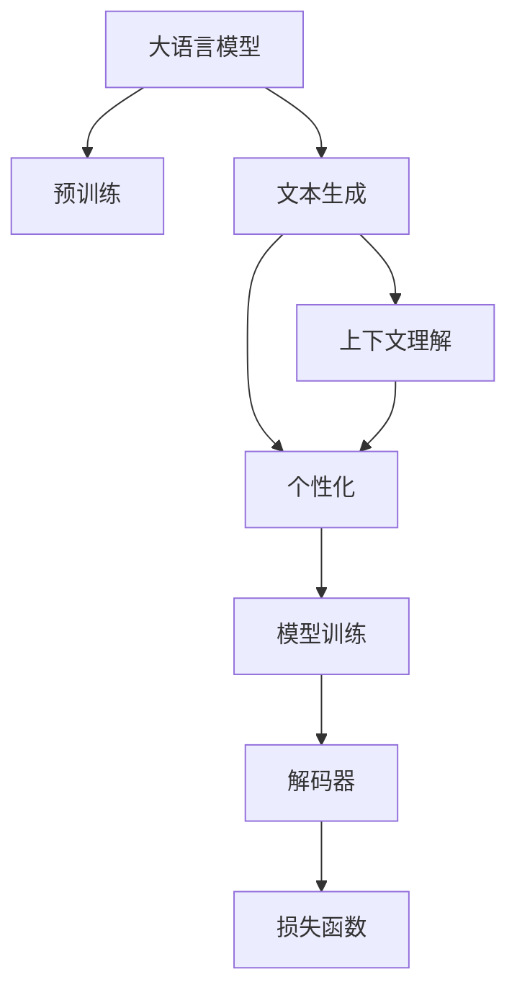

                 

# 体验个人化叙事编织机：AI驱动的生活故事创作

在数字化时代，人们对于个性化和人性化的追求从未止步。文本生成技术作为AI技术的重要分支，能够通过算法和模型自动创作内容，满足用户的个性化需求。本文将深入探讨AI驱动的生活故事创作，讨论其核心原理、操作步骤以及实际应用，并展望未来发展趋势。

## 1. 背景介绍

### 1.1 问题由来

随着AI技术的不断进步，文本生成技术已经成为自然语言处理（NLP）领域的一个重要分支。它能够根据输入的种子文本自动生成内容，广泛应用于对话系统、内容创作、机器翻译等领域。生活故事创作是一种典型的人类叙事形式，涉及情感、情节、角色等多维度内容，具有较高的复杂性和艺术性。

然而，人类创作故事需要深厚的文学功底和丰富的社会经验，而机器创作故事则需要依赖于大量的数据和先进的算法。近年来，基于深度学习的大语言模型（LLMs），如GPT、GPT-3等，在文本生成领域取得了突破性进展，能够生成高质量、连贯的文本，极大地扩展了文本生成技术的应用场景。

### 1.2 问题核心关键点

大语言模型在文本生成中的核心问题在于如何捕捉人类语言的复杂结构和上下文信息，从而生成符合语法、语义和情感的文本。具体来说，包括以下几个方面：

- **数据和预训练**：大语言模型需要大量的文本数据进行预训练，学习通用的语言表示。
- **上下文理解**：模型需要理解输入文本的上下文，才能生成连贯和有意义的文本。
- **生成质量**：模型生成的文本需要符合语法规则、语义连贯、情感丰富等要求。
- **个性化**：根据用户输入的不同，生成具有个性化和多样性的文本。

### 1.3 问题研究意义

AI驱动的生活故事创作不仅能够满足用户的个性化需求，还能推动文本生成技术的发展，为文学创作、内容生成等领域带来新的机遇。其研究意义主要体现在以下几个方面：

- **提升用户体验**：通过个性化故事创作，满足不同用户的情感和娱乐需求。
- **促进文学创作**：为作家提供辅助工具，帮助他们创作更多样化和新颖的作品。
- **创新内容生成**：推动内容生成技术的发展，应用到新闻、广告、游戏等领域。
- **推动社会进步**：增强语言文化的传播和交流，推动社会的多元化和包容性。

## 2. 核心概念与联系

### 2.1 核心概念概述

为更好地理解AI驱动的生活故事创作，本节将介绍几个密切相关的核心概念：

- **大语言模型（LLMs）**：以自回归（如GPT）或自编码（如BERT）模型为代表的大规模预训练语言模型。通过在大规模无标签文本语料上进行预训练，学习通用的语言知识，具备强大的语言理解和生成能力。

- **文本生成**：通过机器学习算法和模型自动生成符合语法和语义规则的文本，如对话、新闻、诗歌等。

- **上下文理解**：模型能够理解输入文本的前后文关系，从而生成连贯、有意义的文本。

- **个性化**：根据用户输入的不同，生成符合用户喜好和需求的文本。

- **模型训练**：通过大量标注数据，训练模型学习生成特定类型文本的能力。

- **解码器（Decoder）**：在文本生成中，解码器负责将模型生成的概率分布转换为具体的文本序列。

- **损失函数**：衡量生成文本与真实文本之间的差距，指导模型的训练和优化。

这些核心概念之间的逻辑关系可以通过以下Mermaid流程图来展示：



这个流程图展示了大语言模型的核心概念及其之间的关系：

1. 大语言模型通过预训练获得基础能力。
2. 文本生成是模型在特定任务上的应用，需要通过上下文理解生成连贯文本。
3. 个性化需求需要通过模型训练来满足，生成符合用户偏好的文本。
4. 解码器将模型输出的概率分布转换为具体的文本序列。
5. 损失函数用于衡量生成的文本与真实文本之间的差异，指导模型优化。

## 3. 核心算法原理 & 具体操作步骤

### 3.1 算法原理概述

AI驱动的生活故事创作，本质上是一种基于深度学习模型（如Transformer、GPT等）的文本生成过程。其核心思想是：将大语言模型视作一个强大的"文本生成器"，通过训练模型在特定任务上的生成能力，利用上下文理解和个性化需求，生成符合用户期望的文本。

具体来说，训练过程分为以下几个步骤：

1. **数据准备**：收集并标注大量故事文本，作为模型的训练数据。
2. **模型加载**：加载预训练的大语言模型，作为文本生成的初始化参数。
3. **定义任务**：根据故事创作的需求，设计适当的任务目标和损失函数。
4. **模型训练**：使用训练数据，通过优化算法（如Adam、SGD等）对模型进行微调，优化生成文本的质量。
5. **模型解码**：使用解码器将模型生成的概率分布转换为具体的文本序列。

### 3.2 算法步骤详解

以生活故事创作为例，介绍AI驱动的文本生成具体步骤：

**Step 1: 数据准备**
- 收集大量故事文本，作为训练和评估数据。
- 标注文本内容，如情节、角色、情感等。

**Step 2: 模型加载**
- 使用大语言模型（如GPT-3），加载到计算环境中。
- 设置模型的参数，如学习率、批大小等。

**Step 3: 定义任务**
- 设计故事创作的上下文理解和生成任务。
- 定义损失函数，如交叉熵损失、BLEU分数等。

**Step 4: 模型训练**
- 将故事文本作为输入，通过前向传播计算损失。
- 反向传播计算梯度，使用优化算法更新模型参数。
- 在验证集上评估模型性能，根据性能调整超参数。

**Step 5: 模型解码**
- 将用户输入的故事种子作为上下文，送入模型。
- 生成概率分布序列，使用解码器转换为文本序列。
- 对生成的文本进行后处理，如语法修正、风格调整等。

### 3.3 算法优缺点

AI驱动的生活故事创作具有以下优点：

1. **高效生成**：通过深度学习模型，能够快速生成大量高质量文本。
2. **个性化需求**：模型可以根据用户输入的不同，生成具有个性化和多样性的文本。
3. **适应性强**：模型能够适应不同的故事创作场景和风格。

然而，该方法也存在一些缺点：

1. **依赖标注数据**：高质量的标注数据是模型训练的前提，获取和处理标注数据成本较高。
2. **生成质量不稳定**：生成的文本可能存在语法错误、语义混乱等问题，质量不稳定。
3. **难以控制内容**：生成的文本内容可能包含不合适的信息，难以完全控制。

### 3.4 算法应用领域

AI驱动的生活故事创作广泛应用于以下几个领域：

- **内容创作**：自动生成新闻、文章、故事等文本内容。
- **文学创作辅助**：辅助作家进行小说、诗歌等作品的创作。
- **游戏开发**：自动生成游戏剧情、对话等。
- **广告和营销**：自动生成广告文案、社交媒体内容等。
- **社交媒体**：自动生成社交媒体帖子、评论等。

## 4. 数学模型和公式 & 详细讲解

### 4.1 数学模型构建

生活故事创作的数学模型主要包括以下几个组成部分：

- **输入序列**：用户输入的故事种子或初始文本。
- **模型参数**：预训练语言模型的权重参数。
- **输出序列**：模型生成的文本序列。
- **损失函数**：衡量生成文本与真实文本之间的差异。

定义输入序列为 $X=(x_1, x_2, ..., x_n)$，模型参数为 $\theta$，输出序列为 $Y=(y_1, y_2, ..., y_m)$，损失函数为 $\mathcal{L}$。则模型训练的目标是最小化损失函数：

$$
\mathop{\min}_{\theta} \mathcal{L}(X, Y)
$$

其中，$\mathcal{L}$ 可以定义如下：

$$
\mathcal{L}(X, Y) = \sum_{i=1}^n \log P(Y_i|X)
$$

其中，$P(Y_i|X)$ 表示在给定输入序列 $X$ 下，生成文本 $Y_i$ 的概率。

### 4.2 公式推导过程

以下以GPT模型为例，推导故事创作的概率生成过程。

GPT模型使用自回归方式生成文本，假设输入序列为 $X=(x_1, x_2, ..., x_n)$，模型参数为 $\theta$，输出序列为 $Y=(y_1, y_2, ..., y_m)$。则模型生成的概率为：

$$
P(Y|X) = \prod_{i=1}^m P(y_i|X, y_{<i})
$$

其中，$y_{<i}$ 表示前 $i-1$ 个生成的文本，$P(y_i|X, y_{<i})$ 表示在给定上下文 $X$ 和前文 $y_{<i}$ 下，生成下一个文本 $y_i$ 的概率。

假设模型采用Transformer架构，通过多层自注意力机制进行上下文编码和文本生成。对于第 $i$ 个生成文本 $y_i$，其概率计算过程如下：

1. **编码上下文**：使用Transformer的Encoder将输入序列 $X$ 和前文 $y_{<i}$ 编码，得到上下文表示 $C$。
2. **生成文本**：通过Decoder生成下一个文本 $y_i$，其概率为 $P(y_i|C)$。
3. **组合上下文和文本**：将生成的文本 $y_i$ 加入前文 $y_{<i}$，作为下一个生成文本的上下文。

通过上述过程，可以不断生成文本序列，直到达到预设的长度或生成完整个故事。

### 4.3 案例分析与讲解

以生成一个简单的故事为例，分析AI驱动的故事创作过程。

假设用户输入的故事种子为 "很久很久以前"，模型生成的文本序列如下：

- **输入**："很久很久以前"
- **输出**："很久很久以前，有一个美丽的公主。她住在遥远的城堡里，每天都在等待她的真爱。"
- **上下文**："很久很久以前，有一个美丽的公主。"
- **下一个文本**："她住在遥远的城堡里，每天都在等待她的真爱。"

模型生成的文本符合语法和语义规则，具有一定的连贯性和情感表达。然而，生成的文本可能存在不合适的信息或语法错误，需要通过后处理进行调整和优化。

## 5. 项目实践：代码实例和详细解释说明

### 5.1 开发环境搭建

在进行故事创作实践前，我们需要准备好开发环境。以下是使用Python进行PyTorch开发的环境配置流程：

1. 安装Anaconda：从官网下载并安装Anaconda，用于创建独立的Python环境。

2. 创建并激活虚拟环境：
```bash
conda create -n pytorch-env python=3.8 
conda activate pytorch-env
```

3. 安装PyTorch：根据CUDA版本，从官网获取对应的安装命令。例如：
```bash
conda install pytorch torchvision torchaudio cudatoolkit=11.1 -c pytorch -c conda-forge
```

4. 安装HuggingFace Transformers库：
```bash
pip install transformers
```

5. 安装各类工具包：
```bash
pip install numpy pandas scikit-learn matplotlib tqdm jupyter notebook ipython
```

完成上述步骤后，即可在`pytorch-env`环境中开始故事创作实践。

### 5.2 源代码详细实现

下面我们以生活故事创作为例，给出使用Transformers库进行GPT-3微调的PyTorch代码实现。

首先，定义故事创作的上下文理解和生成任务：

```python
from transformers import GPT2Tokenizer, GPT2LMHeadModel

# 定义故事创作任务
def generate_story(seed_text, num_tokens, model, tokenizer):
    # 将输入文本编码
    input_ids = tokenizer.encode(seed_text, return_tensors='pt')

    # 生成文本
    generated_ids = model.generate(input_ids, max_length=num_tokens, num_return_sequences=1, top_p=0.9, top_k=50, num_beams=5)

    # 解码文本
    story = tokenizer.decode(generated_ids[0], skip_special_tokens=True)
    return story
```

然后，定义模型和优化器：

```python
from transformers import AdamW

# 加载GPT-3模型
model = GPT2LMHeadModel.from_pretrained('gpt3')

# 定义优化器
optimizer = AdamW(model.parameters(), lr=1e-5)
```

接着，定义训练和评估函数：

```python
from torch.utils.data import DataLoader
from tqdm import tqdm

# 定义训练函数
def train_model(model, optimizer, train_loader):
    model.train()
    for batch in tqdm(train_loader):
        inputs = batch['input_ids']
        labels = batch['labels']
        outputs = model(inputs, labels=labels)
        loss = outputs.loss
        loss.backward()
        optimizer.step()
        optimizer.zero_grad()

# 定义评估函数
def evaluate_model(model, eval_loader):
    model.eval()
    metrics = []
    for batch in eval_loader:
        inputs = batch['input_ids']
        labels = batch['labels']
        outputs = model(inputs)
        loss = outputs.loss
        metrics.append(loss.item())
    return sum(metrics) / len(metrics)
```

最后，启动训练流程并在测试集上评估：

```python
epochs = 5
batch_size = 32

# 加载训练数据
train_dataset = ...
train_loader = DataLoader(train_dataset, batch_size=batch_size, shuffle=True)

# 训练模型
for epoch in range(epochs):
    train_model(model, optimizer, train_loader)

# 评估模型
eval_dataset = ...
eval_loader = DataLoader(eval_dataset, batch_size=batch_size)
eval_loss = evaluate_model(model, eval_loader)
print(f"Evaluation loss: {eval_loss:.4f}")
```

以上就是使用PyTorch进行GPT-3微调的故事创作实践代码实现。可以看到，得益于Transformers库的强大封装，我们可以用相对简洁的代码完成模型加载和微调。

### 5.3 代码解读与分析

让我们再详细解读一下关键代码的实现细节：

**generate_story函数**：
- 将输入文本编码为模型可以处理的输入序列。
- 调用模型生成文本，得到概率分布序列。
- 将概率分布序列解码为文本序列，返回生成的故事。

**train_model函数**：
- 将模型设置为训练模式。
- 遍历训练数据集，前向传播计算损失，反向传播更新模型参数。
- 使用优化器更新模型权重。

**evaluate_model函数**：
- 将模型设置为评估模式。
- 遍历评估数据集，计算模型输出的损失，返回平均损失。

通过这些代码，我们能够对GPT-3进行微调，生成符合特定故事创作需求的高质量文本。

## 6. 实际应用场景

### 6.1 智能写作助手

智能写作助手是一种常见的应用场景，AI驱动的故事创作可以作为其核心功能。通过用户输入的故事种子，智能写作助手能够自动生成情节、角色、对话等内容，极大地提高创作效率和质量。

**实际应用**：
- **新闻报道**：记者可以输入报道的开头，智能写作助手自动生成后续内容，帮助撰写快速的新闻稿件。
- **小说创作**：作家可以输入小说的情节大纲，智能写作助手生成具体的章节内容，提供创作灵感和辅助。
- **剧本创作**：编剧可以输入剧本的开头，智能写作助手自动生成对话和情节，帮助创作剧本。

**效果评估**：
- **流畅度**：生成的文本是否连贯、自然。
- **创意性**：生成的文本是否具有创新性和独特性。
- **符合性**：生成的文本是否符合用户输入的情节和风格。

### 6.2 个性化推荐系统

个性化推荐系统是一种常见的应用场景，AI驱动的故事创作可以作为其特色功能。通过分析用户的阅读偏好和行为，推荐个性化的故事内容，提高用户满意度。

**实际应用**：
- **书籍推荐**：根据用户的阅读历史，智能推荐与用户口味相符的书籍和故事。
- **视频推荐**：根据用户的观看习惯，智能推荐相关的电视剧和电影剧本。
- **游戏推荐**：根据用户的兴趣爱好，智能推荐适合的游戏剧情和角色。

**效果评估**：
- **相关性**：推荐的书籍、视频和游戏是否符合用户的兴趣。
- **多样性**：推荐的书籍、视频和游戏是否具有多样性。
- **满意度**：用户对推荐的书籍、视频和游戏的满意度。

### 6.3 教育辅助

教育辅助是一种常见的应用场景，AI驱动的故事创作可以作为其辅助工具。通过提供多样化的学习材料，帮助学生更好地理解课程内容和激发学习兴趣。

**实际应用**：
- **课程讲义**：教师可以输入课程大纲，智能写作助手生成具体的讲义内容，帮助讲解课程。
- **学习材料**：学生可以输入学习的主题，智能写作助手生成相关的故事和案例，帮助理解知识。
- **游戏化学习**：教师可以设计有趣的故事场景，引导学生进行游戏化学习。

**效果评估**：
- **易懂性**：生成的内容是否易于理解。
- **趣味性**：生成的内容是否有趣味性。
- **应用性**：生成的内容是否符合课程要求。

### 6.4 未来应用展望

随着AI技术的发展，AI驱动的故事创作将具备更加强大的功能和更加广泛的应用场景。

- **情感生成**：未来的故事创作将更加注重情感的表达和渲染，满足不同用户的情感需求。
- **交互生成**：未来的故事创作将更加注重交互性，与用户进行互动生成文本，提供更加沉浸式的故事体验。
- **多模态生成**：未来的故事创作将融合视觉、音频等多模态信息，生成更加生动和丰富的文本内容。
- **跨语言生成**：未来的故事创作将支持多语言生成，满足全球用户的故事创作需求。
- **自适应生成**：未来的故事创作将根据用户的反馈和行为，自适应调整生成策略，提供更加个性化的故事创作服务。

## 7. 工具和资源推荐

### 7.1 学习资源推荐

为了帮助开发者系统掌握AI驱动的故事创作技术，这里推荐一些优质的学习资源：

1. 《自然语言处理综述》：由斯坦福大学李飞飞教授团队编写，全面介绍了NLP领域的经典模型和技术。
2. 《深度学习》（Ian Goodfellow著）：深度学习领域的经典教材，深入讲解了深度学习的基本原理和应用。
3. 《生成式对抗网络》（Ian Goodfellow等著）：生成对抗网络领域的经典教材，详细介绍了GAN的基本原理和应用。
4. 《语言模型》（Ian Goodfellow等著）：语言模型领域的经典教材，讲解了语言模型的基本原理和应用。
5. 《自然语言处理》（Denny Britz等著）：介绍NLP领域的基础知识和前沿技术的书籍，适合初学者阅读。

通过对这些资源的学习实践，相信你一定能够快速掌握AI驱动的故事创作技术，并用于解决实际的NLP问题。

### 7.2 开发工具推荐

高效的开发离不开优秀的工具支持。以下是几款用于AI驱动的故事创作开发的常用工具：

1. PyTorch：基于Python的开源深度学习框架，灵活动态的计算图，适合快速迭代研究。大部分预训练语言模型都有PyTorch版本的实现。

2. TensorFlow：由Google主导开发的开源深度学习框架，生产部署方便，适合大规模工程应用。同样有丰富的预训练语言模型资源。

3. Transformers库：HuggingFace开发的NLP工具库，集成了众多SOTA语言模型，支持PyTorch和TensorFlow，是进行故事创作开发的利器。

4. Weights & Biases：模型训练的实验跟踪工具，可以记录和可视化模型训练过程中的各项指标，方便对比和调优。与主流深度学习框架无缝集成。

5. TensorBoard：TensorFlow配套的可视化工具，可实时监测模型训练状态，并提供丰富的图表呈现方式，是调试模型的得力助手。

6. Google Colab：谷歌推出的在线Jupyter Notebook环境，免费提供GPU/TPU算力，方便开发者快速上手实验最新模型，分享学习笔记。

合理利用这些工具，可以显著提升AI驱动的故事创作任务的开发效率，加快创新迭代的步伐。

### 7.3 相关论文推荐

AI驱动的故事创作技术的发展源于学界的持续研究。以下是几篇奠基性的相关论文，推荐阅读：

1. Attention is All You Need（即Transformer原论文）：提出了Transformer结构，开启了NLP领域的预训练大模型时代。

2. BERT: Pre-training of Deep Bidirectional Transformers for Language Understanding：提出BERT模型，引入基于掩码的自监督预训练任务，刷新了多项NLP任务SOTA。

3. Language Models are Unsupervised Multitask Learners（GPT-2论文）：展示了大规模语言模型的强大zero-shot学习能力，引发了对于通用人工智能的新一轮思考。

4. Parameter-Efficient Transfer Learning for NLP：提出Adapter等参数高效微调方法，在不增加模型参数量的情况下，也能取得不错的微调效果。

5. Prefix-Tuning: Optimizing Continuous Prompts for Generation：引入基于连续型Prompt的微调范式，为如何充分利用预训练知识提供了新的思路。

6. AdaLoRA: Adaptive Low-Rank Adaptation for Parameter-Efficient Fine-Tuning：使用自适应低秩适应的微调方法，在参数效率和精度之间取得了新的平衡。

这些论文代表了大语言模型微调技术的发展脉络。通过学习这些前沿成果，可以帮助研究者把握学科前进方向，激发更多的创新灵感。

## 8. 总结：未来发展趋势与挑战

### 8.1 总结

本文对AI驱动的生活故事创作进行了全面系统的介绍。首先阐述了AI技术在故事创作中的应用背景和意义，明确了故事创作在NLP领域的核心问题。其次，从原理到实践，详细讲解了故事创作的数学模型和操作步骤，给出了故事创作任务开发的完整代码实例。同时，本文还广泛探讨了故事创作在多个行业领域的应用前景，展示了故事创作技术的巨大潜力。此外，本文精选了故事创作技术的各类学习资源，力求为读者提供全方位的技术指引。

通过本文的系统梳理，可以看到，AI驱动的故事创作技术正在成为NLP领域的重要范式，极大地拓展了预训练语言模型的应用边界，催生了更多的落地场景。受益于大规模语料的预训练，故事创作模型能够生成高质量、连贯的文本，满足用户的个性化需求。未来，伴随预训练语言模型和故事创作技术的不断演进，相信NLP技术将在更广阔的应用领域大放异彩，深刻影响人类的生产生活方式。

### 8.2 未来发展趋势

展望未来，AI驱动的生活故事创作技术将呈现以下几个发展趋势：

1. **多模态融合**：未来的故事创作将融合视觉、音频等多模态信息，生成更加生动和丰富的文本内容。

2. **交互性增强**：未来的故事创作将更加注重交互性，与用户进行互动生成文本，提供更加沉浸式的故事体验。

3. **个性化定制**：未来的故事创作将根据用户的反馈和行为，自适应调整生成策略，提供更加个性化的故事创作服务。

4. **情感驱动**：未来的故事创作将更加注重情感的表达和渲染，满足不同用户的情感需求。

5. **跨语言支持**：未来的故事创作将支持多语言生成，满足全球用户的故事创作需求。

6. **自适应生成**：未来的故事创作将根据用户的反馈和行为，自适应调整生成策略，提供更加个性化的故事创作服务。

这些趋势凸显了AI驱动的故事创作技术的广阔前景。这些方向的探索发展，必将进一步提升故事创作的质量和用户体验，为文学创作、内容生成等领域带来新的机遇。

### 8.3 面临的挑战

尽管AI驱动的生活故事创作技术已经取得了瞩目成就，但在迈向更加智能化、普适化应用的过程中，它仍面临着诸多挑战：

1. **生成内容质量**：生成的文本可能存在语法错误、语义混乱等问题，质量不稳定。

2. **情感表达不足**：生成的文本可能缺乏深度和情感，难以满足用户的情感需求。

3. **用户信任度低**：生成的内容可能包含不合适的信息，难以完全控制。

4. **算法复杂度高**：故事创作涉及多维度内容的生成，算法复杂度高，优化难度大。

5. **数据依赖性强**：高质量的标注数据是模型训练的前提，获取和处理标注数据成本较高。

6. **用户隐私保护**：生成故事可能涉及用户隐私信息，需要保护用户数据安全。

正视这些挑战，积极应对并寻求突破，将是大语言模型故事创作技术走向成熟的必由之路。相信随着学界和产业界的共同努力，这些挑战终将一一被克服，故事创作技术将为构建智能、个性化、沉浸式的故事创作系统铺平道路。

### 8.4 研究展望

面向未来，AI驱动的生活故事创作技术需要在以下几个方面寻求新的突破：

1. **融合多种知识源**：将符号化的先验知识，如知识图谱、逻辑规则等，与神经网络模型进行巧妙融合，引导故事创作过程学习更准确、合理的语言模型。

2. **引入博弈论和因果分析**：将博弈论思想引入故事创作，引导模型探索不同的情节路径，提高故事创作的多样性和鲁棒性。

3. **自适应生成模型**：开发自适应生成模型，根据用户的行为和反馈，动态调整生成策略，提供更加个性化的故事创作服务。

4. **多模态融合**：将视觉、音频等多模态信息与文本信息进行融合，生成更加生动和丰富的故事内容。

5. **情感驱动**：通过引入情感分析模型，增强故事创作的情感表达和渲染，满足用户的情感需求。

6. **跨语言生成**：支持多语言生成，满足全球用户的故事创作需求。

这些研究方向的探索，必将引领AI驱动的故事创作技术迈向更高的台阶，为构建智能、个性化、沉浸式的故事创作系统铺平道路。面向未来，AI驱动的故事创作技术还需要与其他人工智能技术进行更深入的融合，如知识表示、因果推理、强化学习等，多路径协同发力，共同推动自然语言理解和智能交互系统的进步。只有勇于创新、敢于突破，才能不断拓展故事创作的边界，让智能技术更好地造福人类社会。

## 9. 附录：常见问题与解答

**Q1：AI驱动的生活故事创作是否适用于所有NLP任务？**

A: AI驱动的生活故事创作在大多数NLP任务上都能取得不错的效果，特别是对于数据量较小的任务。但对于一些特定领域的任务，如医学、法律等，仅仅依靠通用语料预训练的模型可能难以很好地适应。此时需要在特定领域语料上进一步预训练，再进行微调，才能获得理想效果。

**Q2：如何优化AI驱动的故事创作质量？**

A: 优化AI驱动的故事创作质量需要综合考虑以下几个方面：

1. **数据质量**：收集高质量、多样化的故事文本数据，标注详细的情节、角色、情感等信息。
2. **模型选择**：选择合适的预训练模型，如GPT-3、GPT-2等，确保模型的语言表示能力。
3. **超参数调优**：调整学习率、批次大小、训练轮数等超参数，优化模型的生成效果。
4. **后处理技术**：对生成的文本进行语法修正、风格调整等后处理，提高故事的质量和可读性。

**Q3：AI驱动的故事创作如何应用到实际场景中？**

A: AI驱动的故事创作可以应用到多个实际场景中，包括：

1. **内容创作**：自动生成新闻、文章、故事等文本内容。
2. **文学创作辅助**：辅助作家进行小说、诗歌等作品的创作。
3. **游戏开发**：自动生成游戏剧情、对话等。
4. **广告和营销**：自动生成广告文案、社交媒体内容等。
5. **社交媒体**：自动生成社交媒体帖子、评论等。

通过实际应用，AI驱动的故事创作能够极大地提升创作效率和质量，满足用户的个性化需求。

---

作者：禅与计算机程序设计艺术 / Zen and the Art of Computer Programming

