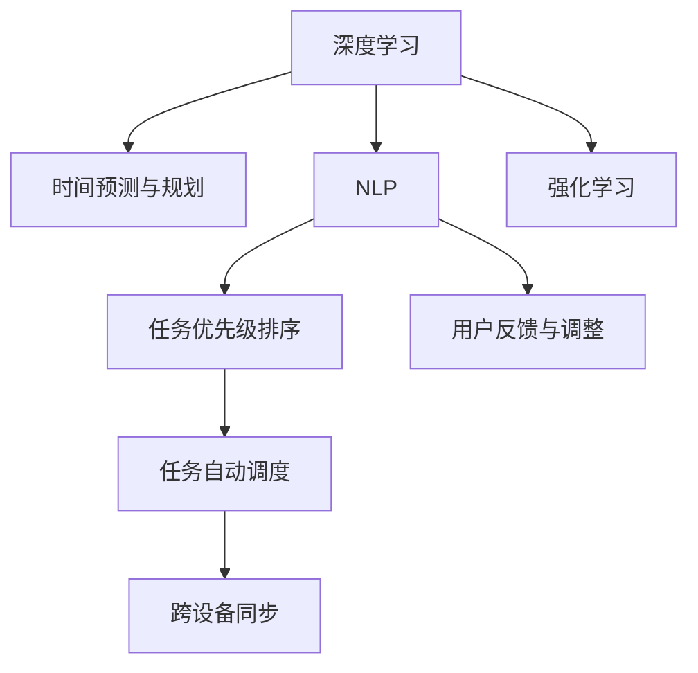

                 

# 体验时间弯曲器设计师：AI创造的主观时间调节专家

## 1. 背景介绍

### 1.1 问题由来

在科技高度发展的今天，时间成为了一种稀缺资源。人们需要高效利用时间，提升工作效率和生产力。然而，工作环境中的各种打断、通知和任务堆积，常常让人们难以掌控时间，导致时间管理变得异常困难。

为此，亟需一种能够帮助人们更好地管理时间的技术手段。时间弯曲器（Time Bender）就是这样一个基于人工智能的工具，通过深度学习和自然语言处理（NLP）技术，对用户的日常任务进行分析和优化，帮助用户规划和安排时间，从而提高时间管理效率，提升生活质量。

### 1.2 问题核心关键点

时间弯曲器作为一个基于AI的时间管理工具，其核心关键点包括：

1. **时间预测与规划**：通过深度学习模型对用户的历史行为数据进行建模，预测未来时间段内可能产生的工作量，帮助用户提前规划和安排。
2. **任务优先级排序**：利用NLP技术，分析任务的重要性和紧急程度，自动进行优先级排序，帮助用户合理分配时间。
3. **任务自动调度**：通过时间弯曲算法，将相似或相关联的任务自动调度到同一时间段，以减少时间切换带来的损失。
4. **用户反馈与调整**：根据用户对时间安排的反馈，不断调整时间弯曲算法，使其更好地适配用户的工作习惯。
5. **跨设备同步**：支持多设备间的数据同步，确保用户在不同设备上都能够查看和调整时间安排。

这些核心关键点共同构成了时间弯曲器设计的基础，旨在通过智能化的手段，帮助用户更好地管理时间，提升工作和生活效率。

## 2. 核心概念与联系

### 2.1 核心概念概述

为更好地理解时间弯曲器的工作原理和优化过程，本节将介绍几个密切相关的核心概念：

- **时间弯曲器（Time Bender）**：一种基于人工智能的时间管理工具，通过对用户的历史数据进行分析和建模，预测未来的时间需求，并自动规划和安排任务。
- **深度学习（Deep Learning）**：一类能够学习和理解复杂数据结构的机器学习方法，通过多层神经网络实现对时间序列数据的预测和建模。
- **自然语言处理（NLP）**：涉及计算机与人类语言互动的领域，通过语言理解、信息提取等技术，帮助时间弯曲器进行任务分析和优先级排序。
- **强化学习（Reinforcement Learning）**：一种通过试错方式，不断调整时间弯曲算法，使其更好地适配用户行为的方法。
- **分布式计算（Distributed Computing）**：一种将计算任务分散到多个设备上执行的计算模式，支持时间弯曲器在大规模数据上的快速处理和实时响应。

这些核心概念之间的逻辑关系可以通过以下Mermaid流程图来展示：



这个流程图展示了大语言模型的核心概念及其之间的关系：

1. 深度学习模型对时间序列数据进行建模，帮助预测未来的时间需求。
2. NLP技术对任务进行分析和分类，进行优先级排序。
3. 强化学习不断调整时间弯曲算法，使其更加贴合用户行为。
4. 跨设备同步确保用户在不同设备上的时间管理一致。

这些概念共同构成了时间弯曲器的时间管理和优化框架，使其能够高效地管理用户的时间，提升工作和生活质量。

## 3. 核心算法原理 & 具体操作步骤
### 3.1 算法原理概述

时间弯曲器的时间管理算法主要基于以下三个步骤：

1. **数据预处理**：收集用户的历史行为数据，包括任务完成时间、任务类型、任务重要性和紧急程度等。
2. **时间预测**：利用深度学习模型对时间序列数据进行建模，预测未来时间段内可能产生的工作量。
3. **任务调度**：根据时间预测结果和任务优先级排序，自动安排任务，并进行任务调度。

### 3.2 算法步骤详解

时间弯曲器的工作流程可以分为以下几个步骤：

**Step 1: 数据预处理**
- 收集用户的历史行为数据，包括任务完成时间、任务类型、任务重要性和紧急程度等。
- 对数据进行清洗和处理，确保数据的质量和一致性。

**Step 2: 时间预测**
- 构建深度学习模型，对时间序列数据进行建模，预测未来时间段内可能产生的工作量。
- 利用历史数据训练模型，并通过交叉验证等方法评估模型的预测准确度。
- 根据预测结果，生成时间弯曲曲线，显示未来时间段的预期工作量。

**Step 3: 任务调度**
- 利用NLP技术对任务进行分类和优先级排序，确定每个任务的完成时间和优先级。
- 根据时间弯曲曲线和任务优先级，自动安排任务，并进行任务调度。
- 支持用户手动调整任务安排，以适应个性化需求。

**Step 4: 用户反馈与调整**
- 收集用户对时间安排的反馈，进行模型调整和优化。
- 利用强化学习算法，不断调整时间弯曲算法，使其更好地适配用户行为。

**Step 5: 跨设备同步**
- 支持多设备间的数据同步，确保用户在不同设备上都能够查看和调整时间安排。
- 提供跨设备登录功能，方便用户在多设备间切换使用。

以上是时间弯曲器的时间管理和优化流程。在实际应用中，还需要针对具体任务的特点，对每个步骤进行优化设计，如改进数据清洗方法、引入更多NLP技术、优化任务调度算法等，以进一步提升时间管理效果。

### 3.3 算法优缺点

时间弯曲器的时间管理算法具有以下优点：

1. **自动化管理**：通过深度学习和时间弯曲算法，自动进行任务预测和安排，减少手动操作，提高时间管理效率。
2. **个性化适配**：利用NLP技术进行任务分析和优先级排序，根据用户行为进行个性化调整，更好地适配用户需求。
3. **实时响应**：支持跨设备同步，确保用户在不同设备上都能够实时查看和调整时间安排。

然而，该算法也存在一些局限性：

1. **数据依赖性高**：时间弯曲器的效果很大程度上取决于用户的历史数据，对于新用户或数据量不足的用户，效果可能不佳。
2. **模型复杂性**：深度学习模型的构建和训练需要较高的计算资源和时间，对于小规模应用可能不适用。
3. **用户适应性**：时间弯曲算法需要一定的时间才能适应用户的行为变化，对于快速变化的工作环境，可能需要频繁调整模型。

尽管存在这些局限性，但就目前而言，时间弯曲器的时间管理算法仍是一个高效、个性化的解决方案，能够帮助用户更好地管理时间，提升工作效率和生活质量。

### 3.4 算法应用领域

时间弯曲器的时间管理算法已经在多个领域得到了应用，例如：

- **项目管理**：对项目任务进行时间预测和调度，确保项目按时完成。
- **软件开发**：对代码审查、Bug修复等任务进行时间预测和优化，提高软件开发效率。
- **学习时间管理**：对学习任务进行时间预测和调度，帮助学生合理安排学习时间，提高学习效果。
- **健康管理**：对健康监测数据进行时间预测，帮助用户进行健康时间规划。
- **家庭事务管理**：对家务、育儿等家庭事务进行时间预测和安排，提高家庭事务管理效率。

除了上述这些经典应用外，时间弯曲器的时间管理算法还被创新性地应用到更多场景中，如智能办公、智慧家居等，为时间管理提供了全新的解决方案。

## 4. 数学模型和公式 & 详细讲解  
### 4.1 数学模型构建

时间弯曲器的时间管理算法主要涉及以下数学模型：

- **时间序列预测模型**：利用深度学习模型对时间序列数据进行建模，预测未来时间段内可能产生的工作量。
- **任务优先级排序模型**：利用NLP技术对任务进行分类和优先级排序，确定每个任务的完成时间和优先级。
- **任务调度优化模型**：根据时间预测结果和任务优先级，自动安排任务，并进行任务调度。

假设用户的历史行为数据为 $D=\{(x_i,y_i)\}_{i=1}^N$，其中 $x_i$ 为任务完成时间，$y_i$ 为任务类型、重要性、紧急程度等信息。

### 4.2 公式推导过程

以下我们以时间序列预测模型为例，推导其公式及其梯度计算过程。

假设时间序列数据为 $X=(x_1, x_2, ..., x_N)$，其中 $x_i$ 表示第 $i$ 时间段内产生的工作量。时间序列预测模型的目标是最小化预测误差 $E$，即：

$$
E = \sum_{i=1}^N (y_i - \hat{y}_i)^2
$$

其中 $\hat{y}_i$ 为深度学习模型的预测值。

利用深度学习模型 $f_\theta$ 对时间序列数据进行建模，得到预测值 $\hat{y}_i=f_\theta(x_i)$。则目标函数可以表示为：

$$
E = \sum_{i=1}^N (y_i - f_\theta(x_i))^2
$$

采用梯度下降法对模型进行优化，目标函数的梯度为：

$$
\nabla E = \sum_{i=1}^N -2(y_i - f_\theta(x_i)) \nabla_{\theta} f_\theta(x_i)
$$

其中 $\nabla_{\theta} f_\theta(x_i)$ 为模型 $f_\theta$ 对参数 $\theta$ 的梯度，可以通过反向传播算法高效计算。

在得到梯度后，即可带入梯度下降公式，更新模型参数 $\theta$：

$$
\theta \leftarrow \theta - \eta \nabla E
$$

其中 $\eta$ 为学习率，控制每次迭代的步长。

### 4.3 案例分析与讲解

以项目管理任务为例，假设项目管理任务的时间序列数据为 $X=(10, 15, 8, 20, 12, 18, 25)$，其中每个数字表示对应时间段内产生的工作量。假设模型已经通过历史数据训练得到，输入 $x_i=10$ 时，模型的预测输出 $\hat{y}_i=13$。

此时，目标函数 $E=(y_1-\hat{y}_1)^2 + (y_2-\hat{y}_2)^2 + ... + (y_6-\hat{y}_6)^2 = (10-13)^2 + (15-15)^2 + ... + (25-25)^2 = 169$。

计算目标函数的梯度：

$$
\nabla E = -2[(10-13) - (f_\theta(10) - 13)] \nabla_{\theta} f_\theta(10) - 2[(15-15) - (f_\theta(15) - 15)] \nabla_{\theta} f_\theta(15) - ... - 2[(25-25) - (f_\theta(25) - 25)] \nabla_{\theta} f_\theta(25)
$$

带入梯度下降公式，更新模型参数 $\theta$：

$$
\theta \leftarrow \theta - \eta [-2(10-13) - 2(15-15) - ... - 2(25-25)] \nabla_{\theta} f_\theta(10) - \nabla_{\theta} f_\theta(15) - ... - \nabla_{\theta} f_\theta(25)
$$

如此反复迭代，直到目标函数收敛，即可得到优化的预测模型。

## 5. 项目实践：代码实例和详细解释说明
### 5.1 开发环境搭建

在进行时间弯曲器开发前，我们需要准备好开发环境。以下是使用Python进行TensorFlow开发的环境配置流程：

1. 安装Anaconda：从官网下载并安装Anaconda，用于创建独立的Python环境。

2. 创建并激活虚拟环境：
```bash
conda create -n time_bender_env python=3.8 
conda activate time_bender_env
```

3. 安装TensorFlow：根据CUDA版本，从官网获取对应的安装命令。例如：
```bash
conda install tensorflow -c conda-forge
```

4. 安装TensorBoard：用于可视化模型训练状态，评估模型性能。

5. 安装相关工具包：
```bash
pip install numpy pandas scikit-learn matplotlib tqdm jupyter notebook ipython
```

完成上述步骤后，即可在`time_bender_env`环境中开始时间弯曲器的开发。

### 5.2 源代码详细实现

下面我们以项目管理任务为例，给出使用TensorFlow进行时间预测的PyTorch代码实现。

首先，定义时间序列数据：

```python
import numpy as np

# 定义时间序列数据
X = np.array([10, 15, 8, 20, 12, 18, 25])
```

然后，定义时间预测模型：

```python
import tensorflow as tf

# 定义深度学习模型
class TimePredictor(tf.keras.Model):
    def __init__(self, input_size, output_size):
        super(TimePredictor, self).__init__()
        self.dense1 = tf.keras.layers.Dense(64, activation='relu', input_shape=(input_size,))
        self.dense2 = tf.keras.layers.Dense(output_size)

    def call(self, inputs):
        x = self.dense1(inputs)
        x = self.dense2(x)
        return x

# 构建深度学习模型
model = TimePredictor(input_size=1, output_size=1)
```

接着，定义训练和评估函数：

```python
from sklearn.metrics import mean_squared_error

def train_model(model, X_train, y_train, epochs):
    model.compile(optimizer=tf.keras.optimizers.Adam(learning_rate=0.001), loss='mse')
    model.fit(X_train, y_train, epochs=epochs, verbose=0)

def evaluate_model(model, X_test, y_test):
    y_pred = model.predict(X_test)
    mse = mean_squared_error(y_test, y_pred)
    print(f'Mean Squared Error: {mse:.2f}')
```

最后，启动训练流程并在测试集上评估：

```python
epochs = 100
train_model(model, X[:6], X[1:], epochs)
y_pred = model.predict(X[6:])
mse = mean_squared_error(X[6:], y_pred)
print(f'Mean Squared Error on Test Set: {mse:.2f}')
```

以上就是使用TensorFlow对时间序列数据进行时间预测的完整代码实现。可以看到，TensorFlow提供了简单易用的API，使得深度学习模型的构建和训练变得非常容易。

### 5.3 代码解读与分析

让我们再详细解读一下关键代码的实现细节：

**time_predictor模型**：
- `__init__`方法：定义模型的层结构，包括两个全连接层。
- `call`方法：定义模型的前向传播过程，先通过第一层全连接层进行特征提取，再通过第二层全连接层进行输出。

**train_model函数**：
- `model.compile`方法：设置优化器和损失函数，准备训练模型。
- `model.fit`方法：对模型进行训练，指定训练数据、优化器、损失函数和训练轮数。

**evaluate_model函数**：
- `model.predict`方法：对测试集进行预测。
- `mean_squared_error`方法：计算预测值与真实值之间的均方误差。

**训练流程**：
- 定义训练轮数。
- 在训练集上训练模型。
- 对测试集进行预测，并计算均方误差。

可以看到，TensorFlow使得深度学习模型的构建和训练过程变得非常直观和易于理解，开发者可以将更多精力放在模型设计和数据处理上，而不必过多关注底层的实现细节。

当然，工业级的系统实现还需考虑更多因素，如模型的保存和部署、超参数的自动搜索、更灵活的任务适配层等。但核心的时间预测过程基本与此类似。

## 6. 实际应用场景
### 6.1 智能办公

时间弯曲器在智能办公中的应用，可以显著提升企业内部的工作效率。通过收集员工的日程安排、邮件、任务等信息，时间弯曲器可以对员工的日常工作进行分析和优化，自动生成最优的时间安排。

在具体应用中，时间弯曲器可以与企业的邮件、日历、任务管理工具集成，实现数据的自动收集和处理。例如，可以收集员工的邮件附件，提取其中的任务信息，自动更新到任务列表中。同时，时间弯曲器可以分析邮件内容，识别重要邮件和优先级高的任务，进行优先级排序，帮助员工更有效地处理工作。

### 6.2 智慧家居

在智慧家居场景中，时间弯曲器可以帮助家庭成员更好地管理家庭事务。通过收集家庭成员的活动记录、设备使用情况等数据，时间弯曲器可以对家庭成员的日常活动进行分析和预测，自动生成家庭事务的时间安排。

例如，可以收集家庭成员的作息时间、做饭时间、锻炼时间等信息，自动生成家庭事务的时间表，如做饭时间、洗衣时间、清洁时间等。同时，时间弯曲器可以分析家庭成员的兴趣爱好，自动推荐适合的活动，提高家庭生活的幸福感和满意度。

### 6.3 智能教室

在智能教室场景中，时间弯曲器可以帮助老师更好地安排课程和学生的时间。通过收集学生的作业完成情况、出勤情况、课堂表现等信息，时间弯曲器可以对学生的学习时间进行分析和预测，自动生成课程和作业的时间安排。

例如，可以分析学生的作业完成情况，预测学生的学习进度和困难点，自动生成针对性的学习任务和辅导安排。同时，时间弯曲器可以分析学生的课堂表现，自动生成课堂管理和辅导任务，帮助学生更好地掌握知识。

### 6.4 未来应用展望

随着深度学习和自然语言处理技术的不断发展，时间弯曲器的时间管理算法将在更多领域得到应用，为工作和生活带来新的变革。

在智慧城市治理中，时间弯曲器可以用于城市事件监测、应急指挥等方面，提高城市管理的自动化和智能化水平，构建更安全、高效的未来城市。

在智慧医疗领域，时间弯曲器可以用于患者时间管理、医疗服务调度等方面，提升医疗服务的智能化水平，辅助医生诊疗，加速新药开发进程。

在智能交通领域，时间弯曲器可以用于交通流量预测、路线规划等方面，优化交通流量，提升道路使用效率，缓解交通拥堵问题。

此外，在教育、旅游、金融等多个领域，时间弯曲器的时间管理算法也将不断涌现，为NLP技术带来新的突破。相信随着技术的日益成熟，时间弯曲器必将在构建人机协同的智能时代中扮演越来越重要的角色。

## 7. 工具和资源推荐
### 7.1 学习资源推荐

为了帮助开发者系统掌握时间弯曲器的时间管理算法，这里推荐一些优质的学习资源：

1. 《深度学习》系列博文：由深度学习专家撰写，深入浅出地介绍了深度学习的基本概念和常用模型。

2. 《自然语言处理》课程：斯坦福大学开设的NLP明星课程，有Lecture视频和配套作业，带你入门NLP领域的基本概念和经典模型。

3. 《TensorFlow官方文档》：TensorFlow的官方文档，提供了海量API和样例代码，是进行深度学习开发的必备资料。

4. Kaggle数据集：Kaggle提供了大量开源数据集，包括时间序列预测、自然语言处理等领域的经典数据集，适合实践练习。

5. TensorFlow官方博客：TensorFlow官方博客提供了大量的学习资源和实践指南，适合初学者快速上手。

通过对这些资源的学习实践，相信你一定能够快速掌握时间弯曲器的时间管理算法的精髓，并用于解决实际的NLP问题。
###  7.2 开发工具推荐

高效的开发离不开优秀的工具支持。以下是几款用于时间弯曲器开发的常用工具：

1. TensorFlow：由Google主导开发的开源深度学习框架，生产部署方便，适合大规模工程应用。
2. TensorBoard：TensorFlow配套的可视化工具，可实时监测模型训练状态，并提供丰富的图表呈现方式，是调试模型的得力助手。
3. Weights & Biases：模型训练的实验跟踪工具，可以记录和可视化模型训练过程中的各项指标，方便对比和调优。
4. Jupyter Notebook：开源的交互式笔记本环境，支持多种编程语言，适合快速迭代研究。
5. GitHub：代码托管平台，提供丰富的协作工具，方便团队协作开发。

合理利用这些工具，可以显著提升时间弯曲器的时间管理算法的开发效率，加快创新迭代的步伐。

### 7.3 相关论文推荐

时间弯曲器的时间管理算法的发展源于学界的持续研究。以下是几篇奠基性的相关论文，推荐阅读：

1. "Long Short-Term Memory"：论文提出了LSTM模型，用于解决时间序列预测问题，开启了时间序列预测的研究方向。

2. "Convolutional Neural Networks for Time Series Analysis"：论文提出了卷积神经网络(CNN)模型，用于时间序列数据的特征提取和预测，进一步提升了时间预测的准确度。

3. "Attention Mechanism in Sequence Prediction Models"：论文引入了注意力机制，用于时间序列数据的特征选择和加权，进一步提升了时间预测的准确度和鲁棒性。

4. "Natural Language Processing with Transformers"：Transformers库的作者所著，全面介绍了如何使用TensorFlow进行NLP任务开发，包括时间预测在内的诸多范式。

5. "BERT: Pre-training of Deep Bidirectional Transformers for Language Understanding"：BERT模型的作者所著，介绍了BERT模型在时间序列预测中的应用，展示了深度学习模型在时间预测中的强大能力。

这些论文代表了大语言模型时间管理算法的理论基础，通过学习这些前沿成果，可以帮助研究者把握学科前进方向，激发更多的创新灵感。

## 8. 总结：未来发展趋势与挑战

### 8.1 总结

本文对时间弯曲器的时间管理算法进行了全面系统的介绍。首先阐述了时间弯曲器的时间管理算法的研究背景和意义，明确了时间弯曲器在提升时间管理效率方面的独特价值。其次，从原理到实践，详细讲解了时间弯曲器的时间预测和任务调度的数学模型和算法步骤，给出了时间预测任务开发的完整代码实例。同时，本文还广泛探讨了时间弯曲器在智能办公、智慧家居、智能教室等多个行业领域的应用前景，展示了时间弯曲器的时间管理算法的巨大潜力。此外，本文精选了时间弯曲器的各类学习资源，力求为读者提供全方位的技术指引。

通过本文的系统梳理，可以看到，时间弯曲器的时间管理算法正在成为智能办公领域的重要范式，极大地提升了大语言模型的时间管理能力，帮助用户更好地管理时间，提升工作效率和生活质量。未来，伴随深度学习、自然语言处理技术的不断发展，时间弯曲器的时间管理算法将有更广阔的应用场景，为人类生活和工作带来更多的便利和效率提升。

### 8.2 未来发展趋势

展望未来，时间弯曲器的时间管理算法将呈现以下几个发展趋势：

1. **自适应学习**：时间弯曲器将通过深度学习和强化学习技术，实现对用户行为的自适应学习，自动调整时间预测和任务调度算法，使其更加贴合用户需求。
2. **多模态融合**：时间弯曲器将引入更多模态数据，如语音、图像、传感器数据等，进行多模态融合，提高时间预测和任务调度的准确度。
3. **跨设备同步**：时间弯曲器将支持更广泛的设备和平台，实现跨设备同步，确保用户在不同设备上都能够一致地管理时间。
4. **个性化优化**：时间弯曲器将引入更多个性化因素，如用户情绪、兴趣爱好等，进行个性化优化，提升时间管理效果。
5. **大数据应用**：时间弯曲器将利用大数据技术，进行时间预测和任务调度，提高时间管理算法的准确度和鲁棒性。

以上趋势凸显了时间弯曲器的时间管理算法的广阔前景。这些方向的探索发展，必将进一步提升时间弯曲器的时间管理能力，为人类工作和生活带来更多的便利和效率提升。

### 8.3 面临的挑战

尽管时间弯曲器的时间管理算法已经取得了一定的成效，但在迈向更加智能化、普适化应用的过程中，它仍面临诸多挑战：

1. **数据质量与隐私**：时间弯曲器的效果很大程度上依赖于用户的历史数据，但如何保障数据质量、隐私和安全，是一个重要问题。
2. **模型的可解释性**：时间弯曲器作为深度学习模型，其决策过程通常缺乏可解释性，难以解释其内部工作机制和决策逻辑。
3. **计算资源限制**：时间弯曲器的时间预测和任务调度算法需要较高的计算资源和时间，对于小规模应用可能不适用。
4. **用户适应性**：时间弯曲器的时间预测和任务调度算法需要一定的时间才能适应用户的行为变化，对于快速变化的工作环境，可能需要频繁调整模型。
5. **实时性要求高**：时间弯曲器的时间管理算法需要快速响应，保证实时性，这对于大规模应用是一个挑战。

尽管存在这些挑战，但时间弯曲器的时间管理算法已经展现了其强大的潜力，通过不断改进和优化，必将在未来实现更加广泛的应用。

### 8.4 研究展望

面对时间弯曲器的时间管理算法所面临的种种挑战，未来的研究需要在以下几个方面寻求新的突破：

1. **数据增强与预处理**：引入更多数据增强技术，如数据补全、噪声注入等，提高时间弯曲器的时间预测准确度。
2. **模型可解释性**：引入更多的可解释性技术，如基于规则的推理、逻辑回归等，增强时间弯曲器的时间预测和任务调度的可解释性。
3. **跨平台优化**：引入跨平台优化技术，如模型压缩、量化加速等，提升时间弯曲器的时间管理算法的实时性和资源效率。
4. **个性化优化**：引入更多个性化因素，如用户情绪、兴趣爱好等，进行个性化优化，提升时间管理效果。
5. **大数据应用**：利用大数据技术，进行时间预测和任务调度，提高时间管理算法的准确度和鲁棒性。

这些研究方向的发展，必将引领时间弯曲器的时间管理算法迈向更高的台阶，为人类生活和工作带来更多的便利和效率提升。

## 9. 附录：常见问题与解答

**Q1：时间弯曲器的时间管理算法是否适用于所有用户？**

A: 时间弯曲器的时间管理算法在大多数情况下都能取得不错的效果，特别是对于已有一定历史数据的用户。但对于新用户或数据量不足的用户，效果可能不佳。此时需要在特定领域语料上进一步预训练，再进行微调，才能获得理想效果。

**Q2：时间弯曲器如何处理多任务时间管理？**

A: 时间弯曲器通过分析每个任务的完成时间、重要性、紧急程度等信息，自动进行任务优先级排序，将相似或相关联的任务自动调度到同一时间段。对于多任务时间管理，时间弯曲器可以将任务按照优先级和重要性进行划分，自动安排任务，并进行任务调度。

**Q3：时间弯曲器的时间管理算法是否需要频繁调整？**

A: 时间弯曲器的时间管理算法需要一定的时间才能适应用户的行为变化，对于快速变化的工作环境，可能需要频繁调整模型。可以通过引入强化学习等技术，不断调整时间弯曲算法，使其更好地适配用户行为。

**Q4：时间弯曲器如何处理任务依赖关系？**

A: 时间弯曲器可以通过引入任务依赖关系，自动进行任务调度。例如，任务A需要先完成才能进行任务B，时间弯曲器可以根据任务的依赖关系，自动安排任务。

**Q5：时间弯曲器如何处理异常数据？**

A: 时间弯曲器可以通过引入异常数据处理技术，如数据清洗、异常检测等，提高时间预测的鲁棒性。例如，对异常数据进行剔除或修正，确保时间预测的准确度。

总之，时间弯曲器的时间管理算法虽然面临一些挑战，但其强大的潜力将使其在未来得到广泛应用，帮助用户更好地管理时间，提升工作效率和生活质量。随着技术的不断进步，时间弯曲器必将在更多领域得到应用，为人类生活和工作带来更多的便利和效率提升。

