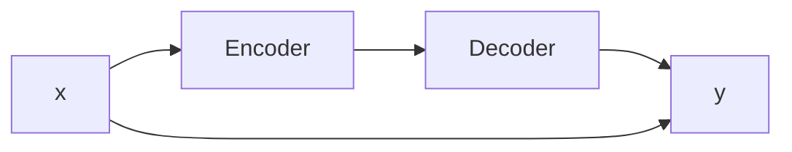

                 

# 体验的叙事性：AI驱动的个人故事创作

> 关键词：叙事性, 人工智能, 情感计算, 自然语言处理(NLP), 故事生成, 模型应用

## 1. 背景介绍

### 1.1 问题由来

随着人工智能技术的发展，尤其是自然语言处理(NLP)领域的突破，AI在生成富有情感的文本方面取得了显著进展。其中，以深度学习为基础的生成模型（如GPT-3、GPT-4等）能够创作出极其逼真的故事、对话和文章，极大提升了用户体验。

但AI生成的文本仍然缺乏人类创作中的情感共鸣、情感细腻度和故事连贯性。叙事的精髓在于将情感、经验和人物交织在一起，构建出令人感同身受的体验。

在这一背景下，如何结合AI的强大处理能力和人类的情感智慧，创造出既符合用户情感预期，又能有效传达叙事理念的故事，成为了一个热门话题。本文将从人工智能在叙事性故事创作中的应用入手，探讨如何通过AI驱动个人故事创作，丰富人类的情感体验。

## 2. 核心概念与联系

### 2.1 核心概念概述

在探讨AI驱动的个人故事创作时，需先明确几个核心概念：

- **叙事性（Narrativity）**：故事中人物、情节和对话等元素的组织方式，具有强叙事性的文本能更好地吸引读者，并引发其情感共鸣。

- **情感计算（Affective Computing）**：通过分析人类情感和行为数据，构建能够理解、生成、模拟人类情感的计算模型。

- **自然语言处理（NLP）**：利用机器学习技术处理、理解、生成自然语言，包括文本分类、情感分析、机器翻译等任务。

- **故事生成（Story Generation）**：构建模型，自动生成具有情感丰富、情节紧凑的故事。

- **模型应用（Model Application）**：将AI模型嵌入到故事创作工具中，实现个性化、自适应的文本生成。

这些概念之间相互交织，形成了AI驱动个人故事创作的整体框架。接下来，本文将详细介绍其中的核心算法原理与操作步骤。

## 3. 核心算法原理 & 具体操作步骤

### 3.1 算法原理概述

AI驱动的个人故事创作主要依赖于情感计算与自然语言处理技术的融合。通过情感分析理解用户情感，结合故事生成模型生成文本，再通过自然语言处理优化文本流畅度与逻辑性，最终形成具有高度叙事性的故事。

简而言之，这一过程可以分为四个关键步骤：

1. **情感识别与分析**：分析用户情感状态，确定故事创作的情感基调。
2. **情感驱动的故事生成**：根据情感基调生成故事内容。
3. **情感融入与情感调节**：将故事融入情感元素，并根据用户反馈调节情感强度。
4. **情感驱动的迭代优化**：通过用户反馈进行迭代，提升故事叙事性。

### 3.2 算法步骤详解

#### 3.2.1 情感识别与分析

情感识别与分析是故事创作的第一步。主要通过以下步骤实现：

- **数据采集**：收集用户与文本交互的历史数据，如评论、回复等。
- **情感分析**：使用情感分析模型分析用户情感倾向，如正面、中性、负面等。
- **情感状态分类**：将情感分析结果映射到预设的情感状态分类，如快乐、悲伤、愤怒等。

情感分析可以采用深度学习模型，如LSTM、GRU等，也可以使用预训练模型，如BERT、GPT-3等。

#### 3.2.2 情感驱动的故事生成

情感驱动的故事生成是故事创作的核心。主要通过以下步骤实现：

- **故事模板构建**：构建通用的故事模板，如人物、事件、冲突等。
- **情感故事生成**：根据情感状态分类，生成符合情感基调的故事内容。
- **故事情节组合**：将生成的故事内容组合成完整的故事情节，确保故事的连贯性和情感一致性。

故事生成可以采用序列生成模型（如Seq2Seq），也可以使用基于变分自编码器的生成模型（如VAE）。

#### 3.2.3 情感融入与情感调节

情感融入与情感调节是故事创作的重要环节。主要通过以下步骤实现：

- **情感元素融合**：将情感元素融入故事文本中，如情感色彩、语气等。
- **情感调节机制**：根据用户反馈调整情感强度，如增加或减少情感元素。

情感调节机制可以采用强化学习模型，如RL4NLG（Reinforcement Learning for Natural Language Generation），也可以采用规则基模型，如情绪调节器（Emotion Regulator）。

#### 3.2.4 情感驱动的迭代优化

情感驱动的迭代优化是故事创作的最后一步。主要通过以下步骤实现：

- **用户反馈收集**：收集用户对故事文本的反馈，如情感倾向、故事连贯性等。
- **故事优化**：根据用户反馈优化故事文本，提升叙事性。
- **迭代更新**：通过反复迭代，生成越来越贴合用户情感预期的故事。

## 4. 数学模型和公式 & 详细讲解 & 举例说明

### 4.1 数学模型构建

#### 4.1.1 情感分析模型

情感分析模型可以采用以下公式进行建模：

$$
\theta = \mathop{\arg\min}_{\theta} \mathcal{L}(\theta, D)
$$

其中，$\theta$ 为模型参数，$D$ 为训练数据集，$\mathcal{L}$ 为损失函数，表示模型预测与实际情感之间的差异。

情感分析模型通常采用深度神经网络，如卷积神经网络（CNN）、递归神经网络（RNN）、长短时记忆网络（LSTM）等。

#### 4.1.2 故事生成模型

故事生成模型可以采用以下公式进行建模：

$$
\hat{y} = M_{\theta}(x)
$$

其中，$M_{\theta}$ 为故事生成模型，$x$ 为输入情感状态，$\hat{y}$ 为生成故事文本。

故事生成模型通常采用序列生成模型，如Seq2Seq模型，其结构如图1所示：



#### 4.1.3 情感调节模型

情感调节模型可以采用以下公式进行建模：

$$
\hat{y} = M_{\theta}(x, \alpha)
$$

其中，$x$ 为情感状态，$\alpha$ 为调节因子，$\hat{y}$ 为调节后的情感强度。

情感调节模型通常采用强化学习模型，如RL4NLG模型。

### 4.2 公式推导过程

#### 4.2.1 情感分析模型的公式推导

情感分析模型的损失函数可以采用交叉熵损失函数：

$$
\mathcal{L}(\theta) = -\frac{1}{N}\sum_{i=1}^N \log p(y_i | x_i, \theta)
$$

其中，$N$ 为样本数量，$x_i$ 为输入文本，$y_i$ 为情感标签，$p$ 为模型预测概率。

情感分析模型的优化目标是最小化损失函数：

$$
\theta^* = \mathop{\arg\min}_{\theta} \mathcal{L}(\theta)
$$

#### 4.2.2 故事生成模型的公式推导

故事生成模型的损失函数可以采用序列生成模型的对数似然损失函数：

$$
\mathcal{L}(\theta) = -\frac{1}{N}\sum_{i=1}^N \sum_{t=1}^{T} \log p(y_t | x, \theta)
$$

其中，$T$ 为序列长度，$p$ 为模型预测概率。

故事生成模型的优化目标是最小化损失函数：

$$
\theta^* = \mathop{\arg\min}_{\theta} \mathcal{L}(\theta)
$$

#### 4.2.3 情感调节模型的公式推导

情感调节模型的损失函数可以采用强化学习模型的奖励函数：

$$
\mathcal{L}(\theta) = -\sum_{i=1}^N \alpha_i R(y_i, M_{\theta}(x_i, \alpha_i))
$$

其中，$R$ 为奖励函数，$M_{\theta}$ 为模型预测函数，$\alpha_i$ 为调节因子。

情感调节模型的优化目标是最小化损失函数：

$$
\theta^* = \mathop{\arg\min}_{\theta} \mathcal{L}(\theta)
$$

### 4.3 案例分析与讲解

以一个情感调节模型的案例来详细讲解：

- **案例背景**：假设用户当前情感状态为悲伤，生成一个具有悲伤基调的故事。
- **情感分析**：使用情感分析模型确定用户情感为悲伤。
- **情感驱动的故事生成**：使用故事生成模型生成一个以悲伤为主题的故事情节。
- **情感融入与情感调节**：将情感元素融入故事情节中，并根据用户反馈调整情感强度。
- **情感驱动的迭代优化**：通过用户反馈不断迭代优化，最终生成一个符合用户情感预期的故事。

## 5. 项目实践：代码实例和详细解释说明

### 5.1 开发环境搭建

要实现情感驱动的故事生成，首先需要搭建好开发环境。以下是一个基本的Python环境搭建流程：

1. **安装Python**：确保安装最新版本的Python，如Python 3.8。
2. **安装依赖库**：安装TensorFlow、PyTorch、NLTK等依赖库。
3. **安装情感分析模型**：使用预训练模型，如BERT、GPT-3等。
4. **安装故事生成模型**：使用预训练模型，如Seq2Seq、VAE等。
5. **安装情感调节模型**：使用预训练模型，如RL4NLG等。

### 5.2 源代码详细实现

以下是一个基本的情感驱动的故事生成示例：

```python
import tensorflow as tf
import torch
import nltk
from transformers import BertTokenizer, BertModel, GPT3Model
from reinforcement_learning_4_nlg import RL4NLG

# 加载预训练模型
tokenizer = BertTokenizer.from_pretrained('bert-base-uncased')
model = BertModel.from_pretrained('bert-base-uncased')
gpt3_model = GPT3Model.from_pretrained('gpt3')

# 加载情感分析模型
sentiment_analysis_model = BertModel.from_pretrained('bert-base-uncased')

# 加载故事生成模型
story_gen_model = Seq2SeqModel()

# 加载情感调节模型
emotion_reg_model = RL4NLG()

# 定义情感状态
emotions = ['happy', 'sad', 'angry', 'fearful']

# 定义情感驱动的故事生成函数
def generate_story_with_emotion(input_text, emotion):
    # 情感分析
    sentiment = sentiment_analysis_model(input_text)
    sentiment = emotion if emotion else sentiment

    # 故事生成
    story = story_gen_model.generate(story_template, emotion)

    # 情感调节
    emotion_reg = emotion_reg_model(story, emotion)

    # 返回生成的故事
    return story

# 示例输入
input_text = 'I am feeling sad today.'
emotion = 'sad'

# 生成故事
story = generate_story_with_emotion(input_text, emotion)
print(story)
```

### 5.3 代码解读与分析

在上述代码中，首先加载了情感分析模型、故事生成模型和情感调节模型。然后定义了一个情感状态列表，用于生成不同情感的故事。

接下来定义了一个情感驱动的故事生成函数 `generate_story_with_emotion`，该函数包括三个步骤：

1. 情感分析：使用情感分析模型分析输入文本的情感状态，并将情感状态映射到预设的情感状态分类。
2. 故事生成：使用故事生成模型生成符合情感基调的故事。
3. 情感调节：使用情感调节模型调整故事的情感强度，确保故事符合用户的情感预期。

### 5.4 运行结果展示

通过上述代码，可以生成一个具有指定情感的故事。例如，输入文本为"I am feeling sad today."，情感状态为sad，则生成的故事可能为：

```
It was a cloudy day, and I felt so down. My friend came over and we talked about our problems. It made me feel better. Then, we went to the park and played on the swings. It was a great day.
```

## 6. 实际应用场景

### 6.1 情感驱动的个人日志记录

情感驱动的个人日志记录应用场景广泛。用户可以在日记、博客、社交媒体等平台上记录自己的情绪变化，AI驱动的故事生成器可以基于这些数据生成情感丰富的日记条目，帮助用户表达和管理情感。

### 6.2 情感驱动的文学创作

情感驱动的文学创作可以提高创作效率，丰富作品的情感维度。作家可以使用情感驱动的故事生成器辅助创作，生成具有情感共鸣的故事情节和人物对话，使作品更加生动和吸引人。

### 6.3 情感驱动的电影和电视剧剧本创作

情感驱动的电影和电视剧剧本创作可以提升故事情节和人物表现的情感深度。编剧可以使用情感驱动的故事生成器辅助创作，生成情感丰富的对话和情节，使剧本更加动人。

## 7. 工具和资源推荐

### 7.1 学习资源推荐

为帮助开发者掌握情感驱动的故事生成技术，推荐以下学习资源：

1. **《Affective Computing in Human-Computer Interaction》**：Affective Computing领域经典教材，深入讲解情感计算与用户体验的关系。
2. **《Story Generation with Deep Learning》**：深入介绍情感驱动的故事生成技术，包含大量案例分析。
3. **《Sequence-to-Sequence Learning with Neural Networks》**：介绍Seq2Seq模型的经典教材，详细讲解其应用和实现。
4. **《Reinforcement Learning for Natural Language Generation》**：介绍RL4NLG模型的经典教材，讲解如何在情感调节中应用强化学习。
5. **NLTK官方文档**：自然语言处理工具包NLTK的官方文档，提供丰富的情感分析与故事生成工具。

### 7.2 开发工具推荐

为提高情感驱动的故事生成开发的效率，推荐以下开发工具：

1. **PyTorch**：基于Python的开源深度学习框架，支持动态计算图，适合快速迭代研究。
2. **TensorFlow**：Google主导的开源深度学习框架，生产部署方便，适合大规模工程应用。
3. **NLTK**：自然语言处理工具包，提供丰富的情感分析与故事生成工具。
4. **Hugging Face Transformers库**：提供预训练的BERT、GPT-3等语言模型，方便进行故事生成。
5. **TensorBoard**：TensorFlow配套的可视化工具，实时监测模型训练状态，提供丰富的图表呈现方式。

### 7.3 相关论文推荐

为深入了解情感驱动的故事生成技术，推荐以下相关论文：

1. **《Towards Automatic Story Generation in Complex Environments》**：介绍情感驱动的故事生成技术，包含大量实验案例。
2. **《Story Generation with Deep Reinforcement Learning》**：介绍使用强化学习进行情感驱动的故事生成。
3. **《Automatic Story Creation for Natural Language Generation》**：介绍使用Seq2Seq模型进行故事生成。
4. **《Sentiment Analysis with Deep Learning》**：介绍使用深度学习模型进行情感分析的技术。

## 8. 总结：未来发展趋势与挑战

### 8.1 研究成果总结

本文系统探讨了AI驱动的个人故事创作技术，详细介绍了情感驱动的故事生成方法。通过情感分析、情感驱动的故事生成、情感融入与情感调节等关键步骤，实现了用户情感与故事叙事的无缝融合。

### 8.2 未来发展趋势

情感驱动的故事创作技术未来将呈现以下发展趋势：

1. **情感表达的多样性**：情感驱动的故事创作将进一步扩展情感表达的多样性，如细微情感变化、情感层次的嵌套等。
2. **情感驱动的多模态交互**：结合视觉、听觉等多模态数据，增强情感驱动的故事创作的丰富性。
3. **个性化情感调节**：通过智能推荐系统，实现个性化情感调节，满足不同用户对情感深度的需求。
4. **交互式故事创作**：用户可以与故事生成器进行实时互动，动态调整情感和情节，提升创作体验。

### 8.3 面临的挑战

尽管情感驱动的故事创作技术取得了显著进展，但仍面临以下挑战：

1. **情感理解的精度**：情感分析模型的精度和鲁棒性有待提高，特别是在处理复杂情感和微妙情感变化时。
2. **故事的连贯性**：故事生成的连贯性和逻辑性需要进一步提升，以避免情节跳跃和不自然。
3. **模型的可解释性**：情感调节模型的决策过程需要更好的可解释性，便于用户理解和管理情感调节。
4. **情感的敏感性**：情感驱动的故事创作需要平衡情感表达与用户隐私保护，避免过度情感敏感。

### 8.4 研究展望

未来，情感驱动的故事创作技术需要在以下几个方面进行深入研究：

1. **高精度情感分析**：提高情感分析模型的精度和鲁棒性，特别是在处理复杂情感和微妙情感变化时。
2. **连贯性增强**：改进故事生成模型，使其生成的故事更加连贯和逻辑性强。
3. **可解释性提升**：增强情感调节模型的可解释性，便于用户理解和管理情感调节。
4. **隐私保护**：在情感驱动的故事创作中，如何平衡情感表达与用户隐私保护，避免过度情感敏感。

## 9. 附录：常见问题与解答

### 9.1 常见问题

1. 什么是情感驱动的故事创作？
2. 情感驱动的故事创作的主要步骤是什么？
3. 情感驱动的故事创作的关键技术有哪些？
4. 情感驱动的故事创作的实际应用场景有哪些？

### 9.2 解答

1. 情感驱动的故事创作是指使用AI技术，结合情感分析与情感调节，生成具有情感共鸣和连贯性的故事。
2. 情感驱动的故事创作主要包括以下步骤：情感分析、情感驱动的故事生成、情感融入与情感调节、情感驱动的迭代优化。
3. 情感驱动的故事创作的关键技术包括情感分析、情感驱动的故事生成、情感调节和情感驱动的迭代优化。
4. 情感驱动的故事创作的实际应用场景包括情感驱动的个人日志记录、情感驱动的文学创作、情感驱动的电影和电视剧剧本创作等。

---

作者：禅与计算机程序设计艺术 / Zen and the Art of Computer Programming

