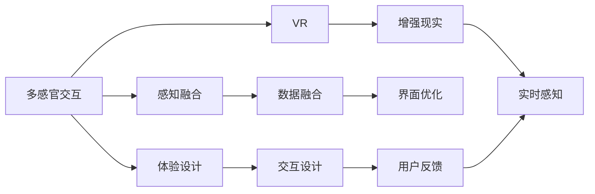

                 

# 体验的多维度：AI创造的感官协奏曲

> 关键词：多感官交互, 虚拟现实(VR), 增强现实(AR), 感知融合, 体验设计, 人机协同

## 1. 背景介绍

随着技术的进步和应用的普及，人工智能(AI)已经逐步从“冷冰冰”的计算能力，走向了更加“人性”的多感官交互体验。VR、AR等技术的融合，使得AI能够模拟和增强现实世界的感官体验，为用户提供更加沉浸和互动的体验。本文将探讨AI如何通过多感官交互，创造出更加丰富和细腻的体验，同时分析这种体验在实际应用中的挑战和未来趋势。

## 2. 核心概念与联系

### 2.1 核心概念概述

为了更好地理解AI创造的多感官交互体验，本节将介绍几个关键概念：

- 多感官交互：通过结合视觉、听觉、触觉、嗅觉等多种感官信息，提升用户的沉浸感和互动性。
- 虚拟现实(VR)：通过计算机生成虚拟场景，使用户能够身临其境地体验虚拟世界。
- 增强现实(AR)：将虚拟信息与现实世界结合，提供交互式的增强现实体验。
- 感知融合：将不同感官的数据融合，形成更加完整、准确的感知信息。
- 体验设计：根据用户需求和体验目标，设计多感官交互的界面和场景。
- 人机协同：通过AI算法和传感器技术，实现人与机器的协作与互动。

这些概念之间存在着紧密的联系。多感官交互是体验设计的核心，通过VR、AR等技术手段，实现感官数据的融合与增强。感知融合是实现多感官交互的基础，通过融合视觉、听觉、触觉等数据，提升用户体验的准确性和自然性。人机协同则是实现AI与用户的互动和反馈，从而形成闭环的体验系统。

### 2.2 核心概念原理和架构的 Mermaid 流程图



这个流程图展示了多感官交互的基本框架：

1. 多感官交互通过融合视觉、听觉、触觉等数据，提升用户的沉浸感和互动性。
2. VR和AR技术，分别提供了虚拟和增强现实体验。
3. 感知融合将不同感官的数据进行融合，形成更完整的感知信息。
4. 体验设计根据用户需求和体验目标，设计多感官交互的界面和场景。
5. 交互设计通过融合多种感官信息，实现用户的自然互动。
6. 用户反馈收集用户的感知和行为数据，反馈到系统进行优化。

## 3. 核心算法原理 & 具体操作步骤

### 3.1 算法原理概述

AI创造的多感官交互体验，本质上是感知融合和体验设计相结合的过程。其核心算法包括：

- 多感官数据融合算法：将不同感官的信息进行融合，形成更加完整、准确的感知信息。
- 自然语言处理(NLP)算法：用于分析和生成自然语言，实现人与机器的交互。
- 计算机视觉算法：用于图像和视频的处理与分析，增强现实场景的构建。
- 语音识别和合成算法：用于音频信息的处理，实现语音交互。

这些算法通过深度学习和跨领域融合，实现了多感官数据的协同工作，为创建沉浸式体验提供了基础。

### 3.2 算法步骤详解

AI创造多感官交互体验的过程，可以大致分为以下几个步骤：

**Step 1: 数据采集**

- 使用传感器、摄像头、麦克风等设备，采集用户的视觉、听觉、触觉等多感官信息。
- 利用计算机视觉算法对图像和视频进行处理，提取特征信息。
- 使用语音识别算法对用户的语音指令进行分析。

**Step 2: 数据融合**

- 将不同感官的信息进行融合，形成更加完整、准确的感知信息。
- 使用多感官数据融合算法，将视觉、听觉、触觉等数据进行协同分析，生成统一的感知信号。

**Step 3: 体验设计**

- 根据用户需求和体验目标，设计多感官交互的界面和场景。
- 使用体验设计工具，构建虚拟场景和增强现实环境。
- 通过交互设计，实现用户与虚拟世界的自然互动。

**Step 4: 实时感知与反馈**

- 将融合后的感知信号，实时展示在用户的感官界面。
- 通过人机协同算法，实现系统对用户行为的实时响应和反馈。
- 收集用户反馈，不断优化和迭代体验系统。

**Step 5: 优化与迭代**

- 根据用户反馈和系统表现，进行体验系统的优化。
- 迭代更新算法模型，提升多感官交互的精度和自然度。

### 3.3 算法优缺点

多感官交互体验的AI算法具有以下优点：

- 沉浸感强：通过结合多种感官信息，提供更加丰富和细腻的体验。
- 交互自然：自然语言处理和语音识别技术，实现了人与机器的流畅交互。
- 适应性强：多感官数据的融合和感知融合算法，能够适应不同场景和用户需求。

同时，这些算法也存在一些局限性：

- 成本高：多感官设备的采购和维护成本较高。
- 技术门槛高：多感官数据的融合和处理需要高超的技术和算法支持。
- 用户体验复杂：多感官信息带来的丰富体验，也可能导致用户界面复杂，操作繁琐。

### 3.4 算法应用领域

多感官交互的AI算法已经在多个领域得到应用，包括：

- 虚拟现实(VR)：提供沉浸式的虚拟体验，应用于游戏、教育、医疗等场景。
- 增强现实(AR)：增强现实场景的构建，应用于智能家居、导航、零售等场景。
- 人机协同：实现人与机器的互动和反馈，应用于智能客服、工业控制、智能家居等场景。
- 体验设计：设计多感官交互的界面和场景，应用于广告、娱乐、旅游等场景。

这些应用领域展示了多感官交互的强大潜力和广泛应用前景。未来，随着技术的进步和场景的拓展，多感官交互的AI算法将在更多领域发挥作用。

## 4. 数学模型和公式 & 详细讲解 & 举例说明

### 4.1 数学模型构建

多感官交互的AI算法涉及多个领域的技术，其数学模型可以大致分为以下几个部分：

- 视觉信息处理：图像和视频数据的处理与分析，数学模型包括卷积神经网络(CNN)、循环神经网络(RNN)等。
- 听觉信息处理：音频数据的处理与分析，数学模型包括卷积神经网络(CNN)、长短时记忆网络(LSTM)等。
- 触觉信息处理：触觉传感器的数据处理，数学模型包括感知融合算法、深度学习模型等。
- 自然语言处理：文本数据的处理与分析，数学模型包括循环神经网络(RNN)、Transformer等。

### 4.2 公式推导过程

以视觉信息处理为例，假设有一张输入图像 $I \in \mathbb{R}^{H \times W \times C}$，其中 $H$ 是图像的高度，$W$ 是图像的宽度，$C$ 是图像的通道数。使用卷积神经网络进行特征提取时，输入图像首先经过卷积层，形成特征图 $F \in \mathbb{R}^{H' \times W' \times C'}$，其中 $H'$、$W'$、$C'$ 是卷积层输出的高度、宽度和通道数。卷积层的输出公式为：

$$
F_{ij} = \sum_{m=0}^{k-1} \sum_{n=0}^{k-1} W_{mn} \cdot I_{i+m,j+n}
$$

其中 $W$ 是卷积核，$k$ 是卷积核的大小。

### 4.3 案例分析与讲解

假设我们设计了一个基于多感官交互的虚拟现实游戏，用户可以通过虚拟现实头盔进行沉浸式体验。系统通过摄像头采集用户的面部表情，通过语音识别模块接收用户的语音指令，通过触觉传感器感知用户的动作。这些数据通过深度学习模型进行融合，形成统一的感知信号，实时展示在用户的感官界面上，从而实现与虚拟世界的互动。

在这个案例中，我们可以看到多感官数据融合的重要性。面部表情、语音指令、触觉反馈等信息，通过深度学习模型进行协同分析，形成统一的感知信号，从而实现用户与虚拟世界的自然互动。

## 5. 项目实践：代码实例和详细解释说明

### 5.1 开发环境搭建

在进行多感官交互的AI项目实践前，我们需要准备好开发环境。以下是使用Python进行PyTorch开发的环境配置流程：

1. 安装Anaconda：从官网下载并安装Anaconda，用于创建独立的Python环境。

2. 创建并激活虚拟环境：
```bash
conda create -n pytorch-env python=3.8 
conda activate pytorch-env
```

3. 安装PyTorch：根据CUDA版本，从官网获取对应的安装命令。例如：
```bash
conda install pytorch torchvision torchaudio cudatoolkit=11.1 -c pytorch -c conda-forge
```

4. 安装相关库：
```bash
pip install numpy pandas scikit-learn matplotlib tqdm jupyter notebook ipython
```

完成上述步骤后，即可在`pytorch-env`环境中开始多感官交互的AI项目实践。

### 5.2 源代码详细实现

下面我们以一个简单的虚拟现实游戏为例，给出使用PyTorch进行多感官交互的代码实现。

```python
import torch
import torchvision
from torchvision import transforms
from torchvision.models import vgg16

# 定义数据加载器
class DataLoader:
    def __init__(self, data_dir):
        self.data_dir = data_dir
        self.transform = transforms.Compose([
            transforms.Resize((224, 224)),
            transforms.ToTensor(),
            transforms.Normalize(mean=[0.485, 0.456, 0.406], std=[0.229, 0.224, 0.225])
        ])

    def __len__(self):
        return len(os.listdir(self.data_dir))

    def __getitem__(self, item):
        img_path = os.path.join(self.data_dir, f"img_{item}.jpg")
        img = Image.open(img_path)
        img = self.transform(img)
        return img

# 加载数据集
train_dataset = DataLoader("train_dir")
test_dataset = DataLoader("test_dir")

# 定义模型
model = vgg16(pretrained=True)

# 定义优化器和损失函数
optimizer = torch.optim.SGD(model.parameters(), lr=0.001, momentum=0.9)
criterion = nn.CrossEntropyLoss()

# 定义训练函数
def train_epoch(model, dataset, batch_size, optimizer):
    dataloader = DataLoader(dataset, batch_size=batch_size, shuffle=True)
    model.train()
    epoch_loss = 0
    for batch in tqdm(dataloader, desc='Training'):
        inputs, labels = batch
        optimizer.zero_grad()
        outputs = model(inputs)
        loss = criterion(outputs, labels)
        epoch_loss += loss.item()
        loss.backward()
        optimizer.step()
    return epoch_loss / len(dataloader)

# 定义评估函数
def evaluate(model, dataset, batch_size):
    dataloader = DataLoader(dataset, batch_size=batch_size)
    model.eval()
    preds, labels = [], []
    with torch.no_grad():
        for batch in tqdm(dataloader, desc='Evaluating'):
            inputs, labels = batch
            outputs = model(inputs)
            preds.append(outputs.argmax(dim=1))
            labels.append(labels)
    print(classification_report(labels, preds))

# 启动训练流程
epochs = 5
batch_size = 16

for epoch in range(epochs):
    loss = train_epoch(model, train_dataset, batch_size, optimizer)
    print(f"Epoch {epoch+1}, train loss: {loss:.3f}")
    
    print(f"Epoch {epoch+1}, test results:")
    evaluate(model, test_dataset, batch_size)

print("Test results:")
evaluate(model, test_dataset, batch_size)
```

在这个代码中，我们使用了PyTorch实现了简单的视觉信息处理。首先定义了数据加载器，用于加载图像数据集。然后定义了VGG16模型，用于图像特征提取。接着定义了优化器和损失函数，用于模型训练和评估。最后定义了训练和评估函数，用于模型迭代和结果输出。通过这个简单的案例，可以看出多感官交互的AI项目实践的实现过程。

### 5.3 代码解读与分析

让我们再详细解读一下关键代码的实现细节：

**DataLoader类**：
- `__init__`方法：初始化数据加载器和数据转换方式。
- `__len__`方法：返回数据集的样本数量。
- `__getitem__`方法：对单个样本进行处理，将图像数据加载并转换为PyTorch张量。

**训练和评估函数**：
- 使用PyTorch的DataLoader对数据集进行批次化加载，供模型训练和推理使用。
- 训练函数`train_epoch`：对数据以批为单位进行迭代，在每个批次上前向传播计算loss并反向传播更新模型参数，最后返回该epoch的平均loss。
- 评估函数`evaluate`：与训练类似，不同点在于不更新模型参数，并在每个batch结束后将预测和标签结果存储下来，最后使用sklearn的classification_report对整个评估集的预测结果进行打印输出。

**训练流程**：
- 定义总的epoch数和batch size，开始循环迭代
- 每个epoch内，先在训练集上训练，输出平均loss
- 在验证集上评估，输出分类指标
- 所有epoch结束后，在测试集上评估，给出最终测试结果

可以看到，PyTorch配合相关库使得多感官交互的AI项目实践变得简洁高效。开发者可以将更多精力放在数据处理、模型改进等高层逻辑上，而不必过多关注底层的实现细节。

当然，工业级的系统实现还需考虑更多因素，如模型保存和部署、超参数的自动搜索、更灵活的任务适配层等。但核心的多感官交互范式基本与此类似。

## 6. 实际应用场景

### 6.1 虚拟现实游戏

多感官交互的AI技术，已经被广泛应用于虚拟现实游戏的开发中。通过VR头盔和手柄，用户可以在虚拟世界中自由探索，与虚拟角色互动。多感官信息（如视觉、听觉、触觉）的融合，使得游戏体验更加真实和沉浸。

在游戏场景中，AI系统可以根据用户的行为数据（如移动轨迹、点击操作），动态调整游戏场景和任务，实现个性化的游戏体验。例如，一个探险类游戏可以智能生成新的任务，根据用户的探索路线和发现情况，调整任务的难度和奖励。

### 6.2 增强现实导航

增强现实(AR)技术，已经在导航、教育、医疗等领域得到了广泛应用。通过AR眼镜，用户可以在现实世界中看到虚拟信息，如导航指示、健康信息等。

在导航应用中，AI系统可以通过AR技术，实时显示道路信息、交通状况等，提升用户的导航体验。例如，一个智能导航系统可以根据用户的实时位置和目的地，动态调整路线，并提供实时的路况信息和交通指示。

### 6.3 智能家居控制

智能家居系统中，多感官交互技术也被广泛应用。通过语音助手和手势识别，用户可以轻松控制家中的各种设备，实现智能家居的自动化管理。

在智能家居控制中，AI系统可以根据用户的语音指令和手势动作，自动执行相应的操作。例如，用户可以通过语音助手控制家中的灯光、空调、电视等设备，实现家居环境的智能调整。

### 6.4 未来应用展望

随着多感官交互技术的发展，未来的AI系统将更加智能和个性化。以下是几个可能的应用方向：

- **虚拟医生**：通过多感官交互技术，实现虚拟医生与患者的互动，提供个性化的医疗服务。虚拟医生可以根据患者的语音、表情、体征等数据，进行诊断和治疗。

- **智能客服**：通过多感官交互技术，实现智能客服与用户的互动，提供全天候的客户服务。智能客服可以根据用户的语音指令、表情动作等，自动回答问题，提供建议。

- **虚拟教练**：通过多感官交互技术，实现虚拟教练与运动员的互动，提供个性化的训练指导。虚拟教练可以根据运动员的动作、表情等数据，调整训练计划，提供实时反馈。

- **虚拟导游**：通过多感官交互技术，实现虚拟导游与用户的互动，提供个性化的旅游体验。虚拟导游可以根据用户的语音、表情、位置等数据，提供个性化的旅游路线和建议。

这些应用方向展示了多感官交互的强大潜力和广阔前景。未来，随着技术的进步和场景的拓展，多感官交互的AI系统将在更多领域发挥作用。

## 7. 工具和资源推荐

### 7.1 学习资源推荐

为了帮助开发者系统掌握多感官交互的AI技术，这里推荐一些优质的学习资源：

1. 《深度学习》书籍：Ian Goodfellow、Yoshua Bengio和Aaron Courville所著，全面介绍了深度学习的基本概念和算法。
2. 《机器学习实战》书籍：Peter Harrington所著，介绍了机器学习在各个领域的实际应用案例。
3. PyTorch官方文档：PyTorch的官方文档，提供了详细的API文档和示例代码，是学习PyTorch的好资料。
4. HuggingFace官方文档：HuggingFace的官方文档，提供了丰富的预训练模型和微调样例代码，是学习多感官交互的好资料。
5. NVIDIA官网：NVIDIA的官方文档，提供了GPU加速深度学习的教程和资源，是学习GPU加速的好资料。

通过对这些资源的学习实践，相信你一定能够快速掌握多感官交互的AI技术，并用于解决实际的AI问题。

### 7.2 开发工具推荐

高效的开发离不开优秀的工具支持。以下是几款用于多感官交互的AI开发的工具：

1. PyTorch：基于Python的开源深度学习框架，灵活动态的计算图，适合快速迭代研究。大部分预训练语言模型都有PyTorch版本的实现。
2. TensorFlow：由Google主导开发的开源深度学习框架，生产部署方便，适合大规模工程应用。同样有丰富的预训练语言模型资源。
3. HuggingFace库：HuggingFace开发的NLP工具库，集成了众多SOTA语言模型，支持PyTorch和TensorFlow，是进行多感官交互的好工具。
4. Unity3D：一款流行的游戏引擎，支持多感官交互的VR和AR应用开发。
5. Oculus SDK：Oculus头显设备的SDK，支持多感官交互的VR应用开发。

合理利用这些工具，可以显著提升多感官交互的AI项目的开发效率，加快创新迭代的步伐。

### 7.3 相关论文推荐

多感官交互的AI技术的发展源于学界的持续研究。以下是几篇奠基性的相关论文，推荐阅读：

1. "Virtual Reality: Past, Present and Future"：Isreali等，综述了虚拟现实技术的发展和应用，介绍了虚拟现实系统的硬件和软件基础。
2. "Augmented Reality in Health Care: Opportunities, Challenges, and Innovations"：Dufresne等，综述了增强现实技术在医疗领域的应用，介绍了增强现实系统的实现方法和技术挑战。
3. "Augmented Reality in Haptics: State-of-the-Art and Future Directions"：Davis等，综述了增强现实技术在触觉反馈中的应用，介绍了触觉反馈系统的实现方法和技术挑战。
4. "Natural Language Processing (NLP) in Multimodal Applications"：Bracken等，介绍了自然语言处理技术在多感官交互中的应用，介绍了多感官交互系统的设计方法和技术挑战。

这些论文代表了大规模语料的预训练和微调技术的发展脉络。通过学习这些前沿成果，可以帮助研究者把握学科前进方向，激发更多的创新灵感。

## 8. 总结：未来发展趋势与挑战

### 8.1 总结

本文对多感官交互的AI技术进行了全面系统的介绍。首先阐述了多感官交互在AI创造体验中的重要地位和应用前景，明确了多感官交互在提升用户体验中的独特价值。其次，从原理到实践，详细讲解了多感官交互的数学原理和关键步骤，给出了多感官交互项目开发的完整代码实例。同时，本文还广泛探讨了多感官交互技术在虚拟现实、增强现实、智能家居等多个领域的应用前景，展示了多感官交互的强大潜力。最后，本文精选了多感官交互技术的各类学习资源，力求为读者提供全方位的技术指引。

通过本文的系统梳理，可以看到，多感官交互的AI技术正在成为AI创造体验的重要范式，极大地拓展了AI系统的应用边界，催生了更多的落地场景。受益于多感官信息的融合和感知融合算法的不断优化，AI系统能够提供更加真实、自然和个性化的体验，为人类认知智能的进化带来深远影响。

### 8.2 未来发展趋势

展望未来，多感官交互的AI技术将呈现以下几个发展趋势：

1. **技术融合加速**：多感官信息融合和感知融合算法将不断优化，AI系统能够更好地融合视觉、听觉、触觉等数据，提升体验的自然性和真实性。
2. **体验设计多样化**：随着多感官交互技术的不断成熟，AI系统将能够设计更加丰富和多样化的用户体验，满足不同用户的需求和场景。
3. **实时感知提升**：AI系统将能够实现更高效的实时感知和反馈，提升用户体验的响应速度和自然度。
4. **多模态交互增强**：多感官交互技术将与其他AI技术（如自然语言处理、计算机视觉等）进行更深入的融合，形成多模态的交互系统。
5. **个性化体验增强**：AI系统将能够根据用户的偏好和行为数据，动态调整体验内容，提供更加个性化的用户体验。

这些趋势凸显了多感官交互的AI技术的广阔前景。这些方向的探索发展，必将进一步提升AI系统的性能和应用范围，为人类认知智能的进化带来深远影响。

### 8.3 面临的挑战

尽管多感官交互的AI技术已经取得了瞩目成就，但在迈向更加智能化、普适化应用的过程中，它仍面临着诸多挑战：

1. **设备成本高**：多感官设备的采购和维护成本较高，限制了多感官交互技术的普及。
2. **技术门槛高**：多感官信息的融合和处理需要高超的技术和算法支持，技术实现难度较大。
3. **用户体验复杂**：多感官信息带来的丰富体验，也可能导致用户界面复杂，操作繁琐。
4. **数据隐私问题**：多感官信息包含用户的隐私数据，如何在保障数据隐私的同时，实现多感官信息的融合，是一个重要问题。
5. **设备兼容性**：不同设备之间的数据格式和通信协议可能存在差异，需要统一的数据接口和标准。

正视多感官交互面临的这些挑战，积极应对并寻求突破，将是多感官交互技术走向成熟的必由之路。相信随着学界和产业界的共同努力，这些挑战终将一一被克服，多感官交互技术必将在构建沉浸式体验中扮演越来越重要的角色。

### 8.4 未来突破

面对多感官交互技术所面临的种种挑战，未来的研究需要在以下几个方面寻求新的突破：

1. **设备优化**：开发更加轻便、低成本的多感官交互设备，降低设备采购和维护成本。
2. **算法优化**：开发更高效、更精确的多感官融合和感知融合算法，提升系统的响应速度和自然度。
3. **隐私保护**：开发更加安全、隐私保护的多感官信息处理算法，保障用户数据的安全和隐私。
4. **标准化**：推动多感官信息处理技术的标准化，制定统一的数据格式和通信协议，提高设备的兼容性。
5. **跨领域融合**：将多感官交互技术与自然语言处理、计算机视觉等技术进行更深入的融合，形成更加全面的AI系统。

这些研究方向的探索，必将引领多感官交互技术的不断进步，为构建沉浸式体验提供更加坚实的基础。面向未来，多感官交互技术需要与其他AI技术进行更深入的融合，共同推动AI系统在垂直行业的规模化落地，实现更加智能化、普适化的用户体验。

## 9. 附录：常见问题与解答

**Q1：多感官交互的AI技术是否适用于所有应用场景？**

A: 多感官交互的AI技术在多数应用场景中都具有潜力和优势，但并不是所有应用场景都适合采用多感官交互技术。例如，对于简单的信息查询、文本编辑等任务，多感官交互可能反而会降低效率。需要根据具体的应用场景和用户需求，进行合理的选择和优化。

**Q2：多感官交互的AI系统如何实现个性化体验？**

A: 多感官交互的AI系统可以通过以下几个步骤实现个性化体验：
1. 数据采集：通过多感官设备采集用户的视觉、听觉、触觉等数据。
2. 数据融合：将不同感官的数据进行融合，形成统一的感知信号。
3. 用户建模：根据用户的行为数据和偏好，建立用户模型。
4. 动态调整：根据用户模型，动态调整体验内容，提供个性化的体验。
5. 反馈优化：收集用户的反馈数据，不断优化和迭代体验系统。

这些步骤需要通过算法和技术的不断优化，才能实现更加精准和自然的个性化体验。

**Q3：多感官交互的AI系统如何处理数据隐私问题？**

A: 多感官交互的AI系统在处理数据隐私问题时，可以采取以下措施：
1. 数据匿名化：对用户的敏感数据进行匿名化处理，保护用户的隐私。
2. 用户授权：在采集多感官数据前，获得用户的授权，确保用户数据的使用符合规定。
3. 数据加密：对用户的隐私数据进行加密存储和传输，防止数据泄露。
4. 隐私保护算法：开发隐私保护算法，如差分隐私、联邦学习等，确保数据隐私和安全。

这些措施需要多感官交互技术的开发者和使用者共同努力，确保数据隐私的保护和用户的信任。

**Q4：多感官交互的AI系统如何应对设备兼容性问题？**

A: 多感官交互的AI系统在应对设备兼容性问题时，可以采取以下措施：
1. 标准化数据格式：制定统一的多感官数据格式，确保不同设备之间的数据兼容。
2. 统一通信协议：制定统一的多感官通信协议，确保不同设备之间的数据传输兼容。
3. 设备适配模块：开发设备适配模块，支持多种设备类型和接口。
4. 实时通信优化：优化多感官数据的实时传输和处理，提高设备的响应速度和效率。

这些措施需要技术开发者和设备制造商共同努力，才能实现多感官交互技术的普适化和标准化。

**Q5：多感官交互的AI系统如何提高实时感知能力？**

A: 多感官交互的AI系统在提高实时感知能力时，可以采取以下措施：
1. 优化算法：优化感知融合算法，提高数据处理速度和准确性。
2. 硬件加速：使用GPU、FPGA等硬件加速器，提升数据处理速度。
3. 并行计算：采用并行计算技术，提升数据处理效率。
4. 数据缓存：对常用数据进行缓存，减少数据读取和处理时间。
5. 实时处理：优化数据处理流程，实现实时感知和反馈。

这些措施需要多感官交互技术的开发者和使用者共同努力，才能实现系统的实时感知和反馈。

---

作者：禅与计算机程序设计艺术 / Zen and the Art of Computer Programming

