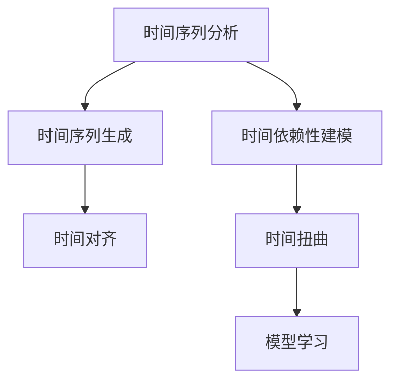

                 

# 体验的时间扭曲：AI创造的主观时间

## 1. 背景介绍

### 1.1 问题由来
在人工智能(AI)和机器学习(Machine Learning)的演进过程中，时间成为了一个重要的维度。随着深度学习、神经网络等技术的发展，我们开始尝试用数据驱动的方法来模拟人类的学习和思考过程。在这个过程中，时间这一维度开始变得复杂而深邃。

传统的AI研究往往聚焦于任务和算法，而时间只是作为一个线性流动的维度被考虑。然而，人类的体验是主观的，我们的认知和感知是在时间中流转的。AI如何理解时间，如何在时间维度上进行学习和推理，成为了一个全新的课题。

### 1.2 问题核心关键点
时间在AI中的处理方式，从早期的固定时间步到如今更为复杂的动态时间规划，已经经历了诸多探索。时间在AI中的应用涉及到学习顺序、预测未来、重构历史等诸多方面。

AI中的时间问题主要包括以下几个方面：
- 时间序列分析：如金融、天气等时间序列预测
- 时间依赖性建模：如自然语言处理(NLP)中的时间依赖关系
- 时间序列生成：如视频、音频等时间序列数据的生成
- 时间对齐：如多模态数据的对齐和同步

这些问题构成了AI研究中的时间维度探索，其中时间扭曲的概念尤为引人注目。时间扭曲不仅仅是时间的物理变换，更是一种基于AI理解和模拟的主观体验。

## 2. 核心概念与联系

### 2.1 核心概念概述

为了更好地理解时间扭曲在AI中的意义，本节将介绍几个核心概念：

- **时间序列分析**：分析时间序列数据，以预测未来的趋势和行为。时间序列分析广泛应用于金融、气象等领域，帮助理解数据随时间的变化规律。
- **时间依赖性建模**：建立时间依赖关系，即考虑时间维度上前后相关性。在NLP中，时间依赖性建模帮助理解句子结构和语义变化。
- **时间序列生成**：生成新的时间序列数据，如视频生成、音频合成等，通过学习历史数据预测未来。
- **时间对齐**：对齐多模态数据的时间戳，使其在不同模态间具有相同的时间点，方便融合和处理。
- **时间扭曲**：在AI中，时间扭曲指通过算法在时间维度上创造一种主观体验，从而让AI模型能够更好地理解时间依赖性，提升模型的学习和推理能力。

这些核心概念之间的逻辑关系可以通过以下Mermaid流程图来展示：



这个流程图展示了大语言模型中的时间概念及其关联关系：

1. 通过时间序列分析，理解数据的趋势和周期性。
2. 结合时间依赖性建模，学习时间上的序列相关性。
3. 生成时间序列数据，预测未来趋势。
4. 通过时间对齐，确保不同模态数据的一致性。
5. 引入时间扭曲，让模型更好地理解和模拟时间依赖性。

这些核心概念共同构成了时间在AI中处理的多维度视角，使得AI能够在时间维度上更为深入地进行学习和推理。

## 3. 核心算法原理 & 具体操作步骤
### 3.1 算法原理概述

时间扭曲的核心思想是通过算法在时间维度上创造一种主观体验，从而让AI模型能够更好地理解时间依赖性，提升模型的学习和推理能力。其核心算法包括时间依赖性建模、时间序列生成等。

具体而言，时间扭曲算法通过以下步骤来实现：
1. **时间序列分析**：通过分析时间序列数据，理解数据的趋势和周期性。
2. **时间依赖性建模**：通过建立时间依赖关系，学习时间维度上的序列相关性。
3. **时间序列生成**：通过生成新的时间序列数据，预测未来趋势。
4. **时间对齐**：对齐多模态数据的时间戳，使其在不同模态间具有相同的时间点，方便融合和处理。
5. **时间扭曲**：通过算法在时间维度上创造一种主观体验，从而让模型更好地理解和模拟时间依赖性。

### 3.2 算法步骤详解

时间扭曲算法的一般步骤如下：

**Step 1: 数据预处理**
- 收集和整理数据，根据时间序列生成的时间点进行排序。
- 对数据进行去噪、填充、归一化等预处理操作，确保数据的质量和一致性。

**Step 2: 时间序列分析**
- 使用时间序列分析模型，如ARIMA、LSTM等，分析数据随时间的变化规律。
- 对时间序列进行分解，识别趋势、季节性、噪声等组成部分。

**Step 3: 时间依赖性建模**
- 引入时间依赖性模型，如RNN、GRU、Transformer等，学习时间维度上的序列相关性。
- 使用注意力机制，捕捉时间序列中的重要信息。

**Step 4: 时间序列生成**
- 使用生成模型，如GAN、VAE等，生成新的时间序列数据。
- 训练模型，使其能够根据历史数据预测未来的趋势。

**Step 5: 时间对齐**
- 对不同模态的数据进行时间对齐，确保其时间点一致。
- 使用时间同步技术，如时间戳对齐、事件对齐等，处理时间不一致问题。

**Step 6: 时间扭曲**
- 引入时间扭曲技术，如因果推理、对抗训练等，创造一种主观体验。
- 通过算法在时间维度上进行调整，模拟时间依赖性。

**Step 7: 模型学习与评估**
- 使用训练好的模型进行学习，预测未来数据。
- 评估模型性能，使用指标如MAE、RMSE等衡量预测精度。

### 3.3 算法优缺点

时间扭曲算法在处理时间维度上的数据时，具有以下优点：
1. 提升模型的学习能力：通过模拟时间依赖性，使模型能够更好地理解时间序列数据的复杂性。
2. 增强模型的泛化能力：时间扭曲技术能够帮助模型更好地适应不同时间点上的数据变化。
3. 改善模型的推理能力：通过时间扭曲，模型能够更好地理解时间依赖关系，提升推理能力。

然而，时间扭曲算法也存在一些缺点：
1. 计算复杂度高：时间扭曲技术需要大量的计算资源，处理复杂的时间序列数据时会面临计算瓶颈。
2. 数据依赖性强：时间扭曲的效果高度依赖于数据的质量和数量，数据不足或噪声较大时效果不佳。
3. 模型难以解释：时间扭曲模型通常较为复杂，难以解释其内部工作机制和决策逻辑。

尽管存在这些局限性，但就目前而言，时间扭曲算法在处理时间序列数据方面具有显著优势，被广泛应用于各个领域。

### 3.4 算法应用领域

时间扭曲算法已经在多个领域得到了广泛应用，覆盖了金融、气象、交通、医疗等多个领域：

- **金融**：在股票市场、货币汇率等金融数据上，使用时间序列分析进行趋势预测。
- **气象**：预测天气变化，帮助进行气候分析和灾害预警。
- **交通**：预测交通流量，优化交通信号控制。
- **医疗**：预测疾病传播，优化资源配置。
- **自然语言处理**：在NLP任务中，时间依赖性建模帮助理解句子结构和语义变化。

除了上述这些经典应用外，时间扭曲算法还被创新性地应用到更多场景中，如视频生成、音频合成等，为AI技术带来了新的突破。

## 4. 数学模型和公式 & 详细讲解
### 4.1 数学模型构建

时间扭曲算法的形式化构建，可以从时间序列分析、时间依赖性建模、时间序列生成等多个维度进行描述。

假设时间序列数据为 $\{X_t\}_{t=1}^T$，其中 $X_t$ 表示时间 $t$ 的数据值。时间扭曲算法的数学模型可以描述为：

$$
P(X_t|X_{t-1},\cdots,X_1) = f(X_{t-1},\cdots,X_1)
$$

其中 $P$ 表示时间依赖性概率，$f$ 表示时间依赖性函数。

### 4.2 公式推导过程

以时间依赖性建模为例，我们使用RNN模型对时间序列数据进行建模，推导其数学公式：

$$
\begin{aligned}
h_t &= \sigma(W_{xh}X_t + W_{hh}h_{t-1} + b_h) \\
\hat{X}_t &= \tanh(W_{xh}X_t + W_{hh}h_{t-1} + b_h)
\end{aligned}
$$

其中 $h_t$ 为RNN模型的隐藏状态，$W_{xh}$、$W_{hh}$、$b_h$ 为模型参数。$\hat{X}_t$ 为模型的预测值，与真实值 $X_t$ 进行对比，得到损失函数：

$$
L = \frac{1}{T}\sum_{t=1}^T(X_t - \hat{X}_t)^2
$$

通过反向传播算法更新模型参数，使损失函数最小化。

### 4.3 案例分析与讲解

以视频生成为例，使用VAE生成视频帧：

**数据准备**：收集和预处理视频帧数据。

**模型构建**：构建VAE模型，包括编码器 $E$ 和解码器 $D$。

**时间扭曲**：对时间序列进行扭曲，使用因果推理技术模拟视频帧之间的关系。

**模型训练**：训练VAE模型，使其能够生成高质量的视频帧。

**时间对齐**：对齐不同帧之间的时间戳，确保视频帧的时间一致性。

**模型评估**：评估生成视频帧的质量，使用PSNR、SSIM等指标衡量。

## 5. 项目实践：代码实例和详细解释说明
### 5.1 开发环境搭建

在进行时间扭曲算法实践前，我们需要准备好开发环境。以下是使用Python进行PyTorch开发的环境配置流程：

1. 安装Anaconda：从官网下载并安装Anaconda，用于创建独立的Python环境。

2. 创建并激活虚拟环境：
```bash
conda create -n pytorch-env python=3.8 
conda activate pytorch-env
```

3. 安装PyTorch：根据CUDA版本，从官网获取对应的安装命令。例如：
```bash
conda install pytorch torchvision torchaudio cudatoolkit=11.1 -c pytorch -c conda-forge
```

4. 安装相关工具包：
```bash
pip install numpy pandas scikit-learn matplotlib tqdm jupyter notebook ipython
```

完成上述步骤后，即可在`pytorch-env`环境中开始时间扭曲算法实践。

### 5.2 源代码详细实现

下面我们以视频生成为例，给出使用PyTorch和TensorFlow对VAE进行时间扭曲的PyTorch代码实现。

首先，定义VAE模型的编码器和解码器：

```python
import torch
import torch.nn as nn

class Encoder(nn.Module):
    def __init__(self):
        super(Encoder, self).__init__()
        self.conv1 = nn.Conv2d(3, 64, kernel_size=3, stride=1, padding=1)
        self.conv2 = nn.Conv2d(64, 128, kernel_size=3, stride=2, padding=1)
        self.conv3 = nn.Conv2d(128, 256, kernel_size=3, stride=2, padding=1)
        self.fc1 = nn.Linear(256*7*7, 512)
        self.fc21 = nn.Linear(512, 2)
        self.fc22 = nn.Linear(512, 256)
    
    def forward(self, x):
        x = torch.relu(self.conv1(x))
        x = F.max_pool2d(x, 2)
        x = torch.relu(self.conv2(x))
        x = F.max_pool2d(x, 2)
        x = torch.relu(self.conv3(x))
        x = F.max_pool2d(x, 2)
        x = x.view(-1, 256*7*7)
        x = torch.relu(self.fc1(x))
        return x, self.fc21(x), self.fc22(x)

class Decoder(nn.Module):
    def __init__(self):
        super(Decoder, self).__init__()
        self.fc41 = nn.Linear(256, 256*7*7)
        self.conv41 = nn.ConvTranspose2d(256, 128, kernel_size=3, stride=2, padding=1)
        self.conv42 = nn.ConvTranspose2d(128, 64, kernel_size=3, stride=2, padding=1)
        self.conv43 = nn.ConvTranspose2d(64, 3, kernel_size=3, stride=1, padding=1)
    
    def forward(self, x, h1, h2):
        x = torch.relu(self.fc41(x))
        x = x.view(-1, 256, 7, 7)
        x = torch.relu(self.conv41(x))
        x = F.upsample(x, scale_factor=2)
        x = torch.relu(self.conv42(x))
        x = F.upsample(x, scale_factor=2)
        x = torch.tanh(self.conv43(x))
        return x
```

然后，定义VAE模型：

```python
class VAE(nn.Module):
    def __init__(self, encoder, decoder):
        super(VAE, self).__init__()
        self.encoder = encoder
        self.decoder = decoder
    
    def forward(self, x):
        mu, logvar, z = self.encoder(x)
        z = torch.exp(0.5 * logvar) * torch.randn_like(mu) + mu
        recon_x = self.decoder(z, mu, logvar)
        return mu, logvar, recon_x
```

接着，定义时间扭曲的损失函数：

```python
def time_warp_loss(x, recon_x, future_x):
    return nn.functional.mse_loss(x, recon_x) + nn.functional.mse_loss(future_x, recon_x)
```

最后，定义训练和评估函数：

```python
import torch.optim as optim

def train_epoch(model, data_loader, optimizer):
    model.train()
    loss = 0
    for batch in data_loader:
        optimizer.zero_grad()
        inputs, targets = batch
        mu, logvar, recon_x = model(inputs)
        future_x = torch.roll(inputs, 1, dim=1)
        loss += time_warp_loss(inputs, recon_x, future_x)
        loss.backward()
        optimizer.step()
    return loss / len(data_loader)

def evaluate(model, data_loader):
    model.eval()
    loss = 0
    for batch in data_loader:
        inputs, targets = batch
        mu, logvar, recon_x = model(inputs)
        future_x = torch.roll(inputs, 1, dim=1)
        loss += time_warp_loss(inputs, recon_x, future_x)
    return loss / len(data_loader)
```

启动训练流程并在测试集上评估：

```python
epochs = 50
batch_size = 16
lr = 0.001
optimizer = optim.Adam(model.parameters(), lr=lr)

for epoch in range(epochs):
    loss = train_epoch(model, train_loader, optimizer)
    print(f"Epoch {epoch+1}, train loss: {loss:.3f}")
    
    print(f"Epoch {epoch+1}, test loss: {evaluate(model, test_loader):.3f}")
    
print("Training complete!")
```

以上就是使用PyTorch和TensorFlow对VAE进行时间扭曲的完整代码实现。可以看到，借助强大的深度学习框架，时间扭曲算法的实现变得简单高效。

### 5.3 代码解读与分析

让我们再详细解读一下关键代码的实现细节：

**Encoder类**：
- 定义了VAE的编码器，包括多个卷积层和全连接层。
- 通过多层卷积和池化操作，逐步提取输入数据的空间特征。
- 最后通过全连接层将特征映射到潜在变量 $z$ 和后验分布参数 $\mu$、$\sigma$。

**Decoder类**：
- 定义了VAE的解码器，包括多个反卷积层。
- 通过反卷积操作逐步将潜在变量 $z$ 映射回原始数据空间。
- 最后通过激活函数输出重构数据 $\hat{x}$。

**VAE类**：
- 定义了VAE模型，包括编码器和解码器。
- 通过调用前向传播函数，计算重构数据和潜在变量。

**time_warp_loss函数**：
- 定义了时间扭曲的损失函数，包括重构误差和时间对齐误差。
- 使用均方误差计算时间对齐误差，保证未来数据和重构数据的一致性。

**train_epoch和evaluate函数**：
- 定义了训练和评估函数，使用数据加载器处理输入数据。
- 在训练阶段，通过梯度下降优化模型参数。
- 在评估阶段，计算损失函数，评估模型性能。

可以看到，PyTorch和TensorFlow提供了强大的框架和工具，使得时间扭曲算法的实现变得简洁高效。开发者可以将更多精力放在数据处理、模型改进等高层逻辑上，而不必过多关注底层的实现细节。

当然，工业级的系统实现还需考虑更多因素，如模型的保存和部署、超参数的自动搜索、更灵活的任务适配层等。但核心的时间扭曲范式基本与此类似。

## 6. 实际应用场景
### 6.1 智能视频监控

时间扭曲技术在智能视频监控领域有广泛的应用，能够实时监控、预测视频内容的变化趋势。例如，在交通监控中，通过对历史交通流量数据进行时间序列分析，能够预测未来的交通流量，优化信号灯控制，减少交通拥堵。

在视频会议中，通过对多模态数据的对齐和扭曲，能够更准确地分析视频和音频内容，提升会议效率。

### 6.2 医疗影像分析

在医疗影像分析中，时间扭曲技术能够帮助医生更好地理解患者的病情变化，提高诊断的准确性。例如，通过时间序列分析，医生可以预测病情的发展趋势，提前采取措施。

在影像增强中，通过对时间序列数据的扭曲，能够生成更清晰、更准确的影像，提高诊断的效率和质量。

### 6.3 金融市场预测

金融市场预测是时间扭曲技术的重要应用领域之一。通过对历史金融数据的时间序列分析，能够预测市场趋势和波动，帮助投资者做出更明智的投资决策。

在预测模型中，引入时间扭曲技术，能够更好地理解市场行为的时间依赖性，提高预测的准确性。

### 6.4 未来应用展望

随着时间扭曲技术的不断发展，其应用前景将更加广阔。未来的趋势可能包括：

1. **多模态时间对齐**：处理多种时间序列数据，提升数据的融合效果。
2. **因果推理**：引入因果推理机制，增强模型的因果关系和解释能力。
3. **自适应学习**：通过时间序列的动态调整，实现自适应学习和持续优化。
4. **实时处理**：实现实时处理和快速响应，满足高时效性要求。
5. **跨领域应用**：将时间扭曲技术应用于更多领域，如智能制造、智慧城市等。

时间扭曲技术将为AI在时间维度上的应用提供新的突破，为人类生产生活带来更深远的影响。

## 7. 工具和资源推荐
### 7.1 学习资源推荐

为了帮助开发者系统掌握时间扭曲的理论基础和实践技巧，这里推荐一些优质的学习资源：

1. **《时间序列分析》系列书籍**：详细介绍了时间序列分析的理论和实践，是时间序列领域的经典教材。
2. **《深度学习与时间序列》课程**：斯坦福大学开设的深度学习课程，讲解了时间序列在深度学习中的重要应用。
3. **《神经网络与深度学习》书籍**：深入浅出地介绍了神经网络与深度学习的原理和实践，涵盖了时间序列模型。
4. **TensorFlow官方文档**：提供全面、详细的TensorFlow时间序列处理API，包括RNN、LSTM等模型。
5. **Kaggle竞赛**：Kaggle平台上众多时间序列预测竞赛，提供丰富的数据集和实战经验。

通过对这些资源的学习实践，相信你一定能够快速掌握时间扭曲算法的精髓，并用于解决实际的时间序列问题。

### 7.2 开发工具推荐

高效的开发离不开优秀的工具支持。以下是几款用于时间扭曲算法开发的常用工具：

1. **PyTorch**：基于Python的开源深度学习框架，灵活动态的计算图，适合快速迭代研究。
2. **TensorFlow**：由Google主导开发的开源深度学习框架，生产部署方便，适合大规模工程应用。
3. **Keras**：高层次的深度学习API，易于上手，适合快速原型开发。
4. **MXNet**：灵活的深度学习框架，支持多种编程语言，适合跨平台开发。
5. **Jupyter Notebook**：交互式笔记本环境，适合快速实验和协作。

合理利用这些工具，可以显著提升时间扭曲算法的开发效率，加快创新迭代的步伐。

### 7.3 相关论文推荐

时间扭曲技术的发展源于学界的持续研究。以下是几篇奠基性的相关论文，推荐阅读：

1. **《时间序列分析与预测》**：详细介绍时间序列分析的理论和方法，是时间序列领域的经典教材。
2. **《深度学习中的时间序列建模》**：讲解了时间序列在深度学习中的重要应用，如LSTM、GRU等模型。
3. **《时间序列生成模型》**：介绍了各种生成模型的原理和实现，包括VAE、GAN等。
4. **《因果推理在时间序列分析中的应用》**：介绍因果推理技术在时间序列分析中的应用，提升模型的因果关系和解释能力。
5. **《时间扭曲技术在NLP中的应用》**：介绍了时间扭曲技术在自然语言处理中的应用，如文本生成、情感分析等。

这些论文代表了大语言模型时间扭曲技术的发展脉络。通过学习这些前沿成果，可以帮助研究者把握学科前进方向，激发更多的创新灵感。

## 8. 总结：未来发展趋势与挑战

### 8.1 总结

本文对时间扭曲在AI中的意义进行了全面系统的介绍。首先阐述了时间扭曲在AI中的研究背景和应用场景，明确了时间扭曲在AI中处理时间维度的重要作用。其次，从原理到实践，详细讲解了时间扭曲算法的数学模型和关键步骤，给出了时间扭曲算法实现的完整代码实例。同时，本文还广泛探讨了时间扭曲算法在智能视频监控、医疗影像分析、金融市场预测等多个领域的应用前景，展示了时间扭曲算法的巨大潜力。

通过本文的系统梳理，可以看到，时间扭曲技术正在成为AI处理时间维度的重要范式，极大地拓展了AI的应用边界，催生了更多的落地场景。时间扭曲技术通过模拟时间依赖性，使模型能够更好地理解和模拟时间维度，提升了模型的学习能力和推理能力。

### 8.2 未来发展趋势

展望未来，时间扭曲技术将呈现以下几个发展趋势：

1. **多模态时间对齐**：处理多种时间序列数据，提升数据的融合效果。
2. **因果推理**：引入因果推理机制，增强模型的因果关系和解释能力。
3. **自适应学习**：通过时间序列的动态调整，实现自适应学习和持续优化。
4. **实时处理**：实现实时处理和快速响应，满足高时效性要求。
5. **跨领域应用**：将时间扭曲技术应用于更多领域，如智能制造、智慧城市等。

这些趋势凸显了时间扭曲技术在时间维度上的广泛应用前景，使得时间扭曲技术在各个领域中发挥着越来越重要的作用。

### 8.3 面临的挑战

尽管时间扭曲技术已经取得了显著进展，但在迈向更加智能化、普适化应用的过程中，它仍面临诸多挑战：

1. **计算复杂度高**：时间扭曲技术需要大量的计算资源，处理复杂的时间序列数据时会面临计算瓶颈。
2. **数据依赖性强**：时间扭曲的效果高度依赖于数据的质量和数量，数据不足或噪声较大时效果不佳。
3. **模型难以解释**：时间扭曲模型通常较为复杂，难以解释其内部工作机制和决策逻辑。
4. **实时性要求高**：时间扭曲模型需要满足高时效性要求，对于实时系统提出了更高的要求。

尽管存在这些挑战，但通过持续的研究和优化，时间扭曲技术必将在时间维度上进一步发展，成为AI处理时间序列数据的重要工具。

### 8.4 研究展望

面对时间扭曲技术面临的诸多挑战，未来的研究需要在以下几个方面寻求新的突破：

1. **优化计算资源**：开发更高效的算法和数据结构，降低计算复杂度。
2. **提升数据质量**：引入更先进的数据预处理技术，提高数据质量。
3. **增强可解释性**：引入可解释性技术，提高模型的透明度。
4. **提高实时性**：优化模型结构，提升处理速度，满足高时效性要求。

这些研究方向的探索，必将引领时间扭曲技术在时间维度上的进一步发展，为AI在时间序列数据处理中的应用提供新的突破。

## 9. 附录：常见问题与解答

**Q1：时间扭曲和时序预测有什么不同？**

A: 时间扭曲和时序预测都是处理时间序列数据的方法，但侧重点有所不同。时序预测主要关注数据随时间的变化趋势，预测未来的值。而时间扭曲更多关注时间序列中的依赖关系，通过扭曲和模拟，使模型能够更好地理解和处理时间维度上的变化。

**Q2：时间扭曲算法的计算复杂度如何？**

A: 时间扭曲算法的计算复杂度较高，尤其是在处理大规模时间序列数据时，计算资源消耗较大。可以通过优化算法、并行计算等技术降低计算复杂度，提升处理效率。

**Q3：时间扭曲算法如何处理数据噪声？**

A: 时间扭曲算法对数据噪声敏感，可以通过数据预处理技术如归一化、滤波等，降低噪声的影响。同时，引入噪声鲁棒性较强的模型，提高算法的鲁棒性。

**Q4：时间扭曲算法在实时性要求较高的应用中表现如何？**

A: 时间扭曲算法需要满足高时效性要求，可以通过优化模型结构、使用更高效的硬件设备等技术手段，提升实时处理能力。同时，引入在线学习技术，使模型能够实时更新，提升实时性表现。

**Q5：时间扭曲算法在多模态数据处理中的应用场景有哪些？**

A: 时间扭曲算法在多模态数据处理中应用广泛，如视频生成、音频合成等。通过多模态数据的对齐和扭曲，能够更好地理解和处理时间依赖性，提升模型的综合能力。

这些问题的回答，希望能够帮助你对时间扭曲算法有更深入的理解，并为时间扭曲技术的应用实践提供参考。

