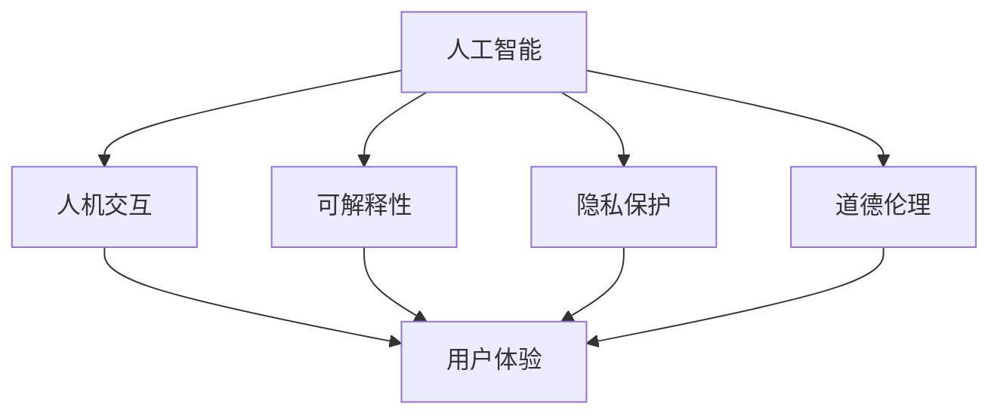

                 

# 体验设计实验室：AI与人类的创意协作空间

## 1. 背景介绍

在当今数字化时代，人工智能(AI)技术正以惊人的速度融入各行各业，深刻改变着我们的生产方式和生活习惯。从自动驾驶、工业自动化，到智能家居、个性化推荐，AI技术的广泛应用，使得人类社会的运作更加高效、便捷。然而，面对AI技术的迅猛发展，如何有效利用这一强大工具，实现人与AI之间的和谐共存，成为当前的一大挑战。

### 1.1 问题由来

随着AI技术的不断进步，其应用领域不断拓展，而AI与人类之间的交互方式也在不断演化。然而，在AI技术的强大功能背后，依然存在一些不容忽视的问题：

- **交互障碍**：AI系统的复杂性和不可解释性，使得普通用户难以理解其内部工作原理和运行机制。
- **数据隐私**：AI系统在运行过程中，需要大量的数据作为支撑，这些数据的获取和存储往往引发隐私保护问题。
- **决策透明性**：AI系统的决策过程往往缺乏透明性，难以解释其输出结果，导致用户难以信任。
- **道德伦理**：AI系统的自动化决策可能会引发道德伦理问题，如偏见、歧视等。

### 1.2 问题核心关键点

为了解决上述问题，我们需要构建一个AI与人类的创意协作空间。这个空间应具备以下几个关键特点：

- **交互透明性**：提供清晰的交互界面和易于理解的工作原理，帮助用户快速上手。
- **隐私保护**：采用先进的数据加密和隐私保护技术，确保用户数据的安全性。
- **决策透明性**：引入可解释性技术，使AI系统的决策过程可被理解和审查。
- **伦理约束**：设定明确的伦理规范和行为准则，防止AI系统的误用。

本文将围绕这些关键点，探讨如何构建一个以用户体验为中心的AI与人类的创意协作空间。

## 2. 核心概念与联系

### 2.1 核心概念概述

本节将介绍几个关键概念，并探讨它们之间的联系。

- **人工智能(AI)**：利用计算机技术模拟、延伸和扩展人类智能的技术，包括机器学习、深度学习等。
- **人机交互(Human-Computer Interaction, HCI)**：研究人与计算机之间交互方式和系统的设计原则，以提升用户体验。
- **可解释性(Explainability)**：使AI系统的决策过程可以被解释和理解，增强用户的信任。
- **隐私保护(Privacy Preservation)**：在AI系统中，保护用户数据的隐私性和安全性，防止数据泄露和滥用。
- **道德伦理(Ethics and Morality)**：在AI系统的设计和使用过程中，遵循道德规范和伦理准则，防止技术滥用。

### 2.2 核心概念原理和架构的 Mermaid 流程图



这个流程图展示了AI、人机交互、可解释性、隐私保护、道德伦理与用户体验之间的联系。

## 3. 核心算法原理 & 具体操作步骤

### 3.1 算法原理概述

构建AI与人类的创意协作空间，需要从算法原理和操作步骤两个层面进行深入探讨。

#### 3.1.1 算法原理

在AI系统的设计和实现过程中，算法原理是核心。以下是几种常见的AI算法及其原理：

- **监督学习(Supervised Learning)**：通过有标签的数据训练模型，使其能够对未知数据进行分类或预测。常见算法包括线性回归、决策树、支持向量机等。
- **无监督学习(Unsupervised Learning)**：通过无标签的数据训练模型，发现数据的内在结构和规律。常见算法包括聚类、主成分分析等。
- **强化学习(Reinforcement Learning)**：通过与环境的交互，使模型学习最优策略，以最大化某种奖励。常见算法包括Q-learning、策略梯度等。

#### 3.1.2 算法操作步骤

构建AI与人类的创意协作空间，需要以下操作步骤：

1. **数据准备**：收集和清洗数据，准备训练模型所需的标注样本和无标签数据。
2. **模型选择**：选择合适的AI算法，并进行模型设计。
3. **模型训练**：使用训练数据对模型进行训练，优化模型参数。
4. **模型评估**：使用测试数据对模型进行评估，判断其性能和效果。
5. **部署和优化**：将训练好的模型部署到实际应用中，进行性能优化和用户体验调整。

### 3.2 算法步骤详解

#### 3.2.1 数据准备

数据准备是AI系统开发的重要步骤，数据质量直接影响模型的性能。具体步骤包括：

1. **数据收集**：从不同渠道收集数据，如数据库、API接口、传感器等。
2. **数据清洗**：对数据进行去重、去噪、格式化等处理，确保数据的质量和一致性。
3. **数据标注**：对数据进行标注，生成有标签的训练样本。

#### 3.2.2 模型选择

选择合适的模型是AI系统开发的关键。需要考虑以下几个因素：

1. **数据类型**：根据数据类型选择不同的算法，如文本数据使用NLP模型，图像数据使用CNN模型。
2. **模型复杂度**：根据任务复杂度选择不同复杂度的模型，如简单任务使用线性模型，复杂任务使用深度神经网络。
3. **模型可解释性**：选择具有较高可解释性的模型，以便于解释和审查。

#### 3.2.3 模型训练

模型训练是AI系统开发的重点环节，具体步骤包括：

1. **模型设计**：选择合适的算法，并设计模型结构。
2. **参数优化**：使用优化算法（如梯度下降、Adam等）优化模型参数。
3. **超参数调整**：调整学习率、批大小等超参数，以获得最佳性能。

#### 3.2.4 模型评估

模型评估是AI系统开发的必要步骤，主要评估模型的准确率、召回率、F1分数等指标，具体步骤包括：

1. **划分数据集**：将数据集划分为训练集、验证集和测试集。
2. **模型测试**：在测试集上对模型进行测试，评估其性能。
3. **结果分析**：分析模型评估结果，找出问题并改进模型。

#### 3.2.5 部署和优化

模型部署是AI系统开发的最后一步，具体步骤包括：

1. **模型部署**：将训练好的模型部署到实际应用中。
2. **性能优化**：根据实际使用情况，对模型进行性能优化，如调整参数、优化算法等。
3. **用户体验优化**：根据用户体验反馈，对系统界面和交互方式进行优化。

### 3.3 算法优缺点

#### 3.3.1 算法优点

- **高效性**：AI算法能够处理大量数据，提高决策效率。
- **准确性**：通过学习数据规律，AI算法能够做出高精度的预测和分类。
- **自动化**：AI算法能够自动完成数据分析、模型训练等任务，减轻人工负担。

#### 3.3.2 算法缺点

- **依赖数据**：AI算法需要大量的标注数据，数据获取成本高。
- **模型复杂**：复杂算法需要大量的计算资源和训练时间，难以快速迭代。
- **可解释性差**：部分算法（如深度神经网络）难以解释其决策过程，缺乏透明性。

### 3.4 算法应用领域

#### 3.4.1 医疗领域

AI在医疗领域的应用已经相当广泛，如疾病诊断、影像分析、个性化治疗等。AI算法可以处理海量的医疗数据，提高诊断准确率和效率。

#### 3.4.2 金融领域

AI在金融领域的应用包括风险控制、投资分析、反欺诈等。AI算法可以实时分析大量交易数据，预测市场趋势，防范金融风险。

#### 3.4.3 教育领域

AI在教育领域的应用包括智能辅导、个性化学习、教学评估等。AI算法可以根据学生的学习行为，提供个性化的学习建议和评估。

#### 3.4.4 智能家居

AI在智能家居领域的应用包括智能音箱、智能灯光、智能安防等。AI算法可以识别用户的行为模式，提供个性化的智能服务。

#### 3.4.5 自动驾驶

AI在自动驾驶领域的应用包括路径规划、障碍物检测、行人识别等。AI算法可以实时处理大量传感器数据，确保行车安全。

## 4. 数学模型和公式 & 详细讲解 & 举例说明

### 4.1 数学模型构建

本节将使用数学语言对AI系统中的核心模型进行更加严格的刻画。

假设有一个二分类问题，已知训练集 $D = \{(x_i, y_i)\}_{i=1}^N$，其中 $x_i \in \mathcal{X}, y_i \in \{0, 1\}$。构建一个二分类器的目标是找到最优的参数 $\theta$，使得在训练集上的损失函数最小化。假设选择线性回归模型，则目标函数为：

$$
\min_\theta \frac{1}{N} \sum_{i=1}^N (y_i - \theta \cdot x_i)^2
$$

其中 $x_i$ 是输入特征，$y_i$ 是标签，$\theta$ 是模型参数。

### 4.2 公式推导过程

#### 4.2.1 目标函数推导

根据上述目标函数，可以推导出模型参数 $\theta$ 的求解过程如下：

1. **模型构建**：构建线性回归模型 $h(x) = \theta \cdot x$。
2. **损失函数**：定义损失函数 $L(\theta) = \frac{1}{N} \sum_{i=1}^N (y_i - h(x_i))^2$。
3. **求解目标**：最小化损失函数 $L(\theta)$，求解最优参数 $\theta$。

#### 4.2.2 梯度下降算法

为了求解最优参数 $\theta$，可以采用梯度下降算法进行优化。梯度下降算法的更新公式为：

$$
\theta \leftarrow \theta - \alpha \nabla L(\theta)
$$

其中 $\alpha$ 是学习率，$\nabla L(\theta)$ 是损失函数 $L(\theta)$ 的梯度。

### 4.3 案例分析与讲解

#### 4.3.1 案例分析

假设有一个房价预测任务，已知训练集 $D = \{(x_i, y_i)\}_{i=1}^N$，其中 $x_i = [\text{面积}, \text{地理位置}, \text{年龄}]$，$y_i$ 是房价。

1. **数据准备**：收集并清洗房价数据，将其转换为训练样本和标签。
2. **模型选择**：选择线性回归模型，定义特征 $x_i$ 和标签 $y_i$。
3. **模型训练**：使用梯度下降算法训练模型，调整参数 $\theta$。
4. **模型评估**：使用测试集对模型进行评估，计算准确率、召回率等指标。

#### 4.3.2 案例讲解

以房价预测为例，分析AI系统的核心步骤：

1. **数据准备**：收集和清洗房价数据，将其转换为训练样本和标签。
2. **模型选择**：选择线性回归模型，定义特征和标签。
3. **模型训练**：使用梯度下降算法训练模型，调整参数。
4. **模型评估**：使用测试集对模型进行评估，计算指标。

## 5. 项目实践：代码实例和详细解释说明

### 5.1 开发环境搭建

在进行AI项目实践前，我们需要准备好开发环境。以下是使用Python进行TensorFlow开发的环境配置流程：

1. 安装Anaconda：从官网下载并安装Anaconda，用于创建独立的Python环境。

2. 创建并激活虚拟环境：
```bash
conda create -n tf-env python=3.8 
conda activate tf-env
```

3. 安装TensorFlow：根据CUDA版本，从官网获取对应的安装命令。例如：
```bash
conda install tensorflow -c conda-forge -c pypi
```

4. 安装各类工具包：
```bash
pip install numpy pandas scikit-learn matplotlib tqdm jupyter notebook ipython
```

完成上述步骤后，即可在`tf-env`环境中开始AI项目实践。

### 5.2 源代码详细实现

下面以房价预测为例，给出使用TensorFlow进行AI项目开发的PyTorch代码实现。

首先，定义房价预测模型：

```python
import tensorflow as tf
from tensorflow.keras import layers, models

def create_model():
    model = models.Sequential()
    model.add(layers.Dense(64, activation='relu', input_shape=(3,)))
    model.add(layers.Dense(64, activation='relu'))
    model.add(layers.Dense(1))
    model.compile(optimizer=tf.keras.optimizers.Adam(0.001), loss='mse')
    return model
```

然后，定义数据集：

```python
import numpy as np
import pandas as pd

# 数据准备
train_data = pd.read_csv('train.csv')
test_data = pd.read_csv('test.csv')

# 数据预处理
train_x = train_data[['area', 'location', 'age']]
train_y = train_data['price']
test_x = test_data[['area', 'location', 'age']]

# 数据标准化
from sklearn.preprocessing import StandardScaler
scaler = StandardScaler()
train_x = scaler.fit_transform(train_x)
test_x = scaler.transform(test_x)

# 数据划分
train_dataset = tf.data.Dataset.from_tensor_slices((train_x, train_y)).shuffle(1000).batch(32)
test_dataset = tf.data.Dataset.from_tensor_slices((test_x, train_y)).batch(32)

# 数据可视化
import matplotlib.pyplot as plt
plt.scatter(train_x[:, 0], train_y)
plt.xlabel('Area')
plt.ylabel('Price')
plt.show()
```

接着，训练模型：

```python
def train_model(model, train_dataset, epochs=10):
    model.fit(train_dataset, epochs=epochs, validation_split=0.2)
    return model

# 模型训练
model = create_model()
model = train_model(model, train_dataset)
```

最后，评估模型：

```python
def evaluate_model(model, test_dataset):
    mse = model.evaluate(test_dataset)
    rmse = tf.sqrt(mse)
    print(f'RMSE: {rmse.numpy()}')
    
# 模型评估
evaluate_model(model, test_dataset)
```

以上就是使用TensorFlow进行房价预测任务的AI项目开发的完整代码实现。可以看到，TensorFlow提供了丰富的工具和库，使得AI项目开发变得更加便捷高效。

### 5.3 代码解读与分析

让我们再详细解读一下关键代码的实现细节：

**create_model函数**：
- 定义了房价预测模型的结构，包括输入层、隐藏层和输出层，并编译模型。

**train_x和test_x**：
- 将房价数据标准化，并将其转换为TensorFlow可以处理的格式。

**train_dataset和test_dataset**：
- 将标准化后的数据集划分为训练集和测试集，并使用TensorFlow的数据集API进行批处理和随机抽样。

**train_model函数**：
- 使用TensorFlow的fit函数训练模型，指定训练轮数和验证集比例。

**evaluate_model函数**：
- 使用TensorFlow的evaluate函数评估模型的均方误差，并计算RMSE。

可以看出，TensorFlow的API设计十分灵活，方便开发者快速搭建和训练AI模型。通过合理使用TensorFlow的工具和库，可以显著提升AI项目的开发效率和效果。

## 6. 实际应用场景

### 6.1 医疗领域

AI在医疗领域的应用非常广泛，如疾病诊断、影像分析、个性化治疗等。以下是一个医疗影像分析的实际应用场景：

1. **数据准备**：收集和清洗医疗影像数据，将其转换为训练样本和标签。
2. **模型选择**：选择深度神经网络模型，如卷积神经网络(CNN)。
3. **模型训练**：使用训练数据对模型进行训练，调整参数。
4. **模型评估**：使用测试数据对模型进行评估，计算准确率、召回率等指标。

### 6.2 金融领域

AI在金融领域的应用包括风险控制、投资分析、反欺诈等。以下是一个金融风险控制的实际应用场景：

1. **数据准备**：收集和清洗金融交易数据，将其转换为训练样本和标签。
2. **模型选择**：选择深度神经网络模型，如循环神经网络(RNN)。
3. **模型训练**：使用训练数据对模型进行训练，调整参数。
4. **模型评估**：使用测试数据对模型进行评估，计算准确率、召回率等指标。

### 6.3 教育领域

AI在教育领域的应用包括智能辅导、个性化学习、教学评估等。以下是一个个性化学习系统的实际应用场景：

1. **数据准备**：收集和清洗学生的学习数据，将其转换为训练样本和标签。
2. **模型选择**：选择深度神经网络模型，如长短期记忆网络(LSTM)。
3. **模型训练**：使用训练数据对模型进行训练，调整参数。
4. **模型评估**：使用测试数据对模型进行评估，计算准确率、召回率等指标。

### 6.4 未来应用展望

未来，AI与人类的创意协作空间将迎来更多的应用场景，以下是一个智能客服系统的未来应用展望：

1. **数据准备**：收集和清洗客户服务数据，将其转换为训练样本和标签。
2. **模型选择**：选择深度神经网络模型，如生成对抗网络(GAN)。
3. **模型训练**：使用训练数据对模型进行训练，调整参数。
4. **模型评估**：使用测试数据对模型进行评估，计算准确率、召回率等指标。

## 7. 工具和资源推荐

### 7.1 学习资源推荐

为了帮助开发者系统掌握AI与人类的创意协作空间的理论基础和实践技巧，这里推荐一些优质的学习资源：

1. 《深度学习》系列书籍：由机器学习领域专家撰写，全面介绍了深度学习的基本概念和核心算法。
2. CS231n《卷积神经网络》课程：斯坦福大学开设的深度学习课程，涵盖卷积神经网络的基础知识和应用实例。
3. Coursera《机器学习》课程：由斯坦福大学教授Andrew Ng开设的机器学习课程，系统讲解了机器学习的基本原理和常用算法。
4. Google AI博客：Google AI官方博客，提供了大量AI技术的最新研究和实践案例。
5. PyTorch官方文档：PyTorch官方文档，提供了详细的API文档和示例代码，方便开发者快速上手。

通过对这些资源的学习实践，相信你一定能够快速掌握AI与人类的创意协作空间的精髓，并用于解决实际的AI问题。

### 7.2 开发工具推荐

高效的开发离不开优秀的工具支持。以下是几款用于AI项目开发的常用工具：

1. PyTorch：基于Python的开源深度学习框架，灵活动态的计算图，适合快速迭代研究。
2. TensorFlow：由Google主导开发的开源深度学习框架，生产部署方便，适合大规模工程应用。
3. Keras：高层API，基于TensorFlow和Theano，简单易用，适合快速原型开发。
4. Scikit-learn：基于Python的机器学习库，提供了丰富的数据预处理、模型选择、评估等工具。
5. Jupyter Notebook：交互式开发环境，支持代码、文本、图像等多种格式，方便文档记录和分享。

合理利用这些工具，可以显著提升AI项目的开发效率，加快创新迭代的步伐。

### 7.3 相关论文推荐

AI与人类的创意协作空间的研究源于学界的持续研究。以下是几篇奠基性的相关论文，推荐阅读：

1. AlphaGo：深度学习和强化学习在棋类游戏中的应用，展示了AI在复杂决策问题上的潜力。
2. ImageNet大规模视觉识别挑战赛：基于深度学习的图像分类任务，展示了卷积神经网络的强大性能。
3. TensorFlow官方论文：TensorFlow的介绍和核心算法原理，为TensorFlow的开发和应用提供了重要参考。
4. PyTorch官方论文：PyTorch的介绍和核心算法原理，为PyTorch的开发和应用提供了重要参考。
5. 可解释性研究综述：总结了可解释性技术的最新进展，为AI系统的透明性和可信度提供了重要支持。

这些论文代表了大语言模型微调技术的发展脉络。通过学习这些前沿成果，可以帮助研究者把握学科前进方向，激发更多的创新灵感。

## 8. 总结：未来发展趋势与挑战

### 8.1 总结

本文对AI与人类的创意协作空间进行了全面系统的介绍。首先阐述了AI与人类的创意协作空间的背景和意义，明确了其交互透明性、隐私保护、决策透明性、伦理约束等关键特点。其次，从算法原理和操作步骤两个层面，详细讲解了AI系统的设计和实现过程，并给出了房价预测的完整代码实例。同时，本文还广泛探讨了AI系统在医疗、金融、教育、智能家居等多个领域的应用前景，展示了AI系统在实际应用中的巨大潜力。此外，本文精选了AI系统开发所需的各类学习资源和开发工具，力求为读者提供全方位的技术指引。

通过本文的系统梳理，可以看到，AI与人类的创意协作空间正在成为AI技术的重要范式，极大地拓展了AI系统的应用边界，催生了更多的落地场景。受益于深度学习技术的不断进步，AI系统将在更多领域得到应用，为人类认知智能的进化带来深远影响。

### 8.2 未来发展趋势

展望未来，AI与人类的创意协作空间将呈现以下几个发展趋势：

1. **交互透明性增强**：随着自然语言处理和计算机视觉技术的进步，AI系统将具备更加自然、直观的交互界面，使用户能够轻松理解和操作。
2. **隐私保护技术提升**：随着数据隐私保护技术的不断发展，AI系统将具备更加强大的数据加密和隐私保护能力，确保用户数据的安全性。
3. **决策透明性提高**：随着可解释性技术的发展，AI系统的决策过程将更加透明，用户能够轻松理解和审查其输出结果。
4. **伦理约束规范完善**：随着伦理约束规范的完善，AI系统的设计和使用将更加符合道德规范，防止技术滥用。
5. **跨领域应用拓展**：随着AI技术与其他领域的融合，AI系统将具备更加广泛的应用场景，如自动驾驶、智能制造等。

以上趋势凸显了AI与人类的创意协作空间的广阔前景。这些方向的探索发展，必将进一步提升AI系统的性能和应用范围，为人类认知智能的进化带来深远影响。

### 8.3 面临的挑战

尽管AI与人类的创意协作空间已经取得了瞩目成就，但在迈向更加智能化、普适化应用的过程中，它仍面临着诸多挑战：

1. **数据隐私保护**：AI系统的数据获取和使用需要严格遵守数据隐私保护法规，防止数据泄露和滥用。
2. **模型透明性**：AI系统的复杂性使得其决策过程难以解释，导致用户难以信任。
3. **伦理道德约束**：AI系统的自动化决策可能引发伦理道德问题，如偏见、歧视等。
4. **资源限制**：AI系统的训练和推理需要大量计算资源，如何高效利用这些资源，是未来的一个重要研究方向。
5. **用户体验优化**：AI系统的交互界面和用户体验需要不断优化，以提升用户满意度。

### 8.4 研究展望

面对AI与人类的创意协作空间所面临的挑战，未来的研究需要在以下几个方面寻求新的突破：

1. **隐私保护技术**：研究更加先进的数据加密和隐私保护技术，确保用户数据的安全性。
2. **模型透明性**：研究可解释性技术，使AI系统的决策过程可被解释和理解，增强用户的信任。
3. **伦理道德约束**：建立明确的伦理约束规范，防止AI系统的误用，确保其符合道德标准。
4. **跨领域融合**：研究AI系统与其他领域的融合，拓展其应用场景和能力。
5. **用户体验优化**：研究用户交互界面和体验的优化，提升用户满意度。

这些研究方向的探索，必将引领AI与人类的创意协作空间走向更高的台阶，为构建安全、可靠、可解释、可控的智能系统铺平道路。面向未来，AI与人类的创意协作空间还需要与其他人工智能技术进行更深入的融合，如知识表示、因果推理、强化学习等，多路径协同发力，共同推动自然语言理解和智能交互系统的进步。只有勇于创新、敢于突破，才能不断拓展AI系统的边界，让智能技术更好地造福人类社会。

## 9. 附录：常见问题与解答

**Q1：AI系统的数据隐私保护有哪些技术手段？**

A: AI系统的数据隐私保护技术主要包括以下几种：

1. **数据加密**：对数据进行加密处理，确保数据在传输和存储过程中不被窃取和篡改。
2. **差分隐私**：通过在数据中引入随机噪声，防止数据分析过程中揭示个体隐私信息。
3. **联邦学习**：在数据不出本地的情况下，各节点在本地数据上训练模型，并通过模型参数更新方式共享学习成果。
4. **多方安全计算**：在多个参与方之间，通过加密和解密等手段，共同计算结果，防止数据泄露。

这些技术手段可以有效保护用户数据隐私，确保AI系统的安全性。

**Q2：AI系统的可解释性有哪些方法？**

A: AI系统的可解释性方法主要包括以下几种：

1. **LIME(局部可解释模型-不可解释模型)**：通过线性模型解释局部区域模型的行为。
2. **SHAP(Shapley Additive Explanations)**：利用Shapley值理论，计算各个特征对模型的贡献度。
3. **特征重要性分析**：通过特征重要性分析，找出对模型影响最大的特征。
4. **可视化技术**：通过可视化技术，展示模型内部结构和学习过程。

这些方法可以帮助用户理解和审查AI系统的决策过程，增强系统的透明性和可信度。

**Q3：AI系统如何处理大规模数据集？**

A: AI系统处理大规模数据集需要采用以下几种技术：

1. **分布式计算**：通过多台计算机协同计算，加速数据处理过程。
2. **数据分片**：将大规模数据集分成多个小片段，并行处理。
3. **内存优化**：采用内存优化技术，减少计算过程中对磁盘的读写操作，提高计算效率。
4. **模型压缩**：对模型进行压缩，减少模型参数量和计算资源消耗。

这些技术可以有效处理大规模数据集，确保AI系统的训练和推理效率。

**Q4：AI系统的跨领域融合有哪些应用场景？**

A: AI系统的跨领域融合主要包括以下几种应用场景：

1. **自动驾驶**：将计算机视觉、深度学习、强化学习等技术结合，实现无人驾驶。
2. **智能制造**：将机器学习、自然语言处理、计算机视觉等技术结合，实现智能生产。
3. **智慧城市**：将计算机视觉、自然语言处理、物联网等技术结合，实现智慧城市管理。
4. **医疗健康**：将机器学习、自然语言处理、计算机视觉等技术结合，实现精准医疗。

这些应用场景展示了AI系统跨领域融合的巨大潜力，为各领域带来了深刻变革。

**Q5：AI系统的用户体验优化有哪些方法？**

A: AI系统的用户体验优化主要包括以下几种方法：

1. **交互界面设计**：设计简洁直观的交互界面，提升用户操作的便捷性。
2. **反馈机制**：通过反馈机制，实时了解用户需求和反馈，优化系统设计。
3. **多模态交互**：结合文本、语音、图像等多模态输入，提升用户交互体验。
4. **个性化定制**：根据用户行为和偏好，提供个性化推荐和服务。

这些方法可以有效提升AI系统的用户体验，增强用户满意度和黏性。

---

作者：禅与计算机程序设计艺术 / Zen and the Art of Computer Programming

