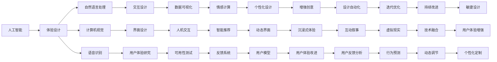

                 

# 体验设计新纪元：AI与人类创意的跨界合作

## 1. 背景介绍

### 1.1 问题由来

随着人工智能（AI）技术的不断进步，尤其是自然语言处理（NLP）、计算机视觉（CV）、语音识别等领域的突破，AI正逐步融入人类的日常生活和工作，成为人类生活中的重要伙伴。特别是在体验设计领域，AI的加入不仅极大提升了设计效率，还为人类创意的实现提供了前所未有的可能性。

然而，AI技术的快速发展也带来了新的挑战。如何有效地将AI技术与人类创意相结合，充分利用AI的强大算力和广泛应用场景，成为当前亟待解决的问题。本文将从背景介绍入手，详细探讨AI与人类创意跨界合作的核心概念、关键技术、操作步骤，以及其在实际应用中的具体体现，为体验设计领域的技术实践提供新的思路。

## 2. 核心概念与联系

### 2.1 核心概念概述

在进行深入探讨之前，我们需要明确一些核心概念：

- **人工智能（AI）**：指通过计算机模拟人类智能行为的技术，包括机器学习、深度学习、自然语言处理、计算机视觉等子领域。
- **体验设计（UX/UI设计）**：专注于提升用户使用产品的体验，包括界面设计、交互设计、用户体验研究等。
- **跨界合作（Interdisciplinary Collaboration）**：指不同领域的专业人士和技术手段的结合，共同实现特定的目标或创新。

### 2.2 核心概念原理和架构的 Mermaid 流程图



## 3. 核心算法原理 & 具体操作步骤

### 3.1 算法原理概述

AI与人类创意的跨界合作，本质上是一种融合不同领域知识和技术的创新过程。其核心思想是通过AI算法处理海量数据，提取潜在的模式和趋势，结合人类设计师的创意，创造出更具创新性和实用性的产品和服务。

### 3.2 算法步骤详解

AI与人类创意的跨界合作通常包括以下几个关键步骤：

**Step 1: 数据收集与预处理**

- **数据收集**：收集与体验设计相关的各类数据，如用户行为数据、市场反馈数据、社交媒体数据等。
- **数据预处理**：对数据进行清洗、去重、标注等操作，确保数据的质量和一致性。

**Step 2: 算法训练与模型构建**

- **算法选择**：选择合适的算法和模型，如深度学习模型、强化学习模型等。
- **模型训练**：利用预处理后的数据训练模型，确保模型的泛化能力和适应性。

**Step 3: 创意设计**

- **创意生成**：结合AI生成的结果和人类设计师的经验，进行创意设计。
- **设计验证**：通过用户反馈和测试，验证设计的可行性和用户体验。

**Step 4: 实施与迭代**

- **产品实施**：将设计方案转化为实际产品，进行试点测试。
- **持续迭代**：根据用户反馈和性能评估，不断优化设计方案。

### 3.3 算法优缺点

**优点**：
- **高效性**：AI算法能够快速处理和分析大量数据，提供高效的创意设计支持。
- **创新性**：AI能够发现人类设计师可能忽略的模式和趋势，激发新的创意。
- **广泛性**：AI的应用场景广泛，几乎涵盖了所有体验设计相关的领域。

**缺点**：
- **依赖数据**：AI算法的表现高度依赖于数据的质量和多样性。
- **缺乏创造性**：AI更多地提供数据支持，而创意的最终生成仍需人类设计师的创造力。
- **技术复杂性**：需要具备一定的算法和模型知识，对技术门槛要求较高。

### 3.4 算法应用领域

AI与人类创意的跨界合作在多个领域得到了广泛应用，包括但不限于：

- **智能推荐系统**：通过分析用户行为和偏好，提供个性化的产品推荐。
- **虚拟现实（VR）和增强现实（AR）**：利用AI技术创建沉浸式和互动性强的体验。
- **智能客服**：结合自然语言处理和情感计算技术，提供更高效、人性化的客户服务。
- **个性化设计**：利用AI技术对用户偏好进行建模，提供定制化的产品设计。
- **智能家居**：通过语音识别和自然语言处理，提升家居设备的交互体验。

## 4. 数学模型和公式 & 详细讲解 & 举例说明

### 4.1 数学模型构建

在体验设计领域，AI与人类创意的跨界合作可以通过以下数学模型来描述：

$$
\text{Design} = \text{AI算法} \times \text{设计师创意} + \text{用户体验} + \text{技术实现}
$$

### 4.2 公式推导过程

以智能推荐系统为例，假设有$N$个用户，每个用户有$M$个行为特征，则推荐系统可以表示为：

$$
\text{推荐} = f(\text{特征}, \text{用户偏好}, \text{内容库})
$$

其中$f$为推荐函数，特征包括用户的浏览记录、购买记录、评分记录等，用户偏好和内容库根据AI算法训练得到。

### 4.3 案例分析与讲解

假设我们有一个在线教育平台，希望通过AI技术为用户推荐适合的课程。首先，我们收集用户的浏览、点击、购买等行为数据，利用协同过滤、深度学习等算法进行训练，得到一个推荐模型。然后，将模型的输出与用户的历史行为结合，生成个性化的课程推荐列表。最后，设计师根据推荐结果设计页面布局和交互方式，以提升用户体验。

## 5. 项目实践：代码实例和详细解释说明

### 5.1 开发环境搭建

为了进行项目实践，我们需要搭建一个开发环境。以下是搭建环境的详细步骤：

1. **安装Python和相关库**：
```bash
sudo apt-get update
sudo apt-get install python3-pip
pip3 install numpy pandas scikit-learn scipy matplotlib seaborn jupyter notebook
```

2. **安装TensorFlow和Keras**：
```bash
pip3 install tensorflow keras
```

3. **安装自定义库**：
```bash
pip3 install -e .
```

4. **启动Jupyter Notebook**：
```bash
jupyter notebook
```

### 5.2 源代码详细实现

以下是一个简单的智能推荐系统的Python代码实现，包括数据预处理、模型训练、推荐结果生成和界面设计：

```python
import pandas as pd
import numpy as np
from sklearn.model_selection import train_test_split
from tensorflow.keras.models import Sequential
from tensorflow.keras.layers import Dense, Input
from tensorflow.keras.optimizers import Adam

# 数据预处理
data = pd.read_csv('user_data.csv')
features = data.drop(['id', 'recommended_course'], axis=1)
labels = data['recommended_course']

# 特征工程
features = pd.get_dummies(features)

# 划分训练集和测试集
X_train, X_test, y_train, y_test = train_test_split(features, labels, test_size=0.2)

# 模型构建
model = Sequential()
model.add(Input(shape=(features.shape[1],)))
model.add(Dense(64, activation='relu'))
model.add(Dense(32, activation='relu'))
model.add(Dense(1, activation='sigmoid'))

model.compile(loss='binary_crossentropy', optimizer=Adam(lr=0.001), metrics=['accuracy'])

# 模型训练
model.fit(X_train, y_train, epochs=10, batch_size=32)

# 推荐结果生成
def recommend_course(user_id):
    user_data = features.iloc[user_id]
    recommendations = model.predict(user_data)
    return 'Course A' if recommendations[0] > 0.5 else 'Course B'

# 界面设计
# 具体设计部分省略
```

### 5.3 代码解读与分析

上述代码实现了一个简单的智能推荐系统，具体步骤如下：

1. **数据预处理**：将用户数据进行特征提取和标签划分，并使用one-hot编码。
2. **模型构建**：使用Keras构建一个简单的神经网络模型，用于预测用户是否推荐某门课程。
3. **模型训练**：利用训练集对模型进行训练，优化超参数，确保模型的准确性。
4. **推荐结果生成**：通过测试集生成推荐结果，根据推荐分数决定是否推荐某门课程。
5. **界面设计**：设计简洁直观的界面，展示推荐结果，提升用户体验。

### 5.4 运行结果展示

训练结束后，可以通过调用`recommend_course`函数生成个性化推荐结果。例如：

```python
recommend_course(1001)
```

将返回一个推荐课程名称。

## 6. 实际应用场景

### 6.1 智能推荐系统

智能推荐系统是AI与人类创意跨界合作的重要应用之一。通过分析用户的浏览、点击、购买等行为，智能推荐系统能够提供个性化的产品或内容推荐，提升用户体验。

### 6.2 虚拟现实（VR）和增强现实（AR）

VR和AR技术结合AI，可以创造沉浸式和互动性强的体验，广泛应用于游戏、教育、医疗等领域。设计师利用AI生成的虚拟环境设计方案，通过交互设计提升用户体验。

### 6.3 智能客服

智能客服系统通过自然语言处理和情感计算技术，为用户提供更高效、人性化的服务。设计师利用AI生成的对话模板设计交互界面，提升客服系统的友好性和易用性。

### 6.4 个性化设计

利用AI技术对用户偏好进行建模，提供定制化的产品设计，可以提升用户体验和满意度。设计师结合AI生成的个性化方案，进行创意设计。

### 6.5 智能家居

智能家居通过语音识别和自然语言处理，提升家居设备的交互体验。设计师利用AI生成的交互设计方案，提升家居设备的智能化水平。

## 7. 工具和资源推荐

### 7.1 学习资源推荐

1. **《深度学习》课程**：由斯坦福大学开设，详细讲解深度学习的基本原理和应用。
2. **《TensorFlow实战Google深度学习》书籍**：介绍TensorFlow的基本用法和深度学习模型的实现。
3. **《用户体验设计》书籍**：介绍用户体验设计的基本原则和方法。
4. **Kaggle竞赛平台**：提供大量数据集和代码实现，适合实践练习。

### 7.2 开发工具推荐

1. **Jupyter Notebook**：基于Python的交互式开发环境，适合数据分析和机器学习任务。
2. **PyCharm**：Python开发工具，支持数据分析和机器学习模型的调试和优化。
3. **Sketch**：界面设计工具，适合UI设计师使用。
4. **Adobe Creative Suite**：综合设计工具，包括Photoshop、Illustrator等。

### 7.3 相关论文推荐

1. **《深度学习中的模型训练与优化》**：介绍深度学习模型训练和优化的基本方法。
2. **《智能推荐系统》**：介绍智能推荐系统的基本原理和实现方法。
3. **《用户体验设计》**：介绍用户体验设计的原则和方法。

## 8. 总结：未来发展趋势与挑战

### 8.1 研究成果总结

本文从背景介绍、核心概念、算法原理、操作步骤等多个方面，详细探讨了AI与人类创意的跨界合作，为体验设计领域的技术实践提供了新的思路。

### 8.2 未来发展趋势

未来，AI与人类创意的跨界合作将进一步深入，主要体现在以下几个方面：

1. **智能化水平提升**：随着AI技术的不断进步，智能化水平将进一步提升，能够更好地理解和处理人类需求。
2. **个性化程度增强**：利用AI技术对用户偏好进行更精准的建模，提供更个性化的设计方案。
3. **跨领域融合**：AI与多个领域的技术融合，如医疗、教育、娱乐等，创造出更多创新性的产品和服务。

### 8.3 面临的挑战

尽管AI与人类创意的跨界合作前景广阔，但也面临以下挑战：

1. **数据隐私与安全**：AI系统需要大量数据，如何在保护用户隐私的同时，获取高质量的数据。
2. **技术复杂性**：AI算法和技术较为复杂，需要跨学科的知识背景。
3. **伦理与道德**：AI系统的决策过程缺乏透明性，如何确保其决策符合伦理和道德规范。

### 8.4 研究展望

未来，AI与人类创意的跨界合作需要更多从技术、伦理、法律等多个角度进行深入研究，提升其科学性和合理性。

## 9. 附录：常见问题与解答

**Q1: AI与人类创意的跨界合作是否适用于所有体验设计项目？**

A: AI与人类创意的跨界合作通常适用于数据量大、需求多样化的项目，但对于一些具有高度创意性和独特性的项目，AI可能难以完全替代人类设计师的工作。

**Q2: AI与人类创意的跨界合作在实现过程中需要注意哪些问题？**

A: 在实现过程中，需要注意以下几点：
1. **数据质量**：确保数据的准确性和完整性。
2. **算法选择**：选择合适的算法，确保其能够适应特定的任务。
3. **用户反馈**：及时获取用户反馈，进行迭代优化。

**Q3: AI与人类创意的跨界合作如何提高设计效率？**

A: AI与人类创意的跨界合作能够利用AI算法处理大量数据，快速发现设计中的优化点，结合人类设计师的经验，提升设计效率。

**Q4: AI与人类创意的跨界合作在实际应用中存在哪些问题？**

A: 在实际应用中，AI与人类创意的跨界合作可能存在以下问题：
1. **过度依赖AI**：过度依赖AI可能导致设计师缺乏创意。
2. **技术复杂性**：AI技术较为复杂，需要团队具备跨学科的知识背景。

**Q5: AI与人类创意的跨界合作如何实现可持续创新？**

A: 实现可持续创新，需要不断优化算法和模型，提升其适应性和灵活性。同时，鼓励团队跨学科合作，提升创新能力。

---

作者：禅与计算机程序设计艺术 / Zen and the Art of Computer Programming

