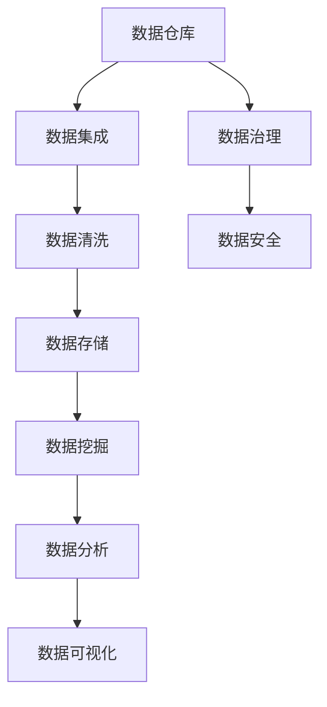

                 

## 1. 背景介绍

### 1.1 问题由来

随着信息时代的到来，全球数据量呈爆炸式增长。来自互联网、社交媒体、物联网、金融交易等各种渠道的数据源源不断地产生，信息过载成为新时代的重要特征。尽管信息技术的迅猛发展带来了诸多便利，但它同时也带来了前所未有的信息复杂性，让人们在处理海量数据时面临着巨大的挑战。

以数据为中心的决策和洞察已经成为各行各业的核心需求。无论是零售、金融、制造、医疗，还是公共服务等领域，数据都扮演着至关重要的角色。但是，如何有效地管理、存储、分析和利用这些数据，依然是一个充满挑战的问题。

### 1.2 问题核心关键点

信息管理的主要目标是：

- **数据整合**：将来自不同来源的数据进行整合，构建统一的视图，方便后续的分析和应用。
- **数据清洗**：识别并处理数据中的错误、冗余和异常，确保数据的准确性和一致性。
- **数据存储**：选择合适的方式存储数据，既要高效又要安全。
- **数据分析**：从大量数据中提取有用的信息和洞察，辅助决策。
- **数据安全**：保护数据免受未授权访问和攻击。
- **数据共享**：在遵守数据隐私和安全法规的前提下，支持数据共享和协作。

本文将围绕上述核心关键点，探讨信息时代的信息管理策略，为解决信息过载和复杂性问题提供参考。

## 2. 核心概念与联系

### 2.1 核心概念概述

- **数据仓库(Data Warehouse)**：用于集中存储和管理大量结构化数据的系统。它支持数据的高效查询和分析。
- **数据湖(Data Lake)**：存储各种类型、格式和大小的非结构化数据的存储系统。
- **数据挖掘(Data Mining)**：通过算法从大量数据中发现模式和洞察。
- **大数据处理框架(Big Data Frameworks)**：如Hadoop、Spark等，用于处理大规模数据集。
- **机器学习(Machine Learning)**：使用算法让机器从数据中学习和改进，自动化决策过程。
- **数据治理(Data Governance)**：管理数据的策略、规则和流程，确保数据的质量、安全和使用合规。
- **数据安全和隐私管理(Data Security and Privacy)**：保护数据免受未经授权的访问和泄漏，确保数据隐私。

这些概念之间存在紧密的联系，共同构成了信息管理的整体框架。

### 2.2 核心概念原理和架构的 Mermaid 流程图



以上流程图展示了信息管理的核心流程和架构，从数据收集、存储、处理、分析到最终的数据可视化，每个环节都依赖于数据治理和数据安全策略的指导和支撑。

## 3. 核心算法原理 & 具体操作步骤

### 3.1 算法原理概述

信息管理的核心算法原理主要围绕数据处理和分析展开，包括以下几个方面：

- **数据清洗**：包括去重、去噪、缺失值填充、异常值检测等操作。
- **数据挖掘**：利用聚类、分类、关联规则等算法，从数据中提取有用的模式和洞察。
- **数据分析**：通过统计分析和机器学习算法，对数据进行深入分析。

### 3.2 算法步骤详解

1. **数据收集与集成**：从不同的数据源收集数据，使用ETL工具进行清洗、转换和加载。
2. **数据清洗与预处理**：识别并处理数据中的错误、冗余和异常，使用数据清洗工具和算法。
3. **数据存储与访问**：选择合适的存储系统，如数据仓库、数据湖，支持高效的查询和访问。
4. **数据分析与建模**：使用数据分析工具和算法，从数据中提取有用的信息和洞察。
5. **数据可视化和报告**：将分析结果通过可视化工具呈现，辅助决策。
6. **数据安全和隐私管理**：实施数据访问控制、加密、监控等措施，保护数据安全和隐私。

### 3.3 算法优缺点

- **优点**：
  - 提供统一的、集成化的数据视图。
  - 支持大规模数据处理，提高效率。
  - 通过数据分析发现模式和洞察，辅助决策。
- **缺点**：
  - 初始建设和维护成本较高。
  - 需要专业技术人才，管理和维护复杂。
  - 数据质量和一致性依赖于流程和工具。

### 3.4 算法应用领域

信息管理的应用领域广泛，包括但不限于：

- **商业智能(Business Intelligence, BI)**：通过数据分析和可视化支持企业决策。
- **金融分析**：监控金融市场动态，进行风险管理和投资决策。
- **公共卫生**：分析医疗数据，支持疾病预防和公共卫生决策。
- **智能交通**：通过数据分析优化交通流量和运行效率。
- **智能制造**：分析生产数据，优化供应链和生产流程。

## 4. 数学模型和公式 & 详细讲解 & 举例说明

### 4.1 数学模型构建

假设有一个数据集 $D = \{(x_i, y_i)\}_{i=1}^N$，其中 $x_i$ 是特征向量，$y_i$ 是标签。数据清洗和预处理的目标是构建一个干净的、标准化后的数据集 $D' = \{(x'_i, y'_i)\}_{i=1}^N$。

### 4.2 公式推导过程

- **数据清洗**：
  - 去重：使用哈希表去重，公式为 $\text{unique}\{x_i\}$。
  - 去噪：使用滤波器去除噪声数据，公式为 $\text{filter}(x_i, \sigma)$，其中 $\sigma$ 是滤波器参数。
  - 缺失值填充：使用均值、中位数或插值法填充缺失值，公式为 $\text{fill}(x_i)$。
  - 异常值检测：使用箱线图或Z分数检测异常值，公式为 $\text{outlier}(x_i, \mu, \sigma)$，其中 $\mu$ 是均值，$\sigma$ 是标准差。

- **数据挖掘**：
  - 聚类算法：K-Means算法，公式为 $\text{KMeans}(X, K)$，其中 $X$ 是特征矩阵，$K$ 是聚类数。
  - 分类算法：决策树算法，公式为 $\text{DecisionTree}(X, Y)$，其中 $X$ 是特征矩阵，$Y$ 是标签向量。
  - 关联规则算法：Apriori算法，公式为 $\text{Apriori}(I, T)$，其中 $I$ 是事务集，$T$ 是项集。

- **数据分析**：
  - 统计分析：均值、方差、协方差等公式为 $\text{mean}(X)$、$\text{var}(X)$、$\text{cov}(X, Y)$。
  - 机器学习：线性回归公式为 $\text{LinearRegression}(X, Y)$。

### 4.3 案例分析与讲解

假设有一个电商网站的数据集，包含用户购买历史、浏览记录、评分等数据。通过数据清洗，去除重复数据、噪音数据和异常值。然后使用K-Means算法对用户进行聚类，找出不同的用户群体。接着，使用决策树算法对每个群体的购买行为进行分类，预测其未来的购买倾向。最后，使用均值和方差对用户评分进行分析，评估产品质量。

## 5. 项目实践：代码实例和详细解释说明

### 5.1 开发环境搭建

本节将介绍使用Python进行数据管理的开发环境配置流程。

1. 安装Anaconda：
   ```bash
   wget https://repo.anaconda.com/miniconda/Miniconda3-py310_3.10.1-Win32.exe
   ```

2. 创建并激活虚拟环境：
   ```bash
   conda create -n data-mining python=3.8
   conda activate data-mining
   ```

3. 安装相关库：
   ```bash
   pip install pandas numpy scikit-learn seaborn matplotlib pyecharts
   ```

### 5.2 源代码详细实现

以下是一个使用Pandas进行数据清洗和预处理的Python代码示例：

```python
import pandas as pd
from sklearn.preprocessing import StandardScaler

# 读取数据
df = pd.read_csv('data.csv')

# 数据清洗
df = df.drop_duplicates()  # 去除重复数据
df = df[df['rating'] > 0]  # 去除评分低于0的记录
df = df.dropna(subset=['timestamp', 'product_id'])  # 去除缺失值

# 数据标准化
scaler = StandardScaler()
df['rating'] = scaler.fit_transform(df[['rating']])
```

### 5.3 代码解读与分析

这段代码主要进行了以下几个操作：

1. **数据读取**：使用Pandas的`read_csv`函数读取数据。
2. **数据清洗**：使用`drop_duplicates`函数去除重复数据，使用条件筛选去除评分低于0的记录，使用`dropna`函数去除缺失值。
3. **数据标准化**：使用`StandardScaler`对评分数据进行标准化处理。

### 5.4 运行结果展示

运行上述代码后，数据集被清洗和标准化处理，以便进行后续的数据分析和建模。

## 6. 实际应用场景

### 6.1 商业智能

商业智能系统通过数据分析和可视化，帮助企业进行决策。例如，一家零售公司可以通过分析顾客购买数据，了解顾客的购买行为和偏好，优化库存管理和营销策略。

### 6.2 金融分析

金融分析系统通过实时监控市场数据，预测股票价格和市场趋势，辅助投资决策。例如，通过分析历史交易数据和新闻事件，预测某支股票的涨跌趋势。

### 6.3 公共卫生

公共卫生系统通过分析医疗数据，支持疾病预防和公共卫生决策。例如，通过分析病例数据和地理信息，预测某种疾病的传播趋势，制定防控措施。

### 6.4 智能交通

智能交通系统通过数据分析优化交通流量和运行效率。例如，通过分析实时交通数据，预测交通拥堵情况，优化红绿灯控制策略。

### 6.5 智能制造

智能制造系统通过数据分析优化供应链和生产流程。例如，通过分析生产数据，预测设备故障和维护需求，优化生产计划。

## 7. 工具和资源推荐

### 7.1 学习资源推荐

为了帮助开发者系统掌握数据管理的理论基础和实践技巧，这里推荐一些优质的学习资源：

1. 《Python数据科学手册》：系统介绍了Python在数据科学中的应用，涵盖数据清洗、数据挖掘、数据分析等主题。
2. 《数据科学实战》：通过实际案例，介绍了数据管理的全流程，包括数据清洗、数据建模、数据可视化等。
3. 《大数据技术与应用》：介绍大数据处理框架和算法，如Hadoop、Spark、MapReduce等。
4. 《机器学习实战》：通过实际案例，介绍了机器学习算法的应用，涵盖回归、分类、聚类等主题。

### 7.2 开发工具推荐

高效的开发离不开优秀的工具支持。以下是几款用于数据管理开发的常用工具：

1. Jupyter Notebook：交互式的数据分析和编程环境，支持Python、R等多种语言。
2. PyCharm：功能强大的Python IDE，支持数据清洗、数据分析、可视化等。
3. R Studio：R语言的数据分析环境，支持R语言的数据挖掘、统计分析等。
4. Tableau：数据可视化工具，支持复杂的交互式数据探索和可视化。

### 7.3 相关论文推荐

数据管理的理论研究取得了丰硕成果，以下是几篇奠基性的相关论文，推荐阅读：

1. 《大数据时代下的数据仓库设计》：介绍数据仓库的设计和实现，支持数据的高效管理和分析。
2. 《数据治理框架》：提出数据治理的框架和策略，确保数据的质量和安全。
3. 《数据挖掘算法综述》：介绍数据挖掘的主要算法和应用，涵盖聚类、分类、关联规则等主题。

## 8. 总结：未来发展趋势与挑战

### 8.1 总结

本文对信息管理的主要概念和算法原理进行了全面系统的介绍。首先阐述了信息管理的背景和目标，明确了数据整合、数据清洗、数据存储、数据分析、数据安全和数据共享等核心任务。其次，从原理到实践，详细讲解了信息管理的数学模型和操作步骤，给出了数据管理的完整代码实例。同时，本文还探讨了信息管理在商业智能、金融分析、公共卫生、智能交通、智能制造等多个行业领域的应用前景，展示了信息管理的巨大潜力。此外，本文精选了信息管理的各类学习资源，力求为读者提供全方位的技术指引。

通过本文的系统梳理，可以看到，信息管理在大数据时代中扮演着至关重要的角色。它不仅可以帮助企业和组织优化决策，还可以为公共服务和社会治理提供新的思路和工具。未来，伴随数据管理技术的持续演进，相信信息管理将在更多领域发挥更加重要的作用，为人类社会带来深远的影响。

### 8.2 未来发展趋势

展望未来，数据管理技术将呈现以下几个发展趋势：

1. **自动化和智能化**：随着人工智能和机器学习技术的发展，数据管理将变得更加自动化和智能化。例如，自动化的数据清洗和预处理，智能化的数据分析和建模。
2. **数据湖和大数据处理**：数据湖和大数据处理框架将进一步普及，支持更大规模和更复杂的数据处理需求。
3. **实时数据处理**：实时数据流处理技术将变得更加成熟，支持实时数据分析和决策。
4. **跨领域数据融合**：不同领域的数据将更加融合，支持多模态数据的联合分析和应用。
5. **数据隐私和安全**：数据隐私和安全将成为越来越重要的议题，数据管理技术将更加注重隐私保护和数据安全。

以上趋势凸显了数据管理技术的广阔前景。这些方向的探索发展，必将进一步提升数据管理的效率和效果，为各行业的数字化转型提供新的动力。

### 8.3 面临的挑战

尽管数据管理技术已经取得了显著进展，但在迈向更加智能化、普适化应用的过程中，它仍面临着诸多挑战：

1. **数据质量和一致性**：数据质量是数据管理的基础，但不同数据源的数据格式、精度、时间戳等不一致性，仍然是一个难以克服的难题。
2. **数据安全和隐私**：数据安全和隐私保护是数据管理的重要目标，但数据泄露和未授权访问的风险依然存在。
3. **计算资源和成本**：大规模数据处理需要高性能计算资源，但资源投入成本较高，难以在所有企业中普及。
4. **数据交互和互操作性**：不同系统和平台之间的数据交互和互操作性问题，仍然是一个技术难题。
5. **数据管理和业务融合**：如何将数据管理技术融入业务流程，支持业务决策和优化，还需要更多的实践和经验积累。

这些挑战需要持续的技术创新和工程实践，才能逐步克服。只有不断突破技术瓶颈，数据管理才能真正实现其价值。

### 8.4 研究展望

未来的数据管理研究需要在以下几个方面寻求新的突破：

1. **数据自动化处理**：开发更加高效、智能的数据清洗和预处理算法，减少人工干预，提高数据处理效率。
2. **跨领域数据融合**：探索如何高效融合多模态数据，支持多领域的联合分析和应用。
3. **数据安全和隐私保护**：开发更加安全、隐私保护的数据存储和管理技术，确保数据的安全和隐私。
4. **实时数据处理和分析**：研究和应用实时数据流处理技术，支持实时数据分析和决策。
5. **数据管理和业务融合**：探索如何将数据管理技术融入业务流程，支持业务决策和优化。

这些研究方向的探索，必将引领数据管理技术迈向更高的台阶，为构建智能、高效、安全的数据管理系统提供新的思路。面向未来，数据管理技术需要与其他信息技术进行更深入的融合，共同推动各行业数字化转型的进程。

## 9. 附录：常见问题与解答

**Q1：数据清洗和预处理对数据分析和建模有哪些影响？**

A: 数据清洗和预处理是数据分析和建模的基础。清洗和预处理后的数据更加准确、一致和完整，能够提高模型的效果和鲁棒性。例如，去除异常值可以降低模型的偏差，填补缺失值可以避免数据不完整导致的误差。

**Q2：如何选择适合的数据治理策略？**

A: 数据治理策略的选择需要根据数据的特点、业务需求和数据质量情况来确定。常见的数据治理策略包括：数据标准化、数据质量和一致性监控、数据安全和隐私保护等。需要根据实际情况灵活组合这些策略。

**Q3：数据安全和隐私保护有哪些关键措施？**

A: 数据安全和隐私保护的关键措施包括：数据加密、访问控制、审计和监控、匿名化处理等。需要综合应用这些技术手段，确保数据的安全和隐私。

**Q4：如何选择适合的大数据处理框架？**

A: 选择大数据处理框架需要考虑数据量、数据类型、处理速度和成本等因素。常见的框架包括Hadoop、Spark、Flink等。需要根据实际情况选择最适合的框架，并结合工具和算法进行优化。

**Q5：如何优化数据处理效率？**

A: 数据处理效率的优化可以从以下几个方面入手：

1. **并行处理**：使用多线程、多进程或分布式计算，提高数据处理速度。
2. **数据压缩**：使用压缩算法减少数据存储和传输的开销。
3. **数据分块**：将大数据集分成小块处理，提高处理效率。
4. **算法优化**：使用高效的算法和数据结构，减少计算资源消耗。
5. **硬件加速**：使用GPU、TPU等硬件加速设备，提高数据处理速度。

这些优化措施可以综合应用，提高数据处理的效率和效果。

---

作者：禅与计算机程序设计艺术 / Zen and the Art of Computer Programming

