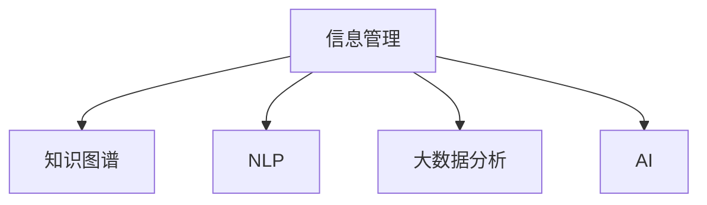
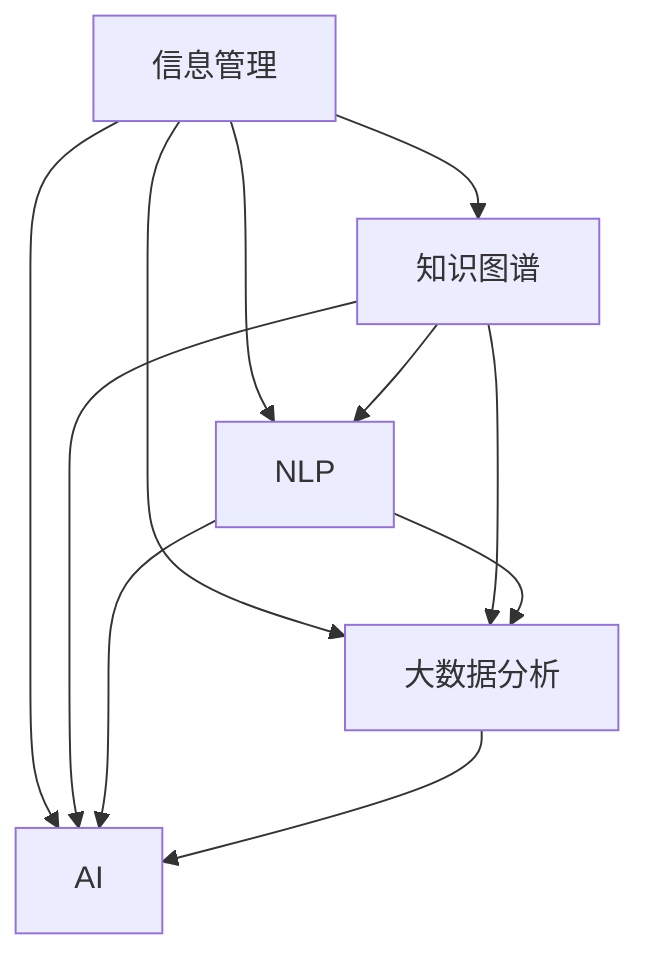

                 

# 信息时代的信息管理：如何处理信息过载以提高生产力

> 关键词：信息过载,信息管理,知识图谱,自然语言处理(NLP),大数据分析,人工智能(AI)

## 1. 背景介绍

### 1.1 问题由来
随着互联网和数字技术的飞速发展，信息量呈指数级增长。人类的信息接受能力远远跟不上信息生产的速度，信息过载已成为当前社会的一大问题。信息过载不仅影响个人的工作效率和决策能力，也对企业运营和市场竞争带来严重影响。如何有效管理信息，从中提取有价值的部分，已成为提高生产力的关键所在。

### 1.2 问题核心关键点
本节将讨论信息过载问题的核心关键点，以助于读者理解问题的本质和重要性：

1. **信息量的爆炸增长**：随着互联网、社交媒体、移动设备等新技术的普及，信息量呈爆炸式增长，人类接收和处理信息的能力远远跟不上。

2. **信息噪音的干扰**：海量的信息中，真实、有用的信息占比不足，大量噪音干扰了信息筛选和处理的效率。

3. **决策的困难性**：由于信息过载，人们难以从海量数据中快速获取关键信息，进行合理决策，影响生产效率。

4. **知识管理的挑战**：海量信息需要有效的存储、检索和整合，知识管理成为提高生产力的关键。

5. **自动化和智能化的需求**：面对信息过载，自动化和智能化的信息管理成为必然趋势，需要引入新技术来解决这一问题。

### 1.3 问题研究意义
研究如何有效管理信息，提高信息处理效率，对于提高个人生产力、提升企业竞争力、优化社会管理，具有重要意义：

1. **提升个人效率**：有效管理信息，快速获取关键信息，提高决策速度和工作效率。

2. **优化企业运营**：通过信息管理，减少误判和错误决策，提升企业运营效率和市场竞争力。

3. **促进社会进步**：有效的信息管理有助于社会治理、公共服务、教育培训等领域的进步，推动社会全面发展。

4. **支持科学研究**：在科学研究中，信息过载问题尤为严重，高效的信息管理有助于加速研究进程，推动科技进步。

## 2. 核心概念与联系

### 2.1 核心概念概述

为帮助读者理解信息管理的内涵和架构，本节将介绍几个核心概念：

- **信息管理(Information Management)**：通过技术手段，对信息进行收集、存储、整理、检索和利用的过程。
- **知识图谱(Knowledge Graph)**：一种结构化表达知识的方式，通过节点和边的形式，将知识表示为图形结构。
- **自然语言处理(NLP)**：使计算机能够理解和处理人类语言的技术，包括文本挖掘、语义分析、信息提取等。
- **大数据分析(Big Data Analytics)**：通过对海量数据进行统计分析、挖掘发现和知识提取，获取有价值的信息。
- **人工智能(AI)**：利用机器学习、深度学习等技术，模拟和扩展人类智能，实现自动化信息处理。

这些核心概念构成了信息管理的框架，其核心在于通过技术手段对信息进行高效管理和利用。

### 2.2 核心概念原理和架构的 Mermaid 流程图



### 2.3 核心概念联系

上述概念之间的逻辑关系可以通过以下图表展示：



这个图表展示了信息管理中各技术之间的相互作用和依赖关系：

1. **知识图谱**：利用NLP和大数据分析，构建知识图谱，辅助信息检索和知识推理。
2. **自然语言处理**：通过文本挖掘和语义分析，将非结构化文本转换为结构化知识，为知识图谱提供数据来源。
3. **大数据分析**：通过对海量数据进行统计分析，提取有价值的信息，为信息管理提供基础数据支撑。
4. **人工智能**：利用机器学习和深度学习等技术，自动化处理信息，提高信息管理效率。

这些技术相互作用，共同构成了高效的信息管理框架。

## 3. 核心算法原理 & 具体操作步骤

### 3.1 算法原理概述

信息管理涉及多个技术手段，但其核心原理是数据驱动和知识驱动的。通过数据挖掘和知识图谱，从海量信息中提取有用的知识，辅助决策和执行。

### 3.2 算法步骤详解

信息管理的一般步骤包括：

1. **数据收集**：从多个数据源收集信息，如文本、图像、视频等。
2. **数据清洗和预处理**：对原始数据进行清洗、去重、标注等预处理。
3. **特征提取和编码**：将数据转换为可用于计算的特征向量。
4. **信息检索和匹配**：在知识图谱或数据库中进行信息检索和匹配，获取相关结果。
5. **知识推理和融合**：通过逻辑推理和融合，构建更全面的知识体系。
6. **结果呈现和利用**：将结果呈现给用户，辅助决策和执行。

### 3.3 算法优缺点

信息管理的核心算法具有以下优缺点：

#### 优点：
- **高效性**：通过自动化处理和知识推理，大幅提高信息处理效率。
- **准确性**：利用大数据分析和知识图谱，提取更准确的信息。
- **可扩展性**：适应不同规模和类型的数据，具有较好的扩展性。

#### 缺点：
- **复杂性**：涉及多技术手段，算法实现复杂，需要综合考虑。
- **依赖数据质量**：依赖于高质量的数据，数据质量不佳会影响效果。
- **资源消耗**：大规模数据处理和知识推理，需要高性能计算资源。

### 3.4 算法应用领域

信息管理技术在多个领域得到广泛应用，例如：

- **企业知识管理**：通过信息管理，优化企业知识库，提升员工工作效率和创新能力。
- **医疗信息管理**：利用大数据分析和知识图谱，辅助医生诊断和治疗。
- **金融风险管理**：通过信息管理，进行风险预警和资产定价，提升金融机构竞争力。
- **社交媒体分析**：对社交媒体数据进行情感分析、舆情监测，辅助企业决策。
- **智慧城市管理**：通过信息管理，优化城市资源配置和公共服务，提高城市治理水平。

## 4. 数学模型和公式 & 详细讲解 & 举例说明

### 4.1 数学模型构建

信息管理的数学模型通常涉及文本挖掘、知识推理等多个方面，以下将以知识图谱和文本挖掘为例，构建数学模型：

### 4.2 公式推导过程

#### 知识图谱的构建

知识图谱由节点和边组成，用于表示实体、属性和关系。假设有n个实体，每个实体有m个属性，节点和边之间关联关系可以用三元组表示：

$$
(实体_i, 属性_j, 属性值)
$$

#### 文本挖掘

文本挖掘的目的是从大量文本数据中提取有价值的信息。常用的方法包括TF-IDF、主题建模、情感分析等。以TF-IDF为例，文本中每个词的权重计算如下：

$$
\text{TF-IDF}_{word} = \text{TF} \times \text{IDF}
$$

其中，TF（Term Frequency）表示词频，IDF（Inverse Document Frequency）表示逆文档频率。

### 4.3 案例分析与讲解

#### 案例一：企业知识管理

某企业采用信息管理技术，构建了知识图谱，用于辅助研发和生产。企业知识图谱包括员工、项目、设备、原材料等实体，每个实体有名称、描述、状态等属性。通过知识图谱，可以快速检索员工的技能和项目的状态，提高项目执行效率。

#### 案例二：社交媒体情感分析

某公司需要分析社交媒体上的情感信息，以评估其品牌声誉和用户满意度。利用NLP技术，对社交媒体数据进行情感分析，构建情感图谱，辅助公司进行决策。

## 5. 项目实践：代码实例和详细解释说明

### 5.1 开发环境搭建

在开始信息管理项目前，需要搭建开发环境。以下是一个基本的环境搭建流程：

1. **安装Python**：确保系统中安装了Python 3.6及以上版本。

2. **安装依赖库**：
   - 安装NumPy、Pandas等基础库：
     ```
     pip install numpy pandas
     ```
   - 安装Scikit-learn、NLTK等机器学习、自然语言处理库：
     ```
     pip install scikit-learn nltk
     ```
   - 安装ElasticSearch等大数据处理库：
     ```
     pip install elasticsearch
     ```

3. **安装可视化工具**：如Matplotlib、Seaborn等，用于数据可视化：
   ```
   pip install matplotlib seaborn
   ```

### 5.2 源代码详细实现

以下是一个基于知识图谱的信息管理项目示例，使用Python实现。

```python
import pandas as pd
from py2neo import Graph

# 连接Neo4j数据库
graph = Graph("http://localhost:7474", username="neo4j", password="password")

# 从CSV文件中读取数据
data = pd.read_csv("data.csv")

# 构建知识图谱
for row in data.itertuples():
    entity = row.entity
    attribute1 = row.attribute1
    attribute2 = row.attribute2
    graph.run("MERGE (e:Entity {name: $name})", name=entity)
    graph.run("MERGE (e)-[:HAS_ATTRIBUTE]->(a:Attribute {name: $name})", name=attribute1)
    graph.run("MERGE (e)-[:HAS_ATTRIBUTE]->(a:Attribute {name: $name})", name=attribute2)
    graph.run("MATCH (e:Entity {name: $name}) MERGE (e)-[:HAS_RELATED]->(r:Relationship {name: $relationship})", name=entity, relationship=row.relation)

# 查询知识图谱
query = "MATCH (e:Entity)-[:HAS_ATTRIBUTE]->(a:Attribute) RETURN e.name, a.name"
result = graph.run(query)
for row in result:
    print(row)
```

### 5.3 代码解读与分析

以上代码实现了一个简单的信息管理项目，其中：

- 使用Py2neo连接Neo4j数据库，进行知识图谱的构建和管理。
- 从CSV文件中读取数据，构建实体、属性和关系。
- 通过查询操作，检索和显示知识图谱中的信息。

### 5.4 运行结果展示

运行上述代码，可以构建一个简单的企业知识图谱，并检索实体和属性信息。

## 6. 实际应用场景

### 6.1 智能客服系统

智能客服系统是信息管理技术的一个重要应用场景。通过收集客户历史对话记录，构建知识图谱，利用NLP技术，实现智能客服的自动化回复。智能客服系统能够快速响应客户咨询，提供个性化的服务，提升客户满意度。

### 6.2 金融风险管理

金融行业面临大量的市场数据和业务数据，通过信息管理技术，进行风险预警和资产定价，提升金融机构的风险管理能力。知识图谱和NLP技术可以辅助分析市场舆情，预测市场趋势，辅助决策。

### 6.3 医疗信息管理

医疗行业数据量庞大，利用信息管理技术，构建医疗知识图谱，辅助医生诊断和治疗。NLP技术可以提取医疗记录中的关键信息，辅助病历管理和诊断。

### 6.4 未来应用展望

信息管理技术在未来将迎来更多的应用场景，例如：

- **智慧城市管理**：通过信息管理，优化城市资源配置和公共服务，提高城市治理水平。
- **智能制造**：利用信息管理技术，优化供应链和生产流程，提升制造企业的效率和灵活性。
- **智能教育**：通过信息管理，构建个性化学习路径，提升教育质量和效果。

## 7. 工具和资源推荐

### 7.1 学习资源推荐

为了帮助开发者掌握信息管理技术，以下是一些优质的学习资源：

1. **Coursera《大数据分析与机器学习》课程**：由斯坦福大学开设，涵盖大数据分析、机器学习等多个方面，适合入门学习。
2. **《Python for Data Analysis》书籍**：详细介绍Python在数据处理、分析中的应用，适合编程初学者。
3. **《信息管理技术》课程**：涵盖信息管理、知识图谱等多个方面，适合系统学习。
4. **GitHub上的信息管理项目**：查找开源项目，了解实际应用案例和代码实现。

### 7.2 开发工具推荐

信息管理技术的开发，需要多种工具的支持，以下是一些推荐的工具：

1. **Python**：作为信息管理技术的主要编程语言，Python具有丰富的库和框架。
2. **ElasticSearch**：高效的大数据搜索引擎，适合处理大规模数据。
3. **Py2neo**：Python的Neo4j客户端，方便构建和管理知识图谱。
4. **NLTK**：Python的自然语言处理库，适合进行文本挖掘和语义分析。

### 7.3 相关论文推荐

信息管理技术的发展离不开学界的持续研究，以下是几篇重要的相关论文：

1. **《信息管理：从传统到智能》**：介绍信息管理技术的发展历程和未来趋势。
2. **《知识图谱构建与应用的现状与未来》**：探讨知识图谱的构建方法和应用场景。
3. **《大数据分析与知识图谱融合》**：探讨大数据分析和知识图谱的融合技术。
4. **《深度学习在信息管理中的应用》**：探讨深度学习在文本挖掘和知识推理中的应用。

## 8. 总结：未来发展趋势与挑战

### 8.1 研究成果总结

本节对信息管理技术的研究进展进行总结，梳理了当前领域的主要研究方向和技术突破：

1. **知识图谱构建**：随着技术的发展，知识图谱的构建效率和准确性不断提升。
2. **自然语言处理**：NLP技术在文本挖掘、语义分析等方面取得了显著进展。
3. **大数据分析**：大数据分析技术的应用范围不断扩大，辅助决策能力增强。
4. **人工智能**：AI技术在信息管理中得到了广泛应用，提升了信息处理效率和效果。

### 8.2 未来发展趋势

未来信息管理技术将呈现以下几个发展趋势：

1. **自动化和智能化**：信息管理技术将更加自动化和智能化，减少人工干预，提高效率。
2. **多模态信息融合**：融合文本、图像、视频等多种模态信息，构建更全面的知识体系。
3. **实时性和动态性**：信息管理技术将具备实时性和动态性，能够快速响应变化。
4. **跨领域应用**：信息管理技术将广泛应用于多个领域，提升社会生产力和治理能力。
5. **可解释性和透明度**：信息管理技术将更加透明和可解释，提升用户信任和满意度。

### 8.3 面临的挑战

信息管理技术虽然取得了显著进展，但在实践中仍面临诸多挑战：

1. **数据质量**：信息管理依赖高质量的数据，数据质量不佳会影响效果。
2. **模型复杂性**：信息管理技术涉及多技术手段，算法实现复杂。
3. **资源消耗**：大规模数据处理和知识推理需要高性能计算资源。
4. **安全性和隐私**：信息管理涉及大量敏感数据，需要保障数据安全和隐私。

### 8.4 研究展望

为了应对这些挑战，未来的研究需要在以下几个方面寻求新的突破：

1. **数据预处理和清洗**：提升数据质量，减少噪音干扰。
2. **模型优化和简化**：简化模型结构，提高算法效率。
3. **跨领域应用**：拓展信息管理技术的应用领域，提高普适性。
4. **安全性和隐私保护**：加强数据安全和隐私保护，保障用户隐私。

通过持续的研究和优化，信息管理技术将进一步提升生产力和社会治理能力，推动人类社会向智能化的方向发展。

## 9. 附录：常见问题与解答

**Q1：信息管理技术如何提升生产力和效率？**

A: 信息管理技术通过自动化处理和知识驱动，可以从海量数据中提取有用信息，辅助决策和执行，减少人工干预和错误，提升生产力和效率。

**Q2：信息管理技术面临哪些挑战？**

A: 信息管理技术面临数据质量、模型复杂性、资源消耗、安全性和隐私保护等多方面的挑战。

**Q3：如何提升信息管理技术的可解释性？**

A: 通过引入可解释的模型和算法，如决策树、逻辑回归等，提升模型的可解释性，增加用户信任和满意度。

**Q4：信息管理技术如何支持跨领域应用？**

A: 通过引入多模态信息融合技术，如文本、图像、视频等，构建更全面的知识体系，支持跨领域应用。

通过持续的研究和优化，信息管理技术将进一步提升生产力和社会治理能力，推动人类社会向智能化的方向发展。

---

作者：禅与计算机程序设计艺术 / Zen and the Art of Computer Programming

