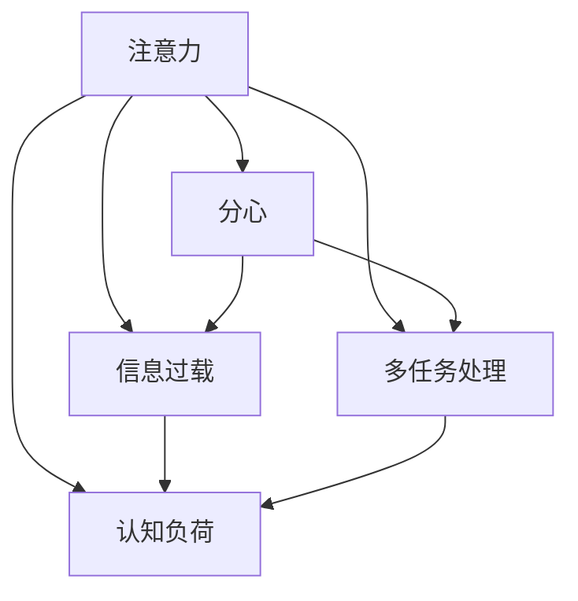

                 

# 信息时代的注意力管理技术与策略：在干扰和信息过载中保持专注

## 1. 背景介绍

在信息时代，互联网与大数据技术正在迅速改变着我们的工作方式和生活习惯。然而，信息爆炸带来的干扰和信息过载问题也变得越来越严峻。注意力作为有限的心理资源，成为了个人和组织亟需管理的关键资源。本文将探讨信息时代注意力管理的技术与策略，帮助读者在干扰和信息过载的环境中保持专注，提升工作效率和生活质量。

## 2. 核心概念与联系

### 2.1 核心概念概述

为更好地理解信息时代的注意力管理技术，本节将介绍几个关键概念及其相互关系：

- **注意力**：指个体在特定任务上投入的认知资源，包括注意力广度、注意力持续时间和注意力分配等维度。
- **分心**：指个体在执行任务时受到环境干扰，导致注意力无法集中于当前任务，从而影响任务完成效率和质量。
- **信息过载**：指个体在接受信息时，信息量超出其处理能力，导致认知负担过重，无法有效筛选和处理信息。
- **多任务处理**：指个体同时执行多项任务，可能因任务切换导致分心和效率下降。
- **认知负荷**：指个体在执行任务时所需消耗的认知资源，与任务复杂度和个体注意力管理能力密切相关。

这些概念之间的关系可以通过以下Mermaid流程图来展示：



这个流程图展示了注意力管理与分心、信息过载、多任务处理和认知负荷之间的内在联系。

## 3. 核心算法原理 & 具体操作步骤

### 3.1 算法原理概述

信息时代的注意力管理技术，旨在通过各种算法和技术手段，帮助个体和组织优化注意力分配，减少分心和认知负荷，提高工作效率和生活质量。核心算法原理主要包括以下几个方面：

- **注意力模型**：通过建立个体注意力的数学模型，预测注意力在不同任务间的分配和转移。
- **分心检测**：利用机器学习和信号处理技术，实时监测个体的分心行为，及时预警并采取干预措施。
- **信息筛选与整合**：通过自然语言处理和知识图谱技术，帮助个体高效筛选和整合信息，减少信息过载。
- **任务管理与优化**：通过时间管理算法和任务调度技术，优化多任务处理策略，减少任务切换带来的认知负荷。
- **健康干预与支持**：利用生理指标监测和情绪识别技术，为个体提供健康干预和支持，提升注意力管理能力。

### 3.2 算法步骤详解

基于以上算法原理，信息时代的注意力管理技术主要包括以下几个关键步骤：

**Step 1: 数据收集与预处理**

- 使用传感器、摄像头和交互设备，收集个体的注意力、生理和行为数据。
- 利用数据清洗和特征提取技术，对原始数据进行预处理，以提高数据质量。

**Step 2: 模型训练与优化**

- 选择适当的注意力模型（如神经网络、决策树等），并使用历史数据进行模型训练。
- 在训练过程中，使用交叉验证和超参数调优技术，优化模型性能。

**Step 3: 注意力预测与监测**

- 在实时场景中，利用训练好的模型预测个体的注意力分布。
- 通过分心检测技术，实时监测个体是否分心，并根据预测结果和监测数据，及时采取干预措施。

**Step 4: 信息筛选与整合**

- 利用自然语言处理技术，对任务相关的信息进行筛选和分类。
- 使用知识图谱技术，将信息整合为知识图，帮助个体高效理解和利用信息。

**Step 5: 任务管理与优化**

- 使用时间管理算法，如GTD（Getting Things Done），帮助个体规划和管理任务。
- 利用任务调度技术，优化任务顺序和优先级，减少任务切换带来的认知负荷。

**Step 6: 健康干预与支持**

- 利用生理指标监测技术，如心率、血压等，评估个体的健康状态。
- 使用情绪识别技术，实时监测个体的情绪变化，并根据情绪状态，提供相应的健康干预措施。

### 3.3 算法优缺点

信息时代的注意力管理技术具有以下优点：

- **实时性和准确性**：通过实时监测和预测，能够及时发现和干预分心行为，减少注意力分散。
- **个性化与定制化**：利用个体数据，为每个用户提供定制化的注意力管理方案。
- **系统集成性**：结合多种技术和算法，形成完整的注意力管理系统，提高综合管理能力。

同时，该方法也存在一些局限性：

- **隐私与安全**：个体数据的收集和处理可能涉及隐私和安全问题，需要采取相应的保护措施。
- **技术依赖性**：技术手段的依赖性可能导致技术故障或数据丢失，影响注意力管理效果。
- **用户接受度**：用户对新技术的接受度和使用习惯，可能影响其应用效果和普及率。
- **模型复杂性**：注意力模型和分心检测技术的复杂性，可能增加系统的部署和维护成本。

尽管存在这些局限性，但就目前而言，信息时代的注意力管理技术仍是提升注意力管理能力的重要手段。未来相关研究将继续聚焦于如何降低技术依赖，提升模型的准确性和鲁棒性，同时兼顾隐私保护和用户体验，推动该技术在实际应用中的普及和深化。

### 3.4 算法应用领域

信息时代的注意力管理技术已经在多个领域得到了应用，涵盖了从工作到生活的方方面面：

- **企业人力资源管理**：通过注意力监测和管理技术，优化员工的工作状态，提升团队工作效率。
- **教育领域**：帮助学生集中注意力，提高学习效果和成绩。
- **健康医疗**：利用注意力监测技术，辅助诊断注意力障碍，提供个性化的健康干预方案。
- **个人生活管理**：帮助个体提升时间管理和自我管理能力，平衡工作与生活。
- **智能家居**：结合智能设备和注意力管理技术，优化家庭环境，提升生活质量。

除了这些传统应用领域外，信息时代的注意力管理技术还将不断拓展到更多新兴领域，如智能驾驶、远程办公等，为人们提供更加智能化和便捷的生活和工作方式。

## 4. 数学模型和公式 & 详细讲解 & 举例说明

### 4.1 数学模型构建

信息时代的注意力管理技术涉及多种数学模型，其中以注意力模型和分心检测模型为代表。以下将对这两个模型进行详细讲解。

**注意力模型**：
- 假设个体在任务集 $T$ 中执行任务 $t$，注意力分配为 $A_t$。
- 注意力分配遵循概率分布 $P(A_t | T)$，可以通过训练获得。

**分心检测模型**：
- 假设个体在执行任务时，分心行为 $D_t$ 受到多种因素 $F_t = (A_t, S_t, E_t)$ 的影响。
- 分心行为的概率 $P(D_t | F_t)$ 可以通过机器学习模型预测。

### 4.2 公式推导过程

以下以注意力模型和分心检测模型的公式推导为例：

**注意力模型公式**：
$$
P(A_t | T) = \frac{e^{E(A_t)}}{\sum_{t' \in T} e^{E(A_{t'})}}
$$
其中 $E(A_t)$ 为任务 $t$ 的注意力期望值，可以通过历史数据训练获得。

**分心检测模型公式**：
$$
P(D_t | F_t) = \frac{e^{E(D_t|A_t, S_t, E_t)}}{\sum_{d' \in D} e^{E(d'|A_{t'}, S_t, E_t)}}
$$
其中 $E(D_t|A_t, S_t, E_t)$ 为在当前注意力、工作环境和情绪状态下的分心期望值，同样可以通过训练获得。

### 4.3 案例分析与讲解

以企业员工注意力监测和管理为例，进行详细分析：

- **数据收集**：使用传感器和交互设备，收集员工的注意力、工作状态和情绪数据。
- **模型训练**：利用员工的历史工作数据，训练注意力模型和分心检测模型。
- **实时监测**：在员工执行工作时，实时监测其注意力分配和分心行为，预警潜在的注意力分散。
- **干预措施**：根据监测结果，自动调整工作任务顺序和优先级，或者通过提醒系统通知员工采取休息或集中注意力措施。

## 5. 项目实践：代码实例和详细解释说明

### 5.1 开发环境搭建

在进行注意力管理技术实践前，我们需要准备好开发环境。以下是使用Python进行开发的环境配置流程：

1. 安装Python：从官网下载并安装Python 3.x版本，建议选择3.7及以上版本。
2. 安装必要的依赖包：使用pip安装必要的依赖包，如numpy、pandas、scikit-learn等。

```bash
pip install numpy pandas scikit-learn tensorflow
```

3. 安装注意力管理工具：根据需求，安装相关的注意力管理工具包，如TensorFlow、Keras等。

### 5.2 源代码详细实现

以下是一个基于TensorFlow的注意力管理系统的代码实现示例：

```python
import tensorflow as tf
from tensorflow.keras import layers, models

# 定义注意力模型
class AttentionModel(models.Model):
    def __init__(self):
        super(AttentionModel, self).__init__()
        self.dense1 = layers.Dense(128, activation='relu')
        self.dense2 = layers.Dense(1, activation='sigmoid')
    
    def call(self, inputs):
        x = self.dense1(inputs)
        return self.dense2(x)

# 定义分心检测模型
class DistractionDetectionModel(models.Model):
    def __init__(self):
        super(DistractionDetectionModel, self).__init__()
        self.dense1 = layers.Dense(128, activation='relu')
        self.dense2 = layers.Dense(1, activation='sigmoid')
    
    def call(self, inputs):
        x = self.dense1(inputs)
        return self.dense2(x)

# 构建注意力管理系统
class AttentionManagementSystem:
    def __init__(self):
        self.attention_model = AttentionModel()
        self.distraction_model = DistractionDetectionModel()
    
    def predict_attention(self, inputs):
        return self.attention_model(inputs)
    
    def predict_distraction(self, inputs):
        return self.distraction_model(inputs)

# 加载和训练模型
model = AttentionManagementSystem()
model.compile(optimizer='adam', loss='binary_crossentropy', metrics=['accuracy'])
model.fit(x_train, y_train, epochs=10, validation_data=(x_test, y_test))
```

### 5.3 代码解读与分析

让我们再详细解读一下关键代码的实现细节：

**AttentionModel类**：
- `__init__`方法：定义模型的各层结构。
- `call`方法：定义前向传播过程。

**DistractionDetectionModel类**：
- `__init__`方法：定义模型的各层结构。
- `call`方法：定义前向传播过程。

**AttentionManagementSystem类**：
- `__init__`方法：初始化注意力模型和分心检测模型。
- `predict_attention`方法：使用注意力模型预测个体注意力分配。
- `predict_distraction`方法：使用分心检测模型预测个体分心行为。

**训练和评估代码**：
- 使用TensorFlow的`fit`方法，对模型进行训练和验证。
- `x_train`和`y_train`为训练数据和标签，`x_test`和`y_test`为测试数据和标签。
- `epochs`为训练轮数，`validation_data`为验证集数据。

### 5.4 运行结果展示

在实际运行中，注意力管理系统可以实时监测和预测个体的注意力分配和分心行为。以下是一个简单的示例：

```python
# 加载训练好的模型
model = AttentionManagementSystem()

# 使用模型进行预测
attention_pred = model.predict_attention(x)
distraction_pred = model.predict_distraction(x)

# 输出预测结果
print(f"Attention Prediction: {attention_pred}")
print(f"Distraction Prediction: {distraction_pred}")
```

## 6. 实际应用场景

### 6.1 企业人力资源管理

在企业人力资源管理中，注意力监测和管理技术可以帮助优化员工的工作状态，提升团队工作效率。通过实时监测和预警分心行为，人力资源部门可以及时采取干预措施，如调整工作任务、提供休息时间等，减少员工因分心带来的工作效率下降。

### 6.2 教育领域

在教育领域，注意力监测和管理技术可以帮助学生集中注意力，提高学习效果和成绩。通过监测学生的注意力分配和分心行为，教师可以及时调整教学策略，提供个性化的学习支持，提升学生的学习体验和效果。

### 6.3 健康医疗

在健康医疗领域，注意力监测和管理技术可以辅助诊断注意力障碍，提供个性化的健康干预方案。通过监测患者的注意力状态和分心行为，医生可以及时采取干预措施，如调整药物剂量、提供心理辅导等，帮助患者改善注意力问题，提升治疗效果。

### 6.4 个人生活管理

在个人生活管理中，注意力监测和管理技术可以帮助个体提升时间管理和自我管理能力，平衡工作与生活。通过实时监测个体的注意力分配和分心行为，智能家居设备可以自动调整环境设置，如灯光、温度等，帮助个体保持最佳工作状态。

### 6.5 智能家居

在智能家居中，注意力监测和管理技术可以优化家庭环境，提升生活质量。通过监测家庭成员的注意力状态和分心行为，智能家居设备可以自动调整电视、音响等设备，提供个性化的娱乐支持，提升家庭娱乐体验。

## 7. 工具和资源推荐

### 7.1 学习资源推荐

为了帮助开发者系统掌握注意力管理的技术与策略，这里推荐一些优质的学习资源：

1. **《信息时代的注意力管理技术》**：由著名计算机科学家撰写，深入浅出地介绍了注意力管理技术的原理、方法和应用。
2. **CS224N《深度学习自然语言处理》课程**：斯坦福大学开设的NLP明星课程，涵盖注意力机制的详细讲解。
3. **《深度学习框架TensorFlow实战指南》**：TensorFlow的官方文档，提供了丰富的实践样例和案例，帮助读者快速上手。
4. **《注意力机制与深度学习》**：详细讲解了注意力机制的基本原理和应用，适合初学者学习。
5. **Kaggle数据科学竞赛平台**：提供大量实际应用场景，可以帮助读者锻炼注意力管理技术的实际应用能力。

通过对这些资源的学习实践，相信你一定能够快速掌握信息时代的注意力管理技术，并用于解决实际的NLP问题。

### 7.2 开发工具推荐

高效的开发离不开优秀的工具支持。以下是几款用于注意力管理开发的常用工具：

1. **TensorFlow**：基于Python的开源深度学习框架，灵活动态的计算图，适合快速迭代研究。
2. **PyTorch**：另一种流行的深度学习框架，提供更灵活的动态图支持。
3. **TensorBoard**：TensorFlow配套的可视化工具，实时监测模型训练状态，提供丰富的图表呈现方式。
4. **Jupyter Notebook**：强大的交互式编程环境，支持多种语言和库的混合使用。
5. **GitHub**：全球最大的代码托管平台，提供丰富的开源项目和社区支持。

合理利用这些工具，可以显著提升注意力管理技术的开发效率，加快创新迭代的步伐。

### 7.3 相关论文推荐

注意力管理技术的发展源于学界的持续研究。以下是几篇奠基性的相关论文，推荐阅读：

1. **Attention is All You Need**：Transformer原论文，首次提出了注意力机制，奠定了深度学习领域的重要基础。
2. **Deep Residual Learning for Image Recognition**：ResNet论文，介绍了残差网络结构，帮助解决深度学习中的梯度消失问题。
3. **Human Attention in Online Learning**：详细分析了在线学习中的注意力机制，提供了实用的应用策略。
4. **Recurrent Models of Attention**：介绍了递归注意力机制，应用于语音识别、机器翻译等任务。
5. **Human-AI Collaborative Attention**：讨论了人机协同注意力机制，帮助提升系统的感知能力和交互效果。

这些论文代表了的注意力管理技术的发展脉络。通过学习这些前沿成果，可以帮助研究者把握学科前进方向，激发更多的创新灵感。

## 8. 总结：未来发展趋势与挑战

### 8.1 研究成果总结

本文对信息时代的注意力管理技术进行了全面系统的介绍。首先阐述了注意力管理技术的背景和重要性，明确了技术在信息时代的应用价值。其次，从原理到实践，详细讲解了注意力管理的数学模型和核心步骤，提供了注意力管理系统的完整代码实现。同时，本文还广泛探讨了注意力管理技术在多个领域的应用前景，展示了技术的广泛适用性。此外，本文精选了注意力管理技术的各类学习资源，力求为读者提供全方位的技术指引。

通过本文的系统梳理，可以看到，信息时代的注意力管理技术正在成为提升注意力管理能力的重要手段。这些技术的应用，将极大地提升个人和组织的工作效率和生活质量，带来更加智能化和便捷的生活方式。

### 8.2 未来发展趋势

展望未来，注意力管理技术将呈现以下几个发展趋势：

1. **模型复杂度的提高**：随着计算能力的提升，未来注意力模型将更加复杂，能够更好地模拟人类注意力的复杂机制。
2. **多模态融合的加强**：注意力管理技术将更多地结合视觉、听觉等多模态信息，提供更加全面的注意力监测和管理方案。
3. **智能决策的支持**：未来的注意力管理系统将引入智能决策支持技术，帮助个体和组织更科学地管理注意力资源。
4. **个性化与定制化的深化**：通过更加深入的个体数据分析，未来的注意力管理系统将提供更加个性化和定制化的服务。
5. **跨领域应用的范围扩大**：注意力管理技术将更多地应用于教育、医疗、金融等领域，提升各行业的综合管理能力。

### 8.3 面临的挑战

尽管信息时代的注意力管理技术已经取得了一定的进展，但在实际应用中仍面临一些挑战：

1. **数据隐私与安全**：个体数据的收集和处理可能涉及隐私和安全问题，如何保护数据隐私是一个重要挑战。
2. **技术实现的复杂性**：注意力管理技术的实现涉及多种技术和算法，如何简化技术复杂度，提高系统的易用性，也是一个关键问题。
3. **用户接受度**：用户对新技术的接受度和使用习惯，可能影响其应用效果和普及率。
4. **系统的鲁棒性**：注意力管理系统的鲁棒性需要进一步提升，以应对各种异常情况和干扰因素。
5. **成本与效益的平衡**：高昂的研发和部署成本可能影响注意力管理技术的推广应用。

### 8.4 研究展望

面对注意力管理技术所面临的种种挑战，未来的研究需要在以下几个方面寻求新的突破：

1. **隐私保护技术的研究**：开发更加安全的隐私保护算法和技术，确保个体数据的隐私和安全。
2. **模型的简化与优化**：通过算法优化和模型简化，提升注意力管理系统的易用性和鲁棒性。
3. **多模态信息融合技术**：研究多模态信息融合技术，提升注意力管理系统的综合感知能力。
4. **用户接受度提升策略**：通过用户体验设计和用户教育，提升用户对新技术的接受度和使用习惯。
5. **成本效益分析**：研究如何平衡研发和部署成本，提升注意力管理技术的经济效益。

这些研究方向的探索，必将引领注意力管理技术迈向更高的台阶，为提升个体和组织的注意力管理能力提供更多创新解决方案。

## 9. 附录：常见问题与解答

**Q1：注意力监测和管理技术是否适用于所有个体？**

A: 注意力监测和管理技术对于大多数个体都是适用的，但不同的个体在注意力管理需求和习惯上存在差异。因此，在实际应用中，需要根据个体的具体情况进行个性化调整。

**Q2：注意力监测和管理技术是否会影响个体的工作和生活？**

A: 注意力监测和管理技术在优化注意力分配和减少分心方面具有一定的效果，但过度监测和干预可能会对个体的工作和生活带来干扰。因此，需要合理设置监测频率和干预阈值，确保技术的使用不会对个体带来负面影响。

**Q3：如何确保注意力监测和管理技术的准确性？**

A: 提高技术准确性需要从多个方面入手：
1. 数据收集的全面性和代表性。
2. 模型的训练和优化。
3. 用户反馈和持续改进。
4. 多种监测手段的结合使用。

**Q4：注意力管理技术是否会引发伦理问题？**

A: 在数据收集和处理过程中，需要注意个体隐私和数据安全问题，避免引发伦理争议。同时，需要注意技术使用的公平性和透明性，确保技术的使用不会对某些群体造成歧视或偏见。

---

作者：禅与计算机程序设计艺术 / Zen and the Art of Computer Programming

