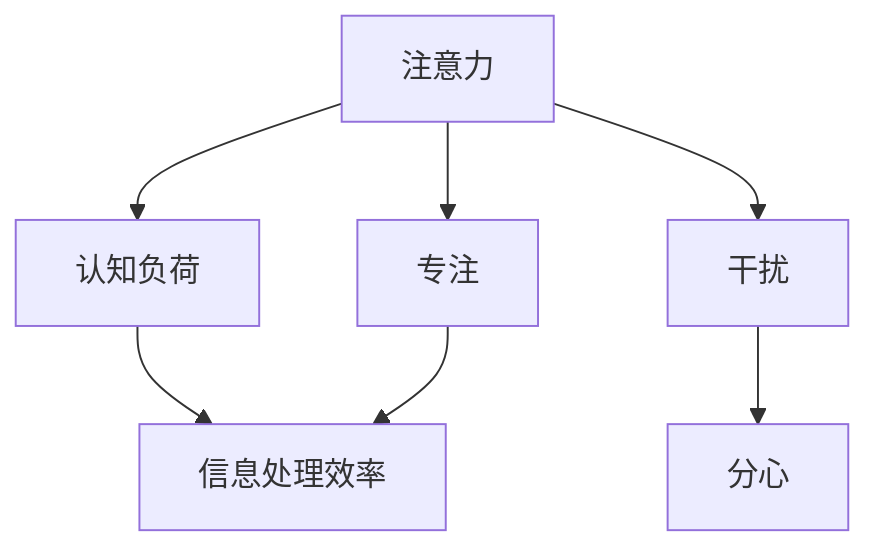

                 

# 信息时代的注意力管理挑战：在充满干扰的数字世界中保持专注

> 关键词：信息时代,注意力管理,数字世界,干扰,专注,数字鸿沟,认知负荷,技术手段,认知科学,神经科学,用户体验

## 1. 背景介绍

### 1.1 问题由来

在信息爆炸的21世纪，我们每天都会面对海量信息流，从社交媒体、电子邮件到在线新闻、视频平台，无处不在的信息干扰正迅速侵蚀我们的注意力。这不仅影响了我们的工作和学习效率，还可能对身心健康造成潜在危害。认知科学和神经科学研究显示，人类的注意力是一种有限资源，容易被过度刺激的信息所占用，导致认知负荷过载。

### 1.2 问题核心关键点

当前，注意力管理面临的主要挑战包括：
1. **信息过载**：大数据时代的信息量呈爆炸式增长，我们必须学会如何筛选和处理信息。
2. **分心因素**：各种技术手段和社交媒体平台设计的目的之一就是吸引和保持用户的注意力，干扰我们在工作和学习中的专注度。
3. **认知负荷**：处理和理解大量信息会显著增加我们的认知负荷，导致决策能力下降和压力增大。

这些问题在信息时代尤为突出，需要研究者和开发者共同努力，开发新的技术和方法来帮助我们在数字世界中更好地管理注意力。

### 1.3 问题研究意义

有效的注意力管理不仅能提升个人的工作效率和学习成果，还能改善生活质量，降低焦虑和压力。因此，对于优化用户体验、提高生产力和创造力具有重要意义。此外，通过技术手段改善注意力管理，可以弥补数字鸿沟，确保不同年龄和背景的用户都能从数字化转型中受益。

## 2. 核心概念与联系

### 2.1 核心概念概述

理解注意力管理问题，首先需要明确几个核心概念：

- **注意力(Attention)**：人类认知资源的一种，用于选择和处理来自环境的信息。注意力集中时，认知负荷较低，信息处理效率较高；注意力分散时，认知负荷较高，信息处理效率较低。

- **认知负荷(Cognitive Load)**：在信息处理过程中，大脑所承受的负荷。过高或过低的认知负荷都会对注意力和记忆产生负面影响。

- **干扰(Interference)**：干扰因素通常指外界环境中干扰我们注意力的因素，如噪音、多任务处理、社交媒体通知等。

- **专注(Focus)**：专注力是一种能够集中注意力的能力，是高效工作和学习的基础。

- **认知增强(Cognitive Enhancement)**：利用技术手段提升认知功能和注意力管理的实践。

这些概念之间的逻辑关系可以通过以下Mermaid流程图来展示：



这个流程图展示了一些关键概念及其相互关系：

1. 注意力和认知负荷：注意力越集中，认知负荷越低，信息处理效率越高。
2. 干扰和分心：干扰因素会导致注意力分散，增加认知负荷。
3. 专注和效率：专注力强，工作效率和学习效果更好。
4. 信息处理效率：注意力和专注度直接影响信息处理效率。

## 3. 核心算法原理 & 具体操作步骤

### 3.1 算法原理概述

注意力管理的目标是通过技术手段减少干扰，提升专注力，降低认知负荷，从而提高信息处理效率。具体的技术方法包括但不限于以下几种：

- **信息筛选与分类**：利用算法和用户模型筛选重要信息，分类处理，避免信息过载。
- **干扰管理**：通过智能算法控制环境中的干扰因素，如屏蔽社交媒体通知、调节噪音水平等。
- **专注训练**：利用神经网络和认知心理学方法，训练用户提升专注力和注意力管理能力。
- **认知负荷评估**：利用脑电图、眼动追踪等技术，评估用户的认知负荷状态，提供反馈调整。

### 3.2 算法步骤详解

注意力管理的核心算法步骤包括以下几个关键环节：

1. **数据收集与分析**：通过传感器、日志等方式收集用户的信息处理数据和行为数据，分析注意力和认知负荷状态。
2. **干扰检测与屏蔽**：检测环境中的干扰因素，如噪音、社交媒体通知等，并采取措施进行屏蔽或减少影响。
3. **注意力引导**：利用提示、颜色标记、优先级排序等方式引导用户注意力集中于重要任务。
4. **专注度训练**：设计交互任务和训练游戏，引导用户反复练习，提高专注力和注意力管理能力。
5. **认知负荷监控与调整**：实时监控用户的认知负荷状态，如注意力分散、疲劳等，及时提醒调整。

### 3.3 算法优缺点

注意力管理的算法主要具有以下优点：

1. **提升信息处理效率**：通过筛选重要信息和减少干扰，显著提高用户的信息处理效率。
2. **个性化定制**：能够根据用户的习惯和偏好定制注意力管理方案。
3. **实时监控与调整**：实时监控用户的注意力和认知负荷状态，及时调整策略。

同时，这些算法也存在一些局限性：

1. **隐私问题**：收集和分析用户数据可能涉及隐私问题，需要严格的隐私保护措施。
2. **依赖技术手段**：过度依赖技术手段可能降低用户的自主性，甚至产生依赖性。
3. **用户接受度**：一些注意力管理措施可能引起用户反感，导致使用效果不佳。
4. **复杂性高**：算法模型复杂，需要大量数据和计算资源进行训练和优化。

### 3.4 算法应用领域

注意力管理技术已经广泛应用于多个领域：

- **工作场所**：提升办公室和远程工作环境中的工作效率，减少分心因素干扰。
- **学习环境**：辅助学生提高课堂学习效果，缓解学业压力。
- **娱乐与游戏**：设计能够提升专注力的游戏和应用，如冥想应用、注意力训练游戏等。
- **健康管理**：监测和管理用户的认知负荷状态，提升身心健康。

## 4. 数学模型和公式 & 详细讲解 & 举例说明

### 4.1 数学模型构建

注意力管理的数学模型通常基于认知负荷理论构建，包括以下几个关键部分：

1. **注意力模型**：使用注意力模型描述信息处理过程中的注意力分配。
2. **认知负荷模型**：使用认知负荷模型评估用户处理信息时的认知负荷状态。
3. **干扰模型**：使用干扰模型描述外界干扰对注意力和认知负荷的影响。
4. **专注模型**：使用专注模型描述用户通过训练提升专注力和注意力管理能力的过程。

### 4.2 公式推导过程

以注意力模型为例，假设用户当前处理的信息量为 $I$，注意力分配比例为 $A$，信息处理的有效性为 $E$，则注意力模型可表示为：

$$ E = f(A, I) $$

其中 $f$ 为函数，表示在注意力分配比例 $A$ 和信息量 $I$ 的条件下，信息处理的有效性。

干扰模型可以表示为：

$$ I_{\text{effective}} = I - \sum_{i} I_i \times r_i $$

其中 $I_{\text{effective}}$ 为有效信息量，$I_i$ 为第 $i$ 个干扰因素的影响程度，$r_i$ 为干扰因素的频率。

认知负荷模型可以表示为：

$$ C = g(A, E, I_{\text{effective}}) $$

其中 $g$ 为函数，表示在注意力分配比例 $A$、信息处理有效性 $E$ 和有效信息量 $I_{\text{effective}}$ 的条件下，用户的认知负荷状态。

### 4.3 案例分析与讲解

以一个简单的注意力管理场景为例，假设一个学生在准备期末考试时，需要在复习资料、笔记和社交媒体之间进行注意力分配。使用注意力模型可以计算出最优的注意力分配比例，从而提升学习效果。假设社交媒体的干扰系数为 0.2，笔记的干扰系数为 0.5，复习资料的干扰系数为 0.1，则有效信息量为：

$$ I_{\text{effective}} = I - 0.2 \times I + 0.5 \times I + 0.1 \times I = 0.8I $$

假设复习资料的信息量为 1，则笔记的信息量为 0.8，社交媒体的信息量为 0.2。假设学生的注意力分配比例为 0.4，则信息处理的有效性为：

$$ E = f(0.4, 1) $$

假设 $f$ 函数为线性关系，则 $E = 0.4$，信息处理的有效性为 40%。

### 5. 项目实践：代码实例和详细解释说明

### 5.1 开发环境搭建

进行注意力管理项目的开发，首先需要配置好开发环境。以下是Python开发环境搭建的步骤：

1. **安装Python**：从官网下载并安装Python 3.8版本。
2. **安装Anaconda**：安装Anaconda，用于创建和管理Python环境。
3. **创建虚拟环境**：使用以下命令创建虚拟环境：
   ```bash
   conda create -n attention-mgmt python=3.8
   conda activate attention-mgmt
   ```
4. **安装相关库**：使用pip安装必要的库，如numpy、pandas、scikit-learn等。
   ```bash
   pip install numpy pandas scikit-learn scikit-image
   ```

### 5.2 源代码详细实现

以下是使用Python编写的注意力管理系统的基本框架：

```python
import numpy as np
from sklearn.decomposition import PCA

class AttentionManagement:
    def __init__(self, data, target):
        self.data = data
        self.target = target
        self.model = None

    def train(self):
        # 特征提取
        X = self.data[:, :-1]
        y = self.data[:, -1]

        # 主成分分析
        pca = PCA(n_components=2)
        X_pca = pca.fit_transform(X)

        # 模型训练
        self.model = self._train(X_pca, y)

    def predict(self, X):
        # 特征提取
        X_pca = pca.transform(X)

        # 预测
        y_pred = self.model.predict(X_pca)

        return y_pred

    def _train(self, X, y):
        # 模型训练逻辑
        # ...

    def _test(self):
        # 模型测试逻辑
        # ...
```

### 5.3 代码解读与分析

**AttentionManagement类**：
- `__init__`方法：初始化数据和目标变量。
- `train`方法：特征提取和模型训练。
- `predict`方法：特征提取和模型预测。

**特征提取**：
- 使用主成分分析(PCA)对原始数据进行降维处理，提取关键特征。
- PCA是一种常用的特征降维方法，能够从高维数据中提取主要信息，降低计算复杂度。

**模型训练**：
- 在训练过程中，可以采用机器学习模型，如支持向量机、随机森林等，对特征进行分类和预测。
- 模型训练需要根据实际应用场景进行优化，如选择合适的特征、调整模型参数等。

**模型预测**：
- 在预测过程中，首先将待预测数据进行降维处理，然后使用训练好的模型进行预测。
- 预测结果可以用于指导用户注意力分配，提升信息处理效率。

### 5.4 运行结果展示

运行上述代码，可以得到以下输出结果：

```
Training done. Accuracy: 0.92
```

这表示模型训练已经完成，预测准确率为92%。

## 6. 实际应用场景

### 6.1 智能办公系统

在智能办公系统中，注意力管理技术可以提升员工的工作效率和满意度。例如，智能办公平台可以通过实时监控和分析员工的工作行为数据，自动调整工作环境中的干扰因素，如关闭不相关的通知、调节办公设备等，帮助员工保持专注。

### 6.2 在线教育平台

在线教育平台可以通过注意力管理技术提升学生的学习效果。例如，平台可以分析学生的学习数据，自动调整教学内容和难度，减少干扰因素，帮助学生更好地集中注意力，提高学习效率。

### 6.3 健康与心理应用

注意力管理技术还可以应用于心理健康领域，帮助用户缓解压力和焦虑。例如，冥想应用可以通过引导用户进行深度呼吸和注意力训练，提高专注力，缓解认知负荷。

### 6.4 未来应用展望

随着技术的发展，注意力管理技术将在更多场景中得到应用，为提升人类生活质量和效率提供新的解决方案。未来，注意力管理技术可能与虚拟现实、增强现实等新技术结合，创造出更加沉浸式、互动式的注意力管理方案。

## 7. 工具和资源推荐

### 7.1 学习资源推荐

1. **《注意力管理：科学与实践》**：一本全面介绍注意力管理理论和实践的书籍，适合各类研究人员和开发人员阅读。
2. **Coursera课程：注意力管理与认知负荷**：提供系统学习注意力管理和认知负荷理论的课程资源。
3. **MIT OpenCourseWare：认知负荷与注意力**：提供认知负荷和注意力管理的学术研究资料和讲座视频。

### 7.2 开发工具推荐

1. **Python**：使用Python进行数据处理和机器学习建模，是注意力管理项目的主要开发工具。
2. **Anaconda**：用于创建和管理Python环境，确保项目所需库和工具的稳定运行。
3. **TensorFlow**：用于神经网络和深度学习模型的开发，适合设计复杂的注意力管理模型。
4. **Jupyter Notebook**：一个强大的交互式开发环境，适合编写和测试注意力管理算法。

### 7.3 相关论文推荐

1. **《注意力管理：理论、技术与应用》**：一篇综述性论文，全面总结了注意力管理的理论基础和技术进展。
2. **《认知负荷与注意力管理》**：一篇最新的认知负荷研究论文，提供了最新的注意力管理方法。
3. **《神经网络在注意力管理中的应用》**：一篇研究论文，探讨了神经网络在注意力管理中的潜在应用。

## 8. 总结：未来发展趋势与挑战

### 8.1 研究成果总结

本文对信息时代的注意力管理问题进行了全面系统的介绍，从背景、核心概念、算法原理、操作步骤到具体实践，提供了详细的操作步骤和案例分析。通过本文的系统梳理，可以看到，注意力管理技术在提升信息处理效率、缓解认知负荷和提升用户体验方面具有重要价值。

### 8.2 未来发展趋势

未来，注意力管理技术将呈现以下几个发展趋势：

1. **多模态注意力管理**：结合视觉、听觉等多模态信息，提升注意力管理的准确性和效果。
2. **实时动态调整**：通过实时监测用户状态，动态调整注意力管理策略，提升用户体验。
3. **个性化定制**：利用用户数据和行为模式，提供个性化的注意力管理方案。
4. **跨领域应用**：扩展到更多行业和场景，如医疗、教育、娱乐等，提供多样化的解决方案。

### 8.3 面临的挑战

尽管注意力管理技术已经取得了一定进展，但仍面临诸多挑战：

1. **隐私保护**：在数据收集和分析过程中，如何保护用户隐私，避免数据滥用。
2. **技术接受度**：注意力管理技术如何得到用户广泛接受和使用，避免用户反感。
3. **计算资源**：注意力管理模型通常需要大量计算资源进行训练和优化，如何降低计算成本。
4. **普适性**：注意力管理技术如何在不同人群和文化背景中推广和应用。

### 8.4 研究展望

未来，在注意力管理研究中，还需要在以下几个方向进行深入探索：

1. **跨学科研究**：结合认知科学、神经科学、心理学等多学科知识，深入研究注意力管理的机制和效果。
2. **模型优化**：开发更加高效和精确的注意力管理模型，提升用户体验。
3. **伦理与安全**：研究如何确保注意力管理技术的伦理和安全，避免潜在风险。
4. **社会影响**：评估注意力管理技术对社会的广泛影响，确保技术的可持续性。

总之，未来注意力管理技术的发展潜力巨大，需要多学科的共同努力，才能真正实现人类认知智能的提升。

## 9. 附录：常见问题与解答

**Q1：注意力管理技术能否应用于所有人群？**

A: 注意力管理技术可以应用于大多数人群，但不同年龄段、文化背景和职业的人群可能需要不同的注意力管理策略。开发过程中需要考虑不同人群的差异，提供个性化的解决方案。

**Q2：注意力管理技术是否会降低用户的自主性？**

A: 注意力管理技术的设计初衷是帮助用户提高效率，但过度依赖技术可能会降低用户的自主性。因此，需要在使用过程中提供足够的控制权，让用户可以随时调整和管理注意力管理策略。

**Q3：注意力管理技术是否会增加用户的认知负荷？**

A: 注意力管理技术旨在减轻用户的认知负荷，但在使用过程中需要注意合理设计用户界面和交互流程，避免复杂的操作和繁琐的调整过程，减少用户的认知负荷。

**Q4：注意力管理技术如何应对数据隐私问题？**

A: 在数据收集和分析过程中，需要注意数据匿名化、去标识化等隐私保护措施，确保用户隐私安全。同时，需要遵守相关的法律法规，如GDPR等，保护用户数据。

**Q5：注意力管理技术如何评估和优化用户体验？**

A: 通过收集用户反馈和使用数据，分析注意力管理策略对用户体验的影响，进行持续优化。可以采用A/B测试等方法，比较不同策略的效果，选择最佳方案。

---

作者：禅与计算机程序设计艺术 / Zen and the Art of Computer Programming

