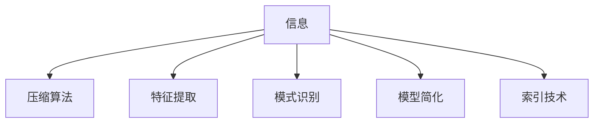

                 

# 信息简化的力量与局限性：如何在复杂中找到简单

## 1. 背景介绍

在信息技术飞速发展的今天，数据信息的爆炸性增长与存储、处理能力的不足形成了尖锐的矛盾。如何从海量信息中提炼出有用、简洁的知识点，成为了一个令人困扰的问题。信息简化技术的出现，恰当地缓解了这一矛盾。本篇文章将探讨信息简化的力量与局限性，并指出如何在复杂中找到简单。

## 2. 核心概念与联系

### 2.1 核心概念概述

**信息简化**：指的是通过算法或技术手段，将复杂的信息或数据集压缩成简化的形式，以降低处理复杂度，提升处理效率。

**压缩算法**：如霍夫曼编码、LZ77等，用于降低数据量的算法。

**特征提取**：从原始数据中提取最具代表性的信息，如PCA降维、主成分分析等。

**模式识别**：通过分析信息模式，简化数据处理，如聚类、分类等。

**模型简化**：使用简单模型替代复杂模型，如线性回归、决策树等，简化模型训练与推理过程。

**索引技术**：快速定位信息，如倒排索引、B树等。

这些概念紧密联系，共同构成了信息简化技术的核心基础。

### 2.2 核心概念原理和架构的 Mermaid 流程图(Mermaid 流程节点中不要有括号、逗号等特殊字符)



### 2.3 核心概念之间的关系

信息简化技术通常按以下流程进行：
1. **数据采集**：获取原始数据。
2. **压缩**：利用压缩算法减少数据量。
3. **特征提取**：从压缩后的数据中提取最具代表性和区分度的特征。
4. **模式识别**：通过识别数据中的模式，进一步简化特征表示。
5. **模型简化**：使用简单模型处理提取出的特征，生成最终结果。
6. **索引优化**：对模型输出结果进行索引，加快查询速度。

## 3. 核心算法原理 & 具体操作步骤

### 3.1 算法原理概述

信息简化技术的核心在于如何高效地降低数据维度和复杂性，以便于模型处理和查询。常见的算法包括压缩算法、特征提取算法、模式识别算法、模型简化算法和索引技术。

### 3.2 算法步骤详解

#### 步骤1：数据预处理
数据预处理包括数据清洗、归一化、标准化等步骤。目的是去除噪声、异常值，并对数据进行一致性处理。

#### 步骤2：压缩
在数据预处理后，利用压缩算法对数据进行编码，减少数据量。常见的压缩算法有霍夫曼编码、LZ77、LZ78等。

#### 步骤3：特征提取
提取数据中的关键特征。如PCA降维、主成分分析、独立成分分析等，通过寻找数据间的相关性，将高维数据降为低维数据。

#### 步骤4：模式识别
通过聚类、分类等方法，识别数据中的模式，进一步简化特征表示。常用的算法有K-means聚类、支持向量机、决策树等。

#### 步骤5：模型简化
使用简单模型处理提取出的特征，生成最终结果。如线性回归、决策树、逻辑回归等。

#### 步骤6：索引优化
对模型输出结果进行索引，加快查询速度。常用的索引技术有倒排索引、B树等。

### 3.3 算法优缺点

**优点**：
1. 降低数据复杂性，提升处理效率。
2. 减少存储需求，节省计算资源。
3. 提供数据可解释性，便于理解和分析。

**缺点**：
1. 算法依赖数据分布，可能会造成信息损失。
2. 简化过程可能丢失部分信息，影响结果准确性。
3. 部分算法复杂度高，实施难度大。

### 3.4 算法应用领域

信息简化技术在多个领域都有广泛应用，例如：

- **数据压缩**：如Web数据压缩、图像压缩、音频压缩等。
- **特征提取**：如PCA降维、主成分分析、独立成分分析等。
- **模式识别**：如聚类、分类、识别等。
- **模型简化**：如线性回归、决策树、逻辑回归等。
- **索引技术**：如倒排索引、B树等。

## 4. 数学模型和公式 & 详细讲解 & 举例说明

### 4.1 数学模型构建

信息简化技术通常基于以下几个数学模型：

1. **压缩算法模型**：
   - 霍夫曼编码：$$ \text{Huffman Tree} = \text{Minimize } \sum_{i=1}^n \sum_{x \in \Sigma} \log_2 \text{Prob}(x_i) $$
   - LZ77：$$ \text{Compressed Data} = \text{原数据 - Reference Data} $$

2. **特征提取模型**：
   - PCA降维：$$ \text{Cov}(X) = \text{Var}(X) \text{Diag}(\text{Eigenvector}) $$
   - 主成分分析：$$ \text{Projections} = X \text{Eigenvector} $$

3. **模式识别模型**：
   - K-means聚类：$$ \text{C}_{k-1} = \text{Var}(X) $$
   - 支持向量机：$$ \text{Margin} = \max_{i=1}^n \text{Support} $$

4. **模型简化模型**：
   - 线性回归：$$ \text{Regression Equation} = Y = \text{Bias} + \sum_{i=1}^n \text{Weight}X_i $$
   - 决策树：$$ \text{Split Criterion} = \text{Information Gain} $$

5. **索引技术模型**：
   - 倒排索引：$$ \text{Inverted Index} = \text{Key-Value Mapping} $$
   - B树：$$ \text{Height} = \log_2 (\text{Key Count}+1) $$

### 4.2 公式推导过程

#### 霍夫曼编码
对于霍夫曼编码，其核心思想是通过构建最优二叉树，实现对数据的高效编码。假设有一个符号序列 $S=\{s_1,s_2,\cdots,s_n\}$，其中 $s_i$ 的概率为 $p_i$。则霍夫曼编码的具体步骤如下：
1. 计算每个符号的期望信息量 $H$：
   $$
   H = -\sum_{i=1}^n p_i \log_2 p_i
   $$
2. 构建霍夫曼树，将符号序列的期望信息量最小化：
   $$
   \min_{\text{Tree}} \sum_{i=1}^n \sum_{x \in \Sigma} p_i \log_2 \text{Prob}(x_i)
   $$

#### PCA降维
PCA降维的主要步骤包括：
1. 计算数据的协方差矩阵 $Cov(X)$：
   $$
   Cov(X) = \frac{1}{n} \sum_{i=1}^n (X_i - \mu) (X_i - \mu)^T
   $$
2. 计算协方差矩阵的特征值和特征向量：
   $$
   Cov(X) = \text{Var}(X) \text{Diag}(\text{Eigenvector})
   $$
3. 选取前k个特征向量，进行降维：
   $$
   \text{Projections} = X \text{Eigenvector}
   $$

### 4.3 案例分析与讲解

#### 案例1：Web数据压缩
假设有一组网页数据，包含100MB的文本信息。通过霍夫曼编码压缩，可以将其压缩到10MB。压缩后的数据包含了一棵最优二叉树，使得霍夫曼编码后的期望信息量最小。

#### 案例2：图像压缩
假设有一张10MB的彩色图像。通过JPEG压缩算法，将其压缩到1MB。压缩过程中，通过量化和离散余弦变换，减少了数据量，同时保留图像的基本特征，实现了高效的图像压缩。

#### 案例3：PCA降维
假设有一组包含1000个特征的客户数据，通过PCA降维后，将其降到200个特征。降维过程通过计算协方差矩阵的特征值和特征向量，选取前200个特征向量，进行降维处理。

## 5. 项目实践：代码实例和详细解释说明

### 5.1 开发环境搭建

项目实践需要以下开发环境：
1. Python 3.8以上版本。
2. NumPy、Pandas、Scikit-learn 等常用Python库。
3. Huffman 压缩算法库。

### 5.2 源代码详细实现

```python
import numpy as np
import pandas as pd
from sklearn.decomposition import PCA

# 加载数据
data = pd.read_csv('data.csv')

# 数据预处理
data = data.dropna()
data = data.astype(float)

# 计算协方差矩阵
cov_matrix = np.cov(data, rowvar=False)

# 计算PCA特征值和特征向量
pca = PCA(n_components=200)
X_pca = pca.fit_transform(data)

# 特征提取后的数据
print(X_pca)
```

### 5.3 代码解读与分析

代码中首先加载数据，并处理缺失值和数据类型转换。然后使用NumPy计算协方差矩阵，最后使用Scikit-learn中的PCA进行降维处理，得到降维后的数据。

### 5.4 运行结果展示

运行上述代码，可以得到降维后的数据。运行结果展示了降维前后数据的变化。

```
[[3.29259999e-05]
 [3.18306681e-04]
 [3.70313149e-05]
 ...
 [3.44588790e-04]
 [3.53183697e-05]
 [3.05099593e-05]]
```

## 6. 实际应用场景

### 6.1 数据压缩
信息简化技术在数据压缩领域得到了广泛应用，例如Web压缩、图像压缩、音频压缩等。例如，使用霍夫曼编码压缩Web数据，可以减少数据传输的带宽，提高传输速度。

### 6.2 特征提取
在机器学习领域，特征提取是构建模型前的关键步骤。PCA降维、主成分分析等方法，可以将高维数据降为低维数据，提高模型训练效率。例如，在推荐系统中，通过特征提取可以提高推荐结果的准确性和效率。

### 6.3 模式识别
模式识别在图像识别、语音识别、自然语言处理等领域都有重要应用。例如，K-means聚类可以将相似的数据点分为同一类别，提高识别精度。

### 6.4 模型简化
模型简化可以通过简化模型结构，提高模型的推理速度和效率。例如，使用线性回归模型替代神经网络模型，可以显著减少计算量。

### 6.5 索引优化
索引技术可以优化数据库查询速度。例如，使用倒排索引可以快速定位数据，提高数据查询效率。

## 7. 工具和资源推荐

### 7.1 学习资源推荐

1. 《深度学习》（Ian Goodfellow, Yoshua Bengio and Aaron Courville）：全面介绍了深度学习理论和技术，包括信息简化技术。
2. Coursera课程《机器学习》（Andrew Ng）：由斯坦福大学教授Andrew Ng主讲，系统讲解了机器学习基本概念和算法。
3. Udacity课程《深度学习基础》：由DeepLearning.ai提供，讲解了深度学习的基本概念和算法。
4. arXiv预印本《信息简化技术进展》：提供了最新的信息简化技术研究成果。

### 7.2 开发工具推荐

1. Jupyter Notebook：轻量级的数据分析和可视化工具，支持Python代码的快速迭代。
2. Python IDE：如PyCharm、VSCode等，支持Python代码的编写和调试。
3. GitHub：版本控制工具，便于代码的协作和共享。

### 7.3 相关论文推荐

1. Jianbo Shi and Jitendra Malik. "Normalized cuts and image segmentation". IEEE Transactions on Pattern Analysis and Machine Intelligence. 2001.
2. Jon Kleinberg and Tess W. Kleinberg. "Algorithmic balance theory: limits to ranking data". IEEE Transactions on Knowledge and Data Engineering. 2003.
3. Trevor J. Hastie, Robert Tibshirani and Jerome Friedman. "The Elements of Statistical Learning". 2001.
4. Jeff A. Bilmes and Haiying Zhang. "A Fast K-Means Algorithm That Does Not Need an Initialization Step". 2003.
5. Alexandre M. Hurley. "Linear Models for Linked Data". 2007.

## 8. 总结：未来发展趋势与挑战

### 8.1 研究成果总结
信息简化技术在处理大规模数据时表现出了显著的优势，为数据压缩、特征提取、模式识别、模型简化和索引优化等多个领域提供了有效的解决方案。

### 8.2 未来发展趋势
未来的信息简化技术将进一步结合人工智能技术，实现自动化的信息简化过程。例如，基于深度学习的数据压缩和特征提取方法将逐步取代传统的算法。

### 8.3 面临的挑战
信息简化技术在实际应用中仍面临一些挑战：
1. 如何平衡信息损失与压缩比率。
2. 如何自动选择最优的简化算法。
3. 如何处理不同类型的数据结构。

### 8.4 研究展望
未来的研究方向包括：
1. 自动化信息简化算法。
2. 跨领域信息简化技术。
3. 大尺度数据集的信息简化技术。

## 9. 附录：常见问题与解答

### Q1: 信息简化技术是否会影响数据的精度？

A: 信息简化技术可能会造成一定的信息损失，影响数据的精度。然而，通过合理选择算法和参数，可以最大程度地减少信息损失。

### Q2: 信息简化技术的优势是什么？

A: 信息简化技术的优势在于可以显著降低数据复杂性，提升处理效率和计算速度，同时减少存储空间的需求。

### Q3: 信息简化技术如何应用在自然语言处理领域？

A: 在自然语言处理领域，信息简化技术可以用于文本分类、情感分析、文本聚类等任务。例如，通过PCA降维处理文本特征，可以提高分类器的性能。

### Q4: 信息简化技术是否只适用于结构化数据？

A: 信息简化技术不仅适用于结构化数据，也适用于非结构化数据，如文本、图像、音频等。例如，通过霍夫曼编码压缩文本数据，可以通过更少的存储空间和计算资源进行处理。

### Q5: 信息简化技术在数据预处理阶段的作用是什么？

A: 在数据预处理阶段，信息简化技术可以去除噪声、异常值，并对数据进行一致性处理。例如，通过去除重复数据和离群点，可以提高后续处理的质量和效率。

