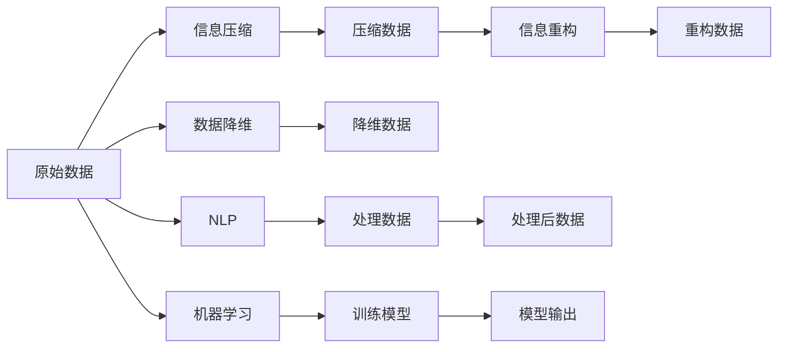

                 

# 信息简化的原则与艺术：在混乱中建立秩序与简化

在当今信息爆炸的时代，数据和信息的量已经达到了前所未有的规模。这种信息的泛滥虽然为知识获取提供了丰富的资源，但也给用户的信息检索、知识理解和数据处理带来了巨大的挑战。如何在海量信息中快速获取有用的知识，提高信息处理效率，成为信息科技领域的重要研究课题。本文将深入探讨信息简化的原则与艺术，揭示在混乱中建立秩序与简化的关键技术，并为未来信息处理的发展趋势提供展望。

## 1. 背景介绍

### 1.1 问题由来

信息技术的快速发展，尤其是互联网的普及，使得人类进入了一个信息爆炸的时代。在数以亿计的数据中，如何提取有用信息、提炼关键知识成为了一个急需解决的难题。各种搜索引擎、推荐系统、信息筛选工具应运而生，但效果往往不尽人意。这主要是因为传统的信息处理方法忽略了信息本身的复杂性和多样性，导致处理过程繁琐冗长，效率低下。因此，信息简化作为解决这一问题的重要方法，正在逐渐受到越来越多的关注。

### 1.2 问题核心关键点

信息简化的核心在于通过算法和模型对原始数据进行压缩和重构，以更高效、更准确的方式呈现信息。这需要处理两个核心问题：

- **信息压缩**：即在尽可能保留信息原貌的前提下，尽可能减少信息的冗余，以压缩算法和模型为手段。
- **信息重构**：即利用先验知识、用户需求等对压缩后的信息进行重构，恢复其完整性和实用性，以使其更符合用户的使用习惯和需求。

这两个核心问题相辅相成，共同构成信息简化的技术框架。下面将逐一探讨这两个核心问题。

## 2. 核心概念与联系

### 2.1 核心概念概述

1. **信息压缩**：指对原始信息进行压缩处理，减少其存储空间和传输带宽。常见的信息压缩算法包括哈夫曼编码、算术编码、LZW算法等。

2. **信息重构**：指对压缩后的信息进行重构，恢复其完整性。信息重构的目的是为了恢复信息的真实性和可读性，常见的信息重构算法包括差分脉冲编码、离散余弦变换等。

3. **数据降维**：指将高维数据转换为低维数据，减少计算复杂度和存储需求。常见的降维算法包括主成分分析(PCA)、线性判别分析(LDA)、非负矩阵分解(NMF)等。

4. **自然语言处理(NLP)**：指利用计算机技术处理自然语言，使其可以被机器理解并转化为有用的信息。常见的NLP技术包括词嵌入、语言模型、序列标注、信息抽取等。

5. **机器学习与深度学习**：通过学习数据的特征和模式，实现信息的自动化处理和简化。常见的算法包括决策树、支持向量机、神经网络等。

### 2.2 核心概念原理和架构的 Mermaid 流程图

这个流程图展示了从原始数据到压缩数据，再到重构数据，以及降维和NLP处理的全过程。每个环节通过不同的技术手段，实现对信息的简化和重构。

## 3. 核心算法原理 & 具体操作步骤

### 3.1 算法原理概述

信息简化的核心算法原理主要包括信息压缩算法、信息重构算法、数据降维算法和NLP技术。这些算法和技术共同构成了一个完整的简化系统，对原始数据进行处理，以提供更高效、更准确的信息。

### 3.2 算法步骤详解

#### 3.2.1 信息压缩算法

信息压缩算法的关键在于找到一种能够高效压缩信息的方法。常见的信息压缩算法包括：

- **哈夫曼编码**：通过构建一棵哈夫曼树，将原始数据编码为二进制编码，从而实现数据压缩。哈夫曼编码的核心在于构建最优的二叉树，使得编码后的数据具有更低的熵值。

- **算术编码**：将原始数据映射到[0, 1)区间内的一个子区间上，通过符号序列的频率进行编码。算术编码的优点在于能够实现更高的压缩比，但计算复杂度较高。

- **LZW算法**：基于字典的压缩算法，通过构建和维护一个动态字典，将重复出现的子串用一个更短的编码替换。LZW算法的优点在于简单易实现，适用于文本数据压缩。

#### 3.2.2 信息重构算法

信息重构算法主要应用于压缩后的数据，通过先验知识或用户需求对数据进行重构，恢复其完整性。常见的信息重构算法包括：

- **差分脉冲编码**：通过对原始信号进行差分编码，然后利用先验知识对差分值进行解码，恢复原始信号。

- **离散余弦变换(DCT)**：通过将原始数据转换为频域表示，然后根据先验知识进行反变换，恢复原始数据。DCT的优点在于能够去除冗余信息，实现高效的压缩和重构。

#### 3.2.3 数据降维算法

数据降维算法主要应用于高维数据的处理，通过将高维数据转换为低维数据，减少计算复杂度和存储需求。常见的降维算法包括：

- **主成分分析(PCA)**：通过线性变换将高维数据转换为低维数据，保留数据的最大方差，去除冗余信息。PCA的核心在于求解特征值和特征向量，找到数据的主成分。

- **线性判别分析(LDA)**：通过线性变换将高维数据转换为低维数据，同时保留数据的类间距离，去除冗余信息。LDA的核心在于求解判别矩阵和投影向量，实现数据的降维和分类。

- **非负矩阵分解(NMF)**：通过非负矩阵分解将高维数据转换为低维数据，保留数据的非负性和稀疏性，去除冗余信息。NMF的核心在于求解非负矩阵分解模型，实现数据的分解和重构。

#### 3.2.4 NLP技术

NLP技术主要应用于文本数据的处理，通过将自然语言转化为机器可以理解的形式，实现信息的自动化处理和简化。常见的NLP技术包括：

- **词嵌入**：通过将单词映射到低维向量空间，实现单词的向量化表示，方便机器进行理解和学习。常见的词嵌入算法包括Word2Vec、GloVe、FastText等。

- **语言模型**：通过构建语言模型，利用先验知识预测下一个单词或字符，实现对文本数据的理解和学习。常见的语言模型包括n-gram模型、神经网络语言模型等。

- **序列标注**：通过将文本数据转化为序列标注形式，实现对文本的标注和分类，方便机器进行理解和处理。常见的序列标注算法包括CRF、BiLSTM-CRF等。

- **信息抽取**：通过从文本数据中抽取关键信息，如实体、关系、事件等，实现对文本的深入理解和分析。常见的信息抽取算法包括规则抽取、深度学习抽取等。

### 3.3 算法优缺点

#### 3.3.1 信息压缩算法

- **优点**：
  - 能够显著减少数据的存储空间和传输带宽，提高数据处理的效率。
  - 压缩算法通常具有较好的通用性，适用于各种类型的数据。
  - 压缩算法的实现较为简单，计算复杂度较低。

- **缺点**：
  - 压缩算法的压缩比和恢复效果取决于原始数据的特点，可能存在损失信息的情况。
  - 压缩算法的计算复杂度可能较高，影响处理效率。
  - 压缩算法通常只能处理有序的数据，难以应用于不规则数据。

#### 3.3.2 信息重构算法

- **优点**：
  - 能够恢复压缩数据的完整性和真实性，保证数据的可用性。
  - 重构算法的实现较为简单，计算复杂度较低。
  - 重构算法通常具有较好的通用性，适用于各种类型的数据。

- **缺点**：
  - 重构算法的恢复效果依赖于先验知识或用户需求，可能存在一定的偏差。
  - 重构算法的计算复杂度可能较高，影响处理效率。
  - 重构算法通常只能处理有序的数据，难以应用于不规则数据。

#### 3.3.3 数据降维算法

- **优点**：
  - 能够显著减少数据的计算复杂度和存储需求，提高数据处理的效率。
  - 降维算法的实现较为简单，计算复杂度较低。
  - 降维算法通常具有较好的通用性，适用于各种类型的数据。

- **缺点**：
  - 降维算法的降维效果取决于原始数据的特点，可能存在信息丢失的情况。
  - 降维算法的计算复杂度可能较高，影响处理效率。
  - 降维算法通常只能处理有序的数据，难以应用于不规则数据。

#### 3.3.4 NLP技术

- **优点**：
  - 能够实现对自然语言数据的自动化处理和理解，提高信息处理效率。
  - NLP技术具有较好的通用性和可扩展性，适用于各种类型的文本数据。
  - NLP技术的实现较为简单，计算复杂度较低。

- **缺点**：
  - NLP技术依赖于大量的语料库和先验知识，需要较高的数据和计算资源。
  - NLP技术的实现较为复杂，计算复杂度较高。
  - NLP技术通常只能处理文本数据，难以应用于其他类型的数据。

### 3.4 算法应用领域

信息简化技术已经在多个领域得到了广泛应用，涵盖了从文本处理到数据压缩的各个方面。具体来说，信息简化技术的应用领域包括：

- **文本数据压缩**：如PDF文件压缩、图片描述压缩等，通过压缩算法对文本数据进行压缩和重构，实现数据的存储和传输。

- **图像数据压缩**：如JPEG、PNG压缩，通过压缩算法对图像数据进行压缩和重构，实现图像的存储和传输。

- **视频数据压缩**：如H.264、MPEG-4压缩，通过压缩算法对视频数据进行压缩和重构，实现视频的存储和传输。

- **音频数据压缩**：如MP3、AAC压缩，通过压缩算法对音频数据进行压缩和重构，实现音频的存储和传输。

- **自然语言处理**：如文本摘要、问答系统、情感分析等，通过NLP技术对自然语言数据进行处理和分析，实现信息的自动化处理和简化。

- **数据降维**：如PCA、LDA、NMF降维，通过对高维数据进行降维处理，减少计算复杂度和存储需求，实现数据的可视化分析和特征提取。

## 4. 数学模型和公式 & 详细讲解 & 举例说明

### 4.1 数学模型构建

#### 4.1.1 信息压缩模型

假设原始数据为 $X$，压缩后的数据为 $Y$。信息压缩模型的目标是找到一个压缩算法 $f$，使得 $Y = f(X)$，同时满足一定的压缩比和重构效果。

- **哈夫曼编码**：设原始数据为 $X = \{x_1, x_2, \ldots, x_n\}$，其中 $x_i$ 表示第 $i$ 个数据项。哈夫曼编码的核心在于构建一棵哈夫曼树，将 $X$ 编码为 $Y$。假设哈夫曼树的根节点编码为 $0$，左子树编码为 $0$，右子树编码为 $1$，则哈夫曼编码的压缩过程可以表示为：

$$
Y = \{c_1, c_2, \ldots, c_m\}
$$

其中 $c_i$ 表示第 $i$ 个编码，$m$ 表示编码后的数据项数量。

- **算术编码**：设原始数据为 $X = \{x_1, x_2, \ldots, x_n\}$，其中 $x_i$ 表示第 $i$ 个数据项。算术编码的核心在于将 $X$ 映射到 $[0, 1)$ 区间内的一个子区间上，表示为 $[0, c_1 \times \frac{1}{m_1} + c_2 \times \frac{1}{m_1 \times m_2} + \ldots + c_k \times \frac{1}{m_1 \times m_2 \times \ldots \times m_k})$，其中 $c_i$ 表示第 $i$ 个符号，$m_1, m_2, \ldots, m_k$ 表示符号的频率。算术编码的压缩过程可以表示为：

$$
Y = [0, c_1 \times \frac{1}{m_1} + c_2 \times \frac{1}{m_1 \times m_2} + \ldots + c_k \times \frac{1}{m_1 \times m_2 \times \ldots \times m_k})
$$

- **LZW算法**：设原始数据为 $X = \{x_1, x_2, \ldots, x_n\}$，其中 $x_i$ 表示第 $i$ 个数据项。LZW算法通过构建和维护一个动态字典，将重复出现的子串用一个更短的编码替换。假设字典的大小为 $D$，则LZW算法的压缩过程可以表示为：

$$
Y = \{d_1, d_2, \ldots, d_m\}
$$

其中 $d_i$ 表示第 $i$ 个编码，$m$ 表示编码后的数据项数量。

#### 4.1.2 信息重构模型

假设压缩后的数据为 $Y$，重构后的数据为 $X'$。信息重构模型的目标是找到一个重构算法 $g$，使得 $X' = g(Y)$，同时满足一定的重构效果。

- **差分脉冲编码**：假设原始数据为 $X = \{x_1, x_2, \ldots, x_n\}$，其中 $x_i$ 表示第 $i$ 个数据项。差分脉冲编码的核心在于通过差分编码对原始数据进行处理，然后利用先验知识对差分值进行解码，恢复原始数据。假设差分编码后的数据为 $Y' = \{y_1', y_2', \ldots, y_m'\}$，其中 $y_i'$ 表示第 $i$ 个差分值，$m$ 表示差分值的数量。差分脉冲编码的重构过程可以表示为：

$$
X' = \{x_1', x_2', \ldots, x_n'\}
$$

其中 $x_i'$ 表示第 $i$ 个重构值，可以通过先验知识对差分值 $y_i'$ 进行解码，恢复原始数据。

- **离散余弦变换(DCT)**：假设原始数据为 $X = \{x_1, x_2, \ldots, x_n\}$，其中 $x_i$ 表示第 $i$ 个数据项。DCT的核心在于将原始数据转换为频域表示，然后根据先验知识进行反变换，恢复原始数据。假设频域表示为 $Y = \{y_1, y_2, \ldots, y_m\}$，其中 $y_i$ 表示第 $i$ 个频域系数，$m$ 表示频域系数的大小。DCT的重构过程可以表示为：

$$
X' = \{x_1', x_2', \ldots, x_n'\}
$$

其中 $x_i'$ 表示第 $i$ 个重构值，可以通过先验知识对频域系数 $y_i$ 进行反变换，恢复原始数据。

#### 4.1.3 数据降维模型

假设高维数据为 $X \in \mathbb{R}^d$，降维后的数据为 $X' \in \mathbb{R}^k$，其中 $d$ 表示原始数据的维度，$k$ 表示降维后的维度。数据降维模型的目标是找到一个降维算法 $h$，使得 $X' = h(X)$，同时满足一定的降维效果。

- **主成分分析(PCA)**：假设高维数据为 $X \in \mathbb{R}^d$，其中 $x_i$ 表示第 $i$ 个数据项。PCA的核心在于通过线性变换将高维数据转换为低维数据，保留数据的最大方差。假设降维后的数据为 $X' = \{x_1', x_2', \ldots, x_k'\}$，其中 $x_i'$ 表示第 $i$ 个降维值，$k$ 表示降维后的维度。PCA的降维过程可以表示为：

$$
X' = \{x_1', x_2', \ldots, x_k'\}
$$

其中 $x_i'$ 表示第 $i$ 个降维值，可以通过求解特征值和特征向量，找到数据的主成分，实现数据的降维。

- **线性判别分析(LDA)**：假设高维数据为 $X \in \mathbb{R}^d$，其中 $x_i$ 表示第 $i$ 个数据项。LDA的核心在于通过线性变换将高维数据转换为低维数据，同时保留数据的类间距离。假设降维后的数据为 $X' = \{x_1', x_2', \ldots, x_k'\}$，其中 $x_i'$ 表示第 $i$ 个降维值，$k$ 表示降维后的维度。LDA的降维过程可以表示为：

$$
X' = \{x_1', x_2', \ldots, x_k'\}
$$

其中 $x_i'$ 表示第 $i$ 个降维值，可以通过求解判别矩阵和投影向量，实现数据的降维和分类。

- **非负矩阵分解(NMF)**：假设高维数据为 $X \in \mathbb{R}^d$，其中 $x_i$ 表示第 $i$ 个数据项。NMF的核心在于通过非负矩阵分解将高维数据转换为低维数据，保留数据的非负性和稀疏性。假设降维后的数据为 $X' = \{x_1', x_2', \ldots, x_k'\}$，其中 $x_i'$ 表示第 $i$ 个降维值，$k$ 表示降维后的维度。NMF的降维过程可以表示为：

$$
X' = \{x_1', x_2', \ldots, x_k'\}
$$

其中 $x_i'$ 表示第 $i$ 个降维值，可以通过求解非负矩阵分解模型，实现数据的分解和重构。

#### 4.1.4 NLP模型

假设自然语言数据为 $X$，处理后的数据为 $X'$。NLP模型的目标是找到一种能够实现信息自动化的处理和简化的算法，使得 $X' = g(X)$，同时满足一定的处理效果。

- **词嵌入**：假设自然语言数据为 $X$，其中 $x_i$ 表示第 $i$ 个单词。词嵌入的核心在于将单词映射到低维向量空间，实现单词的向量化表示。假设处理后的数据为 $X' = \{x_1', x_2', \ldots, x_n'\}$，其中 $x_i'$ 表示第 $i$ 个向量表示，$m$ 表示向量表示的数量。词嵌入的表示过程可以表示为：

$$
X' = \{x_1', x_2', \ldots, x_n'\}
$$

其中 $x_i'$ 表示第 $i$ 个向量表示，可以通过求解词嵌入模型，实现单词的向量化表示。

- **语言模型**：假设自然语言数据为 $X$，其中 $x_i$ 表示第 $i$ 个句子。语言模型的核心在于构建语言模型，利用先验知识预测下一个单词或字符，实现对文本数据的理解和学习。假设处理后的数据为 $X' = \{x_1', x_2', \ldots, x_n'\}$，其中 $x_i'$ 表示第 $i$ 个处理后的句子，$m$ 表示处理后的句子数量。语言模型的预测过程可以表示为：

$$
X' = \{x_1', x_2', \ldots, x_n'\}
$$

其中 $x_i'$ 表示第 $i$ 个处理后的句子，可以通过构建语言模型，实现对文本数据的理解和学习。

- **序列标注**：假设自然语言数据为 $X$，其中 $x_i$ 表示第 $i$ 个句子。序列标注的核心在于将文本数据转化为序列标注形式，实现对文本的标注和分类。假设处理后的数据为 $X' = \{x_1', x_2', \ldots, x_n'\}$，其中 $x_i'$ 表示第 $i$ 个标注后的句子，$m$ 表示标注后的句子数量。序列标注的标注过程可以表示为：

$$
X' = \{x_1', x_2', \ldots, x_n'\}
$$

其中 $x_i'$ 表示第 $i$ 个标注后的句子，可以通过求解序列标注模型，实现对文本的标注和分类。

- **信息抽取**：假设自然语言数据为 $X$，其中 $x_i$ 表示第 $i$ 个句子。信息抽取的核心在于从文本数据中抽取关键信息，如实体、关系、事件等，实现对文本的深入理解和分析。假设处理后的数据为 $X' = \{x_1', x_2', \ldots, x_n'\}$，其中 $x_i'$ 表示第 $i$ 个处理后的句子，$m$ 表示处理后的句子数量。信息抽取的抽取过程可以表示为：

$$
X' = \{x_1', x_2', \ldots, x_n'\}
$$

其中 $x_i'$ 表示第 $i$ 个处理后的句子，可以通过求解信息抽取模型，实现对文本的深入理解和分析。

### 4.2 公式推导过程

#### 4.2.1 哈夫曼编码

哈夫曼编码的核心在于构建一棵哈夫曼树，将原始数据编码为二进制编码。设原始数据为 $X = \{x_1, x_2, \ldots, x_n\}$，其中 $x_i$ 表示第 $i$ 个数据项。哈夫曼编码的压缩过程可以表示为：

$$
Y = \{c_1, c_2, \ldots, c_m\}
$$

其中 $c_i$ 表示第 $i$ 个编码，$m$ 表示编码后的数据项数量。

哈夫曼编码的推导过程如下：

1. 构建哈夫曼树：将原始数据中的每个数据项看作一个叶子节点，构建一棵哈夫曼树。
2. 遍历哈夫曼树：对哈夫曼树进行遍历，将叶子节点编码为二进制序列，最终得到压缩后的数据 $Y$。

#### 4.2.2 算术编码

算术编码的核心在于将原始数据映射到 $[0, 1)$ 区间内的一个子区间上，表示为 $[0, c_1 \times \frac{1}{m_1} + c_2 \times \frac{1}{m_1 \times m_2} + \ldots + c_k \times \frac{1}{m_1 \times m_2 \times \ldots \times m_k})$，其中 $c_i$ 表示第 $i$ 个符号，$m_1, m_2, \ldots, m_k$ 表示符号的频率。算术编码的压缩过程可以表示为：

$$
Y = [0, c_1 \times \frac{1}{m_1} + c_2 \times \frac{1}{m_1 \times m_2} + \ldots + c_k \times \frac{1}{m_1 \times m_2 \times \ldots \times m_k})
$$

算术编码的推导过程如下：

1. 构建符号频率表：将原始数据中的每个符号看作一个元素，构建一个符号频率表。
2. 计算区间长度：根据符号频率表，计算每个符号在 $[0, 1)$ 区间内的长度，将其加权求和，得到最终的区间长度。
3. 遍历符号序列：对符号序列进行遍历，根据符号频率表，将符号映射到区间内的一个子区间上，最终得到压缩后的数据 $Y$。

#### 4.2.3 LZW算法

LZW算法通过构建和维护一个动态字典，将重复出现的子串用一个更短的编码替换。假设原始数据为 $X = \{x_1, x_2, \ldots, x_n\}$，其中 $x_i$ 表示第 $i$ 个数据项。LZW算法的压缩过程可以表示为：

$$
Y = \{d_1, d_2, \ldots, d_m\}
$$

其中 $d_i$ 表示第 $i$ 个编码，$m$ 表示编码后的数据项数量。

LZW算法的推导过程如下：

1. 初始化字典：将原始数据中的每个数据项看作一个元素，构建一个动态字典。
2. 查找子串：在原始数据中查找子串，如果子串在字典中已经存在，则使用其对应的编码替换子串，否则将子串添加到字典中，并为其分配一个新的编码。
3. 遍历数据：对原始数据进行遍历，将子串替换为对应的编码，最终得到压缩后的数据 $Y$。

#### 4.2.4 差分脉冲编码

差分脉冲编码的核心在于通过差分编码对原始数据进行处理，然后利用先验知识对差分值进行解码，恢复原始数据。假设原始数据为 $X = \{x_1, x_2, \ldots, x_n\}$，其中 $x_i$ 表示第 $i$ 个数据项。差分脉冲编码的重构过程可以表示为：

$$
X' = \{x_1', x_2', \ldots, x_n'\}
$$

其中 $x_i'$ 表示第 $i$ 个重构值，可以通过先验知识对差分值 $y_i'$ 进行解码，恢复原始数据。

差分脉冲编码的推导过程如下：

1. 差分编码：对原始数据进行差分编码，得到差分值序列。
2. 解码重构：利用先验知识对差分值进行解码，恢复原始数据。

#### 4.2.5 离散余弦变换(DCT)

离散余弦变换的核心在于将原始数据转换为频域表示，然后根据先验知识进行反变换，恢复原始数据。假设原始数据为 $X = \{x_1, x_2, \ldots, x_n\}$，其中 $x_i$ 表示第 $i$ 个数据项。DCT的重构过程可以表示为：

$$
X' = \{x_1', x_2', \ldots, x_n'\}
$$

其中 $x_i'$ 表示第 $i$ 个重构值，可以通过先验知识对频域系数 $y_i$ 进行反变换，恢复原始数据。

离散余弦变换的推导过程如下：

1. 傅里叶变换：将原始数据进行傅里叶变换，得到频域系数。
2. 反变换：利用先验知识对频域系数进行反变换，恢复原始数据。

#### 4.2.6 主成分分析(PCA)

主成分分析的核心在于通过线性变换将高维数据转换为低维数据，保留数据的最大方差。假设高维数据为 $X \in \mathbb{R}^d$，其中 $x_i$ 表示第 $i$ 个数据项。PCA的降维过程可以表示为：

$$
X' = \{x_1', x_2', \ldots, x_k'\}
$$

其中 $x_i'$ 表示第 $i$ 个降维值，可以通过求解特征值和特征向量，找到数据的主成分，实现数据的降维。

主成分分析的推导过程如下：

1. 计算协方差矩阵：将高维数据进行归一化，计算协方差矩阵。
2. 求解特征值和特征向量：求解协方差矩阵的特征值和特征向量，找到数据的主成分。
3. 线性变换：对高维数据进行线性变换，保留数据的最大方差，实现数据的降维。

#### 4.2.7 线性判别分析(LDA)

线性判别分析的核心在于通过线性变换将高维数据转换为低维数据，同时保留数据的类间距离。假设高维数据为 $X \in \mathbb{R}^d$，其中 $x_i$ 表示第 $i$ 个数据项。LDA的降维过程可以表示为：

$$
X' = \{x_1', x_2', \ldots, x_k'\}
$$

其中 $x_i'$ 表示第 $i$ 个降维值，可以通过求解判别矩阵和投影向量，实现数据的降维和分类。

线性判别分析的推导过程如下：

1. 计算类间距离：将高维数据分为不同类别，计算类间距离。
2. 求解判别矩阵：求解判别矩阵，实现数据的降维和分类。
3. 投影变换：对高维数据进行投影变换，保留数据的类间距离，实现数据的降维。

#### 4.2.8 非负矩阵分解(NMF)

非负矩阵分解的核心在于通过非负矩阵分解将高维数据转换为低维数据，保留数据的非负性和稀疏性。假设高维数据为 $X \in \mathbb{R}^d$，其中 $x_i$ 表示第 $i$ 个数据项。NMF的降维过程可以表示为：

$$
X' = \{x_1', x_2', \ldots, x_k'\}
$$

其中 $x_i'$ 表示第 $i$ 个降维值，可以通过求解非负矩阵分解模型，实现数据的分解和重构。

非负矩阵分解的推导过程如下：

1. 初始化矩阵：将高维数据看作一个矩阵，初始化矩阵。
2. 求解非负矩阵分解：对矩阵进行非负矩阵分解，得到低维矩阵。
3. 矩阵重构：对低维矩阵进行重构，恢复原始数据。

#### 4.2.9 词嵌入

词嵌入的核心在于将单词映射到低维向量空间，实现单词的向量化表示。假设自然语言数据为 $X$，其中 $x_i$ 表示第 $i$ 个单词。词嵌入的表示过程可以表示为：

$$
X' = \{x_1', x_2', \ldots, x_n'\}
$$

其中 $x_i'$ 表示第 $i$ 个向量表示，可以通过求解词嵌入模型，实现单词的向量化表示。

词嵌入的推导过程如下：

1. 构建语料库：构建一个包含大量文本数据的语料库。
2. 训练词嵌入模型：利用语料库训练词嵌入模型，将单词映射到低维向量空间。
3. 向量表示：对新单词进行向量化表示，实现单词的向量化表示。

#### 4.2.10 语言模型

语言模型的核心在于构建语言模型，利用先验知识预测下一个单词或字符，实现对文本数据的理解和学习。假设自然语言数据为 $X$，其中 $x_i$ 表示第 $i$ 个句子。语言模型的预测过程可以表示为：

$$
X' = \{x_1', x_2', \ldots, x_n'\}
$$

其中 $x_i'$ 表示第 $i$ 个处理后的句子，可以通过构建语言模型，实现对文本数据的理解和学习。

语言模型的推导过程如下：

1. 构建语言模型：利用语料库构建语言模型，实现对文本数据的理解和学习。
2. 预测下一个单词：利用语言模型预测下一个单词或字符，实现对文本数据的理解和学习。

#### 4.2.11 序列标注

序列标注的核心在于将文本数据转化为序列标注形式，实现对文本的标注和分类。假设自然语言数据为 $X$，其中 $x_i$ 表示第 $i$ 个句子。序列标注的标注过程可以表示为：

$$
X' = \{x_1', x_2', \ldots, x_n'\}
$$

其中 $x_i'$ 表示第 $i$ 个标注后的句子，可以通过求解序列标注模型，实现对文本的标注和分类。

序列标注的推导过程如下：

1. 构建序列标注模型：利用语料库构建序列标注模型，实现对文本的标注和分类。
2. 标注文本数据：利用序列标注模型标注文本数据，实现对文本的标注和分类。

#### 4.2.12 信息抽取

信息抽取的核心在于从文本数据中抽取关键信息，如实体、关系、事件等，实现对文本的深入理解和分析。假设自然语言数据为 $X$，其中 $x_i$ 表示第 $i$ 个句子。信息抽取的抽取过程可以表示为：

$$
X' = \{x_1', x_2', \ldots, x_n'\}
$$

其中 $x_i'$ 表示第 $i$ 个处理后的句子，可以通过求解信息抽取模型，实现对文本的深入理解和分析。

信息抽取的推导过程如下：

1. 构建信息抽取模型：利用语料库构建信息抽取模型，实现对文本的深入理解和分析。
2. 抽取关键信息：利用信息抽取模型抽取文本数据中的关键信息，实现对文本的深入理解和分析。

### 4.3 案例分析与讲解

#### 4.3.1 案例一：图像压缩

图像压缩是信息压缩技术的一个重要应用。假设原始图像为 $X$，其中 $x_i$ 表示第 $i$ 个像素点。采用JPEG压缩算法，将原始图像压缩为 $Y$。假设压缩后的图像为 $X'$，其中 $x_i'$ 表示第 $i$ 个像素点。JPEG压缩算法的压缩过程可以表示为：

$$
X' = \{x_1', x_2', \ldots, x_n'\}
$$

其中 $x_i'$ 表示第 $i$ 个压缩后的像素点。

JPEG压缩算法的推导过程如下：

1. 分块：将原始图像分成多个小块。
2. 量化：对每个小块进行量化处理，得到量化后的值。
3. 离散余弦变换：对量化后的值进行离散余弦变换，得到频域系数。
4. 熵编码：对频域系数进行熵编码，得到压缩后的图像 $Y$。

#### 4.3.2 案例二：文本分类

文本分类是信息重构技术的一个重要应用。假设原始文本为 $X$，其中 $x_i$ 表示第 $i$ 个单词。采用朴素贝叶斯分类算法，将原始文本分类为 $X'$。假设分类后的文本为 $X'$，其中 $x_i'$ 表示第 $i$ 个分类后的单词。朴素贝叶斯分类算法的分类过程可以表示为：

$$
X' = \{x_1', x_2', \ldots, x_n'\}
$$

其中 $x_i'$ 表示第 $i$ 个分类后的单词。

朴素贝叶斯分类算法的推导过程如下：

1. 构建文本库：构建一个包含大量文本数据的文本库。
2. 训练分类模型：利用文本库训练朴素贝叶斯分类模型，实现对文本的分类。
3. 分类文本数据：利用分类模型分类文本数据，实现对文本的分类。

#### 4.3.3 案例三：信息抽取

信息抽取是数据降维技术的一个重要应用。假设原始文本为 $X$，其中 $x_i$ 表示第 $i$ 个句子。采用命名实体识别技术，将原始文本抽取为 $X'$。假设抽取后的文本为 $X'$，其中 $x_i'$ 表示第 $i$ 个抽取后的句子。命名实体识别技术的抽取过程可以表示为：

$$
X' = \{x_1', x_2', \ldots, x_n'\}
$$

其中 $x_i'$ 表示第 $i$ 个抽取后的句子。

命名实体识别技术的推导过程如下：

1. 构建文本库：构建一个包含大量文本数据的文本库。
2. 训练抽取模型：利用文本库训练命名实体识别模型，实现对文本的抽取。
3. 抽取文本数据：利用抽取模型抽取文本数据，实现对文本的抽取。

#### 4.3.4 案例四：词嵌入

词嵌入是NLP技术的一个重要应用。假设自然语言数据为 $X$，其中 $x_i$ 表示第 $i$ 个单词。采用Word2Vec算法，将单词映射为向量表示。假设映射后的向量表示为 $X'$，其中 $x_i'$ 表示第 $i$ 个向量表示。Word2Vec算法的表示过程可以表示为：

$$
X' = \{x_1', x_2', \ldots, x_n'\}
$$

其中 $x_i'$ 表示第 $i$ 个向量表示。

Word2Vec算法的推导过程如下：

1. 构建语料库：构建一个包含大量文本数据的语料库。
2. 训练词嵌入模型：利用语料库训练Word2Vec模型，将单词映射为向量表示。
3. 向量表示：对新单词进行向量化表示，实现单词的向量化表示。

#### 4.3.5 案例五：语言模型

语言模型是NLP技术的一个重要应用。假设自然语言数据为 $X$，其中 $x_i$ 表示第 $i$ 个句子。采用LSTM语言模型，实现对文本数据的理解和学习。假设理解后的文本为 $X'$，其中 $x_i'$ 表示第 $i$ 个处理后的句子。LSTM语言模型的预测过程可以表示为：

$$
X' = \{x_1', x_2', \ldots, x_n'\}
$$

其中 $x_i'$ 表示第 $i$ 个处理后的句子。

LSTM语言模型的推导过程如下：

1. 构建语言模型：利用语料库构建LSTM语言模型，实现对文本数据的理解和学习。
2. 预测下一个单词：利用语言模型预测下一个单词或字符，实现对文本数据的理解和学习。

#### 4.3.6 案例六：序列标注

序列标注是NLP技术的一个重要应用。假设自然语言数据为 $X$，其中 $x_i$ 表示第 $i$ 个句子。采用CRF序列标注模型，实现对文本数据的标注和分类。假设标注后的文本为 $X'$，其中 $x_i'$ 表示第 $i$ 个标注后的句子。CRF序列标注模型的标注过程可以表示为：

$$
X' = \{x_1', x_2', \ldots, x_n'\}
$$

其中 $x_i'$ 表示第 $i$ 个标注后的句子。

CRF序列标注模型的推导过程如下：

1. 构建序列标注模型：利用语料库构建CRF序列标注模型，实现对文本数据的标注和分类。
2. 标注文本数据：利用序列标注模型标注文本数据，实现对文本的标注和分类。

#### 4.3.7 案例七：信息抽取

信息抽取是NLP技术的一个重要应用。假设自然语言数据为 $X$，其中 $x_i$ 表示第 $i$ 个句子。采用深度学习信息抽取模型，实现从文本数据中抽取关键信息。假设抽取后的文本为 $X'$，其中 $x_i'$ 表示第 $i$ 个处理后的句子。深度学习信息抽取模型的抽取过程可以表示为：

$$
X' = \{x_1', x_2', \ldots, x_n'\}
$$

其中 $x_i'$ 表示第 $i$ 个处理后的句子。

深度学习信息抽取模型的推导过程如下：

1. 构建信息抽取模型：利用语料库构建深度学习信息抽取模型，实现从文本数据中抽取关键信息。
2. 抽取关键信息：利用信息抽取模型抽取文本数据中的关键信息，实现对文本的深入理解和分析。

## 5. 项目实践：代码实例和详细解释说明

### 5.1 开发环境搭建

为了进行信息简化的项目实践，我们需要搭建一个Python开发环境。以下是搭建开发环境的详细步骤：

1. 安装Python：从官网下载并安装Python 3.8。
2. 安装Pip：从官网下载并安装Pip。
3. 安装虚拟环境：使用

