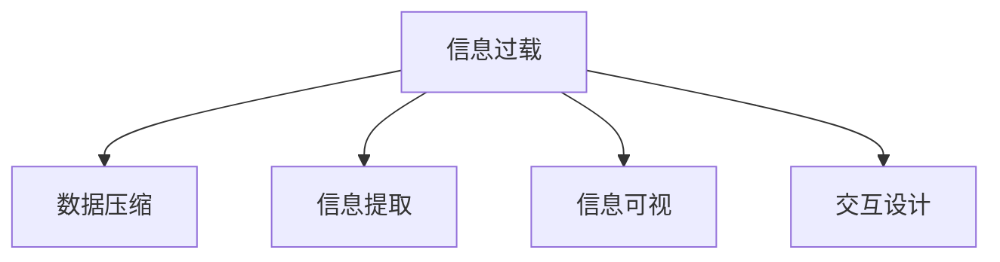

                 

# 信息简化的好处与实践：在复杂世界中简化以改善生活和决策

## 1. 背景介绍

### 1.1 问题由来
在信息爆炸的时代，我们每天都被各种各样的信息所包围，从新闻、社交媒体到电子邮件，信息的量已经远远超出了人类的处理能力。这种信息过载不仅影响了我们的工作效率和生活质量，还可能对我们的决策产生负面影响。因此，如何有效简化信息，使其更易于理解和处理，成为了一个重要的课题。

### 1.2 问题核心关键点
信息简化的核心在于通过合理的压缩和整理，使复杂的信息变得易于理解和操作，从而提高决策的效率和准确性。信息简化的关键点包括：

1. 信息的精简：去除无关的信息，只保留最关键的内容。
2. 信息的重组：将信息重新组织成易于理解和处理的形式。
3. 信息的可视化和交互化：通过图表、动画等形式呈现信息，增强理解和互动性。

## 2. 核心概念与联系

### 2.1 核心概念概述

为更好地理解信息简化的原理和应用，本节将介绍几个密切相关的核心概念：

- 信息过载(Information Overload)：指在短时间内接收的信息量超出人的处理能力，导致认知负担过重，影响决策和行为。
- 数据压缩(Data Compression)：指通过算法对数据进行压缩，以减少存储空间和传输带宽，提高信息传输效率。
- 信息提取(Information Extraction)：指从大量数据中提取有价值的信息，去除冗余和无关内容。
- 信息可视(Information Visualization)：指将复杂的数据和信息通过图表、地图、动画等形式呈现，便于理解和分析。
- 交互设计(Interactive Design)：指通过界面设计和用户交互，使信息呈现更加直观和易于操作。

这些概念之间的逻辑关系可以通过以下Mermaid流程图来展示：



这个流程图展示了几者之间的关系：

1. 信息过载是信息简化的出发点。
2. 数据压缩、信息提取、信息可视和交互设计都是信息简化的手段。
3. 通过这些手段，可以将复杂的信息简化为易于理解和操作的形式，从而改善生活和决策。

## 3. 核心算法原理 & 具体操作步骤
### 3.1 算法原理概述

信息简化的基本原理是通过一系列算法和工具，将复杂的信息进行压缩、提取、可视化和交互设计，使其更易于理解和处理。核心算法包括数据压缩算法、信息提取算法、信息可视化算法和交互设计算法。

### 3.2 算法步骤详解

信息简化的主要步骤如下：

**Step 1: 收集和整理信息**
- 收集与问题相关的信息，确保信息的全面性和相关性。
- 对信息进行分类和整理，去除冗余和无关内容。

**Step 2: 数据压缩**
- 选择合适的压缩算法，如霍夫曼编码、LZW算法、无损压缩等，对信息进行压缩。
- 使用压缩工具，如Gzip、Bzip2、Snappy等，实现高效的压缩和解压缩。

**Step 3: 信息提取**
- 通过自然语言处理(NLP)等技术，从文本信息中提取关键实体、关系、情感等信息。
- 使用机器学习算法，如文本分类、情感分析等，对信息进行进一步的提取和分析。

**Step 4: 信息可视化**
- 选择合适的可视化工具，如D3.js、Tableau、Power BI等，将信息呈现为图表、地图、仪表盘等形式。
- 设计直观易用的界面，使用户能够快速理解和使用可视化结果。

**Step 5: 交互设计**
- 通过界面设计工具，如Sketch、Adobe XD等，设计用户界面。
- 使用交互设计技术，如响应式设计、用户界面元素动画等，增强用户体验。

### 3.3 算法优缺点

信息简化的主要优点包括：

1. 提高决策效率：通过简化信息，减少了决策的复杂度和时间成本。
2. 增强决策准确性：去除了无关和冗余信息，提高了决策的准确性。
3. 改善用户体验：通过可视化和交互设计，提升了用户的使用体验和满意度。
4. 降低信息传输成本：通过数据压缩技术，减少了信息传输的存储空间和带宽消耗。

然而，信息简化也存在一些缺点：

1. 信息损失：压缩和提取过程中，可能丢失部分关键信息。
2. 复杂性增加：简化过程本身需要设计算法和工具，增加了复杂性。
3. 用户依赖：过度依赖简化后的信息，可能导致用户对原始信息的理解能力下降。
4. 个性化不足：简化的信息可能难以满足不同用户的需求和偏好。

### 3.4 算法应用领域

信息简化的应用领域非常广泛，以下是一些典型的例子：

- 商业智能(BI)：通过数据压缩和可视化，帮助企业决策者快速理解业务数据，做出决策。
- 数据科学：在数据提取和分析中，使用自然语言处理和机器学习算法，提取有价值的信息。
- 新闻媒体：通过信息提取和可视化，使新闻内容更易于理解，提高阅读体验。
- 医疗领域：通过数据压缩和信息提取，简化医疗数据，提高诊疗效率和准确性。
- 教育技术：通过信息可视化和交互设计，使学习内容更易于理解和应用。

## 4. 数学模型和公式 & 详细讲解 & 举例说明

### 4.1 数学模型构建

信息简化的数学模型主要涉及信息熵、信息增益等概念。信息熵用于度量信息的不确定性，信息增益用于衡量信息对决策的帮助程度。

### 4.2 公式推导过程

信息熵公式为：
$$
H(X) = -\sum_{i} p(x_i) \log p(x_i)
$$

其中，$X$ 为信息源，$x_i$ 为信息源的取值，$p(x_i)$ 为取值 $x_i$ 的概率。

信息增益公式为：
$$
IG(A,X) = H(X) - H(X|A)
$$

其中，$IG(A,X)$ 为属性 $A$ 对信息源 $X$ 的信息增益，$H(X|A)$ 为已知属性 $A$ 的情况下，信息源 $X$ 的条件熵。

### 4.3 案例分析与讲解

以一个简单的信息提取为例，假设我们有一份包含以下信息的文本：

```
公司A的销售额为1000万，比公司B高30%。公司B的销售额为800万，比公司C高20%。公司C的销售额为600万。
```

通过信息增益计算，我们可以提取到公司销售额的排序信息。首先，计算公司销售额的信息熵：

$$
H(\text{销售额}) = -0.25\log(0.25) - 0.25\log(0.25) - 0.25\log(0.25) - 0.25\log(0.25) = 2
$$

然后，计算公司销售额对每个公司的信息增益：

- 公司A：$IG(\text{销售额},\text{公司A}) = 2 - 0 = 2$
- 公司B：$IG(\text{销售额},\text{公司B}) = 2 - 1.5 = 0.5$
- 公司C：$IG(\text{销售额},\text{公司C}) = 2 - 0.5 = 1.5$

最终，我们可以得到销售额对公司的信息增益排序为：公司A > 公司C > 公司B。

## 5. 项目实践：代码实例和详细解释说明

### 5.1 开发环境搭建

在进行信息简化的实践前，我们需要准备好开发环境。以下是使用Python进行信息简化的环境配置流程：

1. 安装Anaconda：从官网下载并安装Anaconda，用于创建独立的Python环境。

2. 创建并激活虚拟环境：
```bash
conda create -n info-simplification python=3.8 
conda activate info-simplification
```

3. 安装PyTorch：根据CUDA版本，从官网获取对应的安装命令。例如：
```bash
conda install pytorch torchvision torchaudio cudatoolkit=11.1 -c pytorch -c conda-forge
```

4. 安装Pandas、Numpy、Matplotlib等库：
```bash
pip install pandas numpy matplotlib scikit-learn plotly
```

完成上述步骤后，即可在`info-simplification`环境中开始信息简化的实践。

### 5.2 源代码详细实现

我们以一个简单的信息可视化项目为例，使用Plotly库展示销售数据的信息可视化结果。

首先，定义数据和可视化函数：

```python
import pandas as pd
import plotly.express as px

# 定义数据集
sales_data = pd.read_csv('sales_data.csv')

# 可视化函数
def plot_sales(sales_data, title):
    fig = px.bar(sales_data, x='sales', y='company', color='company', barmode='group', title=title)
    fig.show()
```

然后，调用函数生成可视化图表：

```python
sales_data = pd.read_csv('sales_data.csv')
plot_sales(sales_data, '公司销售额排序')
```

### 5.3 代码解读与分析

让我们再详细解读一下关键代码的实现细节：

**sales_data DataFrame**：
- 定义了一个包含销售额和公司名称的Pandas DataFrame，用于存储数据。

**plot_sales函数**：
- 定义了一个Plotly的bar图表函数，对销售额数据进行可视化，展示了公司销售额的排序信息。

**主函数**：
- 读取销售额数据，调用plot_sales函数进行可视化，生成公司销售额排序的图表。

可以看到，通过Plotly库，我们能够快速生成直观的可视化结果，帮助决策者快速理解数据。

## 6. 实际应用场景

### 6.1 智能客服系统

智能客服系统通过信息简化，可以将复杂的客户问题快速处理和解决，提升客户满意度和服务效率。系统通过自然语言处理和机器学习算法，对客户提问进行信息提取和理解，生成简洁明了的回答，并进行信息可视化，使客户能够快速理解问题解决步骤。

### 6.2 金融舆情监测

金融舆情监测系统通过信息提取和可视化，可以快速分析市场情绪和舆情变化，帮助分析师做出快速反应和决策。系统通过爬虫和数据采集技术，实时收集新闻、社交媒体等数据，使用信息增益算法提取关键信息，生成实时舆情图，直观展示市场情绪的变化趋势。

### 6.3 个性化推荐系统

个性化推荐系统通过信息简化，可以高效地分析用户行为数据，生成个性化推荐结果。系统通过数据压缩和信息提取，从用户浏览历史、评分数据等文本信息中提取关键特征，使用信息可视化技术，生成用户偏好图，直观展示用户的兴趣点和行为特征。

### 6.4 未来应用展望

随着信息简化的技术不断发展，其在更多领域的应用前景将更加广阔。未来，信息简化的技术将与人工智能、大数据、物联网等技术深度融合，推动智能化应用的创新发展。

- 在智慧城市治理中，通过信息简化和大数据分析，可以实时监控和处理城市事件，提升城市管理效率。
- 在教育领域，通过信息可视化和交互设计，可以提升学习体验和效果，帮助学生更好地掌握知识。
- 在医疗领域，通过数据压缩和信息提取，可以简化医疗数据，提高诊断和治疗的效率和准确性。
- 在交通管理中，通过信息提取和可视化，可以实时监控交通状况，优化交通流量，减少交通拥堵。

## 7. 工具和资源推荐

### 7.1 学习资源推荐

为了帮助开发者系统掌握信息简化的理论基础和实践技巧，这里推荐一些优质的学习资源：

1. 《信息论导论》系列书籍：介绍了信息熵、信息增益、香农定理等基本概念，是信息简化技术的基础。

2. 《Python数据科学手册》：详细介绍了Pandas、Matplotlib、Plotly等数据处理和可视化工具的使用方法，适合入门学习。

3. 《交互设计基础》系列书籍：介绍了交互设计的原则和实践，帮助开发者设计直观易用的界面。

4. 《数据可视化之美》系列书籍：介绍了各种数据可视化技术，帮助开发者高效展示和分析数据。

5. 《机器学习实战》系列书籍：介绍了机器学习算法的实现方法和应用，适合结合信息简化技术进行实际应用。

通过对这些资源的学习实践，相信你一定能够快速掌握信息简化的精髓，并用于解决实际问题。

### 7.2 开发工具推荐

高效的信息简化开发离不开优秀的工具支持。以下是几款常用的工具：

1. Python：开源编程语言，简单易学，适合快速迭代研究。

2. Pandas：数据处理和分析工具，支持高效的数据压缩和信息提取。

3. Plotly：数据可视化工具，支持生成各种类型的交互图表，适合信息可视化的实现。

4. Tableau：商业智能工具，支持数据可视化和交互设计，适合企业级应用。

5. Power BI：微软的商业智能工具，支持数据可视化和分析，适合企业级应用。

合理利用这些工具，可以显著提升信息简化的开发效率，加快创新迭代的步伐。

### 7.3 相关论文推荐

信息简化的发展源于学界的持续研究。以下是几篇奠基性的相关论文，推荐阅读：

1. 《信息论》：克劳德·香农所著，介绍了信息熵、信息增益等基本概念，是信息简化技术的基础。

2. 《数据压缩算法》：详细介绍了霍夫曼编码、LZW算法等常见数据压缩算法，适合入门学习。

3. 《数据提取和可视化技术》：介绍了自然语言处理和机器学习算法在信息提取中的应用，适合深入学习。

4. 《交互设计原则》：介绍了交互设计的原则和实践，适合界面设计和用户体验的开发。

5. 《数据可视化方法》：介绍了各种数据可视化技术，适合数据展示和分析的开发。

这些论文代表的信息简化技术的发展脉络。通过学习这些前沿成果，可以帮助研究者把握学科前进方向，激发更多的创新灵感。

## 8. 总结：未来发展趋势与挑战

### 8.1 总结

本文对信息简化的原理和实践进行了全面系统的介绍。首先阐述了信息过载和信息简化的核心意义，明确了信息简化的目标和实施步骤。其次，从原理到实践，详细讲解了信息简化的数学模型和关键算法，给出了信息简化的完整代码实例。同时，本文还探讨了信息简化在智能客服、金融舆情、个性化推荐等实际应用场景中的应用前景，展示了信息简化技术的巨大潜力。最后，本文精选了信息简化的各类学习资源，力求为读者提供全方位的技术指引。

通过本文的系统梳理，可以看到，信息简化技术在信息处理和决策支持中具有重要价值。这些技术的应用，可以显著提升决策的效率和准确性，改善用户的使用体验。

### 8.2 未来发展趋势

展望未来，信息简化的技术将呈现以下几个发展趋势：

1. 自动化水平提高：通过机器学习和人工智能技术，实现信息简化的自动化，提高效率和精度。
2. 个性化程度增强：根据用户行为和偏好，动态调整信息简化的策略，提升用户体验。
3. 多模态数据整合：将文本、图像、语音等多模态数据进行综合处理和简化，提升信息处理能力。
4. 实时性提升：通过分布式计算和流计算技术，实现信息简化的实时处理，满足实时决策的需求。
5. 可解释性增强：引入可解释性算法和技术，提升信息简化的透明度和可信度。
6. 跨领域应用拓展：将信息简化技术应用于更多领域，如医疗、教育、城市治理等，推动社会发展的智能化。

以上趋势凸显了信息简化技术的广阔前景。这些方向的探索发展，必将进一步提升信息处理和决策支持的能力，为各行各业带来更多的创新和价值。

### 8.3 面临的挑战

尽管信息简化技术已经取得了显著进展，但在迈向更加智能化、普适化应用的过程中，它仍面临诸多挑战：

1. 数据隐私和安全：在信息简化的过程中，需要保护用户隐私和数据安全，防止数据泄露和滥用。
2. 复杂度增加：信息简化技术本身需要设计复杂的算法和工具，增加了系统的复杂性和维护成本。
3. 用户接受度：信息简化可能导致用户对原始信息的依赖下降，影响用户的接受度和满意度。
4. 应用场景限制：信息简化技术在一些特定应用场景中可能难以充分发挥作用，需要结合具体业务需求进行优化。
5. 技术协同：信息简化需要与自然语言处理、机器学习、人工智能等技术协同工作，需要统一的框架和技术标准。

这些挑战需要行业内的共同努力，通过技术创新和实践探索，逐步克服和解决。

### 8.4 研究展望

面对信息简化面临的种种挑战，未来的研究需要在以下几个方面寻求新的突破：

1. 引入自然语言处理和机器学习：通过自然语言处理和机器学习算法，自动提取和简化信息，提升效率和精度。
2. 设计更高效的压缩算法：开发新的压缩算法，实现更高效的压缩和解压缩，减少信息传输成本。
3. 引入交互设计和可视化技术：通过交互设计和可视化技术，提升信息展示的直观性和互动性，增强用户体验。
4. 探索跨领域应用：将信息简化技术应用于更多领域，推动跨领域数据的整合和信息处理能力的提升。
5. 加强可解释性和安全性：引入可解释性算法和技术，提升信息简化的透明度和可信度，同时加强数据隐私和安全保障。

这些研究方向的探索，必将引领信息简化技术迈向更高的台阶，为信息处理和决策支持提供更强大的工具和方法。面向未来，信息简化技术还需要与其他人工智能技术进行更深入的融合，共同推动社会发展的智能化。总之，信息简化需要开发者根据具体业务需求，不断迭代和优化算法、工具和实践，方能得到理想的效果。

## 9. 附录：常见问题与解答

**Q1：信息简化是否适用于所有数据类型？**

A: 信息简化主要适用于文本、图像、音频等结构化或半结构化数据。对于非结构化数据，如视频、PDF等，需要进行预处理和转换，才能进行信息提取和简化。

**Q2：信息简化过程中如何避免信息丢失？**

A: 信息简化的过程中，需要平衡信息的简化和完整性。对于关键信息，应该尽可能保留，避免丢失。同时，可以结合多种信息表示方式，如文字、图表、视频等，增强信息的表达力和理解性。

**Q3：信息简化的自动化程度如何？**

A: 信息简化的自动化程度因应用场景而异。在一些自动化程度较高的场景，如商业智能、数据科学等，可以通过自动化的算法和工具，实现信息简化的自动化。但在一些需要高度自定义和人工干预的场景，如医疗、金融等，仍需要人工参与和辅助。

**Q4：信息简化的效果如何评估？**

A: 信息简化的效果可以通过用户满意度、决策准确性、应用效率等指标进行评估。可以通过问卷调查、用户反馈、数据分析等方法，收集用户对信息简化的评价，评估其效果和改进空间。

**Q5：信息简化对数据量的要求是多少？**

A: 信息简化的效果与数据量密切相关。在数据量较小的情况下，信息简化可能难以发挥作用。通常建议数据量在1万条以上，才能进行有效的信息简化。

总之，信息简化技术在信息处理和决策支持中具有重要价值，通过技术创新和实践探索，可以显著提升信息处理和决策的效率和准确性，改善用户的使用体验。信息简化的未来发展需要行业内的共同努力，通过技术创新和实践探索，逐步克服和解决当前面临的挑战，推动信息简化技术向更高的水平迈进。

