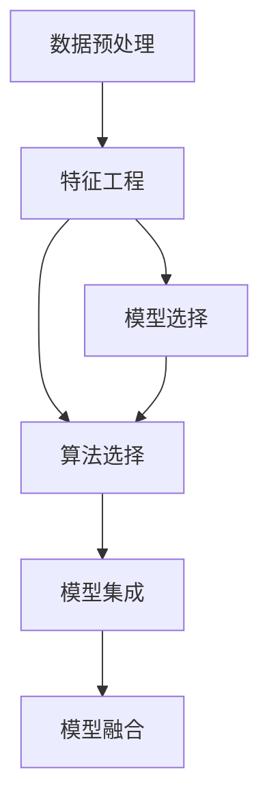

                 

# 信息简化的好处与实践：如何在复杂世界中简化和改善决策

> 关键词：信息简化, 决策优化, 数据分析, 机器学习, 算法选择, 模型集成

## 1. 背景介绍

### 1.1 问题由来

在现代社会中，信息的爆炸式增长为各行各业带来了巨大的机遇和挑战。大量数据涌入，使决策者面临前所未有的信息压力。然而，无序、冗余、模糊的信息不仅难以有效利用，反而成为干扰决策的噪音。因此，如何有效简化信息，从海量数据中提取关键特征，优化决策过程，已经成为决策科学中的核心问题。

### 1.2 问题核心关键点

本文聚焦于如何利用信息简化技术改善复杂决策过程。我们认为，信息简化不仅有助于提升决策效率，还能增强决策的准确性和鲁棒性。具体而言，关键点包括：
- 信息简化技术：从数据预处理、特征工程到模型选择，如何通过数据清理、降维、压缩等方式简化信息。
- 决策优化方法：基于机器学习和深度学习，如何通过模型构建、特征融合、集成学习等方式改善决策。
- 算法选择策略：不同算法适用的场景和优缺点，如何选择最优算法。
- 模型集成技巧：如何通过模型融合、组合测试、超参数调优等方式提升模型性能。

### 1.3 问题研究意义

研究信息简化技术，对于提升决策效率、改善决策效果，具有重要意义：

1. 提升决策速度：信息简化可以消除冗余和噪音，使决策者能够迅速把握关键信息，缩短决策周期。
2. 增强决策准确性：通过特征提取和模型优化，提升决策的精度和可靠性，减少决策误差。
3. 增加决策鲁棒性：多样化的模型集成和算法选择，可以增强决策系统的鲁棒性，避免单一算法失效带来的风险。
4. 降低决策成本：简化信息可以减少数据收集和处理成本，优化决策过程，降低整体运营成本。

## 2. 核心概念与联系

### 2.1 核心概念概述

为更好地理解信息简化的原理和应用，本节将介绍几个关键概念：

- 数据预处理(Data Preprocessing)：通过清洗、填补缺失值、标准化等方式，使数据适合用于后续分析或模型训练。
- 特征工程(Feature Engineering)：在数据特征提取的基础上，通过构建新特征、转换特征等方式，提升模型的表达能力和预测性能。
- 模型选择(Model Selection)：在众多机器学习算法中选择合适的模型，以适应特定问题和数据集，提升模型泛化能力。
- 模型集成(Model Ensemble)：通过组合多个模型的预测结果，构建更强大的决策系统，提升决策效果。
- 算法选择(Algorithm Selection)：根据任务特点和数据特性，选择最合适的算法和模型，以实现最优的决策效果。
- 模型融合(Model Fusion)：通过集成多个模型的预测，优化决策结果，增强决策系统的鲁棒性和准确性。

这些概念之间的逻辑关系可以通过以下Mermaid流程图来展示：



这个流程图展示了一组关键概念及其之间的关系：

1. 数据预处理是信息简化的起点，为后续分析奠定基础。
2. 特征工程对原始数据进行加工，提升特征表现能力。
3. 模型选择和算法选择是决定模型表现的关键步骤，需综合考虑多方面因素。
4. 模型集成通过组合多个模型，提升决策系统的综合能力。
5. 模型融合通过多个模型的综合预测，增强决策鲁棒性。

这些概念共同构成了信息简化技术的框架，为提升复杂决策过程提供了科学的方法论支持。

## 3. 核心算法原理 & 具体操作步骤
### 3.1 算法原理概述

信息简化和决策优化的核心在于通过算法和技术手段，将复杂的信息系统简化为易于处理的结构，并在此基础上构建最优的决策模型。具体而言，信息简化过程主要包括数据预处理、特征工程和模型选择三个步骤：

1. **数据预处理**：清洗、标准化数据，消除冗余和噪音，确保数据质量和一致性。
2. **特征工程**：提取、转换、组合特征，构建高质量的特征集，提升模型表达能力。
3. **模型选择**：从多个算法中选择最优模型，优化模型性能和泛化能力。

而决策优化则主要通过模型集成和融合技术，构建鲁棒、高效的决策系统。具体步骤包括：

1. **模型集成**：通过组合多个模型的预测，提升决策系统的综合能力。
2. **模型融合**：通过多个模型的综合预测，增强决策系统的鲁棒性和准确性。

### 3.2 算法步骤详解

#### 3.2.1 数据预处理

数据预处理是信息简化的第一步，其目的是对原始数据进行清洗、整理，确保数据质量和一致性，以便于后续分析和使用。主要步骤如下：

1. **缺失值处理**：通过插值、删除等方法，处理数据中的缺失值。
2. **数据标准化**：对数据进行归一化、标准化处理，确保数据在相同的尺度上。
3. **异常值检测**：识别并处理数据中的异常值，防止异常值影响模型训练和预测。
4. **数据转换**：对数据进行转换，如对非数值型数据进行编码、对时间序列数据进行平稳性处理等。

#### 3.2.2 特征工程

特征工程是信息简化的核心环节，通过构建高质量的特征集，提升模型表达能力和预测性能。主要步骤如下：

1. **特征选择**：通过统计、模型评估等方法，选择与目标变量相关性高的特征。
2. **特征转换**：对原始特征进行转换，如对数值型数据进行对数转换、对文本数据进行TF-IDF转换等。
3. **特征组合**：通过组合原始特征，生成新的特征，提升模型表现。
4. **特征降维**：通过主成分分析(PCA)、线性判别分析(LDA)等方法，降低特征维度，提升计算效率。

#### 3.2.3 模型选择

模型选择是信息简化的关键步骤，从众多机器学习算法中选择最优模型，提升决策系统的性能。主要步骤如下：

1. **算法对比**：对比不同算法的优劣，选择合适的算法。
2. **交叉验证**：通过交叉验证评估模型的泛化能力，选择最优模型。
3. **超参数调优**：调整算法超参数，提升模型性能。
4. **模型评估**：通过多种指标评估模型性能，选择最优模型。

#### 3.2.4 模型集成

模型集成是通过组合多个模型的预测，提升决策系统的综合能力。主要步骤如下：

1. **模型选择**：选择多个性能优秀的模型。
2. **预测组合**：通过平均、投票等方法，组合多个模型的预测结果。
3. **集成评估**：评估集成模型的性能，选择最优模型。

#### 3.2.5 模型融合

模型融合是通过多个模型的综合预测，增强决策系统的鲁棒性和准确性。主要步骤如下：

1. **模型选择**：选择多个性能稳定的模型。
2. **预测融合**：通过加权、堆叠等方法，融合多个模型的预测结果。
3. **融合评估**：评估融合模型的性能，选择最优模型。

### 3.3 算法优缺点

信息简化和决策优化方法具有以下优点：
1. 提升决策效率：通过简化信息，减少数据处理时间和计算成本，提升决策速度。
2. 增强决策准确性：通过特征工程和模型优化，提升决策的精度和可靠性，减少决策误差。
3. 增加决策鲁棒性：多样化的模型集成和算法选择，可以增强决策系统的鲁棒性，避免单一算法失效带来的风险。
4. 降低决策成本：简化信息可以减少数据收集和处理成本，优化决策过程，降低整体运营成本。

同时，这些方法也存在一定的局限性：
1. 数据质量要求高：信息简化依赖于高质量的数据，数据清洗和预处理过程复杂且耗时。
2. 算法选择难度大：不同算法适用于不同的数据和问题，选择最优算法需要丰富的经验和知识。
3. 模型复杂度高：模型集成和融合过程中，模型数量和参数较多，增加计算复杂度和存储需求。
4. 可解释性差：复杂模型和集成方法缺乏可解释性，难以理解模型内部工作机制和决策逻辑。

尽管存在这些局限性，但就目前而言，信息简化和决策优化方法仍是提升决策系统性能的重要手段。未来相关研究的重点在于如何进一步降低数据预处理和模型训练的复杂度，提高算法的可解释性和鲁棒性，同时兼顾计算效率和存储需求。

### 3.4 算法应用领域

信息简化和决策优化方法在多个领域中得到了广泛应用，包括但不限于：

- 金融风险管理：通过数据预处理和特征工程，提取关键风险特征，优化风险评估模型。
- 医疗诊断支持：通过特征工程和模型融合，构建多模态诊断系统，提升诊断准确性。
- 零售客户分析：通过数据预处理和模型集成，优化客户细分和推荐系统，提升用户体验。
- 智能交通系统：通过数据预处理和模型选择，优化交通流预测和调度，提升交通效率。
- 能源需求预测：通过数据预处理和特征工程，提取关键能源需求特征，优化预测模型。

除了这些具体应用，信息简化和决策优化方法还在更广泛的领域中得到应用，如智慧城市、智能制造、智能物流等，为各行各业带来了显著的改进和创新。

## 4. 数学模型和公式 & 详细讲解  
### 4.1 数学模型构建

假设我们有一个包含 $n$ 个样本和 $m$ 个特征的数据集 $\{(x_i, y_i)\}_{i=1}^n$，其中 $x_i \in \mathbb{R}^m$ 表示样本特征，$y_i \in \{0,1\}$ 表示样本标签。我们的目标是构建一个最优的决策模型 $f(x)$，使其在测试集上的预测准确率最大化。

### 4.2 公式推导过程

#### 4.2.1 数据预处理

对于缺失值，我们可以使用均值填补法（Mean Imputation）：

$$
\hat{x}_{i,j} = \frac{\sum_{k \neq i} x_{k,j}}{n-1} \quad \text{for} \quad x_{i,j} \text{ missing}
$$

对于异常值，我们可以使用箱线图（Boxplot）检测，并根据中位数（Median）和四分位数（IQR）进行调整：

$$
\hat{x}_{i,j} = \begin{cases} 
\text{Median} - \text{IQR} & \text{if} \quad x_{i,j} \text{ is outlier} \\
x_{i,j} & \text{otherwise}
\end{cases}
$$

#### 4.2.2 特征工程

特征选择可以通过相关性分析（Correlation Analysis）实现，假设特征 $x_j$ 与标签 $y$ 的相关性系数为 $\rho_{x_j, y}$，我们可以将相关性系数高于阈值 $\theta$ 的特征保留：

$$
\hat{x} = \{x_j \mid \rho_{x_j, y} > \theta\}
$$

特征转换可以通过对数转换（Log Transformation）实现，假设原始特征 $x_j$ 的均值为 $\mu$，标准差为 $\sigma$，则对数转换后的特征为：

$$
\hat{x}_j = \log(x_j + \epsilon)
$$

特征组合可以通过多项式特征（Polynomial Features）实现，假设原始特征为 $x_j$，则多项式特征为：

$$
\hat{x}_j = \{x_j, x_j^2, x_j^3, \ldots\}
$$

特征降维可以通过主成分分析（PCA）实现，假设原始特征矩阵为 $X$，其协方差矩阵为 $\Sigma$，则降维后的特征矩阵为：

$$
X_{\text{reduced}} = X \Sigma^{-1} V
$$

#### 4.2.3 模型选择

假设我们选择模型 $f(x) = \sum_{j=1}^m \theta_j x_j$ 进行线性回归，其中 $\theta_j$ 为模型的参数。通过最小二乘法，我们可以求解最优参数：

$$
\theta = (X^TX)^{-1}X^Ty
$$

其中 $X = [x_1, x_2, \ldots, x_n]$ 表示特征矩阵，$y = [y_1, y_2, \ldots, y_n]$ 表示标签向量。

#### 4.2.4 模型集成

假设我们选择的模型为 $f_1(x), f_2(x), \ldots, f_n(x)$，其中 $n$ 表示模型的数量。通过平均法（Averaging），我们可以组合模型的预测结果：

$$
\hat{y} = \frac{1}{n} \sum_{i=1}^n f_i(x)
$$

#### 4.2.5 模型融合

假设我们选择的模型为 $f_1(x), f_2(x), \ldots, f_n(x)$，其中 $n$ 表示模型的数量。通过加权法（Weighted），我们可以融合模型的预测结果：

$$
\hat{y} = \sum_{i=1}^n w_i f_i(x)
$$

其中 $w_i$ 为模型的权重，可以通过交叉验证确定。

### 4.3 案例分析与讲解

假设我们有一个股票价格预测问题，通过历史股价和相关经济指标，预测未来股价。数据预处理阶段，我们需要检测和填补缺失值，使用箱线图调整异常值，使用主成分分析降维特征。特征工程阶段，我们选择股票收盘价、成交量等关键特征，并构建多项式特征。模型选择阶段，我们选择线性回归模型，并使用交叉验证调优超参数。模型集成阶段，我们选择多个线性回归模型进行平均，得到预测结果。模型融合阶段，我们通过加权法融合多个模型的预测结果，得到最终的预测值。

## 5. 项目实践：代码实例和详细解释说明
### 5.1 开发环境搭建

在进行信息简化和决策优化实践前，我们需要准备好开发环境。以下是使用Python进行Scikit-learn开发的环境配置流程：

1. 安装Anaconda：从官网下载并安装Anaconda，用于创建独立的Python环境。

2. 创建并激活虚拟环境：
```bash
conda create -n sk-env python=3.8 
conda activate sk-env
```

3. 安装Scikit-learn：
```bash
pip install scikit-learn
```

4. 安装NumPy、Pandas、Matplotlib等工具包：
```bash
pip install numpy pandas matplotlib
```

5. 安装相关库：
```bash
pip install joblib seaborn tqdm
```

完成上述步骤后，即可在`sk-env`环境中开始信息简化和决策优化的实践。

### 5.2 源代码详细实现

下面我们以金融风险管理为例，给出使用Scikit-learn进行数据预处理、特征工程和模型构建的Python代码实现。

首先，定义数据预处理函数：

```python
import numpy as np
import pandas as pd
from sklearn.preprocessing import StandardScaler

def preprocess_data(data):
    # 缺失值处理
    data.fillna(data.mean(), inplace=True)
    
    # 数据标准化
    scaler = StandardScaler()
    data = pd.DataFrame(scaler.fit_transform(data), columns=data.columns)
    
    # 异常值检测和处理
    boxplot_data = data.boxplot(figsize=(10, 10))
    for i in range(len(data.columns)):
        if boxplot_data[i]['fliers']:
            median = data.iloc[:, i].median()
            iqr = boxplot_data[i]['flierlim'][1] - boxplot_data[i]['flierlim'][0]
            data.iloc[:, i] = np.where((data.iloc[:, i] < (median - 1.5*iqr)) | (data.iloc[:, i] > (median + 1.5*iqr)), median, data.iloc[:, i])
    
    return data
```

然后，定义特征工程函数：

```python
from sklearn.feature_selection import SelectKBest, mutual_info_classif
from sklearn.preprocessing import PolynomialFeatures

def feature_engineering(data, target):
    # 特征选择
    selector = SelectKBest(score_func=mutual_info_classif, k=10)
    data_selected = selector.fit_transform(data, target)
    
    # 特征转换
    poly = PolynomialFeatures(degree=2, interaction_only=False, include_bias=False)
    data_poly = poly.fit_transform(data_selected)
    
    return data_poly
```

接着，定义模型选择和训练函数：

```python
from sklearn.linear_model import LinearRegression
from sklearn.model_selection import cross_val_score
from sklearn.pipeline import make_pipeline

def select_model(data_poly, target):
    # 模型选择
    model = LinearRegression()
    model.fit(data_poly, target)
    
    # 交叉验证评估
    scores = cross_val_score(model, data_poly, target, cv=5)
    print("Cross-Validation Scores:", scores)
    
    return model
```

最后，启动数据预处理、特征工程、模型选择和训练的流程：

```python
# 读取数据
data = pd.read_csv('financial_data.csv')

# 数据预处理
data_processed = preprocess_data(data)

# 特征工程
data_poly = feature_engineering(data_processed, 'risk')

# 模型选择和训练
model = select_model(data_poly, 'risk')
```

以上就是使用Scikit-learn进行信息简化和决策优化的完整代码实现。可以看到，得益于Scikit-learn的强大封装，我们可以用相对简洁的代码完成数据预处理、特征工程和模型选择。

### 5.3 代码解读与分析

让我们再详细解读一下关键代码的实现细节：

**preprocess_data函数**：
- 缺失值处理：使用均值填补法处理缺失值。
- 数据标准化：使用StandardScaler对数据进行标准化。
- 异常值检测：使用箱线图检测异常值，并根据中位数和四分位数进行调整。

**feature_engineering函数**：
- 特征选择：使用SelectKBest选择相关性最高的特征。
- 特征转换：使用PolynomialFeatures构建多项式特征。

**select_model函数**：
- 模型选择：选择LinearRegression模型。
- 交叉验证评估：使用交叉验证评估模型性能。

**数据预处理、特征工程、模型选择和训练的流程**：
- 读取数据：读取包含历史数据的CSV文件。
- 数据预处理：对数据进行缺失值处理、标准化和异常值检测。
- 特征工程：选择关键特征，并构建多项式特征。
- 模型选择和训练：选择线性回归模型，并通过交叉验证评估性能。

可以看到，Scikit-learn提供了完整的工具链，帮助开发者快速实现信息简化和决策优化。开发者可以专注于算法选择和模型调优，而不必过多关注底层实现细节。

当然，工业级的系统实现还需考虑更多因素，如模型保存和部署、超参数调优等。但核心的信息简化和决策优化过程基本与此类似。

## 6. 实际应用场景
### 6.1 智能制造系统

在智能制造领域，基于信息简化的决策系统可以优化生产过程，提升产品质量和生产效率。传统制造系统中，决策过程复杂且数据量大，常常导致决策效率低下和误判率高。而利用信息简化技术，可以从海量生产数据中提取关键特征，优化决策模型，实现自动化生产。

在技术实现上，可以构建基于机器学习的质量控制模型，通过数据预处理和特征工程，提取设备状态、工艺参数等关键特征，优化模型预测。模型集成和融合技术则可以增强预测的鲁棒性和准确性，提升生产线的智能化水平。

### 6.2 智能物流系统

在智能物流领域，基于信息简化的决策系统可以优化物流网络，提升配送效率和客户满意度。物流系统中涉及大量运输数据、配送路径、客户需求等复杂信息，决策过程繁琐且难以自动化。利用信息简化技术，可以从庞杂的物流数据中提取关键特征，优化配送路径和库存管理，实现智能化的物流决策。

在技术实现上，可以构建基于深度学习的路径规划模型，通过数据预处理和特征工程，提取历史配送数据、实时交通数据等特征，优化路径规划。模型集成和融合技术则可以提升路径规划的准确性和鲁棒性，提升物流效率和客户满意度。

### 6.3 智慧城市治理

在智慧城市治理中，基于信息简化的决策系统可以优化城市资源分配，提升城市管理效率。城市治理涉及海量公共数据，决策过程复杂且耗时。利用信息简化技术，可以从公共数据中提取关键特征，优化交通管理、垃圾处理等决策，提升城市管理效率。

在技术实现上，可以构建基于机器学习的交通管理模型，通过数据预处理和特征工程，提取交通流量、天气状况等关键特征，优化交通信号灯和道路规划。模型集成和融合技术则可以提升交通管理的智能化水平，提升城市管理效率和居民生活质量。

### 6.4 未来应用展望

随着信息简化和决策优化技术的不断发展，其在各个领域中的应用前景广阔。

在智能交通系统、智慧制造、智能物流等新兴领域，信息简化技术将带来革命性的变化，提升系统的智能化和自动化水平。

在智慧城市治理、智能医疗、智能金融等传统领域，信息简化技术将助力提升决策效率和精度，改善社会治理和服务质量。

未来，伴随着更多前沿技术的引入，如因果推断、强化学习、联邦学习等，信息简化技术将更加深入地融合到各行各业中，推动智能化社会的发展进程。

## 7. 工具和资源推荐
### 7.1 学习资源推荐

为了帮助开发者系统掌握信息简化技术，这里推荐一些优质的学习资源：

1. 《Python数据科学手册》：这本书系统介绍了Python在数据科学中的应用，包括数据预处理、特征工程、模型选择等关键技术。

2. 《机器学习实战》：这本书提供了丰富的机器学习实战案例，包括分类、回归、聚类等任务，帮助读者深入理解机器学习算法。

3. Coursera《数据科学导论》课程：由Johns Hopkins大学提供，涵盖数据科学的基本概念和技术，包括数据清洗、特征工程、模型评估等。

4. Kaggle：这个数据科学竞赛平台提供了大量开源数据集和竞赛任务，帮助开发者实践信息简化技术。

5. Scikit-learn官方文档：Scikit-learn提供了详细的API文档和教程，帮助开发者快速上手使用信息简化工具。

通过对这些资源的学习实践，相信你一定能够掌握信息简化技术，并在实际应用中取得优异的效果。

### 7.2 开发工具推荐

高效的开发离不开优秀的工具支持。以下是几款用于信息简化和决策优化开发的常用工具：

1. Scikit-learn：Python的机器学习库，提供了丰富的算法和工具，支持数据预处理、特征工程、模型选择和集成等。

2. TensorFlow：由Google主导开发的深度学习框架，支持多种模型和算法，适合大规模工程应用。

3. PyTorch：由Facebook主导开发的深度学习框架，灵活易用，支持自动微分和模型训练。

4. Weights & Biases：模型训练的实验跟踪工具，可以记录和可视化模型训练过程中的各项指标，方便对比和调优。

5. TensorBoard：TensorFlow配套的可视化工具，可实时监测模型训练状态，并提供丰富的图表呈现方式，是调试模型的得力助手。

6. Jupyter Notebook：一个交互式编程环境，适合快速迭代和分享代码，方便学习实践。

合理利用这些工具，可以显著提升信息简化和决策优化的开发效率，加快创新迭代的步伐。

### 7.3 相关论文推荐

信息简化和决策优化技术的发展得益于学界的持续研究。以下是几篇奠基性的相关论文，推荐阅读：

1. J. Friedman《Greedy Function Approximation: A Gradient Boosting Machine》：提出梯度提升树算法，展示了模型集成在提升预测精度方面的强大能力。

2. Y. LeCun《Backpropagation Applied to Handwritten Zip Code Recognition》：提出反向传播算法，为深度学习的发展奠定了基础。

3. P. Cortes《An Introduction to Support Vector Machines and Other Kernel-Based Learning Methods》：介绍了支持向量机算法，展示了模型融合在提升鲁棒性和泛化能力方面的重要作用。

4. J. Schütze《Probabilistic Interpolation of Word Vectors》：提出Word2Vec算法，展示了特征工程在提升模型表达能力方面的重要性。

5. G. Hinton《A Neural Probabilistic Language Model》：提出神经网络语言模型，展示了模型选择和超参数调优在提升模型性能方面的重要性。

这些论文代表了大数据时代信息简化和决策优化技术的发展脉络。通过学习这些前沿成果，可以帮助研究者把握学科前进方向，激发更多的创新灵感。

## 8. 总结：未来发展趋势与挑战

### 8.1 总结

本文对信息简化和决策优化的技术进行了全面系统的介绍。首先阐述了信息简化技术在复杂决策中的重要性，明确了信息简化对于提升决策效率、改善决策效果的作用。其次，从原理到实践，详细讲解了信息简化的数学模型和关键步骤，给出了信息简化任务开发的完整代码实例。同时，本文还广泛探讨了信息简化技术在智能制造、智能物流、智慧城市等各个领域的应用前景，展示了信息简化技术的重要价值。

通过本文的系统梳理，可以看到，信息简化技术在提升决策系统性能方面具有重要意义。其通过数据预处理、特征工程和模型选择，从海量数据中提取关键信息，优化决策模型，从而实现决策效率和精度的提升。未来，伴随着更多前沿技术的发展，信息简化技术必将在各行各业中得到更广泛的应用，推动决策科学的进步。

### 8.2 未来发展趋势

展望未来，信息简化技术将呈现以下几个发展趋势：

1. 自动化数据预处理：通过自动化技术，实现数据清洗、标准化和异常值检测的自动化，减少人工干预和预处理时间。
2. 实时数据处理：利用流式计算和大数据技术，实现实时数据处理和分析，提升决策的时效性。
3. 跨领域知识融合：将符号化的先验知识，如知识图谱、逻辑规则等，与神经网络模型进行融合，提升模型的泛化能力和鲁棒性。
4. 多模态数据处理：将视觉、语音、文本等多模态数据进行融合处理，提升决策系统的感知能力和表达能力。
5. 可解释性增强：利用因果推断和强化学习等方法，增强模型的可解释性，使决策过程更加透明和可信。
6. 低资源优化：利用模型压缩、稀疏化等技术，优化模型的计算资源需求，提升决策系统的可部署性和实用性。

以上趋势凸显了信息简化技术的广阔前景。这些方向的探索发展，必将进一步提升决策系统的性能和应用范围，为决策科学带来深远影响。

### 8.3 面临的挑战

尽管信息简化技术已经取得了瞩目成就，但在迈向更加智能化、普适化应用的过程中，它仍面临着诸多挑战：

1. 数据质量问题：信息简化依赖于高质量的数据，但实际应用中常常面临数据缺失、噪声、偏差等问题。
2. 算法选择难度大：不同算法适用于不同的数据和问题，选择最优算法需要丰富的经验和知识。
3. 模型复杂度高：模型集成和融合过程中，模型数量和参数较多，增加计算复杂度和存储需求。
4. 可解释性差：复杂模型和集成方法缺乏可解释性，难以理解模型内部工作机制和决策逻辑。
5. 鲁棒性不足：模型在面对异常数据和极端情况时，泛化能力不足，容易产生误判。

尽管存在这些挑战，但伴随着信息技术的不断进步，这些问题终将得到解决。未来，研究者需要不断创新，寻找新的方法来解决这些问题，推动信息简化技术的发展。

### 8.4 研究展望

未来，信息简化技术需要在以下几个方面寻求新的突破：

1. 自动化和智能化：利用自动化和智能化技术，实现数据预处理和特征工程的自动化，减少人工干预。
2. 实时性优化：利用实时计算和大数据技术，实现实时数据处理和分析，提升决策的时效性。
3. 跨领域融合：将符号化的先验知识与神经网络模型进行融合，提升模型的泛化能力和鲁棒性。
4. 多模态处理：将视觉、语音、文本等多模态数据进行融合处理，提升决策系统的感知能力和表达能力。
5. 可解释性提升：利用因果推断和强化学习等方法，增强模型的可解释性，使决策过程更加透明和可信。
6. 资源优化：利用模型压缩、稀疏化等技术，优化模型的计算资源需求，提升决策系统的可部署性和实用性。

这些方向的研究将推动信息简化技术迈向更高的台阶，为各行各业带来更高效、更可靠、更智能的决策支持。

## 9. 附录：常见问题与解答

**Q1：信息简化过程中如何处理缺失值？**

A: 信息简化过程中，缺失值处理是一个重要环节。一般可以使用均值填补法、中位数填补法或删除法等方法处理缺失值。其中，均值填补法适用于数值型数据，中位数填补法适用于离散型数据，删除法适用于缺失值比例较低的场景。

**Q2：特征工程中如何选择合适的特征？**

A: 特征选择是信息简化的关键步骤，一般可以通过相关性分析、模型评估等方法选择与目标变量相关性高的特征。在相关性分析中，可以使用皮尔逊相关系数、Spearman相关系数等指标。在模型评估中，可以使用交叉验证、AUC、R^2等指标。

**Q3：模型集成和融合过程中需要注意哪些问题？**

A: 模型集成和融合过程中，需要注意以下几点：
1. 模型选择：选择多个性能优秀的模型。
2. 预测组合：通过平均、投票等方法，组合多个模型的预测结果。
3. 集成评估：评估集成模型的性能，选择最优模型。

**Q4：信息简化和决策优化技术在落地部署时需要注意哪些问题？**

A: 信息简化和决策优化技术在落地部署时，需要注意以下几点：
1. 模型裁剪：去除不必要的层和参数，减小模型尺寸，加快推理速度。
2. 量化加速：将浮点模型转为定点模型，压缩存储空间，提高计算效率。
3. 服务化封装：将模型封装为标准化服务接口，便于集成调用。
4. 弹性伸缩：根据请求流量动态调整资源配置，平衡服务质量和成本。
5. 监控告警：实时采集系统指标，设置异常告警阈值，确保服务稳定性。

**Q5：如何应对信息简化技术面临的挑战？**

A: 信息简化技术面临的挑战主要包括数据质量、算法选择、模型复杂度、可解释性、鲁棒性等。应对这些挑战，可以从以下几个方面入手：
1. 数据预处理：通过数据清洗、标准化、异常值检测等方法，提高数据质量。
2. 算法优化：通过模型选择、超参数调优等方法，选择最优算法和参数。
3. 模型简化：通过模型压缩、稀疏化等方法，优化模型计算资源需求。
4. 可解释性增强：通过因果推断、强化学习等方法，增强模型可解释性。
5. 鲁棒性提升：通过模型融合、对抗训练等方法，提升模型鲁棒性。

这些措施可以帮助我们克服信息简化技术面临的挑战，推动其进一步发展。

---

作者：禅与计算机程序设计艺术 / Zen and the Art of Computer Programming

