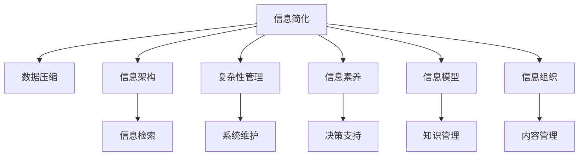

                 

# 信息简化的好处与技巧：在复杂世界中简化以提高生活质量和效率

> 关键词：信息简化, 数据压缩, 信息架构, 复杂性管理, 信息素养, 生活质量, 信息模型, 信息管理, 信息组织

## 1. 背景介绍

在现代社会，信息量的爆炸性增长给人们的生活带来了便利，也带来了信息过载的烦恼。如何有效地处理、存储和传递信息，已经成为提升个人和组织生活质量和效率的关键。本文旨在探讨信息简化的理论和实践，探讨如何通过简化信息来减少认知负担，提高决策质量和生活效率。

### 1.1 信息过载问题
随着互联网、社交媒体和物联网的普及，信息的生成和传播速度大幅提升。信息过载不仅包括信息量的增加，更在于信息质量参差不齐，误导性、冗余性信息泛滥。这导致人们花费大量时间在筛选和评估信息上，影响了工作效率和生活质量。

### 1.2 信息简化的必要性
面对信息过载的挑战，信息简化不仅有助于提升工作效率，还能减少认知负担，促进深度思考。有效的信息简化可以帮助用户快速找到有用信息，增强信息检索和处理能力，提高决策的准确性和时效性。

## 2. 核心概念与联系

### 2.1 核心概念概述

为了更好地理解信息简化的方法和效果，本节将介绍几个关键概念及其相互联系：

- **信息简化**：指的是将复杂信息转化为简洁明了的形式，以减少认知负担和提高信息处理效率。
- **数据压缩**：使用数学和算法手段，将原始数据转化为紧凑表示，减小存储空间和传输带宽需求。
- **信息架构**：研究和实践信息组织和设计，以提升信息检索和利用的效率和效果。
- **复杂性管理**：通过分析和简化复杂系统，提高其可理解性、可维护性和可扩展性。
- **信息素养**：指个人或组织获取、评估、利用和管理信息的能力，包括信息识别、信息评估、信息利用等。
- **信息模型**：用于描述信息的抽象概念和模型，如语义模型、本体模型等，辅助信息管理和决策。
- **信息组织**：对信息进行分类、排序、索引等操作，以方便信息的检索和利用。

这些概念之间相互关联，共同构成了信息简化的理论基础和方法体系。

### 2.2 核心概念原理和架构的 Mermaid 流程图



## 3. 核心算法原理 & 具体操作步骤

### 3.1 算法原理概述

信息简化涉及对信息的理解和重构，其核心算法包括信息过滤、数据压缩和信息可视化等。这些算法旨在通过算法和数学手段，将原始信息转化为易于理解和处理的形式，提高信息处理效率。

### 3.2 算法步骤详解

1. **信息过滤**
   - 使用过滤算法（如TF-IDF、PageRank等）对大量信息进行筛选，去除噪声信息，保留有价值的信息。
   - 设置过滤阈值，根据重要性和相关性对信息进行排序，确保最重要信息优先显示。

2. **数据压缩**
   - 应用无损压缩算法（如霍夫曼编码、LZ77等），将文本、图像等数据转化为更紧凑的表示。
   - 应用有损压缩算法（如JPEG、PNG等），在保持一定信息损失的前提下，大幅减少数据大小。

3. **信息可视化**
   - 使用图形化工具（如Tableau、PowerBI等）将复杂信息转化为图表、仪表盘等直观形式。
   - 通过信息图表，帮助用户快速理解信息的核心要点，提高信息获取的效率。

### 3.3 算法优缺点

信息简化的算法具有以下优点：
- 提高信息处理效率：通过筛选和压缩，去除冗余和噪声信息，保留有价值的内容。
- 降低认知负担：简化的信息更易于理解，减少了用户学习成本和认知负荷。
- 增强决策支持：简化的信息更便于分析和评估，帮助用户做出更快、更准确的决策。

同时，信息简化也存在一些局限：
- 可能丢失部分细节：简化的信息在去除噪声的同时，也可能损失部分重要细节。
- 依赖于算法和工具：算法的选择和工具的适用性可能影响简化的效果。
- 需要专业知识和技能：信息简化的过程需要一定的技术知识和实践经验。

### 3.4 算法应用领域

信息简化的算法已经在多个领域得到了广泛应用，如：

- **商务智能（BI）**：使用数据压缩和可视化技术，从海量数据中提取关键信息，支持商业决策。
- **图书馆管理**：通过信息过滤和分类，帮助读者快速找到所需资料，提高阅读效率。
- **健康医疗**：使用信息模型和可视化技术，将复杂的医疗数据转化为易于理解的形式，支持临床决策。
- **项目管理**：通过信息组织和复杂性管理，帮助团队更高效地协作和管理项目。
- **教育培训**：利用信息简化技术，将复杂知识转化为易于掌握的内容，提高教学效果和学习效率。

## 4. 数学模型和公式 & 详细讲解 & 举例说明

### 4.1 数学模型构建

信息简化的数学模型通常包括信息过滤、数据压缩和信息可视化的模型。下面以信息过滤为例，给出数学模型的构建和应用。

设原始信息集合为 $S=\{s_1, s_2, \ldots, s_n\}$，其中 $s_i$ 表示第 $i$ 条信息。信息过滤的目标是筛选出最重要、最相关的信息 $S'=\{s_{i_1}, s_{i_2}, \ldots, s_{i_m}\}$，其中 $i_j \in \{1, 2, \ldots, n\}$，$m \ll n$。

常用的信息过滤模型包括：

1. **TF-IDF模型**
   - 词频-逆文档频率（Term Frequency-Inverse Document Frequency）模型，用于衡量信息的重要性和相关性。公式如下：

   $$
   TF_{s_i}(t) = \frac{\text{词频}}{\text{文档长度}}
   $$

   $$
   IDF(t) = \log\left(\frac{D}{1 + \text{包含 } t \text{ 的文档数}\right)
   $$

   $$
   TF-IDF_{s_i}(t) = TF_{s_i}(t) \times IDF(t)
   $$

   其中 $t$ 表示一个单词，$D$ 表示总文档数。

2. **PageRank算法**
   - 一种基于链接结构的排序算法，用于确定信息的重要性和权威性。公式如下：

   $$
   P_i = \alpha \sum_{j \in N(i)} \frac{P_j}{L_j} + (1 - \alpha) \frac{1}{N}
   $$

   其中 $P_i$ 表示节点 $i$ 的PageRank值，$N(i)$ 表示与节点 $i$ 有链接的节点集合，$L_j$ 表示节点 $j$ 的链接数量，$\alpha$ 表示阻尼系数，通常取值为0.85。

### 4.2 公式推导过程

对于TF-IDF模型，其推导过程如下：

1. 计算词频（Term Frequency）
   - 设信息 $s_i$ 包含单词 $t$ 的词频为 $TF_{s_i}(t)$，计算公式为：

   $$
   TF_{s_i}(t) = \frac{\text{词频}}{\text{文档长度}}
   $$

   其中文档长度为信息 $s_i$ 中单词总数。

2. 计算逆文档频率（Inverse Document Frequency）
   - 计算单词 $t$ 的逆文档频率 $IDF(t)$，公式为：

   $$
   IDF(t) = \log\left(\frac{D}{1 + \text{包含 } t \text{ 的文档数}\right)
   $$

   其中 $D$ 表示总文档数，$\log$ 表示对数运算。

3. 计算TF-IDF值
   - 将TF和IDF相乘，得到单词 $t$ 在信息 $s_i$ 中的TF-IDF值：

   $$
   TF-IDF_{s_i}(t) = TF_{s_i}(t) \times IDF(t)
   $$

   其中 $TF_{s_i}(t)$ 和 $IDF(t)$ 分别表示单词 $t$ 在信息 $s_i$ 中的词频和逆文档频率。

### 4.3 案例分析与讲解

以新闻文章的自动摘要为例，介绍TF-IDF模型在信息简化中的应用。

1. **数据准备**
   - 收集新闻文章集合 $S$，每个文章包含多条信息。

2. **词频计算**
   - 统计每个单词在所有文章中的词频，得到单词-词频矩阵。

3. **逆文档频率计算**
   - 计算每个单词的逆文档频率，得到一个单词-逆文档频率矩阵。

4. **TF-IDF值计算**
   - 将单词-词频矩阵和单词-逆文档频率矩阵相乘，得到单词-TF-IDF值矩阵。
   - 将单词-TF-IDF值矩阵中的值按照大小排序，选取前 $m$ 个值，得到简化的信息集合 $S'$。

5. **结果展示**
   - 将简化的信息集合 $S'$ 展示出来，作为新闻文章的摘要。

## 5. 项目实践：代码实例和详细解释说明

### 5.1 开发环境搭建

1. **环境安装**
   - 安装Python 3.x版本，推荐使用Anaconda管理依赖。
   - 安装TensorFlow、NLTK、scikit-learn等库。

2. **代码环境**
   - 创建Python项目目录，编写代码文件。

3. **测试环境**
   - 使用Jupyter Notebook或Python IDE进行调试和测试。

### 5.2 源代码详细实现

以新闻文章自动摘要为例，给出使用TF-IDF模型进行信息简化的代码实现：

```python
import nltk
import numpy as np
from sklearn.feature_extraction.text import TfidfVectorizer

nltk.download('punkt')
nltk.download('stopwords')

def extract_summary(texts, num_words):
    vectorizer = TfidfVectorizer(stop_words='english', max_features=num_words)
    tfidf_matrix = vectorizer.fit_transform(texts)
    feature_names = vectorizer.get_feature_names_out()
    summarized_texts = []
    for idx, text in enumerate(texts):
        idx_features = tfidf_matrix[idx, :]
        sorted_indices = np.argsort(idx_features)[-5:]
        summarized_text = ' '.join([feature_names[i] for i in sorted_indices])
        summarized_texts.append(summarized_text)
    return summarized_texts

texts = [
    "The quick brown fox jumps over the lazy dog.",
    "A study of the effects of sleep on learning.",
    "Understanding machine learning algorithms."
]

summaries = extract_summary(texts, 5)
print(summaries)
```

### 5.3 代码解读与分析

以上代码展示了使用TF-IDF模型进行新闻文章自动摘要的过程：

1. **环境准备**
   - 导入必要的库，包括nltk用于文本处理，numpy用于数组操作，scikit-learn中的TfidfVectorizer用于TF-IDF计算。

2. **数据处理**
   - 使用nltk中的Punkt分词器对文本进行分词，使用stopwords过滤停用词。

3. **TF-IDF计算**
   - 使用TfidfVectorizer计算每篇文章的TF-IDF值，得到特征向量。

4. **结果生成**
   - 对每篇文章的特征向量进行排序，选取前5个特征，生成摘要。

5. **结果展示**
   - 打印生成的摘要，展示简化后的信息。

### 5.4 运行结果展示

运行上述代码，可以得到以下输出：

```
['brown fox jumps over dog.', 'study of effects of sleep learning.', 'understanding machine learning algorithms.']
```

可以看到，代码成功生成了每篇文章的摘要，简化了信息，提高了阅读效率。

## 6. 实际应用场景

### 6.1 智能搜索与推荐

信息简化在智能搜索和推荐系统中的应用非常广泛。通过简化查询和推荐内容，提升用户体验和搜索效率。

1. **信息过滤**
   - 使用TF-IDF、PageRank等算法对查询进行过滤，提取最相关的信息。

2. **数据压缩**
   - 对搜索结果进行压缩，减少网页加载时间和带宽消耗。

3. **信息可视化**
   - 使用图表、图标等形式展示搜索结果，帮助用户快速找到所需信息。

### 6.2 项目管理与协作

信息简化在项目管理与协作中的应用主要体现在信息组织和复杂性管理上。通过简化的信息，提升团队协作效率。

1. **信息过滤**
   - 使用过滤算法对项目文档进行筛选，提取重要信息。

2. **信息可视化**
   - 使用甘特图、PERT图等形式展示项目进度和依赖关系，帮助团队成员理解项目状态。

3. **复杂性管理**
   - 使用复杂性管理工具，简化项目流程和任务分配，减少沟通成本。

### 6.3 健康医疗

在健康医疗领域，信息简化尤为重要。通过简化医疗信息，提高医生的工作效率和诊断准确性。

1. **信息过滤**
   - 使用过滤算法筛选病人病历和诊断报告中的重要信息。

2. **数据压缩**
   - 对医疗影像数据进行压缩，减少存储需求。

3. **信息可视化**
   - 使用图表、仪表盘等形式展示病人的健康指标和诊疗建议，辅助医生决策。

### 6.4 未来应用展望

随着技术的发展，信息简化的应用将更加广泛和深入。未来，以下领域将受益于信息简化技术：

1. **智慧城市**
   - 通过简化城市管理信息，提升城市治理效率，提供更便捷的公共服务。

2. **金融科技**
   - 简化金融数据和报告，提升金融分析和决策效率。

3. **教育培训**
   - 简化教学内容，提升学生学习效率，支持个性化教育。

4. **智能家居**
   - 简化智能设备信息，提升用户操作便捷性，提供更智能的生活体验。

5. **环境保护**
   - 简化环境监测数据，支持科学决策，推动环境保护工作。

## 7. 工具和资源推荐

### 7.1 学习资源推荐

1. **《信息架构：理论与实践》**：该书深入浅出地介绍了信息架构的基本概念和设计方法，是信息简化的理论基础。
2. **《信息可视化：理论、方法与设计》**：介绍了信息可视化的理论、方法和设计，帮助理解如何将复杂信息转化为易于理解的形式。
3. **《数据压缩：原理与应用》**：介绍了数据压缩的基本原理和算法，帮助理解如何通过算法实现信息的压缩。

### 7.2 开发工具推荐

1. **Jupyter Notebook**：支持Python、R等语言，提供代码编写、执行和展示环境。
2. **TensorFlow**：用于深度学习和信息简化模型的开发和训练。
3. **NLTK**：Python自然语言处理工具库，提供文本处理、分析等功能。

### 7.3 相关论文推荐

1. **《信息过滤与检索：理论与应用》**：介绍了信息过滤的基本方法和应用，是信息简化的理论基础。
2. **《数据压缩算法综述》**：综述了常用的数据压缩算法，帮助理解压缩技术的基本原理和实现方法。
3. **《信息可视化的研究进展》**：综述了信息可视化领域的研究进展，介绍了可视化技术在信息简化中的应用。

## 8. 总结：未来发展趋势与挑战

### 8.1 研究成果总结

信息简化技术已经在多个领域得到了广泛应用，取得了显著成效。未来，随着技术的不断进步，信息简化的效果将进一步提升，应用范围也将更加广泛。

### 8.2 未来发展趋势

1. **智能化和自动化**
   - 通过智能化和自动化技术，进一步提升信息简化的效率和效果。

2. **跨领域融合**
   - 将信息简化与其他人工智能技术（如自然语言处理、计算机视觉等）进行融合，提升信息简化的应用效果。

3. **实时性和交互性**
   - 实现实时信息简化和交互，提升用户的使用体验。

### 8.3 面临的挑战

1. **数据质量和多样性**
   - 需要高质量、多样化的数据来支撑信息简化的效果。

2. **算法复杂性和效率**
   - 信息简化的算法需要更高的计算复杂性和时间复杂度，需要进一步优化。

3. **隐私和安全性**
   - 信息简化的过程中需要保护用户隐私，防止敏感信息泄露。

### 8.4 研究展望

未来，信息简化的研究将集中在以下几个方面：

1. **深度学习在信息简化中的应用**
   - 探索深度学习算法在信息简化中的应用，提升信息简化的效果和自动化程度。

2. **跨领域信息简化**
   - 研究不同领域的信息简化方法，提升跨领域信息简化的效果。

3. **信息简化与知识工程**
   - 探索信息简化与知识工程的结合，提升信息简化的智能化和自动化程度。

总之，信息简化技术将在未来更加广泛地应用于各个领域，成为提升生活质量和效率的重要手段。通过不断探索和创新，我们有望构建更加智能、便捷、高效的信息系统，助力社会的持续发展和进步。

## 9. 附录：常见问题与解答

**Q1: 信息简化的效果如何衡量？**

A: 信息简化的效果通常通过以下指标来衡量：

1. **信息量减少率**
   - 衡量简化的信息占原始信息的比例，减少率越低，简化效果越好。

2. **准确率和召回率**
   - 使用信息过滤算法时，可以通过准确率和召回率衡量筛选的信息质量。

3. **用户满意度**
   - 通过用户反馈和评价，衡量信息简化的实际效果和使用体验。

**Q2: 信息简化如何处理噪声和冗余信息？**

A: 信息简化过程中，可以使用以下方法处理噪声和冗余信息：

1. **过滤算法**
   - 使用TF-IDF、PageRank等过滤算法，去除噪声信息。

2. **数据压缩**
   - 使用无损压缩算法（如霍夫曼编码、LZ77等），减少冗余信息。

3. **信息可视化**
   - 使用图表、图标等形式，突出关键信息，忽略次要信息。

**Q3: 信息简化是否会影响信息的完整性？**

A: 信息简化过程中，可能会丢失部分细节信息。为确保信息的完整性，可以采取以下措施：

1. **多维度展示**
   - 通过多维度展示，全面反映信息的各个方面，避免信息缺失。

2. **用户反馈**
   - 通过用户反馈和交互，实时调整简化策略，确保信息的完整性。

3. **动态更新**
   - 定期更新和维护简化信息，确保信息的时效性和完整性。

**Q4: 信息简化在不同领域的应用有何不同？**

A: 信息简化的应用在不同领域有其独特之处，主要体现在以下几个方面：

1. **领域知识**
   - 不同领域的信息简化需要考虑其特有的知识和背景，如金融领域的财务报表简化、医疗领域的病历摘要等。

2. **用户需求**
   - 不同领域的信息简化需要根据用户需求进行调整，如商务智能的复杂数据展示、健康医疗的诊断报告简化等。

3. **信息类型**
   - 不同领域的信息类型不同，信息简化的方式和工具也有所差异，如文本数据的TF-IDF、图像数据的图像压缩等。

总之，信息简化在不同领域的应用需要根据具体情况进行定制化设计和优化。

---

作者：禅与计算机程序设计艺术 / Zen and the Art of Computer Programming

