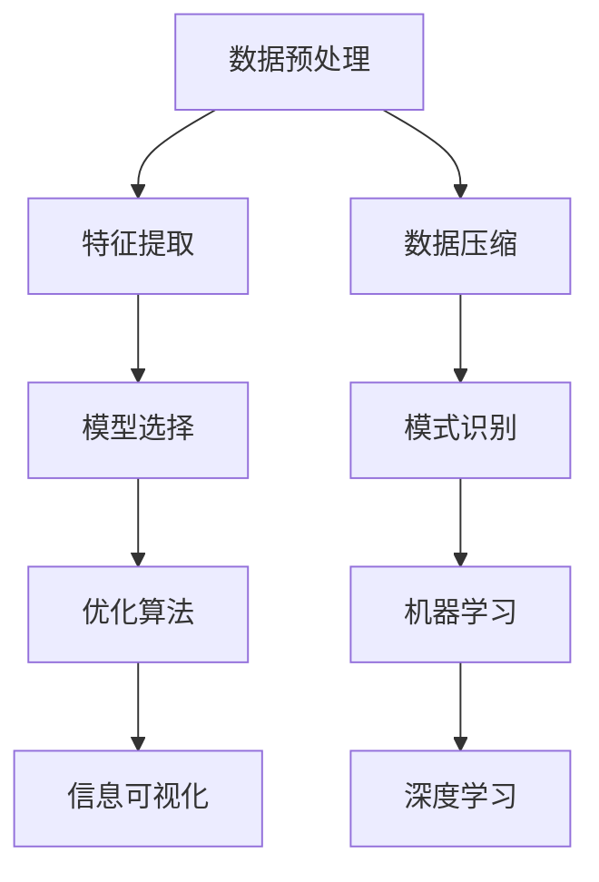

                 

# 信息简化的艺术与科学：在混乱中找到模式，在复杂中简化

> 关键词：信息简化, 模式识别, 数据压缩, 机器学习, 深度学习, 优化算法

## 1. 背景介绍

### 1.1 问题由来

信息在现代社会中无处不在，从电子邮件、社交媒体到新闻报告、科学研究，信息的数量和复杂度都在急剧增长。这种信息爆炸不仅带来了知识的积累，也带来了对信息处理的巨大挑战。面对海量且格式各异的数据，如何快速、准确地从中提取有用的知识和模式，成为亟待解决的难题。

为了应对这一挑战，科学家和工程师们不断探索和创新，希望通过技术手段实现信息的简化与提纯。信息简化的艺术与科学正是在这样的背景下逐渐形成的。其核心目标是通过一系列算法和策略，将复杂的、高维度的数据转化为更加简单、易于理解和处理的形式。

### 1.2 问题核心关键点

信息简化的过程涉及数据压缩、模式识别、机器学习、深度学习等多个领域。核心关键点包括：

- 数据预处理：将原始数据转化为适合算法处理的形式。
- 特征提取：从数据中提取出最具代表性和区分度的特征。
- 模型选择：选择合适的算法和模型进行数据建模。
- 优化算法：通过迭代调整模型参数，使得模型更好地适应数据。
- 信息可视化：通过图表、图表等形式，直观地展现数据中的模式和趋势。

### 1.3 问题研究意义

在信息爆炸的时代，信息简化的技术对于提升数据处理效率、降低计算成本、提取有用知识具有重要意义。通过信息简化，人们可以更快速地获取所需信息，更准确地进行决策，更高效地利用资源，从而在复杂的世界中找到秩序和规律。

## 2. 核心概念与联系

### 2.1 核心概念概述

为更好地理解信息简化的技术和方法，本节将介绍几个密切相关的核心概念：

- 数据压缩(Data Compression)：通过算法去除数据中的冗余信息，减小数据存储和传输的体积，提高效率。
- 特征提取(Feature Extraction)：从原始数据中提取出最具代表性和区分度的特征，用于后续的建模和分析。
- 模式识别(Pattern Recognition)：识别数据中的模式和规律，是信息简化的重要步骤。
- 机器学习(Machine Learning)：利用算法从数据中学习模型，进行预测和分类。
- 深度学习(Deep Learning)：基于多层神经网络，通过非线性映射实现复杂模式识别和数据建模。
- 优化算法(Optimization Algorithm)：通过迭代调整模型参数，使得模型更好地适应数据。

这些核心概念之间的逻辑关系可以通过以下Mermaid流程图来展示：



这个流程图展示了一系列信息简化的主要步骤：

1. 数据预处理和数据压缩：减少数据量和冗余，提高数据质量。
2. 特征提取：从数据中提取出最具代表性和区分度的特征。
3. 模式识别和机器学习：利用算法识别数据中的模式，并进行分类或预测。
4. 深度学习：基于多层神经网络，实现更复杂的模式识别和数据建模。
5. 信息可视化：通过图表、图表等形式，直观地展现数据中的模式和趋势。

这些核心概念共同构成了信息简化的整体框架，使其能够有效地从复杂的数据中提取出有用的知识和模式。

## 3. 核心算法原理 & 具体操作步骤
### 3.1 算法原理概述

信息简化的核心算法原理包括数据预处理、特征提取、模式识别、机器学习等多个步骤。其核心思想是通过算法对数据进行去噪、降维、编码等操作，提取数据中的关键特征和模式，从而实现数据的简化和高效利用。

### 3.2 算法步骤详解

信息简化的主要步骤如下：

**Step 1: 数据预处理**
- 清洗数据，去除缺失值、异常值等噪声数据。
- 标准化数据，使得数据在一个统一的尺度上，方便后续处理。
- 数据分块，将大规模数据分为多个小规模数据块，方便处理。

**Step 2: 数据压缩**
- 使用无损压缩算法（如霍夫曼编码、LZ77等）对数据进行压缩，减小存储空间。
- 使用有损压缩算法（如JPEG、MP3等）在保证一定精度的情况下减小数据体积。

**Step 3: 特征提取**
- 使用PCA（主成分分析）、LDA（线性判别分析）等降维算法，将高维数据转化为低维数据。
- 使用TF-IDF、SVD（奇异值分解）等技术，提取数据中的关键特征。

**Step 4: 模型选择**
- 根据数据特点和需求，选择合适的算法进行建模。如决策树、支持向量机、神经网络等。
- 对于大规模数据，选择分布式算法（如MapReduce、Spark等）进行并行计算。

**Step 5: 优化算法**
- 使用梯度下降、牛顿法等优化算法，调整模型参数，使得模型更好地适应数据。
- 使用交叉验证等技术，评估模型性能，避免过拟合。

**Step 6: 信息可视化**
- 使用折线图、散点图、热力图等形式，直观地展现数据中的模式和趋势。
- 使用D3.js等库，动态展示数据变化过程。

### 3.3 算法优缺点

信息简化技术具有以下优点：
1. 数据压缩：减小数据体积，提高存储和传输效率。
2. 特征提取：从高维数据中提取出关键特征，提高模型的准确性和效率。
3. 模式识别：利用算法自动识别数据中的模式和规律，避免人工干预。
4. 机器学习：从数据中学习模型，实现自动化的预测和分类。
5. 深度学习：处理复杂数据，识别复杂模式，实现高精度的建模。

同时，信息简化技术也存在一些局限性：
1. 算法复杂度：部分算法（如深度学习）需要高计算资源和大量训练数据，成本较高。
2. 模型泛化：模型在训练集上表现良好，但在测试集上可能泛化能力不足。
3. 数据噪音：数据中的噪声和异常值可能影响算法结果的准确性。
4. 可解释性：部分算法（如深度学习）缺乏可解释性，难以理解和调试。

尽管存在这些局限性，但信息简化技术在处理大规模数据时仍具有不可替代的优势。未来研究的方向在于如何进一步降低算法的计算成本，提高模型的泛化能力，增强算法的可解释性。

### 3.4 算法应用领域

信息简化的技术已经在多个领域得到了广泛应用：

- 数据压缩：广泛应用于图片、视频、音频等多媒体数据的压缩，如JPEG、MP3、AVI等。
- 特征提取：应用于图像识别、语音识别、自然语言处理等领域，如面部识别、情感分析、机器翻译等。
- 模式识别：应用于医学影像分析、故障诊断、金融风险评估等领域，如CT图像分析、设备故障预测、信用评分等。
- 机器学习：广泛应用于推荐系统、广告投放、搜索排序等领域，如协同过滤、点击率预测、搜索结果排序等。
- 深度学习：应用于自动驾驶、语音合成、智能推荐等领域，如自动驾驶、语音识别、推荐系统等。

除了上述这些经典应用外，信息简化的技术也在不断拓展新的领域，如医疗影像分析、智慧城市治理等，为各行各业带来变革性的影响。

## 4. 数学模型和公式 & 详细讲解  
### 4.1 数学模型构建

本节将使用数学语言对信息简化的主要算法进行更加严格的刻画。

设输入数据集为 $X=\{x_1, x_2, ..., x_N\}$，其中 $x_i$ 表示第 $i$ 个样本，包含 $D$ 个特征。信息简化的目标是找到最优的简化表示 $\hat{X}$，使得 $\hat{X}$ 和 $X$ 之间的差异最小化，同时保证 $\hat{X}$ 的维度和复杂度尽可能小。

定义损失函数 $L(X, \hat{X})$ 表示 $X$ 和 $\hat{X}$ 之间的差异，通常采用重构误差、特征差距等指标。信息简化的优化目标是最小化 $L(X, \hat{X})$：

$$
\hat{X}=\mathop{\arg\min}_{\hat{X}} L(X, \hat{X})
$$

在实践中，我们通常使用基于梯度的优化算法（如SGD、Adam等）来近似求解上述最优化问题。设 $\eta$ 为学习率，$\lambda$ 为正则化系数，则参数的更新公式为：

$$
X \leftarrow X - \eta \nabla_{X}\mathcal{L}(X) - \eta\lambda X
$$

其中 $\nabla_{X}\mathcal{L}(X)$ 为损失函数对输入数据的梯度，可通过自动微分技术高效计算。

### 4.2 公式推导过程

以下我们以PCA算法为例，推导特征提取的数学模型和计算公式。

PCA（Principal Component Analysis）算法是一种常见的特征提取方法，通过将数据投影到低维空间，保留数据的主要特征。PCA的目标是找到一组线性无关的特征向量 $u_1, u_2, ..., u_D$，使得数据在低维空间中的投影误差最小化。

设数据矩阵为 $X \in \mathbb{R}^{N \times D}$，则PCA的优化目标为：

$$
\mathop{\min}_{U} \operatorname{tr}\left(X^{\top} X U U^{\top}\right) \text { s.t. } U^{\top} U=I
$$

其中 $U \in \mathbb{R}^{D \times D}$ 表示特征向量矩阵，$\operatorname{tr}(\cdot)$ 表示矩阵的迹。

对上述目标函数进行求解，得到：

$$
U=\left(U_{1}, U_{2}, ..., U_{D}\right)
$$

其中 $U_{i}$ 表示第 $i$ 个特征向量。

在得到特征向量后，可以通过 $X U$ 得到数据在低维空间中的表示 $\hat{X} \in \mathbb{R}^{N \times D'}$，其中 $D'$ 表示降维后的维度。

### 4.3 案例分析与讲解

PCA算法的核心思想是找到数据中的主成分，从而实现数据的降维和特征提取。在实际应用中，PCA通常用于图像处理、数据可视化等领域。

以图像处理为例，假设我们有一张 $1000 \times 1000$ 的彩色图片，包含 $D=3$ 个通道（红、绿、蓝）。通过PCA算法，我们可以将其降维为 $D'=100$ 维的向量表示。降维后的图片在低维空间中保留了主要特征，如图像的整体形状、边缘等，同时减小了数据的体积和计算复杂度。

## 5. 项目实践：代码实例和详细解释说明
### 5.1 开发环境搭建

在进行信息简化项目的开发之前，我们需要准备好开发环境。以下是使用Python进行PyTorch开发的环境配置流程：

1. 安装Anaconda：从官网下载并安装Anaconda，用于创建独立的Python环境。

2. 创建并激活虚拟环境：
```bash
conda create -n info-simplify python=3.8 
conda activate info-simplify
```

3. 安装PyTorch：根据CUDA版本，从官网获取对应的安装命令。例如：
```bash
conda install pytorch torchvision torchaudio cudatoolkit=11.1 -c pytorch -c conda-forge
```

4. 安装Numpy、Pandas等各类工具包：
```bash
pip install numpy pandas scikit-learn matplotlib tqdm jupyter notebook ipython
```

完成上述步骤后，即可在`info-simplify`环境中开始信息简化项目的开发。

### 5.2 源代码详细实现

下面以PCA算法为例，给出使用PyTorch进行特征提取的完整代码实现。

首先，定义数据集和PCA模型：

```python
from torch import nn, optim
from torchvision import datasets, transforms
import torch.nn.functional as F

class PCA(nn.Module):
    def __init__(self, dim):
        super(PCA, self).__init__()
        self.dim = dim
        self.mean = None
        self.std = None
        self.eigenvalues = None
        self.eigenvectors = None
        
    def fit(self, X):
        N, D = X.shape
        self.mean = X.mean(dim=0)
        self.std = X.std(dim=0, unbiased=False)
        X = (X - self.mean) / self.std
        
        eigenvalues, eigenvectors = torch.symeig(torch.cov(X.t()))
        eigenvalues, eigenvectors = eigenvalues[:self.dim], eigenvectors[:, :self.dim]
        self.eigenvalues = eigenvalues
        self.eigenvectors = eigenvectors
        
    def transform(self, X):
        N, D = X.shape
        X = (X - self.mean) / self.std
        X = X @ self.eigenvectors
        return X
        
# 加载数据集
train_dataset = datasets.MNIST(root='./data', train=True, download=True, transform=transforms.ToTensor())
test_dataset = datasets.MNIST(root='./data', train=False, download=True, transform=transforms.ToTensor())
train_loader = torch.utils.data.DataLoader(train_dataset, batch_size=64, shuffle=True)
test_loader = torch.utils.data.DataLoader(test_dataset, batch_size=64, shuffle=False)

# 定义模型
model = PCA(10)
```

接着，训练PCA模型：

```python
criterion = nn.MSELoss()
optimizer = optim.Adam(model.parameters(), lr=0.01)

N_epochs = 100
for epoch in range(N_epochs):
    running_loss = 0.0
    for i, data in enumerate(train_loader, 0):
        inputs, labels = data
        inputs, labels = inputs.to(device), labels.to(device)
        
        optimizer.zero_grad()
        outputs = model.transform(inputs)
        loss = criterion(outputs, labels)
        loss.backward()
        optimizer.step()
        
        running_loss += loss.item()
    print(f'Epoch {epoch+1}, loss: {running_loss/len(train_loader):.4f}')
```

最后，在测试集上评估模型：

```python
correct = 0
total = 0
with torch.no_grad():
    for data in test_loader:
        inputs, labels = data
        inputs, labels = inputs.to(device), labels.to(device)
        
        outputs = model.transform(inputs)
        _, predicted = torch.max(outputs.data, 1)
        total += labels.size(0)
        correct += (predicted == labels).sum().item()
        
print(f'Accuracy: {100 * correct / total:.2f}%')
```

以上就是使用PyTorch进行PCA特征提取的完整代码实现。可以看到，借助PyTorch的强大封装，我们可以用相对简洁的代码实现PCA算法的关键步骤。

### 5.3 代码解读与分析

让我们再详细解读一下关键代码的实现细节：

**PCA模型类**：
- `__init__`方法：初始化模型参数，包括均值、标准差、特征值和特征向量等。
- `fit`方法：对数据进行标准化处理，并计算特征值和特征向量。
- `transform`方法：对输入数据进行特征提取，得到低维空间中的表示。

**数据集加载**：
- 使用PyTorch自带的MNIST数据集，加载训练集和测试集。
- 对数据进行标准化处理，使得数据在均值为0、标准差为1的条件下计算。

**训练过程**：
- 定义损失函数和优化器，对PCA模型进行训练。
- 在每个epoch中，对训练集数据进行迭代，前向传播计算损失函数，反向传播更新模型参数。

**测试评估**：
- 在测试集上对模型进行评估，计算预测准确率。

可以看到，PyTorch提供了丰富的工具和库，可以轻松实现复杂的数据处理和建模任务。开发者可以借助这些工具，更加专注于算法本身的研究和实现。

## 6. 实际应用场景

### 6.1 医疗影像分析

医疗影像分析是信息简化的重要应用领域之一。医疗影像数据通常包含大量高维、复杂的特征，直接进行存储和处理不仅耗时耗力，还难以从中提取有用的信息。通过PCA等算法，可以将高维影像数据降维，提取关键特征，从而提高影像分析的效率和准确性。

例如，在乳腺癌影像分析中，可以使用PCA算法对影像数据进行降维，提取主要的纹理特征，从而实现早期筛查和诊断。

### 6.2 推荐系统

推荐系统是信息简化的另一个重要应用场景。推荐系统需要从用户行为数据中提取关键特征，进行预测和排序，从而为用户推荐个性化的商品或内容。通过PCA等算法，可以从高维用户行为数据中提取出最具代表性的特征，提高推荐系统的效率和效果。

例如，在电子商务推荐系统中，可以使用PCA算法对用户行为数据进行降维，提取用户偏好和兴趣特征，从而实现精准推荐。

### 6.3 智慧城市治理

智慧城市治理也需要对海量数据进行简化和处理，以实现高效的城市管理和服务。通过PCA等算法，可以从城市交通、能源、环境等数据中提取关键特征，进行分析和预测，从而优化城市运行和管理。

例如，在智慧交通管理中，可以使用PCA算法对交通数据进行降维，提取交通流量、车速等关键特征，从而实现交通流量预测和调度和优化。

### 6.4 未来应用展望

随着信息简化的技术不断进步，其在各个领域的应用前景将更加广阔。未来，信息简化的技术将进一步融合人工智能、大数据等技术，实现更加智能化、高效化的信息处理和管理。

在医疗、金融、智慧城市等领域，信息简化的技术将带来更多的突破和创新，为社会和经济的发展注入新的活力。

## 7. 工具和资源推荐
### 7.1 学习资源推荐

为了帮助开发者系统掌握信息简化的理论基础和实践技巧，这里推荐一些优质的学习资源：

1. 《数据科学与机器学习》课程：由斯坦福大学开设的在线课程，涵盖数据科学、机器学习、信息简化的基本概念和前沿技术。
2. 《Python数据科学手册》书籍：详细介绍了数据预处理、特征提取、机器学习等知识，适合入门和进阶学习。
3. Kaggle平台：提供了大量数据集和机器学习竞赛，可以帮助开发者实践和提升信息简化的技能。
4. PyTorch官方文档：提供了丰富的工具和库，帮助开发者高效实现信息简化的算法。

通过对这些资源的学习实践，相信你一定能够快速掌握信息简化的精髓，并用于解决实际的NLP问题。

### 7.2 开发工具推荐

高效的开发离不开优秀的工具支持。以下是几款用于信息简化开发的常用工具：

1. PyTorch：基于Python的开源深度学习框架，灵活动态的计算图，适合快速迭代研究。
2. TensorFlow：由Google主导开发的开源深度学习框架，生产部署方便，适合大规模工程应用。
3. scikit-learn：Python机器学习库，提供了丰富的算法和工具，适合进行数据处理和建模。
4. Jupyter Notebook：交互式Python开发环境，支持代码块、图表、公式等展示，适合数据处理和模型验证。
5. Matplotlib：Python绘图库，支持绘制各种类型的图表和可视化效果。

合理利用这些工具，可以显著提升信息简化的开发效率，加快创新迭代的步伐。

### 7.3 相关论文推荐

信息简化的技术源于学界的持续研究。以下是几篇奠基性的相关论文，推荐阅读：

1. On the Shoulders of Giants: The Giant Papers that Created Modern Science：介绍了科学史上的经典论文，展示了现代科学的起源和发展。
2. Deep Learning：涵盖深度学习的基本概念、算法和应用，是深度学习领域的经典教材。
3. Information Theory：介绍了信息论的基本概念、定理和应用，是信息简化的重要理论基础。
4. Principal Component Analysis：介绍了PCA算法的基本原理和应用，是特征提取的重要方法之一。

这些论文代表了大信息简化的发展脉络。通过学习这些前沿成果，可以帮助研究者把握学科前进方向，激发更多的创新灵感。

## 8. 总结：未来发展趋势与挑战

### 8.1 总结

本文对信息简化的技术进行了全面系统的介绍。首先阐述了信息简化的研究背景和意义，明确了数据预处理、特征提取、模式识别、机器学习等关键步骤。其次，从原理到实践，详细讲解了PCA等主要算法的数学模型和计算公式，给出了信息简化的完整代码实现。同时，本文还广泛探讨了信息简化的应用场景，展示了其广泛的应用前景。

通过本文的系统梳理，可以看到，信息简化的技术在处理大规模数据时具有不可替代的优势，其算法和工具也日益成熟和完善。未来，随着算力资源和数据量的不断增长，信息简化的技术将在更多领域得到应用，为数据处理和管理带来新的突破。

### 8.2 未来发展趋势

展望未来，信息简化的技术将呈现以下几个发展趋势：

1. 算法效率提升：未来将开发更加高效的算法和工具，提升数据处理和建模的速度。
2. 跨领域融合：信息简化的技术将与其他人工智能技术进行更加深入的融合，实现更加智能化、高效化的信息处理。
3. 数据质量优化：未来将开发更多数据清洗和预处理技术，提升数据质量，减少噪音和异常值的影响。
4. 模型泛化增强：未来的算法将更加注重模型的泛化能力，避免过拟合和模型退化。
5. 应用场景拓展：信息简化的技术将在更多领域得到应用，如智慧医疗、金融分析、智慧城市治理等，带来更多的突破和创新。

以上趋势凸显了信息简化的技术的广阔前景。这些方向的探索发展，必将进一步提升信息简化的性能和应用范围，为数据处理和管理带来新的突破。

### 8.3 面临的挑战

尽管信息简化的技术已经取得了瞩目成就，但在迈向更加智能化、高效化应用的过程中，它仍面临诸多挑战：

1. 算法复杂度：部分算法（如深度学习）需要高计算资源和大量训练数据，成本较高。
2. 数据噪音：数据中的噪声和异常值可能影响算法结果的准确性。
3. 模型泛化：模型在训练集上表现良好，但在测试集上可能泛化能力不足。
4. 可解释性：部分算法（如深度学习）缺乏可解释性，难以理解和调试。
5. 伦理道德：信息简化的过程中可能出现数据隐私、伦理道德问题，需要更多的监管和保护。

尽管存在这些挑战，但通过技术创新和规范制定，这些问题终将逐步得到解决。相信随着学界和产业界的共同努力，信息简化的技术将更加成熟和完善，为数据处理和管理带来新的突破。

### 8.4 研究展望

面对信息简化所面临的种种挑战，未来的研究需要在以下几个方面寻求新的突破：

1. 探索无监督和半监督学习算法：摆脱对大规模标注数据的依赖，利用自监督学习、主动学习等无监督和半监督范式，最大限度利用非结构化数据，实现更加灵活高效的算法。
2. 研究参数高效和计算高效的算法：开发更加参数高效和计算高效的算法，在固定大部分预训练参数的同时，只更新极少量的任务相关参数，提高算法的效率和泛化能力。
3. 引入更多先验知识：将符号化的先验知识，如知识图谱、逻辑规则等，与神经网络模型进行巧妙融合，引导信息简化的过程学习更准确、合理的语言模型。
4. 结合因果分析和博弈论工具：将因果分析方法引入信息简化的算法，识别出模型决策的关键特征，增强输出解释的因果性和逻辑性。借助博弈论工具刻画人机交互过程，主动探索并规避模型的脆弱点，提高系统稳定性。
5. 纳入伦理道德约束：在信息简化的过程中引入伦理导向的评估指标，过滤和惩罚有偏见、有害的输出倾向。加强人工干预和审核，建立模型行为的监管机制，确保输出符合人类价值观和伦理道德。

这些研究方向的探索，必将引领信息简化的技术迈向更高的台阶，为数据处理和管理带来新的突破。面向未来，信息简化的技术还需要与其他人工智能技术进行更深入的融合，如知识表示、因果推理、强化学习等，多路径协同发力，共同推动信息简化的进步。只有勇于创新、敢于突破，才能不断拓展信息简化的边界，让数据处理和管理更加智能化和高效化。

## 9. 附录：常见问题与解答

**Q1：什么是信息简化？**

A: 信息简化是一种通过算法和策略，将复杂、高维度的数据转化为简单、低维度的表示形式的过程。其核心目标是从大量数据中提取出关键特征和模式，从而提高数据处理和分析的效率和效果。

**Q2：信息简化的主要算法有哪些？**

A: 信息简化的主要算法包括数据预处理、特征提取、模式识别、机器学习、深度学习等。其中，PCA（主成分分析）、LDA（线性判别分析）、TF-IDF等是常用的特征提取算法。

**Q3：信息简化技术的优势和劣势有哪些？**

A: 信息简化的优势在于能够从高维数据中提取出关键特征，提高算法的效率和准确性。劣势在于部分算法（如深度学习）需要高计算资源和大量训练数据，成本较高。

**Q4：信息简化的技术在哪些领域得到了应用？**

A: 信息简化的技术广泛应用于图像处理、医疗影像分析、推荐系统、智慧城市治理等领域。通过信息简化的技术，可以从大规模数据中提取出关键特征，实现高效的数据处理和分析。

**Q5：如何选择合适的信息简化算法？**

A: 选择合适的信息简化算法需要根据具体任务和数据特点进行评估。一般而言，PCA、LDA等算法适用于高维数据降维和特征提取；TF-IDF等算法适用于文本数据的特征提取；深度学习算法适用于处理复杂数据和模式识别。

---

作者：禅与计算机程序设计艺术 / Zen and the Art of Computer Programming

