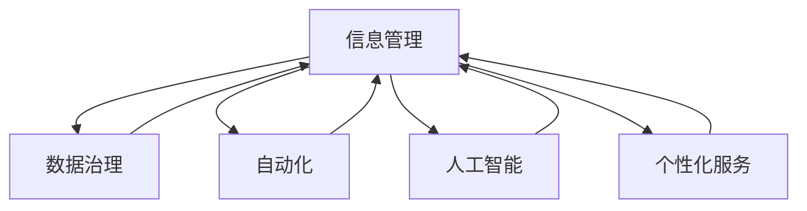

                 

# 信息管理的艺术：如何简化你的生活和工作

> 关键词：信息管理, 数据简化, 自动化, 智能推荐, 个性化服务, 数据治理, 人工智能

## 1. 背景介绍

### 1.1 问题由来

在当今信息爆炸的时代，我们每天面临海量的数据和信息。如何在纷繁复杂的信息中找到自己需要的，并且高效地管理和使用这些信息，成为了现代人的一个重要挑战。这个挑战不仅关乎个人的工作效率，也影响到企业的业务决策和运营。

现代信息管理的复杂性在于其多样性，包括文本、图片、视频、音频等不同格式的数据，以及不同来源、不同主题的数据。如何对这些数据进行有效的组织、存储、检索和分析，成为了一个亟待解决的难题。

### 1.2 问题核心关键点

信息管理的核心在于如何高效地组织和管理数据，使其可以被迅速检索、分析和应用。在技术层面，这个问题可以转化为如何设计和实现一个高效、智能的信息管理系统。在实际应用中，信息管理系统的目标包括：

- **数据存储和组织**：如何设计一个合理的存储架构，使得数据可以被高效地存取。
- **数据检索和分析**：如何通过高效的算法和工具，快速地检索和分析数据。
- **自动化和智能化**：如何通过人工智能和自动化技术，提高信息管理的效率和准确性。
- **个性化服务**：如何根据用户的行为和偏好，提供个性化的信息服务。
- **数据治理**：如何确保数据的质量和安全，维护数据的一致性和完整性。

## 2. 核心概念与联系

### 2.1 核心概念概述

为了深入理解信息管理的艺术，我们首先需要明确几个关键概念：

- **信息管理**：通过技术手段对数据进行采集、存储、组织、检索、分析和应用的过程。其目标是提高数据处理的效率和效果，支持决策和业务运营。
- **数据治理**：确保数据的质量、安全、一致性和完整性，包括数据源管理、元数据管理、数据清洗、数据治理等环节。
- **自动化**：通过程序和算法，自动化地完成数据处理和分析任务，减少人工干预，提高效率。
- **人工智能**：利用机器学习和深度学习技术，提高信息管理的智能化水平，实现自动化的数据理解和分析。
- **个性化服务**：根据用户的行为和偏好，提供个性化的信息推荐和服务。

这些概念之间的关系可以通过以下Mermaid流程图来展示：



这个流程图展示了一个完整的现代信息管理系统所需的关键组件，以及它们之间的相互作用和依赖关系。

## 3. 核心算法原理 & 具体操作步骤
### 3.1 算法原理概述

信息管理的核心算法原理主要包括数据存储、数据检索、数据清洗和数据治理等。以下是对这些算法的概述：

- **数据存储**：通过设计合理的存储架构，如分布式文件系统、数据库、数据湖等，实现高效的数据存储和访问。
- **数据检索**：通过索引、搜索算法和数据库技术，实现对数据的快速检索和查询。
- **数据清洗**：通过数据清洗和预处理算法，去除数据中的噪声、缺失值和不一致性，确保数据的准确性。
- **数据治理**：通过元数据管理、数据源管理和数据质量控制，确保数据的完整性和一致性。

### 3.2 算法步骤详解

以下是一个详细的信息管理系统设计步骤，包含数据采集、存储、清洗、检索和分析等环节：

**Step 1: 数据采集**
- 设计数据采集系统，自动从不同来源（如社交媒体、网站、传感器等）收集数据。
- 使用API和爬虫技术，确保数据的全面性和时效性。

**Step 2: 数据存储**
- 选择合适的存储架构，如分布式文件系统（Hadoop、Hive）或关系型数据库（MySQL、PostgreSQL）。
- 设计合适的数据分区和索引策略，提高数据的读写性能。

**Step 3: 数据清洗**
- 使用数据清洗工具（如ETL工具、Pandas）去除数据中的噪声、缺失值和不一致性。
- 设计数据质量控制流程，确保数据的准确性和完整性。

**Step 4: 数据检索**
- 设计高效的数据索引和搜索算法，支持全文搜索、模糊匹配等检索需求。
- 使用数据库技术和搜索引擎（如Elasticsearch、Solr）实现高效的查询和检索。

**Step 5: 数据分析**
- 使用数据处理工具（如Spark、Hive）进行数据预处理和分析。
- 应用机器学习和深度学习技术，进行数据分析和模型训练。

### 3.3 算法优缺点

信息管理算法的优点包括：

- **效率高**：通过自动化和算法优化，提高了数据处理和分析的效率。
- **准确性好**：通过数据清洗和质量控制，提高了数据处理的准确性。
- **灵活性高**：通过分布式存储和处理，支持大规模数据的管理。

同时，这些算法也存在一些局限性：

- **复杂度高**：设计和实现一个高效的信息管理系统需要较高的技术水平和经验。
- **成本高**：数据存储和处理需要较高的硬件和软件投入。
- **隐私和安全问题**：需要确保数据的安全性和隐私性，防止数据泄露和滥用。

### 3.4 算法应用领域

信息管理算法已经在多个领域得到了广泛的应用，例如：

- **企业运营**：在供应链管理、客户关系管理、市场营销等领域，帮助企业进行数据管理和决策支持。
- **智能推荐系统**：通过分析用户行为和偏好，提供个性化的商品、内容和广告推荐。
- **金融科技**：在风险管理、信用评估、客户服务等环节，利用数据进行分析和决策。
- **医疗健康**：在电子病历、健康监测、疾病预测等领域，利用数据进行医疗决策和疾病管理。
- **社交媒体**：在用户行为分析、内容推荐、广告投放等领域，利用数据进行运营优化。

## 4. 数学模型和公式 & 详细讲解  
### 4.1 数学模型构建

在信息管理中，我们通常使用数学模型来描述数据和算法的行为。以下是几个常见的数学模型：

- **线性回归模型**：用于描述数据中的线性关系，常见于预测和回归分析。
- **逻辑回归模型**：用于二分类问题，通过sigmoid函数将线性回归结果映射到[0,1]区间，用于分类预测。
- **决策树模型**：用于分类和回归问题，通过树形结构进行数据分类和预测。
- **随机森林模型**：通过集成多个决策树，提高模型的泛化能力和鲁棒性。

### 4.2 公式推导过程

以下是一个简单的线性回归模型的公式推导过程：

假设我们有一组数据 $(x_i, y_i)$，其中 $x_i$ 是特征，$y_i$ 是目标变量。我们希望通过一个线性模型来拟合这组数据，即：

$$ y_i = \beta_0 + \beta_1 x_i + \epsilon_i $$

其中 $\beta_0$ 和 $\beta_1$ 是模型参数，$\epsilon_i$ 是误差项。为了估计这些参数，我们通常使用最小二乘法，即最小化误差平方和：

$$ \sum_{i=1}^n (y_i - \hat{y}_i)^2 $$

其中 $\hat{y}_i$ 是模型预测值。根据最小二乘法，我们可以得到参数的估计值：

$$ \hat{\beta}_0 = \frac{\sum_{i=1}^n x_i y_i - \frac{1}{n} \sum_{i=1}^n x_i^2 \sum_{i=1}^n y_i^2}{\sum_{i=1}^n x_i^2} $$

$$ \hat{\beta}_1 = \frac{\sum_{i=1}^n x_i y_i - \frac{1}{n} \sum_{i=1}^n x_i^2 \sum_{i=1}^n y_i^2}{\sum_{i=1}^n x_i^2} $$

### 4.3 案例分析与讲解

以下是一个实际案例，展示如何使用线性回归模型进行数据预测：

假设我们有一组房屋销售数据，其中包含房屋面积、房屋价格和房屋位置等特征，以及房屋销售价格作为目标变量。我们可以使用线性回归模型来预测新房屋的价格：

```python
import pandas as pd
import numpy as np
from sklearn.linear_model import LinearRegression

# 加载数据
data = pd.read_csv('house_sales.csv')

# 划分训练集和测试集
train_data = data[:8000]
test_data = data[8000:]

# 选择特征和目标变量
X_train = train_data[['area', 'location']]
y_train = train_data['price']

X_test = test_data[['area', 'location']]
y_test = test_data['price']

# 训练模型
model = LinearRegression()
model.fit(X_train, y_train)

# 预测结果
y_pred = model.predict(X_test)

# 评估模型
print('模型R^2得分：', model.score(X_test, y_test))
```

通过这个案例，我们可以看到如何使用线性回归模型进行数据预测，并评估模型的性能。

## 5. 项目实践：代码实例和详细解释说明
### 5.1 开发环境搭建

在进行信息管理系统的开发之前，我们需要准备好开发环境。以下是使用Python进行项目开发的常见环境配置步骤：

1. 安装Anaconda：从官网下载并安装Anaconda，用于创建独立的Python环境。

2. 创建并激活虚拟环境：
```bash
conda create -n info_env python=3.8 
conda activate info_env
```

3. 安装Python和相关依赖包：
```bash
conda install pandas numpy matplotlib scikit-learn
```

4. 安装相关数据处理和分析工具：
```bash
conda install elasticsearch elasticsearch-hadoop apache-spark
```

5. 安装相关的第三方库：
```bash
pip install pytorch transformers elasticsearch-hadoop apache-spark
```

完成上述步骤后，即可在`info_env`环境中开始信息管理系统的开发工作。

### 5.2 源代码详细实现

以下是一个使用PyTorch进行信息管理系统开发的数据清洗和预处理示例代码：

```python
import pandas as pd
import numpy as np
import torch
from torch.utils.data import DataLoader
from torch.utils.data.dataset import Dataset

# 加载数据
data = pd.read_csv('data.csv')

# 定义数据集
class MyDataset(Dataset):
    def __init__(self, data):
        self.data = data
        
    def __len__(self):
        return len(self.data)
    
    def __getitem__(self, idx):
        x = self.data.iloc[idx]['features']
        y = self.data.iloc[idx]['labels']
        return x, y

# 定义数据预处理函数
def preprocess_data(data):
    # 特征选择和归一化
    features = data[['feature1', 'feature2']]
    features = (features - features.mean()) / features.std()
    
    # 标签编码
    labels = data['labels']
    return features, labels

# 数据预处理
features, labels = preprocess_data(data)

# 定义模型
model = torch.nn.Linear(2, 1)

# 定义损失函数和优化器
criterion = torch.nn.MSELoss()
optimizer = torch.optim.SGD(model.parameters(), lr=0.01)

# 训练模型
for epoch in range(100):
    for x, y in DataLoader(features, labels, batch_size=64):
        optimizer.zero_grad()
        output = model(x)
        loss = criterion(output, y)
        loss.backward()
        optimizer.step()
        
    if (epoch+1) % 10 == 0:
        print('Epoch {}, Loss: {}'.format(epoch+1, loss.item()))

# 保存模型
torch.save(model.state_dict(), 'model.pth')
```

### 5.3 代码解读与分析

让我们再详细解读一下关键代码的实现细节：

**MyDataset类**：
- `__init__`方法：初始化数据集，并将数据存储在`self.data`属性中。
- `__len__`方法：返回数据集的样本数量。
- `__getitem__`方法：对单个样本进行处理，返回特征和标签。

**数据预处理函数**：
- 对特征进行特征选择和归一化处理，去除噪声和缺失值。
- 对标签进行编码，方便模型训练。

**模型定义**：
- 定义一个简单的线性回归模型，输入特征维度为2，输出标签维度为1。

**训练模型**：
- 使用PyTorch的DataLoader对数据进行批次化加载，供模型训练和推理使用。
- 训练模型时，计算损失函数并更新模型参数，每个epoch更新一次。
- 在训练过程中，定期输出损失值，监控模型训练进度。
- 最终保存模型参数，以便于后续使用。

以上代码实现了简单的数据预处理和模型训练，展示了如何使用PyTorch进行信息管理系统的开发。

## 6. 实际应用场景
### 6.1 智能推荐系统

智能推荐系统是一种基于用户行为和偏好，提供个性化商品、内容和广告推荐的应用。通过分析用户的历史行为和评分数据，智能推荐系统可以实时调整推荐结果，提高用户满意度。

以下是一个简单的智能推荐系统架构图：


智能推荐系统的核心组件包括：

- **用户行为分析**：通过日志、评分、点击等数据，分析用户的行为和偏好。
- **用户特征提取**：将用户行为数据转换为特征向量，供推荐模型使用。
- **商品特征提取**：将商品属性、评分等数据转换为特征向量，供推荐模型使用。
- **评分数据构建**：构建用户和商品之间的评分矩阵，用于训练推荐模型。
- **推荐模型训练**：通过机器学习算法（如协同过滤、基于内容的推荐、深度学习等）训练推荐模型。
- **推荐结果生成**：根据用户特征和商品特征，生成推荐结果。

### 6.2 数据治理

数据治理是确保数据质量和安全的重要环节。以下是一个简单的数据治理架构图：


数据治理的组件包括：

- **数据采集**：通过API、爬虫等技术，从不同来源收集数据。
- **数据清洗**：通过ETL工具和脚本，清洗数据中的噪声、缺失值和不一致性，确保数据的准确性和完整性。
- **数据存储**：通过分布式文件系统或关系型数据库，存储和管理数据。
- **数据质量控制**：通过元数据管理和规则约束，确保数据的一致性和完整性。
- **数据监控**：通过日志和报警系统，实时监控数据的读写状态和系统性能。

### 6.3 未来应用展望

随着信息管理技术的不断进步，未来的信息管理系统将更加智能、高效和安全。以下是一些未来的应用展望：

- **自适应学习系统**：通过机器学习算法，系统可以自适应地学习和优化数据处理流程，提高处理效率。
- **智能搜索系统**：通过自然语言处理技术，用户可以通过自然语言搜索数据，提高检索效率。
- **数据可视化系统**：通过数据可视化工具，用户可以更直观地理解和分析数据。
- **跨平台数据管理**：通过统一的API和协议，用户可以在不同的平台和设备上访问和管理数据。
- **多源数据融合**：通过数据整合和融合技术，用户可以更方便地访问和利用来自不同来源的数据。

## 7. 工具和资源推荐
### 7.1 学习资源推荐

为了帮助开发者掌握信息管理的核心技术，以下是一些优秀的学习资源：

1. **《数据科学基础》**：由斯坦福大学开设的课程，涵盖了数据采集、数据清洗、数据分析等多个方面，是数据科学入门的经典课程。
2. **《Python数据科学手册》**：由知名数据科学家编写，全面介绍了Python在数据科学中的应用。
3. **《数据治理与数据管理》**：介绍了数据治理的基础知识和最佳实践，适合从事数据管理工作的人员。
4. **《深度学习与人工智能》**：介绍了深度学习的基础和应用，涵盖了深度学习模型、算法和工具。
5. **《机器学习实战》**：通过实际案例，介绍了机器学习算法的实现和应用。

这些资源可以帮助开发者系统地掌握信息管理的核心技术，并将其应用到实际项目中。

### 7.2 开发工具推荐

信息管理的开发离不开优秀的工具支持。以下是几款用于信息管理系统开发的常用工具：

1. **Python**：基于Python的开发语言，具有丰富的第三方库和框架，适用于各种数据处理和分析任务。
2. **Hadoop**：用于大数据处理和分布式存储，支持大规模数据的存储和处理。
3. **Spark**：用于大数据处理和分布式计算，支持多种数据处理任务。
4. **Elasticsearch**：用于大数据搜索和分析，支持全文搜索和分布式存储。
5. **Apache Kafka**：用于大数据流处理和数据分发，支持实时数据的采集和处理。

这些工具可以帮助开发者高效地进行信息管理系统的开发和部署，提高开发效率和系统性能。

### 7.3 相关论文推荐

信息管理技术的发展离不开学界的持续研究。以下是几篇奠基性的相关论文，推荐阅读：

1. **《数据清洗算法综述》**：总结了数据清洗的基本算法和应用场景，适合从事数据处理工作的人员。
2. **《分布式数据处理框架》**：介绍了Hadoop和Spark等分布式数据处理框架，适合从事大数据处理工作的人员。
3. **《数据治理体系建设》**：介绍了数据治理的基础知识和最佳实践，适合从事数据管理工作的人员。
4. **《深度学习在信息管理中的应用》**：介绍了深度学习在信息管理系统中的应用，适合从事数据科学工作的人员。
5. **《自适应学习系统设计》**：介绍了自适应学习系统的工作原理和实现方法，适合从事机器学习和AI应用的人员。

这些论文代表了大数据、深度学习和数据治理等领域的发展脉络，对开发人员具有重要的参考价值。

## 8. 总结：未来发展趋势与挑战
### 8.1 总结

本文对信息管理系统的设计、实现和应用进行了全面系统的介绍。首先阐述了信息管理系统的核心概念和设计原则，明确了信息管理的核心目标和挑战。其次，从算法原理到操作步骤，详细讲解了信息管理系统设计的各个环节，给出了完整的代码实例。同时，本文还探讨了信息管理系统在智能推荐、数据治理等实际应用场景中的广泛应用，展示了信息管理技术的巨大潜力。

通过本文的系统梳理，可以看到，信息管理系统是现代社会中不可或缺的重要技术，其核心在于高效地组织、管理和利用数据。未来，信息管理系统将随着技术的不断进步，变得更加智能、高效和安全。

### 8.2 未来发展趋势

展望未来，信息管理系统将呈现以下几个发展趋势：

1. **智能化水平提高**：通过人工智能和机器学习技术，信息管理系统将更加智能，能够自适应地学习和优化数据处理流程。
2. **跨平台支持增强**：信息管理系统将支持多种平台和设备，实现跨平台的数据管理和应用。
3. **多源数据融合**：信息管理系统将更好地整合来自不同来源的数据，实现数据的全面利用。
4. **数据安全保障**：信息管理系统将加强数据的安全性和隐私保护，防止数据泄露和滥用。
5. **实时性要求提高**：信息管理系统将实现实时数据处理和分析，提高数据的时效性。

### 8.3 面临的挑战

尽管信息管理系统的发展前景广阔，但在实现智能化、高效化和安全化的过程中，仍然面临诸多挑战：

1. **数据隐私和安全问题**：信息管理系统需要确保数据的安全性和隐私性，防止数据泄露和滥用。
2. **技术复杂度高**：信息管理系统的设计和实现需要较高的技术水平和经验，需要综合考虑数据存储、清洗、分析和治理等多个环节。
3. **成本高**：信息管理系统需要较高的硬件和软件投入，对企业的成本压力较大。
4. **数据治理难度大**：信息管理系统的数据治理需要综合考虑数据源、数据质量和数据一致性等多个因素，难度较大。
5. **技术演进快**：信息管理系统需要不断更新和升级，以适应技术的发展和应用需求的变化。

### 8.4 研究展望

为了应对信息管理系统面临的挑战，未来的研究需要在以下几个方面寻求新的突破：

1. **数据隐私保护技术**：开发更加高效、安全的数据隐私保护技术，确保数据的安全性和隐私性。
2. **跨平台数据管理技术**：开发支持多种平台和设备的数据管理技术，实现数据的全面利用。
3. **数据治理自动化技术**：开发数据治理自动化技术，降低数据治理的复杂度和难度。
4. **智能化数据分析技术**：开发更加智能的数据分析技术，提高数据处理的效率和准确性。
5. **实时数据处理技术**：开发实时数据处理技术，提高数据的时效性和响应速度。

总之，信息管理系统是现代社会中不可或缺的重要技术，未来需要综合考虑数据管理、数据处理和数据分析等多个环节，不断探索新的技术和方法，实现数据的高效利用和智能化应用。

## 9. 附录：常见问题与解答

**Q1：如何选择合适的数据存储架构？**

A: 选择合适的数据存储架构需要考虑多个因素，包括数据的规模、读写频率、一致性需求等。常见的数据存储架构包括：

- **分布式文件系统**：如Hadoop、HDFS等，适合大规模数据的存储和处理，读写频繁，但一致性较差。
- **关系型数据库**：如MySQL、PostgreSQL等，适合结构化数据的存储和处理，读写频繁，一致性较高。
- **NoSQL数据库**：如MongoDB、Cassandra等，适合非结构化数据的存储和处理，读写频繁，一致性较低。

选择数据存储架构时，需要根据具体业务需求进行综合评估，选择合适的架构。

**Q2：数据清洗和预处理有哪些常见的技术？**

A: 数据清洗和预处理是信息管理系统中的重要环节，常见的技术包括：

- **去重**：去除重复数据，确保数据的一致性。
- **缺失值填充**：填充缺失值，确保数据的完整性。
- **数据格式转换**：将数据转换为统一的格式，便于后续处理。
- **数据归一化**：对数据进行归一化处理，提高模型的稳定性和泛化能力。
- **特征选择**：选择对模型预测有帮助的特征，去除无关特征。

数据清洗和预处理是提高数据质量的重要手段，需要根据具体业务需求进行选择和优化。

**Q3：如何在信息管理系统中实现数据可视化？**

A: 数据可视化是信息管理系统中重要的展示手段，可以帮助用户直观地理解和分析数据。常见的数据可视化工具包括：

- **Matplotlib**：基于Python的绘图库，支持多种图表类型的绘制。
- **Tableau**：商业化的数据可视化工具，支持多种数据源和图表类型的绘制。
- **D3.js**：基于Web的图形库，支持动态交互式的图表绘制。

使用数据可视化工具，可以将数据转换为易于理解的图表形式，帮助用户进行数据分析和决策。

**Q4：什么是自适应学习系统？**

A: 自适应学习系统是一种能够自适应学习和优化的系统，通过机器学习算法不断优化数据处理流程，提高系统的性能和效率。常见的自适应学习系统包括：

- **基于规则的系统**：根据预定义的规则和算法进行数据处理和分析。
- **基于统计的系统**：根据数据统计结果进行数据处理和分析，动态调整处理流程。
- **基于机器学习的系统**：通过机器学习算法进行数据处理和分析，不断优化模型和算法。

自适应学习系统能够根据数据和业务需求进行动态调整，提高系统的稳定性和效率。

**Q5：什么是数据治理？**

A: 数据治理是确保数据质量和安全的重要环节，主要包括以下几个方面：

- **数据源管理**：对数据来源进行管理和监控，确保数据的准确性和完整性。
- **元数据管理**：对数据结构和内容进行描述和管理，确保数据的一致性和一致性。
- **数据清洗和预处理**：对数据进行清洗和预处理，去除噪声和不一致性，确保数据的准确性和完整性。
- **数据质量控制**：对数据进行质量控制，确保数据的正确性和一致性。
- **数据安全管理**：对数据进行加密和安全管理，确保数据的安全性和隐私性。

数据治理是信息管理系统中的重要环节，需要综合考虑数据管理、数据处理和数据安全等多个因素，确保数据的质量和安全性。

---

作者：禅与计算机程序设计艺术 / Zen and the Art of Computer Programming

