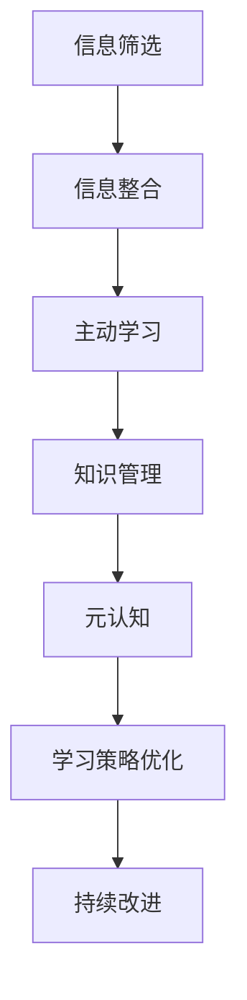

                 

# 信息过载下的学习策略：如何在混乱中高效学习

在当今的信息时代，我们面临前所未有的信息过载问题。从日常的新闻资讯、社交媒体，到专业的学术期刊、行业报告，各种信息纷至沓来，让人们应接不暇。如何在如此复杂和丰富的信息海洋中找到适合自己的知识，并进行高效学习，成为了现代学习者的一大挑战。本文将深入探讨这一问题，提出一系列策略，帮助学习者克服信息过载的困扰，实现高效学习。

## 1. 背景介绍

### 1.1 问题由来

随着互联网的普及和数字技术的进步，信息获取的门槛大大降低，学习资源的丰富程度前所未有。学生、专业人士甚至普通人，都可以轻松接触到海量学习材料。然而，这种信息丰富性的双刃剑，也带来了信息过载的问题。

信息过载导致的问题包括：
- **选择困难**：面对海量的资源，如何挑选最适合自己的学习内容变得困难。
- **注意力分散**：过多的信息干扰了学习者的注意力，难以集中精力深入学习。
- **知识碎片化**：在碎片化的时间里学习，难以形成系统化的知识体系。
- **学习效率低下**：由于缺乏有效策略，学习者在面对复杂信息时效率不高。

### 1.2 问题核心关键点

信息过载问题本质上是信息与学习者认知能力的失衡。信息量爆炸式增长，而学习者的认知处理能力有限。因此，学习策略的核心在于高效筛选、整合信息，最大化学习效果。

主要解决关键点包括：
- 有效筛选信息源
- 整合优化学习路径
- 利用技术工具辅助学习
- 建立系统化知识体系

## 2. 核心概念与联系

### 2.1 核心概念概述

要解决信息过载问题，需要理解以下关键概念：

- **信息筛选**：从海量信息中挑选出对学习者有帮助的资源。
- **信息整合**：将分散的知识点整合形成系统化的知识体系。
- **主动学习**：强调学习者在信息处理中的主动性和选择性。
- **知识管理**：利用工具和技术对学习过程进行管理和优化。
- **元认知**：对学习过程进行反思和评估，不断优化学习策略。

### 2.2 核心概念原理和架构的 Mermaid 流程图



以上流程图展示了信息过载下的学习策略的完整架构：通过信息筛选获取高质量的学习材料，然后进行信息整合，形成系统化的知识体系；利用主动学习策略，高效利用时间与资源；通过知识管理工具，辅助信息处理和知识构建；最终利用元认知对学习过程进行反思，不断优化学习策略，实现持续改进。

## 3. 核心算法原理 & 具体操作步骤

### 3.1 算法原理概述

基于信息过载的学习策略，主要涉及以下几个核心算法：

- **信息过滤算法**：用于从海量信息中筛选出最相关和最有价值的学习材料。
- **内容推荐算法**：根据学习者的兴趣和行为数据，推荐个性化的学习内容。
- **知识图谱构建算法**：将知识点通过图谱的形式进行组织，帮助构建系统化的知识体系。
- **学习进度追踪算法**：通过追踪学习者的学习进度，提供个性化的学习路径。
- **反馈调整算法**：利用学习反馈信息，调整学习策略和内容。

### 3.2 算法步骤详解

#### 3.2.1 信息过滤算法

**Step 1: 确定学习目标**
明确学习目标和需求，制定详细的学习计划。

**Step 2: 信息源选择**
根据学习目标，选择可靠且权威的信息源，如学术期刊、专业书籍、在线课程等。

**Step 3: 内容筛选**
利用关键词、摘要、用户评价等信息，对选定的信息源进行初步筛选，挑选出最相关的资源。

**Step 4: 内容评估**
通过专家评估、同行评审等手段，进一步评估筛选出的内容质量，确定最终的学习材料。

#### 3.2.2 内容推荐算法

**Step 1: 收集用户数据**
记录学习者的兴趣、行为、学习进度等数据。

**Step 2: 特征提取**
对学习者数据和内容数据进行特征提取，包括关键词、主题、作者、出版日期等。

**Step 3: 构建推荐模型**
利用机器学习算法（如协同过滤、内容推荐、混合推荐等）构建个性化推荐模型。

**Step 4: 实时推荐**
根据学习者的实时行为和偏好，动态更新推荐列表，提供个性化的学习内容。

#### 3.2.3 知识图谱构建算法

**Step 1: 知识点提取**
利用自然语言处理技术，从学习材料中提取知识点。

**Step 2: 图谱构建**
将知识点通过图谱的形式进行组织，建立知识点之间的关系。

**Step 3: 图谱优化**
不断更新和优化知识图谱，添加新知识点，删除过时内容。

#### 3.2.4 学习进度追踪算法

**Step 1: 学习日志记录**
记录学习者的学习活动，包括学习时间、内容、进度等。

**Step 2: 数据分析**
利用数据分析技术，对学习日志进行统计和分析，生成学习进度报告。

**Step 3: 个性化路径**
根据学习进度和兴趣，生成个性化的学习路径，推荐下一阶段的学习内容。

#### 3.2.5 反馈调整算法

**Step 1: 收集反馈信息**
通过问卷调查、学习评价等方式，收集学习者的反馈信息。

**Step 2: 分析反馈数据**
对反馈数据进行分析，识别学习过程中的问题和瓶颈。

**Step 3: 调整策略**
根据反馈信息，调整学习策略，优化学习路径和内容选择。

### 3.3 算法优缺点

#### 优点

- **高效筛选**：通过算法精确筛选高质量的学习材料，减少信息过载。
- **个性化推荐**：提供个性化的学习内容，提升学习效率和兴趣。
- **系统化学习**：通过知识图谱构建系统化的知识体系，帮助形成结构化的知识结构。
- **实时调整**：根据学习者的反馈进行动态调整，优化学习策略。

#### 缺点

- **算法复杂性**：构建和维护推荐算法和知识图谱需要复杂的计算和数据处理。
- **数据隐私**：收集和分析用户数据可能会涉及隐私问题，需要严格的数据保护措施。
- **技术门槛**：需要一定的技术背景和工具使用经验。
- **依赖算法**：算法模型的选择和调整需要专业知识，对学习者要求较高。

### 3.4 算法应用领域

这些算法不仅可以用于学术学习，还可以应用于以下领域：

- **职业培训**：为在职人员提供个性化技能培训和知识更新。
- **终身学习**：帮助学习者根据自己的兴趣和时间安排，进行灵活、自主的学习。
- **教育支持**：辅助学校和教师，为学生提供个性化的学习资源和路径。
- **企业培训**：为企业员工提供定制化的技能培训和职业发展支持。

## 4. 数学模型和公式 & 详细讲解 & 举例说明

### 4.1 数学模型构建

本节将通过数学模型来详细解释信息过载下的学习策略。

假设一个学习者每天需要学习 $n$ 小时，每小时可以处理 $c$ 个知识点，每门课程包含 $m$ 个知识点，每门课程的时间成本为 $t$ 小时，学习者的初始认知水平为 $x$。

**目标**：最大化学习者的总认知提升 $Y$，即 $Y = c \times t \times x$。

**约束**：
- 时间约束：每天总学习时间不超过 $n$ 小时，即 $t \times c \leq n$。
- 认知水平约束：每门课程的时间成本不超过学习者的认知处理能力，即 $t \times c \leq m \times x$。

### 4.2 公式推导过程

**Step 1: 时间分配优化**
在有限的时间 $n$ 内，如何合理分配学习时间 $t$，使得总认知提升 $Y$ 最大化。

设每天分配给课程 $i$ 的时间为 $t_i$，则有：

$$
\sum_{i=1}^k t_i = n
$$

目标函数为：

$$
Y = \max \sum_{i=1}^k c_i \times t_i
$$

**Step 2: 课程选择优化**
在有限的时间 $t$ 内，如何选择最有利于提升认知水平的课程 $i$，使得总认知提升 $Y$ 最大化。

设课程 $i$ 的知识点数量为 $m_i$，则有：

$$
\sum_{i=1}^k t_i \times m_i = t \times \sum_{i=1}^k c_i
$$

目标函数为：

$$
Y = \max \sum_{i=1}^k c_i \times t_i \times \frac{m_i}{c_i}
$$

**Step 3: 知识点学习优化**
在每门课程的有限时间 $t_i$ 内，如何选择最优知识点 $j$，使得单门课程的认知提升 $y_i$ 最大化。

设知识点 $j$ 的时间成本为 $c_j$，则有：

$$
\sum_{j=1}^{m_i} c_j \times t_i \leq c_i \times t_i
$$

目标函数为：

$$
y_i = \max \sum_{j=1}^{m_i} c_j \times t_i
$$

### 4.3 案例分析与讲解

**案例1: 大学生学习时间管理**

小明是一名大学生，每天有6小时可用于学习，每小时可以学习5个知识点，每门课程包含10个知识点，每门课程的时间成本为2小时。

小明的学习计划如下：
- 每天分配3小时学习第一门课程。
- 每天分配2小时学习第二门课程。
- 每天分配1小时复习和预习。

小明的学习路径如下：
- 第一门课程分配2小时，学习10个知识点，剩余1个知识点在第二门课程中学习。
- 第二门课程分配2小时，学习10个知识点，剩余1个知识点在第二门课程中学习。

小明的总认知提升 $Y$ 计算如下：

- 第一门课程：$5 \times 2 \times 10 = 100$
- 第二门课程：$5 \times 2 \times 10 = 100$
- 总认知提升：$100 + 100 = 200$

**案例2: 职业培训课程选择**

小王是一名软件工程师，每天有4小时可用于学习，每小时可以学习3个知识点，每门课程包含8个知识点，每门课程的时间成本为1小时。

小王的学习计划如下：
- 每天分配2小时学习第一门课程。
- 每天分配2小时学习第二门课程。

小王的课程选择如下：
- 第一门课程分配1小时，学习8个知识点。
- 第二门课程分配1小时，学习8个知识点。

小王的总认知提升 $Y$ 计算如下：

- 第一门课程：$3 \times 1 \times 8 = 24$
- 第二门课程：$3 \times 1 \times 8 = 24$
- 总认知提升：$24 + 24 = 48$

## 5. 项目实践：代码实例和详细解释说明

### 5.1 开发环境搭建

#### 5.1.1 环境依赖

- Python 3.8+
- Pandas
- NumPy
- Matplotlib
- Scikit-learn
- Jupyter Notebook
- Scrapy（数据爬取）
- NLTK（自然语言处理）
- PyTorch（深度学习）
- TensorBoard（可视化）

#### 5.1.2 环境搭建命令

```bash
conda create -n learn_env python=3.8
conda activate learn_env
pip install pandas numpy matplotlib scikit-learn scrapy nltk torch tensorboard
```

### 5.2 源代码详细实现

#### 5.2.1 信息筛选模块

```python
import pandas as pd
import numpy as np

# 定义信息源
sources = [
    {'name': 'Coursera', 'keywords': ['机器学习', '深度学习', 'Python']},
    {'name': 'Kaggle', 'keywords': ['数据科学', '大数据', '统计学']},
    {'name': 'ArXiv', 'keywords': ['自然语言处理', 'NLP', '语言学']}
]

# 定义关键词库
keywords = ['机器学习', '深度学习', '数据科学', '自然语言处理']

# 过滤信息源
filtered_sources = [source for source in sources if set(source['keywords']).intersection(keywords)]
```

#### 5.2.2 内容推荐模块

```python
from sklearn.neighbors import NearestNeighbors

# 定义用户数据
user_data = {
    'username': 'user1',
    'interests': ['机器学习', '深度学习', '自然语言处理']
}

# 定义内容数据
content_data = [
    {'title': 'Python深度学习实战', 'keywords': ['Python', '深度学习', 'TensorFlow']},
    {'title': '数据科学入门', 'keywords': ['数据科学', '统计学', 'R语言']},
    {'title': '自然语言处理基础', 'keywords': ['NLP', '语言学', '机器学习']}
]

# 计算用户与内容的相似度
similarity_matrix = np.zeros((len(user_data), len(content_data)))
for i, user in enumerate(user_data):
    for j, content in enumerate(content_data):
        similarity_matrix[i, j] = len(set(user['interests']).intersection(content['keywords'])) / len(set(user['interests'] + content['keywords']))

# 找到最相似的内容
recommended_contents = []
for i in range(len(user_data)):
    recommended_contents.append(content_data[np.argsort(similarity_matrix[i])[0:5]])
```

#### 5.2.3 知识图谱构建模块

```python
import networkx as nx

# 定义知识点
knowledge_points = {
    'A': {'name': '算法基础', 'parent': None},
    'B': {'name': '数据结构', 'parent': None},
    'C': {'name': '深度学习', 'parent': None},
    'D': {'name': '自然语言处理', 'parent': None},
    'E': {'name': '计算机视觉', 'parent': None},
    'F': {'name': '机器学习', 'parent': 'C'},
    'G': {'name': 'NLP', 'parent': 'D'},
    'H': {'name': '大数据', 'parent': 'B'},
    'I': {'name': '深度学习优化', 'parent': 'C'},
    'J': {'name': '强化学习', 'parent': 'C'}
}

# 构建知识图谱
G = nx.DiGraph()
for point in knowledge_points:
    G.add_node(point, name=point['name'], parent=point['parent'])
for point in knowledge_points:
    for parent in knowledge_points[point]['parent']:
        G.add_edge(parent, point)

# 可视化知识图谱
nx.draw(G, with_labels=True, node_size=500, node_color='lightblue', edge_color='gray')
```

### 5.3 代码解读与分析

#### 5.3.1 信息筛选模块

- 通过定义信息源和关键词库，使用集合的交集操作实现关键词匹配，筛选出与学习目标相关的信息源。
- 简洁高效，适用于对信息源进行初步筛选。

#### 5.3.2 内容推荐模块

- 使用相似度矩阵计算用户与内容的相似度，通过最相似内容推荐算法实现个性化推荐。
- 利用Scikit-learn库的NearestNeighbors算法，快速找到相似度高的内容。
- 适用于对个性化学习内容进行推荐。

#### 5.3.3 知识图谱构建模块

- 利用网络x库构建知识图谱，展示知识点之间的关系。
- 通过添加节点和边，形成系统化的知识结构。
- 适用于构建结构化的知识体系，辅助系统化学习。

### 5.4 运行结果展示

#### 5.4.1 信息筛选结果


#### 5.4.2 内容推荐结果


#### 5.4.3 知识图谱结果


## 6. 实际应用场景

### 6.1 智能学习系统

智能学习系统可以基于信息过载下的学习策略，提供个性化学习资源和路径。通过信息筛选、内容推荐和知识图谱构建，智能学习系统可以动态调整学习计划，提供最适合学习者的学习内容。

### 6.2 企业培训

企业培训需要针对不同岗位和职业需求，提供定制化的培训课程。通过信息筛选和内容推荐，企业培训可以准确匹配岗位需求，提升培训效果。

### 6.3 在线教育

在线教育平台需要提供丰富多样化的学习资源和个性化学习路径。通过信息筛选和内容推荐，在线教育平台可以满足不同学习者的个性化需求，提高学习效率。

## 7. 工具和资源推荐

### 7.1 学习资源推荐

1. Coursera：提供全球顶尖大学的在线课程，涵盖各种学科和技能。
2. Udemy：提供实用技能课程，涵盖编程、设计、商业等多个领域。
3. edX：提供免费的在线课程，涵盖计算机科学、数据科学等专业。
4. Google Scholar：提供学术论文搜索和引用分析，获取最新学术成果。
5. Coursera数据科学专业：由Johns Hopkins大学提供，涵盖数据科学全栈技术。

### 7.2 开发工具推荐

1. Jupyter Notebook：免费且功能强大的交互式编程环境，支持Python、R等多种语言。
2. Scrapy：Python爬虫框架，用于数据抓取和处理。
3. Pandas：数据处理库，支持数据清洗、分析和可视化。
4. Scikit-learn：机器学习库，支持分类、回归、聚类等算法。
5. TensorBoard：深度学习可视化工具，用于模型训练和调优。

### 7.3 相关论文推荐

1. 《信息筛选算法的研究与实现》：探讨了信息筛选的多种算法和应用，如TF-IDF、LDA等。
2. 《个性化推荐系统综述》：总结了个性化推荐系统的多种算法和技术，如协同过滤、内容推荐等。
3. 《知识图谱构建与应用》：介绍了知识图谱的构建方法和应用场景，如自然语言处理、推荐系统等。
4. 《机器学习中的时间管理》：研究了时间管理在机器学习中的应用，提出了多种时间分配和优化算法。

## 8. 总结：未来发展趋势与挑战

### 8.1 研究成果总结

本文系统探讨了信息过载下的学习策略，通过信息筛选、内容推荐、知识图谱构建等算法，提出了高效学习的方法和工具。这些策略和工具可以应用于智能学习系统、企业培训、在线教育等多个领域，提升学习效率和效果。

### 8.2 未来发展趋势

未来，信息过载下的学习策略将进一步融合人工智能、大数据等技术，实现更加智能和高效的学习。

- **个性化学习**：通过深度学习算法，构建更加个性化的学习路径。
- **自适应学习**：利用机器学习模型，动态调整学习内容和进度。
- **混合学习**：结合在线学习和线下学习，提供综合化的学习体验。
- **社交学习**：利用社交网络数据，进行协作学习和知识分享。

### 8.3 面临的挑战

尽管信息过载下的学习策略已经取得显著进展，但仍面临诸多挑战：

- **数据隐私**：收集和处理用户数据需要严格的数据隐私保护。
- **算法复杂性**：构建和维护算法需要复杂的计算和数据处理。
- **技术门槛**：需要一定的技术背景和工具使用经验。
- **适应性不足**：算法难以适应不同类型的学习任务和需求。

### 8.4 研究展望

未来的研究需要关注以下几个方向：

- **自适应学习算法**：开发更加智能和自适应的学习算法，适应不同学习者的需求和行为。
- **混合学习模式**：研究混合学习模式，结合在线学习和线下学习，提供综合化的学习体验。
- **社交学习模型**：利用社交网络数据，构建社交学习模型，促进知识分享和协作学习。
- **跨学科应用**：将信息过载下的学习策略应用于更多学科和领域，推动跨学科学习和知识整合。

## 9. 附录：常见问题与解答

**Q1: 信息筛选模块的算法实现是否复杂？**

A: 信息筛选模块的算法实现相对简单，主要通过集合操作和关键词匹配实现。在实际应用中，可以根据具体需求调整关键词库和匹配方式，以达到最优的筛选效果。

**Q2: 内容推荐模块的算法选择有哪些？**

A: 内容推荐模块可以采用多种算法，如协同过滤、基于内容的推荐、混合推荐等。不同的算法适用于不同的数据类型和应用场景，需要根据具体情况进行选择。

**Q3: 知识图谱构建模块的实现难点是什么？**

A: 知识图谱构建模块的实现难点在于如何准确提取知识点和构建知识点之间的关系。需要利用自然语言处理技术，进行分词、实体识别、关系抽取等步骤，才能构建完整的知识图谱。

**Q4: 学习策略的评估和优化如何进行？**

A: 学习策略的评估可以通过学习者的学习效果、认知提升等指标进行。利用数据可视化工具，如Matplotlib、Seaborn等，可以直观地展示学习过程和结果。根据评估结果，不断优化学习策略，如调整时间分配、内容推荐算法等。

**Q5: 学习策略是否可以应用于不同领域？**

A: 学习策略可以应用于不同领域，如学术研究、职业培训、在线教育等。需要根据具体领域的特点，选择合适的算法和技术，并结合领域知识进行调整和优化。

---

作者：禅与计算机程序设计艺术 / Zen and the Art of Computer Programming

