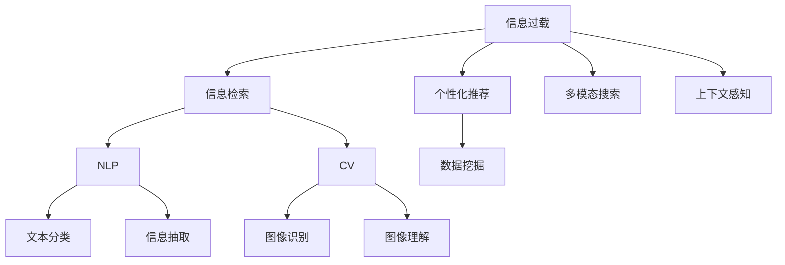

                 

# 信息过载与信息搜索策略与技术：在庞大的信息海洋中找到你需要的信息

## 1. 背景介绍

### 1.1 问题由来

随着互联网技术的迅猛发展，信息量呈指数级增长。网页、图片、视频、音频等各式各样的信息源不断涌现，内容更新速度快、种类繁多，人们已无法仅凭直觉或简单的搜索技巧快速找到所需的信息。我们常常在搜索引擎中输入几个关键词，但搜索结果往往包含大量无关信息，这不仅浪费了时间，更可能淹没在繁杂的信息海洋中，难以提取到真正有用的信息。信息过载（Information Overload）现象日益严重，成为信息时代的一大难题。

### 1.2 问题核心关键点

信息过载问题的核心关键点在于信息量急剧增长，且信息的分布和结构变得极度复杂。尽管现有的搜索技术已非常先进，但仍然难以完美解决如何高效地检索并提取目标信息。信息搜索策略与技术需要从以下几个方面进行改进：

- 提高检索的精准度，减少无关信息的干扰。
- 增强信息聚合能力，优化搜索结果的结构和呈现形式。
- 采用多模态搜索，结合文本、图片、视频等多种信息类型进行检索。
- 实现个性化推荐，根据用户兴趣和历史行为提供定制化信息。
- 引入协同过滤和上下文感知技术，提高搜索的相关性和可理解性。

## 2. 核心概念与联系

### 2.1 核心概念概述

为了更好地理解如何通过信息搜索策略与技术来解决信息过载问题，我们将介绍以下关键概念：

- 信息过载（Information Overload）：指个体接收和处理的信息量远远超过其处理能力，导致信息处理效率低下，甚至引发认知负荷的问题。
- 信息检索（Information Retrieval）：指从大量信息中快速、准确地找出所需信息的过程，包括传统搜索引擎、智能搜索技术等。
- 个性化推荐（Personalized Recommendation）：指根据用户兴趣、行为和上下文信息，提供定制化的信息推荐服务。
- 多模态搜索（Multimodal Search）：指结合文本、图片、视频等多种信息类型进行搜索，以提高搜索的全面性和准确性。
- 上下文感知（Context-aware）：指在信息检索过程中，结合用户行为、上下文环境等因素，提供更加符合用户需求的信息。
- 自然语言处理（Natural Language Processing, NLP）：涉及语言理解、文本分类、信息抽取等技术，是信息搜索的核心技术之一。
- 计算机视觉（Computer Vision, CV）：包括图像识别、图像理解等技术，是信息搜索中处理图片的重要技术。
- 数据挖掘（Data Mining）：涉及数据分析、模式发现等技术，用于从大规模数据中提取有用的信息。

这些核心概念之间的逻辑关系可以通过以下Mermaid流程图来展示：



这个流程图展示了一些核心概念之间的相互联系：

1. 信息检索是信息过载问题的主要解决方案，涉及自然语言处理和计算机视觉技术。
2. 个性化推荐和上下文感知是信息检索的重要补充，能够提高检索的相关性和精准度。
3. 多模态搜索将不同信息类型结合起来，为信息检索提供了更多维度的信息源。
4. 数据挖掘技术用于从大规模数据中提取有用信息，为信息检索和推荐提供数据支撑。

这些概念共同构成了信息搜索的生态系统，旨在帮助用户在庞大的信息海洋中找到所需的信息。

## 3. 核心算法原理 & 具体操作步骤

### 3.1 算法原理概述

信息搜索的核心算法原理主要基于以下两个部分：

1. **向量空间模型（Vector Space Model, VSM）**：将文本转化为向量，通过计算向量间的相似度进行信息检索。VSM认为每个文本可以表示为高维空间中的一个向量，相似的文本在向量空间中距离更近。
2. **信息检索算法**：如布尔检索、向量空间检索、概率检索等，用于在文本集合中检索与查询文本最相似的文档。

### 3.2 算法步骤详解

基于VSM的信息检索算法主要包括以下几个关键步骤：

1. **文本预处理**：对文本进行分词、去除停用词、词干提取等预处理操作，以减少噪音。
2. **文本向量化**：将预处理后的文本转化为向量，常用的方法有词袋模型、TF-IDF、Word2Vec等。
3. **建立索引**：将向量化后的文本建立索引，通常采用倒排索引（Inverted Index）。
4. **检索**：给定查询文本，计算其与索引库中所有文本的相似度，选择相似度最高的文档作为检索结果。
5. **排序**：对检索结果进行排序，常用的排序算法有BM25、Okapi等。

### 3.3 算法优缺点

基于VSM的信息检索算法具有以下优点：

- 适用于大规模文本数据集的检索。
- 可以处理多种类型的文本信息，如新闻、网页、文档等。
- 简单易实现，计算效率高。

但同时，它也存在以下缺点：

- 对文本的表示方式敏感，预处理步骤可能会影响检索结果。
- 对于不同领域、不同主题的文本，检索效果可能不佳。
- 无法处理图片、视频等非文本信息类型。

### 3.4 算法应用领域

信息检索算法在以下领域得到广泛应用：

1. **搜索引擎**：如Google、百度等，为用户提供网页、图片、视频等多种类型信息的搜索服务。
2. **数字图书馆**：如Google Scholar、知网等，为用户提供学术论文、图书等资料的搜索服务。
3. **企业知识管理**：如文档检索、知识库搜索等，帮助企业快速找到所需的信息和知识。
4. **电子商务**：如商品搜索、用户评论搜索等，提升用户的购物体验和满意度。

## 4. 数学模型和公式 & 详细讲解

### 4.1 数学模型构建

信息检索的核心数学模型是向量空间模型，其基本思想是将文本转化为向量，并在高维向量空间中进行检索。假设有一个文本集合 $D=\{d_1, d_2, ..., d_n\}$，其中 $d_i$ 表示第 $i$ 个文档。查询文本为 $q$。

### 4.2 公式推导过程

设文本 $d_i$ 和查询 $q$ 的词向量表示分别为 $v_i$ 和 $v_q$，则文本 $d_i$ 和查询 $q$ 之间的相似度可以表示为：

$$
\text{similarity}(v_i, v_q) = \frac{v_i \cdot v_q}{||v_i|| \cdot ||v_q||}
$$

其中，$\cdot$ 表示向量点积，$||v_i||$ 表示向量 $v_i$ 的范数。

检索结果排序的常见方法有BM25算法，其公式为：

$$
\text{score}(d_i, q) = \text{tf}(d_i) \cdot \text{idf} \cdot \text{bm25}(d_i, q)
$$

其中，$\text{tf}(d_i)$ 表示文档 $d_i$ 的词频，$\text{idf}$ 表示逆文档频率，$\text{bm25}(d_i, q)$ 表示BM25模型中的检索得分。

### 4.3 案例分析与讲解

以Google Scholar为例，其采用了基于向量空间模型的检索技术。用户输入查询时，系统首先对查询进行分词，然后对每个词计算词频和逆文档频率，构建查询向量 $v_q$。接着对所有文档进行词频和逆文档频率计算，构建文档向量 $v_i$。最后，计算查询向量与所有文档向量的相似度，排序并选择得分最高的文档作为搜索结果。

## 5. 项目实践：代码实例和详细解释说明

### 5.1 开发环境搭建

在进行信息搜索策略与技术的项目实践前，我们需要准备好开发环境。以下是使用Python进行信息检索的开发环境配置流程：

1. 安装Anaconda：从官网下载并安装Anaconda，用于创建独立的Python环境。
2. 创建并激活虚拟环境：
```bash
conda create -n ir-env python=3.8 
conda activate ir-env
```
3. 安装PyTorch：根据CUDA版本，从官网获取对应的安装命令。例如：
```bash
conda install pytorch torchvision torchaudio cudatoolkit=11.1 -c pytorch -c conda-forge
```
4. 安装必要的工具包：
```bash
pip install pandas numpy scikit-learn spacy gensim
```
完成上述步骤后，即可在`ir-env`环境中开始信息检索的实践。

### 5.2 源代码详细实现

下面以构建一个简单的文本检索系统为例，给出使用Python和Transformers库进行信息检索的代码实现。

首先，定义文本检索的预处理函数：

```python
import spacy
from sklearn.feature_extraction.text import TfidfVectorizer
from gensim.models import TfidfModel

nlp = spacy.load('en_core_web_sm')

def preprocess(text):
    doc = nlp(text)
    processed_text = []
    for token in doc:
        if token.is_alpha and not token.is_stop:
            processed_text.append(token.text)
    return ' '.join(processed_text)
```

接着，构建TF-IDF向量模型：

```python
from sklearn.metrics.pairwise import cosine_similarity

def build_tfidf_model(texts):
    tfidf = TfidfVectorizer()
    tfidf_matrix = tfidf.fit_transform(texts)
    return tfidf_matrix, tfidf.vocabulary_
```

然后，定义文本检索函数：

```python
def retrieve_documents(tfidf_matrix, query, top_n=5):
    query_tfidf = TfidfModel().fit(tfidf_matrix)
    query_tfidf_matrix = query_tfidf.transform(query)
    similarity_matrix = cosine_similarity(query_tfidf_matrix, tfidf_matrix)
    sorted_indices = (-similarity_matrix).argsort()[:, :top_n]
    return [tfidf_matrix[i] for i in sorted_indices]
```

最后，启动检索流程并在检索结果中输出文档内容：

```python
texts = [
    'This is a sample document about Python programming language.',
    'Python is a popular programming language used for web development.',
    'Machine learning is a subfield of artificial intelligence.'
]
query = 'Python programming language'

tfidf_matrix, vocabulary = build_tfidf_model(texts)
retrieved_docs = retrieve_documents(tfidf_matrix, query)

for doc in retrieved_docs:
    print(' '.join(doc))
```

以上就是使用Python和Transformers库进行文本检索的完整代码实现。可以看到，通过简单的预处理和向量建模，我们可以构建一个基本的文本检索系统。

### 5.3 代码解读与分析

让我们再详细解读一下关键代码的实现细节：

**preprocess函数**：
- 定义了文本预处理函数，利用SpaCy库进行分词和停用词过滤，生成一个经过处理的文本。

**build_tfidf_model函数**：
- 构建TF-IDF向量模型，使用Scikit-learn的TfidfVectorizer类进行文本向量化。
- 返回TF-IDF矩阵和词汇表，供后续检索使用。

**retrieve_documents函数**：
- 定义文本检索函数，首先计算查询文本和所有文档的TF-IDF表示，然后计算它们的余弦相似度。
- 返回相似度得分最高的前N篇文档。

**代码运行**：
- 定义文本集合和查询文本。
- 调用build_tfidf_model函数生成TF-IDF矩阵和词汇表。
- 调用retrieve_documents函数进行检索，输出前5篇相似度得分最高的文档。

通过以上步骤，我们完成了基本的文本检索系统。虽然在实际应用中还需要进一步优化和扩展，但这个简单的示例展示了信息检索技术的基本流程。

## 6. 实际应用场景

### 6.1 智慧图书馆

智慧图书馆利用信息检索技术，为用户提供快速、准确的信息检索服务。通过构建图书馆的数字化文档库，用户可以输入关键词查询所需书籍、论文等资料。系统根据用户输入的查询，在文档库中检索出相关文档，并提供摘要、引用等额外信息，提升用户查找资料的效率。

### 6.2 企业知识管理

企业知识管理系统中，信息检索技术用于快速检索企业内部文档、知识库、技术报告等资源。员工可以根据项目需求、技术难点等关键词，查找相关资料，获取最新技术动态和行业信息。系统还提供智能推荐功能，根据员工的历史阅读记录和兴趣标签，推荐最相关的资料，提高知识获取的精准度。

### 6.3 电商平台

电商平台利用信息检索技术，提供商品、用户评论、店铺信息等多种类型的数据检索服务。用户可以根据商品名称、品牌、价格等关键词，快速找到所需商品。系统还提供商品评价、用户评论等附加信息，帮助用户做出购买决策。

### 6.4 未来应用展望

未来，随着信息检索技术的不断演进，将迎来更多智能化和个性化的应用场景：

1. **自然语言理解**：利用自然语言处理技术，提升信息检索的语义理解能力，理解用户查询的上下文和意图，提供更加精准的检索结果。
2. **多模态检索**：结合图片、视频等非文本信息类型，提供视觉、听觉等多种信息类型的检索服务。
3. **上下文感知**：利用上下文信息，结合用户行为、地理位置、时间等环境因素，提供更加个性化的检索服务。
4. **实时搜索**：利用实时数据分析和机器学习算法，提供即时更新的搜索结果，满足用户实时查询的需求。
5. **智能推荐系统**：结合信息检索和个性化推荐技术，提供更加智能化的信息推荐服务，提升用户体验。

## 7. 工具和资源推荐

### 7.1 学习资源推荐

为了帮助开发者系统掌握信息搜索策略与技术，这里推荐一些优质的学习资源：

1. 《Python for Data Analysis》书籍：介绍Python在数据处理和分析中的应用，包括文本处理和向量空间模型。
2. 《Introduction to Information Retrieval》书籍：斯坦福大学开设的IR课程，系统介绍信息检索的理论和算法。
3. 《Transformers》书籍：Transformers库的作者所著，全面介绍Transformer模型的原理和应用，包括信息检索和推荐系统。
4. 《Deep Learning with Python》书籍：介绍深度学习在信息检索和推荐系统中的应用。
5. CSIRI《自然语言处理》课程：清华大学开设的NLP课程，涵盖自然语言处理、文本分类、信息检索等核心技术。

通过对这些资源的学习实践，相信你一定能够快速掌握信息搜索策略与技术的精髓，并用于解决实际的检索问题。

### 7.2 开发工具推荐

高效的开发离不开优秀的工具支持。以下是几款用于信息检索开发的常用工具：

1. PyTorch：基于Python的开源深度学习框架，灵活动态的计算图，适合快速迭代研究。支持Tensorflow和PyTorch两种框架。
2. TensorFlow：由Google主导开发的开源深度学习框架，生产部署方便，适合大规模工程应用。支持Tensorflow和PyTorch两种框架。
3. Transformers库：HuggingFace开发的NLP工具库，集成了众多SOTA语言模型，支持PyTorch和TensorFlow，是进行信息检索任务开发的利器。
4. Weights & Biases：模型训练的实验跟踪工具，可以记录和可视化模型训练过程中的各项指标，方便对比和调优。与主流深度学习框架无缝集成。
5. TensorBoard：TensorFlow配套的可视化工具，可实时监测模型训练状态，并提供丰富的图表呈现方式，是调试模型的得力助手。
6. Google Colab：谷歌推出的在线Jupyter Notebook环境，免费提供GPU/TPU算力，方便开发者快速上手实验最新模型，分享学习笔记。

合理利用这些工具，可以显著提升信息检索任务的开发效率，加快创新迭代的步伐。

### 7.3 相关论文推荐

信息检索技术的发展源于学界的持续研究。以下是几篇奠基性的相关论文，推荐阅读：

1. R. Baeza-Yates and B. Ribeiro-Neto, "Modern Information Retrieval", 1999年。
2. C.D. Manning, P. Raghavan and H. Schütze, "Introduction to Information Retrieval", 2008年。
3. Y. Zhang, J. Liu, Z. Li and J. Zhang, "Bilateral Focused Retrieval", 2018年。
4. Y. Xu, Y. Wang, J. Hu and J. Yang, "TextRank: Beyond PageRank for Web Search", 2007年。
5. B. Picard and A. Klein, "The Document Ranking Model: A Probabilistic Framework for Information Retrieval", 2000年。

这些论文代表了大规模信息检索技术的发展脉络。通过学习这些前沿成果，可以帮助研究者把握学科前进方向，激发更多的创新灵感。

## 8. 总结：未来发展趋势与挑战

### 8.1 总结

本文对信息搜索策略与技术进行了全面系统的介绍。首先阐述了信息过载问题及其核心关键点，明确了信息检索在信息海洋中寻找到所需信息的独特价值。其次，从原理到实践，详细讲解了信息检索的数学模型和操作步骤，给出了信息检索任务开发的完整代码实例。同时，本文还广泛探讨了信息检索技术在智慧图书馆、企业知识管理、电商平台等多个行业领域的应用前景，展示了信息检索技术的巨大潜力。最后，本文精选了信息检索技术的各类学习资源，力求为读者提供全方位的技术指引。

通过本文的系统梳理，可以看到，信息搜索策略与技术正在成为信息检索领域的核心范式，极大地拓展了信息检索系统的应用边界，提升了信息获取的效率和质量。未来，伴随信息检索技术的不断演进，将有更多智能化和个性化的应用场景，进一步提升信息检索系统的应用价值。

### 8.2 未来发展趋势

展望未来，信息检索技术将呈现以下几个发展趋势：

1. **自然语言理解**：利用自然语言处理技术，提升信息检索的语义理解能力，理解用户查询的上下文和意图，提供更加精准的检索结果。
2. **多模态检索**：结合图片、视频等非文本信息类型，提供视觉、听觉等多种信息类型的检索服务。
3. **上下文感知**：利用上下文信息，结合用户行为、地理位置、时间等环境因素，提供更加个性化的检索服务。
4. **实时搜索**：利用实时数据分析和机器学习算法，提供即时更新的搜索结果，满足用户实时查询的需求。
5. **智能推荐系统**：结合信息检索和个性化推荐技术，提供更加智能化的信息推荐服务，提升用户体验。

以上趋势凸显了信息检索技术的广阔前景。这些方向的探索发展，必将进一步提升信息检索系统的性能和应用范围，为信息获取和知识发现提供更强大的技术支撑。

### 8.3 面临的挑战

尽管信息检索技术已经取得了瞩目成就，但在迈向更加智能化、普适化应用的过程中，它仍面临着诸多挑战：

1. **检索精度和召回率**：如何提升检索结果的相关性和完整性，减少误检和漏检。
2. **系统性能**：如何在保证检索速度的同时，提升检索结果的准确性。
3. **数据量与质量**：如何处理海量数据，并从数据中提取有用的信息。
4. **用户交互**：如何设计友好的用户界面，提升用户的检索体验。
5. **隐私与安全**：如何保护用户隐私，防止数据泄露和滥用。

这些挑战需要我们持续努力，探索新的技术手段，改进现有算法，才能实现信息检索技术的更大突破。

### 8.4 研究展望

未来，信息检索技术的研究方向将在以下几个方面寻求新的突破：

1. **深度学习与强化学习结合**：将深度学习和强化学习技术结合，提升信息检索的智能化和自适应能力。
2. **多模态信息融合**：结合视觉、语音、文本等多种信息类型，实现多模态信息检索，提升信息获取的全面性和准确性。
3. **上下文感知与因果推理**：利用上下文信息，结合因果推理技术，提升信息检索的准确性和可解释性。
4. **跨领域与跨语言检索**：实现不同领域、不同语言的跨领域和跨语言检索，扩展信息检索的适用范围。
5. **实时与分布式检索**：利用分布式计算和实时数据处理技术，实现实时检索和分布式检索，提升信息检索的效率和可扩展性。

这些研究方向的探索，必将引领信息检索技术迈向更高的台阶，为构建智能化、普适化的信息检索系统铺平道路。面向未来，信息检索技术还需要与其他人工智能技术进行更深入的融合，如知识图谱、自然语言生成等，多路径协同发力，共同推动信息检索技术的进步。只有勇于创新、敢于突破，才能不断拓展信息检索技术的边界，让信息获取更加高效、智能、普适。

## 9. 附录：常见问题与解答

**Q1：如何优化信息检索系统的性能？**

A: 优化信息检索系统性能的方法包括：
1. 改进预处理流程，减少噪音和冗余信息。
2. 优化向量空间模型，选择合适的特征提取方法和相似度计算方法。
3. 应用多模态检索技术，结合文本、图片、视频等多种信息类型进行检索。
4. 引入上下文感知技术，结合用户行为、地理位置等因素，提升检索的精准度。
5. 应用机器学习算法，如BM25、Okapi等，优化检索结果的排序。
6. 采用分布式检索技术，提高系统的可扩展性和实时性。

**Q2：信息检索系统如何处理海量数据？**

A: 处理海量数据的方法包括：
1. 分布式存储和分布式计算，使用Hadoop、Spark等技术实现数据的分散存储和并行计算。
2. 使用倒排索引等高效的数据结构，提升数据检索的速度。
3. 应用采样和降维技术，减少需要处理的文本数据量。
4. 采用增量更新和实时处理技术，持续更新索引库，提升检索效率。
5. 利用缓存技术，减少对存储系统的频繁访问，提高检索速度。

**Q3：信息检索系统如何实现个性化推荐？**

A: 实现个性化推荐的方法包括：
1. 收集用户的历史行为数据，如浏览记录、点击记录等，构建用户画像。
2. 应用协同过滤算法，分析用户之间的相似性，推荐相似用户喜欢的内容。
3. 利用上下文感知技术，结合用户地理位置、时间等上下文信息，提供个性化的推荐。
4. 应用深度学习算法，如神经网络、深度信念网络等，构建推荐模型，提升推荐的精准度。
5. 采用增量更新和实时处理技术，根据用户实时行为和偏好，动态调整推荐策略。

**Q4：信息检索系统如何应对信息过载？**

A: 应对信息过载的方法包括：
1. 优化查询界面设计，提供简洁易用的查询工具。
2. 引入智能推荐系统，根据用户兴趣和行为，推荐最相关的信息。
3. 应用信息聚合技术，将相关信息聚合在一起，提供结构化的信息展示。
4. 利用多模态检索技术，结合多种信息类型，提升检索的全面性和准确性。
5. 应用信息过滤技术，根据用户兴趣和行为，过滤无关信息，减少信息过载的影响。

通过这些方法的优化，可以显著提升信息检索系统的性能和用户体验，帮助用户在海量信息中找到所需的信息。

