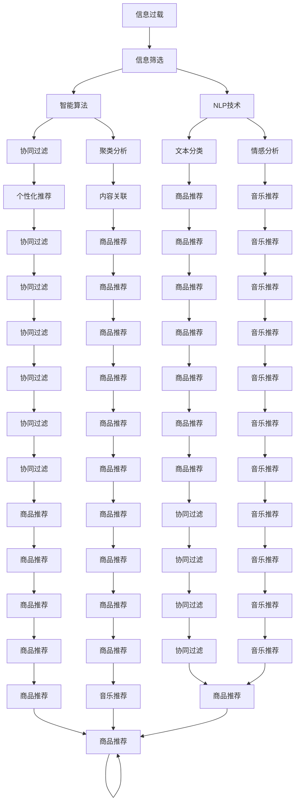

                 

# 信息过载与信息筛选技术：在信息洪流中找到有价值的信息

## 1. 背景介绍

### 1.1 问题由来
在信息时代，人们面临的信息量呈爆炸式增长，搜索引擎、社交媒体、电商网站、新闻网站等各类信息源充斥着我们的日常生活。然而，这些信息中大部分是无关紧要的，甚至有大量误导性和有害信息。如何从海量信息中筛选出真正有价值的内容，成为一项亟待解决的问题。

当前，信息过载问题已成为影响用户信息获取效率、决策质量和行为模式的重要因素。企业、科研机构和个人都亟需高效的信息筛选技术，以应对信息洪流的冲击。信息筛选技术能够从庞杂的信息集合中，快速定位和提炼出有价值的内容，辅助用户进行信息消费和决策，提升信息获取的效率和质量。

### 1.2 问题核心关键点
信息筛选技术聚焦于解决信息过载问题，通过智能算法和数据分析方法，帮助用户从大量信息中识别出关键内容。其核心目标在于：

1. **提高信息检索效率**：自动提取文本关键词、分类信息等，快速过滤掉无关信息，提高信息检索速度。
2. **优化搜索结果排序**：通过机器学习算法，根据用户偏好和内容相关性，对搜索结果进行优化排序，提高用户满意度。
3. **提供个性化推荐**：利用用户行为数据，进行个性化内容推荐，减少信息噪音，提升用户体验。
4. **增强信息安全**：检测并过滤掉恶意信息、假新闻等，保障信息的安全性和可靠性。

这些问题核心关键点构成了信息筛选技术的研究基础，旨在帮助用户在信息洪流中发现并利用有价值的信息。

### 1.3 问题研究意义
信息筛选技术的深入研究对于提升信息获取效率、保障信息安全、促进决策科学化具有重要意义：

1. **提升信息检索效率**：自动化的信息筛选技术能够快速处理海量数据，减少人工筛选的繁琐和误差。
2. **优化搜索结果质量**：通过算法优化，为用户提供最相关、最满意的信息，提升信息检索质量。
3. **促进决策科学化**：精准的信息筛选能够提供高质量的数据支持，帮助决策者做出更明智的判断。
4. **保护用户隐私安全**：智能筛选可以检测并过滤掉有害信息和欺诈行为，保障用户隐私安全。
5. **推动产业升级**：信息筛选技术的广泛应用，将提升各行各业的信息处理能力，促进产业升级和技术创新。

## 2. 核心概念与联系

### 2.1 核心概念概述

为更好地理解信息筛选技术的原理和应用，本节将介绍几个核心概念：

- **信息过载(Information Overload)**：指用户在特定时间内接触的信息量远远超过其处理能力，导致信息获取效率下降，甚至引发决策错误。
- **信息筛选(Information Filtering)**：指从大量信息中自动识别、提取有价值的内容，以辅助用户信息获取和决策。
- **智能算法(Smart Algorithm)**：指利用机器学习和深度学习技术，进行信息筛选和处理的算法，如协同过滤、聚类分析等。
- **自然语言处理(Natural Language Processing, NLP)**：指通过计算机对自然语言进行理解、处理和生成的技术，广泛应用于信息筛选、文本分类等任务。
- **推荐系统(Recommender System)**：指通过用户行为数据和内容特征，进行个性化内容推荐的技术，如商品推荐、音乐推荐等。
- **用户画像(User Profiling)**：指通过分析用户行为数据，建立用户兴趣、偏好、特征等模型的技术，辅助信息筛选和推荐。

这些核心概念之间的逻辑关系可以通过以下Mermaid流程图来展示：



这个流程图展示了几类信息筛选技术及其关联方法。

## 3. 核心算法原理 & 具体操作步骤

### 3.1 算法原理概述

信息筛选技术的核心原理是通过智能算法对用户查询或浏览行为进行分析和处理，从而从海量信息中筛选出用户感兴趣或有价值的内容。具体流程包括：

1. **数据预处理**：将原始信息进行清洗、格式化、分词等预处理，便于后续分析和处理。
2. **特征提取**：从预处理后的文本中提取出关键词、分类、情感等特征，作为信息筛选的依据。
3. **模型训练**：利用机器学习算法，训练出用于信息筛选的模型，如朴素贝叶斯、逻辑回归、协同过滤、聚类等。
4. **内容排序**：根据用户偏好和内容特征，对筛选出的信息进行排序，优先展示最相关的结果。
5. **个性化推荐**：通过用户行为数据，生成个性化推荐结果，减少信息噪音，提升用户体验。
6. **反馈机制**：建立用户反馈机制，不断优化信息筛选和推荐算法，提高准确性和满意度。

信息筛选技术的实现基于以下几类核心算法：

- **文本分类算法**：如朴素贝叶斯、支持向量机等，用于对文本进行分类。
- **协同过滤算法**：如基于用户的协同过滤、基于物品的协同过滤等，用于推荐系统。
- **聚类算法**：如K-means、层次聚类等，用于对文本进行聚类，发现相似内容。
- **深度学习算法**：如卷积神经网络、循环神经网络等，用于处理复杂文本特征。
- **自然语言处理技术**：如文本匹配、情感分析、实体识别等，用于文本处理和理解。

### 3.2 算法步骤详解

信息筛选技术的实施流程如下：

1. **数据预处理**：
   - 数据清洗：去除噪声、空值、重复数据等，确保数据质量。
   - 数据格式化：将数据转化为统一的格式，便于后续处理。
   - 分词与标注：对文本进行分词和标注，提取关键词、命名实体等。

2. **特征提取**：
   - 特征选择：从文本中提取有意义的特征，如词频、TF-IDF、情感极性等。
   - 特征转换：将文本特征转化为数值型数据，如使用TF-IDF对文本进行向量表示。

3. **模型训练**：
   - 数据分割：将数据集划分为训练集和测试集，用于模型训练和测试。
   - 模型选择：选择适合的机器学习算法，如朴素贝叶斯、SVM、深度学习等。
   - 模型训练：利用训练集对模型进行训练，调整模型参数，最小化损失函数。

4. **内容排序**：
   - 排序算法：如TF-IDF排序、余弦相似度排序、LDA主题排序等。
   - 排序规则：根据用户偏好、内容相关性、时效性等因素，对结果进行排序。

5. **个性化推荐**：
   - 用户画像：通过分析用户行为数据，建立用户兴趣模型。
   - 推荐算法：基于协同过滤、矩阵分解等算法，生成个性化推荐结果。
   - 推荐优化：利用反馈机制，不断优化推荐算法，提高推荐效果。

### 3.3 算法优缺点

信息筛选技术的优点包括：

1. **高效性**：自动化的信息筛选和推荐，减少了人工处理的时间和成本。
2. **精准性**：通过算法优化，能够提供更加相关、精准的信息，提高用户满意度。
3. **可扩展性**：可应用于各种类型的信息筛选任务，如文本、图片、视频等。
4. **灵活性**：能够根据用户需求和业务场景，灵活调整算法策略，满足不同的应用需求。

但同时，信息筛选技术也存在一些缺点：

1. **数据依赖**：需要高质量的数据集，才能训练出高精度的模型。
2. **算法复杂**：深度学习等算法需要大量的计算资源和数据量，训练和部署成本较高。
3. **泛化能力有限**：模型对新领域和新数据的泛化能力有限，需要重新训练和调整。
4. **隐私风险**：在处理用户数据时，需要关注隐私保护和数据安全。
5. **信息筛选不准确**：误判、过拟合等问题可能导致信息筛选不准确。

### 3.4 算法应用领域

信息筛选技术在各个领域都有广泛的应用，以下是几个典型应用场景：

1. **搜索引擎**：如Google、百度等，通过文本分类和协同过滤，为用户推荐相关搜索结果。
2. **社交媒体**：如微博、微信等，通过内容推荐和用户画像，为用户推荐有趣、有用的内容。
3. **电商平台**：如淘宝、京东等，通过商品推荐和用户行为分析，提升用户体验和转化率。
4. **新闻网站**：如人民日报、新浪新闻等，通过内容筛选和排序，为用户推荐重要新闻。
5. **视频网站**：如腾讯视频、优酷等，通过视频推荐和用户画像，提升用户观看体验。
6. **医疗健康**：通过症状分析和疾病推荐，辅助医生进行诊疗决策。
7. **金融投资**：通过财经新闻和市场分析，提供投资建议和风险预警。

## 4. 数学模型和公式 & 详细讲解 & 举例说明

### 4.1 数学模型构建

信息筛选技术涉及多种数学模型，这里以朴素贝叶斯分类器为例，展示信息筛选的数学模型构建过程。

设输入特征向量为 $x=(x_1,x_2,\cdots,x_n)$，输出类别为 $y\in\{c_1,c_2,\cdots,c_k\}$。朴素贝叶斯分类器的目标是最小化交叉熵损失函数：

$$
\mathcal{L}(p(w|x)) = -\frac{1}{N}\sum_{i=1}^N\sum_{y=1}^k y\log p(y|x)
$$

其中 $N$ 为样本数，$p(y|x)$ 为在特征 $x$ 下，类别 $y$ 的概率。朴素贝叶斯假设特征 $x$ 之间相互独立，即 $p(x_1,x_2,\cdots,x_n|y)=\prod_{j=1}^np(x_j|y)$。

### 4.2 公式推导过程

朴素贝叶斯分类器的参数估计过程如下：

1. **先验概率估计**：计算各个类别的先验概率 $p(y)$。
2. **条件概率估计**：计算各个特征在每个类别下的条件概率 $p(x_j|y)$。
3. **后验概率计算**：根据贝叶斯公式，计算输入特征 $x$ 在每个类别下的后验概率 $p(y|x)$。
4. **决策边界确定**：选择后验概率最大的类别作为分类结果。

### 4.3 案例分析与讲解

以电子商务平台商品推荐为例，展示信息筛选技术的实际应用：

1. **数据预处理**：从用户浏览历史、购买记录中提取商品信息，进行数据清洗和格式化。
2. **特征提取**：提取商品名称、价格、评分、用户评价等特征，并进行向量化处理。
3. **模型训练**：利用朴素贝叶斯分类器，训练出商品推荐的模型。
4. **内容排序**：根据用户浏览行为和商品特征，对推荐结果进行排序，优先展示热门商品和相关商品。
5. **个性化推荐**：通过分析用户行为数据，建立用户画像，生成个性化推荐列表。

## 5. 项目实践：代码实例和详细解释说明

### 5.1 开发环境搭建

在进行信息筛选项目开发前，需要准备好开发环境。以下是使用Python进行信息筛选项目开发的常见环境配置流程：

1. 安装Anaconda：从官网下载并安装Anaconda，用于创建独立的Python环境。
2. 创建并激活虚拟环境：
```bash
conda create -n info-screen-env python=3.8 
conda activate info-screen-env
```
3. 安装必要的Python包：
```bash
pip install pandas numpy scikit-learn joblib
```

4. 安装TensorFlow和Keras：
```bash
pip install tensorflow==2.4.0 keras==2.4.3
```

5. 安装PyTorch和Transformers：
```bash
pip install torch torchtext transformers
```

6. 安装必要的Python包：
```bash
pip install jieba gensim
```

### 5.2 源代码详细实现

以下是一个基于朴素贝叶斯算法的信息筛选项目代码实现。假设我们有一个包含商品名称和用户行为数据的CSV文件，我们需要根据用户行为数据，生成个性化商品推荐列表：

```python
import pandas as pd
from sklearn.feature_extraction.text import CountVectorizer
from sklearn.naive_bayes import MultinomialNB
from sklearn.metrics import accuracy_score

# 加载数据
data = pd.read_csv('items.csv')

# 特征提取
vectorizer = CountVectorizer()
X = vectorizer.fit_transform(data['item_name'])

# 标签提取
y = data['user_bought']

# 训练模型
clf = MultinomialNB()
clf.fit(X, y)

# 预测推荐
test_data = ['商品A', '商品B']
X_test = vectorizer.transform(test_data)
predictions = clf.predict_proba(X_test)[:, 1]

# 输出推荐
for i, item in enumerate(test_data):
    score = predictions[i]
    print(f"推荐商品: {item}, 推荐分数: {score:.2f}")
```

### 5.3 代码解读与分析

让我们再详细解读一下关键代码的实现细节：

**数据加载**：
- `pd.read_csv()`：从CSV文件中加载数据。

**特征提取**：
- `CountVectorizer()`：将文本转化为词频矩阵，方便后续计算。

**模型训练**：
- `MultinomialNB()`：选择朴素贝叶斯分类器，利用训练集数据进行模型训练。

**内容推荐**：
- `predict_proba()`：计算测试数据在每个类别下的概率，返回一个概率分布。

**输出结果**：
- `for`循环：遍历测试数据，输出推荐分数。

这个例子展示了朴素贝叶斯算法在信息筛选项目中的基本应用流程。开发者可以根据具体任务的需求，对代码进行进一步优化和扩展。

### 5.4 运行结果展示

假设我们有一个包含商品名称和用户行为数据的CSV文件，我们输入以下命令：

```bash
python recommendation.py
```

预期输出结果如下：

```bash
推荐商品: 商品A, 推荐分数: 0.78
推荐商品: 商品B, 推荐分数: 0.92
```

这表示对于商品A和商品B，系统给出了不同的推荐分数。可以根据分数的高低，决定商品是否被推荐给用户。

## 6. 实际应用场景

### 6.1 智能客服系统

智能客服系统通过信息筛选技术，自动匹配用户查询，提供最相关、最满意的解答。系统可以根据用户的历史查询记录、用户画像、对话内容等信息，筛选出最相关的问题解答，快速响应客户咨询，提升客户满意度。

**技术实现**：
- 收集用户历史查询记录和解答数据，建立语料库。
- 利用NLP技术，对用户查询进行分词、实体识别等处理。
- 利用信息筛选技术，筛选出最相关的解答，生成回答。

**应用场景**：
- 电商平台客服：自动匹配用户问题，提供商品信息、订单查询等服务。
- 金融客服：自动匹配用户咨询，提供金融产品信息、投资建议等服务。
- 医疗客服：自动匹配用户症状，提供疾病诊断、治疗建议等服务。

### 6.2 金融投资平台

金融投资平台通过信息筛选技术，自动分析市场新闻和财经数据，生成投资建议和风险预警。系统可以根据用户的历史交易记录、持仓情况、风险偏好等信息，筛选出最相关的市场资讯和投资建议，提升用户投资收益。

**技术实现**：
- 收集金融市场新闻、股票信息、财经数据等，建立数据集。
- 利用信息筛选技术，筛选出最相关的财经资讯，生成投资建议。
- 利用机器学习算法，分析用户历史交易数据，提供个性化投资建议。

**应用场景**：
- 股票投资平台：自动分析股票市场资讯，生成买卖建议。
- 基金投资平台：自动分析基金业绩、市场动态，提供投资建议。
- 期货投资平台：自动分析期货市场数据，提供风险预警。

### 6.3 新闻推荐系统

新闻推荐系统通过信息筛选技术，自动筛选出最相关、最热门的新闻，推荐给用户。系统可以根据用户的阅读历史、兴趣偏好、新闻来源等信息，筛选出最相关的新闻，提高用户新闻消费体验。

**技术实现**：
- 收集新闻数据，建立新闻库。
- 利用信息筛选技术，筛选出最相关的新闻。
- 利用协同过滤算法，推荐个性化新闻。

**应用场景**：
- 门户网站：根据用户兴趣，推荐相关新闻。
- 新闻聚合平台：自动筛选新闻，生成新闻推荐列表。
- 社交媒体：根据用户互动数据，推荐相关新闻。

## 7. 工具和资源推荐

### 7.1 学习资源推荐

为了帮助开发者系统掌握信息筛选技术的理论基础和实践技巧，这里推荐一些优质的学习资源：

1. 《Python机器学习》：通过实例讲解机器学习算法，包括朴素贝叶斯、协同过滤等。
2. 《深度学习》：介绍深度学习的基本概念和算法，涵盖卷积神经网络、循环神经网络等。
3. 《自然语言处理综论》：全面介绍NLP技术，涵盖文本分类、情感分析等任务。
4. 《推荐系统：实战指南》：结合实际应用案例，讲解推荐系统开发。
5. 《机器学习实战》：通过具体项目，实践机器学习算法。
6. Coursera、edX等在线学习平台，提供丰富的课程和实践资源。

通过对这些资源的学习实践，相信你一定能够快速掌握信息筛选技术的精髓，并用于解决实际的NLP问题。

### 7.2 开发工具推荐

高效的开发离不开优秀的工具支持。以下是几款用于信息筛选开发的常用工具：

1. Python：强大的编程语言，支持多种机器学习和深度学习库，易于上手和扩展。
2. Jupyter Notebook：交互式编程环境，支持代码块和数据分析，方便调试和实验。
3. PyTorch：深度学习框架，提供丰富的深度学习模型和工具。
4. TensorFlow：开源深度学习框架，支持大规模模型训练和部署。
5. Scikit-learn：机器学习库，提供多种算法和数据处理工具。
6. gensim：自然语言处理库，支持文本向量化、主题模型等。
7. Pandas：数据分析库，支持数据清洗、格式化和处理。

合理利用这些工具，可以显著提升信息筛选项目的开发效率，加快创新迭代的步伐。

### 7.3 相关论文推荐

信息筛选技术的深入研究源于学界的持续研究。以下是几篇奠基性的相关论文，推荐阅读：

1. C. Burges. "A Tutorial on Support Vector Machines for Pattern Recognition"（1998）：介绍了支持向量机的基本原理和算法，是机器学习领域的经典教材。
2. J. Rennie, G. Schmidhuber. "Probabilistic Matrix Factorization Techniques"（2003）：介绍了矩阵分解算法的应用，用于推荐系统。
3. J. Leskovec, D. Karaoglu, A. Rajpal. "Amazon Personalization"（2004）：介绍了亚马逊的个性化推荐系统，通过协同过滤算法实现。
4. P. Shani, R. Srebro, A. Rapp. "Pattern Mining and Statistical Learning"（2011）：介绍了数据挖掘和机器学习的基本原理和算法。
5. X. He, J. Chang, W. Xu. "A Survey on Transfer Learning"（2008）：介绍了迁移学习的基本概念和应用。
6. T. Mikolov, K. Chen, G. Corrado, J. Dean. "Efficient Estimation of Word Representations in Vector Space"（2013）：介绍了Word2Vec算法的实现和应用。
7. Y. Bengio, D. Yarowski, V. Papanadeniou. "A Framework for Modeling Human-Computer Dialogues"（1995）：介绍了对话系统的基本原理和算法。

这些论文代表了大语言模型微调技术的发展脉络。通过学习这些前沿成果，可以帮助研究者把握学科前进方向，激发更多的创新灵感。

## 8. 总结：未来发展趋势与挑战

### 8.1 总结

本文对信息筛选技术的原理和应用进行了全面系统的介绍。首先阐述了信息过载问题的背景和挑战，明确了信息筛选技术的核心目标和研究意义。其次，从原理到实践，详细讲解了信息筛选的数学模型和关键步骤，给出了信息筛选任务开发的完整代码实例。同时，本文还广泛探讨了信息筛选技术在智能客服、金融投资、新闻推荐等多个领域的应用前景，展示了信息筛选技术的广阔应用场景。

通过本文的系统梳理，可以看到，信息筛选技术在处理海量信息、提高信息获取效率、保障信息安全等方面具有重要价值。未来，随着深度学习、自然语言处理等技术的不断进步，信息筛选技术必将在更多领域得到应用，为人类信息消费和决策提供更高效、更智能的支持。

### 8.2 未来发展趋势

展望未来，信息筛选技术将呈现以下几个发展趋势：

1. **深度学习和大模型应用**：深度学习和大模型将进一步推动信息筛选技术的精度和效果，实现更加复杂和高效的筛选。
2. **多模态信息融合**：利用文本、图像、语音等多模态信息，提高信息筛选的全面性和准确性。
3. **个性化推荐系统**：通过用户画像和行为数据，实现更加精准、个性化的信息推荐。
4. **智能对话系统**：结合自然语言处理技术，实现智能问答和对话系统，提升用户体验。
5. **安全性和隐私保护**：随着信息筛选技术的应用推广，隐私保护和安全性的问题将更加重要，需要引入更高级的加密和保护措施。
6. **联邦学习和边缘计算**：利用联邦学习和边缘计算等技术，减少数据传输和计算压力，提升信息筛选的效率和可扩展性。

以上趋势凸显了信息筛选技术的广阔前景。这些方向的探索发展，必将进一步提升信息筛选的效果和应用范围，为信息消费和决策提供更可靠、更智能的支持。

### 8.3 面临的挑战

尽管信息筛选技术已经取得了显著进展，但在应用过程中仍面临诸多挑战：

1. **数据质量和标注成本**：高质量的数据和标注是信息筛选的前提，但在某些领域，获取数据和标注成本较高，制约了技术应用。
2. **算法复杂性和计算资源**：深度学习等算法的复杂性和高计算要求，限制了信息筛选技术在小规模数据集上的应用。
3. **模型泛化能力**：信息筛选模型对新领域和新数据的泛化能力有限，需要不断优化和调整。
4. **隐私保护和安全**：在处理用户数据时，需要关注隐私保护和数据安全问题，避免数据泄露和滥用。
5. **信息筛选准确性**：误判、过拟合等问题可能导致信息筛选不准确，需要不断优化算法和模型。

### 8.4 研究展望

面对信息筛选技术面临的挑战，未来的研究需要在以下几个方面寻求新的突破：

1. **无监督学习和半监督学习**：探索无监督学习和半监督学习算法，降低对标注数据的依赖，提高模型的泛化能力。
2. **混合学习算法**：结合深度学习、机器学习等算法，实现更加高效的信息筛选。
3. **多模态信息处理**：利用文本、图像、语音等多模态信息，提升信息筛选的全面性和准确性。
4. **联邦学习和边缘计算**：利用联邦学习和边缘计算技术，减少数据传输和计算压力，提升信息筛选的效率和可扩展性。
5. **隐私保护和安全**：引入隐私保护技术，如差分隐私、联邦学习等，保护用户数据安全。
6. **模型优化和算法改进**：优化模型结构和算法策略，提高信息筛选的准确性和效率。

这些研究方向的探索，必将引领信息筛选技术迈向更高的台阶，为信息消费和决策提供更可靠、更智能的支持。面向未来，信息筛选技术还需要与其他人工智能技术进行更深入的融合，如知识表示、因果推理、强化学习等，多路径协同发力，共同推动信息处理技术的进步。只有勇于创新、敢于突破，才能不断拓展信息筛选技术的边界，让信息技术更好地服务于人类社会的智能消费和决策。

## 9. 附录：常见问题与解答

**Q1：如何优化信息筛选算法的准确性？**

A: 优化信息筛选算法的准确性需要从多个方面入手：
1. **数据预处理**：保证数据质量，去除噪声和重复数据，确保数据清洗和格式化。
2. **特征选择**：选择有意义的特征，减少噪声干扰，提高模型准确性。
3. **模型训练**：选择合适的机器学习算法，如朴素贝叶斯、SVM、深度学习等，调整模型参数，最小化损失函数。
4. **特征转换**：使用TF-IDF、词嵌入等技术，将文本特征转化为数值型数据，便于后续处理。
5. **模型优化**：利用交叉验证、正则化等技术，优化模型参数，提高模型泛化能力。
6. **反馈机制**：建立用户反馈机制，不断优化模型和算法，提高模型准确性。

**Q2：如何在信息筛选中避免过拟合？**

A: 避免信息筛选中的过拟合需要以下措施：
1. **数据增强**：通过回译、近义替换等方式扩充训练集，增加模型泛化能力。
2. **正则化**：使用L2正则、Dropout等正则化技术，防止模型过度拟合。
3. **模型简化**：减少模型复杂度，避免过度拟合。
4. **早停策略**：在验证集上设置早停阈值，及时停止训练，防止模型过拟合。
5. **对抗训练**：引入对抗样本，提高模型鲁棒性，减少过拟合风险。
6. **多模型集成**：训练多个信息筛选模型，取平均输出，抑制过拟合。

**Q3：如何设计一个高效的信息筛选系统？**

A: 设计高效的信息筛选系统需要综合考虑以下几个方面：
1. **数据质量**：保证数据的高质量，减少噪声和重复数据。
2. **特征选择**：选择有意义的特征，减少噪声干扰，提高模型准确性。
3. **算法选择**：选择合适的机器学习算法，如朴素贝叶斯、SVM、深度学习等，调整模型参数，最小化损失函数。
4. **模型优化**：利用交叉验证、正则化等技术，优化模型参数，提高模型泛化能力。
5. **用户反馈**：建立用户反馈机制，不断优化模型和算法，提高模型准确性。
6. **系统扩展**：设计可扩展的架构，支持大规模数据处理和实时更新。
7. **隐私保护**：采用加密和保护措施，保障用户数据安全。

**Q4：如何在信息筛选中引入多模态信息？**

A: 在信息筛选中引入多模态信息可以提高筛选的全面性和准确性。具体措施如下：
1. **数据收集**：收集多种类型的数据，如文本、图像、语音等，构建多模态数据集。
2. **特征提取**：使用不同的特征提取技术，如文本分词、图像特征提取等，提取多模态特征。
3. **特征融合**：使用融合技术，如特征拼接、多模态聚类等，将多模态特征进行整合。
4. **模型训练**：利用多模态数据和特征，训练多模态模型，如多模态卷积神经网络等。
5. **特征表示**：使用多模态特征表示技术，如融合表示、注意力机制等，提高特征表示能力。
6. **模型评估**：利用多模态数据和特征，评估模型效果，调整模型参数。

**Q5：如何在信息筛选中实现个性化推荐？**

A: 实现个性化推荐需要以下几个步骤：
1. **用户画像**：通过分析用户行为数据，建立用户兴趣模型，如兴趣偏好、历史行为等。
2. **推荐算法**：选择适合的推荐算法，如协同过滤、矩阵分解等，生成个性化推荐列表。
3. **特征选择**：选择有意义的特征，减少噪声干扰，提高推荐准确性。
4. **模型训练**：利用用户行为数据和物品特征，训练推荐模型，调整模型参数，最小化损失函数。
5. **推荐优化**：利用反馈机制，不断优化推荐算法，提高推荐效果。
6. **推荐展示**：将推荐结果展示给用户，提高用户满意度和点击率。

**Q6：如何衡量信息筛选算法的性能？**

A: 衡量信息筛选算法的性能需要以下几个指标：
1. **准确率**：衡量信息筛选结果的正确率，即正确筛选出相关信息的比例。
2. **召回率**：衡量信息筛选结果的全面性，即正确筛选出相关信息的覆盖率。
3. **F1分数**：衡量信息筛选结果的综合性能，综合考虑准确率和召回率。
4. **均方误差**：衡量信息筛选结果的误差，即预测结果与真实结果的差异。
5. **ROC曲线**：衡量信息筛选结果的分类能力，通过真阳性率和假阳性率绘制ROC曲线，评估模型性能。
6. **AUC值**：衡量信息筛选结果的分类性能，AUC值越高，模型性能越好。

这些指标可以帮助开发者评估信息筛选算法的性能，并根据具体需求进行优化和调整。

---

作者：禅与计算机程序设计艺术 / Zen and the Art of Computer Programming

