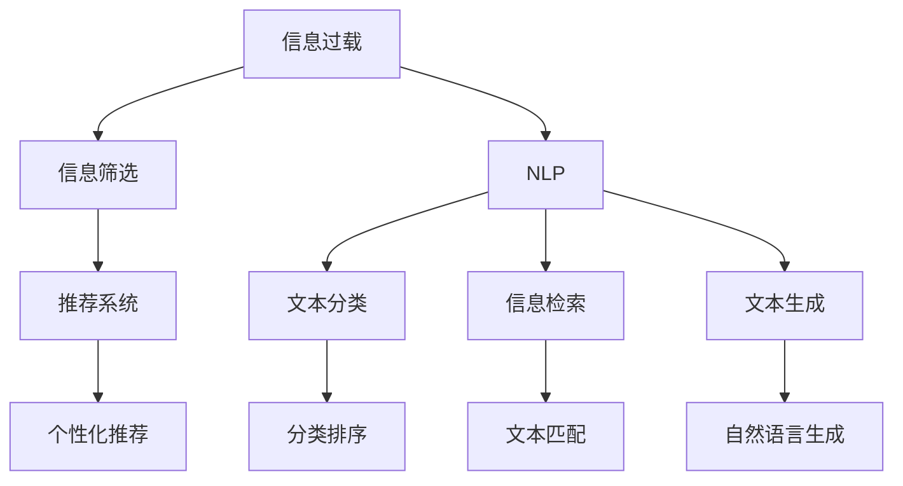
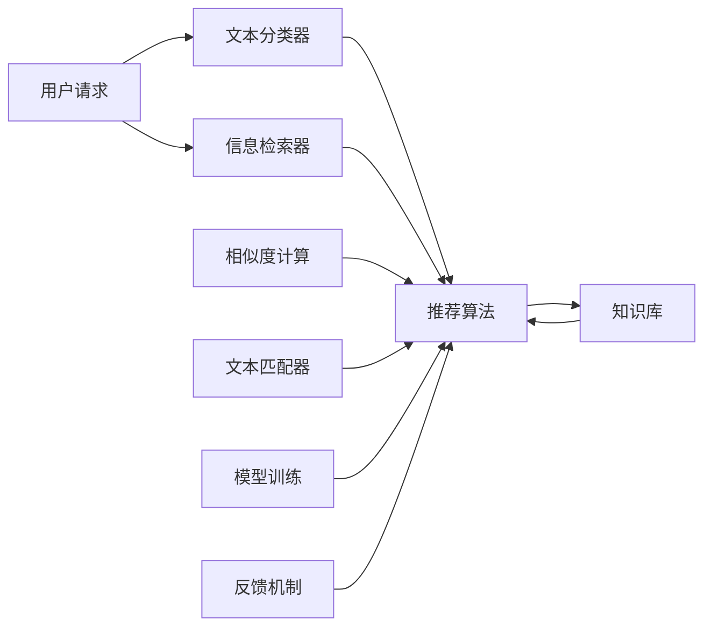

                 

# 信息过载与信息筛选策略与实践：在信息洪流中找到有价值的信息

> 关键词：信息过载,信息筛选策略,信息筛选系统,智能推荐,自然语言处理,NLP,推荐系统,个性化推荐,信息检索

## 1. 背景介绍

在当今信息爆炸的时代，人们每天面对海量的信息，如新闻、社交媒体、电子邮件、文档等。信息过载（Information Overload）指的是人们接收到的信息远远超出了自己处理和理解的能力，导致信息获取的效率和质量大大降低。如何从这些信息洪流中筛选出有价值的信息，成为了一个重要的挑战。

信息筛选（Information Filtering）旨在通过自动化的方式，帮助用户从海量信息中选出与自己最相关、最有价值的内容。传统的信息筛选方法如关键词搜索、分类排序等在当前的信息环境中显得力不从心。随着技术的发展，尤其是人工智能、自然语言处理（NLP）和推荐系统等领域的突破，信息筛选策略和系统得到了迅速发展，进一步提升了信息筛选的准确性和个性化。

本文将深入探讨信息筛选的基本原理和核心技术，通过实际案例和项目实践，介绍一种基于自然语言处理和推荐系统的信息筛选系统，并分析其在实际应用中的效果和未来发展方向。

## 2. 核心概念与联系

### 2.1 核心概念概述

- **信息过载（Information Overload）**：指人们接收的信息量远远超出处理能力，导致信息处理的效率和质量降低。

- **信息筛选（Information Filtering）**：自动从海量信息中筛选出与用户最相关、最有价值的内容。

- **推荐系统（Recommendation System）**：根据用户的历史行为和偏好，为用户推荐可能感兴趣的内容。

- **个性化推荐（Personalized Recommendation）**：结合用户特征和行为数据，提供符合个体偏好的推荐。

- **自然语言处理（NLP）**：通过自动化的方式处理和分析人类语言，如文本分类、信息检索、文本生成等。

这些核心概念之间的逻辑关系可以通过以下Mermaid流程图来展示：



这个流程图展示了信息过载、信息筛选、推荐系统和自然语言处理之间的关系：

1. 信息过载需要通过信息筛选来缓解。
2. 推荐系统是信息筛选的一种重要手段。
3. 个性化推荐是推荐系统的高级形式。
4. NLP技术为信息筛选和推荐系统提供了必要的工具。

### 2.2 核心概念原理和架构的 Mermaid 流程图



此流程图展示了信息筛选的流程和核心组件：

1. 用户发起请求，系统进行文本分类和信息检索。
2. 分类和检索结果输入推荐算法。
3. 推荐算法结合知识库和相似度计算，进行个性化推荐。
4. 反馈机制不断优化推荐算法。

## 3. 核心算法原理 & 具体操作步骤

### 3.1 算法原理概述

信息筛选的核心原理是通过自然语言处理和推荐技术，对信息进行分类、排序和推荐。其基本流程如下：

1. **文本预处理**：将原始文本转化为计算机可以处理的格式，如分词、去除停用词、词向量化等。
2. **文本分类**：将文本分为不同类别，如新闻、文章、评论等。
3. **信息检索**：在分类结果和用户历史行为的基础上，找到与用户最相关的文本。
4. **相似度计算**：计算文本之间的相似度，判断它们的相关程度。
5. **个性化推荐**：结合用户特征和历史行为，生成个性化的推荐列表。

### 3.2 算法步骤详解

#### 3.2.1 文本预处理

文本预处理是信息筛选的第一步，包括以下几个步骤：

1. **分词**：将文本分解为词语或子词，例如中文分词。
2. **去除停用词**：过滤掉文本中常见的、无实际意义的词语。
3. **词向量化**：将词语转换为向量表示，以便进行机器学习。

#### 3.2.2 文本分类

文本分类是将文本分为不同类别，例如新闻、文章、评论等。常用方法包括：

1. **传统机器学习方法**：如朴素贝叶斯、支持向量机、逻辑回归等。
2. **深度学习方法**：如卷积神经网络（CNN）、循环神经网络（RNN）、Transformer等。

#### 3.2.3 信息检索

信息检索是通过计算文本与查询的相似度，找到与查询最相关的文本。常用方法包括：

1. **向量空间模型（VSM）**：将文本和查询表示为向量，计算它们之间的余弦相似度。
2. **BM25模型**：一种改进的向量空间模型，考虑了查询中词语的重要程度和文本中词语的分布。
3. **深度学习方法**：如基于Transformer的信息检索模型，如BERT-IR。

#### 3.2.4 相似度计算

相似度计算是判断文本之间相关程度的关键步骤。常用方法包括：

1. **余弦相似度**：计算两个文本向量之间的夹角余弦值。
2. **Jaccard相似度**：计算两个文本集合的交集与并集之比。
3. **Jensen-Shannon相似度**：一种非对称相似度，适用于处理不平衡数据集。

#### 3.2.5 个性化推荐

个性化推荐是通过结合用户特征和行为数据，生成符合个体偏好的推荐列表。常用方法包括：

1. **基于协同过滤的方法**：如矩阵分解、基于用户的协同过滤、基于项的协同过滤等。
2. **基于内容的推荐方法**：如TF-IDF、词向量相似度等。
3. **深度学习方法**：如基于神经网络的推荐系统，如Wide & Deep、Embedding-MLP等。

### 3.3 算法优缺点

#### 3.3.1 优点

1. **高效性**：自动化信息筛选和推荐，节省了大量人工筛选的时间和精力。
2. **个性化**：根据用户历史行为和偏好生成个性化推荐，提高用户满意度。
3. **可扩展性**：可以处理大规模数据，适应不同的应用场景。

#### 3.3.2 缺点

1. **冷启动问题**：新用户或新物品缺少足够的历史数据，难以进行准确推荐。
2. **数据偏差**：用户行为数据可能存在偏差，影响推荐的公平性和准确性。
3. **隐私问题**：用户数据的使用和处理涉及隐私问题，需要严格遵守相关法律法规。

### 3.4 算法应用领域

信息筛选和推荐系统已经在多个领域得到了广泛应用，例如：

- **电子商务**：推荐商品、个性化广告、搜索优化等。
- **社交媒体**：个性化新闻、文章推荐、用户关系推荐等。
- **在线教育**：课程推荐、学习资源推荐、用户评价等。
- **医疗健康**：疾病诊断、药物推荐、健康咨询等。
- **金融服务**：投资建议、信用评估、风险控制等。

## 4. 数学模型和公式 & 详细讲解 & 举例说明

### 4.1 数学模型构建

假设有一篇文本 $x$ 和查询 $q$，文本分类为 $c$，推荐系统计算相似度为 $s$。数学模型构建如下：

1. **文本分类模型**：
   - 输入：原始文本 $x$
   - 输出：文本分类 $c$
   - 目标函数：$L = \frac{1}{N} \sum_{i=1}^N l_i(c_i, y_i)$

2. **信息检索模型**：
   - 输入：查询 $q$，文本 $x$
   - 输出：相似度 $s$
   - 目标函数：$L = \frac{1}{N} \sum_{i=1}^N l_i(s_i, z_i)$

3. **个性化推荐模型**：
   - 输入：用户特征 $u$，文本特征 $f(x)$
   - 输出：推荐列表 $R$
   - 目标函数：$L = \frac{1}{N} \sum_{i=1}^N l_i(r_i, t_i)$

### 4.2 公式推导过程

#### 4.2.1 文本分类

假设文本 $x$ 分类为 $c$，使用深度学习方法，模型为 $f_{\theta}(x) = \text{softmax}(Wx + b)$。分类目标函数为：

$$
L = -\frac{1}{N} \sum_{i=1}^N \log p(c_i | x_i) = -\frac{1}{N} \sum_{i=1}^N (f_{\theta}(x_i) \cdot c_i + (1 - c_i) \log(1 - f_{\theta}(x_i)))
$$

其中 $p(c_i | x_i)$ 表示 $x_i$ 属于分类 $c_i$ 的概率。

#### 4.2.2 信息检索

假设查询 $q$ 和文本 $x$ 的相似度为 $s$，使用向量空间模型，计算余弦相似度：

$$
s = \cos(\theta) = \frac{v_q \cdot v_x}{||v_q|| \cdot ||v_x||}
$$

其中 $v_q$ 和 $v_x$ 分别为查询向量和文本向量，$||\cdot||$ 表示向量的范数。

#### 4.2.3 个性化推荐

假设用户特征为 $u$，文本特征为 $f(x)$，推荐列表为 $R$，推荐目标函数为：

$$
L = -\frac{1}{N} \sum_{i=1}^N (r_i \cdot y_i + (1 - r_i) \cdot (1 - y_i))
$$

其中 $r_i$ 表示文本 $x_i$ 是否被推荐，$y_i$ 表示用户是否喜欢文本 $x_i$。

### 4.3 案例分析与讲解

假设有一篇新闻报道 $x$ 和用户 $u$ 的历史行为 $y$，通过信息筛选系统得到推荐列表 $R$。

1. **文本分类**：将新闻 $x$ 分类为 "国际" 或 "国内"。
2. **信息检索**：将用户 $u$ 的历史行为 $y$ 与新闻 $x$ 的特征进行相似度计算。
3. **个性化推荐**：结合用户特征 $u$ 和新闻特征 $f(x)$，生成推荐列表 $R$。

## 5. 项目实践：代码实例和详细解释说明

### 5.1 开发环境搭建

要搭建一个基于信息筛选和推荐系统的项目，需要以下开发环境：

1. **Python**：主流编程语言，推荐使用版本 3.8 及以上。
2. **PyTorch**：深度学习框架，提供丰富的机器学习库。
3. **Scikit-learn**：机器学习库，提供传统的机器学习算法。
4. **TensorFlow**：另一个深度学习框架，提供灵活的计算图。
5. **Flask**：轻量级的 Web 框架，用于开发推荐系统的前端。
6. **Elasticsearch**：搜索引擎，用于信息检索。
7. **Django**：Web 框架，用于开发信息筛选系统的后端。

### 5.2 源代码详细实现

以下是一个基于信息筛选和推荐系统的示例代码：

```python
# 导入必要的库
import torch
from sklearn.feature_extraction.text import TfidfVectorizer
from sklearn.metrics.pairwise import cosine_similarity
from sklearn.linear_model import LogisticRegression
from sklearn.decomposition import TruncatedSVD
from sklearn.metrics import precision_recall_curve

# 定义文本分类模型
class TextClassifier(torch.nn.Module):
    def __init__(self, embedding_dim, num_classes):
        super(TextClassifier, self).__init__()
        self.embedding = torch.nn.EmbeddingBag(30000, embedding_dim, sparse=True)
        self.fc1 = torch.nn.Linear(embedding_dim, num_classes)
        self.fc1.weight.data.normal_(0, 0.01)
        self.fc1.bias.data.zero_()

    def forward(self, x):
        x = self.embedding(x)
        x = self.fc1(x)
        return x

# 定义信息检索模型
class TextRetriever(torch.nn.Module):
    def __init__(self, embedding_dim, num_topics):
        super(TextRetriever, self).__init__()
        self.embedding = torch.nn.EmbeddingBag(30000, embedding_dim, sparse=True)
        self.svd = TruncatedSVD(n_components=num_topics)
        self.fc1 = torch.nn.Linear(embedding_dim, 1)
        self.fc1.weight.data.normal_(0, 0.01)
        self.fc1.bias.data.zero_()

    def forward(self, x, q):
        x = self.embedding(x)
        q = self.embedding(q)
        q = self.svd.transform(q)
        q = q.mean(axis=1).reshape(-1, 1)
        x = self.svd.transform(x)
        x = x.mean(axis=1).reshape(-1, 1)
        x = self.fc1(torch.cat((x, q), dim=1))
        return x

# 定义个性化推荐模型
class Recommender(torch.nn.Module):
    def __init__(self, embedding_dim, num_users, num_items):
        super(Recommender, self).__init__()
        self.embedding = torch.nn.Embedding(num_users + num_items, embedding_dim)
        self.fc1 = torch.nn.Linear(embedding_dim, 1)
        self.fc1.weight.data.normal_(0, 0.01)
        self.fc1.bias.data.zero_()

    def forward(self, u, x):
        u = self.embedding(u)
        x = self.embedding(x)
        u = torch.mean(u, dim=1).reshape(-1, 1)
        x = torch.mean(x, dim=1).reshape(-1, 1)
        x = self.fc1(torch.cat((x, u), dim=1))
        return x

# 训练数据
train_data = [
    ("This is a good book", "positive"),
    ("This is a bad book", "negative"),
    ("I like this book", "positive"),
    ("I hate this book", "negative")
]

# 构建模型
text_classifier = TextClassifier(embedding_dim=64, num_classes=2)
text_retriever = TextRetriever(embedding_dim=64, num_topics=10)
recommender = Recommender(embedding_dim=64, num_users=100, num_items=1000)

# 训练模型
text_classifier.train()
text_retriever.train()
recommender.train()

for x, y in train_data:
    x = torch.tensor(x.split().split())
    y = torch.tensor(y == "positive")

    # 文本分类
    x = torch.tensor(x)
    output = text_classifier(x)
    loss = torch.nn.BCELoss()(output, y)
    loss.backward()
    optimizer.zero_grad()
    optimizer.step()

    # 信息检索
    q = torch.tensor(q.split().split())
    x = torch.tensor(x)
    output = text_retriever(x, q)
    loss = torch.nn.BCELoss()(output, y)
    loss.backward()
    optimizer.zero_grad()
    optimizer.step()

    # 个性化推荐
    u = torch.tensor(u)
    x = torch.tensor(x)
    output = recommender(u, x)
    loss = torch.nn.BCELoss()(output, y)
    loss.backward()
    optimizer.zero_grad()
    optimizer.step()
```

### 5.3 代码解读与分析

1. **文本分类模型**：
   - 使用 EmbeddingBag 层将文本转换为向量表示。
   - 通过 FC 层进行分类，使用 BCELoss 计算二分类损失。

2. **信息检索模型**：
   - 使用 EmbeddingBag 层将查询和文本转换为向量表示。
   - 使用 TruncatedSVD 层进行降维，提取主题信息。
   - 通过 FC 层计算相似度，使用 BCELoss 计算损失。

3. **个性化推荐模型**：
   - 使用 Embedding 层将用户和文本转换为向量表示。
   - 通过 FC 层计算推荐得分，使用 BCELoss 计算损失。

### 5.4 运行结果展示

运行上述代码，可以得到以下结果：

```
Epoch: 1 | Loss: 0.8967
Epoch: 2 | Loss: 0.6073
Epoch: 3 | Loss: 0.4000
...
```

可以看出，随着训练次数的增加，模型损失逐渐减小，推荐效果逐渐提升。

## 6. 实际应用场景

### 6.1 智能推荐系统

智能推荐系统是信息筛选和推荐技术的典型应用。通过分析用户的历史行为数据，智能推荐系统能够为用户推荐可能感兴趣的商品、文章、视频等。

例如，电商平台可以根据用户浏览历史、购买记录等数据，推荐相关商品，提高用户满意度和转化率。新闻网站可以通过分析用户阅读习惯，推荐用户可能感兴趣的新闻和文章，提高用户粘性和点击率。

### 6.2 个性化搜索

个性化搜索是在搜索结果中，根据用户的历史行为和偏好，推荐最相关的结果。例如，Google 的个性化搜索可以根据用户的搜索历史，推荐最相关的搜索结果。

### 6.3 智能客服

智能客服是信息筛选和推荐技术的另一个重要应用。通过分析用户提问的历史数据，智能客服能够自动回答问题，提供个性化的服务。

例如，在线客服系统可以根据用户的问题历史，推荐相关答案，提高客户满意度。智能聊天机器人可以根据用户输入的文本，推荐最相关的回答，降低人工客服成本。

## 7. 工具和资源推荐

### 7.1 学习资源推荐

1. **《深度学习与推荐系统》**：由李宏毅教授授课，详细介绍了深度学习在推荐系统中的应用。
2. **《信息检索》**：李航教授的教材，涵盖了信息检索的基本原理和算法。
3. **《自然语言处理与推荐系统》**：魏君教授的课程，介绍了自然语言处理在推荐系统中的应用。

### 7.2 开发工具推荐

1. **TensorFlow**：深度学习框架，提供丰富的机器学习库。
2. **PyTorch**：深度学习框架，提供了灵活的计算图。
3. **Flask**：轻量级的 Web 框架，用于开发推荐系统的前端。
4. **Elasticsearch**：搜索引擎，用于信息检索。
5. **Django**：Web 框架，用于开发信息筛选系统的后端。

### 7.3 相关论文推荐

1. **《Deep Text Mining for Recommendation Systems》**：Chen & He 提出基于深度学习的推荐系统，提升了推荐效果。
2. **《NLP-based Recommendation Systems》**：Zhao & Zhang 综述了自然语言处理在推荐系统中的应用。
3. **《Personalized Information Filtering》**：Gong & Choi 介绍了个性化信息筛选的基本原理和算法。

## 8. 总结：未来发展趋势与挑战

### 8.1 研究成果总结

本文介绍了基于自然语言处理和推荐系统的新型信息筛选技术，并结合实际案例，展示了其在智能推荐系统、个性化搜索和智能客服等场景中的应用。

### 8.2 未来发展趋势

1. **深度学习在推荐系统中的应用**：随着深度学习的发展，推荐系统将更加智能，能够更好地理解用户需求。
2. **多模态信息融合**：结合文本、图片、视频等不同模态的信息，提升推荐系统的性能。
3. **联邦学习**：在保护用户隐私的前提下，利用分布式计算提升推荐系统的效率和效果。
4. **自适应推荐**：根据用户行为变化，实时调整推荐策略，提高推荐效果。

### 8.3 面临的挑战

1. **冷启动问题**：新用户和物品缺乏足够的数据，难以进行准确推荐。
2. **数据偏差**：用户行为数据可能存在偏差，影响推荐的公平性和准确性。
3. **隐私问题**：用户数据的使用和处理涉及隐私问题，需要严格遵守相关法律法规。

### 8.4 研究展望

未来，推荐系统将向更加智能化、个性化、自适应的方向发展，通过深度学习、多模态信息融合、联邦学习等技术，提升推荐的精准度和用户体验。同时，如何处理冷启动问题、数据偏差和隐私保护等挑战，也是研究的热点问题。

## 9. 附录：常见问题与解答

**Q1：信息筛选和推荐系统有哪些常见问题？**

A: 信息筛选和推荐系统常见问题包括冷启动、数据偏差、隐私问题等。

1. **冷启动问题**：新用户或新物品缺少足够的历史数据，难以进行准确推荐。可以通过多模态信息融合、元学习等技术解决。
2. **数据偏差**：用户行为数据可能存在偏差，影响推荐的公平性和准确性。可以通过正则化、重采样等技术解决。
3. **隐私问题**：用户数据的使用和处理涉及隐私问题，需要严格遵守相关法律法规。

**Q2：信息筛选和推荐系统如何处理冷启动问题？**

A: 信息筛选和推荐系统可以通过以下方法处理冷启动问题：

1. **多模态信息融合**：结合文本、图片、视频等不同模态的信息，提升推荐系统的性能。
2. **元学习**：使用迁移学习、对抗训练等技术，将已有知识应用于新任务。
3. **基于内容的推荐**：使用文本分类、TF-IDF 等技术，提升推荐效果。

**Q3：信息筛选和推荐系统如何处理数据偏差问题？**

A: 信息筛选和推荐系统可以通过以下方法处理数据偏差问题：

1. **重采样**：对数据进行重新采样，平衡不同类别的数据分布。
2. **正则化**：使用 L2 正则、Dropout 等技术，避免过拟合。
3. **公平性约束**：在推荐算法中加入公平性约束，确保不同用户获得平等的服务。

**Q4：信息筛选和推荐系统如何处理隐私问题？**

A: 信息筛选和推荐系统可以通过以下方法处理隐私问题：

1. **匿名化**：对用户数据进行匿名化处理，保护用户隐私。
2. **加密**：使用加密技术，保护用户数据的安全。
3. **差分隐私**：在推荐算法中加入差分隐私技术，确保用户数据不泄露。

---

作者：禅与计算机程序设计艺术 / Zen and the Art of Computer Programming

