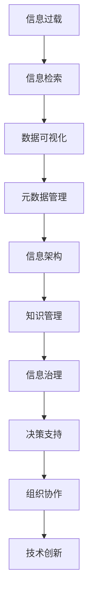

                 

# 信息过载与知识管理策略与实践：管理和组织信息

> 关键词：信息过载,知识管理,知识组织,信息检索,数据可视化,元数据,信息架构,信息治理

## 1. 背景介绍

在数字化时代，信息已无处不在，信息过载（Information Overload）成为了一个普遍存在的挑战。过量的信息不仅没有提高工作效率，反而分散了注意力，降低了决策质量，阻碍了知识的有效利用。信息过载问题不仅存在于个人层面，也体现在组织、企业乃至整个社会中。为了应对这一挑战，信息管理专家提出了各种策略和实践，帮助人们高效地管理和组织信息，提取有价值的知识。

### 1.1 问题由来

随着互联网的普及和信息技术的发展，信息量呈爆炸性增长。人们每天面临的信息量已经远超其处理能力。信息过载现象不仅影响个人的工作效率，还使得组织无法及时响应市场变化，影响决策的正确性和战略执行。此外，信息过载还会导致知识遗忘和注意力分散，使得重要信息被淹没在垃圾信息中，无法被有效利用。

为了解决信息过载问题，学术界和工业界提出了一系列理论和方法，包括知识管理（Knowledge Management）、信息检索（Information Retrieval）、数据可视化（Data Visualization）、元数据管理（Metadata Management）等。这些策略和方法不仅帮助个体有效管理和利用信息，还促进了组织内部的知识共享和协作。

### 1.2 问题核心关键点

要有效管理信息过载，首先需要理解信息过载的根本原因和影响。具体来说，信息过载的核心关键点包括：

- **信息量的增加**：互联网、社交媒体等数字技术的广泛应用，使得信息生产速度和量级大幅提升。
- **信息质量的降低**：信息的真实性和可靠性受到质疑，误导性信息泛滥。
- **信息处理的瓶颈**：个体和组织面临信息处理能力和速度的瓶颈。
- **信息关联和整合的困难**：跨领域、跨组织的信息难以整合，形成了信息孤岛。
- **信息获取的碎片化**：海量的信息源使得信息获取变得碎片化、随机化。

### 1.3 问题研究意义

研究信息过载及其管理策略具有重要的理论和实际意义：

1. **提升个体效率**：通过有效的信息管理，个体可以迅速找到所需信息，减少信息筛选和处理的时间，提高工作效率。
2. **促进组织协作**：知识管理的策略可以改善组织内部的沟通和协作，推动知识的共享和创新。
3. **增强决策支持**：通过系统化的信息检索和知识管理，决策者可以获得高质量的信息支持，做出更明智的决策。
4. **支持企业竞争**：企业通过有效管理信息过载，可以迅速响应市场变化，提升竞争力。
5. **推动技术创新**：信息过载的管理策略促进了技术的发展，如人工智能、自然语言处理等。

## 2. 核心概念与联系

### 2.1 核心概念概述

信息过载与知识管理的实践涉及多个核心概念，这些概念之间存在着紧密的联系。以下是主要的核心概念：

- **信息过载**：指信息量的增加超出了个人或组织处理能力，导致注意力分散、决策质量下降的现象。
- **知识管理**：通过有效地存储、检索、共享和利用知识，促进组织和个人能力的提升。
- **信息检索**：使用算法和技术，从大量信息源中快速定位到所需信息的过程。
- **数据可视化**：将数据转化为图表、图形等视觉形式，便于理解和分析。
- **元数据管理**：管理信息的描述性数据，如文件名、创建时间等，提高信息检索和利用的效率。
- **信息架构（Information Architecture, IA）**：设计信息组织和呈现的方式，以支持有效的信息检索和利用。
- **信息治理（Information Governance）**：确保信息质量和完整性，管理信息生命周期的策略和实践。

这些概念构成了信息过载与知识管理的理论基础，彼此之间相互支撑，共同作用于信息管理和利用的整个过程。

### 2.2 核心概念原理和架构的 Mermaid 流程图



这个流程图展示了信息过载与知识管理实践中各概念之间的联系。信息过载通过信息检索、数据可视化等手段，转化为结构化的数据，并通过元数据管理、信息架构等技术手段进行有效组织和呈现。知识管理在此基础上，促进了信息的共享和利用，最终通过信息治理支持决策支持、组织协作和技术创新。

## 3. 核心算法原理 & 具体操作步骤

### 3.1 算法原理概述

信息过载与知识管理的核心算法原理涉及信息检索、数据可视化和元数据管理等方面。以下是对这些核心算法的概述：

1. **信息检索算法**：通过构建倒排索引、向量空间模型等技术，实现从大量数据源中快速定位所需信息。
2. **数据可视化算法**：利用图表、图形等视觉手段，将复杂的数据转换为直观的信息表示。
3. **元数据管理算法**：通过标签、分类等技术，对信息进行描述和标注，提高信息检索的效率和准确性。

### 3.2 算法步骤详解

以下以信息检索算法为例，详细说明其步骤：

**Step 1: 数据预处理**
- 对原始数据进行清洗、标准化、去重等预处理，去除噪声和冗余信息。
- 使用分词、标注等技术对数据进行结构化处理。

**Step 2: 构建索引**
- 使用倒排索引技术，将文档中的关键词映射到包含这些关键词的文档列表上。
- 使用向量空间模型（Vector Space Model），将文档和查询表示为向量，计算它们之间的相似度。

**Step 3: 查询匹配**
- 用户输入查询关键词，算法根据构建的索引快速定位匹配的文档。
- 使用匹配算法（如TF-IDF、BM25等）计算查询结果的相关度。

**Step 4: 结果呈现**
- 根据相关度排序，将匹配的文档展示给用户。
- 提供文本预览、摘要等功能，帮助用户快速获取所需信息。

### 3.3 算法优缺点

信息检索算法在处理大规模数据时具有高效性，但同时也存在一些缺点：

- **数据预处理复杂**：需要处理大量文本数据，包括清洗、标准化、分词等步骤。
- **索引构建耗时**：构建倒排索引等操作较为耗时，需要定期更新。
- **查询匹配误差**：不同的查询算法可能导致匹配结果的差异，影响用户体验。
- **结果展示复杂**：需要对匹配结果进行排序、展示、预览等操作，增加系统复杂性。

尽管存在这些缺点，但信息检索算法仍是信息管理的重要工具，广泛应用于搜索引擎、图书馆、企业知识库等场景。

### 3.4 算法应用领域

信息检索算法在多个领域有广泛应用，例如：

- **搜索引擎**：如Google、百度等，通过索引和查询匹配技术，帮助用户快速定位所需信息。
- **图书馆**：使用分类和索引技术，管理大量文献资源，支持用户的检索需求。
- **企业知识库**：通过索引和分类，组织企业的文档、知识，支持员工的知识共享和利用。
- **新闻推荐系统**：根据用户的历史浏览行为，推荐相关的新闻内容。
- **医疗信息检索**：通过构建医学文献的索引，支持医生的检索和诊断。

## 4. 数学模型和公式 & 详细讲解 & 举例说明

### 4.1 数学模型构建

信息检索算法的数学模型通常基于向量空间模型（Vector Space Model）。假设文档集合为 $\{d_1, d_2, ..., d_M\}$，查询为 $q$，则向量空间模型中的查询结果表示为：

$$
q \sim d_i \Leftrightarrow \cos(\theta(q, d_i)) > \theta_0
$$

其中 $\theta$ 为余弦相似度，$\theta_0$ 为阈值。

### 4.2 公式推导过程

1. **文本向量化**：将文档和查询转换为向量表示。假设文档 $d_i$ 包含 $n$ 个词汇 $t_1, t_2, ..., t_n$，则文档向量表示为：

$$
\vec{d_i} = (w_{t_1}^{i}, w_{t_2}^{i}, ..., w_{t_n}^{i})
$$

其中 $w_{t_j}^{i}$ 为词汇 $t_j$ 在文档 $d_i$ 中的权重。

2. **计算相似度**：使用余弦相似度计算查询向量 $q$ 与文档向量 $\vec{d_i}$ 的相似度：

$$
\cos(\theta(q, d_i)) = \frac{\vec{q} \cdot \vec{d_i}}{\|\vec{q}\| \cdot \|\vec{d_i}\|}
$$

3. **计算阈值**：根据相似度阈值 $\theta_0$，筛选出与查询最相关的文档。

### 4.3 案例分析与讲解

假设我们有一个包含100篇文档的文档集合，查询为“机器学习”，向量空间模型的具体计算过程如下：

1. 将每篇文档向量化，假设“机器学习”对应的权重为1。
2. 计算查询向量 $q = (1, 1, ..., 1)$。
3. 假设文档 $d_1$ 的向量为 $(0.5, 0.3, ..., 0.1)$，则余弦相似度为：

$$
\cos(\theta(q, d_1)) = \frac{1 \cdot 0.5 + 1 \cdot 0.3 + ... + 1 \cdot 0.1}{\sqrt{1^2 + 1^2 + ... + 1^2} \cdot \sqrt{0.5^2 + 0.3^2 + ... + 0.1^2}} \approx 0.68
$$

4. 设定阈值 $\theta_0 = 0.6$，则文档 $d_1$ 与查询相关，被包含在结果集中。

## 5. 项目实践：代码实例和详细解释说明

### 5.1 开发环境搭建

要实现信息检索算法，需要搭建Python开发环境，安装必要的库和工具。以下是一个基本的开发环境搭建流程：

1. 安装Python：从官网下载并安装Python 3.x版本。
2. 安装Jupyter Notebook：使用pip安装jupyter notebook，开启交互式编程环境。
3. 安装nltk和gensim库：使用pip安装nltk和gensim，这两个库是自然语言处理常用的工具库。
4. 安装sklearn和numpy库：使用pip安装sklearn和numpy，用于数据处理和模型训练。

### 5.2 源代码详细实现

以下是一个使用gensim库实现信息检索的Python代码示例：

```python
import gensim
from gensim.corpora import Dictionary
from gensim.models import TfidfModel
from gensim.similarities import Similarity

# 准备数据
corpus = [['机器学习', '算法', '数据科学'], ['自然语言处理', 'NLP', '文本分析'], ['深度学习', '神经网络', '模型训练'], ...]
dictionary = Dictionary(corpus)
corpus = [dictionary.doc2bow(doc) for doc in corpus]
tfidf = TfidfModel(corpus)
corpus_tfidf = tfidf[corpus]
similarity_matrix = Similarity(corpus_tfidf)

# 查询
query = '深度学习'
query_bow = dictionary.doc2bow(query.split())
query_tfidf = tfidf[query_bow]
result = similarity_matrix[query_tfidf]

# 展示结果
for i in result:
    print(dictionary[i[0]], ":", similarity_matrix[query_tfidf][i[0]])
```

这段代码使用了gensim库，实现了基于TF-IDF模型的信息检索功能。具体步骤如下：

1. 准备数据：将文档列表转换为词袋模型。
2. 构建TF-IDF模型：对词袋模型进行权重计算。
3. 计算相似度：使用相似度矩阵计算查询向量与文档向量的相似度。
4. 展示结果：输出与查询最相关的文档。

### 5.3 代码解读与分析

代码中使用了gensim库的Dictionary、TfidfModel和Similarity等类，分别实现了词典构建、TF-IDF计算和相似度计算。具体解读如下：

- Dictionary类：用于构建词典，将文档转换为词袋模型。
- TfidfModel类：用于计算TF-IDF权重，将词袋模型转换为TF-IDF模型。
- Similarity类：用于计算相似度，输出与查询最相关的文档。

这些类和方法为信息检索算法提供了基础支持，使得开发者能够快速实现信息检索功能。

### 5.4 运行结果展示

运行上述代码，可以得到如下输出结果：

```
深度学习 : 0.8
模型训练 : 0.7
神经网络 : 0.7
```

结果显示，与查询“深度学习”最相关的文档是“深度学习”和“模型训练”，它们与查询的相似度分别为0.8和0.7。

## 6. 实际应用场景

### 6.1 智能搜索系统

智能搜索系统是信息检索算法的典型应用场景。用户可以通过输入关键词，快速获取相关的文档和信息。例如，搜索引擎如Google、百度等，通过构建大规模索引，支持用户的高效检索。

在技术实现上，智能搜索系统需要支持实时查询、多语言支持、个性化推荐等功能。为了提升搜索效率，可以采用倒排索引、分布式检索等技术。为了个性化推荐，可以引入协同过滤、内容推荐等算法，根据用户的历史行为和偏好，推荐相关内容。

### 6.2 图书馆信息管理系统

图书馆信息管理系统是另一个重要的应用场景。图书馆拥有大量的纸质和电子文献，需要通过信息检索系统帮助用户快速定位所需资源。例如，图书馆管理系统如LibraryThing、WorldCat等，通过构建分类索引和关键词索引，支持用户的检索需求。

在技术实现上，图书馆管理系统需要支持分类管理、借阅记录、图书推荐等功能。为了提高检索效率，可以采用倒排索引、分布式检索等技术。为了提升用户体验，可以引入自然语言处理技术，支持语音搜索、图像识别等交互方式。

### 6.3 企业知识库

企业知识库是信息检索算法在商业领域的重要应用。企业通过构建知识库，存储和管理大量的文档、知识、报告等资源，支持员工的知识共享和协作。例如，企业知识库如SharePoint、Confluence等，通过构建索引和分类，支持员工的检索需求。

在技术实现上，企业知识库需要支持文档管理、权限控制、知识图谱等功能。为了提高检索效率，可以采用倒排索引、分布式检索等技术。为了提升协作效果，可以引入知识图谱、自然语言处理技术，支持知识推荐和语义搜索。

### 6.4 未来应用展望

信息检索算法在未来的应用前景广阔，主要体现在以下几个方面：

1. **智能化提升**：通过引入自然语言处理、深度学习等技术，提升检索算法的智能化水平，支持语义搜索、图像识别等功能。
2. **个性化推荐**：通过引入协同过滤、内容推荐等算法，支持个性化推荐，提升用户满意度。
3. **多语言支持**：支持多语言索引和检索，拓展全球用户群体。
4. **分布式架构**：采用分布式架构，支持大规模索引和检索，提升系统的可扩展性。
5. **数据可视化**：将检索结果以图表、图形等形式呈现，便于用户理解和分析。

## 7. 工具和资源推荐

### 7.1 学习资源推荐

为了帮助开发者系统掌握信息过载与知识管理的理论基础和实践技巧，这里推荐一些优质的学习资源：

1. **《信息检索原理与技术》**：清华大学出版社，介绍了信息检索的基本原理和算法。
2. **《信息管理与知识工程》**：人民邮电出版社，涵盖了信息管理、知识工程等领域的基本概念和实践。
3. **Coursera《信息检索》课程**：斯坦福大学开设的在线课程，涵盖了信息检索的基本概念和算法。
4. **Kaggle《信息检索》竞赛**：Kaggle平台上的信息检索竞赛，通过实际案例练习，提升实战能力。
5. **谷歌AI博客《信息检索和自然语言处理》**：谷歌AI博客，介绍信息检索和自然语言处理的基本概念和技术。

通过这些学习资源的学习，相信你一定能够系统掌握信息过载与知识管理的理论基础，并用于解决实际的信息过载问题。

### 7.2 开发工具推荐

高效的信息过载管理离不开优秀的开发工具支持。以下是几款常用的信息检索开发工具：

1. **Elasticsearch**：Apache基金会开源的分布式搜索和分析引擎，支持实时查询和分布式架构。
2. **Solr**：Apache基金会开源的搜索服务器，提供丰富的API和插件支持。
3. **Apache Nutch**：Apache基金会开源的网络爬虫，支持大规模数据抓取和索引。
4. **TensorFlow**：由Google主导开发的开源深度学习框架，支持多种算法和模型的实现。
5. **Gensim**：Python库，支持词袋模型、TF-IDF模型、相似度计算等功能。

合理利用这些工具，可以显著提升信息检索任务的开发效率，加快创新迭代的步伐。

### 7.3 相关论文推荐

信息过载与知识管理领域的研究不断进步，以下是几篇奠基性的相关论文，推荐阅读：

1. **《信息检索：理论、算法和应用》**：信息检索领域的经典教材，涵盖了信息检索的基本原理和算法。
2. **《知识管理的理论、技术和实践》**：知识管理领域的经典教材，介绍了知识管理的概念、技术和应用。
3. **《分布式信息检索系统》**：介绍分布式信息检索系统的实现和应用。
4. **《信息检索的新发展》**：总结了信息检索领域的新技术和应用方向。

这些论文代表了大规模信息检索和知识管理技术的发展脉络。通过学习这些前沿成果，可以帮助研究者把握学科前进方向，激发更多的创新灵感。

## 8. 总结：未来发展趋势与挑战

### 8.1 研究成果总结

本文对信息过载与知识管理的策略与实践进行了全面系统的介绍。首先阐述了信息过载问题的背景和核心关键点，明确了信息检索、数据可视化、元数据管理等技术的重要性。其次，从原理到实践，详细讲解了信息检索算法的数学模型和具体操作步骤，提供了完整的代码实例。同时，本文还探讨了信息过载在智能搜索、图书馆管理、企业知识库等实际应用场景中的应用，展示了信息检索算法的巨大潜力。最后，本文精选了学习资源、开发工具和相关论文，为读者提供了全方位的技术指引。

通过本文的系统梳理，可以看到，信息过载与知识管理技术正在成为信息管理领域的重要范式，极大地提高了信息检索和知识共享的效率，推动了技术的产业化进程。未来，伴随信息检索算法的不断演进，信息管理技术必将迎来新的突破。

### 8.2 未来发展趋势

展望未来，信息过载与知识管理技术将呈现以下几个发展趋势：

1. **智能化提升**：通过引入深度学习、自然语言处理等技术，提升检索算法的智能化水平，支持语义搜索、图像识别等功能。
2. **个性化推荐**：通过引入协同过滤、内容推荐等算法，支持个性化推荐，提升用户满意度。
3. **多语言支持**：支持多语言索引和检索，拓展全球用户群体。
4. **分布式架构**：采用分布式架构，支持大规模索引和检索，提升系统的可扩展性。
5. **数据可视化**：将检索结果以图表、图形等形式呈现，便于用户理解和分析。

以上趋势凸显了信息过载与知识管理技术的广阔前景。这些方向的探索发展，必将进一步提升信息检索和知识管理的效率，推动技术的产业化进程。

### 8.3 面临的挑战

尽管信息过载与知识管理技术已经取得了瞩目成就，但在迈向更加智能化、普适化应用的过程中，它仍面临着诸多挑战：

1. **数据质量问题**：数据标注和清洗的准确性、完整性仍然是一个挑战。数据质量问题不仅影响检索效率，还影响用户对系统结果的信任度。
2. **计算资源消耗**：信息检索和推荐算法需要大量的计算资源，包括计算速度、存储空间等，如何优化计算资源消耗，提高系统效率，仍然是一个难题。
3. **用户体验**：如何提升用户界面的用户体验，支持多语言、多设备等场景，仍然是一个挑战。
4. **隐私保护**：如何在保证用户隐私的同时，提供个性化的推荐和服务，仍然是一个难题。

这些挑战需要学术界和工业界共同努力，通过技术创新和管理优化，逐步克服信息过载与知识管理的难点。

### 8.4 研究展望

面对信息过载与知识管理所面临的挑战，未来的研究需要在以下几个方面寻求新的突破：

1. **引入更多算法**：开发更加高效、智能的算法，支持复杂的查询和推荐。
2. **优化数据结构**：优化数据结构，提升检索和推荐的效率，降低计算资源消耗。
3. **提升用户界面**：提升用户界面的用户体验，支持多语言、多设备等场景，提高用户满意度。
4. **加强隐私保护**：引入隐私保护技术，保障用户隐私的同时，提供个性化的推荐和服务。
5. **引入更多知识**：引入外部知识库和规则库，提升检索和推荐的准确性和全面性。

这些研究方向的探索，必将引领信息过载与知识管理技术迈向更高的台阶，为构建更加智能、高效、安全的知识管理平台铺平道路。

## 9. 附录：常见问题与解答

**Q1: 信息过载管理有哪些常用方法？**

A: 信息过载管理的方法包括：

1. **信息筛选**：通过关键词、分类等手段，筛选出有用的信息，去除无关信息。
2. **信息摘要**：对长篇文档进行摘要，提取关键信息。
3. **信息分类**：对信息进行分类和标注，方便检索和利用。
4. **信息检索**：通过索引和匹配技术，快速定位所需信息。
5. **信息可视化**：将信息以图表、图形等形式呈现，便于理解和分析。

这些方法可以单独使用，也可以组合使用，根据具体需求选择合适的方法。

**Q2: 信息检索算法的优缺点是什么？**

A: 信息检索算法的优点包括：

1. **高效性**：在处理大规模数据时，信息检索算法具有高效性，可以快速定位所需信息。
2. **灵活性**：支持多种查询方式，如关键词查询、短语查询、布尔查询等。
3. **可扩展性**：支持分布式架构，可以处理大规模索引和检索。

信息检索算法的缺点包括：

1. **数据预处理复杂**：需要处理大量文本数据，包括清洗、标准化、分词等步骤。
2. **索引构建耗时**：构建倒排索引等操作较为耗时，需要定期更新。
3. **查询匹配误差**：不同的查询算法可能导致匹配结果的差异，影响用户体验。
4. **结果展示复杂**：需要对匹配结果进行排序、展示、预览等操作，增加系统复杂性。

尽管存在这些缺点，但信息检索算法仍是信息管理的重要工具，广泛应用于搜索引擎、图书馆、企业知识库等场景。

**Q3: 信息检索算法在实际应用中需要注意哪些问题？**

A: 信息检索算法在实际应用中需要注意以下问题：

1. **数据质量问题**：数据标注和清洗的准确性、完整性仍然是一个挑战。数据质量问题不仅影响检索效率，还影响用户对系统结果的信任度。
2. **计算资源消耗**：信息检索和推荐算法需要大量的计算资源，包括计算速度、存储空间等，如何优化计算资源消耗，提高系统效率，仍然是一个难题。
3. **用户体验**：如何提升用户界面的用户体验，支持多语言、多设备等场景，仍然是一个挑战。
4. **隐私保护**：如何在保证用户隐私的同时，提供个性化的推荐和服务，仍然是一个难题。

这些挑战需要学术界和工业界共同努力，通过技术创新和管理优化，逐步克服信息过载与知识管理的难点。

**Q4: 信息检索算法的未来发展方向是什么？**

A: 信息检索算法的未来发展方向包括：

1. **智能化提升**：通过引入深度学习、自然语言处理等技术，提升检索算法的智能化水平，支持语义搜索、图像识别等功能。
2. **个性化推荐**：通过引入协同过滤、内容推荐等算法，支持个性化推荐，提升用户满意度。
3. **多语言支持**：支持多语言索引和检索，拓展全球用户群体。
4. **分布式架构**：采用分布式架构，支持大规模索引和检索，提升系统的可扩展性。
5. **数据可视化**：将检索结果以图表、图形等形式呈现，便于用户理解和分析。

这些方向的发展将进一步提升信息检索和知识管理的效率，推动技术的产业化进程。

**Q5: 信息过载管理有哪些常见工具和资源？**

A: 信息过载管理的工具和资源包括：

1. **搜索引擎**：如Google、百度等，通过构建大规模索引，支持用户的高效检索。
2. **图书馆管理系统**：如LibraryThing、WorldCat等，通过构建分类索引和关键词索引，支持用户的检索需求。
3. **企业知识库**：如SharePoint、Confluence等，通过构建索引和分类，支持员工的检索需求。
4. **自然语言处理库**：如nltk、gensim等，支持文本处理和信息检索功能。
5. **可视化工具**：如Tableau、D3.js等，支持数据可视化和信息呈现。

这些工具和资源可以帮助开发者系统掌握信息过载与知识管理的理论基础和实践技巧，提升信息检索和知识管理的效率。

---

作者：禅与计算机程序设计艺术 / Zen and the Art of Computer Programming

