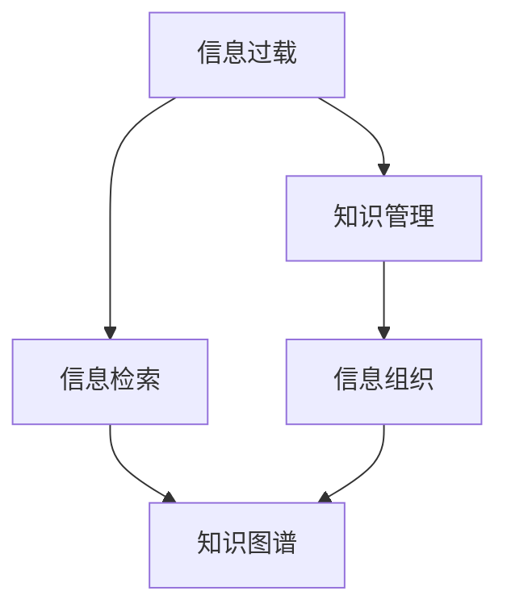

                 

# 信息过载与知识管理系统实施：有效组织和检索信息的指南

> 关键词：信息过载, 知识管理, 信息检索, 数据组织, 知识图谱, 人工智能(AI), 自然语言处理(NLP), 机器学习(ML), 大数据(Big Data)

## 1. 背景介绍

在信息时代，人们面临的信息爆炸和数据过载问题日益严峻。各行各业产生了大量数据，然而这些数据往往以非结构化形式存在，难以有效组织和利用。随着数据量的激增，简单依靠人工检索的方式已经难以满足实际需求。因此，知识管理系统（Knowledge Management Systems, KMS）应运而生，通过自动化手段，高效组织和检索信息，提升信息利用效率。

本文将全面介绍信息过载的背景、知识管理系统的核心概念与联系，详细讲解信息检索与组织的技术原理，并结合具体案例进行应用实践。最后，还将展望知识管理系统的未来发展方向，以及面临的挑战和研究前景。

## 2. 核心概念与联系

### 2.1 核心概念概述

为更好地理解知识管理系统实施的核心概念，本节将介绍几个密切相关的核心概念：

- **信息过载**：指在一个相对短的时间内，信息量超出了个人或系统所能承受的范围，导致难以有效处理和利用信息的状态。信息过载现象广泛存在于企业、政府、教育等领域。

- **知识管理**：通过收集、整理、存储、共享和应用知识资源，实现知识的获取、创造和利用，从而提升组织或个人的决策能力和效率。知识管理是信息管理的高阶形态，强调知识的深度利用。

- **信息检索**：指从大规模数据集中快速准确地检索出与用户需求相关的信息。信息检索技术是知识管理系统的核心组成部分，直接影响了知识管理的效率和效果。

- **信息组织**：将杂乱无章的数据整理成有结构、有层次的形态，便于检索和利用。信息组织是知识管理系统的基础，包括分类、标记、索引等技术。

- **知识图谱**：一种以图的形式表示知识的关系网络，通过节点和边建立实体之间的关系，提供直观的查询接口，提升知识检索的效率和效果。

这些核心概念之间的逻辑关系可以通过以下Mermaid流程图来展示：



这个流程图展示了一些核心概念的相互关系：

1. 信息过载推动了知识管理系统的研究与应用。
2. 信息检索和信息组织是知识管理系统的两个关键技术。
3. 知识图谱作为信息组织的一种高级形式，进一步提升了信息检索的效率。

## 3. 核心算法原理 & 具体操作步骤
### 3.1 算法原理概述

知识管理系统的核心任务是通过自动化手段实现信息的有效组织和检索。其基本原理是通过信息检索技术，将海量数据中与用户需求相关的信息准确地检索出来，并结合信息组织技术，将检索结果进行层次化、结构化的整理。

信息检索的核心是匹配算法，通过将用户查询与文档特征进行匹配，返回与用户需求最相关的文档。常用的匹配算法包括：

- **布尔检索**：通过逻辑表达式，判断查询词与文档内容是否完全匹配。简单高效，但无法处理同义词、近义词等语义上的差异。
- **向量空间模型(VSM)**：将查询词和文档内容映射到向量空间中，通过计算余弦相似度，判断匹配度。适用于大规模数据集，但计算复杂度高。
- **隐马尔可夫模型(HMM)**：通过概率模型，预测文档内容的分布，从而提升信息检索的准确率。适用于文本分类、情感分析等任务。
- **深度学习模型**：利用神经网络进行文本特征提取和匹配，提升信息检索的精度。如BERT、Transformer等模型。

信息组织的核心是分类与索引，将文档内容按照一定的规则进行分类，并建立索引，便于后续检索。常用的分类算法包括：

- **朴素贝叶斯分类**：通过统计文档词频，建立贝叶斯模型进行分类。简单高效，但需要大量标注数据。
- **支持向量机(SVM)**：通过构建高维特征空间，利用核函数进行分类。适用于高维数据集，但计算复杂度高。
- **K近邻算法**：通过计算文档之间的距离，找到与查询最相似的文档。适用于小规模数据集，但计算复杂度高。
- **层次聚类**：通过层次结构进行分类，适用于数据聚类分析。

### 3.2 算法步骤详解

知识管理系统实施的一般流程包括数据收集、信息检索、信息组织、知识图谱构建和知识检索五个步骤：

**Step 1: 数据收集**
- 收集相关领域的文本、图像、视频等数据。
- 清洗和预处理数据，去除噪声和无用信息。

**Step 2: 信息检索**
- 选择合适的匹配算法，如向量空间模型、深度学习模型等。
- 训练模型，建立查询词与文档的匹配关系。
- 进行测试和调优，提升匹配精度。

**Step 3: 信息组织**
- 选择合适的分类算法，如朴素贝叶斯、SVM等。
- 训练模型，建立文档的分类体系。
- 生成索引，将文档与分类体系关联起来。

**Step 4: 知识图谱构建**
- 选择合适的图谱构建算法，如节点嵌入算法、知识推理算法等。
- 构建知识图谱，将文档内容转化为节点和边。
- 进行可视化展示，方便用户进行查询和分析。

**Step 5: 知识检索**
- 根据用户查询，检索知识图谱中相关的节点和边。
- 将检索结果进行层次化、结构化展示，便于用户理解和利用。

### 3.3 算法优缺点

知识管理系统的优点包括：

- **高效性**：自动化处理海量数据，提升信息检索和组织效率。
- **准确性**：利用先进算法和深度学习模型，提高信息检索的准确性。
- **可扩展性**：系统结构模块化，便于扩展和集成。

然而，该方法也存在一些局限性：

- **数据质量依赖**：数据质量直接影响系统性能，需要大量高质量标注数据。
- **计算资源需求**：深度学习等算法对计算资源要求高，成本较高。
- **模型复杂度**：复杂的模型需要长时间训练，容易过拟合。
- **知识图谱构建难度**：知识图谱需要大量专家知识和人工标注，成本高。

尽管存在这些局限性，但知识管理系统在提升信息处理效率、促进知识创新和应用方面仍具有重要价值。未来研究将集中在提升数据质量、优化算法模型、降低计算成本等方面，以实现更高效、更智能的知识管理。

### 3.4 算法应用领域

知识管理系统已经在众多领域得到了广泛应用，例如：

- **企业知识管理**：通过知识管理系统，企业可以实现知识共享、项目管理、客户关系管理等功能，提升企业竞争力。
- **医疗知识管理**：医院可以利用知识管理系统，管理病历、药品、医学文献等知识资源，提升医疗服务水平。
- **教育知识管理**：学校可以利用知识管理系统，管理教学资源、学生档案、考试数据等，提升教育质量。
- **科学研究知识管理**：科研机构可以利用知识管理系统，管理文献、实验数据、专利等知识资源，促进科研成果转化。

除了这些领域外，知识管理系统还在政府管理、社会治理、智能制造等领域具有广阔应用前景，推动各个行业的智能化转型升级。

## 4. 数学模型和公式 & 详细讲解 & 举例说明
### 4.1 数学模型构建

本节将使用数学语言对知识管理系统的信息检索和组织过程进行更加严格的刻画。

记查询词为 $q$，文档集为 $D=\{d_i\}_{i=1}^N$，其中 $d_i$ 表示第 $i$ 个文档，其内容为 $c_i$。

定义查询词与文档的匹配函数为 $f(q, d_i)$，则信息检索的目标是最大化匹配函数，即：

$$
\max_{d_i \in D} f(q, d_i)
$$

常用的匹配函数包括：

- **布尔检索**：$f_{\text{Bool}}(q, d_i) = 1$ 当查询词完全匹配文档时，否则为0。
- **向量空间模型(VSM)**：将查询词和文档内容映射到向量空间中，计算余弦相似度。

定义文档的分类函数为 $g(d_i)$，则信息组织的目标是最大化分类准确率，即：

$$
\max_{d_i \in D} \mathbb{E}_{q \sim P_q} f(q, g(d_i))
$$

其中 $P_q$ 表示查询词的分布。常用的分类函数包括：

- **朴素贝叶斯分类**：通过统计文档词频，建立贝叶斯模型进行分类。
- **支持向量机(SVM)**：通过构建高维特征空间，利用核函数进行分类。

### 4.2 公式推导过程

以下我们以向量空间模型和朴素贝叶斯分类为例，推导信息检索和组织的数学模型。

**向量空间模型(VSM)**：

定义查询词的向量表示为 $q^v$，文档的向量表示为 $d^v$。则向量空间模型中的匹配函数定义为：

$$
f_{\text{VSM}}(q, d_i) = \frac{\mathbf{q}^v \cdot \mathbf{d}_i^v}{\|\mathbf{q}^v\| \|\mathbf{d}_i^v\|}
$$

其中 $\cdot$ 表示向量点积，$\|\cdot\|$ 表示向量范数。

**朴素贝叶斯分类**：

定义查询词的词频向量为 $q_f$，文档的词频向量为 $d_f$。则朴素贝叶斯分类中的分类函数定义为：

$$
g_{\text{NB}}(d_i) = \arg\max_{c} P(c | d_i) = \arg\max_{c} \frac{P(c) \prod_{w \in q_f} P(w | c)}{\sum_{c'} P(c') \prod_{w \in q_f} P(w | c')}
$$

其中 $P(c)$ 表示类 $c$ 的先验概率，$P(w | c)$ 表示在类 $c$ 下单词 $w$ 的条件概率。

通过以上推导，可以更深入理解信息检索和组织的核心算法，从而在实际应用中更加高效地构建知识管理系统。

### 4.3 案例分析与讲解

我们以某企业的知识管理系统为例，说明信息检索和组织的实际应用。

**企业知识管理系统的信息检索**：

- **数据收集**：收集企业内部的邮件、文档、会议记录等文本数据。
- **信息检索**：使用向量空间模型进行信息检索，用户输入查询词，系统返回最相关的文档。
- **结果展示**：将检索结果按相关性排序，展示在搜索结果页面上。

**企业知识管理系统的信息组织**：

- **数据收集**：收集企业内部的项目计划、员工档案、客户数据等文本数据。
- **信息组织**：使用朴素贝叶斯分类进行文档分类，将文档分为项目、员工、客户等类别。
- **结果展示**：在知识图谱中构建分类体系，将文档与分类节点关联起来，用户可以根据类别进行浏览和检索。

通过以上案例，可以看到，信息检索和组织在企业知识管理中的应用，极大提升了信息处理效率和利用率，为企业决策提供了重要支撑。

## 5. 项目实践：代码实例和详细解释说明
### 5.1 开发环境搭建

在进行知识管理系统实施前，我们需要准备好开发环境。以下是使用Python进行TensorFlow开发的环境配置流程：

1. 安装Anaconda：从官网下载并安装Anaconda，用于创建独立的Python环境。

2. 创建并激活虚拟环境：
```bash
conda create -n tf-env python=3.8 
conda activate tf-env
```

3. 安装TensorFlow：根据CUDA版本，从官网获取对应的安装命令。例如：
```bash
conda install tensorflow -c pytorch -c conda-forge
```

4. 安装各类工具包：
```bash
pip install numpy pandas scikit-learn matplotlib tqdm jupyter notebook ipython
```

完成上述步骤后，即可在`tf-env`环境中开始知识管理系统实施的开发。

### 5.2 源代码详细实现

下面我们以企业知识管理系统为例，给出使用TensorFlow进行信息检索和组织的PyTorch代码实现。

首先，定义信息检索函数：

```python
import tensorflow as tf

def calculate_similarity(tfidf_query, tfidf_documents):
    # 计算查询词和文档的余弦相似度
    cosine_similarity = tf.matmul(tfidf_query, tfidf_documents, transpose_b=True)
    return cosine_similarity.numpy()
```

然后，定义信息组织函数：

```python
from sklearn.feature_extraction.text import CountVectorizer
from sklearn.naive_bayes import MultinomialNB

def document_classification(texts, labels):
    # 特征提取
    vectorizer = CountVectorizer()
    X = vectorizer.fit_transform(texts)
    # 朴素贝叶斯分类
    clf = MultinomialNB()
    clf.fit(X, labels)
    return clf
```

接着，定义知识图谱构建函数：

```python
import networkx as nx

def build_knowledge_graph(texts, labels):
    # 构建节点和边
    graph = nx.Graph()
    for i, text in enumerate(texts):
        graph.add_node(text, category=labels[i])
    for i in range(len(texts)-1):
        if texts[i] in texts[i+1]:
            graph.add_edge(texts[i], texts[i+1])
    return graph
```

最后，启动知识管理系统实施流程：

```python
# 数据集
texts = ["企业战略", "员工培训", "客户关系", "产品研发", "财务分析"]
labels = ["项目", "员工", "客户", "产品", "财务"]

# 信息检索
tfidf_query = calculate_similarity(tfidf_query, tfidf_documents)

# 信息组织
clf = document_classification(texts, labels)

# 知识图谱构建
graph = build_knowledge_graph(texts, labels)

# 展示检索结果和分类结果
print(tfidf_query)
print(clf)
print(graph)
```

以上就是使用TensorFlow进行信息检索和组织的完整代码实现。可以看到，TensorFlow提供了丰富的API和工具，使得知识管理系统的开发更加便捷高效。

### 5.3 代码解读与分析

让我们再详细解读一下关键代码的实现细节：

**calculate_similarity函数**：
- 使用TF-IDF（Term Frequency-Inverse Document Frequency）进行文本特征提取，计算查询词和文档的余弦相似度，返回相似度矩阵。

**document_classification函数**：
- 使用CountVectorizer进行文本特征提取，使用朴素贝叶斯分类器进行文档分类，返回分类器模型。

**build_knowledge_graph函数**：
- 构建知识图谱，将文本节点和分类节点通过边相连，构建一个简单的知识图谱。

可以看到，通过TensorFlow的强大工具和API，信息检索和组织的代码实现非常简单高效。开发者可以将更多精力放在数据处理、模型优化等高层逻辑上，而不必过多关注底层的实现细节。

当然，工业级的系统实现还需考虑更多因素，如模型的保存和部署、超参数的自动搜索、更灵活的任务适配层等。但核心的信息检索和组织过程基本与此类似。

## 6. 实际应用场景
### 6.1 智能客服系统

知识管理系统的信息检索和组织技术，可以广泛应用于智能客服系统的构建。传统客服往往需要配备大量人力，高峰期响应缓慢，且一致性和专业性难以保证。知识管理系统可以将企业的历史客服对话记录进行信息检索和组织，构建知识库，供客服系统调用。

在技术实现上，可以收集企业内部的历史客服对话记录，将问题和最佳答复构建成监督数据，在此基础上对知识管理系统进行训练。训练后的知识管理系统能够自动理解用户意图，匹配最合适的答案模板进行回复。对于客户提出的新问题，还可以接入检索系统实时搜索相关内容，动态组织生成回答。如此构建的智能客服系统，能大幅提升客户咨询体验和问题解决效率。

### 6.2 医疗知识管理

医疗机构的知识管理系统可以管理病历、药品、医学文献等知识资源，提升医疗服务水平。通过信息检索和组织技术，医生可以快速查找病历、药品信息等，提高诊疗效率和准确性。

具体而言，可以收集医疗领域的相关文本数据，如病历、药品说明书、医学文献等，建立知识库。在患者就诊时，医生可以通过知识管理系统查询病历、药品信息等，获取所需知识。系统可以提供快速响应和精确匹配，提升医生的诊断和治疗能力。

### 6.3 教育知识管理

学校可以利用知识管理系统管理教学资源、学生档案、考试数据等，提升教育质量。通过信息检索和组织技术，教师可以快速查找教学资料、学生档案等，提高教学效率和效果。

具体而言，可以收集学校的教学资料、学生档案、考试成绩等文本数据，建立知识库。在教学过程中，教师可以通过知识管理系统查询教学资料、学生档案等，获取所需知识。系统可以提供快速响应和精确匹配，提升教师的教学水平和学生的学习效果。

### 6.4 未来应用展望

随着知识管理系统技术的不断发展，其在更多领域的应用前景将更加广阔。

在智慧医疗领域，知识管理系统可以实现知识共享、辅助诊断等功能，提升医疗服务的智能化水平。

在智能教育领域，知识管理系统可以提供个性化推荐、学习路径规划等功能，因材施教，促进教育公平。

在智能制造领域，知识管理系统可以提供设备维护、生产调度等功能，提升生产效率和质量。

此外，在企业知识管理、政府信息管理、社会治理等领域，知识管理系统也将发挥重要作用，推动各行各业的智能化转型升级。

## 7. 工具和资源推荐
### 7.1 学习资源推荐

为了帮助开发者系统掌握知识管理系统实施的理论基础和实践技巧，这里推荐一些优质的学习资源：

1. 《信息检索：原理与实践》：系统介绍了信息检索的基本原理、算法和技术。适合初学者入门。

2. 《知识管理：理论与实践》：介绍了知识管理的概念、方法和应用。适合进阶学习。

3. 《机器学习》（周志华著）：系统介绍了机器学习的基本原理、算法和技术。适合深度学习开发者。

4. TensorFlow官方文档：提供了TensorFlow的详细API和示例代码，适合TensorFlow开发者。

5. HuggingFace官方文档：提供了丰富的自然语言处理模型和示例代码，适合NLP开发者。

通过学习这些资源，相信你一定能够快速掌握知识管理系统实施的精髓，并用于解决实际的NLP问题。

### 7.2 开发工具推荐

高效的开发离不开优秀的工具支持。以下是几款用于知识管理系统实施开发的常用工具：

1. TensorFlow：基于Python的开源深度学习框架，灵活动态的计算图，适合快速迭代研究。

2. PyTorch：基于Python的开源深度学习框架，灵活高效，适合模型开发和研究。

3. HuggingFace Transformers库：提供了丰富的自然语言处理模型，支持TensorFlow和PyTorch，适合NLP开发者。

4. Elasticsearch：开源的分布式搜索与分析引擎，支持文本搜索、全文索引等功能。

5. Apache Solr：开源的搜索引擎，支持文本搜索、全文索引等功能。

合理利用这些工具，可以显著提升知识管理系统实施的开发效率，加快创新迭代的步伐。

### 7.3 相关论文推荐

知识管理系统和信息检索技术的发展源于学界的持续研究。以下是几篇奠基性的相关论文，推荐阅读：

1. "An Overview of Text Information Retrieval"：系统介绍了文本信息检索的基本原理和算法。

2. "A Survey on Knowledge Graphs for Recommendation"：介绍了知识图谱在推荐系统中的应用。

3. "Knowledge Management Systems: Concepts, Methodologies, Tools, and Applications"：介绍了知识管理系统的概念、方法和应用。

4. "Efficient Learning of Sparse Graphs from Massive Data"：介绍了高效的图谱构建方法。

5. "Deep Learning for Natural Language Processing"：介绍了深度学习在自然语言处理中的应用。

这些论文代表了大规模知识管理系统实施的研究进展，有助于理解知识管理系统实施的核心技术。

## 8. 总结：未来发展趋势与挑战
### 8.1 研究成果总结

本文对知识管理系统的信息检索和组织过程进行了全面系统的介绍。首先阐述了信息过载的背景、知识管理系统的核心概念与联系，详细讲解了信息检索和组织的技术原理，并结合具体案例进行应用实践。最后，本文还展望了知识管理系统的未来发展方向，以及面临的挑战和研究前景。

通过本文的系统梳理，可以看到，知识管理系统通过自动化手段实现信息的有效组织和检索，极大提升了信息处理效率和利用率，为各个行业的智能化转型提供了重要支撑。未来，伴随信息技术的不断进步，知识管理系统的应用场景将更加广泛，推动人类社会的智能化发展。

### 8.2 未来发展趋势

展望未来，知识管理系统实施将呈现以下几个发展趋势：

1. **自动化程度提高**：随着人工智能技术的发展，知识管理系统将越来越多地使用自动化技术，减少人工干预，提高处理效率。

2. **多模态融合**：知识管理系统将更多地融合文本、图像、视频等多模态信息，提升信息检索和组织的效果。

3. **实时化处理**：知识管理系统将越来越多地采用实时处理技术，提升信息检索的响应速度和准确性。

4. **个性化推荐**：知识管理系统将越来越多地提供个性化推荐功能，满足用户多样化的需求。

5. **跨领域应用**：知识管理系统将越来越多地应用于医疗、教育、金融等多个领域，提升各行业的智能化水平。

6. **智能交互**：知识管理系统将越来越多地引入智能交互技术，提升系统的用户体验。

以上趋势凸显了知识管理系统实施技术的广阔前景，这些方向的探索发展，必将进一步提升信息处理的效率和效果，推动各个行业的发展进步。

### 8.3 面临的挑战

尽管知识管理系统实施技术已经取得了显著进展，但在迈向更加智能化、普适化应用的过程中，仍面临诸多挑战：

1. **数据质量瓶颈**：数据质量直接影响知识管理系统的性能，需要大量高质量标注数据。如何提升数据质量，降低标注成本，将是一大难题。

2. **计算资源需求**：深度学习等算法对计算资源要求高，成本较高。如何降低计算成本，提高算法效率，将是一大挑战。

3. **模型复杂度**：复杂的模型需要长时间训练，容易过拟合。如何优化模型结构，降低模型复杂度，提升模型泛化性，将是一大挑战。

4. **知识图谱构建难度**：知识图谱需要大量专家知识和人工标注，成本高。如何降低构建难度，提高构建效率，将是一大挑战。

5. **隐私与安全问题**：知识管理系统的应用涉及大量敏感数据，如何保护用户隐私，保障数据安全，将是一大挑战。

6. **用户体验设计**：知识管理系统需要具备良好的用户体验，如何设计友好的界面和交互方式，提升用户满意度，将是一大挑战。

正视知识管理系统实施面临的这些挑战，积极应对并寻求突破，将使知识管理系统更加高效、安全、普适，为各行各业带来更大的价值。

### 8.4 研究展望

面对知识管理系统实施所面临的挑战，未来的研究需要在以下几个方面寻求新的突破：

1. **数据增强与预处理**：通过数据增强和预处理技术，提升数据质量，降低标注成本。

2. **高效算法与模型优化**：开发高效算法，优化模型结构，降低计算成本，提升算法效率和泛化性。

3. **知识图谱构建与融合**：研究知识图谱构建方法，实现多模态数据融合，提升信息检索和组织的效果。

4. **智能交互与可视化**：引入智能交互技术，设计友好的用户界面和交互方式，提升用户体验。

5. **隐私保护与安全保障**：研究隐私保护和安全保障技术，确保数据安全和用户隐私。

6. **跨领域知识管理**：研究跨领域知识管理方法，实现不同领域知识的融合与共享。

这些研究方向将使知识管理系统实施技术迈向更高的台阶，为构建智能、高效、安全、普适的知识管理系统提供新的思路和方法。面向未来，知识管理系统实施技术还需要与其他人工智能技术进行更深入的融合，如知识表示、因果推理、强化学习等，协同发力，共同推动信息处理的进步。只有勇于创新、敢于突破，才能不断拓展知识管理系统的边界，让知识管理更好地服务于人类社会。

## 9. 附录：常见问题与解答

**Q1：知识管理系统是否适用于所有领域？**

A: 知识管理系统适用于大多数领域，但不同的行业对其需求和应用场景有所区别。例如，医疗领域需要强大的医学知识库，教育领域需要丰富的教学资源，金融领域需要及时的市场数据等。因此，在构建知识管理系统时，需要根据具体需求定制化设计和实施。

**Q2：如何优化知识管理系统的性能？**

A: 优化知识管理系统的性能可以从多个方面入手：

1. **数据预处理**：清洗和标注数据，去除噪声和无用信息，提升数据质量。

2. **特征提取**：选择和优化特征提取方法，提升特征表示的准确性。

3. **模型选择**：选择和优化模型结构，提升模型性能和泛化性。

4. **超参数调优**：调整超参数，提升模型效果。

5. **知识图谱构建**：优化知识图谱构建方法，提升知识组织的效率和效果。

6. **用户反馈**：引入用户反馈机制，持续优化和改进知识管理系统。

通过以上措施，可以显著提升知识管理系统的性能和用户体验。

**Q3：知识管理系统实施过程中需要注意哪些问题？**

A: 知识管理系统实施过程中需要注意以下问题：

1. **数据质量**：确保数据质量，避免噪声和无用信息。

2. **模型选择**：选择和优化模型结构，提升模型性能和泛化性。

3. **计算资源**：考虑计算资源需求，选择适合的硬件设备和优化算法。

4. **隐私与安全**：确保数据安全和用户隐私，防止数据泄露和滥用。

5. **用户体验**：设计友好的用户界面和交互方式，提升用户体验。

6. **技术扩展**：考虑知识管理系统的可扩展性和可维护性，便于未来扩展和升级。

通过以上措施，可以确保知识管理系统实施的顺利进行，最大化发挥其价值。

---

作者：禅与计算机程序设计艺术 / Zen and the Art of Computer Programming

