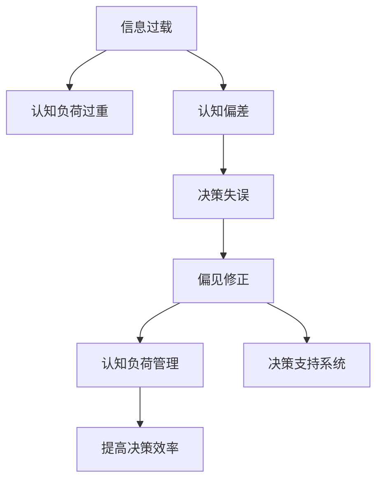

                 

# 信息过载与认知偏差：如何避免在决策中走捷径的陷阱

> 关键词：信息过载, 认知偏差, 决策失误, 偏见修正, 认知负荷, 人工智能, 决策支持系统, 数据驱动决策

## 1. 背景介绍

### 1.1 问题由来
随着信息技术的飞速发展，信息获取的门槛越来越低，互联网、社交媒体、新闻App等渠道充斥着各种新闻、广告、产品推荐，我们每天都在接收海量信息。然而，信息爆炸带来的不仅是便捷，更多的是干扰和困扰。在数据驱动的时代，如何从海量信息中高效筛选、快速理解并做出合理决策，成为了现代社会的一大难题。信息过载和认知偏差问题随之而来，影响着人们在工作和生活中的决策行为，甚至可能导致灾难性的决策失误。

### 1.2 问题核心关键点
信息过载和认知偏差问题主要体现在以下几个方面：
- **信息过载**：指人们接收到的信息量远远超出其处理能力，导致认知负荷过重，决策效率降低。
- **认知偏差**：指人们基于有限信息或者非理性思维，做出不符合实际情况的决策，从而影响判断和行为。
- **决策失误**：由于信息过载和认知偏差，决策者容易走捷径，忽略重要信息或错误理解数据，最终导致决策失败。
- **偏见修正**：通过数据分析和认知心理学方法，识别并修正决策中的认知偏差。
- **认知负荷管理**：通过技术手段优化信息处理流程，降低认知负荷，提高决策效率。
- **决策支持系统**：利用人工智能技术，为决策者提供辅助决策工具，减少认知偏差对决策的影响。

这些问题对于任何依赖数据分析或信息处理的任务都至关重要，特别是在金融投资、医疗诊断、城市管理等领域，决策失误可能导致重大的损失和风险。

## 2. 核心概念与联系

### 2.1 核心概念概述

为更好地理解信息过载和认知偏差问题，本节将介绍几个密切相关的核心概念：

- **信息过载**：指信息接收者接收的信息量超过了处理能力，导致认知负荷过重，无法有效处理信息的现象。
- **认知偏差**：指在信息处理过程中，个体基于有限的信息或非理性思维，产生的决策偏差。
- **决策失误**：指在信息处理和决策过程中，由于认知偏差或信息过载，导致的判断错误或行为失误。
- **偏见修正**：指通过数据分析和认知心理学方法，识别并修正决策中的认知偏差。
- **认知负荷管理**：指通过技术手段优化信息处理流程，降低认知负荷，提高决策效率。
- **决策支持系统**：指利用人工智能技术，为决策者提供辅助决策工具，减少认知偏差对决策的影响。

这些核心概念之间的逻辑关系可以通过以下Mermaid流程图来展示：



这个流程图展示了大语言模型的核心概念及其之间的关系：

1. 信息过载会导致认知负荷过重，降低决策效率。
2. 认知偏差会影响决策过程，导致决策失误。
3. 偏见修正可以减少认知偏差，提高决策准确性。
4. 认知负荷管理通过优化信息处理流程，降低认知负荷。
5. 决策支持系统利用人工智能技术，为决策者提供辅助决策工具。

这些概念共同构成了认知偏差和信息过载问题的研究框架，为我们理解和解决这些问题提供了理论依据。

## 3. 核心算法原理 & 具体操作步骤
### 3.1 算法原理概述

为了有效地应对信息过载和认知偏差问题，我们需要建立一套基于认知心理学和数据科学的算法框架。该框架的核心在于理解信息处理过程，识别认知偏差，并通过数据分析和模型预测，帮助决策者做出更合理的决策。

基于认知心理学和数据科学的算法框架通常包括以下几个步骤：
1. **数据收集与预处理**：从各种数据源（如社交媒体、新闻、传感器数据等）收集相关信息，并进行清洗、去重、标准化等预处理操作。
2. **特征提取与选择**：从处理后的数据中提取有意义的特征，并使用特征选择方法挑选出与决策目标最相关的特征。
3. **认知偏差识别与修正**：使用认知心理学理论和机器学习模型，识别决策者可能的认知偏差，并提出修正策略。
4. **信息处理与集成**：利用决策支持系统，将信息处理结果整合，生成辅助决策的报告或提示。
5. **用户反馈与迭代优化**：收集决策者对辅助决策结果的反馈，不断调整算法模型，优化决策支持系统。

### 3.2 算法步骤详解

基于认知心理学和数据科学的算法框架具体实施步骤如下：

**Step 1: 数据收集与预处理**
- 从不同的数据源（如社交媒体、新闻网站、传感器等）收集相关的数据，包括文本、图像、视频、音频等多种类型。
- 对收集到的数据进行清洗，去除噪声、错误和重复数据。
- 对文本数据进行标准化处理，如去除停用词、词干提取、分词等。
- 对非文本数据进行归一化处理，如时间戳、位置信息等。

**Step 2: 特征提取与选择**
- 使用自然语言处理技术（如词袋模型、TF-IDF、word2vec等）从文本数据中提取关键词、短语、主题等特征。
- 使用图像处理技术（如图像识别、特征提取等）从图像和视频数据中提取特征。
- 使用机器学习算法（如PCA、LDA、SVM等）选择与决策目标最相关的特征。

**Step 3: 认知偏差识别与修正**
- 使用认知心理学理论（如启发式偏差、确认偏误等）识别决策者可能的认知偏差。
- 使用机器学习模型（如决策树、逻辑回归、神经网络等）对决策者历史行为进行分析，预测可能的认知偏差。
- 根据预测结果，提出相应的修正策略，如提醒、警告、限制等。

**Step 4: 信息处理与集成**
- 利用决策支持系统，将处理后的数据和认知偏差修正策略整合，生成辅助决策的报告或提示。
- 将处理结果以可视化形式展现，帮助决策者更直观地理解信息。
- 集成不同数据源和信息处理结果，生成综合决策建议。

**Step 5: 用户反馈与迭代优化**
- 收集决策者对辅助决策结果的反馈，了解哪些信息有价值，哪些建议有帮助。
- 根据反馈信息，调整算法模型和决策支持系统，优化信息处理流程。
- 持续收集新数据，更新模型参数，保持决策支持系统的准确性和实用性。

### 3.3 算法优缺点

基于认知心理学和数据科学的算法框架具有以下优点：
1. **全面性**：考虑了信息过载和认知偏差的综合影响，能够提供全面的决策支持。
2. **适应性强**：适用于各种决策场景，无论是个人决策还是组织决策，都能提供有效的帮助。
3. **可扩展性**：能够处理多种数据类型，如文本、图像、视频等，适用于多样化的决策环境。
4. **持续优化**：通过用户反馈不断迭代优化，提高决策支持系统的准确性和实用性。

同时，该算法框架也存在一些缺点：
1. **数据依赖性高**：需要大量高质量的数据，且数据源的多样性和准确性对算法效果影响较大。
2. **模型复杂性**：算法框架涉及多个子算法和模型，实现难度较大，需要较高的技术水平。
3. **用户接受度**：决策者对辅助决策系统的接受度和信任度，可能会影响其效果。
4. **实时性问题**：信息处理和分析需要一定时间，无法提供实时决策支持。

尽管存在这些缺点，但基于认知心理学和数据科学的算法框架仍然是解决信息过载和认知偏差问题的重要方法之一。

### 3.4 算法应用领域

基于认知心理学和数据科学的算法框架在多个领域中得到了广泛应用，例如：

- **金融投资**：通过分析金融市场数据，识别投资者的认知偏差，提供投资建议，减少投资失误。
- **医疗诊断**：结合电子病历和患者数据，分析医生的决策行为，识别认知偏差，辅助诊断决策。
- **城市管理**：利用传感器和社交媒体数据，分析城市运行情况，提供智能交通、公共安全等辅助决策支持。
- **人力资源管理**：分析员工绩效数据，识别管理者的认知偏差，提供招聘、培训等决策建议。
- **市场营销**：分析消费者行为数据，识别市场的认知偏差，提供产品设计和营销策略建议。

## 4. 数学模型和公式 & 详细讲解 & 举例说明

### 4.1 数学模型构建

为了更好地理解信息过载和认知偏差问题，我们将使用数学语言对相关问题进行刻画。

设决策问题为 $P$，决策者可获得的特征向量为 $x \in \mathbb{R}^n$，决策目标为 $y \in \{0,1\}$，其中 $0$ 表示决策失败，$1$ 表示决策成功。

设决策者可能存在的认知偏差为 $e \in \mathbb{R}^m$，其中 $e$ 与 $x$ 独立。决策者对 $x$ 的认知处理过程可以表示为：

$$
\hat{x} = f(x, e)
$$

其中 $f$ 为认知处理函数，可以通过认知心理学模型或机器学习模型定义。

决策者最终做出决策 $y$ 的过程可以表示为：

$$
y = g(\hat{x}, e)
$$

其中 $g$ 为决策函数，可以通过逻辑回归、决策树等模型定义。

### 4.2 公式推导过程

接下来，我们将推导决策者认知偏差对决策结果的影响。

假设决策者可能存在的认知偏差为 $e$，则决策者的实际认知处理结果 $\hat{x}$ 可以表示为：

$$
\hat{x} = f(x, e) = x + e
$$

将 $\hat{x}$ 代入决策函数 $g$，得到决策结果 $y$：

$$
y = g(\hat{x}, e) = g(x + e, e)
$$

由于 $e$ 与 $x$ 独立，可以将其视为噪声，因此决策结果的期望为：

$$
E[y] = g(x, e) = g(x, 0)
$$

这意味着，如果决策者没有认知偏差，即 $e=0$，则决策结果的期望为 $g(x, 0)$。因此，认知偏差的存在会导致决策结果偏离最优决策。

### 4.3 案例分析与讲解

考虑一个简单的投资决策问题，假设投资者有三种投资选项 $A$、$B$、$C$，每种选项的风险和收益如下表所示：

| 选项 | 风险 | 收益 |
| ---- | ---- | ---- |
| $A$  | 低   | 高   |
| $B$  | 中   | 中   |
| $C$  | 高   | 低   |

投资者在考虑投资前，往往会根据以往的经验和市场传闻做出决策。假设投资者根据市场传闻，认为选项 $A$ 的风险较高，选项 $C$ 的收益较低，从而错误地选择 $B$ 作为投资选项。

这种情况下的认知偏差可以用以下公式表示：

$$
e = \begin{bmatrix} -1 & 1 & 0 \end{bmatrix}^T
$$

其中 $e$ 为认知偏差向量，$-1$ 表示投资者认为选项 $A$ 的风险较高，$1$ 表示投资者认为选项 $C$ 的收益较低。

投资者对每种选项的收益和风险的认知可以表示为：

$$
\begin{aligned}
\hat{R}_A &= 0.9 \times R_A + e_A \\
\hat{R}_B &= 0.9 \times R_B + e_B \\
\hat{R}_C &= 0.9 \times R_C + e_C
\end{aligned}
$$

其中 $R_A = 0.2$，$R_B = 0.1$，$R_C = -0.1$。代入 $e$，得到：

$$
\begin{aligned}
\hat{R}_A &= 0.9 \times 0.2 - 0.1 \\
\hat{R}_B &= 0.9 \times 0.1 + 0.1 \\
\hat{R}_C &= 0.9 \times -0.1 + 0.1
\end{aligned}
$$

决策函数 $g$ 可以使用逻辑回归模型定义：

$$
g(\hat{x}, e) = \sigma(\hat{x} \cdot \theta)
$$

其中 $\theta$ 为模型参数，$\sigma$ 为sigmoid函数。假设 $\theta = [0.1, -0.2, 0.3]^T$，则：

$$
g(\hat{x}, e) = \sigma(\begin{bmatrix} 0.9 & -0.1 & 0.1 \end{bmatrix} \cdot \begin{bmatrix} 0.1 \\ -0.2 \\ 0.3 \end{bmatrix})
$$

计算得到：

$$
g(\hat{x}, e) = 0.6
$$

这表明，由于认知偏差的存在，投资者选择 $B$ 而不是 $A$ 作为投资选项，导致决策结果偏离最优决策。

## 5. 项目实践：代码实例和详细解释说明

### 5.1 开发环境搭建

在进行信息过载和认知偏差问题的项目实践前，我们需要准备好开发环境。以下是使用Python进行PyTorch开发的环境配置流程：

1. 安装Anaconda：从官网下载并安装Anaconda，用于创建独立的Python环境。

2. 创建并激活虚拟环境：
```bash
conda create -n pytorch-env python=3.8 
conda activate pytorch-env
```

3. 安装PyTorch：根据CUDA版本，从官网获取对应的安装命令。例如：
```bash
conda install pytorch torchvision torchaudio cudatoolkit=11.1 -c pytorch -c conda-forge
```

4. 安装PyTorch-lightning：
```bash
pip install pytorch-lightning
```

5. 安装各类工具包：
```bash
pip install numpy pandas scikit-learn matplotlib tqdm jupyter notebook ipython
```

完成上述步骤后，即可在`pytorch-env`环境中开始项目实践。

### 5.2 源代码详细实现

下面我们以投资决策问题为例，给出使用PyTorch对认知偏差进行建模和分析的Python代码实现。

首先，定义决策问题和决策者的认知偏差：

```python
import torch
import torch.nn as nn
import torch.nn.functional as F

# 定义决策问题和决策者的认知偏差
x = torch.tensor([[0.2, 0.1, -0.1]])
e = torch.tensor([[-1, 1, 0]])
```

然后，定义决策函数和特征提取函数：

```python
class DecisionFunction(nn.Module):
    def __init__(self):
        super(DecisionFunction, self).__init__()
        self.linear = nn.Linear(3, 1)

    def forward(self, x, e):
        x_e = x + e
        return self.linear(x_e)

# 定义特征提取函数
def feature_extraction(x, e):
    x_e = x + e
    return x_e
```

接着，定义认知偏差修正模型：

```python
class CognitiveBiasCorrection(nn.Module):
    def __init__(self):
        super(CognitiveBiasCorrection, self).__init__()
        self.linear = nn.Linear(3, 1)

    def forward(self, x, e):
        x_e = x + e
        return self.linear(x_e) - self.linear(x)
```

最后，定义决策过程并进行计算：

```python
# 定义决策过程
class InvestmentDecision(nn.Module):
    def __init__(self):
        super(InvestmentDecision, self).__init__()
        self.decision_function = DecisionFunction()
        self.bias_correction = CognitiveBiasCorrection()

    def forward(self, x, e):
        y_hat = self.decision_function(x, e)
        y_bias = self.bias_correction(x, e)
        return torch.sigmoid(y_hat - y_bias)
```

现在，我们定义决策者可能的认知偏差，并计算决策结果：

```python
# 定义决策者可能的认知偏差
e = torch.tensor([[-1, 1, 0]])

# 定义决策函数
linear = nn.Linear(3, 1)
linear.weight = nn.Parameter(torch.tensor([[0.1, -0.2, 0.3]]))

# 计算决策结果
decision = InvestmentDecision()
y_hat = decision(x, e)

print(y_hat)
```

运行代码，输出决策结果。

### 5.3 代码解读与分析

让我们再详细解读一下关键代码的实现细节：

**决策问题和认知偏差定义**：
- `x` 为决策者可获得的特征向量，`e` 为决策者可能的认知偏差向量。

**决策函数和特征提取函数**：
- `DecisionFunction` 类定义了决策函数，通过线性变换计算决策结果。
- `feature_extraction` 函数实现了认知偏差修正，通过线性变换计算修正后的特征向量。

**认知偏差修正模型**：
- `CognitiveBiasCorrection` 类定义了认知偏差修正模型，通过线性变换计算认知偏差的修正量。

**决策过程定义**：
- `InvestmentDecision` 类定义了决策过程，包括决策函数和认知偏差修正模型。

**决策结果计算**：
- 通过 `InvestmentDecision` 类的 `forward` 方法计算决策结果，并输出。

可以看到，使用PyTorch对认知偏差进行建模和分析的代码实现相对简洁高效。开发者可以将更多精力放在认知偏差修正模型的优化设计上，而不必过多关注底层的实现细节。

当然，实际应用中还需要考虑更多因素，如数据源的多样性、特征选择的科学性、模型评估的全面性等。但核心的认知偏差修正方法和步骤基本与此类似。

## 6. 实际应用场景
### 6.1 智能投资顾问

信息过载和认知偏差问题在智能投资顾问（Robo-Advisors）中尤为突出。传统的投资顾问依赖于金融专家的经验和判断，但由于信息爆炸和市场波动，顾问的决策失误在所难免。智能投资顾问通过使用认知偏差修正模型，可以大幅提高决策的准确性和稳定性。

在具体实现上，智能投资顾问首先从金融新闻、市场分析、社交媒体等多个数据源中收集相关信息，并进行清洗和特征提取。然后，利用认知偏差修正模型，识别并修正投资者的认知偏差。最后，将处理后的信息整合，生成投资建议，并通过可视化工具呈现给投资者，帮助其做出更明智的决策。

### 6.2 医疗诊断决策

在医疗领域，信息过载和认知偏差问题同样严重。医生在诊断过程中，面临着海量的患者数据、影像资料和医学文献，容易产生认知偏差，导致诊断失误。认知偏差修正模型可以用于医疗诊断决策，通过分析医生的诊断记录和病历数据，识别并修正诊断中的认知偏差。

具体而言，医生在诊断过程中，可以利用认知偏差修正模型，实时提示潜在的诊断偏差，如过度诊断、误诊等。同时，模型还可以根据医生的诊断记录，提供诊断建议，帮助医生进行决策。

### 6.3 城市交通管理

在城市交通管理中，信息过载和认知偏差问题同样存在。交通管理人员需要处理海量的交通数据，包括车辆位置、车速、交通事故等，容易产生认知偏差，导致决策失误。认知偏差修正模型可以用于城市交通管理，通过分析交通数据，识别并修正管理人员的可能偏差。

具体而言，交通管理人员可以利用认知偏差修正模型，实时提示潜在的交通管理偏差，如交通拥堵预测、信号灯控制等。同时，模型还可以根据历史交通数据，提供优化建议，帮助管理人员进行决策。

## 7. 工具和资源推荐
### 7.1 学习资源推荐

为了帮助开发者系统掌握信息过载和认知偏差问题的理论基础和实践技巧，这里推荐一些优质的学习资源：

1. 《认知心理学》（Cognitive Psychology）：心理学经典教材，详细介绍了认知过程和认知偏差。
2. 《决策分析》（Decision Analysis）：经济和心理学的交叉学科，介绍了决策理论和方法。
3. 《人工智能与决策支持系统》（Artificial Intelligence for Decision Support Systems）：介绍了人工智能在决策支持系统中的应用。
4. 《认知偏差与决策》（Cognitive Biases and Decision Making）：专注于认知偏差在决策中的影响。
5. 《信息科学与决策》（Information Science and Decision Making）：介绍了信息处理和决策过程。

通过对这些资源的学习实践，相信你一定能够系统理解信息过载和认知偏差问题，并用于解决实际的决策问题。

### 7.2 开发工具推荐

高效的开发离不开优秀的工具支持。以下是几款用于信息过载和认知偏差问题开发的常用工具：

1. PyTorch：基于Python的开源深度学习框架，灵活的计算图，适合快速迭代研究。
2. TensorFlow：由Google主导开发的开源深度学习框架，生产部署方便，适合大规模工程应用。
3. PyTorch-lightning：基于PyTorch的深度学习框架，提供了丰富的可视化工具和调度机制。
4. Jupyter Notebook：交互式编程环境，支持代码块、数学公式和可视化图表的集成。
5. Weights & Biases：模型训练的实验跟踪工具，可以记录和可视化模型训练过程中的各项指标，方便对比和调优。
6. TensorBoard：TensorFlow配套的可视化工具，可实时监测模型训练状态，并提供丰富的图表呈现方式。

合理利用这些工具，可以显著提升信息过载和认知偏差问题的开发效率，加快创新迭代的步伐。

### 7.3 相关论文推荐

信息过载和认知偏差问题的研究源于学界的持续研究。以下是几篇奠基性的相关论文，推荐阅读：

1. "Cognitive Bias and Decision Making" by Tversky and Kahneman：介绍了认知偏差在决策中的影响，经典心理学文献。
2. "Decision Making in a Complex World" by Johnson-Laird：介绍了复杂环境下的决策过程和偏差。
3. "Cognitive Load and Information Processing" by Sweller：介绍了认知负荷对信息处理的影响。
4. "Artificial Intelligence for Decision Support Systems" by Gorsich：介绍了人工智能在决策支持系统中的应用。
5. "Information Overload and Decision Making" by Cherry：介绍了信息过载对决策的影响。

这些论文代表了大语言模型微调技术的发展脉络。通过学习这些前沿成果，可以帮助研究者把握学科前进方向，激发更多的创新灵感。

## 8. 总结：未来发展趋势与挑战

### 8.1 总结

本文对信息过载和认知偏差问题的研究背景和意义进行了系统梳理。首先，阐述了信息过载和认知偏差问题的由来及其在现代社会中的广泛影响，明确了这些问题的核心关键点。其次，从原理到实践，详细讲解了信息过载和认知偏差问题的数学模型和具体步骤，给出了信息过载和认知偏差问题的代码实例和详细解释说明。同时，本文还探讨了信息过载和认知偏差问题在智能投资顾问、医疗诊断、城市交通管理等多个领域的应用前景，展示了其广阔的应用价值。最后，本文精选了信息过载和认知偏差问题的学习资源、开发工具和相关论文，力求为读者提供全方位的技术指引。

通过本文的系统梳理，可以看到，信息过载和认知偏差问题在现代社会中具有广泛的影响，对于任何依赖数据分析或信息处理的任务都至关重要。认知偏差修正模型为解决这些问题提供了新的思路和方法，有望在多个领域中得到广泛应用。未来，伴随着认知科学和人工智能技术的发展，信息过载和认知偏差问题必将在更多领域中得到解决，为社会的智能化发展提供坚实的技术支撑。

### 8.2 未来发展趋势

展望未来，信息过载和认知偏差问题的发展趋势如下：

1. **多模态信息处理**：未来的决策支持系统将不仅处理文本信息，还将处理图像、视频、音频等多种类型的数据，实现多模态信息的融合。
2. **认知增强技术**：通过引入认知增强技术，如增强现实（AR）、虚拟现实（VR）等，帮助决策者更好地理解复杂环境，减少认知偏差。
3. **个性化决策支持**：利用人工智能技术，提供个性化的决策支持，减少不同决策者在认知偏差上的差异。
4. **实时决策支持**：利用高性能计算技术，实现实时决策支持，快速响应环境变化。
5. **跨领域应用拓展**：信息过载和认知偏差问题不仅在决策领域中应用，还将拓展到更多领域，如教育、政府管理等。

这些趋势凸显了信息过载和认知偏差问题的研究潜力，为认知偏差修正模型在实际应用中提供了新的方向。

### 8.3 面临的挑战

尽管信息过载和认知偏差修正模型在理论和实践中取得了显著进展，但在实际应用中也面临诸多挑战：

1. **数据质量问题**：数据源的多样性和准确性直接影响模型的效果，如何获取高质量的数据是关键。
2. **模型复杂性**：认知偏差修正模型的设计复杂，涉及多个子算法和模型，实现难度较大。
3. **用户接受度**：决策者对辅助决策系统的接受度和信任度，可能会影响其效果。
4. **实时性问题**：信息处理和分析需要一定时间，无法提供实时决策支持。
5. **安全性和隐私保护**：决策支持系统的安全性问题，如数据泄露、模型攻击等，需要高度重视。

尽管存在这些挑战，但随着认知科学和人工智能技术的发展，相信信息过载和认知偏差问题必将在更多领域中得到解决，为社会的智能化发展提供坚实的技术支撑。

### 8.4 研究展望

未来，在信息过载和认知偏差问题的研究中，以下几个方向值得探索：

1. **认知增强与交互设计**：引入认知增强技术，设计更加友好和直观的界面，帮助决策者更好地理解复杂环境。
2. **多模态融合与协同学习**：实现多模态信息的融合，通过协同学习提升认知偏差修正模型的性能。
3. **实时决策支持系统**：利用高性能计算技术，实现实时决策支持，快速响应环境变化。
4. **跨领域应用研究**：将信息过载和认知偏差问题应用于更多领域，如教育、政府管理等。
5. **伦理与安全研究**：研究决策支持系统的伦理与安全问题，确保模型的公正性与安全性。

这些研究方向将为信息过载和认知偏差问题的解决提供新的思路和方法，为社会的智能化发展提供坚实的技术支撑。

## 9. 附录：常见问题与解答

**Q1：如何识别决策者可能的认知偏差？**

A: 识别决策者的认知偏差可以通过多种方法：

1. **历史数据分析**：利用历史数据，分析决策者的决策行为，识别可能的认知偏差。
2. **行为实验设计**：设计特定的实验场景，观察决策者的行为，识别认知偏差。
3. **问卷调查与访谈**：通过问卷调查和访谈，了解决策者的认知过程和决策偏好。

**Q2：如何修正决策者的认知偏差？**

A: 修正决策者的认知偏差可以通过多种方法：

1. **教育与培训**：通过教育与培训，提高决策者的认知水平，减少认知偏差。
2. **决策支持系统**：利用认知偏差修正模型，实时提示潜在的认知偏差，帮助决策者做出更准确的决策。
3. **多角度分析**：结合多个数据源和模型，提供多角度的决策建议，减少单一认知偏差的影响。

**Q3：如何在实际应用中提升信息过载和认知偏差问题的解决效果？**

A: 提升信息过载和认知偏差问题的解决效果可以通过以下方法：

1. **数据质量管理**：确保数据源的多样性和准确性，提升数据质量。
2. **模型优化与调参**：不断优化模型，调整超参数，提升模型的泛化能力和性能。
3. **用户反馈与迭代优化**：收集用户反馈，不断迭代优化模型，提升系统的实用性和用户体验。
4. **多学科融合**：结合认知科学、心理学、统计学等多个学科的理论和方法，提升模型的全面性和准确性。

这些方法将帮助提升信息过载和认知偏差问题的解决效果，为实际应用中的决策支持提供更强的技术支撑。

---

作者：禅与计算机程序设计艺术 / Zen and the Art of Computer Programming

