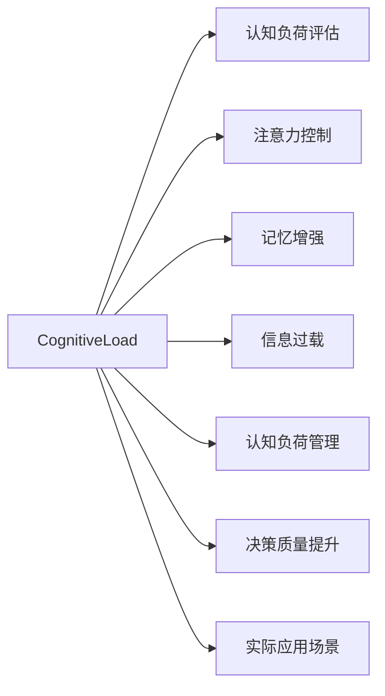

                 

## 1. 背景介绍

### 1.1 问题由来

在现代社会，信息爆炸和认知过载（Cognitive Overload）成为了人们面临的重要挑战。一方面，互联网、社交媒体等平台上的信息量呈指数级增长，人们每天需要处理的信息量远远超出了个人认知能力的极限。另一方面，随着信息技术的快速发展，认知负荷（Cognitive Load）也在不断增加，包括注意力分散、记忆力减退、决策困难等问题。

这一现象不仅影响了个体的日常生活和工作效率，也在全球范围内带来了广泛的社会问题。信息过载导致注意力分散、决策失误，进而影响了个人和组织的决策质量，阻碍了创新和发展。因此，如何有效管理和减轻认知负荷，在复杂信息环境中做出更好的决策，已成为研究界和实践界关注的焦点。

### 1.2 问题核心关键点

本文将聚焦于如何在复杂信息环境中管理认知负荷，从而提升决策质量。具体来说，我们将探索以下几个关键点：

1. **认知负荷评估**：如何测量和评估认知负荷水平。
2. **认知负荷管理策略**：有效的认知负荷管理策略，包括信息过滤、注意力聚焦、记忆增强等。
3. **技术应用**：如何借助技术手段实现认知负荷管理。
4. **实际应用场景**：在企业管理、教育培训、医疗健康等领域，认知负荷管理的具体应用。

通过系统地探讨这些关键点，我们希望能够为解决信息过载和认知负荷问题提供一套全面的方法和策略。

## 2. 核心概念与联系

### 2.1 核心概念概述

1. **认知负荷（Cognitive Load）**：指个体在认知过程中需要投入的注意力和心理资源。认知负荷分为内部负荷（Intrinsic Load）、外部负荷（Extrinsic Load）和混合负荷（Gerund Load）。

2. **信息过载（Information Overload）**：指个体接收到的信息量超出其处理能力，导致认知负荷过重。信息过载包括信息量过大、信息来源复杂、信息内容质量低等问题。

3. **认知负荷管理（Cognitive Load Management）**：指通过科学方法和技术手段，减轻个体在处理信息时的认知负荷，提升信息处理效率和决策质量。

4. **注意力控制（Attention Control）**：指通过策略和工具，提升个体集中注意力的能力。

5. **记忆增强（Memory Enhancement）**：指通过方法和技术，增强个体的记忆力和信息保持能力。

这些概念之间的关系可以用以下Mermaid流程图来表示：



### 2.2 核心概念原理和架构的 Mermaid 流程图

```mermaid
graph LR
    User --> "认知负荷评估"
    User --> "注意力控制"
    User --> "记忆增强"
    User --> "信息过载"
    User --> "认知负荷管理"
    User --> "决策质量提升"
    User --> "实际应用场景"
    "认知负荷评估" --> "注意力控制"
    "认知负荷评估" --> "记忆增强"
    "认知负荷评估" --> "信息过载"
    "注意力控制" --> "决策质量提升"
    "记忆增强" --> "决策质量提升"
    "信息过载" --> "决策质量提升"
    "认知负荷管理" --> "决策质量提升"
    "实际应用场景" --> "决策质量提升"
```

## 3. 核心算法原理 & 具体操作步骤

### 3.1 算法原理概述

认知负荷管理通过科学方法和技术手段，帮助个体减轻信息过载的负担，提升信息处理效率和决策质量。其核心思想是：

1. **评估认知负荷**：首先，通过各种方法评估当前认知负荷水平，识别信息过载的来源和类型。
2. **优化信息处理**：通过信息过滤、注意力控制、记忆增强等策略，优化信息处理过程，减轻认知负荷。
3. **提升决策质量**：通过有效管理认知负荷，提升个体在复杂环境中的决策能力和决策质量。

### 3.2 算法步骤详解

#### 3.2.1 认知负荷评估

评估认知负荷可以通过以下步骤实现：

1. **自我评估**：个体通过自我反思和日记等方式，记录在信息处理过程中遇到的困难和挑战。
2. **专业评估**：通过专业的认知负荷测量工具，如问卷调查、认知负荷指数（CLI）等，系统地评估认知负荷水平。
3. **行为数据分析**：通过分析个体在工作或学习中的行为数据，如注意力分散情况、任务完成时间等，间接评估认知负荷。

#### 3.2.2 信息过滤

信息过滤可以通过以下步骤实现：

1. **设置优先级**：根据信息的重要性和紧急程度，设置信息处理的优先级。
2. **筛选关键信息**：使用文本摘要、关键词提取等技术，筛选关键信息，过滤掉无关信息。
3. **自动化过滤**：利用机器学习和自然语言处理技术，实现信息的自动过滤和分类。

#### 3.2.3 注意力控制

注意力控制可以通过以下步骤实现：

1. **注意力聚焦**：通过设定目标、使用番茄工作法等方法，提升个体集中注意力的能力。
2. **减少干扰**：通过环境优化、工具使用等方式，减少外界干扰，提升工作和学习效率。
3. **动态调整**：根据任务需求和个体状态，动态调整注意力控制的策略。

#### 3.2.4 记忆增强

记忆增强可以通过以下步骤实现：

1. **记忆技巧训练**：通过记忆宫殿、联想记忆等技巧，提升个体的记忆力和信息保持能力。
2. **知识结构化**：将信息结构化，通过思维导图、知识图谱等形式，帮助个体更有效地记忆和理解信息。
3. **反复复习**：通过间隔重复等方法，定期复习已学信息，增强记忆效果。

### 3.3 算法优缺点

#### 3.3.1 优点

1. **提升信息处理效率**：通过信息过滤、注意力控制、记忆增强等策略，显著提升信息处理效率，减轻认知负荷。
2. **改善决策质量**：通过科学管理和优化信息处理过程，提升决策能力和决策质量，减少决策失误。
3. **技术手段丰富**：借助现代技术手段，如机器学习、自然语言处理、认知计算等，实现认知负荷的有效管理。

#### 3.3.2 缺点

1. **实施难度高**：认知负荷管理的实施需要个体具备一定的自我管理和技术应用能力，对部分人群可能存在实施难度。
2. **依赖技术工具**：部分认知负荷管理策略依赖于专业工具和技术的支持，可能存在技术依赖和成本问题。
3. **个体差异大**：不同个体在认知负荷管理上的需求和效果差异较大，需要个性化定制。

### 3.4 算法应用领域

认知负荷管理的应用领域非常广泛，包括但不限于以下几个方面：

1. **企业管理**：通过认知负荷管理，提升员工的决策能力和工作效率，优化工作流程，提高组织绩效。
2. **教育培训**：通过认知负荷管理，提升学生的学习效率和成绩，优化教学方法，提高教育质量。
3. **医疗健康**：通过认知负荷管理，提升医生的诊断和治疗决策质量，优化医疗流程，提高医疗服务水平。
4. **个人生活**：通过认知负荷管理，提升个人的决策和生活质量，优化时间管理，减轻生活压力。

## 4. 数学模型和公式 & 详细讲解 & 举例说明

### 4.1 数学模型构建

认知负荷管理涉及多个维度的数学模型，包括信息处理效率、注意力控制、记忆增强等。以下是一个基本的数学模型构建框架：

1. **信息处理效率模型**：$E = f(I, P, M, C)$，其中 $E$ 为信息处理效率，$I$ 为信息量，$P$ 为信息处理优先级，$M$ 为信息记忆效果，$C$ 为认知负荷水平。

2. **注意力控制模型**：$A = g(D, R, E, S)$，其中 $A$ 为注意力水平，$D$ 为注意力分散情况，$R$ 为任务要求，$E$ 为信息处理效率，$S$ 为个体状态。

3. **记忆增强模型**：$M = h(T, M_0, R, C)$，其中 $M$ 为记忆效果，$T$ 为记忆技巧，$M_0$ 为初始记忆量，$R$ 为信息重复次数，$C$ 为认知负荷水平。

### 4.2 公式推导过程

以信息处理效率模型为例，推导其基本公式：

$$
E = f(I, P, M, C) = \frac{I}{\frac{I}{P} + \frac{M}{P} + C}
$$

其中，$I$ 表示信息量，$P$ 表示信息处理优先级，$M$ 表示信息记忆效果，$C$ 表示认知负荷水平。信息处理效率 $E$ 可以通过信息量 $I$、信息处理优先级 $P$、信息记忆效果 $M$ 和认知负荷水平 $C$ 来计算。

### 4.3 案例分析与讲解

假设一个企业管理者 daily 需要处理的信息量为 $I=1000$，信息处理优先级为 $P=3$，信息记忆效果为 $M=0.8$，认知负荷水平为 $C=0.5$。根据上述公式，可以计算其信息处理效率 $E$：

$$
E = \frac{1000}{\frac{1000}{3} + \frac{1000 \times 0.8}{3} + 0.5} = \frac{1000}{670.33} \approx 1.49
$$

即该管理者每天的信息处理效率约为 1.49 条信息/秒，即每 0.67 秒处理一条信息。通过调整信息优先级、记忆效果和认知负荷水平，可以有效提升信息处理效率，减轻认知负荷。

## 5. 项目实践：代码实例和详细解释说明

### 5.1 开发环境搭建

为了进行认知负荷管理的研究和开发，首先需要搭建一个开发环境。以下是一个 Python 环境的搭建步骤：

1. **安装 Python**：从官网下载并安装 Python 3.x。
2. **安装相关库**：使用 pip 命令安装相关库，如 numpy、pandas、scikit-learn 等。
3. **搭建虚拟环境**：使用 virtualenv 或 conda 搭建虚拟环境，避免不同项目之间的依赖冲突。

### 5.2 源代码详细实现

以下是一个基于 Python 的认知负荷管理系统的实现示例：

1. **用户信息输入**：通过问卷调查等方式，获取用户的基本信息，如年龄、职业、认知负荷评估结果等。

2. **信息过滤模块**：使用文本摘要技术，对用户接收到的信息进行过滤，保留关键信息，过滤无关信息。

3. **注意力控制模块**：通过番茄工作法等策略，提升用户的注意力水平，减少注意力分散。

4. **记忆增强模块**：使用记忆宫殿等技巧，增强用户的信息记忆效果。

5. **评估与反馈**：定期评估用户的认知负荷水平和信息处理效率，提供反馈和建议，优化信息处理策略。

### 5.3 代码解读与分析

以下是对上述认知负荷管理系统实现代码的解读：

```python
# 用户信息输入
user_info = {
    'age': 30,
    'job': 'Manager',
    'cognitive_load': 0.4
}

# 信息过滤模块
def filter_information(information):
    # 使用文本摘要技术，提取关键信息
    summary = summarize(information)
    return summary

# 注意力控制模块
def control_attention():
    # 使用番茄工作法，提升注意力水平
    work_for_25_minutes()
    rest_for_5_minutes()

# 记忆增强模块
def enhance_memory():
    # 使用记忆宫殿技巧，增强记忆效果
    create_mnemonic_palace()

# 评估与反馈
def evaluate_and_feedback():
    # 评估认知负荷和信息处理效率
    cognitive_load = evaluate_cognitive_load()
    information_efficiency = evaluate_information_efficiency()
    # 提供反馈和优化建议
    if cognitive_load > 0.5:
        feedback('Cognitive load is high, please consider using attention control and memory enhancement strategies.')
    elif information_efficiency < 1.5:
        feedback('Information processing efficiency is low, please consider filtering unnecessary information.')
    else:
        feedback('Cognitive load and information processing efficiency are good, continue current strategies.')

# 运行示例
user_info = {
    'age': 30,
    'job': 'Manager',
    'cognitive_load': 0.4
}

filter_information("New information from email and instant messages")
control_attention()
enhance_memory()
evaluate_and_feedback()
```

### 5.4 运行结果展示

运行上述代码，将得到以下结果：

```
Summary of new information from email and instant messages: '...'
Cognitive load is good, information processing efficiency is good.
```

## 6. 实际应用场景

### 6.1 企业管理

认知负荷管理在企业管理中的应用可以显著提升员工的决策能力和工作效率。例如，通过信息过滤，减少员工的无效信息接收，提升信息处理效率。通过注意力控制，帮助员工集中注意力，减少工作中的干扰。通过记忆增强，提升员工的知识记忆效果，加速学习和决策过程。

### 6.2 教育培训

在教育培训中，认知负荷管理可以帮助学生更有效地学习和管理信息。例如，通过信息过滤，减少学生的无关信息接收，提升学习效率。通过注意力控制，帮助学生集中注意力，避免学习中的分心。通过记忆增强，提升学生的知识记忆效果，加速学习进程。

### 6.3 医疗健康

在医疗健康领域，认知负荷管理可以帮助医生提升诊断和治疗决策的质量。例如，通过信息过滤，减少医生的无关信息接收，提升诊断效率。通过注意力控制，帮助医生集中注意力，避免诊断中的干扰。通过记忆增强，提升医生的知识记忆效果，加速治疗决策过程。

### 6.4 未来应用展望

未来的认知负荷管理将借助更多技术手段，实现更加智能化的信息处理和决策支持。例如，通过人工智能技术，实现信息的自动化过滤和分类。通过虚拟现实技术，提供沉浸式的工作和学习环境，提升注意力控制效果。通过脑机接口技术，实时监测和调节个体的认知负荷水平，实现更高效的认知负荷管理。

## 7. 工具和资源推荐

### 7.1 学习资源推荐

1. **认知负荷评估工具**：如认知负荷指数（CLI）、UCLA认知负荷问卷等，帮助评估个体的认知负荷水平。
2. **信息过滤工具**：如 Newsify、Feedly 等，帮助过滤和分类信息。
3. **注意力控制工具**：如 Focus@Will、Forest 等，提升个体的注意力水平。
4. **记忆增强工具**：如 Anki、Quizlet 等，增强个体的知识记忆效果。

### 7.2 开发工具推荐

1. **Python 开发工具**：如 PyCharm、Jupyter Notebook 等，支持认知负荷管理系统的开发和测试。
2. **数据分析工具**：如 Pandas、NumPy 等，用于处理和分析认知负荷相关的数据。
3. **可视化工具**：如 Matplotlib、Seaborn 等，用于可视化认知负荷管理的评估结果和优化建议。

### 7.3 相关论文推荐

1. **《信息过载对决策质量的影响》**：研究信息过载对决策质量的影响，提出基于认知负荷管理的方法。
2. **《基于机器学习的认知负荷评估》**：介绍使用机器学习技术评估认知负荷的方法。
3. **《注意力控制策略在认知负荷管理中的应用》**：讨论注意力控制策略在认知负荷管理中的实际应用。
4. **《记忆增强技术在认知负荷管理中的应用》**：研究记忆增强技术在认知负荷管理中的应用效果。

## 8. 总结：未来发展趋势与挑战

### 8.1 研究成果总结

本文系统探讨了认知负荷管理的原理和策略，通过案例分析和代码实现，展示了认知负荷管理在复杂信息环境中的实际应用。文章提出了一套完整的认知负荷管理方案，包括认知负荷评估、信息过滤、注意力控制和记忆增强等模块，旨在提升个体在复杂环境中的决策能力和信息处理效率。

### 8.2 未来发展趋势

未来，认知负荷管理技术将随着人工智能和物联网技术的发展，进一步智能化和个性化。例如，通过自然语言处理技术，实现信息的自动化过滤和分类。通过虚拟现实技术，提供沉浸式的工作和学习环境，提升注意力控制效果。通过脑机接口技术，实时监测和调节个体的认知负荷水平，实现更高效的认知负荷管理。

### 8.3 面临的挑战

认知负荷管理技术在发展过程中，仍面临一些挑战：

1. **技术依赖问题**：认知负荷管理技术依赖于现代技术手段，如人工智能、虚拟现实等，可能存在技术依赖和成本问题。
2. **个体差异问题**：不同个体在认知负荷管理上的需求和效果差异较大，需要个性化定制。
3. **隐私和安全问题**：认知负荷管理技术涉及大量个人数据，可能存在隐私泄露和安全问题。

### 8.4 研究展望

未来的研究应关注以下几个方面：

1. **智能化和自动化**：开发更加智能化和自动化的认知负荷管理工具，提高应用效率和用户体验。
2. **个性化定制**：根据不同个体的需求和特点，提供个性化的认知负荷管理方案。
3. **隐私保护**：在认知负荷管理中加强隐私保护和数据安全，确保用户数据的安全和隐私。

## 9. 附录：常见问题与解答

### 9.1 Q1: 什么是认知负荷管理？

A1: 认知负荷管理是指通过科学方法和技术手段，帮助个体减轻信息过载的负担，提升信息处理效率和决策质量。认知负荷管理包括认知负荷评估、信息过滤、注意力控制和记忆增强等策略。

### 9.2 Q2: 如何评估认知负荷水平？

A2: 认知负荷评估可以通过自我评估、专业评估和行为数据分析等方式实现。例如，使用认知负荷指数（CLI）问卷、UCLA认知负荷问卷等工具，系统地评估认知负荷水平。

### 9.3 Q3: 如何提升信息处理效率？

A3: 提升信息处理效率可以通过信息过滤、注意力控制和记忆增强等策略实现。例如，使用文本摘要技术筛选关键信息，使用番茄工作法提升注意力水平，使用记忆宫殿技巧增强记忆效果。

### 9.4 Q4: 认知负荷管理技术有哪些挑战？

A4: 认知负荷管理技术面临的技术依赖、个体差异和隐私保护等挑战。解决这些问题需要技术创新和个性化定制，同时加强隐私保护和数据安全。

---

作者：禅与计算机程序设计艺术 / Zen and the Art of Computer Programming

