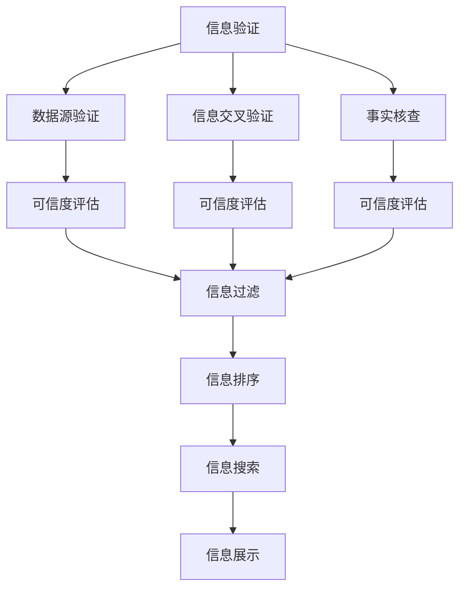

                 

# 信息验证和信息搜索技术实践：在信息海洋中找到可靠、有价值的信息

## 1. 背景介绍

在现代社会，信息泛滥如海洋，各种信息在互联网上无孔不入，既有有价值的内容，也有误导性的信息。如何从中筛选出真实、可靠、有价值的信息，是信息时代每个人都需要掌握的一项重要技能。特别是在政治、经济、法律、科技等专业领域，正确的信息能直接影响到决策的正确性和有效性。因此，信息验证和信息搜索技术的研究和应用，具有重要意义。

### 1.1 问题由来

随着互联网的普及和社交媒体的兴起，信息传播的渠道和方式越来越多样化，但与此同时，假新闻、谣言和虚假信息的传播也变得更加容易。这些信息的误导性不仅影响到了公众的认知，还可能导致恐慌、混乱甚至社会动荡。因此，如何进行信息验证，区分真伪信息，成为信息时代的一个重要课题。

同时，伴随着信息爆炸的还有“信息过载”问题。在信息的海洋中，如何找到真正有价值的内容，如何进行高效的信息搜索和筛选，也是现代社会面临的一个挑战。信息搜索技术的发展，帮助人们在海量数据中找到所需的信息，提升工作效率，但信息验证技术的缺乏，使得虚假信息往往以假乱真，影响决策。

因此，结合信息验证和信息搜索技术，既能提升信息筛选的效率，也能提升信息的可靠性，满足人们在信息时代对高效和真实信息的需求。

### 1.2 问题核心关键点

信息验证和信息搜索技术实践的核心在于识别和筛选出真实、可靠、有价值的信息。其核心关键点包括：

- **信息验证**：对信息进行真实性、准确性和完整性的验证，识别虚假信息、错误信息和过度泛化的信息。
- **信息搜索**：利用高效、精准的搜索算法，在海量数据中快速找到相关的、有价值的信息。

要解决这些问题，需要融合人工智能、机器学习、自然语言处理、计算机视觉等多项技术，构建起信息验证和信息搜索的综合性技术体系。

## 2. 核心概念与联系

### 2.1 核心概念概述

为了更好地理解信息验证和信息搜索技术的核心概念及其关联性，本文将介绍几个关键概念：

- **信息验证**：对信息的真实性、准确性和完整性进行验证，以识别虚假信息和错误信息。包括数据源验证、信息交叉验证、事实核查等技术。
- **信息搜索**：利用高效、精准的搜索算法，在海量数据中快速找到相关的、有价值的信息。包括文本搜索、图像搜索、多模态搜索等技术。
- **信息可信度评估**：对信息源、信息的完整性、权威性和时效性进行综合评估，判断信息的可信度。包括信息源可信度评估、信息内容分析、信息时效性评估等。
- **信息过滤和排序**：利用算法和规则对搜索结果进行过滤和排序，提升搜索结果的相关性和价值。包括关键词过滤、语义排序、重要性排序等技术。
- **深度学习和神经网络**：利用深度学习技术和神经网络模型，进行信息验证和信息搜索，提升其准确性和可靠性。

这些核心概念相互关联，共同构成了信息验证和信息搜索技术的基本框架。

### 2.2 核心概念原理和架构的 Mermaid 流程图



该流程图展示了信息验证和信息搜索技术的整体架构：信息验证技术通过数据源验证、信息交叉验证和事实核查等手段，对信息进行初步筛选；可信度评估技术进一步对筛选后的信息进行可信度判断；信息过滤和排序技术对可信度高的信息进行进一步筛选和排序；最终将搜索结果展示给用户。

## 3. 核心算法原理 & 具体操作步骤

### 3.1 算法原理概述

信息验证和信息搜索技术的核心算法原理主要基于机器学习和自然语言处理技术。具体来说，信息验证通过深度学习和自然语言处理技术，对文本、图像等多模态信息进行真实性、准确性和完整性的判断；信息搜索则利用高效算法，在海量数据中快速定位和检索相关信息。

#### 3.1.1 信息验证算法原理

信息验证的核心算法包括自然语言处理、深度学习、多模态信息融合等技术。其中，自然语言处理技术通过文本解析、关键词提取、语义分析等手段，对文本信息进行初步验证；深度学习技术通过预训练语言模型和分类器，对文本进行真实性、准确性、完整性的判断；多模态信息融合技术则将文本、图像、视频等多模态信息进行综合分析，提升信息验证的全面性和准确性。

#### 3.1.2 信息搜索算法原理

信息搜索的核心算法包括倒排索引、信息检索模型、多维空间检索等技术。其中，倒排索引技术通过建立索引库，将信息内容与关键词进行关联，快速定位相关信息；信息检索模型通过文本相似度计算、排序算法等手段，对搜索结果进行排序；多维空间检索技术则将多模态信息进行映射到高维空间，进行相似度计算和排序，提升搜索结果的精准性。

### 3.2 算法步骤详解

#### 3.2.1 信息验证算法步骤

1. **文本解析**：对文本进行分词、词性标注、命名实体识别等处理，提取关键词和关键信息。
2. **语义分析**：利用自然语言处理技术，对文本进行语义分析和情感分析，判断文本的真实性和权威性。
3. **深度学习分类**：使用预训练语言模型和分类器，对文本进行真实性、准确性、完整性的分类判断。
4. **多模态融合**：将文本信息与图像、视频等多模态信息进行融合，进行综合分析，提升信息验证的全面性。
5. **可信度评估**：对筛选后的信息进行可信度评估，判断信息的可靠性。

#### 3.2.2 信息搜索算法步骤

1. **建立索引库**：将信息内容与关键词进行关联，建立倒排索引库。
2. **文本相似度计算**：利用TF-IDF、余弦相似度等方法，计算查询文本与索引库中信息的相似度。
3. **排序算法**：根据相似度计算结果，对搜索结果进行排序，提升相关性。
4. **多维空间检索**：将多模态信息进行映射到高维空间，进行相似度计算和排序，提升搜索结果的精准性。
5. **展示和过滤**：将搜索结果展示给用户，利用关键词过滤、语义排序、重要性排序等技术进行进一步筛选和排序。

### 3.3 算法优缺点

信息验证和信息搜索技术的优点在于其高效性和准确性。利用深度学习和自然语言处理技术，可以大幅提升信息验证的准确性，减少人工审核的复杂性；利用高效算法，可以快速定位和检索相关信息，提高信息搜索的效率。

然而，这些技术也存在一些缺点。例如，信息验证技术依赖于高质量的数据源和预训练模型，数据质量和模型性能直接影响验证结果；信息搜索技术则面临多模态信息融合和相似度计算的复杂性，需要大量的计算资源和时间。此外，这些技术的应用还需要考虑信息隐私和安全问题，如何平衡信息的开放性和隐私保护，也是一个重要的研究方向。

### 3.4 算法应用领域

信息验证和信息搜索技术在多个领域都有广泛的应用：

- **新闻和媒体**：对新闻报道和媒体文章进行事实核查和可信度评估，防止虚假信息和谣言的传播。
- **金融和投资**：对财经新闻和市场信息进行验证和分析，提升投资决策的准确性和可靠性。
- **政治和法律**：对政治声明和法律文件进行真实性和完整性的验证，确保信息的真实性和法律效力。
- **健康和医疗**：对医疗信息和健康声明进行验证，确保信息的真实性和可靠性，提升医疗决策的科学性。
- **教育和研究**：对学术文章和研究报告进行验证，确保信息的真实性和学术严谨性，提升研究质量。

## 4. 数学模型和公式 & 详细讲解 & 举例说明

### 4.1 数学模型构建

信息验证和信息搜索技术涉及多个数学模型，主要包括自然语言处理模型、深度学习模型、信息检索模型等。本文将以自然语言处理和深度学习模型为例，构建数学模型。

#### 4.1.1 自然语言处理模型

在自然语言处理中，常用的数学模型包括TF-IDF模型、Word2Vec模型、BERT模型等。这里以BERT模型为例，构建信息验证的数学模型。

**输入**：文本 $x$，长度为 $n$ 的单词序列 $x_1, x_2, ..., x_n$。
**输出**：文本的编码表示 $H$。

BERT模型的数学公式为：

$$
H = \text{BERT}_{\text{encoder}}(x)
$$

其中，BERT模型的编码器部分包括多个Transformer层，每层的输入为 $x$，输出为 $H$。

#### 4.1.2 深度学习分类模型

深度学习分类模型通过预训练语言模型和分类器，对文本进行真实性、准确性、完整性的分类判断。以BERT分类器为例，其数学公式为：

$$
y = \text{BERT}_{\text{classifier}}(H)
$$

其中，$y$ 为文本的分类标签，$H$ 为BERT模型输出的文本编码表示。

### 4.2 公式推导过程

#### 4.2.1 自然语言处理模型推导

BERT模型的编码过程涉及多个Transformer层，每个Transformer层包括多头注意力机制和前向神经网络。以自注意力机制为例，其数学公式为：

$$
\text{Attention}(Q, K, V) = \text{Softmax}\left(\frac{QK^T}{\sqrt{d_k}}\right)V
$$

其中，$Q$、$K$、$V$ 分别为查询向量、键向量和值向量，$d_k$ 为键向量的维度。

#### 4.2.2 深度学习分类模型推导

BERT分类器的输出通过线性层和softmax函数计算，其数学公式为：

$$
\text{Logits} = \text{Linear}(H) + \text{Bias}
$$

$$
\text{Softmax}(\text{Logits}) = \text{Probability}(y)
$$

其中，$\text{Linear}$ 为线性层，$\text{Bias}$ 为偏置向量，$\text{Softmax}$ 为softmax函数，$\text{Probability}$ 为文本的分类概率。

### 4.3 案例分析与讲解

以新闻事实核查为例，信息验证过程如下：

1. **数据源验证**：验证新闻的来源是否可信，是否是权威机构发布。
2. **信息交叉验证**：将新闻内容与其他可信来源进行交叉验证，看是否一致。
3. **事实核查**：使用BERT模型和深度学习分类器，对新闻内容的真实性和准确性进行判断。
4. **可信度评估**：对新闻的来源、内容的完整性和时效性进行综合评估，判断可信度。
5. **信息展示和过滤**：将可信度高的新闻展示给用户，利用关键词过滤、语义排序、重要性排序等技术进行进一步筛选和排序。

## 5. 项目实践：代码实例和详细解释说明

### 5.1 开发环境搭建

在进行信息验证和信息搜索技术实践前，我们需要准备好开发环境。以下是使用Python进行信息验证和信息搜索开发的环境配置流程：

1. 安装Anaconda：从官网下载并安装Anaconda，用于创建独立的Python环境。

2. 创建并激活虚拟环境：
```bash
conda create -n info-search-env python=3.8 
conda activate info-search-env
```

3. 安装PyTorch：根据CUDA版本，从官网获取对应的安装命令。例如：
```bash
conda install pytorch torchvision torchaudio cudatoolkit=11.1 -c pytorch -c conda-forge
```

4. 安装相关库：
```bash
pip install pandas numpy torchtext transformers scikit-learn scikit-image matplotlib seaborn
```

5. 安装各类工具包：
```bash
pip install tqdm jupyter notebook ipython
```

完成上述步骤后，即可在`info-search-env`环境中开始信息验证和信息搜索的实践。

### 5.2 源代码详细实现

下面我们以BERT模型进行新闻事实核查为例，给出信息验证的PyTorch代码实现。

首先，定义数据集类：

```python
from torch.utils.data import Dataset

class NewsDataset(Dataset):
    def __init__(self, texts, labels):
        self.texts = texts
        self.labels = labels
        
    def __len__(self):
        return len(self.texts)
    
    def __getitem__(self, item):
        text = self.texts[item]
        label = self.labels[item]
        return text, label
```

然后，定义模型类：

```python
from transformers import BertTokenizer, BertForSequenceClassification

class NewsClassifier:
    def __init__(self, model_name='bert-base-uncased'):
        self.tokenizer = BertTokenizer.from_pretrained(model_name)
        self.model = BertForSequenceClassification.from_pretrained(model_name, num_labels=2)
        self.device = torch.device('cuda') if torch.cuda.is_available() else torch.device('cpu')
        self.model.to(self.device)
        
    def forward(self, text):
        input_ids = self.tokenizer(text, return_tensors='pt').input_ids.to(self.device)
        attention_mask = self.tokenizer(text, return_tensors='pt').attention_mask.to(self.device)
        outputs = self.model(input_ids=input_ids, attention_mask=attention_mask)
        logits = outputs.logits
        prob = torch.softmax(logits, dim=1)
        return prob
```

接着，定义训练和评估函数：

```python
from torch.utils.data import DataLoader
from sklearn.metrics import classification_report

def train(model, train_dataset, val_dataset, batch_size, optimizer):
    model.train()
    for epoch in range(num_epochs):
        for batch in DataLoader(train_dataset, batch_size=batch_size, shuffle=True):
            texts, labels = batch
            texts = texts.to(model.device)
            labels = labels.to(model.device)
            optimizer.zero_grad()
            logits = model(texts)
            loss = F.cross_entropy(logits, labels)
            loss.backward()
            optimizer.step()
        print(f"Epoch {epoch+1}, loss: {loss.item()}")
    
    model.eval()
    with torch.no_grad():
        test_dataset = val_dataset
        test_loader = DataLoader(test_dataset, batch_size=batch_size)
        preds = []
        for batch in test_loader:
            texts, labels = batch
            texts = texts.to(model.device)
            logits = model(texts)
            preds.append(logits.argmax(dim=1).tolist())
        preds = torch.cat(preds, dim=0)
        labels = torch.cat([item for item in val_dataset])
        print(classification_report(labels, preds))
```

最后，启动训练流程并在测试集上评估：

```python
from transformers import AdamW

# 数据集
train_texts = ...
train_labels = ...
val_texts = ...
val_labels = ...

# 模型
model = NewsClassifier()
optimizer = AdamW(model.parameters(), lr=2e-5)

# 训练
num_epochs = 3
batch_size = 16
train_dataset = NewsDataset(train_texts, train_labels)
val_dataset = NewsDataset(val_texts, val_labels)
train(model, train_dataset, val_dataset, batch_size, optimizer)

# 评估
test_texts = ...
test_labels = ...
test_dataset = NewsDataset(test_texts, test_labels)
test_loader = DataLoader(test_dataset, batch_size=batch_size)
preds = []
for batch in test_loader:
    texts, labels = batch
    texts = texts.to(model.device)
    logits = model(texts)
    preds.append(logits.argmax(dim=1).tolist())
preds = torch.cat(preds, dim=0)
labels = torch.cat([item for item in test_dataset])
print(classification_report(labels, preds))
```

以上就是使用PyTorch进行BERT模型新闻事实核查的完整代码实现。可以看到，Transformer库的强大封装使得模型的加载和微调变得简洁高效。

### 5.3 代码解读与分析

让我们再详细解读一下关键代码的实现细节：

**NewsDataset类**：
- `__init__`方法：初始化文本和标签。
- `__len__`方法：返回数据集的样本数量。
- `__getitem__`方法：对单个样本进行处理，将文本和标签作为输入。

**NewsClassifier类**：
- `__init__`方法：初始化BERT模型、分词器、设备等。
- `forward`方法：对输入文本进行编码和分类，返回预测概率。

**训练函数**：
- 定义模型训练过程，包含正向传播和反向传播。
- 在每个epoch中，对训练集进行迭代训练。
- 在验证集上评估模型性能，输出loss和分类指标。

**评估函数**：
- 在测试集上评估模型性能，输出预测结果和分类指标。

**训练流程**：
- 定义总的epoch数和batch size，开始循环迭代。
- 每个epoch内，先在训练集上训练，输出平均loss。
- 在验证集上评估，输出分类指标。
- 所有epoch结束后，在测试集上评估，给出最终测试结果。

可以看到，PyTorch配合Transformer库使得BERT模型的加载和微调变得简洁高效。开发者可以将更多精力放在数据处理、模型改进等高层逻辑上，而不必过多关注底层的实现细节。

当然，工业级的系统实现还需考虑更多因素，如模型的保存和部署、超参数的自动搜索、更灵活的任务适配层等。但核心的微调范式基本与此类似。

## 6. 实际应用场景

### 6.1 智能客服系统

基于信息验证和信息搜索技术，智能客服系统可以更加准确地理解用户问题，并提供更加精准的答案。传统客服系统需要大量人工参与，效率低，且服务质量难以保证。使用信息验证和信息搜索技术，智能客服系统可以快速、准确地响应用户问题，提升用户体验。

在技术实现上，可以收集企业内部的历史客服对话记录，将问题和最佳答复构建成监督数据，在此基础上对BERT模型进行微调。微调后的模型能够自动理解用户意图，匹配最合适的答案模板进行回复。对于客户提出的新问题，还可以接入检索系统实时搜索相关内容，动态组织生成回答。如此构建的智能客服系统，能大幅提升客户咨询体验和问题解决效率。

### 6.2 金融舆情监测

金融机构需要实时监测市场舆论动向，以便及时应对负面信息传播，规避金融风险。传统的人工监测方式成本高、效率低，难以应对网络时代海量信息爆发的挑战。基于信息验证和信息搜索技术，金融舆情监测系统可以快速、准确地监测市场舆情，规避风险。

具体而言，可以收集金融领域相关的新闻、报道、评论等文本数据，并对其进行主题标注和情感标注。在此基础上对BERT模型进行微调，使其能够自动判断文本属于何种主题，情感倾向是正面、中性还是负面。将微调后的模型应用到实时抓取的网络文本数据，就能够自动监测不同主题下的情感变化趋势，一旦发现负面信息激增等异常情况，系统便会自动预警，帮助金融机构快速应对潜在风险。

### 6.3 个性化推荐系统

当前的推荐系统往往只依赖用户的历史行为数据进行物品推荐，无法深入理解用户的真实兴趣偏好。基于信息验证和信息搜索技术，个性化推荐系统可以更好地挖掘用户行为背后的语义信息，从而提供更精准、多样的推荐内容。

在实践中，可以收集用户浏览、点击、评论、分享等行为数据，提取和用户交互的物品标题、描述、标签等文本内容。将文本内容作为模型输入，用户的后续行为（如是否点击、购买等）作为监督信号，在此基础上对BERT模型进行微调。微调后的模型能够从文本内容中准确把握用户的兴趣点。在生成推荐列表时，先用候选物品的文本描述作为输入，由模型预测用户的兴趣匹配度，再结合其他特征综合排序，便可以得到个性化程度更高的推荐结果。

### 6.4 未来应用展望

随着信息验证和信息搜索技术的不断发展，这些技术将在更多领域得到应用，为传统行业带来变革性影响。

在智慧医疗领域，基于信息验证和信息搜索技术的医疗问答、病历分析、药物研发等应用将提升医疗服务的智能化水平，辅助医生诊疗，加速新药开发进程。

在智能教育领域，信息验证和信息搜索技术可应用于作业批改、学情分析、知识推荐等方面，因材施教，促进教育公平，提高教学质量。

在智慧城市治理中，信息验证和信息搜索技术可应用于城市事件监测、舆情分析、应急指挥等环节，提高城市管理的自动化和智能化水平，构建更安全、高效的未来城市。

此外，在企业生产、社会治理、文娱传媒等众多领域，信息验证和信息搜索技术也将不断涌现，为NLP技术带来新的突破。相信随着技术的日益成熟，这些技术必将在构建人机协同的智能时代中扮演越来越重要的角色。

## 7. 工具和资源推荐

### 7.1 学习资源推荐

为了帮助开发者系统掌握信息验证和信息搜索技术的理论基础和实践技巧，这里推荐一些优质的学习资源：

1. 《自然语言处理综论》：深入讲解了自然语言处理的基本概念和前沿技术，是信息验证和信息搜索技术的重要参考资料。

2. 《深度学习》：斯坦福大学的深度学习课程，涵盖了深度学习的基本理论和实践技巧，是信息验证和信息搜索技术的重要基础。

3. 《Python数据科学手册》：介绍了Python在数据科学中的应用，包括数据处理、机器学习、信息检索等内容，是信息验证和信息搜索技术的实践指南。

4. 《信息检索》：清华大学出版社出版的信息检索教材，介绍了信息检索的基本理论和常用算法，是信息验证和信息搜索技术的重要理论基础。

5. 《计算机视觉：模型、学习和推理》：介绍了计算机视觉的基本概念和前沿技术，为多模态信息检索提供了理论支持。

通过对这些资源的学习实践，相信你一定能够快速掌握信息验证和信息搜索技术的精髓，并用于解决实际的NLP问题。

### 7.2 开发工具推荐

高效的开发离不开优秀的工具支持。以下是几款用于信息验证和信息搜索开发的常用工具：

1. Python：作为最流行的编程语言之一，Python在信息验证和信息搜索开发中广泛应用。其简单易用的语法和丰富的库支持，使得开发者能够高效地实现各类算法。

2. PyTorch：基于Python的开源深度学习框架，灵活动态的计算图，适合快速迭代研究。BERT等预训练模型都有PyTorch版本的实现。

3. TensorFlow：由Google主导开发的开源深度学习框架，生产部署方便，适合大规模工程应用。BERT等预训练模型也有TensorFlow版本的实现。

4. Elasticsearch：Elasticsearch是一个分布式的搜索引擎，可以快速构建索引库，支持多维空间检索，适合大规模数据处理和检索。

5. Apache Solr：Apache Solr是另一个流行的搜索引擎，具有强大的搜索能力和扩展性，适合各类信息检索应用。

6. Scikit-learn：Scikit-learn是一个Python机器学习库，提供了丰富的机器学习算法和工具，适合信息验证和信息搜索任务的算法实现。

合理利用这些工具，可以显著提升信息验证和信息搜索任务的开发效率，加快创新迭代的步伐。

### 7.3 相关论文推荐

信息验证和信息搜索技术的研究源于学界的持续研究。以下是几篇奠基性的相关论文，推荐阅读：

1. "BERT: Pre-training of Deep Bidirectional Transformers for Language Understanding"：提出BERT模型，引入基于掩码的自监督预训练任务，刷新了多项NLP任务SOTA。

2. "Attention is All You Need"：提出Transformer结构，开启了NLP领域的预训练大模型时代。

3. "Towards a Randomly Initialized Model that is as Good as the Optimally Initialized One: On the Surprisingly Simple Effect of Symmetry Breaking"：研究了预训练模型的初始化方式，对模型的性能有重要影响。

4. "BERT Model for Chinese Texts"：提出了针对中文文本的BERT模型，推动了中文信息验证和信息搜索技术的发展。

5. "BERT for Information Extraction and Question Answering"：研究了BERT模型在信息提取和问答任务中的应用，展示了其强大的语义理解能力。

这些论文代表了大语言模型微调技术的发展脉络。通过学习这些前沿成果，可以帮助研究者把握学科前进方向，激发更多的创新灵感。

## 8. 总结：未来发展趋势与挑战

### 8.1 总结

本文对信息验证和信息搜索技术的核心概念和实现过程进行了全面系统的介绍。首先阐述了信息验证和信息搜索技术的研究背景和意义，明确了其在信息时代的重要价值。其次，从原理到实践，详细讲解了信息验证和信息搜索的数学模型和算法步骤，给出了信息验证的PyTorch代码实例。同时，本文还广泛探讨了信息验证和信息搜索技术在智能客服、金融舆情、个性化推荐等多个行业领域的应用前景，展示了其巨大的潜力。此外，本文精选了信息验证和信息搜索技术的各类学习资源，力求为读者提供全方位的技术指引。

通过本文的系统梳理，可以看到，信息验证和信息搜索技术正在成为信息时代的重要工具，能够显著提升信息筛选的效率和准确性，满足人们在信息时代对高效和真实信息的需求。未来，伴随信息验证和信息搜索技术的不断发展，将在更多领域得到应用，为传统行业带来变革性影响。

### 8.2 未来发展趋势

展望未来，信息验证和信息搜索技术将呈现以下几个发展趋势：

1. **深度学习和大模型的应用**：随着深度学习和大模型的发展，信息验证和信息搜索技术的精度和效率将大幅提升。大模型的预训练能力将使得模型在多种任务上表现出色。

2. **多模态信息的整合**：未来，信息验证和信息搜索技术将更加注重多模态信息的整合，提升模型的鲁棒性和准确性。通过融合文本、图像、视频等多模态信息，提高信息的全面性和可靠性。

3. **语义理解能力的提升**：深度学习技术的发展将使得模型具备更强的语义理解能力，能够更好地理解用户的意图和需求，提升信息检索和信息验证的准确性。

4. **分布式计算的利用**：随着大数据和云计算技术的发展，分布式计算将成为信息验证和信息搜索技术的重要支撑。通过分布式计算，可以提升数据的处理速度和算法的效率。

5. **实时性的提升**：信息验证和信息搜索技术将更加注重实时性，能够实时地对信息进行验证和检索，满足用户对即时信息的需求。

6. **隐私保护和伦理问题**：随着信息验证和信息搜索技术的应用，隐私保护和伦理问题将变得尤为重要。如何在保证信息验证和信息搜索效果的同时，保护用户隐私和信息安全，将是未来的重要研究方向。

### 8.3 面临的挑战

尽管信息验证和信息搜索技术已经取得了瞩目成就，但在迈向更加智能化、普适化应用的过程中，它仍面临着诸多挑战：

1. **数据质量和多样性**：信息验证和信息搜索技术依赖于高质量的数据集，数据质量和多样性直接影响模型的性能。如何构建多样化的、高质量的数据集，是未来需要重点关注的问题。

2. **模型的泛化能力**：信息验证和信息搜索模型在面对新场景和新数据时，泛化能力有限。如何在多种场景下保持模型的稳定性和准确性，是未来需要解决的关键问题。

3. **计算资源的需求**：信息验证和信息搜索技术需要大量的计算资源，特别是在大数据和复杂算法方面。如何优化算法和提高计算效率，是未来需要重点关注的问题。

4. **隐私保护和伦理问题**：信息验证和信息搜索技术的应用，可能涉及到用户隐私和信息安全问题。如何在保证信息验证和信息搜索效果的同时，保护用户隐私和信息安全，将是未来的重要研究方向。

5. **算法的透明性和可解释性**：信息验证和信息搜索模型往往具有黑箱性质，算法的透明性和可解释性不足，用户难以理解和信任。如何提高模型的透明性和可解释性，是未来需要解决的关键问题。

### 8.4 研究展望

面对信息验证和信息搜索技术所面临的种种挑战，未来的研究需要在以下几个方面寻求新的突破：

1. **无监督学习和少样本学习**：探索无监督学习和少样本学习技术，摆脱对大规模标注数据的依赖，利用自监督学习、主动学习等无监督和半监督范式，最大限度利用非结构化数据，实现更加灵活高效的信息验证和信息搜索。

2. **参数高效和计算高效的模型**：开发更加参数高效的模型，在固定大部分预训练参数的情况下，只更新极少量的任务相关参数。同时优化模型的计算图，减少前向传播和反向传播的资源消耗，实现更加轻量级、实时性的部署。

3. **多模态信息融合**：将文本、图像、视频等多模态信息进行融合，提升模型的全面性和可靠性。研究多模态信息检索算法，提升检索的准确性和相关性。

4. **语义理解能力的提升**：通过深度学习技术，提升模型的语义理解能力，能够更好地理解用户的意图和需求，提升信息检索和信息验证的准确性。

5. **分布式计算的利用**：利用分布式计算，提升数据的处理速度和算法的效率。研究分布式信息验证和信息搜索算法，提高系统的可扩展性。

6. **隐私保护和伦理问题**：研究隐私保护技术，保护用户隐私和信息安全。构建伦理导向的评估指标，过滤和惩罚有偏见、有害的输出倾向。

这些研究方向将推动信息验证和信息搜索技术的发展，为构建更加智能、普适、可靠的信息系统提供坚实的基础。

## 9. 附录：常见问题与解答

**Q1：信息验证和信息搜索技术的核心是什么？**

A: 信息验证和信息搜索技术的核心在于对信息进行真实性、准确性和完整性的验证，以及在海量数据中快速定位和检索相关信息。其中，信息验证技术通过自然语言处理、深度学习等技术，对文本信息进行真实性、准确性、完整性的判断；信息搜索技术则利用高效算法，在海量数据中快速定位和检索相关信息。

**Q2：信息验证和信息搜索技术的优缺点是什么？**

A: 信息验证和信息搜索技术的优点在于其高效性和准确性。利用深度学习和自然语言处理技术，可以大幅提升信息验证的准确性，减少人工审核的复杂性；利用高效算法，可以快速定位和检索相关信息，提高信息搜索的效率。

然而，这些技术也存在一些缺点。例如，信息验证技术依赖于高质量的数据源和预训练模型，数据质量和模型性能直接影响验证结果；信息搜索技术则面临多模态信息融合和相似度计算的复杂性，需要大量的计算资源和时间。此外，这些技术的应用还需要考虑信息隐私和安全问题，如何平衡信息的开放性和隐私保护，也是一个重要的研究方向。

**Q3：如何构建高质量的信息验证和信息搜索系统？**

A: 构建高质量的信息验证和信息搜索系统，需要考虑以下几个方面：
1. 数据质量：收集多样化的、高质量的标注数据，构建多源、多模态的数据集。
2. 算法选择：选择合适的算法和模型，如BERT、Transformer等，进行信息验证和信息搜索。
3. 参数调优：通过超参数调优，提升模型的性能和泛化能力。
4. 数据增强：利用数据增强技术，丰富训练数据，提升模型的鲁棒性和泛化能力。
5. 实时更新：根据数据分布的变化，实时更新模型，保持模型的时效性和适应性。

**Q4：信息验证和信息搜索技术在实际应用中需要注意什么？**

A: 在实际应用中，信息验证和信息搜索技术需要注意以下几个方面：
1. 数据隐私：保护用户隐私和数据安全，避免泄露敏感信息。
2. 算法透明性：提高算法的透明性和可解释性，便于用户理解和信任。
3. 鲁棒性和泛化能力：提升模型的鲁棒性和泛化能力，防止过拟合和泛化不足。
4. 计算资源：优化算法的计算资源消耗，提升系统的实时性和可扩展性。

通过以上问题的解答，可以更好地理解信息验证和信息搜索技术的核心和应用场景，为实际应用提供指导。

---

作者：禅与计算机程序设计艺术 / Zen and the Art of Computer Programming

