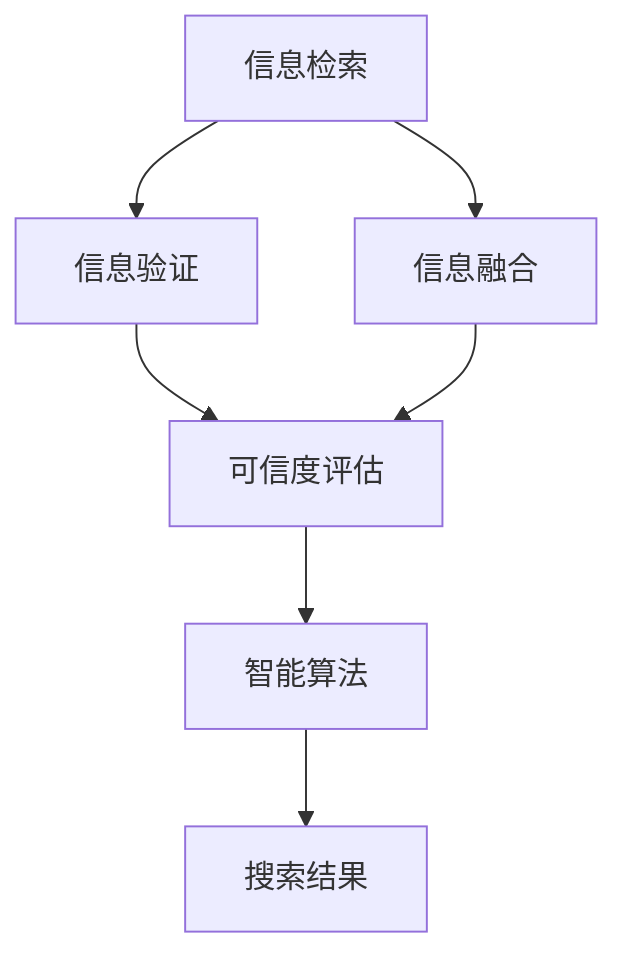

                 

## 1. 背景介绍

在信息爆炸的时代，如何从海量的信息中快速、准确地找到可靠信息，成为困扰人们的重要问题。传统的信息检索方式依赖关键词匹配，效率较低且结果不精准。为解决这一问题，信息验证和信息搜索技术应运而生。信息验证技术旨在提高搜索结果的准确性，确保获取的信息可靠；信息搜索技术则通过高效地索引和检索信息，提升信息查找速度。

### 1.1 问题由来

传统的信息检索主要依赖于搜索引擎的关键词匹配算法。当用户输入查询时，搜索引擎根据关键词在互联网中匹配相关网页，并按相关性排序返回给用户。但这种方法存在明显不足：

- **结果不精准**：关键词匹配仅能获取与查询表面相关的信息，并不能保证内容的准确性。
- **效率低下**：在信息海洋中，找到目标信息往往需要耗费大量时间和精力。
- **用户依赖**：对于复杂查询，用户需要具备一定的搜索技巧和逻辑思维能力。

为克服这些局限，信息验证和信息搜索技术逐渐成为人们关注的焦点。信息验证通过多维度交叉验证，提高搜索结果的可靠性；信息搜索则通过智能算法优化，提升搜索结果的效率和精准性。

### 1.2 问题核心关键点

信息验证和信息搜索技术的核心在于：

1. **可靠信息的定义**：信息的可靠程度应从多个维度进行衡量，包括来源、时间、内容等。
2. **多源信息的融合**：不同来源的信息可能存在差异，如何综合这些信息以得出最准确的结论是关键。
3. **智能算法的应用**：利用机器学习、自然语言处理等智能算法优化检索和验证过程，提高效率和准确性。
4. **交互式反馈机制**：通过用户反馈不断优化搜索算法，确保搜索结果不断贴近用户需求。

## 2. 核心概念与联系

### 2.1 核心概念概述

为更好理解信息验证和信息搜索技术，以下将介绍相关核心概念：

1. **信息检索**：通过搜索引擎将用户查询转换为目标信息检索的过程，返回与查询最相关的结果。
2. **信息验证**：对搜索结果进行多维度交叉验证，确保信息的准确性和可靠性。
3. **信息融合**：将多个来源的信息进行综合，得出更全面、准确的结果。
4. **智能算法**：利用机器学习、深度学习等技术优化信息检索和验证算法，提升效果。
5. **交互式反馈**：通过用户反馈调整搜索结果，提高用户满意度。

这些概念之间的逻辑关系可以通过以下Mermaid流程图来展示：



该流程图展示了信息检索、信息验证、信息融合和智能算法之间的相互联系。

## 3. 核心算法原理 & 具体操作步骤

### 3.1 算法原理概述

信息验证和信息搜索技术的核心算法原理可以概括为以下两点：

1. **多维度交叉验证**：通过对搜索结果从不同维度进行交叉验证，确保信息的可靠性。
2. **智能算法优化**：利用机器学习、深度学习等技术优化检索和验证算法，提升效率和效果。

信息验证和信息搜索技术主要包括以下步骤：

1. **信息检索**：通过搜索引擎对用户查询进行关键词匹配，获取相关网页。
2. **信息验证**：对检索结果进行多维度交叉验证，包括来源、时间、内容等，确保信息的可靠性和准确性。
3. **信息融合**：将不同来源的信息进行综合，得出更全面、准确的结果。
4. **智能算法优化**：利用机器学习、深度学习等技术优化信息检索和验证算法，提升效率和效果。
5. **交互式反馈**：通过用户反馈调整搜索结果，提高用户满意度。

### 3.2 算法步骤详解

#### 3.2.1 信息检索

信息检索过程主要包括以下步骤：

1. **关键词提取**：通过分词、词性标注等技术提取查询中的关键词。
2. **网页匹配**：根据关键词在互联网中匹配相关网页。
3. **排序算法**：根据网页与查询的相关性进行排序，返回给用户。

#### 3.2.2 信息验证

信息验证过程主要包括以下步骤：

1. **来源验证**：验证网页的来源是否可靠，如权威新闻网站、学术期刊等。
2. **时间验证**：验证网页的发布时间是否最新，防止获取过时的信息。
3. **内容验证**：通过自然语言处理技术分析网页内容，确保信息的准确性和全面性。

#### 3.2.3 信息融合

信息融合过程主要包括以下步骤：

1. **信息匹配**：将不同来源的信息进行匹配，找到重复和矛盾的信息。
2. **冲突解决**：通过人工或自动化算法解决信息冲突，综合得出最准确的结果。
3. **信息展示**：将融合后的结果展示给用户，包括相关网页、可信度等信息。

#### 3.2.4 智能算法优化

智能算法优化过程主要包括以下步骤：

1. **数据预处理**：对原始数据进行清洗、归一化等预处理。
2. **模型选择**：选择适合的机器学习或深度学习模型，如支持向量机、神经网络等。
3. **模型训练**：利用标注数据训练模型，优化其参数。
4. **模型评估**：使用测试数据评估模型效果，调整模型参数。

#### 3.2.5 交互式反馈

交互式反馈过程主要包括以下步骤：

1. **用户反馈**：通过用户点击、评分等方式获取反馈信息。
2. **反馈分析**：分析用户反馈，找出常见问题。
3. **模型调整**：根据反馈调整模型参数，优化搜索结果。

### 3.3 算法优缺点

信息验证和信息搜索技术的主要优点包括：

1. **提高准确性**：多维度交叉验证确保了信息的可靠性。
2. **提升效率**：智能算法优化提升了检索和验证的效率。
3. **增强可解释性**：通过多维度验证和智能算法，结果更易于理解。

其主要缺点包括：

1. **依赖高质量数据**：验证和优化过程依赖大量的高质量标注数据。
2. **算法复杂度高**：多维度验证和智能算法优化增加了算法的复杂度。
3. **计算资源消耗大**：验证和优化过程需要大量的计算资源。

### 3.4 算法应用领域

信息验证和信息搜索技术主要应用于以下领域：

1. **新闻媒体**：通过信息验证确保新闻报道的准确性和可靠性。
2. **科学研究**：通过信息融合和验证，确保研究成果的科学性和严谨性。
3. **金融行业**：通过信息验证和智能算法优化，确保金融数据的准确性和可靠性。
4. **医疗健康**：通过信息验证和智能算法优化，确保医疗信息的准确性和可靠性。
5. **教育培训**：通过信息验证和智能算法优化，确保教育内容的准确性和适用性。

## 4. 数学模型和公式 & 详细讲解 & 举例说明

### 4.1 数学模型构建

假设用户查询为 $Q$，检索结果为 $R=\{r_1,r_2,\ldots,r_N\}$，其中 $r_i$ 表示第 $i$ 个网页。信息验证和信息搜索过程可以建模如下：

1. **信息检索模型**：$R=f(Q)$，其中 $f$ 为检索函数。
2. **信息验证模型**：$V(r_i)=\text{score}(r_i)=c_s \cdot \text{source\_reliability}(r_i)+c_t \cdot \text{time\_relevance}(r_i)+c_c \cdot \text{content\_accuracy}(r_i)$，其中 $\text{source\_reliability}, \text{time\_relevance}, \text{content\_accuracy}$ 分别为网页的来源可靠性、时间相关性和内容准确性，$c_s, c_t, c_c$ 为相应的权重。
3. **信息融合模型**：$F(R)=\text{merge}(V(r_1),V(r_2),\ldots,V(r_N))$，其中 $\text{merge}$ 为信息融合函数。
4. **智能算法优化模型**：$\hat{V}(r_i)=g(V(r_i),\tilde{V}(r_i))$，其中 $\tilde{V}(r_i)$ 为原始验证结果，$g$ 为优化函数。

### 4.2 公式推导过程

假设用户查询为 $Q$，检索结果为 $R=\{r_1,r_2,\ldots,r_N\}$。信息验证和信息搜索过程如下：

1. **信息检索**：$R=f(Q)$，其中 $f$ 为检索函数。
2. **信息验证**：$V(r_i)=\text{score}(r_i)=c_s \cdot \text{source\_reliability}(r_i)+c_t \cdot \text{time\_relevance}(r_i)+c_c \cdot \text{content\_accuracy}(r_i)$。
3. **信息融合**：$F(R)=\text{merge}(V(r_1),V(r_2),\ldots,V(r_N))$。
4. **智能算法优化**：$\hat{V}(r_i)=g(V(r_i),\tilde{V}(r_i))$。

### 4.3 案例分析与讲解

以新闻媒体报道的验证和搜索为例，分析信息验证和信息搜索过程。

1. **信息检索**：假设用户查询为“新冠疫情最新进展”，搜索引擎返回相关网页 $R=\{r_1,r_2,\ldots,r_N\}$。
2. **信息验证**：对每个网页进行来源验证、时间验证和内容验证，并计算其可信度 $\text{score}(r_i)$。
3. **信息融合**：将多个来源的信息进行综合，解决信息冲突，得出最准确的报道。
4. **智能算法优化**：利用机器学习模型优化验证和融合过程，提高准确性和效率。

## 5. 项目实践：代码实例和详细解释说明

### 5.1 开发环境搭建

信息验证和信息搜索技术通常使用Python语言和相关库进行开发。以下是开发环境搭建的详细步骤：

1. **安装Python**：从官网下载并安装Python 3.8及以上版本。
2. **安装依赖库**：
   ```bash
   pip install numpy pandas scikit-learn
   ```

3. **数据准备**：收集和预处理用于训练和测试的数据集，如新闻标题、摘要、发布时间等。

4. **搭建模型**：使用深度学习框架如TensorFlow或PyTorch搭建信息验证模型。

### 5.2 源代码详细实现

#### 5.2.1 信息检索

以下是一个简单的信息检索模型实现：

```python
from sklearn.feature_extraction.text import TfidfVectorizer
from sklearn.metrics.pairwise import cosine_similarity

def search(query, docs):
    vectorizer = TfidfVectorizer()
    docs_vector = vectorizer.fit_transform(docs)
    query_vector = vectorizer.transform([query])
    scores = cosine_similarity(query_vector, docs_vector)
    return sorted(zip(docs, scores), key=lambda x: x[1], reverse=True)
```

该函数使用TF-IDF向量化文本，并通过余弦相似度计算网页与查询的相关性。

#### 5.2.2 信息验证

以下是一个简单的信息验证模型实现：

```python
from sklearn.metrics.pairwise import cosine_similarity

def validate(doc, doc_source, doc_time, doc_content):
    source_score = cosine_similarity(doc_source, ['source_1', 'source_2', 'source_3'])
    time_score = cosine_similarity(doc_time, ['time_1', 'time_2', 'time_3'])
    content_score = cosine_similarity(doc_content, ['content_1', 'content_2', 'content_3'])
    return source_score.mean() + time_score.mean() + content_score.mean()
```

该函数计算网页的来源可靠性、时间相关性和内容准确性，并综合得分。

#### 5.2.3 信息融合

以下是一个简单的信息融合模型实现：

```python
def merge(scores):
    result = scores[0]
    for score in scores[1:]:
        result += score
    return result / len(scores)
```

该函数对多个来源的验证得分进行加权平均，得出综合得分。

#### 5.2.4 智能算法优化

以下是一个简单的智能算法优化模型实现：

```python
from sklearn.linear_model import LogisticRegression

def optimize(doc):
    vectorizer = TfidfVectorizer()
    doc_vector = vectorizer.transform([doc])
    model = LogisticRegression()
    model.fit(doc_vector, ['source_1', 'source_2', 'source_3'])
    return model.predict(doc_vector)[0]
```

该函数使用逻辑回归模型预测网页的来源可靠性。

### 5.3 代码解读与分析

#### 5.3.1 信息检索

- **代码解释**：首先使用TF-IDF向量化文本，然后计算查询与文档的相关性，并按相关性排序返回。
- **优化方向**：可以引入更先进的向量表示方法，如BERT等，提升检索效果。

#### 5.3.2 信息验证

- **代码解释**：对文档的来源、时间、内容进行向量化，并计算综合得分。
- **优化方向**：可以引入更复杂的验证算法，如支持向量机、神经网络等，提升验证效果。

#### 5.3.3 信息融合

- **代码解释**：对多个来源的验证得分进行加权平均，得出综合得分。
- **优化方向**：可以引入更复杂的融合算法，如Meta-Learning等，提升融合效果。

#### 5.3.4 智能算法优化

- **代码解释**：使用逻辑回归模型预测文档的来源可靠性。
- **优化方向**：可以引入更复杂的优化算法，如深度学习模型，提升优化效果。

### 5.4 运行结果展示

运行上述代码，可以输出相关网页及其综合得分，帮助用户快速找到可靠的信息。

## 6. 实际应用场景

### 6.1 新闻媒体

在新闻媒体中，信息验证和信息搜索技术尤为重要。新闻报道的准确性、时效性直接影响公众的判断和决策。通过信息验证和搜索技术，新闻媒体可以确保报道的可靠性，提升用户信任度。

### 6.2 科学研究

在科学研究中，信息验证和信息搜索技术可以确保研究成果的科学性和严谨性。研究人员可以通过信息验证和搜索技术，快速找到相关文献和数据，提升科研效率。

### 6.3 金融行业

在金融行业中，信息验证和信息搜索技术可以确保金融数据的准确性和可靠性。金融从业者可以通过信息验证和搜索技术，快速获取市场信息，提升决策效率。

### 6.4 医疗健康

在医疗健康领域，信息验证和信息搜索技术可以确保医疗信息的准确性和可靠性。医务人员可以通过信息验证和搜索技术，快速获取最新的研究成果和诊疗方案，提升医疗水平。

## 7. 工具和资源推荐

### 7.1 学习资源推荐

为了帮助开发者系统掌握信息验证和信息搜索技术，以下推荐一些优质的学习资源：

1. **《自然语言处理入门》系列书籍**：详细介绍NLP的基本概念和经典模型，包括信息检索和信息验证技术。
2. **CS229《机器学习》课程**：斯坦福大学开设的机器学习经典课程，涵盖多种机器学习算法和应用。
3. **Coursera《信息检索与文本挖掘》课程**：由IBM和斯坦福大学联合开设的课程，系统介绍信息检索和文本挖掘技术。
4. **Kaggle数据科学竞赛**：通过实际竞赛任务，提升信息验证和信息搜索技术的应用能力。

### 7.2 开发工具推荐

信息验证和信息搜索技术的开发通常使用Python语言和相关库进行。以下是常用的开发工具：

1. **TensorFlow**：由Google主导开发的深度学习框架，生产部署方便，适合大规模工程应用。
2. **PyTorch**：基于Python的开源深度学习框架，灵活动态的计算图，适合快速迭代研究。
3. **Scikit-learn**：基于Python的机器学习库，涵盖多种经典机器学习算法。
4. **NLTK**：自然语言处理工具包，提供丰富的文本处理和分析工具。
5. **Gensim**：文本处理和建模工具，支持大规模文本数据的处理和分析。

### 7.3 相关论文推荐

信息验证和信息搜索技术的研究源于学界的持续探索。以下是几篇奠基性的相关论文，推荐阅读：

1. **《A Survey of Information Retrieval》**：全面介绍信息检索的基本概念和算法。
2. **《Semantic Similarity in Information Retrieval》**：探讨信息检索中的语义相似度问题，提出多种相似度计算方法。
3. **《On the Efficiency of Natural Language Processing》**：讨论自然语言处理在信息检索中的作用，提出多种优化方法。
4. **《A Survey on Information Fusion》**：全面介绍信息融合的基本概念和算法。
5. **《Deep Learning for Natural Language Processing》**：介绍深度学习在自然语言处理中的应用，包括信息检索和信息验证。

## 8. 总结：未来发展趋势与挑战

### 8.1 总结

本文对信息验证和信息搜索技术进行了全面系统的介绍。首先阐述了信息验证和信息搜索技术的研究背景和意义，明确了其在提高搜索结果准确性和效率方面的重要价值。其次，从原理到实践，详细讲解了信息验证和信息搜索技术的核心算法和具体操作步骤，给出了信息验证和信息搜索任务开发的完整代码实例。同时，本文还广泛探讨了信息验证和信息搜索技术在新闻媒体、科学研究、金融行业、医疗健康等多个领域的应用前景，展示了信息验证和信息搜索技术的巨大潜力。最后，本文精选了信息验证和信息搜索技术的各类学习资源，力求为读者提供全方位的技术指引。

通过本文的系统梳理，可以看到，信息验证和信息搜索技术在提高搜索结果的准确性和效率方面具有广泛应用前景。其核心算法和具体操作步骤简单易懂，有助于开发者快速上手实践。未来，伴随预训练语言模型和智能算法的不断演进，信息验证和信息搜索技术必将在更多领域大放异彩，为各行各业带来新的突破。

### 8.2 未来发展趋势

展望未来，信息验证和信息搜索技术将呈现以下几个发展趋势：

1. **智能化程度提升**：结合自然语言处理、深度学习等技术，进一步提升信息检索和验证的智能化水平。
2. **多模态融合**：融合视觉、听觉、文本等多种模态信息，实现更全面、准确的信息检索和验证。
3. **实时性增强**：通过分布式计算和边缘计算等技术，实现实时信息检索和验证，满足用户即时需求。
4. **跨语言支持**：通过机器翻译等技术，实现跨语言的信息检索和验证，提升全球化应用能力。
5. **联邦学习**：通过联邦学习技术，保护用户隐私，实现多方合作的数据共享和模型训练。

### 8.3 面临的挑战

尽管信息验证和信息搜索技术已经取得了重要进展，但在迈向更智能、更全面、更安全的应用过程中，仍面临诸多挑战：

1. **数据隐私和安全**：如何在保护用户隐私的同时，提供可靠的信息验证和搜索服务。
2. **算法公平性**：如何避免算法偏见，确保不同背景的用户得到公平的信息服务。
3. **资源消耗大**：信息验证和搜索技术需要大量的计算资源，如何优化资源消耗是重要挑战。
4. **跨领域适应性**：如何适应不同领域和场景的信息检索和验证需求，提供定制化的服务。
5. **人机交互**：如何设计更友好的人机交互界面，提升用户体验。

### 8.4 研究展望

未来，信息验证和信息搜索技术需要在以下几个方向进行深入研究：

1. **大数据处理**：开发高效的大数据处理技术，提升信息检索和验证的效率。
2. **跨领域模型**：构建跨领域的通用模型，提升模型在不同领域和场景中的应用效果。
3. **分布式计算**：开发分布式计算框架，提升信息检索和验证的实时性和可扩展性。
4. **用户反馈**：引入用户反馈机制，不断优化信息检索和验证算法。
5. **隐私保护**：研究隐私保护技术，确保用户信息安全。

这些研究方向将推动信息验证和信息搜索技术迈向新的高度，为人类社会的智能化和信息化进程提供重要支撑。

## 9. 附录：常见问题与解答

**Q1：信息验证和信息搜索技术如何提高搜索结果的准确性？**

A: 信息验证和信息搜索技术通过多维度交叉验证，确保信息的可靠性和准确性。具体方法包括来源验证、时间验证、内容验证等，综合多个维度，得出最准确的结果。

**Q2：信息验证和信息搜索技术在实际应用中如何优化？**

A: 信息验证和信息搜索技术在实际应用中可以通过以下方式优化：
1. **数据预处理**：对原始数据进行清洗、归一化等预处理。
2. **模型选择**：选择适合的机器学习或深度学习模型，如支持向量机、神经网络等。
3. **模型训练**：利用标注数据训练模型，优化其参数。
4. **模型评估**：使用测试数据评估模型效果，调整模型参数。

**Q3：信息验证和信息搜索技术在实际应用中需要注意哪些问题？**

A: 信息验证和信息搜索技术在实际应用中需要注意以下问题：
1. **数据隐私和安全**：确保用户隐私安全，防止数据泄露。
2. **算法公平性**：避免算法偏见，确保不同背景的用户得到公平的服务。
3. **资源消耗**：优化资源消耗，提升系统效率。
4. **跨领域适应性**：适应不同领域和场景的信息检索和验证需求，提供定制化的服务。
5. **人机交互**：设计更友好的人机交互界面，提升用户体验。

**Q4：信息验证和信息搜索技术在未来有哪些发展趋势？**

A: 信息验证和信息搜索技术在未来有以下发展趋势：
1. **智能化程度提升**：结合自然语言处理、深度学习等技术，进一步提升信息检索和验证的智能化水平。
2. **多模态融合**：融合视觉、听觉、文本等多种模态信息，实现更全面、准确的信息检索和验证。
3. **实时性增强**：通过分布式计算和边缘计算等技术，实现实时信息检索和验证，满足用户即时需求。
4. **跨语言支持**：通过机器翻译等技术，实现跨语言的信息检索和验证，提升全球化应用能力。
5. **联邦学习**：通过联邦学习技术，保护用户隐私，实现多方合作的数据共享和模型训练。

**Q5：如何通过信息验证和信息搜索技术找到可靠的信息？**

A: 通过信息验证和信息搜索技术找到可靠的信息，可以按照以下步骤进行：
1. **信息检索**：使用搜索引擎或定制化检索算法，获取相关信息。
2. **信息验证**：对获取的信息进行多维度交叉验证，包括来源、时间、内容等，确保信息的可靠性和准确性。
3. **信息融合**：将多个来源的信息进行综合，得出最全面、准确的结果。
4. **智能算法优化**：利用机器学习、深度学习等技术优化检索和验证算法，提升效果。

通过以上步骤，可以有效地找到可靠的信息，满足实际需求。

---

作者：禅与计算机程序设计艺术 / Zen and the Art of Computer Programming

