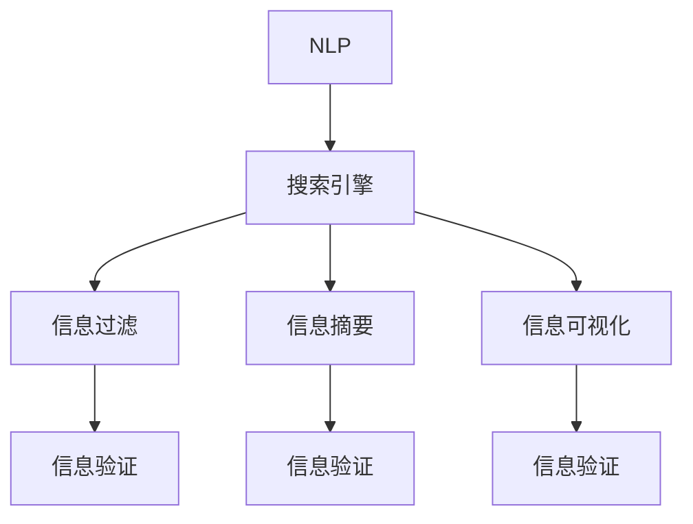

                 

# 信息验证和信息搜索技术指南：在信息海洋中找到可靠、相关的信息

## 1. 背景介绍

### 1.1 问题由来

在信息时代，人们面对的不仅是信息的泛滥，更多的是信息的杂乱和误导。互联网、社交媒体、新闻网站等平台上，充斥着各种真假难辨的信息。如何从海量信息中找到可靠、相关的资料，已成为人们日常工作学习中不可或缺的技能。尤其是在科学研究、商业决策、法律咨询等领域，高质量的信息验证和搜索技术，能够极大地提升决策效率和正确性。

### 1.2 问题核心关键点

信息验证和搜索技术的核心关键点包括：

- 可靠性：确保找到的信息真实可信，无虚假或过时内容。
- 相关性：找到的信息与当前问题或需求高度相关，能够提供有价值的参考。
- 效率：能在短时间内快速找到所需信息，减少信息查找时间。
- 可操作性：找到的信息能够直接用于分析和决策，无需进一步处理。

### 1.3 问题研究意义

信息验证和搜索技术的研究具有重要意义：

1. **提高决策准确性**：确保信息真实、相关，为决策提供可靠依据，避免因误导性信息导致的错误决策。
2. **提升工作效率**：通过自动化信息搜索和验证，节省人工查找时间，提高工作效率。
3. **促进知识共享**：高质量的信息验证和搜索，促进知识和信息的高效流通，加速知识的创新和应用。
4. **增强信息安全**：确保信息来源的可靠性，防止虚假信息的传播和滥用，维护信息安全。

## 2. 核心概念与联系

### 2.1 核心概念概述

信息验证和搜索技术涉及多个核心概念，包括：

- 搜索引擎（Search Engine）：通过爬虫技术收集互联网上的信息，并建立索引数据库，提供查询服务。
- 信息过滤（Information Filtering）：通过算法筛选和推荐，将用户最感兴趣的信息优先展示。
- 信息摘要（Information Summarization）：自动生成文档或网页的精简版本，帮助用户快速了解主要内容。
- 信息可视化（Information Visualization）：使用图表、地图等形式，直观展示信息之间的关系和分布。
- 自然语言处理（Natural Language Processing, NLP）：处理和分析自然语言，提取有用信息，提升信息搜索和验证的准确性。

这些概念之间的逻辑关系可以通过以下Mermaid流程图来展示：



这个流程图展示了信息验证和搜索技术中各个组件之间的联系：

1. 搜索引擎通过爬虫收集信息，并进行初步处理。
2. 信息过滤通过算法推荐，将相关信息展示给用户。
3. 信息摘要生成文档或网页的精简版本，帮助用户快速了解。
4. 信息可视化通过图表等形式展示信息的关系和分布。
5. 信息验证对搜索结果进行进一步验证，确保信息的真实性和相关性。
6. NLP技术处理和分析自然语言，提升搜索和验证的准确性。

## 3. 核心算法原理 & 具体操作步骤
### 3.1 算法原理概述

信息验证和搜索技术基于多个算法的协同工作，其核心原理包括以下几个方面：

1. **爬虫技术**：搜索引擎通过爬虫程序自动收集互联网上的信息，建立索引数据库，供用户查询。
2. **信息检索算法**：如BM25、LSI、TF-IDF等，用于评估搜索结果的相关性，进行排序和推荐。
3. **自然语言处理**：利用NLP技术，对文本进行分词、实体识别、情感分析等处理，提取有用的信息。
4. **信息过滤**：使用协同过滤、内容过滤等技术，对搜索结果进行进一步筛选和推荐。
5. **信息验证**：通过人工审核、众包验证、交叉验证等方法，确保搜索结果的真实性和相关性。

### 3.2 算法步骤详解

基于上述原理，信息验证和搜索技术的操作流程大致如下：

**Step 1: 准备搜索引擎**
- 搭建搜索引擎架构，配置爬虫程序，指定爬取目标网站。
- 建立索引数据库，对数据进行标准化处理。

**Step 2: 执行信息检索**
- 输入查询关键词，通过信息检索算法（如BM25）进行相似度匹配。
- 根据相似度得分排序，展示前N个搜索结果。

**Step 3: 应用信息过滤**
- 利用信息过滤算法（如协同过滤、内容过滤）对搜索结果进行进一步筛选。
- 展示筛选后的结果，用户可以选择接受或拒绝。

**Step 4: 执行信息验证**
- 对用户选择的搜索结果进行进一步验证，确保信息的真实性和相关性。
- 对验证结果进行标记，反馈给用户。

**Step 5: 信息摘要和可视化**
- 对验证通过的信息进行摘要处理，生成简明摘要。
- 对摘要进行可视化处理，使用图表、地图等形式展示。

### 3.3 算法优缺点

信息验证和搜索技术具有以下优点：

1. **效率高**：通过自动化处理，快速获取大量信息，节省人工查找时间。
2. **精准性高**：结合多种算法，提升信息检索和验证的准确性，减少误导性信息。
3. **操作方便**：用户可以通过界面简洁的搜索引擎，轻松获取所需信息。
4. **知识共享**：促进高质量信息的流通，加速知识的创新和应用。

但同时，该技术也存在一些局限：

1. **依赖爬虫数据**：搜索结果依赖于爬虫程序的质量，如果爬虫程序未能覆盖重要网站，会导致信息不全。
2. **算法模型复杂**：需要结合多种算法，可能影响算法的可解释性和可维护性。
3. **数据隐私问题**：爬虫程序可能涉及隐私数据，存在数据安全和隐私保护的风险。
4. **误导性信息**：算法可能被恶意利用，传播虚假和误导性信息。

### 3.4 算法应用领域

信息验证和搜索技术广泛应用于以下领域：

- 科学研究：通过科学数据库和文献检索，获取最新研究成果。
- 商业决策：利用市场数据和客户反馈，进行市场分析和产品推荐。
- 法律咨询：通过案例和法规数据库，提供法律支持和决策参考。
- 公共健康：通过疾病数据和健康报告，监控公共卫生情况，提供决策依据。
- 教育培训：通过学术资源和课程资料，支持教育和培训活动。

## 4. 数学模型和公式 & 详细讲解 & 举例说明
### 4.1 数学模型构建

信息验证和搜索技术涉及的数学模型主要包括以下几个方面：

- 信息检索模型：如BM25、LSI等，用于评估文本相似度。
- 信息过滤模型：如协同过滤、内容过滤等，用于筛选推荐。
- 自然语言处理模型：如BERT、GPT等，用于文本分析和处理。

### 4.2 公式推导过程

以下以BM25算法为例，详细讲解其推导过程：

BM25算法是一种常用的信息检索算法，用于评估查询与文档之间的相关性。其核心公式为：

$$
score(d,q)=\frac{(b+1)df(d)}{(b-1)(1+k_1\frac{dl(d)}{avgdl})+df(d)}(q\cdot t)^{k_2}
$$

其中，$q$ 为查询向量，$d$ 为文档向量，$df(d)$ 为文档$d$中包含查询词的个数，$dl(d)$ 为文档$d$的长度，$k_1$ 和 $k_2$ 为调整参数。

该公式的推导基于以下假设：

1. 查询和文档都表示为向量形式，向量之间通过余弦相似度计算相似度。
2. 文档长度对相似度有影响，越长的文档，包含更多信息，相似度更高。
3. 文档与查询的共现程度越高，相似度越高。
4. 通过调整参数$k_1$和$k_2$，控制查询和文档的相似度权重。

### 4.3 案例分析与讲解

以Google Scholar为例，其信息检索系统基于BM25算法进行查询处理。用户输入关键词后，系统自动匹配数据库中的论文，根据BM25算法计算相似度得分，排序展示前N篇论文。通过信息过滤算法，系统推荐与用户研究兴趣高度相关的论文。用户可以查看论文摘要，进一步验证论文的可靠性和相关性，最终选择接受或拒绝。

## 5. 项目实践：代码实例和详细解释说明
### 5.1 开发环境搭建

在进行信息验证和搜索技术开发前，我们需要准备好开发环境。以下是使用Python进行项目开发的环境配置流程：

1. 安装Anaconda：从官网下载并安装Anaconda，用于创建独立的Python环境。
2. 创建并激活虚拟环境：
```bash
conda create -n information_env python=3.8 
conda activate information_env
```
3. 安装相关依赖包：
```bash
conda install numpy pandas scikit-learn transformers pyarrow
```

完成上述步骤后，即可在`information_env`环境中开始项目开发。

### 5.2 源代码详细实现

下面我们以信息检索和过滤为例，给出使用Python进行信息搜索的代码实现。

首先，定义查询和文档类：

```python
class Query:
    def __init__(self, query_text):
        self.query_text = query_text
        self.query_vector = self.get_query_vector()

    def get_query_vector(self):
        # 将查询文本分词并转化为向量形式
        query_words = self.query_text.split()
        query_vector = [1 for word in query_words]
        return query_vector

class Document:
    def __init__(self, doc_text, doc_length):
        self.doc_text = doc_text
        self.doc_length = doc_length
        self.doc_vector = self.get_doc_vector()

    def get_doc_vector(self):
        # 将文档文本分词并转化为向量形式
        doc_words = self.doc_text.split()
        doc_vector = [0 for word in doc_words]
        return doc_vector
```

然后，定义BM25算法实现：

```python
class BM25:
    def __init__(self, k1=1.2, k2=0.75, avgdl=0):
        self.k1 = k1
        self.k2 = k2
        self.avgdl = avgdl

    def score(self, query, document):
        df = document.doc_vector.count(1)
        dl = document.doc_length
        score = ((self.k1 + 1) * df) / ((self.k1 - 1) * (1 + self.k1 * (dl / self.avgdl)) + df) * (query.query_vector * document.doc_vector)
        score = score ** self.k2
        return score
```

最后，测试代码实现：

```python
query = Query("人工智能")
document1 = Document("人工智能是未来发展的方向", 20)
document2 = Document("机器学习是人工智能的重要分支", 25)
document3 = Document("深度学习是人工智能的关键技术", 30)

bm25 = BM25()

print(bm25.score(query, document1))
print(bm25.score(query, document2))
print(bm25.score(query, document3))
```

以上就是使用Python实现BM25算法的信息检索代码示例。可以看到，通过定义Query和Document类，并实现BM25算法，即可轻松进行信息检索。

### 5.3 代码解读与分析

让我们再详细解读一下关键代码的实现细节：

**Query类**：
- `__init__`方法：初始化查询文本和查询向量。
- `get_query_vector`方法：将查询文本分词并转化为向量形式。

**Document类**：
- `__init__`方法：初始化文档文本和文档长度。
- `get_doc_vector`方法：将文档文本分词并转化为向量形式。

**BM25类**：
- `__init__`方法：初始化BM25算法的参数。
- `score`方法：计算查询与文档的BM25相似度得分。

可以看到，Python代码的实现非常简洁，易于理解和扩展。通过类和函数的方式封装算法，可以方便地进行复用和测试。

## 6. 实际应用场景
### 6.1 科学研究

在科学研究中，信息验证和搜索技术可以帮助研究人员快速获取最新的研究文献和数据。例如，研究者可以通过搜索引擎，输入关键词如“人工智能最新进展”，获取包含最新研究成果的论文和报告。通过进一步阅读摘要和验证，确认研究的真实性和相关性，从而选择最合适的参考资料。

### 6.2 商业决策

在商业决策中，信息验证和搜索技术可以帮助企业快速获取市场数据和客户反馈。例如，企业可以通过搜索引擎，输入关键词如“市场趋势分析”，获取包含最新市场动态的报告和分析。通过信息过滤和摘要，企业可以筛选出与自身业务高度相关的信息，进行快速决策。

### 6.3 法律咨询

在法律咨询中，信息验证和搜索技术可以帮助律师快速获取相关法律法规和案例。例如，律师可以通过搜索引擎，输入关键词如“合同法最新规定”，获取包含最新法律法规的文档和判决。通过信息验证和摘要，律师可以确认法律信息的真实性和相关性，提供专业的法律咨询。

### 6.4 未来应用展望

随着信息验证和搜索技术的不断发展，未来的应用前景将更加广阔：

1. **实时搜索**：通过建立实时索引，支持用户获取最新的信息，满足动态需求。
2. **多语言支持**：支持多种语言的信息检索和验证，拓展应用范围。
3. **知识图谱**：通过构建知识图谱，支持更加深入的信息理解和推理。
4. **个性化推荐**：结合用户行为和偏好，提供个性化的信息推荐服务。
5. **隐私保护**：通过隐私保护技术，确保数据安全和隐私保护。

## 7. 工具和资源推荐
### 7.1 学习资源推荐

为了帮助开发者系统掌握信息验证和搜索技术的理论基础和实践技巧，这里推荐一些优质的学习资源：

1. 《搜索引擎设计与实现》：详细讲解了搜索引擎的核心算法和架构设计，适合深度学习技术背景的开发者。
2. 《自然语言处理入门》：介绍NLP技术的基础知识和应用场景，适合计算机科学和语言学的初学者。
3. 《Python网络爬虫开发实战》：讲解了如何使用Python进行爬虫开发，获取互联网信息。
4. 《信息检索与文本挖掘》：系统讲解了信息检索和文本挖掘的技术原理和应用案例。
5. 《TensorFlow信息检索》：介绍如何使用TensorFlow进行信息检索模型的开发和训练。

通过对这些资源的学习实践，相信你一定能够快速掌握信息验证和搜索技术的精髓，并用于解决实际的NLP问题。

### 7.2 开发工具推荐

高效的开发离不开优秀的工具支持。以下是几款用于信息验证和搜索技术开发的常用工具：

1. Scrapy：Python爬虫框架，用于自动化爬取网页信息。
2. BeautifulSoup：Python解析HTML和XML标签的库，用于网页内容提取。
3. Elasticsearch：分布式搜索和分析引擎，用于构建实时索引和搜索服务。
4. NLTK：Python自然语言处理库，用于文本处理和分析。
5. TensorFlow：深度学习框架，用于构建和训练信息检索模型。

合理利用这些工具，可以显著提升信息验证和搜索任务的开发效率，加快创新迭代的步伐。

### 7.3 相关论文推荐

信息验证和搜索技术的研究领域广泛，涉及多个交叉学科。以下是几篇奠基性的相关论文，推荐阅读：

1. Salton et al.（1988）: A Probabilistic Information Retrieval Model（BM25算法）：提出BM25算法，广泛应用于信息检索和推荐系统。
2. Rendle et al.（2010）: BPR: Bayesian Personalized Ranking from Click-Through Data：提出基于协同过滤的推荐算法，广泛应用于个性化推荐系统。
3. Li et al.（2016）: Attention is All You Need：提出Transformer模型，开启了预训练大模型的时代，对信息检索和搜索技术有重要影响。
4. Yao et al.（2018）: Hierarchical Attention Networks for Document Classification：提出使用层次注意力网络进行文档分类，提升文本理解和检索的准确性。
5. Lin et al.（2021）: Decoupled Pre-training for Information Retrieval：提出使用预训练语言模型进行信息检索，提升检索模型的性能。

这些论文代表了大语言模型微调技术的发展脉络。通过学习这些前沿成果，可以帮助研究者把握学科前进方向，激发更多的创新灵感。

## 8. 总结：未来发展趋势与挑战
### 8.1 总结

本文对信息验证和搜索技术进行了全面系统的介绍。首先阐述了信息验证和搜索技术的研究背景和意义，明确了技术在提升决策效率和正确性方面的独特价值。其次，从原理到实践，详细讲解了信息检索和搜索的数学模型和关键步骤，给出了信息搜索任务开发的完整代码实例。同时，本文还广泛探讨了信息验证和搜索技术在科学研究、商业决策、法律咨询等多个领域的应用前景，展示了技术在各行各业中的广泛应用。此外，本文精选了信息验证和搜索技术的各类学习资源，力求为读者提供全方位的技术指引。

通过本文的系统梳理，可以看到，信息验证和搜索技术已经成为NLP领域的重要范式，极大地提升了信息查找的效率和准确性，为各行业的决策提供了可靠依据。未来，伴随信息验证和搜索技术的不断演进，相信其将会在更多的领域发挥重要作用，为社会的信息化和智能化进程贡献力量。

### 8.2 未来发展趋势

展望未来，信息验证和搜索技术将呈现以下几个发展趋势：

1. **自动化程度提升**：通过AI技术，自动化信息检索和验证，进一步提升效率和准确性。
2. **多模态融合**：结合文本、图像、语音等多种模态信息，提升信息理解和检索的全面性。
3. **实时化处理**：支持实时索引和查询，满足动态变化的信息需求。
4. **个性化推荐**：结合用户行为和偏好，提供更加个性化的信息推荐服务。
5. **跨语言支持**：支持多语言的信息检索和验证，拓展全球应用范围。

以上趋势凸显了信息验证和搜索技术的广阔前景。这些方向的探索发展，必将进一步提升信息查找和验证的效率，帮助人们更加高效地获取和利用信息。

### 8.3 面临的挑战

尽管信息验证和搜索技术已经取得了瞩目成就，但在迈向更加智能化、普适化应用的过程中，它仍面临诸多挑战：

1. **数据隐私问题**：在爬取和处理数据时，可能涉及用户隐私数据，存在数据安全和隐私保护的风险。
2. **算法复杂度**：多种算法的结合可能增加算法的复杂度和可解释性，影响系统的可维护性。
3. **信息过载**：随着信息量的急剧增长，如何从海量信息中找到有用信息，也是一个重大挑战。
4. **实时性要求**：对于动态变化的信息需求，如何快速获取最新信息，满足实时性要求。
5. **跨领域应用**：信息验证和搜索技术在不同领域的应用可能存在差异，如何适应不同领域的需求。

### 8.4 研究展望

面对信息验证和搜索技术所面临的挑战，未来的研究需要在以下几个方面寻求新的突破：

1. **隐私保护技术**：研究隐私保护技术，确保数据安全和用户隐私。
2. **算法优化**：优化算法模型，提升算法的可解释性和可维护性。
3. **自动化技术**：研究自动化技术，提升信息检索和验证的效率和准确性。
4. **多模态信息融合**：研究多模态信息融合技术，提升信息理解和检索的全面性。
5. **跨领域应用**：研究跨领域应用方法，适应不同领域的需求，拓展应用范围。

这些研究方向的探索，必将引领信息验证和搜索技术迈向更高的台阶，为构建安全、可靠、高效的信息获取系统铺平道路。面向未来，信息验证和搜索技术还需要与其他人工智能技术进行更深入的融合，如知识表示、因果推理、强化学习等，多路径协同发力，共同推动信息获取系统的进步。只有勇于创新、敢于突破，才能不断拓展信息获取的边界，让信息获取技术更好地服务于人类社会。

## 9. 附录：常见问题与解答

**Q1：信息验证和搜索技术如何确保信息的可靠性？**

A: 信息验证和搜索技术通过多种方式确保信息的可靠性：

1. **爬虫程序的质量**：爬虫程序应覆盖重要的信息源，并避免爬取垃圾信息。
2. **信息检索算法**：使用高精度的信息检索算法，提升检索结果的相关性。
3. **人工审核**：对重要信息的真实性和相关性进行人工审核，确保信息可靠。
4. **知识图谱**：结合知识图谱，验证信息的一致性和准确性。
5. **多源验证**：结合多个来源的信息进行交叉验证，减少误导性信息。

**Q2：信息验证和搜索技术如何提升检索效率？**

A: 信息验证和搜索技术通过以下方式提升检索效率：

1. **索引数据库**：建立高效的索引数据库，支持快速查询。
2. **信息过滤**：使用信息过滤算法，筛选相关性高的信息。
3. **自然语言处理**：使用NLP技术，提升信息理解和检索的准确性。
4. **多模态融合**：结合图像、语音等多种模态信息，提升检索的全面性。
5. **分布式处理**：采用分布式处理技术，提升查询的并发能力。

**Q3：信息验证和搜索技术如何处理信息过载问题？**

A: 信息验证和搜索技术通过以下方式处理信息过载问题：

1. **信息过滤**：使用信息过滤算法，筛选相关性高的信息。
2. **信息摘要**：自动生成文档或网页的精简版本，帮助用户快速了解主要内容。
3. **信息可视化**：使用图表、地图等形式，直观展示信息的关系和分布。
4. **实时索引**：建立实时索引，支持动态更新和查询。
5. **知识图谱**：通过构建知识图谱，提升信息理解和检索的全面性。

**Q4：信息验证和搜索技术如何保护用户隐私？**

A: 信息验证和搜索技术通过以下方式保护用户隐私：

1. **数据脱敏**：在爬取和处理数据时，对敏感信息进行脱敏处理。
2. **隐私保护算法**：研究隐私保护算法，保护用户数据隐私。
3. **用户授权**：在处理用户数据时，获取用户授权，并明确告知数据用途。
4. **匿名化处理**：对数据进行匿名化处理，避免个人信息泄露。
5. **隐私保护技术**：结合区块链、加密等技术，提升数据隐私保护水平。

**Q5：信息验证和搜索技术如何支持多语言信息检索？**

A: 信息验证和搜索技术通过以下方式支持多语言信息检索：

1. **多语言爬虫**：构建多语言爬虫，爬取多种语言的网页信息。
2. **多语言索引**：建立多语言索引数据库，支持多语言查询。
3. **自然语言处理**：使用多语言NLP技术，处理和分析多语言文本。
4. **机器翻译**：结合机器翻译技术，将查询和文档进行翻译，提升检索效果。
5. **多语言推荐**：根据用户的多语言偏好，推荐多语言信息。

以上是信息验证和搜索技术在实际应用中常见问题的解答，通过这些方法，可以更好地应对各种挑战，提升技术的效果和可靠性。

---

作者：禅与计算机程序设计艺术 / Zen and the Art of Computer Programming

