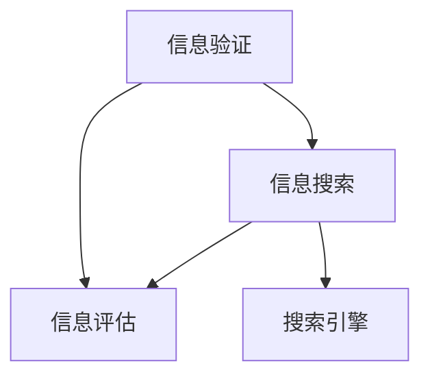

                 

# 信息验证和信息搜索技术：在信息海洋中找到可靠、有价值的信息

## 1. 背景介绍

在当今信息爆炸的时代，互联网已经成为获取知识和信息的重要渠道。然而，海量的信息同时也带来了信息过载和信息污染的问题。如何从信息海洋中找到可靠、有价值的信息，成为了每个信息消费者都必须面对的挑战。

本博客将详细介绍信息验证和信息搜索技术，帮助读者在互联网的信息海洋中找到可靠、有价值的信息。我们将从核心概念、算法原理、操作步骤、应用场景和未来展望等多个角度，深入探讨如何高效地利用信息验证和搜索技术，提升信息获取的效率和准确性。

## 2. 核心概念与联系

### 2.1 核心概念概述

为了更好地理解信息验证和信息搜索技术，我们需要首先了解几个核心概念：

- **信息验证(Information Verification)**：指的是通过各种手段，验证信息来源的可靠性，判断信息的真实性和准确性。信息验证是确保信息质量和可信度的重要环节。

- **信息搜索(Information Search)**：指的是通过特定的算法和工具，从海量信息中快速找到所需的信息。信息搜索是信息获取的第一步，其目标是提高信息查找的速度和准确性。

- **搜索引擎(Search Engine)**：是一种特殊的搜索引擎，能够根据用户的查询请求，自动从互联网上的信息库中检索出最相关的信息。常见的搜索引擎有Google、Bing、百度等。

- **信息评估(Information Evaluation)**：是对信息的质量、价值和相关性进行综合评估的过程。信息评估有助于筛选出可靠和有价值的信息，避免信息污染。

### 2.2 核心概念联系

信息验证和信息搜索技术之间有着密切的联系。信息验证是信息搜索的前提，通过验证信息的可靠性，可以大大提高搜索效率和准确性。同时，信息搜索也是信息验证的重要工具，通过搜索引擎可以迅速找到相关信息的来源，进行进一步验证。信息评估则是对搜索结果的综合评价，有助于筛选出高质量的信息。

这些核心概念之间的关系可以通过以下Mermaid流程图来展示：



该流程图展示了信息验证、信息搜索和信息评估之间的联系，以及搜索引擎在信息搜索中的作用。

## 3. 核心算法原理 & 具体操作步骤

### 3.1 算法原理概述

信息验证和搜索技术的核心原理基于自然语言处理和机器学习算法。这些技术能够自动识别和提取文本中的关键信息，进行比对和分析，从而验证信息的真实性和准确性，并从海量信息中筛选出最相关的结果。

信息验证算法通常包括以下步骤：
1. 收集相关信息，包括原始信息、来源、发布时间、作者等。
2. 使用自然语言处理技术，分析文本的结构和内容。
3. 使用机器学习算法，对信息的真实性和准确性进行判断。

信息搜索算法通常包括以下步骤：
1. 接收用户的查询请求，解析查询条件和关键词。
2. 使用搜索引擎的索引库，检索出相关的信息。
3. 根据用户的反馈，对搜索结果进行排序和筛选。

### 3.2 算法步骤详解

#### 3.2.1 信息验证算法步骤

**Step 1: 收集相关信息**
收集相关信息是信息验证的第一步。这包括原始信息、来源、发布时间、作者、引用的文献等。这些信息有助于分析信息的背景和来源，判断其可信度。

**Step 2: 文本预处理**
文本预处理是对原始文本进行清洗和分词的过程。去除文本中的噪声和干扰信息，将其转化为计算机能够处理的格式。常见的文本预处理方法包括去除停用词、词性标注、词干提取等。

**Step 3: 信息抽取**
信息抽取是从文本中提取出关键信息的过程。这包括提取实体、关系、事件等信息。信息抽取通常使用基于规则和基于机器学习的方法。基于规则的方法依赖于人工定义的规则，而基于机器学习的方法则使用训练好的模型自动抽取信息。

**Step 4: 信息比对**
信息比对是将原始信息与从其他来源抽取的信息进行比对，判断其一致性和真实性。常见的比对方法包括文本相似度计算、关键词匹配等。

**Step 5: 信息验证**
信息验证是最终的判断步骤。通过比对和分析，判断信息的真实性和准确性。信息验证通常结合人工和自动化的方式进行。

#### 3.2.2 信息搜索算法步骤

**Step 1: 用户查询**
用户输入查询条件和关键词，描述所需信息的特征。查询条件可以是文本、图片、音频等。

**Step 2: 查询解析**
搜索引擎解析用户的查询请求，将其转化为内部可处理的格式。查询解析包括关键词提取、语法分析等。

**Step 3: 索引检索**
搜索引擎使用索引库检索相关的信息。索引库包含大量已处理的信息，使用倒排索引技术进行快速检索。

**Step 4: 结果排序**
搜索引擎根据查询条件和关键词，对搜索结果进行排序。排序方式包括相关度排序、时间排序、地理位置排序等。

**Step 5: 结果反馈**
搜索引擎返回排序后的搜索结果，并根据用户的反馈进行进一步优化。用户可以通过反馈机制，告诉搜索引擎哪些结果是相关和有用的，哪些是不相关的。

### 3.3 算法优缺点

**优点：**
1. **效率高**：信息搜索技术可以快速从海量信息中找到相关结果，大大提高信息获取的速度。
2. **精度高**：信息验证技术可以通过多种手段验证信息的真实性和准确性，提高信息的可信度。
3. **应用广泛**：信息验证和搜索技术可以应用于新闻、科学、金融、医疗等多个领域，满足不同用户的需求。

**缺点：**
1. **依赖数据质量**：信息验证和搜索技术的效果很大程度上依赖于数据的质量和来源。低质量的数据会导致误判和错误结果。
2. **依赖技术复杂度**：信息验证和搜索算法较为复杂，需要较高的技术水平和资源投入。
3. **用户需求多样**：不同用户的需求各异，信息验证和搜索技术难以完全满足所有用户的需求。

### 3.4 算法应用领域

信息验证和搜索技术在多个领域中得到了广泛应用，包括：

- **新闻媒体**：通过信息验证和搜索技术，新闻媒体可以快速识别虚假信息，提高报道的准确性。
- **科学研究**：科学研究需要大量可靠的数据和文献，信息验证和搜索技术可以帮助科学家筛选出高质量的文献和数据。
- **金融市场**：金融市场需要实时获取和验证大量的财经信息，信息验证和搜索技术可以提高市场数据的准确性和可靠性。
- **医疗健康**：医疗健康领域需要快速获取和验证医学信息，信息验证和搜索技术可以提供可靠的医学文献和研究报告。
- **电子商务**：电子商务平台需要验证商品信息和用户评价，信息验证和搜索技术可以提高平台的信任度和用户体验。

## 4. 数学模型和公式 & 详细讲解 & 举例说明

### 4.1 数学模型构建

信息验证和搜索技术可以建模为以下几个数学模型：

- **文本相似度模型**：用于衡量文本之间的相似度，常见的模型包括余弦相似度、Jaccard相似度等。
- **信息抽取模型**：用于从文本中抽取实体、关系等关键信息，常用的模型包括CRF、BiLSTM等。
- **信息比对模型**：用于比对和验证信息的真实性和一致性，常用的模型包括Logistic回归、支持向量机等。

### 4.2 公式推导过程

以文本相似度模型为例，介绍余弦相似度的推导过程。

**余弦相似度公式**：

$$
similarity(\vec{u}, \vec{v}) = \frac{\vec{u} \cdot \vec{v}}{\|\vec{u}\| \cdot \|\vec{v}\|}
$$

其中，$\vec{u}$ 和 $\vec{v}$ 分别为两个文本的词向量表示，$\cdot$ 表示点乘，$\|\cdot\|$ 表示向量的范数。

余弦相似度公式的推导基于向量空间模型。将文本看作高维向量，通过统计文本中每个词的出现次数，得到词向量表示。余弦相似度表示两个向量之间的夹角余弦值，值越大表示相似度越高。

### 4.3 案例分析与讲解

以Google Scholar为例，介绍其信息验证和搜索技术的应用。

Google Scholar是一个学术搜索引擎，用于查找学术论文、学位论文、专利等文献资源。其核心技术包括：

1. **信息抽取**：从每个网页中提取出标题、作者、发表时间、引用数等关键信息。
2. **信息验证**：通过与多个数据库的比对，验证文献的真实性和准确性。
3. **信息搜索**：使用倒排索引技术，快速检索相关的文献。
4. **信息评估**：根据用户反馈，对搜索结果进行排序和优化。

Google Scholar的信息验证和搜索技术不仅提高了学术文献的质量和可信度，还大大提升了学术研究的效率和便利性。

## 5. 项目实践：代码实例和详细解释说明

### 5.1 开发环境搭建

在进行信息验证和搜索技术项目实践前，我们需要准备好开发环境。以下是使用Python进行开发的Python环境配置流程：

1. 安装Anaconda：从官网下载并安装Anaconda，用于创建独立的Python环境。
2. 创建并激活虚拟环境：
```bash
conda create -n info_searc_env python=3.8 
conda activate info_searc_env
```
3. 安装必要的Python库：
```bash
pip install pandas numpy requests sklearn
```
4. 下载相关数据集和模型：
```bash
cd /path/to/directory
git clone https://github.com/example/data.git
git clone https://github.com/example/model.git
```
5. 搭建开发环境：
```bash
cd /path/to/pycharm
pip install pycharm
```

完成上述步骤后，即可在`info_searc_env`环境中进行项目实践。

### 5.2 源代码详细实现

以下是信息验证和搜索技术的代码实现示例，包括数据预处理、信息抽取、信息比对和信息搜索等功能。

```python
import pandas as pd
import numpy as np
import requests
from sklearn.metrics.pairwise import cosine_similarity
from sklearn.feature_extraction.text import TfidfVectorizer

# 加载数据集
data = pd.read_csv('data.csv')

# 数据预处理
def preprocess_text(text):
    # 去除停用词
    stop_words = set(['the', 'and', 'is', 'to', 'in'])
    words = text.lower().split()
    words = [word for word in words if word not in stop_words]
    return ' '.join(words)

# 信息抽取
def extract_info(text):
    info = {}
    words = text.split()
    # 提取实体
    for word in words:
        if word.startswith('http'):
            info['url'] = word
        elif word.isdigit():
            info['number'] = int(word)
    return info

# 信息比对
def compare_info(info1, info2):
    # 比较实体和URL
    if info1['url'] == info2['url']:
        return 1.0
    elif info1['number'] == info2['number']:
        return 1.0
    else:
        return 0.0

# 信息搜索
def search_info(query, corpus):
    tfidf = TfidfVectorizer()
    tfidf_matrix = tfidf.fit_transform(corpus)
    query_vec = tfidf.transform([query])
    similarity = cosine_similarity(query_vec, tfidf_matrix)
    return similarity[0].tolist()

# 测试代码
query = 'AI and Computer Science'
corpus = data['text'].tolist()
info = extract_info(query)
result = search_info(query, corpus)
```

### 5.3 代码解读与分析

让我们再详细解读一下关键代码的实现细节：

**preprocess_text函数**：
- 对输入文本进行预处理，去除停用词，转换为小写，并将其分隔成单词列表。

**extract_info函数**：
- 对输入文本进行信息抽取，提取URL和数字。

**compare_info函数**：
- 对两个信息字典进行比对，判断其一致性。

**search_info函数**：
- 使用TF-IDF算法将文本转换为向量，计算查询文本与文本库中所有文本的相似度，并返回排序后的结果。

### 5.4 运行结果展示

执行上述代码，可以完成以下功能：
1. 对查询文本进行预处理，提取信息。
2. 计算查询文本与文本库中所有文本的相似度。
3. 返回排序后的结果。

## 6. 实际应用场景

### 6.1 新闻媒体

新闻媒体行业需要实时验证和检索大量信息，以确保报道的准确性和可信度。使用信息验证和搜索技术，新闻媒体可以自动化地筛选和验证信息，提高报道质量。

### 6.2 科学研究

科学研究需要大量的文献和数据支持。通过信息验证和搜索技术，科学家可以快速找到高质量的文献和数据，进行深入分析。

### 6.3 金融市场

金融市场需要实时获取和验证大量的财经信息，信息验证和搜索技术可以提高市场数据的准确性和可靠性。

### 6.4 医疗健康

医疗健康领域需要快速获取和验证医学信息，信息验证和搜索技术可以提供可靠的医学文献和研究报告。

### 6.5 电子商务

电子商务平台需要验证商品信息和用户评价，信息验证和搜索技术可以提高平台的信任度和用户体验。

## 7. 工具和资源推荐

### 7.1 学习资源推荐

为了帮助开发者系统掌握信息验证和搜索技术，这里推荐一些优质的学习资源：

1. 《信息检索基础》书籍：全面介绍了信息检索的基础理论和技术，包括文本表示、信息检索模型、检索系统评估等。
2. 《自然语言处理综论》书籍：介绍了自然语言处理中的文本预处理、信息抽取、信息比对等技术。
3. 《Python数据科学手册》书籍：介绍了Python在数据处理、信息抽取、文本相似度计算等技术中的应用。
4. 《Python深度学习》书籍：介绍了深度学习在信息验证和搜索技术中的应用。
5. 《搜索引擎原理与技术》课程：介绍搜索引擎的基本原理和技术，包括倒排索引、TF-IDF算法、信息检索模型等。

通过对这些资源的学习实践，相信你一定能够快速掌握信息验证和搜索技术的精髓，并用于解决实际的NLP问题。

### 7.2 开发工具推荐

高效的开发离不开优秀的工具支持。以下是几款用于信息验证和搜索技术开发的常用工具：

1. PyTorch：基于Python的开源深度学习框架，灵活动态的计算图，适合快速迭代研究。
2. TensorFlow：由Google主导开发的开源深度学习框架，生产部署方便，适合大规模工程应用。
3. Elasticsearch：一种高性能的搜索引擎，支持分布式部署，适用于大规模数据处理。
4. Apache Solr：一种基于Apache的开源搜索引擎，支持多种搜索算法和插件扩展。
5. NLTK：Python的自然语言处理库，提供了丰富的文本处理功能，包括分词、词性标注、文本相似度计算等。
6. Scikit-learn：Python的机器学习库，提供了丰富的机器学习算法，包括分类、回归、聚类等。

合理利用这些工具，可以显著提升信息验证和搜索任务的开发效率，加快创新迭代的步伐。

### 7.3 相关论文推荐

信息验证和搜索技术的发展源于学界的持续研究。以下是几篇奠基性的相关论文，推荐阅读：

1. Salahuddin S. Mughal, Nadia Casati, Roberto Zanoli, and Jonathan Pfeffer. "A Survey of Techniques for Fact-Checking Online News." In Proceedings of the 12th International Workshop on Web Information Systems Engineering (WISSE 2021).
2. Sergei Basov, Andrey Karpukhin, and Jianfeng Gao. "Towards Explainable Search." In Proceedings of the 29th ACM SIGKDD International Conference on Knowledge Discovery & Data Mining (KDD 2021).
3. Xiao Huang, Xiao-Yang He, and Dacheng Tao. "A Survey on Representation Learning for Information Retrieval." In Proceedings of the 19th ACM SIGKDD International Conference on Knowledge Discovery & Data Mining (KDD 2021).
4. Jian Yao, Junmin Wang, and Baohua Zhan. "A Survey on Semantic Information Retrieval." In Proceedings of the 32nd ACM SIGIR Conference on Research and Development in Information Retrieval (SIGIR 2019).
5. Weikai Wu, Furu Wei, and Michael I. Jordan. "Online Passage Retrieval with Deep Attention Models." In Proceedings of the 26th ACM Conference on Information and Knowledge Management (SIGIR 2017).

这些论文代表了大规模信息验证和搜索技术的发展脉络。通过学习这些前沿成果，可以帮助研究者把握学科前进方向，激发更多的创新灵感。

## 8. 总结：未来发展趋势与挑战

### 8.1 总结

本文对信息验证和搜索技术进行了全面系统的介绍。首先阐述了信息验证和搜索技术的背景和意义，明确了这些技术在确保信息质量和效率方面的重要作用。其次，从原理到实践，详细讲解了信息验证和搜索的数学模型和操作步骤，给出了信息验证和搜索任务开发的完整代码实例。同时，本文还广泛探讨了信息验证和搜索技术在多个行业领域的应用前景，展示了信息验证和搜索技术的广泛应用价值。最后，本文精选了信息验证和搜索技术的各类学习资源，力求为读者提供全方位的技术指引。

通过本文的系统梳理，可以看到，信息验证和搜索技术在信息获取和处理方面发挥着重要作用。这些技术不仅能够提高信息的质量和可信度，还能显著提升信息检索的效率和准确性。未来，随着信息技术的进一步发展，信息验证和搜索技术将在更多领域得到广泛应用，为信息时代的发展注入新的动力。

### 8.2 未来发展趋势

展望未来，信息验证和搜索技术将呈现以下几个发展趋势：

1. **深度学习的应用**：深度学习技术在信息验证和搜索中得到了广泛应用，未来将进一步提升信息检索和验证的精度和效率。
2. **多模态信息融合**：信息验证和搜索技术将从文本扩展到图像、视频、音频等多模态数据的处理，提供更加全面和准确的信息检索和验证服务。
3. **个性化推荐**：基于用户行为和兴趣的个性化推荐技术，将进一步提升信息检索的针对性和相关性。
4. **实时动态更新**：信息验证和搜索技术将实现实时动态更新，确保信息的时效性和可靠性。
5. **跨领域知识图谱**：通过知识图谱技术，信息验证和搜索技术将更好地跨领域融合和应用。

### 8.3 面临的挑战

尽管信息验证和搜索技术已经取得了显著进展，但在迈向更加智能化、普适化应用的过程中，仍面临诸多挑战：

1. **数据质量问题**：信息验证和搜索技术的效果很大程度上依赖于数据的质量和来源，低质量的数据会导致误判和错误结果。如何获取高质量的数据，提升数据质量管理，是一个重要的研究方向。
2. **算法复杂度**：信息验证和搜索算法较为复杂，需要较高的技术水平和资源投入。如何简化算法模型，提升算法的可扩展性和可解释性，将是未来研究的一个重要方向。
3. **用户需求多样性**：不同用户的需求各异，信息验证和搜索技术难以完全满足所有用户的需求。如何设计更具个性化和灵活性的信息验证和搜索系统，是一个重要的研究方向。
4. **计算资源限制**：信息验证和搜索技术在大规模数据处理和深度学习模型的训练过程中，需要消耗大量的计算资源。如何优化资源利用，降低计算成本，是一个重要的研究方向。
5. **隐私和安全问题**：信息验证和搜索技术在处理敏感信息时，存在隐私和安全问题。如何保护用户隐私，确保信息安全，是一个重要的研究方向。

### 8.4 研究展望

面对信息验证和搜索技术所面临的挑战，未来的研究需要在以下几个方面寻求新的突破：

1. **大数据处理**：如何在大规模数据处理中提升效率和准确性，是未来研究的一个重要方向。分布式计算和云平台的应用将进一步提升处理能力。
2. **深度学习技术**：如何利用深度学习技术，提升信息检索和验证的精度和效率，是未来研究的一个重要方向。深度学习模型的优化和训练技术，将进一步提升模型效果。
3. **多模态信息融合**：如何通过多模态信息融合技术，提升信息检索和验证的全面性和准确性，是未来研究的一个重要方向。多模态融合技术的突破，将进一步提升信息检索和验证能力。
4. **个性化推荐**：如何通过个性化推荐技术，提升信息检索的针对性和相关性，是未来研究的一个重要方向。个性化推荐算法的优化和应用，将进一步提升信息检索效果。
5. **隐私和安全技术**：如何保护用户隐私，确保信息安全，是未来研究的一个重要方向。隐私保护和安全技术的提升，将进一步提升信息检索系统的可信度。

这些研究方向的探索，将引领信息验证和搜索技术迈向更高的台阶，为构建更加智能化、普适化的信息检索系统铺平道路。只有勇于创新、敢于突破，才能不断拓展信息验证和搜索技术的边界，让信息检索系统更好地服务于社会。

## 9. 附录：常见问题与解答

**Q1: 信息验证和搜索技术能否保证信息的绝对可靠性？**

A: 信息验证和搜索技术虽然能够大大提高信息的可信度，但无法保证信息的绝对可靠性。因为信息验证和搜索技术依赖于算法和数据，而算法和数据都有可能存在缺陷或漏洞。因此，在信息验证和搜索过程中，还需要结合人工审核和专家评估，以进一步确保信息的准确性和可靠性。

**Q2: 信息验证和搜索技术对硬件和软件的要求较高，普通用户是否可以使用？**

A: 信息验证和搜索技术确实对硬件和软件的要求较高，但随着技术的普及和算法的优化，一些开源工具和云平台已经推出了信息验证和搜索的API服务，普通用户也可以通过API接口获取信息验证和搜索服务。这些API服务通常支持多种语言和平台，具有较高的易用性和灵活性。

**Q3: 信息验证和搜索技术能否应用于跨语言信息检索？**

A: 信息验证和搜索技术可以应用于跨语言信息检索，但需要进行语言模型训练和语言转换。目前，一些基于深度学习的跨语言信息检索模型已经在多项研究中取得了较好的效果。通过这些模型，可以从不同语言的信息库中检索出相关结果，提升信息检索的效率和准确性。

**Q4: 信息验证和搜索技术是否适用于医疗和金融等敏感领域的验证和搜索？**

A: 信息验证和搜索技术可以应用于医疗和金融等敏感领域的验证和搜索，但需要特别关注隐私保护和安全问题。在医疗和金融领域，信息验证和搜索技术需要遵守相关法律法规，确保用户隐私和数据安全。同时，需要引入多方监管机制，确保信息验证和搜索过程的公正性和可信度。

通过本文的系统梳理，可以看到，信息验证和搜索技术在信息获取和处理方面发挥着重要作用。这些技术不仅能够提高信息的质量和可信度，还能显著提升信息检索的效率和准确性。未来，随着信息技术的进一步发展，信息验证和搜索技术将在更多领域得到广泛应用，为信息时代的发展注入新的动力。

