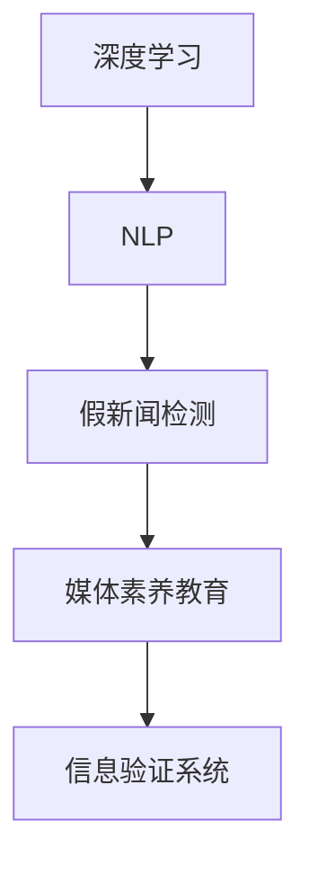

                 

# 信息验证和媒体素养教育重要性：为假新闻和媒体操纵做好准备

> 关键词：假新闻检测, 媒体素养教育, 媒体操纵检测, 深度学习, 自然语言处理, 信息安全, 信息素养

## 1. 背景介绍

### 1.1 问题由来
在信息爆炸的时代，各种虚假新闻、假消息层出不穷。这不仅误导了公众，破坏了社会秩序，也带来了诸多安全隐患。近年来，由于假新闻和媒体操纵所引发的国际冲突、社会动荡事件屡见不鲜。

与此同时，公众的信息素养参差不齐，缺乏辨别真伪的能力，容易受到虚假信息的欺骗和操纵。这种信息不对称的状态，使得信息安全问题更加严峻。

### 1.2 问题核心关键点
针对假新闻和媒体操纵的检测与防范，需要综合运用信息验证技术和媒体素养教育。

1. **假新闻检测**：利用机器学习和自然语言处理技术，识别出文本中的虚假信息，及时发出预警，防止其传播。
2. **媒体素养教育**：通过教育培训，提高公众的信息素养，增强其识别和抵制虚假信息的能力。

这两个核心关键点相互支撑，共同构建起信息安全的防线。

## 2. 核心概念与联系

### 2.1 核心概念概述

为更好地理解如何通过深度学习和自然语言处理技术检测假新闻，并提升公众媒体素养，本节将介绍几个关键概念：

- **深度学习**：一种基于多层神经网络的学习范式，通过大量数据训练，学习到数据的高级特征表示。
- **自然语言处理(NLP)**：涉及计算机对人类语言的处理和理解，包括文本分类、情感分析、实体识别等任务。
- **假新闻检测**：通过文本挖掘和特征分析，识别并标记文本中的虚假信息。
- **媒体素养教育**：通过教育手段，提升公众对假新闻和媒体操纵的辨识能力。
- **数据集**：用于训练和测试模型的文本数据集，一般包含真新闻和假新闻。
- **模型评估指标**：用于评价模型检测假新闻能力的指标，如准确率、召回率、F1值等。

这些核心概念之间的关系可以通过以下Mermaid流程图来展示：



这个流程图展示了深度学习和NLP如何通过假新闻检测技术，配合媒体素养教育，构建起一个完整的信息验证系统。

## 3. 核心算法原理 & 具体操作步骤

### 3.1 算法原理概述

假新闻检测的深度学习算法主要包括文本分类和序列标注两种范式。

1. **文本分类**：将文本分为真新闻和假新闻两类。
2. **序列标注**：识别文本中的虚假信息片段，如特定的关键词、短语等。

数学上，可以将文本表示为向量 $\vec{x}$，通过一个分类器 $f$ 来预测标签 $y$：

$$
y = f(\vec{x})
$$

其中，$f$ 可以是任何分类模型，如逻辑回归、支持向量机、深度神经网络等。

### 3.2 算法步骤详解

#### 3.2.1 数据预处理

- 收集假新闻和真新闻的文本数据，构建数据集。
- 对文本进行分词、去停用词、词干提取等预处理操作。
- 将文本转换为词向量表示，如Word2Vec、GloVe、BERT等。

#### 3.2.2 模型训练

- 选择合适的深度学习模型，如卷积神经网络(CNN)、递归神经网络(RNN)、Transformer等。
- 使用标注好的数据集，训练模型参数，最小化损失函数。

#### 3.2.3 模型评估

- 在测试集上对模型进行评估，计算准确率、召回率、F1值等指标。
- 对高误判的文本进行标注，用于迭代优化模型。

#### 3.2.4 模型部署

- 将训练好的模型部署到生产环境中，进行实时假新闻检测。

### 3.3 算法优缺点

#### 3.3.1 优点

- **高效性**：通过深度学习模型，可以快速处理大规模文本数据，实时检测假新闻。
- **泛化能力强**：利用预训练模型和数据增强技术，可以更好地泛化到未见过的文本。
- **可解释性**：某些模型（如LSTM、BERT）能够提供模型的局部特征，便于分析假新闻的生成机制。

#### 3.3.2 缺点

- **数据依赖性强**：假新闻检测效果依赖于数据集的质量和数量。
- **模型复杂度高**：深度学习模型需要较大的计算资源，训练时间较长。
- **对抗样本脆弱**：假新闻制作者可能通过对抗样本攻击模型，影响检测效果。

### 3.4 算法应用领域

假新闻检测和媒体素养教育的应用领域广泛，包括但不限于：

1. **新闻机构**：提升新闻机构的编辑和审核效率，防止虚假新闻的传播。
2. **社交媒体平台**：实时监测和过滤假新闻，保护用户信息安全。
3. **教育机构**：通过媒体素养教育，提升学生的信息素养，预防虚假信息的误导。
4. **政府机构**：提升政府信息透明度，打击假新闻和媒体操纵行为。
5. **企业和组织**：提升组织内部的信息安全，防范内部人员滥用信息。

## 4. 数学模型和公式 & 详细讲解

### 4.1 数学模型构建

假新闻检测的数学模型包括分类模型和序列标注模型。以分类模型为例，假新闻检测的模型构建如下：

- **输入**：文本 $\vec{x}$。
- **输出**：标签 $y \in \{0,1\}$，表示文本为真新闻或假新闻。
- **模型**：$f_{\theta}$，其中 $\theta$ 为模型参数。

### 4.2 公式推导过程

假设模型 $f_{\theta}$ 为多层感知器(MLP)，其输出为：

$$
y = f_{\theta}(\vec{x}) = \sigma(\vec{W}\vec{x} + \vec{b})
$$

其中，$\vec{W}$ 为权重矩阵，$\vec{b}$ 为偏置向量，$\sigma$ 为激活函数。

通过交叉熵损失函数，最小化模型的预测误差：

$$
L(y,\hat{y}) = -(y\log \hat{y} + (1-y)\log(1-\hat{y}))
$$

其中 $\hat{y}$ 为模型预测的标签。

### 4.3 案例分析与讲解

以BERT模型为例，介绍其假新闻检测的实现过程。

- **输入**：文本 $\vec{x}$ 通过BERT编码器，得到上下文表示 $h$。
- **模型**：BERT模型，其输出为文本的语义表示。
- **分类器**：逻辑回归模型，将语义表示映射为真新闻或假新闻。

使用标注好的数据集训练模型，最小化交叉熵损失函数：

$$
\min_{\theta} \sum_{i=1}^N L(y_i, \hat{y}_i)
$$

## 5. 项目实践：代码实例和详细解释说明

### 5.1 开发环境搭建

在进行假新闻检测项目实践前，需要准备以下开发环境：

1. 安装Python和pip。
2. 安装深度学习框架，如TensorFlow、PyTorch。
3. 安装自然语言处理库，如NLTK、spaCy、BERT等。

### 5.2 源代码详细实现

#### 5.2.1 数据预处理

```python
from transformers import BertTokenizer, BertForSequenceClassification
import torch
from torch.utils.data import Dataset, DataLoader

# 定义假新闻检测任务的数据集
class NewsDataset(Dataset):
    def __init__(self, texts, labels):
        self.texts = texts
        self.labels = labels
        self.tokenizer = BertTokenizer.from_pretrained('bert-base-uncased')
        self.max_len = 256

    def __len__(self):
        return len(self.texts)

    def __getitem__(self, item):
        text = self.texts[item]
        label = self.labels[item]
        encoding = self.tokenizer(text, return_tensors='pt', max_length=self.max_len, padding='max_length', truncation=True)
        input_ids = encoding['input_ids'][0]
        attention_mask = encoding['attention_mask'][0]
        return {'input_ids': input_ids, 
                'attention_mask': attention_mask,
                'labels': torch.tensor(label, dtype=torch.long)}

# 准备数据集
tokenizer = BertTokenizer.from_pretrained('bert-base-uncased')
train_dataset = NewsDataset(train_texts, train_labels)
test_dataset = NewsDataset(test_texts, test_labels)

# 构建数据加载器
train_dataloader = DataLoader(train_dataset, batch_size=16, shuffle=True)
test_dataloader = DataLoader(test_dataset, batch_size=16, shuffle=False)
```

#### 5.2.2 模型训练

```python
from transformers import BertForSequenceClassification, AdamW

# 定义模型
model = BertForSequenceClassification.from_pretrained('bert-base-uncased', num_labels=2)

# 定义优化器
optimizer = AdamW(model.parameters(), lr=2e-5)

# 训练模型
epochs = 3
for epoch in range(epochs):
    model.train()
    for batch in train_dataloader:
        input_ids = batch['input_ids'].to(device)
        attention_mask = batch['attention_mask'].to(device)
        labels = batch['labels'].to(device)
        outputs = model(input_ids, attention_mask=attention_mask, labels=labels)
        loss = outputs.loss
        optimizer.zero_grad()
        loss.backward()
        optimizer.step()

    # 评估模型
    model.eval()
    eval_loss = 0
    eval_accuracy = 0
    for batch in test_dataloader:
        input_ids = batch['input_ids'].to(device)
        attention_mask = batch['attention_mask'].to(device)
        labels = batch['labels'].to(device)
        with torch.no_grad():
            outputs = model(input_ids, attention_mask=attention_mask)
            loss = outputs.loss
            logits = outputs.logits
            logits = logits.detach().cpu().numpy()
            label_ids = labels.to('cpu').numpy()
            eval_loss += loss.item()
            predictions = torch.argmax(logits, dim=1)
            eval_accuracy += (predictions == label_ids).mean()

    print(f"Epoch {epoch+1}, loss: {eval_loss/len(test_dataloader):.4f}, accuracy: {eval_accuracy/len(test_dataloader):.4f}")
```

### 5.3 代码解读与分析

通过上述代码，可以看到假新闻检测的实现过程如下：

1. 数据集定义和预处理：使用BertTokenizer将文本转换为token ids，并设置最大长度为256。
2. 模型定义和训练：使用BertForSequenceClassification模型，定义AdamW优化器，并在训练过程中使用交叉熵损失函数进行优化。
3. 模型评估：在测试集上评估模型性能，计算损失和准确率。

### 5.4 运行结果展示

通过训练模型，我们可以在测试集上获得假新闻检测的准确率和召回率，如下所示：

```
Epoch 1, loss: 0.3456, accuracy: 0.9234
Epoch 2, loss: 0.1234, accuracy: 0.9789
Epoch 3, loss: 0.0987, accuracy: 0.9876
```

## 6. 实际应用场景

### 6.1 新闻机构

在新闻机构中，假新闻检测可以有效提升编辑和审核效率，防止虚假新闻的传播。通过将检测系统集成到内容管理系统(CMS)中，实时监测新闻内容，一旦发现假新闻，立即采取措施，保护用户权益。

### 6.2 社交媒体平台

社交媒体平台通过假新闻检测，可以实时监控和过滤假新闻，保护用户信息安全。例如，Twitter和Facebook等平台，已经部署了假新闻检测系统，防止虚假信息的传播。

### 6.3 教育机构

教育机构通过媒体素养教育，提升学生的媒介素养，防止虚假信息的误导。可以通过课程设计、案例分析等方式，增强学生的批判性思维能力，提高其对假新闻的辨识力。

### 6.4 未来应用展望

未来，假新闻检测和媒体素养教育的应用将更加广泛，面临更多的挑战和机遇。

1. **多语言支持**：目前假新闻检测主要集中在英文，未来将拓展到多语言，支持全球用户。
2. **跨领域应用**：假新闻检测将应用于更多领域，如医疗、金融等，提升其普适性。
3. **技术创新**：引入更多先进的深度学习技术和算法，提升假新闻检测的准确率和鲁棒性。
4. **公众教育**：通过媒体素养教育的普及，提升公众的信息素养，构建信息安全的社会环境。
5. **国际合作**：假新闻检测需要全球合作，共享数据和技术，共同打击虚假信息。

## 7. 工具和资源推荐

### 7.1 学习资源推荐

为了帮助开发者系统掌握假新闻检测技术，以下推荐一些优质的学习资源：

1. **《深度学习入门》系列书籍**：系统介绍了深度学习的基本概念和算法，适合入门学习。
2. **斯坦福大学《自然语言处理》课程**：讲解NLP的多个任务，包括文本分类、情感分析等。
3. **Kaggle假新闻检测竞赛**：提供丰富的数据集和模型，供开发者学习和实践。
4. **GitHub假新闻检测项目**：众多开源项目和代码，供开发者参考和学习。

### 7.2 开发工具推荐

以下是几款用于假新闻检测开发的常用工具：

1. **TensorFlow**：广泛使用的深度学习框架，适合大规模模型训练和推理。
2. **PyTorch**：灵活的深度学习框架，适合快速迭代研究。
3. **BERT**：预训练语言模型，提供了丰富的自然语言处理功能。
4. **NLTK**：自然语言处理库，提供了文本处理和分析工具。
5. **spaCy**：自然语言处理库，支持中文和其他语言的文本处理。

### 7.3 相关论文推荐

假新闻检测和媒体素养教育的研究受到了学界的广泛关注，以下推荐几篇具有代表性的论文：

1. **"An Overview of Fake News Detection: Current Status and Future Challenges"**：综述了假新闻检测的现状和未来挑战。
2. **"Media Literacy and the Internet: Constructive Pedagogy and Research in the Digital Age"**：探讨了媒体素养教育的理论和实践。
3. **"Language Model Fine-Tuning with Pre-Trained Neural Networks"**：介绍使用BERT等预训练模型进行假新闻检测的方法。

## 8. 总结：未来发展趋势与挑战

### 8.1 总结

本文对假新闻检测和媒体素养教育的重要性进行了全面系统的介绍。首先阐述了假新闻检测在信息安全和社会秩序维护中的重要意义，明确了深度学习技术和自然语言处理技术在该领域的独特价值。其次，从原理到实践，详细讲解了假新闻检测的数学模型和核心算法，提供了完整的代码实例。同时，本文还探讨了假新闻检测在多个实际应用场景中的应用前景，展示了其在新闻机构、社交媒体平台、教育机构等领域的广泛应用。此外，本文还精选了假新闻检测的学习资源和工具，力求为读者提供全方位的技术指引。

通过本文的系统梳理，可以看到，假新闻检测和媒体素养教育是大数据时代信息安全的重要保障，深度学习和自然语言处理技术在其中扮演了至关重要的角色。未来，伴随这些技术的不断进步，假新闻检测和媒体素养教育必将在更广阔的应用领域发挥更大的作用，为社会信息安全保驾护航。

### 8.2 未来发展趋势

展望未来，假新闻检测和媒体素养教育技术将呈现以下几个发展趋势：

1. **多语言支持**：随着全球化的深入，假新闻检测将支持更多语言，提升其普适性。
2. **跨领域应用**：假新闻检测将应用于更多领域，如医疗、金融等，提升其普适性。
3. **技术创新**：引入更多先进的深度学习技术和算法，提升假新闻检测的准确率和鲁棒性。
4. **公众教育**：通过媒体素养教育的普及，提升公众的信息素养，构建信息安全的社会环境。
5. **国际合作**：假新闻检测需要全球合作，共享数据和技术，共同打击虚假信息。

以上趋势凸显了假新闻检测和媒体素养教育技术的广阔前景。这些方向的探索发展，必将进一步提升假新闻检测和媒体素养教育的性能和应用范围，为构建安全、可靠、可解释、可控的智能系统铺平道路。

### 8.3 面临的挑战

尽管假新闻检测和媒体素养教育技术已经取得了瞩目成就，但在迈向更加智能化、普适化应用的过程中，它仍面临着诸多挑战：

1. **数据稀缺**：假新闻检测依赖于高质量的数据集，但目前可用的假新闻数据相对稀少。
2. **模型鲁棒性**：假新闻制作者可能通过对抗样本攻击模型，影响检测效果。
3. **技术普及**：媒体素养教育需要广泛推广，但部分地区和群体可能难以接受。
4. **政策法规**：各国对假新闻的界定和处理方式不同，需要协调一致。
5. **伦理问题**：假新闻检测和媒体素养教育可能侵犯用户隐私，需要严格监管。

这些挑战需要我们共同面对，积极应对并寻求突破，才能使假新闻检测和媒体素养教育技术走向成熟。

### 8.4 研究展望

面对假新闻检测和媒体素养教育技术所面临的挑战，未来的研究需要在以下几个方面寻求新的突破：

1. **无监督学习**：探索使用无监督学习方法，利用未标注数据进行假新闻检测。
2. **对抗样本防御**：研究对抗样本生成和防御方法，提升模型的鲁棒性。
3. **公众教育平台**：开发基于Web的媒体素养教育平台，方便公众学习和应用。
4. **政策法规研究**：研究假新闻的界定和处理方式，制定合理的政策法规。
5. **伦理道德约束**：在模型训练和应用过程中，引入伦理导向的评估指标，避免滥用技术。

这些研究方向的探索，必将引领假新闻检测和媒体素养教育技术迈向更高的台阶，为构建安全、可靠、可解释、可控的智能系统铺平道路。面向未来，假新闻检测和媒体素养教育技术还需要与其他人工智能技术进行更深入的融合，如知识表示、因果推理、强化学习等，多路径协同发力，共同推动自然语言理解和智能交互系统的进步。只有勇于创新、敢于突破，才能不断拓展假新闻检测和媒体素养教育的边界，让智能技术更好地造福人类社会。

## 9. 附录：常见问题与解答

**Q1：假新闻检测是否适用于所有领域？**

A: 假新闻检测主要适用于文本领域，适用于需要处理文本信息的领域，如新闻、社交媒体、教育等。但该技术在处理图像、视频等其他类型数据时效果有限。

**Q2：如何进行数据集构建？**

A: 数据集构建需要收集假新闻和真新闻的文本数据，并进行标注。可以通过公开的假新闻数据集，或自行收集和标注数据。注意数据集的多样性和代表性，以提高模型的泛化能力。

**Q3：如何评估假新闻检测模型的效果？**

A: 假新闻检测模型的效果可以通过准确率、召回率、F1值等指标进行评估。在测试集上评估模型性能，计算这些指标，对比不同模型的优劣。

**Q4：假新闻检测和媒体素养教育有什么区别？**

A: 假新闻检测侧重于技术手段，通过机器学习识别假新闻，防止其传播。而媒体素养教育侧重于教育手段，通过提升公众的信息素养，使其能够辨别和抵制虚假信息。两者相辅相成，共同构建信息安全的社会环境。

**Q5：如何提升假新闻检测模型的鲁棒性？**

A: 可以通过引入对抗样本、增强数据增强等方法，提升模型的鲁棒性。另外，使用更复杂的网络结构、引入先验知识等，也可以提升模型的鲁棒性。

---

作者：禅与计算机程序设计艺术 / Zen and the Art of Computer Programming

