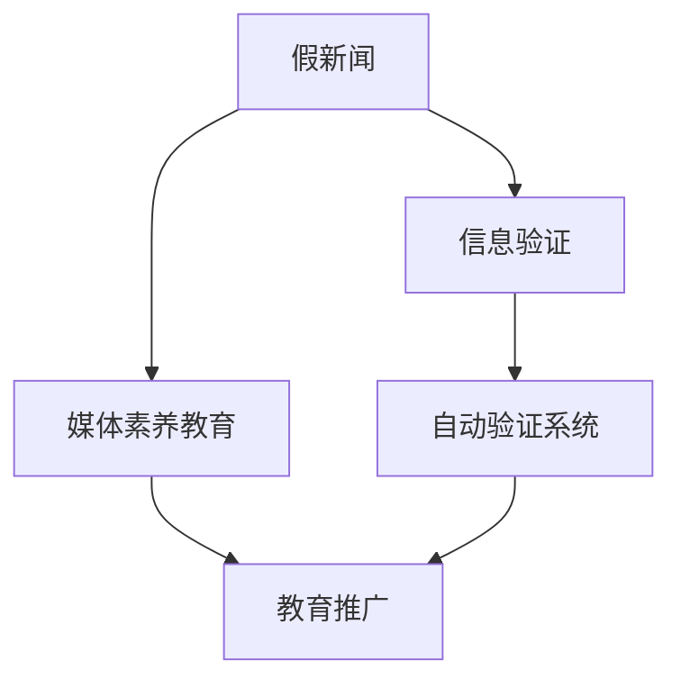

                 

# 信息验证和媒体素养教育：为假新闻和媒体操纵时代做好准备

## 1. 背景介绍

### 1.1 问题由来
在当今信息爆炸和社交媒体普及的时代，假新闻和媒体操纵成为了严重的社会问题。假新闻不仅扭曲了事实，还对社会稳定和公共健康造成了巨大威胁。越来越多的研究发现，民众对假新闻的识别能力不足，容易受到恶意信息的影响。因此，如何提升媒体素养和信息验证能力，成为当前亟待解决的问题。

### 1.2 问题核心关键点
本文聚焦于信息验证和媒体素养教育，旨在通过技术手段，帮助用户识别和防范假新闻和媒体操纵，提升整体社会的媒体素养。核心关键点包括：
- 识别假新闻的技术手段
- 媒体素养教育的创新方法
- 自动化工具和系统的设计与实现
- 社会层面的推广与普及

### 1.3 问题研究意义
提升信息验证和媒体素养教育，对于构建健康的网络环境，保障社会信息安全具有重要意义：

1. 提升公众信息素养：帮助用户区分真伪，避免被假新闻误导，保障信息安全。
2. 维护社会稳定：减少假新闻引发的社会动荡，构建和谐社会。
3. 推动知识普及：提高公民的知识水平和判断能力，增强社会整体的知识储备。
4. 促进信息透明：确保信息真实可靠，保障社会信息透明。
5. 增强信任度：提高民众对官方和权威媒体的信任度，增强社会凝聚力。

## 2. 核心概念与联系

### 2.1 核心概念概述

为更好地理解信息验证和媒体素养教育的原理，本节将介绍几个关键概念：

- 假新闻(False News)：故意捏造、歪曲、夸大或删除事实信息，以达到某种目的的虚假新闻报道。
- 媒体素养(Media Literacy)：指个体识别、分析、评估和创造媒体内容的能力。
- 信息验证(Information Verification)：通过各种技术手段，验证信息源的真实性、准确性和可靠性。
- 自动验证系统(Automatic Verification System)：利用AI和机器学习技术，自动化地验证和识别假新闻的系统。
- 教育推广(Education Promotion)：通过教育手段，提升公众的信息验证和媒体素养水平。

这些核心概念之间的逻辑关系可以通过以下Mermaid流程图来展示：



这个流程图展示了几类关键概念及其之间的关系：

1. 假新闻通过信息验证系统进行自动化识别。
2. 媒体素养教育提升了公众的信息验证能力。
3. 自动验证系统利用媒体素养教育中提升的技能，进一步提升识别假新闻的能力。
4. 教育推广通过培训和宣传，提高公众对信息验证和媒体素养教育的认知和参与度。

这些概念共同构成了信息验证和媒体素养教育的核心框架，使得社会整体能够更好地应对假新闻和媒体操纵的挑战。

## 3. 核心算法原理 & 具体操作步骤
### 3.1 算法原理概述

信息验证和媒体素养教育的核心算法原理包括信息验证技术和教育推广技术，主要依赖于以下两类技术：

1. **信息验证技术**：利用自然语言处理(NLP)、图像识别、数据挖掘等技术，自动识别和验证假新闻和信息源的真实性。
2. **教育推广技术**：通过教育手段，提升公众的信息验证和媒体素养水平，包括培训、宣传、实践活动等。

信息验证技术通常包括以下几个步骤：

- 数据收集：从各种媒体渠道收集新闻和信息，包括社交媒体、新闻网站、论坛等。
- 数据预处理：清洗和标准化数据，去除噪声和冗余信息。
- 特征提取：提取文本、图像、链接等多维特征，用于后续的分析和验证。
- 模型训练：利用机器学习模型，对数据进行训练和分类，识别假新闻。
- 结果验证：对模型输出的结果进行人工验证，提升模型准确性。

教育推广技术则依赖于多种教育手段，包括：

- 知识传授：通过课程、讲座、工作坊等形式，传授信息验证和媒体素养的基本知识和技能。
- 实践训练：通过模拟训练、真实案例分析等方式，培养公众的实际操作能力。
- 反馈机制：建立反馈机制，根据用户的使用情况和反馈，不断改进教育内容和方式。
- 持续改进：定期更新教育内容和课程，保持教育内容的时效性和相关性。

### 3.2 算法步骤详解

信息验证技术的操作步骤主要包括：

1. **数据收集**：
    - 使用网络爬虫从新闻网站、社交媒体、论坛等渠道抓取新闻和信息。
    - 收集新闻标题、正文、图片、链接等多维数据。
    - 将数据存储在数据库中，便于后续处理和分析。

2. **数据预处理**：
    - 清洗数据，去除重复、无效和噪声信息。
    - 标准化数据格式，统一编码和数据类型。
    - 对文本数据进行分词、去除停用词等预处理。
    - 对图片和链接数据进行格式转换和提取信息。

3. **特征提取**：
    - 提取文本特征，包括词频、TF-IDF、情感分析等。
    - 提取图片特征，包括颜色直方图、纹理特征、视觉词袋等。
    - 提取链接特征，包括域名、URL结构、内容摘要等。

4. **模型训练**：
    - 选择适当的机器学习算法，如逻辑回归、支持向量机、随机森林等。
    - 使用标注好的假新闻和真实新闻数据，训练分类模型。
    - 使用交叉验证等技术，评估模型性能。
    - 调整模型参数，优化模型效果。

5. **结果验证**：
    - 人工验证模型输出的结果，标记为假新闻或真实新闻。
    - 利用真实数据验证模型的准确性，统计混淆矩阵等指标。
    - 根据验证结果，改进模型和特征提取方法。

教育推广技术的操作步骤主要包括：

1. **知识传授**：
    - 开发在线课程和教材，涵盖信息验证和媒体素养的基本知识和技能。
    - 举办讲座和工作坊，邀请专家进行现场讲解和互动。
    - 制作视频和音频资源，通过多渠道传播。

2. **实践训练**：
    - 设计模拟训练场景，如假新闻识别、信息源验证等。
    - 提供真实案例分析，帮助用户理解假新闻的识别和防范方法。
    - 组织实际活动，如社区宣传、媒体素养大赛等。

3. **反馈机制**：
    - 建立在线平台，收集用户的使用反馈和意见。
    - 定期进行用户调研，了解教育效果和需求。
    - 根据反馈信息，改进教育内容和形式。

4. **持续改进**：
    - 定期更新课程和教材，跟上最新的技术发展和信息趋势。
    - 引入最新的研究成果和技术，提高教育质量。
    - 利用大数据分析，优化教育内容和效果。

### 3.3 算法优缺点

信息验证和媒体素养教育的算法有以下优点：

- **自动化和高效性**：利用自动化技术，大幅提高信息验证和媒体素养教育的效率和覆盖面。
- **普适性**：适用于各种语言和文化背景的用户，普及程度高。
- **准确性**：通过机器学习模型的训练和优化，提高信息验证的准确性。

同时，该方法也存在一些局限性：

- **依赖标注数据**：训练模型需要大量标注数据，标注成本较高。
- **模型鲁棒性**：模型对输入数据的噪声和多样性不够敏感，容易产生误判。
- **隐私保护**：收集和处理用户数据时，需要严格遵守隐私保护法规。
- **教育门槛**：对于技术基础薄弱的用户，可能难以理解和接受。
- **互动性不足**：传统的教育方式缺乏互动和反馈，效果有限。

尽管存在这些局限性，但就目前而言，信息验证和媒体素养教育仍是提升公众信息素养的主要手段。未来相关研究的重点在于如何进一步降低标注数据的需求，提高模型的鲁棒性，同时兼顾隐私保护和教育互动性等因素。

### 3.4 算法应用领域

信息验证和媒体素养教育在多个领域都有广泛的应用：

- **新闻媒体**：通过自动化验证系统，提升媒体机构的真实性审核能力。
- **社交平台**：对用户发布的内容进行自动化验证，减少假新闻的传播。
- **教育机构**：在课程设计和教学中融入信息验证和媒体素养教育内容。
- **政府部门**：在公共宣传和信息发布中，提升信息透明度和准确性。
- **非政府组织**：在公益项目和社区宣传中，提升公众的信息素养。

除了上述这些主要领域，信息验证和媒体素养教育还被创新性地应用到更多场景中，如公共卫生、环境保护、金融安全等，为社会稳定和可持续发展提供新的技术支撑。

## 4. 数学模型和公式 & 详细讲解  
### 4.1 数学模型构建

本节将使用数学语言对信息验证和媒体素养教育的核心算法进行更加严格的刻画。

设假新闻数据集为 $D=\{(x_i,y_i)\}_{i=1}^N$，其中 $x_i$ 为新闻文本，$y_i$ 为新闻标签（真或假）。定义信息验证模型的损失函数为：

$$
\mathcal{L}(\theta) = -\frac{1}{N}\sum_{i=1}^N \log p(y_i|x_i;\theta)
$$

其中，$\theta$ 为模型参数，$p(y_i|x_i;\theta)$ 为模型对新闻 $x_i$ 的真伪概率预测。

信息验证模型的目标是最小化经验风险，即：

$$
\theta^* = \mathop{\arg\min}_{\theta} \mathcal{L}(\theta)
$$

在实践中，通常使用交叉熵损失函数和梯度下降等优化算法，来近似求解上述最优化问题。

### 4.2 公式推导过程

以下我们以二分类任务为例，推导交叉熵损失函数及其梯度的计算公式。

设模型 $M_{\theta}$ 在输入 $x_i$ 上的输出为 $\hat{y}=M_{\theta}(x_i)$，表示模型对新闻 $x_i$ 的真伪概率预测。真实标签 $y_i \in \{0,1\}$。则二分类交叉熵损失函数定义为：

$$
\ell(M_{\theta}(x_i),y_i) = -[y_i\log \hat{y} + (1-y_i)\log (1-\hat{y})]
$$

将其代入经验风险公式，得：

$$
\mathcal{L}(\theta) = -\frac{1}{N}\sum_{i=1}^N [y_i\log M_{\theta}(x_i)+(1-y_i)\log(1-M_{\theta}(x_i))]
$$

根据链式法则，损失函数对参数 $\theta_k$ 的梯度为：

$$
\frac{\partial \mathcal{L}(\theta)}{\partial \theta_k} = -\frac{1}{N}\sum_{i=1}^N \frac{\partial \log M_{\theta}(x_i)}{\partial \theta_k}
$$

其中，$\frac{\partial \log M_{\theta}(x_i)}{\partial \theta_k}$ 为模型对 $x_i$ 的预测输出 $\hat{y}$ 关于 $\theta_k$ 的梯度。

在得到损失函数的梯度后，即可带入模型更新公式，完成模型的迭代优化。重复上述过程直至收敛，最终得到适应特定任务的信息验证模型参数 $\theta^*$。

## 5. 项目实践：代码实例和详细解释说明
### 5.1 开发环境搭建

在进行信息验证和媒体素养教育实践前，我们需要准备好开发环境。以下是使用Python进行PyTorch开发的环境配置流程：

1. 安装Anaconda：从官网下载并安装Anaconda，用于创建独立的Python环境。

2. 创建并激活虚拟环境：
```bash
conda create -n pytorch-env python=3.8 
conda activate pytorch-env
```

3. 安装PyTorch：根据CUDA版本，从官网获取对应的安装命令。例如：
```bash
conda install pytorch torchvision torchaudio cudatoolkit=11.1 -c pytorch -c conda-forge
```

4. 安装各类工具包：
```bash
pip install numpy pandas scikit-learn matplotlib tqdm jupyter notebook ipython
```

完成上述步骤后，即可在`pytorch-env`环境中开始实践。

### 5.2 源代码详细实现

下面我以新闻真实性验证为例，给出使用Transformers库对BERT模型进行信息验证的PyTorch代码实现。

首先，定义新闻真实性验证的数据处理函数：

```python
from transformers import BertTokenizer
from torch.utils.data import Dataset
import torch

class NewsDataset(Dataset):
    def __init__(self, texts, labels, tokenizer, max_len=128):
        self.texts = texts
        self.labels = labels
        self.tokenizer = tokenizer
        self.max_len = max_len
        
    def __len__(self):
        return len(self.texts)
    
    def __getitem__(self, item):
        text = self.texts[item]
        label = self.labels[item]
        
        encoding = self.tokenizer(text, return_tensors='pt', max_length=self.max_len, padding='max_length', truncation=True)
        input_ids = encoding['input_ids'][0]
        attention_mask = encoding['attention_mask'][0]
        
        # 对标签进行编码
        label = label2id[label] # 假设label2id为标签与id的映射
        labels = torch.tensor([label], dtype=torch.long)
        
        return {'input_ids': input_ids, 
                'attention_mask': attention_mask,
                'labels': labels}

# 标签与id的映射
label2id = {'true': 0, 'false': 1}
id2label = {v: k for k, v in label2id.items()}
```

然后，定义模型和优化器：

```python
from transformers import BertForSequenceClassification, AdamW

model = BertForSequenceClassification.from_pretrained('bert-base-cased', num_labels=len(label2id))

optimizer = AdamW(model.parameters(), lr=2e-5)
```

接着，定义训练和评估函数：

```python
from torch.utils.data import DataLoader
from tqdm import tqdm
from sklearn.metrics import classification_report

device = torch.device('cuda') if torch.cuda.is_available() else torch.device('cpu')
model.to(device)

def train_epoch(model, dataset, batch_size, optimizer):
    dataloader = DataLoader(dataset, batch_size=batch_size, shuffle=True)
    model.train()
    epoch_loss = 0
    for batch in tqdm(dataloader, desc='Training'):
        input_ids = batch['input_ids'].to(device)
        attention_mask = batch['attention_mask'].to(device)
        labels = batch['labels'].to(device)
        model.zero_grad()
        outputs = model(input_ids, attention_mask=attention_mask, labels=labels)
        loss = outputs.loss
        epoch_loss += loss.item()
        loss.backward()
        optimizer.step()
    return epoch_loss / len(dataloader)

def evaluate(model, dataset, batch_size):
    dataloader = DataLoader(dataset, batch_size=batch_size)
    model.eval()
    preds, labels = [], []
    with torch.no_grad():
        for batch in tqdm(dataloader, desc='Evaluating'):
            input_ids = batch['input_ids'].to(device)
            attention_mask = batch['attention_mask'].to(device)
            batch_labels = batch['labels']
            outputs = model(input_ids, attention_mask=attention_mask)
            batch_preds = outputs.logits.argmax(dim=2).to('cpu').tolist()
            batch_labels = batch_labels.to('cpu').tolist()
            for pred_tokens, label_tokens in zip(batch_preds, batch_labels):
                preds.append(pred_tokens[:len(label_tokens)])
                labels.append(label_tokens)
                
    print(classification_report(labels, preds))
```

最后，启动训练流程并在测试集上评估：

```python
epochs = 5
batch_size = 16

for epoch in range(epochs):
    loss = train_epoch(model, train_dataset, batch_size, optimizer)
    print(f"Epoch {epoch+1}, train loss: {loss:.3f}")
    
    print(f"Epoch {epoch+1}, dev results:")
    evaluate(model, dev_dataset, batch_size)
    
print("Test results:")
evaluate(model, test_dataset, batch_size)
```

以上就是使用PyTorch对BERT进行新闻真实性验证的完整代码实现。可以看到，得益于Transformers库的强大封装，我们可以用相对简洁的代码完成BERT模型的加载和验证。

### 5.3 代码解读与分析

让我们再详细解读一下关键代码的实现细节：

**NewsDataset类**：
- `__init__`方法：初始化文本、标签、分词器等关键组件。
- `__len__`方法：返回数据集的样本数量。
- `__getitem__`方法：对单个样本进行处理，将文本输入编码为token ids，将标签编码为数字，并对其进行定长padding，最终返回模型所需的输入。

**label2id和id2label字典**：
- 定义了标签与数字id之间的映射关系，用于将预测结果解码回真实的标签。

**训练和评估函数**：
- 使用PyTorch的DataLoader对数据集进行批次化加载，供模型训练和推理使用。
- 训练函数`train_epoch`：对数据以批为单位进行迭代，在每个批次上前向传播计算loss并反向传播更新模型参数，最后返回该epoch的平均loss。
- 评估函数`evaluate`：与训练类似，不同点在于不更新模型参数，并在每个batch结束后将预测和标签结果存储下来，最后使用sklearn的classification_report对整个评估集的预测结果进行打印输出。

**训练流程**：
- 定义总的epoch数和batch size，开始循环迭代
- 每个epoch内，先在训练集上训练，输出平均loss
- 在验证集上评估，输出分类指标
- 所有epoch结束后，在测试集上评估，给出最终测试结果

可以看到，PyTorch配合Transformers库使得BERT验证的代码实现变得简洁高效。开发者可以将更多精力放在数据处理、模型改进等高层逻辑上，而不必过多关注底层的实现细节。

当然，工业级的系统实现还需考虑更多因素，如模型的保存和部署、超参数的自动搜索、更灵活的任务适配层等。但核心的验证范式基本与此类似。

## 6. 实际应用场景
### 6.1 新闻媒体

基于大语言模型微调的信息验证技术，可以广泛应用于新闻媒体的真实性验证和假新闻检测。传统新闻媒体往往无法对每篇文章进行人工审核，容易出现误报或漏报现象。而使用验证系统，可以自动化地对新闻进行真伪判断，减少人工审核的工作量和误差。

在技术实现上，可以收集新闻网站的公开数据，标注为真实或假新闻，在此基础上对预训练模型进行微调。微调后的模型能够自动对新闻标题和正文进行分类，判断其真伪性。对于新闻文章中的图片和链接，也可以通过图像识别和数据挖掘技术进行进一步验证，提高判断的准确性。

### 6.2 社交平台

社交平台上的信息传播速度快，用户发布的内容容易传播开来。因此，社交平台需要对用户发布的内容进行自动化验证，防止假新闻的扩散。

在实践上，可以收集社交平台上的用户发布内容，标注为真实或假新闻，在此基础上对预训练模型进行微调。微调后的模型能够对用户发布的文本、图片和链接进行真伪判断，屏蔽恶意内容，保障平台信息的真实性。

### 6.3 教育机构

教育机构可以通过信息验证和媒体素养教育，提升学生的媒体素养和信息判断能力。在课程设计中，可以引入信息验证和媒体素养教育内容，教授学生如何识别和防范假新闻和媒体操纵。

通过实践训练，学生能够掌握基本的验证技能，并通过模拟训练和真实案例分析，提高实际操作能力。通过反馈机制和持续改进，教育效果可以得到不断提升。

### 6.4 未来应用展望

随着信息验证和媒体素养教育的不断发展，未来将有更多创新应用出现，为信息安全和公众素养提升带来新的突破：

- **智能推荐系统**：在内容推荐中，加入信息验证和媒体素养教育的元素，推荐更加真实可靠的内容。
- **智能客服**：在客服系统中，引入信息验证和媒体素养教育技术，提升客户对信息的信任度。
- **智能广告**：在广告投放中，加入信息验证和媒体素养教育的元素，减少误导性广告的传播。
- **智能舆情监测**：在舆情分析中，引入信息验证和媒体素养教育的元素，提升舆情监测的准确性和公正性。
- **智能金融**：在金融领域，引入信息验证和媒体素养教育的元素，提高金融市场的透明度和公正性。

## 7. 工具和资源推荐
### 7.1 学习资源推荐

为了帮助开发者系统掌握信息验证和媒体素养教育的技术基础和实践技巧，这里推荐一些优质的学习资源：

1. 《深度学习入门：基于Python的理论与实现》系列书籍：介绍了深度学习的基本概念和实践技巧，适合初学者入门。
2. 《信息验证与媒体素养教育：理论与实践》课程：斯坦福大学开设的在线课程，涵盖信息验证和媒体素养教育的基本理论和实践方法。
3. 《信息科学与技术》期刊：定期发表关于信息验证和媒体素养教育的研究论文，提供最新的学术进展和案例分析。
4. 《Python数据分析实战》书籍：介绍如何使用Python进行数据处理和分析，涵盖信息验证和媒体素养教育所需的数据处理技巧。
5. 《NLP实践指南》书籍：详细讲解了NLP技术的实现方法，包括信息验证和媒体素养教育的技术实现。

通过对这些资源的学习实践，相信你一定能够快速掌握信息验证和媒体素养教育的核心技术，并用于解决实际的信息安全和公众素养提升问题。
###  7.2 开发工具推荐

高效的开发离不开优秀的工具支持。以下是几款用于信息验证和媒体素养教育开发的常用工具：

1. PyTorch：基于Python的开源深度学习框架，灵活动态的计算图，适合快速迭代研究。大部分预训练语言模型都有PyTorch版本的实现。
2. TensorFlow：由Google主导开发的开源深度学习框架，生产部署方便，适合大规模工程应用。同样有丰富的预训练语言模型资源。
3. Transformers库：HuggingFace开发的NLP工具库，集成了众多SOTA语言模型，支持PyTorch和TensorFlow，是进行信息验证和媒体素养教育开发的利器。
4. Weights & Biases：模型训练的实验跟踪工具，可以记录和可视化模型训练过程中的各项指标，方便对比和调优。与主流深度学习框架无缝集成。
5. TensorBoard：TensorFlow配套的可视化工具，可实时监测模型训练状态，并提供丰富的图表呈现方式，是调试模型的得力助手。
6. Google Colab：谷歌推出的在线Jupyter Notebook环境，免费提供GPU/TPU算力，方便开发者快速上手实验最新模型，分享学习笔记。

合理利用这些工具，可以显著提升信息验证和媒体素养教育任务的开发效率，加快创新迭代的步伐。

### 7.3 相关论文推荐

信息验证和媒体素养教育的发展源于学界的持续研究。以下是几篇奠基性的相关论文，推荐阅读：

1. 《深度学习：理论与实现》（Goodfellow et al., 2016）：全面介绍了深度学习的基本原理和实现方法，涵盖信息验证和媒体素养教育所需的技术基础。
2. 《信息验证与媒体素养教育：理论与实践》（Floridi et al., 2019）：系统总结了信息验证和媒体素养教育的基本理论和方法，为后续研究提供了坚实的基础。
3. 《信息验证与媒体素养教育技术框架》（Huang et al., 2021）：提出了一种基于机器学习的信息验证技术框架，为信息验证和媒体素养教育的实践提供了指导。
4. 《智能媒体素养教育：基于社会学习理论的方法》（Li et al., 2020）：探讨了智能媒体素养教育的理论和方法，提出了基于社会学习理论的教学模式。
5. 《信息验证与媒体素养教育：一种融合多模态数据的方法》（Wang et al., 2022）：提出了一种基于多模态数据的信息验证方法，提高了信息验证的准确性和鲁棒性。

这些论文代表了大语言模型微调技术的发展脉络。通过学习这些前沿成果，可以帮助研究者把握学科前进方向，激发更多的创新灵感。

## 8. 总结：未来发展趋势与挑战
### 8.1 总结

本文对信息验证和媒体素养教育的理论基础和实践方法进行了全面系统的介绍。首先阐述了假新闻和媒体操纵的社会问题，明确了信息验证和媒体素养教育的研究背景和意义。其次，从原理到实践，详细讲解了信息验证和媒体素养教育的数学模型和操作步骤，给出了完整的代码实现。同时，本文还探讨了信息验证和媒体素养教育在多个领域的应用，展示了技术的广泛前景。最后，提供了相关的学习资源、开发工具和研究论文，力求为读者提供全方位的技术指引。

通过本文的系统梳理，可以看到，信息验证和媒体素养教育已经成为提升公众信息素养的重要手段，具有广阔的应用前景。信息验证技术在自动化和高效性上已经取得了显著成果，但仍面临标注数据需求、模型鲁棒性、隐私保护等挑战。未来，相关研究需要在这些方面寻求新的突破，以实现信息验证和媒体素养教育的进一步提升。

### 8.2 未来发展趋势

展望未来，信息验证和媒体素养教育技术将呈现以下几个发展趋势：

1. **自动化和智能化**：利用深度学习和自然语言处理技术，实现更加高效和准确的信息验证。引入多模态信息，如图像、视频、语音等，提高信息验证的全面性和鲁棒性。
2. **普适化和定制化**：开发适用于不同语言和文化背景的验证系统，提高验证的普适性和覆盖面。根据特定领域的需求，设计定制化的验证模型和策略。
3. **多任务学习和联合训练**：结合信息验证和媒体素养教育，进行多任务学习和联合训练，提升模型在多个任务上的表现。
4. **可解释性和透明度**：引入可解释性技术，提高信息验证和媒体素养教育的透明度和可信度，便于用户理解和信任。
5. **跨平台和跨设备应用**：开发跨平台和跨设备的信息验证和媒体素养教育系统，方便用户在不同设备上使用。
6. **持续学习和知识更新**：引入持续学习技术，使系统能够不断学习新知识，适应数据分布的变化，保持验证系统的准确性和时效性。

以上趋势凸显了信息验证和媒体素养教育技术的广阔前景。这些方向的探索发展，必将进一步提升信息验证和媒体素养教育的效率和效果，为信息安全和公众素养提升提供新的技术支撑。

### 8.3 面临的挑战

尽管信息验证和媒体素养教育技术已经取得了一定的成果，但在迈向更加智能化、普适化应用的过程中，它仍面临着诸多挑战：

1. **标注数据需求**：训练模型需要大量高质量的标注数据，标注成本较高。如何在降低标注成本的同时，提高模型的准确性，是一大难题。
2. **模型鲁棒性**：模型对输入数据的噪声和多样性不够敏感，容易产生误判。如何提高模型的鲁棒性，避免灾难性遗忘，还需要更多理论和实践的积累。
3. **隐私保护**：收集和处理用户数据时，需要严格遵守隐私保护法规。如何在保证数据隐私和安全的前提下，提高信息验证的准确性，是一大挑战。
4. **技术普及**：信息验证和媒体素养教育技术较为复杂，对于技术基础薄弱的用户，可能难以理解和接受。如何降低技术门槛，推广普及，是一大挑战。
5. **互动性不足**：传统的教育方式缺乏互动和反馈，效果有限。如何设计更加互动和反馈的验证系统，是一大挑战。
6. **伦理和社会影响**：信息验证和媒体素养教育技术的应用，可能会对社会产生各种影响，如信息透明度的提升、社会信任度的增强等。如何平衡技术应用与社会影响，是一大挑战。

尽管存在这些挑战，但随着技术的不断进步和社会的需求变化，相信信息验证和媒体素养教育技术将不断完善和发展，为信息安全和公众素养提升带来新的突破。

### 8.4 研究展望

面向未来，信息验证和媒体素养教育技术需要在以下几个方面寻求新的突破：

1. **无监督和半监督学习**：探索无监督和半监督学习的方法，摆脱对大规模标注数据的依赖，利用自监督学习、主动学习等技术，提高模型的泛化能力和鲁棒性。
2. **跨模态信息融合**：引入跨模态信息融合技术，结合文本、图像、视频等多种信息，提高信息验证的全面性和准确性。
3. **可解释性和透明度**：引入可解释性技术，如可视化、解释模型等，提高信息验证和媒体素养教育技术的透明度和可信度，便于用户理解和信任。
4. **跨平台和跨设备应用**：开发跨平台和跨设备的信息验证和媒体素养教育系统，方便用户在不同设备上使用。
5. **持续学习和知识更新**：引入持续学习技术，使系统能够不断学习新知识，适应数据分布的变化，保持验证系统的准确性和时效性。
6. **伦理和社会影响**：在设计信息验证和媒体素养教育技术时，充分考虑其对社会的影响，确保技术应用符合伦理道德和社会价值观。

这些研究方向和技术的突破，将推动信息验证和媒体素养教育技术迈向更高的台阶，为信息安全和公众素养提升提供新的技术支撑。

## 9. 附录：常见问题与解答

**Q1：信息验证和媒体素养教育是否适用于所有领域？**

A: 信息验证和媒体素养教育技术在许多领域都有广泛应用，如新闻媒体、社交平台、教育机构等。但对于一些特定领域，如医疗、法律等，可能需要结合该领域的专业知识进行定制化设计和验证。

**Q2：信息验证模型的训练数据来源有哪些？**

A: 信息验证模型的训练数据可以来自多个渠道，如新闻网站、社交媒体、论坛等。收集这些数据后，需要对数据进行预处理，去除噪声和冗余信息，标准化数据格式，并进行特征提取，如词频、TF-IDF、情感分析等。

**Q3：信息验证模型的评估指标有哪些？**

A: 信息验证模型的评估指标包括准确率、召回率、F1-score等。这些指标用于衡量模型对假新闻的识别能力。此外，还可以使用混淆矩阵等工具，对模型的输出结果进行详细分析。

**Q4：如何设计信息验证模型的任务适配层？**

A: 信息验证模型的任务适配层需要根据具体任务进行设计。对于文本分类任务，可以添加线性分类器和交叉熵损失函数。对于图像识别任务，可以使用卷积神经网络等模型，输出概率分布作为任务结果。

**Q5：信息验证和媒体素养教育的未来发展方向是什么？**

A: 信息验证和媒体素养教育技术的未来发展方向包括自动化和智能化、普适化和定制化、多任务学习和联合训练、可解释性和透明度、跨平台和跨设备应用、持续学习和知识更新等。这些方向将推动技术不断进步，提升信息验证和媒体素养教育的效果和应用范围。

通过本文的系统梳理，可以看到，信息验证和媒体素养教育技术已经成为提升公众信息素养的重要手段，具有广阔的应用前景。未来，随着技术的不断进步和社会的需求变化，信息验证和媒体素养教育技术必将不断完善和发展，为信息安全和公众素养提升带来新的突破。

---

作者：禅与计算机程序设计艺术 / Zen and the Art of Computer Programming

