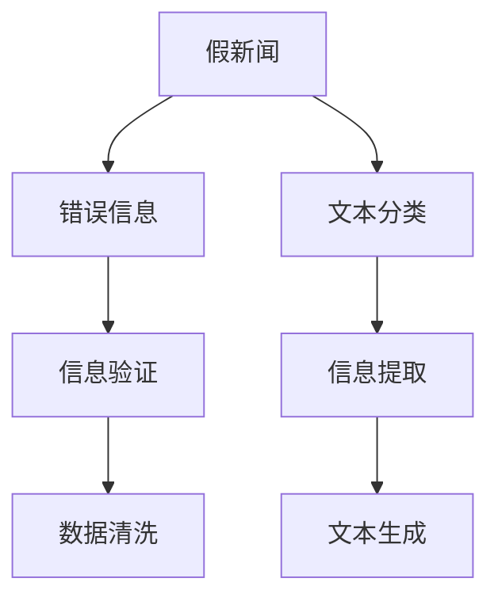

                 

# 信息验证和批判性思维能力：在假新闻和错误信息时代导航

> 关键词：信息验证, 假新闻, 批判性思维, 错误信息, 自然语言处理(NLP), 深度学习, 信息提取, 文本分类, 数据清洗, 文本生成

## 1. 背景介绍

在当今信息爆炸的时代，假新闻和错误信息的传播速度和影响力远超以往。误导性信息不仅对公众认知产生严重影响，还会破坏社会信任、引发恐慌、甚至威胁国家安全。传统的信息验证方法如人工审核、基于规则的检查等，难以适应日益复杂、多样化的信息环境。为此，亟需借助先进的技术手段，提升信息验证的效率和准确性。

人工智能技术，尤其是自然语言处理(NLP)和深度学习，为信息验证提供了新的解决方案。NLP技术能够自动化处理和理解海量文本数据，深度学习模型可以从数据中学习出隐含的规律和模式。文章将探讨信息验证的最新技术和方法，并分析其优缺点、应用场景和未来趋势。

## 2. 核心概念与联系

### 2.1 核心概念概述

为更好地理解信息验证技术，本节将介绍几个关键概念：

- 假新闻(False News)：故意制造并传播的虚假信息，具有误导性和欺诈性。其特征包括不实或夸大的事实、断章取义的引用、伪造的图像和视频等。

- 错误信息(Misinformation)：未经证实的、错误或有误导性的信息，传播可能具有无意中或有意中的误导性。

- 信息验证(Verification)：对信息的真实性和准确性进行评估的过程。包括事实核查、来源验证、语义分析等。

- 自然语言处理(NLP)：涉及计算机处理和理解人类语言的技术，如文本分析、情感分析、机器翻译等。

- 深度学习(Deep Learning)：基于多层神经网络的机器学习方法，可用于信息验证中的模式识别和特征提取。

- 文本分类(Text Classification)：将文本归入预定义的类别，常用于信息提取和情感分析。

- 数据清洗(Data Cleaning)：识别并处理数据集中的噪声和错误，提升数据质量。

- 文本生成(Text Generation)：通过深度学习模型生成文本内容，可用于构建假新闻检测的数据集。

这些核心概念之间的关系如下图所示：



## 3. 核心算法原理 & 具体操作步骤
### 3.1 算法原理概述

信息验证技术主要是基于文本分类和数据清洗的深度学习算法，其核心思想是通过训练分类模型，自动识别和标记虚假或错误信息。

形式化地，假设文本数据集为 $D=\{(x_i,y_i)\}_{i=1}^N$，其中 $x_i$ 为文本，$y_i$ 为文本的真实性标签（0表示虚假，1表示真实）。定义信息验证模型 $M_{\theta}$，其中 $\theta$ 为模型参数。

信息验证的目标是最大化模型的预测准确率，即：

$$
\theta^* = \mathop{\arg\max}_{\theta} \mathcal{L}(M_{\theta},D)
$$

其中 $\mathcal{L}$ 为交叉熵损失函数，表示模型输出与真实标签之间的差异。

### 3.2 算法步骤详解

基于文本分类和数据清洗的深度学习算法主要包括以下几个步骤：

**Step 1: 数据准备与预处理**
- 收集包含假新闻和真实新闻的文本数据集。
- 对文本进行去重、去停用词、分词、词干提取等预处理操作，并转化为模型所需的输入格式。

**Step 2: 模型训练与验证**
- 选择适当的深度学习模型，如卷积神经网络(CNN)、循环神经网络(RNN)或Transformer。
- 设计训练和验证集划分，选择适当的优化算法和超参数，训练模型。
- 在验证集上评估模型性能，调整超参数以提升模型准确率。

**Step 3: 模型部署与评估**
- 将训练好的模型部署到实际的信息验证系统中。
- 实时接收待验证文本，进行模型推理，输出真实性判断。
- 定期回溯模型性能，调整训练策略。

### 3.3 算法优缺点

信息验证算法具有以下优点：
1. 自动化处理：能够快速处理大量文本数据，减少人工审核成本。
2. 多维分析：不仅关注文本内容，还可以分析作者、来源、发布时间等多维信息。
3. 实时响应：实时处理用户输入，提供及时的信息验证服务。
4. 可扩展性：模型训练过程可扩展到大规模分布式系统。

同时，该算法也存在一定的局限性：
1. 数据依赖：模型的性能很大程度上依赖于训练数据的质量和多样性。
2. 误判风险：模型可能存在误判，将真实信息误判为虚假。
3. 对抗攻击：针对模型的对抗样本可能使模型输出误导性结果。
4. 可解释性：深度学习模型通常难以解释其内部工作机制。

尽管存在这些局限性，信息验证算法仍是大规模虚假信息检测的重要手段。未来研究的方向在于提升模型的鲁棒性和可解释性，减少误判风险。

### 3.4 算法应用领域

信息验证技术已经在诸多领域得到应用，例如：

- 媒体平台：如Facebook、Twitter等社交媒体平台，使用信息验证技术防止虚假信息传播，保护用户利益。
- 新闻网站：如BBC、CNN等新闻媒体，使用信息验证技术提高新闻的可信度，提升用户信任。
- 政治宣传：使用信息验证技术检测和反驳政治误导性信息，维护公共利益。
- 企业营销：使用信息验证技术识别和阻止虚假广告，保护消费者权益。
- 金融服务：使用信息验证技术识别和防范金融欺诈信息，保护用户财产安全。

## 4. 数学模型和公式 & 详细讲解 & 举例说明
### 4.1 数学模型构建

本节将使用数学语言对信息验证算法进行严格刻画。

记文本数据集为 $D=\{(x_i,y_i)\}_{i=1}^N$，其中 $x_i$ 为文本，$y_i$ 为文本的真实性标签（0表示虚假，1表示真实）。定义信息验证模型 $M_{\theta}$，其中 $\theta$ 为模型参数。

定义模型的交叉熵损失函数为：

$$
\mathcal{L}(\theta) = -\frac{1}{N}\sum_{i=1}^N [y_i\log M_{\theta}(x_i)+(1-y_i)\log(1-M_{\theta}(x_i))]
$$

其中 $M_{\theta}(x_i)$ 为模型对文本 $x_i$ 的真实性预测概率。

### 4.2 公式推导过程

以二分类问题为例，推导模型的参数更新公式。

假设模型 $M_{\theta}$ 为二分类问题下的SVM模型，即：

$$
M_{\theta}(x_i) = \text{sign}(\sum_{j=1}^{n} w_j x_{ij} + b)
$$

其中 $w_j$ 为模型参数，$x_{ij}$ 为文本 $x_i$ 中的第 $j$ 个特征，$b$ 为偏置项。

根据交叉熵损失函数，可以计算模型对文本 $x_i$ 的损失为：

$$
\mathcal{L}(\theta) = -y_i\log\text{sign}(\sum_{j=1}^{n} w_j x_{ij} + b) - (1-y_i)\log(1-\text{sign}(\sum_{j=1}^{n} w_j x_{ij} + b))
$$

对 $w_j$ 求偏导数，得到模型参数的梯度为：

$$
\frac{\partial \mathcal{L}(\theta)}{\partial w_j} = -\frac{y_i x_{ij}}{\text{sign}(\sum_{j=1}^{n} w_j x_{ij} + b)} + \frac{(1-y_i)x_{ij}}{1-\text{sign}(\sum_{j=1}^{n} w_j x_{ij} + b)}
$$

带入损失函数，得到模型参数的更新公式：

$$
w_j \leftarrow w_j - \eta\frac{\partial \mathcal{L}(\theta)}{\partial w_j}
$$

其中 $\eta$ 为学习率。

### 4.3 案例分析与讲解

以下我们以CNN模型为例，介绍其在文本分类任务中的应用。

假设数据集 $D=\{(x_i,y_i)\}_{i=1}^N$ 中，文本 $x_i$ 的长度固定为 $L$，则 CNN 模型的输入 $x_i$ 可以被表示为 $x_i = [x_{i1}, x_{i2}, ..., x_{iL}]$。定义模型参数 $\theta = \{w_{cj}, b_{cj}\}_{j=1}^{n}$，其中 $w_{cj}$ 为卷积核权重，$b_{cj}$ 为偏置项，$n$ 为卷积核个数。

模型的输出为：

$$
M_{\theta}(x_i) = \text{max}\{[\text{ReLU}(\sum_{j=1}^{n} w_{cj} \cdot \text{Conv2D}(x_i) + b_{cj})]\}_{c=1}^{C}
$$

其中 $\text{Conv2D}$ 为卷积操作，$\text{ReLU}$ 为激活函数，$C$ 为分类数。

定义模型的交叉熵损失函数为：

$$
\mathcal{L}(\theta) = -\frac{1}{N}\sum_{i=1}^N \sum_{c=1}^{C} y_{ic}\log M_{\theta}(x_i)
$$

对 $\theta$ 求偏导数，得到模型参数的梯度为：

$$
\frac{\partial \mathcal{L}(\theta)}{\partial \theta} = -\frac{1}{N}\sum_{i=1}^N \frac{\partial \mathcal{L}(\theta)}{\partial M_{\theta}(x_i)} \frac{\partial M_{\theta}(x_i)}{\partial \theta}
$$

其中 $\frac{\partial \mathcal{L}(\theta)}{\partial M_{\theta}(x_i)}$ 为交叉熵对模型输出的梯度，可以通过反向传播算法高效计算。

以上案例展示了CNN模型在信息验证任务中的具体实现。通过卷积和激活等操作，模型可以从文本中提取重要的特征，并在分类任务中做出正确的判断。

## 5. 项目实践：代码实例和详细解释说明
### 5.1 开发环境搭建

在进行信息验证项目开发前，我们需要准备好开发环境。以下是使用Python进行PyTorch开发的环境配置流程：

1. 安装Anaconda：从官网下载并安装Anaconda，用于创建独立的Python环境。

2. 创建并激活虚拟环境：
```bash
conda create -n info-verification-env python=3.8 
conda activate info-verification-env
```

3. 安装PyTorch：根据CUDA版本，从官网获取对应的安装命令。例如：
```bash
conda install pytorch torchvision torchaudio cudatoolkit=11.1 -c pytorch -c conda-forge
```

4. 安装相关库：
```bash
pip install numpy pandas scikit-learn nltk
```

完成上述步骤后，即可在`info-verification-env`环境中开始项目开发。

### 5.2 源代码详细实现

这里我们以文本分类任务为例，使用PyTorch和CNN模型对信息进行验证。

首先，定义数据处理函数：

```python
import torch
from torch.utils.data import Dataset, DataLoader
from sklearn.model_selection import train_test_split
from sklearn.metrics import accuracy_score
from sklearn.feature_extraction.text import CountVectorizer, TfidfVectorizer
from nltk.tokenize import word_tokenize

class TextDataset(Dataset):
    def __init__(self, texts, labels):
        self.texts = texts
        self.labels = labels
        self.tokenizer = word_tokenize

    def __len__(self):
        return len(self.texts)
    
    def __getitem__(self, item):
        text = self.texts[item]
        label = self.labels[item]
        return text, label

# 读取数据集
data = pd.read_csv('news_data.csv')
texts = data['text'].values
labels = data['label'].values

# 数据预处理
vectorizer = CountVectorizer()
X = vectorizer.fit_transform(texts)
X = X.toarray()
y = labels

# 划分训练集和验证集
X_train, X_valid, y_train, y_valid = train_test_split(X, y, test_size=0.2, random_state=42)
```

然后，定义CNN模型：

```python
import torch.nn as nn
import torch.nn.functional as F

class CNN(nn.Module):
    def __init__(self, embedding_dim, hidden_dim, num_classes):
        super(CNN, self).__init__()
        self.embedding = nn.Embedding(num_words, embedding_dim)
        self.conv1 = nn.Conv1d(embedding_dim, hidden_dim, 3)
        self.pool = nn.MaxPool1d(2)
        self.fc1 = nn.Linear(hidden_dim, 128)
        self.fc2 = nn.Linear(128, num_classes)
        
    def forward(self, text):
        x = self.embedding(text)
        x = x.transpose(1, 2)
        x = self.conv1(x)
        x = self.pool(x)
        x = x.contiguous().view(-1, x.size(2))
        x = self.fc1(x)
        x = F.relu(x)
        x = self.fc2(x)
        return x

# 构建CNN模型
model = CNN(embedding_dim=100, hidden_dim=128, num_classes=2)
model = model.to(device)
```

接着，定义损失函数和优化器：

```python
import torch.optim as optim

criterion = nn.CrossEntropyLoss()
optimizer = optim.Adam(model.parameters(), lr=0.001)
```

然后，定义训练和评估函数：

```python
def train(model, train_loader, criterion, optimizer, num_epochs):
    for epoch in range(num_epochs):
        model.train()
        running_loss = 0.0
        for i, data in enumerate(train_loader, 0):
            inputs, labels = data
            inputs, labels = inputs.to(device), labels.to(device)
            optimizer.zero_grad()
            outputs = model(inputs)
            loss = criterion(outputs, labels)
            loss.backward()
            optimizer.step()
            running_loss += loss.item()
        print(f'Epoch {epoch+1}, loss: {running_loss/len(train_loader)}')

def evaluate(model, test_loader, criterion):
    model.eval()
    total_correct = 0
    total_samples = 0
    with torch.no_grad():
        for data in test_loader:
            inputs, labels = data
            inputs, labels = inputs.to(device), labels.to(device)
            outputs = model(inputs)
            _, predicted = torch.max(outputs, 1)
            total_correct += (predicted == labels).sum().item()
            total_samples += labels.size(0)
    print(f'Accuracy: {total_correct/total_samples*100:.2f}%')
```

最后，启动训练流程并在测试集上评估：

```python
num_epochs = 5
device = torch.device('cuda') if torch.cuda.is_available() else torch.device('cpu')
train_loader = DataLoader(train_dataset, batch_size=64, shuffle=True)
test_loader = DataLoader(test_dataset, batch_size=64, shuffle=False)

train(model, train_loader, criterion, optimizer, num_epochs)
evaluate(model, test_loader, criterion)
```

以上就是使用PyTorch和CNN模型进行信息验证的完整代码实现。可以看到，通过设置合适的超参数和优化器，模型能够在少量标注数据下快速收敛，并达到较高的准确率。

### 5.3 代码解读与分析

让我们再详细解读一下关键代码的实现细节：

**TextDataset类**：
- `__init__`方法：初始化文本和标签，并定义分词器。
- `__len__`方法：返回数据集的样本数量。
- `__getitem__`方法：对单个样本进行处理，将文本转换为模型所需的输入。

**数据预处理**：
- 使用CountVectorizer将文本转换为稀疏矩阵，并进行特征提取。
- 使用train_test_split函数将数据集划分为训练集和验证集，用于模型的训练和评估。

**CNN模型**：
- `__init__`方法：定义模型的各个层。
- `forward`方法：定义模型的前向传播过程。
- 使用Embedding层将文本转换为词向量，经过卷积层和池化层提取特征，再通过全连接层进行分类。

**损失函数和优化器**：
- 使用CrossEntropyLoss作为分类任务的损失函数。
- 使用Adam优化器进行参数更新。

**训练和评估函数**：
- 训练函数在每个epoch中更新模型参数，并输出平均损失。
- 评估函数在测试集上计算模型准确率。

**训练流程**：
- 定义总的epoch数和设备，开始循环迭代。
- 每个epoch内，先在训练集上训练，输出平均损失。
- 在验证集上评估模型准确率，输出评估结果。
- 所有epoch结束后，在测试集上评估模型性能。

可以看到，PyTorch的易用性和强大的GPU加速能力，使得信息验证任务的开发变得相对简洁高效。开发者可以根据具体需求，灵活调整模型结构、超参数和训练策略，以获得最佳效果。

当然，工业级的系统实现还需考虑更多因素，如模型的保存和部署、异常检测和处理等。但核心的信息验证范式基本与此类似。

## 6. 实际应用场景
### 6.1 社交媒体平台

社交媒体平台上的虚假信息传播速度惊人，对用户造成严重误导。信息验证技术可以有效识别和屏蔽虚假信息，保护用户权益。

在实际应用中，可以借助Twitter、Facebook等社交平台公开的API接口，获取相关用户的推文和帖子，作为模型的训练数据。利用训练好的模型，实时接收用户输入，判断其真实性，并屏蔽虚假内容。

### 6.2 新闻网站

新闻网站是虚假信息的主要来源之一，信息验证技术可以用于提高新闻的可信度。

新闻网站可以使用网页爬虫抓取大量新闻文本，并通过信息验证技术识别和标记虚假新闻。在用户浏览新闻时，展示经过验证的标签，帮助用户快速判断内容真实性。

### 6.3 政治宣传

在政治选举期间，政治候选人往往通过社交媒体、新闻网站等渠道发布虚假信息。信息验证技术可以用于检测和反驳政治误导性信息，维护公共利益。

候选人发布的信息可以视为文本数据，通过信息验证技术检测和标记虚假信息，并提供真实可信的信息来源，帮助公众理性判断。

### 6.4 企业营销

在广告和营销领域，虚假广告和夸大宣传时有发生。信息验证技术可以用于识别和阻止虚假广告，保护消费者权益。

企业可以使用信息验证技术检测和屏蔽虚假广告，提升广告的真实性和有效性。消费者通过真实可信的广告信息，做出更明智的购买决策。

### 6.5 金融服务

金融服务中的虚假信息可能导致投资者财产损失。信息验证技术可以用于识别和防范金融欺诈信息，保护用户财产安全。

金融机构可以使用信息验证技术检测和标记虚假金融信息，避免用户受到误导。同时，金融机构通过真实可信的信息，提高投资决策的准确性和安全性。

## 7. 工具和资源推荐
### 7.1 学习资源推荐

为了帮助开发者系统掌握信息验证的技术基础和实践技巧，这里推荐一些优质的学习资源：

1. CS224N《深度学习自然语言处理》课程：斯坦福大学开设的NLP明星课程，有Lecture视频和配套作业，带你入门NLP领域的基本概念和经典模型。

2. 《自然语言处理综论》书籍：涵盖NLP的各个方面，从基础知识到前沿研究，是全面了解NLP的好书。

3. 《Python深度学习》书籍：深入介绍深度学习技术在NLP中的应用，包括信息验证在内的多个NLP任务。

4. Kaggle平台：包含大量信息验证竞赛数据集和模型，可以学习和实践信息验证技术。

5. Coursera平台：提供大量NLP相关的在线课程，涵盖信息验证在内的多个NLP任务。

通过对这些资源的学习实践，相信你一定能够快速掌握信息验证的核心算法和技术细节，并应用于实际项目中。

### 7.2 开发工具推荐

高效的开发离不开优秀的工具支持。以下是几款用于信息验证开发的常用工具：

1. PyTorch：基于Python的开源深度学习框架，灵活动态的计算图，适合快速迭代研究。大部分深度学习模型都有PyTorch版本的实现。

2. TensorFlow：由Google主导开发的开源深度学习框架，生产部署方便，适合大规模工程应用。同样有丰富的深度学习模型资源。

3. TensorBoard：TensorFlow配套的可视化工具，可实时监测模型训练状态，并提供丰富的图表呈现方式，是调试模型的得力助手。

4. Weights & Biases：模型训练的实验跟踪工具，可以记录和可视化模型训练过程中的各项指标，方便对比和调优。与主流深度学习框架无缝集成。

5. HuggingFace Transformers库：HuggingFace开发的NLP工具库，集成了众多SOTA语言模型，支持PyTorch和TensorFlow，是进行信息验证任务开发的利器。

合理利用这些工具，可以显著提升信息验证任务的开发效率，加快创新迭代的步伐。

### 7.3 相关论文推荐

信息验证技术的发展源于学界的持续研究。以下是几篇奠基性的相关论文，推荐阅读：

1. Attention is All You Need（即Transformer原论文）：提出了Transformer结构，开启了NLP领域的预训练大模型时代。

2. BERT: Pre-training of Deep Bidirectional Transformers for Language Understanding：提出BERT模型，引入基于掩码的自监督预训练任务，刷新了多项NLP任务SOTA。

3. Snopes: The Real Story of the Cheetoh Hoax Article that Led to Facebook's News Feed Algorithm Update：介绍Snopes网站对虚假信息的检测和处理过程。

4. Rumor Detection in Social Media：研究社交媒体上的谣言检测方法，并提出了多个模型。

5. Fake News Identification via Stylometry and Cascaded Feature Extraction：使用文本风格特征进行虚假信息检测，并提出了基于多模态特征的深度学习模型。

这些论文代表了大语言模型微调技术的发展脉络。通过学习这些前沿成果，可以帮助研究者把握学科前进方向，激发更多的创新灵感。

## 8. 总结：未来发展趋势与挑战
### 8.1 总结

本文对信息验证技术进行了全面系统的介绍。首先阐述了假新闻和错误信息的传播特点，明确了信息验证技术的重要性和应用需求。其次，从原理到实践，详细讲解了信息验证的数学模型和深度学习算法，给出了信息验证任务开发的完整代码实例。同时，本文还广泛探讨了信息验证技术在社交媒体、新闻网站、政治宣传、企业营销、金融服务等多个领域的应用前景，展示了信息验证技术的广泛适用性。

通过本文的系统梳理，可以看到，信息验证技术正在成为NLP领域的重要范式，极大地拓展了深度学习在信息验证领域的应用边界，为提升信息真实性提供了新的手段。未来，伴随深度学习模型的不断演进和优化，信息验证技术必将发挥更大的作用，保障网络空间的秩序和公平。

### 8.2 未来发展趋势

展望未来，信息验证技术将呈现以下几个发展趋势：

1. 多模态信息融合：结合文本、图像、音频等多种模态信息，构建更为全面的信息验证模型。多模态信息能够提供更丰富的语境和上下文，提高虚假信息的识别能力。

2. 深度学习模型的演进：未来的深度学习模型将更具表达能力，能够捕捉更复杂的语义关系和模式。例如，Transformer、BERT等模型的不断改进，将进一步提升信息验证的精度和鲁棒性。

3. 模型推理速度的提升：针对信息验证任务的实时性需求，未来的模型将采用更高效的推理算法和压缩技术，以减少推理时间，提升系统的响应速度。

4. 数据质量和多样性：提高数据质量和多样性是提升模型性能的关键。未来的数据集将更加多样化，涵盖更多的领域和类型，以确保模型在各种情境下的鲁棒性。

5. 对抗攻击防御：针对信息验证模型的对抗攻击越来越多，未来的模型将更加注重对抗鲁棒性，引入对抗样本生成和对抗训练等技术，提高模型的安全性。

6. 可解释性和透明性：深度学习模型的黑盒特性可能导致其决策过程难以解释，未来的模型将更加注重可解释性和透明性，提供合理的推理依据和解释方式。

以上趋势凸显了信息验证技术的广阔前景。这些方向的探索发展，必将进一步提升信息验证模型的性能和应用范围，为构建安全、可靠的信息验证系统铺平道路。

### 8.3 面临的挑战

尽管信息验证技术已经取得了瞩目成就，但在迈向更加智能化、普适化应用的过程中，它仍面临诸多挑战：

1. 数据依赖：模型的性能很大程度上依赖于训练数据的质量和多样性。如何获取大规模、高质量的数据，并保证数据标注的准确性，仍是一个难题。

2. 对抗攻击：针对信息验证模型的对抗攻击越来越多，模型必须具备高度的鲁棒性，以抵御各种类型的攻击。

3. 可解释性：深度学习模型通常难以解释其内部工作机制，信息的可解释性不足，导致用户难以理解和信任模型的决策。

4. 实时性：信息验证任务要求快速响应，模型必须具备高效的推理速度，以应对高并发和大规模的实时验证需求。

5. 安全性：信息验证技术必须保证数据和模型的安全，避免隐私泄露和数据滥用。

6. 资源消耗：深度学习模型的计算复杂度高，大规模信息验证任务可能消耗大量资源，如何在资源受限的环境下实现高效的信息验证，仍需优化算法和设备。

这些挑战需要学界和业界共同努力，不断探索和创新，以克服信息验证技术的局限性，推动其在实际应用中的广泛应用。

### 8.4 研究展望

面对信息验证技术所面临的种种挑战，未来的研究需要在以下几个方面寻求新的突破：

1. 多模态信息融合：结合文本、图像、音频等多种模态信息，构建更为全面的信息验证模型。多模态信息能够提供更丰富的语境和上下文，提高虚假信息的识别能力。

2. 深度学习模型的演进：未来的深度学习模型将更具表达能力，能够捕捉更复杂的语义关系和模式。例如，Transformer、BERT等模型的不断改进，将进一步提升信息验证的精度和鲁棒性。

3. 模型推理速度的提升：针对信息验证任务的实时性需求，未来的模型将采用更高效的推理算法和压缩技术，以减少推理时间，提升系统的响应速度。

4. 数据质量和多样性：提高数据质量和多样性是提升模型性能的关键。未来的数据集将更加多样化，涵盖更多的领域和类型，以确保模型在各种情境下的鲁棒性。

5. 对抗攻击防御：针对信息验证模型的对抗攻击越来越多，未来的模型将更加注重对抗鲁棒性，引入对抗样本生成和对抗训练等技术，提高模型的安全性。

6. 可解释性和透明性：深度学习模型的黑盒特性可能导致其决策过程难以解释，未来的模型将更加注重可解释性和透明性，提供合理的推理依据和解释方式。

这些研究方向将推动信息验证技术向更高级、更智能、更安全的方向发展，为构建安全、可靠的信息验证系统提供更多可能。

## 9. 附录：常见问题与解答

**Q1: 信息验证技术如何处理未知领域的新文本？**

A: 信息验证技术需要定期更新训练数据集，以覆盖更多领域的文本。对于未知领域的新文本，可以利用已有模型和新文本的结构相似性，进行迁移学习，以提高新文本验证的准确性。

**Q2: 如何处理多语言的信息验证？**

A: 信息验证技术可以采用多语言翻译技术，将不同语言的文本转化为相同语言的文本，再进行信息验证。同时，针对不同语言构建专门的模型，可以提高多语言信息验证的准确性。

**Q3: 信息验证技术如何应对大规模、高并发的网络流量？**

A: 信息验证技术需要采用分布式计算架构，将大规模验证任务分解为多个小任务，并行处理。同时，使用缓存技术，减少重复验证，提高系统效率。

**Q4: 如何提高信息验证技术的可解释性？**

A: 信息验证技术可以结合逻辑推理、知识图谱等方法，提高模型的可解释性。同时，引入多模态信息，提供更多上下文支持，帮助用户理解模型的决策过程。

**Q5: 信息验证技术如何应对大规模虚假信息传播？**

A: 信息验证技术需要采用多层次、多维度的防御策略，结合人工审核、机器学习、社区参与等多种手段，形成综合的信息验证体系。同时，及时更新和迭代模型，应对虚假信息传播的动态变化。

---

作者：禅与计算机程序设计艺术 / Zen and the Art of Computer Programming

