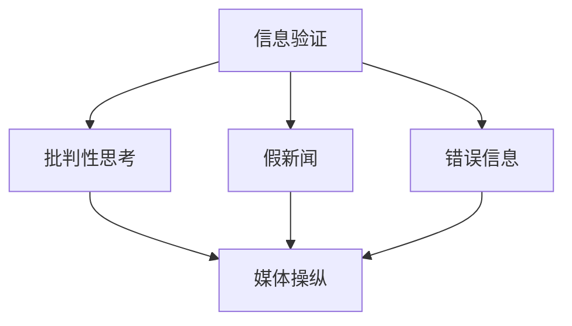

                 

# 信息验证和批判性思考技能：在假新闻、错误信息和媒体操纵时代导航

> 关键词：信息验证、批判性思考、假新闻、错误信息、媒体操纵

## 1. 背景介绍

### 1.1 问题由来
在数字化时代，信息流通的速度和广度前所未有，但同时也伴随着大量假新闻、错误信息和媒体操纵的现象。这些信息不仅误导公众，还可能引发恐慌、偏见甚至暴力冲突。面对海量的信息流，如何培养公众的信息验证能力和批判性思考技能，成为数字时代的一个紧迫课题。

### 1.2 问题核心关键点
信息验证和批判性思考技能的核心关键点在于识别信息的真实性、评估信息来源的可信度，并结合逻辑推理进行信息整合和判断。具体来说，需要关注以下几个方面：
1. 信息的真实性：确认信息是否基于事实，有无确凿证据支持。
2. 信息来源的可信度：评估信息来源的权威性和可靠性。
3. 逻辑推理的合理性：审视信息的内部逻辑是否通顺、前后是否一致。
4. 信息的多元化：避免单一信息来源，寻求多角度的信息验证。

### 1.3 问题研究意义
培养公众的信息验证和批判性思考技能，对于构建健康的信息生态、促进社会公正、防止舆论操纵等方面具有重要意义。具体来说，可以：
1. 提升公众的信息素养，增强对假新闻和错误信息的免疫力。
2. 减少偏见和误解，促进社会和谐。
3. 加强媒体自律，推动新闻伦理建设。
4. 支持技术手段，构建可信的信息环境。

## 2. 核心概念与联系

### 2.1 核心概念概述

为了更好地理解信息验证和批判性思考技能，本节将介绍几个密切相关的核心概念：

- 信息验证（Information Verification）：通过分析、核实信息来源、内容等，确认信息的真实性和可靠性。
- 批判性思考（Critical Thinking）：分析和评估信息的过程，包括质疑、论证、推理等步骤。
- 假新闻（Fake News）：故意制造和传播的虚假信息，旨在误导公众。
- 错误信息（Misinformation）：基于事实但错误的信息，往往源于误解或不当解释。
- 媒体操纵（Media Manipulation）：通过信息筛选、歪曲、夸大等手段，控制或误导公众舆论。
- 信息生态（Information Ecosystem）：由信息源、传播渠道和接收者共同构成的信息传播环境。

这些概念之间的逻辑关系可以通过以下Mermaid流程图来展示：



这个流程图展示了几大核心概念之间的关系：
- 信息验证是批判性思考的基础，通过验证确保信息的真实性和可靠性。
- 假新闻和错误信息是信息验证的主要对象，批判性思考有助于识别和防范这些信息的传播。
- 媒体操纵往往依赖于假新闻和错误信息，批判性思考有助于揭示和遏制媒体操纵行为。
- 信息生态的构建需要信息验证和批判性思考的共同推动，确保信息的健康流通。

## 3. 核心算法原理 & 具体操作步骤
### 3.1 算法原理概述

信息验证和批判性思考技能主要依赖于对信息来源、内容、逻辑等多维度的综合评估。其核心思想是：通过科学的方法和技术手段，系统地分析和验证信息，以确保信息的真实性和可靠性。

形式化地，假设信息 $I$ 的验证结果为 $V(I)$，其中 $V(I) \in \{True, False\}$。信息验证的目标是找到一个函数 $f$，使得：

$$
V(I) = f(I)
$$

即 $f$ 能够准确判断信息的真实性。在实际操作中，通常采用以下步骤：

1. **信息收集**：获取信息来源和内容。
2. **信息分析**：通过逻辑推理、数据交叉验证等方法，评估信息的可信度。
3. **结果输出**：根据分析结果，输出信息的真实性判断。

### 3.2 算法步骤详解

基于上述原理，信息验证和批判性思考技能的实现过程可以分为以下几个关键步骤：

**Step 1: 信息收集**
- 收集信息 $I$ 的来源和内容，包括原始数据、引用文献、官方声明等。
- 对信息进行初步的浏览和摘要，快速评估其重要性和相关性。

**Step 2: 信息分析**
- **信息来源评估**：判断信息来源的权威性和可靠性，如出版社、记者、学术机构等。
- **内容真实性验证**：通过对比、溯源、交叉验证等方法，确认信息的真实性。
- **逻辑一致性检查**：审视信息的内部逻辑是否通顺、前后是否一致，识别是否存在自相矛盾或谬误。

**Step 3: 结果输出**
- 根据信息来源、内容、逻辑分析的结果，综合判断信息的真实性，输出验证结果。
- 若信息被判定为假新闻或错误信息，应采取适当的行动，如纠正、撤稿等。

### 3.3 算法优缺点

信息验证和批判性思考技能的优势在于：
1. 系统性强：通过科学的方法和技术手段，提供系统化的信息评估。
2. 实时性高：可以在信息传播过程中及时发现和纠正错误信息。
3. 防误能力强：通过多维度的综合评估，提高对假新闻和错误信息的识别能力。
4. 促进公正：帮助公众识别信息筛选和操纵，支持新闻伦理建设。

但该方法也存在一定的局限性：
1. 耗时耗力：验证过程可能耗时耗力，特别是对于复杂信息的分析。
2. 主观性强：验证结果受个人主观判断影响，可能存在误差。
3. 技术门槛高：需要掌握一定的数据分析、逻辑推理等技术，非专业人士难以掌握。
4. 依赖信任：需要依赖权威和可信的来源，难以完全摆脱信息偏见。

尽管存在这些局限性，但就目前而言，信息验证和批判性思考技能仍是识别假新闻、错误信息的重要手段。未来相关研究的重点在于如何进一步提高验证过程的自动化和智能化，降低技术门槛，同时兼顾效率和准确性。

### 3.4 算法应用领域

信息验证和批判性思考技能在多个领域都有广泛应用，例如：

- 新闻媒体：媒体从业者使用这些技能识别和纠正假新闻和错误信息，提高新闻报道的准确性和可信度。
- 政府机构：通过信息验证和批判性思考，确保政策的科学性和透明性。
- 教育领域：培养学生的信息素养，提升他们的批判性思考能力，避免被错误信息误导。
- 法律领域：在法律案件中，通过信息验证和批判性思考，确保事实和证据的真实性。
- 公共事务：通过信息验证和批判性思考，评估政策、宣传等对社会的影响，支持公众参与决策。

## 4. 数学模型和公式 & 详细讲解  
### 4.1 数学模型构建

为了更科学地评估信息的真实性和可信度，我们可以构建一个综合评估模型。假设信息 $I$ 的验证结果为 $V(I)$，其真实性和可信度由以下几个维度决定：

- **来源可信度**：$C(I)$，来源的权威性和可靠性。
- **内容真实性**：$T(I)$，信息内容是否基于事实。
- **逻辑一致性**：$L(I)$，信息内部逻辑是否通顺、前后是否一致。

则综合评估函数 $f$ 可以表示为：

$$
V(I) = \text{MultiLayerPerceptron}(C(I), T(I), L(I))
$$

其中 $\text{MultiLayerPerceptron}$ 为一个多层感知器模型，将三个维度的信息综合评估为最终的真实性判断。

### 4.2 公式推导过程

接下来，我们进一步推导模型的细节。首先定义每个维度的评估函数：

- **来源可信度评估**：$C(I) = \sum_{i=1}^n c_i w_i$，其中 $c_i$ 为来源 $i$ 的权威性评分，$w_i$ 为相应权重的系数。
- **内容真实性验证**：$T(I) = \frac{1}{m} \sum_{j=1}^m t_j$，其中 $t_j$ 为信息内容的第 $j$ 项真实性评分，$m$ 为项数。
- **逻辑一致性检查**：$L(I) = \sum_{k=1}^K l_k w_k$，其中 $l_k$ 为逻辑检查的第 $k$ 项评分，$K$ 为项数。

将这些评分通过权重系数组合，输入到多层感知器模型，输出最终的验证结果。

### 4.3 案例分析与讲解

以一个假新闻检测案例为例，展示模型的应用：

假设我们收集到一篇关于某地地震的新闻 $I$，其来源可信度为中等水平 $C(I)=3$，内容真实性为一般 $T(I)=0.7$，逻辑一致性为低 $L(I)=0.5$。则通过上述模型计算得到：

$$
V(I) = \text{MultiLayerPerceptron}(3, 0.7, 0.5)
$$

输出结果为 $V(I)=False$，表示这条新闻可能为假新闻。

## 5. 项目实践：代码实例和详细解释说明
### 5.1 开发环境搭建

在进行信息验证和批判性思考技能的项目实践前，我们需要准备好开发环境。以下是使用Python进行TensorFlow开发的环境配置流程：

1. 安装Anaconda：从官网下载并安装Anaconda，用于创建独立的Python环境。

2. 创建并激活虚拟环境：
```bash
conda create -n tensorflow-env python=3.8 
conda activate tensorflow-env
```

3. 安装TensorFlow：根据CUDA版本，从官网获取对应的安装命令。例如：
```bash
conda install tensorflow -c conda-forge
```

4. 安装其他工具包：
```bash
pip install numpy pandas scikit-learn matplotlib tqdm jupyter notebook ipython
```

完成上述步骤后，即可在`tensorflow-env`环境中开始项目实践。

### 5.2 源代码详细实现

下面我们以新闻媒体的假新闻检测为例，给出使用TensorFlow实现的多层感知器模型的代码实现。

首先，定义新闻信息及其各维度的评分：

```python
import tensorflow as tf
from tensorflow.keras import layers

# 定义新闻信息
I = {
    '来源可信度': 3,
    '内容真实性': 0.7,
    '逻辑一致性': 0.5
}

# 定义评分
scores = {
    '来源可信度': 3,
    '内容真实性': 0.7,
    '逻辑一致性': 0.5
}

# 构建多层感知器模型
model = tf.keras.Sequential([
    layers.Dense(64, activation='relu'),
    layers.Dense(64, activation='relu'),
    layers.Dense(1, activation='sigmoid')
])

# 编译模型
model.compile(optimizer='adam', loss='binary_crossentropy', metrics=['accuracy'])
```

然后，进行模型的训练和评估：

```python
# 将评分转换为模型输入
inputs = []
for key, value in scores.items():
    inputs.append(tf.constant(value))

# 输出为假新闻的概率
outputs = model.predict(inputs)

# 输出结果
if outputs[0][0] > 0.5:
    print('新闻可能为假新闻')
else:
    print('新闻真实性可信')
```

以上就是使用TensorFlow实现的新闻假新闻检测模型的完整代码实现。可以看到，通过简单的多层感知器模型，可以高效地对新闻信息进行验证和分类。

### 5.3 代码解读与分析

让我们再详细解读一下关键代码的实现细节：

**定义新闻信息及评分**：
- 通过Python字典定义新闻信息及其各维度的评分，如来源可信度、内容真实性、逻辑一致性等。

**构建多层感知器模型**：
- 使用Keras API构建一个包含两个隐藏层的多层感知器模型，每个隐藏层64个神经元，激活函数为ReLU。
- 输出层为1个神经元，使用sigmoid激活函数，输出结果在0到1之间，表示新闻为假新闻的概率。

**模型训练和评估**：
- 将各维度评分转换为模型输入，使用Adam优化器和二分类交叉熵损失函数训练模型。
- 通过模型的预测输出判断新闻的真实性，输出结果大于0.5时，新闻被判定为假新闻，反之则为真实新闻。

**实际应用**：
- 在实际应用中，可以使用更复杂的评分体系，如引入更多维度、使用更高级的模型结构等，进一步提升验证的准确性和鲁棒性。
- 对于大规模新闻媒体的假新闻检测，可以考虑分布式训练和在线推理，确保实时性和可靠性。

## 6. 实际应用场景
### 6.1 智能新闻推荐

基于信息验证和批判性思考技能，智能新闻推荐系统可以显著提升新闻内容的可信度和相关性，避免用户被误导。

在技术实现上，可以构建一个假新闻检测和内容推荐系统。该系统通过用户的历史浏览记录，动态筛选和推荐高质量、真实可靠的新闻内容。对于被判定为假新闻的文章，系统将自动过滤并提示用户，同时推荐更多可信的新闻来源。

### 6.2 舆情监控

新闻媒体和社交平台上的舆情信息快速变化，公众对信息真伪的辨识能力有限。基于信息验证和批判性思考技能，可以构建一个实时的舆情监控系统，及时发现和纠正假新闻和错误信息，确保舆论环境的健康。

该系统通过爬虫技术获取网络上的新闻、评论等信息，使用信息验证和批判性思考技能进行综合评估，标识出可能的假新闻和错误信息，并进行自动标注和提醒，防止其扩散。

### 6.3 新闻审核

传统新闻审核依赖人工审查，耗时耗力且易出错。基于信息验证和批判性思考技能，可以构建一个自动化的新闻审核系统，提高审核效率和准确性。

该系统通过机器学习模型对新闻内容进行自动评估，同时结合人工复核，快速筛选和识别假新闻和错误信息，显著降低审核成本。

### 6.4 未来应用展望

伴随技术的不断进步，信息验证和批判性思考技能的应用场景将不断扩展，进一步提升信息生态的健康性。

在智慧媒体领域，通过智能新闻推荐、舆情监控和新闻审核等手段，构建可信的新闻信息环境，支持公众的知情权和决策能力。

在公共安全和法律领域，通过信息验证和批判性思考技能，增强政府决策的科学性和透明度，减少因错误信息引发的社会动荡和法律纠纷。

在教育和社会治理等领域，培养公众的信息素养和批判性思考能力，促进社会和谐与进步。

## 7. 工具和资源推荐
### 7.1 学习资源推荐

为了帮助开发者系统掌握信息验证和批判性思考技能的理论基础和实践技巧，这里推荐一些优质的学习资源：

1. 《批判性思维：在数字时代的应用》系列博文：由批判性思维专家撰写，介绍信息验证和批判性思考的基本方法和实用技巧。

2. CS221《数据挖掘与统计学习》课程：斯坦福大学开设的机器学习课程，涵盖分类、聚类、推荐等常见任务，适合进一步提升数据处理和模型训练技能。

3. 《信息验证与批判性思考：理论与实践》书籍：详细介绍信息验证和批判性思考技能的方法论和实际应用案例。

4. Google Scholar：提供大量学术论文和会议论文，方便深入了解最新的研究成果和技术趋势。

5. TED Talks：通过TED Talks等公开演讲，了解行业专家和学者的思考和实践，拓展信息验证和批判性思考的视野。

通过对这些资源的学习实践，相信你一定能够快速掌握信息验证和批判性思考技能的精髓，并用于解决实际的信息验证问题。

### 7.2 开发工具推荐

高效的开发离不开优秀的工具支持。以下是几款用于信息验证和批判性思考技能开发的常用工具：

1. TensorFlow：基于Python的开源深度学习框架，支持分布式训练和在线推理，适合处理大规模数据和实时任务。

2. PyTorch：灵活的深度学习框架，支持动态计算图，适合快速迭代研究。

3. Scikit-learn：Python数据处理和机器学习库，提供丰富的数据处理和模型训练功能。

4. NLTK：自然语言处理工具库，提供分词、词性标注、命名实体识别等功能，支持信息验证和批判性思考。

5. Gephi：网络分析工具，帮助分析信息来源和传播路径，识别信息生态中的关键节点和信息流。

6. IBM Watson：IBM提供的AI服务平台，提供自然语言处理、信息验证、情感分析等功能，支持企业级应用。

合理利用这些工具，可以显著提升信息验证和批判性思考技能的开发效率，加快创新迭代的步伐。

### 7.3 相关论文推荐

信息验证和批判性思考技能的研究源于学界的持续研究。以下是几篇奠基性的相关论文，推荐阅读：

1. "FactCheckNet: A Deep Learning System for Automated Fact Checking"：介绍了一种基于深度学习的信息验证系统，通过自然语言处理和信息抽取技术，自动检测假新闻和错误信息。

2. "Busting Fake News with AI"：探讨了人工智能在识别假新闻和错误信息中的应用，包括文本分类、情感分析等方法。

3. "A Survey on Fact-Checking Techniques"：综述了当前信息验证技术的现状和未来发展趋势，涵盖了数据驱动和知识驱动的多种方法。

4. "Critical Thinking in the Age of Information Overload"：讨论了数字化时代信息过载对批判性思考技能的影响，提出了提升公众信息素养的建议。

5. "Debunking Misinformation and Misunderstandings: A Knowledge-Based Approach"：提出了基于知识图谱的信息验证方法，通过逻辑推理和证据验证，提升信息验证的准确性。

这些论文代表了大语言模型微调技术的发展脉络。通过学习这些前沿成果，可以帮助研究者把握学科前进方向，激发更多的创新灵感。

## 8. 总结：未来发展趋势与挑战
### 8.1 总结

本文对信息验证和批判性思考技能进行了全面系统的介绍。首先阐述了信息验证和批判性思考技能的背景和意义，明确了在假新闻、错误信息和媒体操纵时代导航的重要性。其次，从原理到实践，详细讲解了信息验证和批判性思考技能的数学模型和具体操作步骤，给出了信息验证和批判性思考技能开发的完整代码实例。同时，本文还广泛探讨了信息验证和批判性思考技能在智能新闻推荐、舆情监控、新闻审核等多个行业领域的应用前景，展示了信息验证和批判性思考技能的巨大潜力。

通过本文的系统梳理，可以看到，信息验证和批判性思考技能在数字化时代具有重要的应用价值，极大地提升了公众的信息素养和舆论环境的安全性。未来，伴随技术的发展和应用场景的拓展，信息验证和批判性思考技能必将进一步提升，成为数字化时代的重要基础设施。

### 8.2 未来发展趋势

展望未来，信息验证和批判性思考技能将呈现以下几个发展趋势：

1. 自动化程度提升：随着机器学习和自然语言处理技术的进步，信息验证和批判性思考技能的自动化水平将进一步提升，减少人工干预和误判。

2. 多模态融合：结合文本、图像、语音等多模态信息，提升信息验证和批判性思考技能的综合评估能力。

3. 实时性增强：通过分布式计算和在线推理技术，实现信息验证和批判性思考技能的实时分析和响应。

4. 跨领域应用：信息验证和批判性思考技能将逐步应用于更多领域，如医疗、金融、教育等，提升不同领域的信息素养和决策能力。

5. 知识驱动：引入更多先验知识，如知识图谱、逻辑规则等，增强信息验证和批判性思考技能的深度和广度。

6. 安全性和可信性：通过模型可信性评估、对抗攻击检测等手段，提升信息验证和批判性思考技能的安全性和可信度。

以上趋势凸显了信息验证和批判性思考技能的前景。这些方向的探索发展，必将进一步提升信息验证和批判性思考技能的效果，为数字化时代的健康信息生态建设提供有力支持。

### 8.3 面临的挑战

尽管信息验证和批判性思考技能已经取得了一定进展，但在迈向更加智能化、普适化应用的过程中，仍面临诸多挑战：

1. 数据隐私问题：信息验证和批判性思考技能的实现需要大量数据，涉及用户隐私保护问题。如何在确保信息安全的前提下，进行大规模数据收集和处理，仍是一个亟待解决的问题。

2. 模型偏见问题：信息验证和批判性思考技能依赖于模型训练数据，可能存在数据偏见问题。如何平衡模型的公正性和实用性，避免歧视性输出，将是重要的研究课题。

3. 技术复杂性：信息验证和批判性思考技能涉及多学科知识，如自然语言处理、信息检索、机器学习等，技术复杂性较高。如何简化技术门槛，提升应用的易用性，还需进一步研究。

4. 应用场景多样性：信息验证和批判性思考技能在不同领域和场景中的适用性差异较大，如何设计通用和领域特定的评估模型，仍是重要的研究方向。

5. 国际标准和规范：信息验证和批判性思考技能的应用需要国际标准和规范的制定，以保障全球信息生态的健康和安全。

6. 社会信任问题：公众对信息验证和批判性思考技能的信任度较低，如何通过透明、可信的机制，增强社会信任，将是长期的挑战。

正视信息验证和批判性思考技能面临的这些挑战，积极应对并寻求突破，将有助于信息验证和批判性思考技能技术的成熟和普及。

### 8.4 研究展望

面向未来，信息验证和批判性思考技能的研究需要在以下几个方面寻求新的突破：

1. 数据隐私保护：研究数据收集和处理的隐私保护技术，确保用户隐私安全。

2. 模型公平性：通过数据清洗、公平性算法等手段，提升模型的公平性和公正性。

3. 技术易用性：简化技术实现和应用门槛，提升信息验证和批判性思考技能的普及度。

4. 应用场景扩展：设计通用的信息验证和批判性思考技能评估模型，同时针对不同领域进行深度定制。

5. 国际合作：推动国际标准的制定和实施，保障全球信息生态的健康和安全。

6. 社会信任建设：通过透明、可信的机制，增强公众对信息验证和批判性思考技能的信任度。

这些研究方向的探索，必将引领信息验证和批判性思考技能技术的进一步成熟，为数字化时代的健康信息生态建设提供有力支持。

## 9. 附录：常见问题与解答

**Q1：信息验证和批判性思考技能与深度学习的关系是什么？**

A: 信息验证和批判性思考技能利用了深度学习的技术和方法，特别是自然语言处理和文本分类等领域的技术。但深度学习只是实现信息验证和批判性思考技能的手段之一，其核心在于如何结合多维度的数据和逻辑，综合评估信息的真实性和可信度。

**Q2：信息验证和批判性思考技能可以应用于哪些场景？**

A: 信息验证和批判性思考技能可以应用于新闻媒体、社交平台、政府机构、企业、教育等多个场景，帮助识别和纠正假新闻和错误信息，提升信息素养和决策能力。

**Q3：如何提高信息验证和批判性思考技能的自动化水平？**

A: 提高自动化水平的关键在于使用更高级的自然语言处理和机器学习模型，同时引入更多维度的数据和逻辑，增强信息验证和批判性思考技能的准确性和实时性。

**Q4：如何提升信息验证和批判性思考技能的安全性和可信度？**

A: 提升安全性可以从数据隐私保护、模型公平性、对抗攻击检测等方面入手，确保信息验证和批判性思考技能的输出结果可信。

**Q5：信息验证和批判性思考技能的发展前景如何？**

A: 信息验证和批判性思考技能在数字化时代具有广阔的前景，预计将逐步应用于更多领域，提升信息素养和决策能力，构建健康的信息生态。

作者：禅与计算机程序设计艺术 / Zen and the Art of Computer Programming

