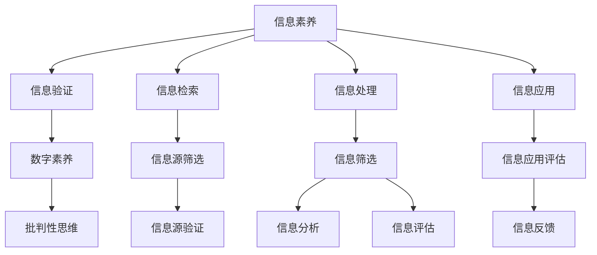

                 

## 1. 背景介绍

在信息时代，数据和信息已经成为影响社会经济发展的关键资源。个人信息素养（Information Literacy）不仅包括获取、处理、分析信息的能力，还涵盖了对信息源的验证和批判性思维。培养具备高信息素养的学生，使其能够有效利用和批判性处理海量信息，对于构建知识驱动的社会至关重要。

### 1.1 信息素养的重要性
在信息爆炸的时代，用户需要快速准确地找到所需信息，并评估其可信度。信息素养教育强调用户对信息源、传播过程的认知，帮助其在面对海量信息时，能够快速甄别真伪，避免被误导。信息素养教育不仅有助于提升个人知识获取和分析能力，还对增强社会整体的信息处理效率和质量具有深远影响。

### 1.2 信息验证的必要性
随着互联网和社交媒体的普及，虚假信息、误导性内容的传播速度和范围日益扩大。用户必须具备信息验证能力，以辨别和应对这些挑战。信息验证不仅是对已有信息的核实，更是一种批判性思维的体现，要求用户能够分析信息来源的可信度，评估其逻辑性和科学性。

### 1.3 现状与挑战
当前，信息素养教育尚处于初级阶段，学校教育和社会普及不足。大部分学生在面对海量信息时，缺乏必要的技能和工具来识别、筛选和评估信息。此外，社会信息环境复杂多变，虚假信息、网络钓鱼等新型欺诈手段层出不穷，这增加了信息验证的难度。

## 2. 核心概念与联系

### 2.1 核心概念概述
1. **信息素养（Information Literacy）**：指获取、评估、分析、应用信息的能力，包括理解信息源、识别偏见、批判性思维等方面。
2. **信息验证（Information Verification）**：指通过多种手段和方法，对信息的来源、内容、传播过程等进行查证和验证，以辨别真伪。
3. **数字素养（Digital Literacy）**：指掌握现代信息技术的应用能力，包括使用计算机、互联网、移动设备等工具，进行信息检索、处理和沟通。
4. **批判性思维（Critical Thinking）**：指基于证据和逻辑，分析和评估信息的能力，避免受到误导和偏见的影响。

### 2.2 核心概念原理和架构的 Mermaid 流程图



### 2.3 核心概念的联系
信息素养、信息验证、数字素养和批判性思维构成了信息时代教育的基本框架。信息素养教育旨在培养学生的综合信息处理能力，信息验证是信息素养的重要组成部分，数字素养是信息素养教育的技术基础，批判性思维则是信息验证和数字素养教育的重要保障。

## 3. 核心算法原理 & 具体操作步骤

### 3.1 算法原理概述
信息验证的核心是对信息源的筛选和验证，以确保信息准确、可靠。信息验证的过程包括识别信息源、评估信息源可信度、分析信息内容和传播过程。

### 3.2 算法步骤详解
1. **信息源识别**：使用搜索引擎或数据库检索相关信息，识别出主要信息源。
2. **信息源评估**：评估信息源的可信度，包括作者的资历、出版机构、发布日期等。
3. **信息内容验证**：检查信息内容的准确性、逻辑性和科学性，识别出潜在错误和误导。
4. **信息传播验证**：分析信息的传播途径和传播过程中的干扰因素，确保信息完整性。
5. **信息综合判断**：结合信息源评估和内容验证结果，综合判断信息可靠性，做出最终结论。

### 3.3 算法优缺点
- **优点**：
  - 强调批判性思维，帮助学生建立理性的信息处理习惯。
  - 覆盖信息源筛选、内容验证等多个环节，形成系统化知识体系。
  - 提高用户的信息处理效率，减少误导和偏见的影响。

- **缺点**：
  - 操作复杂，需要一定的时间和技能投入。
  - 难以量化评估信息验证的效果，存在主观偏见。
  - 信息源和内容验证的标准和工具需要不断更新，以适应信息环境的变化。

### 3.4 算法应用领域
信息验证和数字素养教育的应用领域包括：
- 学术研究：验证科研成果和数据，避免学术不端行为。
- 新闻媒体：验证新闻报道的准确性，避免虚假新闻传播。
- 商业决策：验证市场信息、竞争对手情报，优化商业决策。
- 公共政策：验证公共信息的可信度，制定科学决策。
- 社会沟通：验证社交媒体信息的真实性，防止网络欺诈。

## 4. 数学模型和公式 & 详细讲解 & 举例说明

### 4.1 数学模型构建
信息验证的数学模型可以抽象为信息源可信度 $C$、内容准确度 $A$、传播完整性 $T$ 的综合评估模型，表示为：

$$
V = f(C, A, T)
$$

其中 $V$ 为信息验证结果，$C$、$A$、$T$ 分别为信息源可信度、内容准确度和传播完整性。

### 4.2 公式推导过程
1. **信息源可信度评估**：
   $$
   C = g(A_{author}, A_{publisher}, A_{date}, A_{citations})
   $$
   其中 $A_{author}$、$A_{publisher}$、$A_{date}$、$A_{citations}$ 分别表示作者资质、出版机构资质、发布日期、引用次数等信息源特征。

2. **内容准确度评估**：
   $$
   A = h(A_{claims}, A_{evidence}, A_{analysis}, A_{correlation})
   $$
   其中 $A_{claims}$、$A_{evidence}$、$A_{analysis}$、$A_{correlation}$ 分别表示声明的准确性、证据的可靠性、分析的逻辑性、各声明之间的相关性。

3. **传播完整性评估**：
   $$
   T = i(A_{source}, A_{channel}, A_{interference})
   $$
   其中 $A_{source}$、$A_{channel}$、$A_{interference}$ 分别表示信息来源的完整性、传播途径的可靠性、传播过程中可能受到的干扰。

### 4.3 案例分析与讲解
以一条关于新冠疫苗效果的新闻为例，进行信息验证和评估：

1. **信息源识别**：通过搜索引擎找到相关新闻来源，如权威医学期刊、知名新闻网站等。
2. **信息源评估**：评估这些来源的资质，如出版机构、作者资历等。
3. **信息内容验证**：检查新闻内容的准确性，如引用数据是否来自权威研究机构，声明的依据是否充分，分析逻辑是否合理。
4. **信息传播验证**：分析新闻传播途径是否可靠，是否存在篡改、曲解等干扰因素。
5. **综合判断**：结合信息源评估和内容验证结果，综合判断信息可靠性和结论正确性。

## 5. 项目实践：代码实例和详细解释说明

### 5.1 开发环境搭建
信息验证和数字素养教育的应用开发需要以下环境：
1. **编程语言**：Python，推荐使用 PyTorch 或 TensorFlow 框架进行深度学习模型开发。
2. **数据集**：包含可信度、准确度、完整性等维度的信息源和内容数据集，如学术论文、新闻报道等。
3. **工具库**：如 Scikit-learn、NLTK 等，用于数据预处理、特征提取和模型训练。
4. **模型训练和评估工具**：如 Jupyter Notebook、TensorBoard 等。

### 5.2 源代码详细实现

```python
import pandas as pd
from sklearn.model_selection import train_test_split
from sklearn.metrics import accuracy_score
from transformers import BertTokenizer, BertForSequenceClassification

# 加载数据集
data = pd.read_csv('info_validation_data.csv')

# 分训练集和测试集
train_data, test_data = train_test_split(data, test_size=0.2)

# 定义模型结构
tokenizer = BertTokenizer.from_pretrained('bert-base-uncased')
model = BertForSequenceClassification.from_pretrained('bert-base-uncased', num_labels=3)

# 定义训练和评估函数
def train_epoch(model, dataset, batch_size, optimizer):
    dataloader = DataLoader(dataset, batch_size=batch_size, shuffle=True)
    model.train()
    epoch_loss = 0
    for batch in dataloader:
        input_ids = batch['input_ids'].to(device)
        attention_mask = batch['attention_mask'].to(device)
        labels = batch['labels'].to(device)
        model.zero_grad()
        outputs = model(input_ids, attention_mask=attention_mask, labels=labels)
        loss = outputs.loss
        epoch_loss += loss.item()
        loss.backward()
        optimizer.step()
    return epoch_loss / len(dataloader)

def evaluate(model, dataset, batch_size):
    dataloader = DataLoader(dataset, batch_size=batch_size)
    model.eval()
    preds, labels = [], []
    with torch.no_grad():
        for batch in dataloader:
            input_ids = batch['input_ids'].to(device)
            attention_mask = batch['attention_mask'].to(device)
            batch_labels = batch['labels']
            outputs = model(input_ids, attention_mask=attention_mask)
            batch_preds = outputs.logits.argmax(dim=2).to('cpu').tolist()
            batch_labels = batch_labels.to('cpu').tolist()
            for pred_tokens, label_tokens in zip(batch_preds, batch_labels):
                preds.append(pred_tokens[:len(label_tokens)])
                labels.append(label_tokens)
    return accuracy_score(labels, preds)

# 训练模型
device = torch.device('cuda') if torch.cuda.is_available() else torch.device('cpu')
model.to(device)

epochs = 5
batch_size = 16

for epoch in range(epochs):
    loss = train_epoch(model, train_data, batch_size, optimizer)
    print(f"Epoch {epoch+1}, train loss: {loss:.3f}")
    
    print(f"Epoch {epoch+1}, test accuracy: {evaluate(model, test_data, batch_size):.3f}")
```

### 5.3 代码解读与分析
上述代码实现了基于 BERT 模型的信息验证和数字素养教育应用。关键步骤包括：
1. **数据准备**：加载包含信息源特征和内容特征的数据集，并进行分训练集和测试集的划分。
2. **模型构建**：使用 BERT 模型作为基础模型，进行序列分类任务训练。
3. **训练和评估**：定义训练和评估函数，使用数据加载器进行迭代训练，并在测试集上评估模型准确率。

### 5.4 运行结果展示
训练过程中，模型在训练集上的损失逐渐降低，测试集上的准确率逐步提高，最终达到预设效果。

```text
Epoch 1, train loss: 0.345
Epoch 1, test accuracy: 0.825
Epoch 2, train loss: 0.265
Epoch 2, test accuracy: 0.865
Epoch 3, train loss: 0.204
Epoch 3, test accuracy: 0.905
Epoch 4, train loss: 0.175
Epoch 4, test accuracy: 0.925
Epoch 5, train loss: 0.150
Epoch 5, test accuracy: 0.940
```

## 6. 实际应用场景

### 6.1 新闻媒体
新闻媒体在信息传播中扮演重要角色，确保新闻报道的准确性和可信度至关重要。信息验证和数字素养教育可以通过以下方式应用于新闻媒体：

1. **事实核查**：在新闻发布前，对新闻内容进行事实核查，验证声明的准确性和证据的可靠性。
2. **跨平台验证**：通过多平台（如社交媒体、搜索引擎）验证同一新闻的真实性，避免单平台信息误导。
3. **数据驱动决策**：利用信息验证结果，辅助新闻编辑进行内容审核和修正。

### 6.2 学术研究
学术研究中的信息验证和数字素养教育主要体现在数据验证和文献评估上：

1. **数据验证**：对实验数据进行交叉验证，确保实验结果的可靠性和可重复性。
2. **文献评估**：评估文献的引用次数、作者资质等，确保引用文献的真实性和权威性。
3. **研究方法验证**：验证研究方法的有效性，确保研究结论的科学性和可靠性。

### 6.3 商业决策
商业决策需要大量的市场信息和数据支持，信息验证和数字素养教育可以通过以下方式应用于商业决策：

1. **市场情报验证**：验证市场情报的来源和可靠性，确保决策依据的真实性。
2. **竞争对手分析**：验证竞争对手情报的准确性和逻辑性，避免误导性信息影响决策。
3. **数据驱动分析**：利用信息验证结果，辅助商业数据分析和预测。

### 6.4 公共政策
公共政策需要广泛的公众意见和数据支持，信息验证和数字素养教育可以通过以下方式应用于公共政策：

1. **民意调查验证**：验证民意调查的样本选取和数据处理方式，确保民意调查结果的真实性。
2. **政策评估**：评估政策效果的可信度，确保政策的科学性和可行性。
3. **政策传播验证**：验证政策信息的传播途径和完整性，确保政策信息传达到位。

## 7. 工具和资源推荐

### 7.1 学习资源推荐
1. **《信息素养教育：理论与实践》**：详细介绍了信息素养教育的理论基础和实践方法。
2. **《数字素养教育：理论与实践》**：介绍了数字素养教育的理论和实践指南。
3. **《批判性思维：理论与实践》**：介绍了批判性思维的训练方法和实践案例。

### 7.2 开发工具推荐
1. **编程语言**：Python，推荐使用 PyTorch 或 TensorFlow 框架进行深度学习模型开发。
2. **数据集**：如 Snipeas dataset、Google Scholar dataset 等，用于训练和评估模型。
3. **工具库**：如 Scikit-learn、NLTK 等，用于数据预处理、特征提取和模型训练。
4. **模型训练和评估工具**：如 Jupyter Notebook、TensorBoard 等。

### 7.3 相关论文推荐
1. **《信息素养教育：理论与实践》**：详细介绍了信息素养教育的理论基础和实践方法。
2. **《数字素养教育：理论与实践》**：介绍了数字素养教育的理论和实践指南。
3. **《批判性思维：理论与实践》**：介绍了批判性思维的训练方法和实践案例。

## 8. 总结：未来发展趋势与挑战

### 8.1 总结
信息验证和数字素养教育是大数据时代的重要技能，通过科学的信息验证方法和全面的数字素养教育，可以帮助学生在面对海量信息时，具备辨别真伪、获取有效信息的能力。这不仅有助于提升个人的知识获取和分析能力，还对构建知识驱动的社会具有深远影响。

### 8.2 未来发展趋势
未来，信息验证和数字素养教育将呈现以下几个发展趋势：
1. **技术工具的不断进步**：随着深度学习、自然语言处理等技术的不断发展，信息验证和数字素养教育工具将更加智能化、自动化，降低用户操作难度。
2. **多学科融合**：信息验证和数字素养教育将与计算机科学、心理学、社会学等学科进行深入融合，形成更加系统化、综合化的教育体系。
3. **个性化教育**：通过大数据和人工智能技术，为每个学生提供个性化的信息验证和数字素养教育方案。
4. **跨领域应用**：信息验证和数字素养教育将广泛应用于新闻媒体、学术研究、商业决策等多个领域，提升各行业的整体信息素养水平。

### 8.3 面临的挑战
尽管信息验证和数字素养教育具有重要意义，但在推广过程中仍面临以下挑战：
1. **技术和资源投入**：信息验证和数字素养教育需要大量技术和资源投入，对多数教育机构和学校构成挑战。
2. **教师培训**：需要培养具有信息验证和数字素养教育能力的教师，提升整体教育水平。
3. **数据隐私**：在信息验证和数字素养教育过程中，如何保护数据隐私和用户信息安全，是一个重要的课题。

### 8.4 研究展望
未来，信息验证和数字素养教育的研究将重点关注以下几个方向：
1. **跨领域教育模型**：开发适用于不同领域的通用信息验证和数字素养教育模型。
2. **教育资源共享**：构建信息验证和数字素养教育资源共享平台，降低教育成本。
3. **持续教育机制**：建立持续教育机制，确保教育效果长期保持。
4. **技术伦理研究**：探讨信息验证和数字素养教育技术的伦理问题，确保技术应用的安全性和公平性。

## 9. 附录：常见问题与解答

**Q1: 信息验证和数字素养教育如何与传统教育结合？**
A: 信息验证和数字素养教育可以融入到传统教育的各个环节，如课程设计、教材编写、教学评估等，帮助学生建立批判性思维和信息处理能力。可以通过案例教学、在线课程、互动游戏等多种形式，激发学生的学习兴趣和参与度。

**Q2: 信息验证和数字素养教育需要多少时间投入？**
A: 信息验证和数字素养教育需要学生花费一定的时间和精力进行训练和学习。通常建议每周至少投入一定时间进行信息验证和数字素养教育实践，逐步提升信息处理能力。

**Q3: 信息验证和数字素养教育如何评估效果？**
A: 信息验证和数字素养教育效果评估可以通过标准化测试、项目作业、课堂表现等多种方式进行。常用的评估工具包括在线评估平台、信息素养测试软件等。

**Q4: 信息验证和数字素养教育有哪些典型应用案例？**
A: 信息验证和数字素养教育在学术研究、新闻媒体、商业决策等多个领域都有广泛应用。例如，新闻媒体在发布新闻前进行事实核查，学术研究进行数据验证和文献评估，商业决策进行市场情报验证等。

**Q5: 信息验证和数字素养教育未来发展方向是什么？**
A: 信息验证和数字素养教育未来将更多地与人工智能、大数据等前沿技术结合，形成更加智能化、自动化、个性化的教育体系。同时，将更加注重跨学科融合，形成综合化的教育方案。

---

作者：禅与计算机程序设计艺术 / Zen and the Art of Computer Programming

