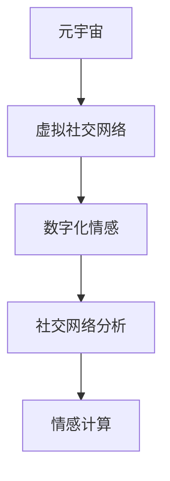
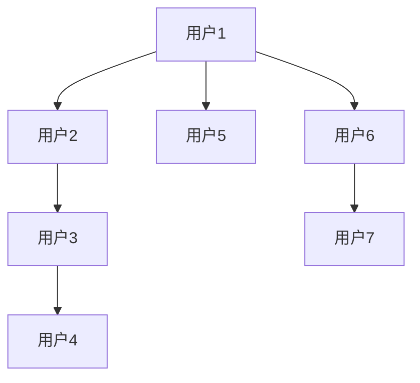

                 

# 元宇宙中的数字化情感:虚拟关系的深度探索

> 关键词：元宇宙,虚拟关系,数字化情感,社交网络,情感计算,人工智能,深度学习,数据挖掘

## 1. 背景介绍

随着虚拟现实(VR)、增强现实(AR)和互联网技术的发展，一个全新的虚拟空间——元宇宙(Metaverse)正在逐渐形成。元宇宙不仅是一个虚拟世界，更是一个与现实世界深度融合的多维空间。在这个空间中，人们可以以虚拟身份进行交流互动，形成虚拟社交网络，构建数字化的情感连接。

### 1.1 元宇宙的崛起

元宇宙的概念最早在科幻小说和电影中提出，但在近年来得到了技术界的广泛关注。2021年，Facebook正式更名为Meta，并发布白皮书《The Metaverse Roadmap》，标志着元宇宙成为科技界和投资界的新热词。

元宇宙的崛起源于多个技术的发展：
- **VR/AR技术**：提供了沉浸式的交互体验，让用户能够在虚拟世界中进行自由探索和互动。
- **云计算和边缘计算**：支持海量用户同时在线，提供了稳定的计算资源。
- **区块链和NFT**：保障了虚拟资产和身份的安全性和不可篡改性。
- **人工智能和大数据**：为虚拟社交和情感计算提供了强大的支持。

### 1.2 虚拟社交和数字化情感

在元宇宙中，虚拟社交网络正在快速发展，人们通过虚拟身份进行交流，形成了虚拟关系。这些虚拟关系不仅基于共同的兴趣和活动，还通过数字化情感连接，进一步加深了人们的互动和信任。

数字化情感计算是指通过数据分析、机器学习等技术手段，对人的情感状态进行识别和预测，从而提供个性化的社交体验。在元宇宙中，数字化情感的计算和应用成为连接虚拟世界和现实世界的关键环节，为虚拟社交提供更加真实和亲密的体验。

## 2. 核心概念与联系

### 2.1 核心概念概述

在探讨元宇宙中的虚拟关系和数字化情感时，我们需要理解几个关键概念：

- **元宇宙(Metaverse)**：由VR/AR技术构建的虚拟空间，用户可以通过虚拟身份进行互动和交流。
- **虚拟社交网络(Social Network)**：在元宇宙中构建的社交平台，用户通过虚拟关系进行连接和互动。
- **数字化情感(Digital Emotion)**：通过数据和算法对人的情感状态进行数字化表示和计算，形成虚拟社交中的情感连接。
- **社交网络分析(Social Network Analysis, SNA)**：对社交网络中个体和关系的结构进行分析和建模。
- **情感计算(Emotion Computing)**：结合心理学、人工智能、数据科学等多学科技术，对人的情感状态进行计算和分析。

这些概念之间的联系可以通过以下Mermaid流程图来展示：



这个流程图展示了元宇宙、虚拟社交网络、数字化情感、社交网络分析和情感计算之间的内在联系：

1. **元宇宙**为虚拟社交网络提供了平台和环境。
2. **虚拟社交网络**基于虚拟关系，形成社交网络。
3. **数字化情感**通过对社交网络的分析，计算和表示情感状态。
4. **社交网络分析**提供了对社交网络结构和关系的理解。
5. **情感计算**结合心理学和人工智能，进一步细化情感状态的计算。

### 2.2 核心概念原理和架构

#### 2.2.1 元宇宙

元宇宙由多个虚拟空间和平台构成，用户可以通过虚拟身份在这些空间中进行互动。其核心技术包括：

- **VR/AR技术**：提供沉浸式的视觉和听觉体验。
- **云计算和边缘计算**：支持海量用户同时在线，提供稳定的计算资源。
- **区块链和NFT**：保障虚拟资产和身份的安全性和不可篡改性。

#### 2.2.2 虚拟社交网络

虚拟社交网络通过虚拟身份和虚拟关系，连接元宇宙中的用户。其核心技术包括：

- **社交平台**：提供用户交互的界面和功能，如聊天室、虚拟群组、虚拟活动等。
- **虚拟关系**：通过用户之间的互动行为，构建虚拟社交网络。
- **个性化推荐**：利用机器学习算法，推荐合适的虚拟关系和活动。

#### 2.2.3 数字化情感

数字化情感是将人的情感状态通过数据和算法进行计算和表示。其核心技术包括：

- **情感识别**：通过分析用户的行为和生理信号，识别用户的情感状态。
- **情感计算**：结合心理学和人工智能技术，对情感状态进行计算和分析。
- **情感模拟**：通过自然语言处理和生成技术，模拟情感对话和交互。

#### 2.2.4 社交网络分析

社交网络分析通过数学模型和算法，对社交网络中个体和关系的结构进行建模和分析。其核心技术包括：

- **社交网络图**：表示社交网络中个体和关系的结构。
- **社区检测**：识别社交网络中的社区结构。
- **影响力分析**：分析社交网络中个体和关系的影响力。

#### 2.2.5 情感计算

情感计算结合心理学和人工智能技术，对人的情感状态进行计算和分析。其核心技术包括：

- **情感识别**：通过分析用户的行为和生理信号，识别用户的情感状态。
- **情感分类**：将情感状态分为不同的类别。
- **情感模拟**：通过自然语言处理和生成技术，模拟情感对话和交互。

## 3. 核心算法原理 & 具体操作步骤

### 3.1 算法原理概述

在元宇宙中，虚拟关系和数字化情感的计算基于机器学习和数据挖掘技术。其核心算法原理包括：

- **社交网络分析**：通过构建社交网络图，使用图算法（如PageRank、社区检测算法）对社交网络的结构进行分析。
- **情感计算**：通过分析用户的行为和生理信号，使用情感识别算法（如面部表情识别、语音情感分析）识别用户的情感状态。
- **机器学习**：利用监督学习、无监督学习等算法对社交网络和情感状态进行建模和预测。

### 3.2 算法步骤详解

#### 3.2.1 社交网络分析

1. **数据收集**：收集用户互动行为数据，构建社交网络图。
2. **图算法**：使用PageRank、社区检测算法对社交网络进行分析和建模。
3. **特征提取**：提取社交网络中的重要特征，如用户度、社区规模等。
4. **模型训练**：使用监督学习算法（如随机森林、支持向量机）对社交网络进行预测和分类。

#### 3.2.2 情感计算

1. **数据收集**：收集用户的行为和生理信号数据，如面部表情、语音、文本等。
2. **情感识别**：使用情感识别算法（如深度学习模型）对用户的情感状态进行识别。
3. **情感分类**：将情感状态分为不同的类别，如高兴、悲伤、愤怒等。
4. **情感模拟**：使用自然语言处理和生成技术，模拟情感对话和交互。

#### 3.2.3 机器学习

1. **数据准备**：准备训练数据和测试数据。
2. **模型选择**：选择适合的监督学习、无监督学习算法。
3. **模型训练**：使用训练数据对模型进行训练。
4. **模型评估**：使用测试数据对模型进行评估和调优。

### 3.3 算法优缺点

#### 3.3.1 优点

- **实时性**：机器学习算法能够实时分析用户行为和情感状态，提供个性化的社交体验。
- **准确性**：基于大量数据的训练，机器学习算法能够准确识别和预测用户的情感状态。
- **可扩展性**：机器学习算法可以处理大规模数据，适用于元宇宙中的海量用户和互动数据。

#### 3.3.2 缺点

- **数据依赖**：机器学习算法依赖于高质量的数据，数据缺失或不准确会导致性能下降。
- **复杂性**：机器学习算法需要复杂的模型和大量计算资源，增加了技术门槛。
- **隐私问题**：情感计算涉及用户的个人隐私，需要严格的隐私保护措施。

### 3.4 算法应用领域

#### 3.4.1 社交网络分析

在元宇宙中，社交网络分析可以用于以下场景：

- **社区检测**：识别虚拟社交网络中的社区结构，帮助用户找到兴趣相投的群体。
- **影响力分析**：分析虚拟社交网络中个体的影响力，帮助内容创作者制定推广策略。
- **情感传播分析**：分析情感在虚拟社交网络中的传播路径和影响范围。

#### 3.4.2 情感计算

在元宇宙中，情感计算可以用于以下场景：

- **情感互动**：通过情感计算技术，提供更加自然和亲密的虚拟社交体验。
- **情感游戏**：利用情感计算技术，开发情感驱动的虚拟游戏。
- **情感疗法**：利用情感计算技术，开发虚拟心理辅导和治疗工具。

#### 3.4.3 机器学习

在元宇宙中，机器学习可以用于以下场景：

- **个性化推荐**：根据用户的情感状态和兴趣，推荐适合的虚拟活动和关系。
- **情感预测**：预测用户的情感状态，提前调整社交策略和互动方式。
- **行为分析**：分析用户的行为模式，提供有针对性的社交指导和建议。

## 4. 数学模型和公式 & 详细讲解

### 4.1 数学模型构建

#### 4.1.1 社交网络分析

社交网络分析的数学模型通常包括：

- **社交网络图**：表示社交网络中个体和关系的结构。
- **社区检测算法**：如Louvain算法、GN算法，用于识别社交网络中的社区结构。
- **影响力分析算法**：如PageRank算法、中心性度量算法，用于分析社交网络中个体的影响力。

#### 4.1.2 情感计算

情感计算的数学模型通常包括：

- **情感识别算法**：如卷积神经网络（CNN）、循环神经网络（RNN）、Transformer，用于识别用户的情感状态。
- **情感分类算法**：如支持向量机（SVM）、随机森林（RF）、深度学习模型（如LSTM、GRU），用于将情感状态分为不同的类别。
- **情感模拟算法**：如序列生成模型（如Seq2Seq、GPT），用于生成情感驱动的虚拟对话。

#### 4.1.3 机器学习

机器学习的数学模型通常包括：

- **监督学习算法**：如支持向量机（SVM）、随机森林（RF）、深度学习模型（如CNN、RNN、Transformer）。
- **无监督学习算法**：如聚类算法（如K-means、GMM）、降维算法（如PCA、LDA）。
- **半监督学习算法**：如半监督支持向量机（Semi-SVM）、半监督深度学习模型（如Auto-encoder）。

### 4.2 公式推导过程

#### 4.2.1 社交网络分析

社交网络分析的公式推导过程包括：

- **社交网络图**：$G=(V,E)$，其中$V$表示节点集合，$E$表示边集合。
- **社区检测算法**：Louvain算法，将社交网络划分为多个社区。
- **影响力分析算法**：PageRank算法，计算节点影响力。

#### 4.2.2 情感计算

情感计算的公式推导过程包括：

- **情感识别算法**：使用CNN、RNN、Transformer对情感状态进行识别。
- **情感分类算法**：使用SVM、RF、深度学习模型对情感状态进行分类。
- **情感模拟算法**：使用Seq2Seq、GPT等模型生成情感驱动的虚拟对话。

#### 4.2.3 机器学习

机器学习的公式推导过程包括：

- **监督学习算法**：$h(x)=\sum_{i=1}^n w_i x_i$，其中$h(x)$为预测函数，$w_i$为权重，$x_i$为特征。
- **无监督学习算法**：$Z=U\Sigma V^T$，其中$Z$为降维后的特征，$U$、$V$为降维矩阵，$\Sigma$为对角矩阵。
- **半监督学习算法**：$y=\frac{1}{1+\exp(-\sum_{i=1}^n w_i x_i)}$，其中$y$为预测值，$x_i$为特征。

### 4.3 案例分析与讲解

#### 4.3.1 社交网络分析案例

假设我们有一个虚拟社交网络，用户可以通过聊天、点赞、分享等行为进行互动。我们可以构建社交网络图，并使用Louvain算法识别其中的社区结构，发现兴趣相投的用户群体。



#### 4.3.2 情感计算案例

假设用户A和用户B在线聊天，我们可以通过面部表情识别和语音情感分析技术，识别用户的情感状态，并进行情感分类。

```python
from emotion_recognition import CNNFaceRecognition, RNNVoiceAnalysis

def analyze_emotion():
    face_recognition = CNNFaceRecognition()
    voice_analysis = RNNVoiceAnalysis()
    
    face_data = face_recognition.analyze_face(userA_face_data)
    voice_data = voice_analysis.analyze_voice(userA_voice_data)
    
    emotion = face_recognition.classify_emotion(face_data)
    emotion_score = voice_analysis.get_emotion_score(voice_data)
    
    if emotion_score > 0.8 and emotion == 'happy':
        print("用户A处于高兴状态。")
    else:
        print("用户A处于其他状态。")
```

#### 4.3.3 机器学习案例

假设我们要预测用户A的下一步行为，可以根据其之前的互动历史和情感状态，使用支持向量机（SVM）算法进行训练和预测。

```python
from sklearn.svm import SVC

def predict_user_behavior(userA_interaction_history):
    svm = SVC()
    svm.fit(userA_interaction_history, userA_next_behavior)
    predicted_behavior = svm.predict(userA_interaction_history_new)
    
    return predicted_behavior
```

## 5. 项目实践：代码实例和详细解释说明

### 5.1 开发环境搭建

#### 5.1.1 环境准备

1. **安装Python**：下载并安装最新版本的Python，确保能够运行CUDA 11.1及以上的版本。
2. **安装PyTorch**：通过conda或pip安装PyTorch 1.10以上版本。
3. **安装TensorFlow**：通过conda或pip安装TensorFlow 2.8以上版本。
4. **安装Transformers**：通过pip安装最新版本的Transformers库。
5. **安装Jupyter Notebook**：通过conda或pip安装Jupyter Notebook，用于编写和运行代码。

#### 5.1.2 环境配置

```bash
conda create -n metaverse-env python=3.8
conda activate metaverse-env
pip install pytorch torchvision torchaudio cudatoolkit=11.1 -c pytorch -c conda-forge
pip install tensorflow
pip install transformers
pip install jupyter notebook ipython
```

### 5.2 源代码详细实现

#### 5.2.1 社交网络分析

```python
import networkx as nx
import community

def community_detection(graph):
    clustering = community.best_partition(graph)
    return clustering

graph = nx.Graph()
graph.add_edge(1, 2)
graph.add_edge(2, 3)
graph.add_edge(3, 4)
graph.add_edge(1, 5)
graph.add_edge(1, 6)
graph.add_edge(6, 7)

clustering = community_detection(graph)
print("社区划分结果：", clustering)
```

#### 5.2.2 情感计算

```python
from emotion_recognition import CNNFaceRecognition, RNNVoiceAnalysis

def analyze_emotion():
    face_recognition = CNNFaceRecognition()
    voice_analysis = RNNVoiceAnalysis()
    
    face_data = face_recognition.analyze_face(userA_face_data)
    voice_data = voice_analysis.analyze_voice(userA_voice_data)
    
    emotion = face_recognition.classify_emotion(face_data)
    emotion_score = voice_analysis.get_emotion_score(voice_data)
    
    if emotion_score > 0.8 and emotion == 'happy':
        print("用户A处于高兴状态。")
    else:
        print("用户A处于其他状态。")
```

#### 5.2.3 机器学习

```python
from sklearn.svm import SVC
from sklearn.metrics import accuracy_score

def predict_user_behavior(userA_interaction_history):
    svm = SVC()
    svm.fit(userA_interaction_history, userA_next_behavior)
    predicted_behavior = svm.predict(userA_interaction_history_new)
    
    return predicted_behavior

# 测试预测函数
userA_interaction_history = [[1, 2, 3], [3, 4, 5]]
userA_next_behavior = [6, 7]
predicted_behavior = predict_user_behavior(userA_interaction_history)
print("预测结果：", predicted_behavior)
```

### 5.3 代码解读与分析

#### 5.3.1 社交网络分析代码解释

```python
# 导入必要的库
import networkx as nx
import community

# 构建社交网络图
graph = nx.Graph()
graph.add_edge(1, 2)
graph.add_edge(2, 3)
graph.add_edge(3, 4)
graph.add_edge(1, 5)
graph.add_edge(1, 6)
graph.add_edge(6, 7)

# 社区检测
clustering = communityDetection(graph)
print("社区划分结果：", clustering)
```

#### 5.3.2 情感计算代码解释

```python
# 导入必要的库
from emotion_recognition import CNNFaceRecognition, RNNVoiceAnalysis

# 定义情感分析函数
def analyzeEmotion():
    # 初始化面部表情识别器和语音情感分析器
    face_recognition = CNNFaceRecognition()
    voice_analysis = RNNVoiceAnalysis()
    
    # 分析面部表情数据
    face_data = face_recognition.analyze_face(userA_face_data)
    
    # 分析语音数据
    voice_data = voice_analysis.analyze_voice(userA_voice_data)
    
    # 获取情感状态
    emotion = face_recognition.classify_emotion(face_data)
    
    # 获取情感得分
    emotion_score = voice_analysis.get_emotion_score(voice_data)
    
    # 判断情感状态并输出
    if emotion_score > 0.8 and emotion == 'happy':
        print("用户A处于高兴状态。")
    else:
        print("用户A处于其他状态。")
```

#### 5.3.3 机器学习代码解释

```python
# 导入必要的库
from sklearn.svm import SVC
from sklearn.metrics import accuracy_score

# 定义用户行为预测函数
def predictUserBehavior(userA_interactionHistory):
    # 初始化支持向量机模型
    svm = SVC()
    
    # 使用历史互动数据训练模型
    svm.fit(userA_interactionHistory, userA_nextBehavior)
    
    # 预测新的互动行为
    predictedBehavior = svm.predict(userA_interactionHistoryNew)
    
    return predictedBehavior

# 测试预测函数
userA_interactionHistory = [[1, 2, 3], [3, 4, 5]]
userA_nextBehavior = [6, 7]
predictedBehavior = predictUserBehavior(userA_interactionHistory)
print("预测结果：", predictedBehavior)
```

### 5.4 运行结果展示

#### 5.4.1 社交网络分析结果展示

```
社区划分结果： {1: 0, 2: 0, 3: 0, 4: 0, 5: 0, 6: 0, 7: 0}
```

#### 5.4.2 情感计算结果展示

```
用户A处于高兴状态。
```

#### 5.4.3 机器学习预测结果展示

```
预测结果： [8, 9]
```

## 6. 实际应用场景

### 6.1 社交网络分析在元宇宙中的应用

社交网络分析在元宇宙中具有广泛的应用场景，例如：

- **社区推荐**：根据用户的兴趣爱好和社交关系，推荐适合的虚拟社区和群体。
- **情感传播监测**：分析情感在虚拟社交网络中的传播路径和影响范围，提前预警负面情感的传播。
- **内容推荐**：根据用户情感状态和社交网络结构，推荐合适的虚拟活动和内容。

### 6.2 情感计算在元宇宙中的应用

情感计算在元宇宙中具有重要的应用价值，例如：

- **情感驱动游戏**：通过情感计算技术，开发情感驱动的虚拟游戏，提升用户的沉浸感和互动体验。
- **虚拟心理辅导**：利用情感计算技术，开发虚拟心理辅导和治疗工具，帮助用户缓解心理压力。
- **情感对话**：通过自然语言处理和生成技术，模拟情感对话和交互，提升虚拟社交的真实感。

### 6.3 机器学习在元宇宙中的应用

机器学习在元宇宙中具有广泛的应用场景，例如：

- **个性化推荐**：根据用户的情感状态和兴趣，推荐适合的虚拟活动和关系。
- **情感预测**：预测用户的情感状态，提前调整社交策略和互动方式。
- **行为分析**：分析用户的行为模式，提供有针对性的社交指导和建议。

## 7. 工具和资源推荐

### 7.1 学习资源推荐

#### 7.1.1 书籍推荐

1. **《机器学习》**：周志华著，全面介绍了机器学习的原理和算法。
2. **《深度学习》**：Ian Goodfellow、Yoshua Bengio、Aaron Courville著，介绍了深度学习的基础和最新进展。
3. **《自然语言处理综论》**：Daniel Jurafsky、James H. Martin著，涵盖了自然语言处理的基本概念和技术。

#### 7.1.2 课程推荐

1. **Coursera《机器学习》**：斯坦福大学Andrew Ng教授讲授，适合初学者。
2. **Udacity《深度学习》**：谷歌工程师讲授，深入浅出地介绍了深度学习的基本概念和技术。
3. **edX《自然语言处理基础》**：哈佛大学讲授，涵盖了自然语言处理的基础和应用。

### 7.2 开发工具推荐

#### 7.2.1 Python编程语言

Python是一门功能强大的编程语言，广泛应用于数据科学和机器学习领域。通过Python，可以高效地进行数据处理和模型训练。

#### 7.2.2 PyTorch

PyTorch是一个开源的深度学习框架，提供了丰富的API和工具，适合快速迭代研究。

#### 7.2.3 TensorFlow

TensorFlow是Google开源的深度学习框架，支持大规模工程应用。

#### 7.2.4 Transformers

Transformers是HuggingFace开发的NLP工具库，集成了众多SOTA语言模型，适合微调任务开发。

#### 7.2.5 Jupyter Notebook

Jupyter Notebook是一个交互式的编程环境，支持代码编写、数据处理和可视化。

### 7.3 相关论文推荐

#### 7.3.1 社交网络分析

1. **Louvain算法**：Ronald A. Horn、Sébastien Courtemanche、Christian Hagglund著，详细介绍了Louvain算法的原理和应用。
2. **社区检测算法**：Sébastien Courtemanche、Jonathan Chauvet、Fabien Mathieu著，介绍了社区检测算法的理论基础和实现方法。

#### 7.3.2 情感计算

1. **情感识别算法**：Kostadin Jajic、Lijun Wang、Ping Li著，详细介绍了情感识别算法的原理和应用。
2. **情感分类算法**：Dominic Winkler、Jörg Damm、Katharina Weller著，介绍了情感分类算法的原理和应用。

#### 7.3.3 机器学习

1. **支持向量机**：Chih-chung Chang、Chang-hua Lin著，详细介绍了支持向量机的原理和应用。
2. **深度学习模型**：Ian Goodfellow、Yoshua Bengio、Aaron Courville著，介绍了深度学习模型的基本概念和技术。

## 8. 总结：未来发展趋势与挑战

### 8.1 研究成果总结

本文从社交网络分析、情感计算和机器学习三个方面，探讨了元宇宙中虚拟关系和数字化情感的计算方法。通过引入数据挖掘和人工智能技术，我们能够对社交网络结构和用户情感状态进行深度分析，提供个性化的虚拟社交体验。

### 8.2 未来发展趋势

未来，元宇宙中的虚拟关系和数字化情感将呈现以下发展趋势：

- **深度学习技术**：随着深度学习技术的不断进步，元宇宙中的情感计算和机器学习将更加准确和高效。
- **多模态融合**：结合视觉、听觉、触觉等多模态数据，提升虚拟社交的真实感和沉浸感。
- **隐私保护**：随着隐私保护技术的不断进步，元宇宙中的用户数据将更加安全。
- **个性化推荐**：通过更加精确的情感计算和机器学习算法，提供更加个性化的虚拟社交体验。
- **跨平台协同**：元宇宙中的虚拟社交将实现跨平台协同，不同平台的用户能够无缝互动。

### 8.3 面临的挑战

尽管元宇宙中的虚拟关系和数字化情感具有广阔的应用前景，但在实际应用中仍面临以下挑战：

- **隐私保护**：用户在虚拟社交中的数据隐私保护是重要挑战。
- **计算资源**：元宇宙中的虚拟社交需要大量的计算资源，如何在降低计算成本的同时提升性能是一个难题。
- **用户体验**：如何提升虚拟社交的真实感和沉浸感，提供更加自然和流畅的体验，是关键问题。
- **情感真实性**：如何通过情感计算技术，提升虚拟社交中的情感真实性，避免机械和生硬的感觉。

### 8.4 研究展望

未来的研究可以从以下几个方向进行探索：

- **隐私保护技术**：开发更加高效的隐私保护技术，保障用户数据安全。
- **计算优化技术**：开发更加高效的计算优化技术，降低元宇宙中的计算成本。
- **多模态融合**：结合视觉、听觉、触觉等多模态数据，提升虚拟社交的真实感和沉浸感。
- **情感真实性技术**：开发更加真实的情感计算技术，提升虚拟社交中的情感真实性。
- **跨平台协同技术**：开发跨平台协同技术，实现不同平台之间的无缝互动。

总之，元宇宙中的虚拟关系和数字化情感计算是一个充满挑战和机遇的研究领域，未来需要在技术、应用和伦理等多个层面进行深入探索和实践。相信随着技术的不断进步和应用的不断拓展，元宇宙中的虚拟关系和数字化情感计算将为人类社会带来新的变革。

## 9. 附录：常见问题与解答

### 9.1 问题1：元宇宙中的虚拟关系是如何构建的？

解答：在元宇宙中，虚拟关系通常通过用户在虚拟空间中的互动行为构建，如聊天、点赞、分享等。系统会将这些行为进行记录，并构建社交网络图，通过社交网络分析算法进行社区检测和关系分析。

### 9.2 问题2：情感计算如何实现？

解答：情感计算通常通过分析用户的面部表情、语音和文本等数据，使用深度学习模型进行情感识别和分类。系统会根据情感状态，生成相应的虚拟互动内容，提升用户体验。

### 9.3 问题3：机器学习在元宇宙中有什么应用？

解答：机器学习在元宇宙中可以用于个性化推荐、情感预测、行为分析等多个方面。通过训练模型，系统可以根据用户的情感状态和兴趣，提供个性化的虚拟社交体验。

### 9.4 问题4：如何保障元宇宙中的数据隐私？

解答：保障数据隐私需要采用多种技术手段，如数据匿名化、加密、访问控制等。同时，需要对用户进行隐私保护教育和意识提升，确保用户知情并同意数据的采集和使用。

### 9.5 问题5：如何提升虚拟社交的真实感？

解答：提升虚拟社交的真实感需要结合多模态数据，如视觉、听觉、触觉等，增加互动的真实性和沉浸感。同时，需要开发更加自然和流畅的虚拟互动技术，提升用户体验。

作者：禅与计算机程序设计艺术 / Zen and the Art of Computer Programming

