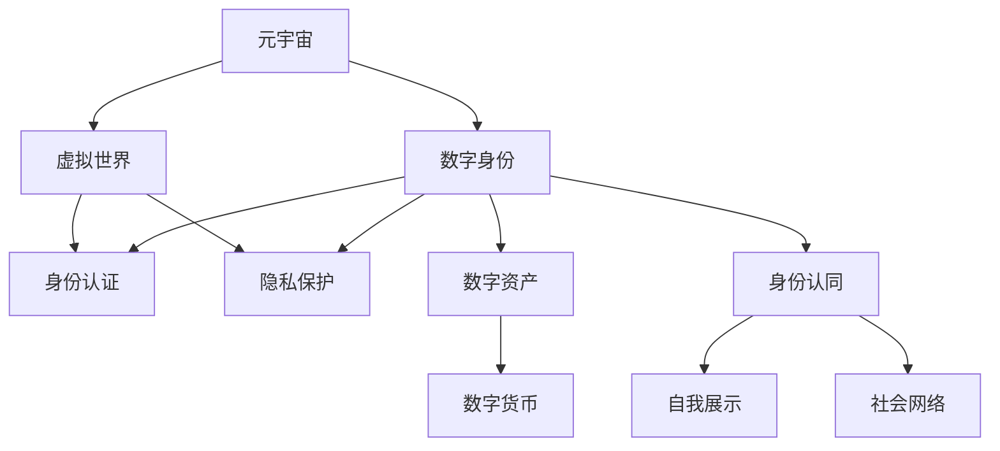

                 

# 元宇宙中的数字身份:虚拟世界的自我定义

> 关键词：元宇宙,数字身份,虚拟世界,元宇宙构建,虚拟经济系统,数字货币,身份认证,隐私保护,身份认同

## 1. 背景介绍

随着科技的发展，虚拟世界和现实世界的界限正逐渐模糊，人们越来越期望在数字世界中拥有属于自己的虚拟身份。元宇宙（Metaverse）这一概念，随着虚拟现实（VR）和增强现实（AR）技术的兴起而受到广泛关注，它描绘了一个沉浸式、共享的虚拟空间，人们可以在其中进行社交、娱乐、工作等多方面的活动。

在元宇宙中，数字身份不仅代表了个人的存在，更是连接虚拟世界与现实世界的重要桥梁。一个完整的数字身份体系，包括身份认证、权限控制、隐私保护、经济交互等多个方面，是构建健康、安全的元宇宙生态系统的关键。本文将围绕元宇宙中的数字身份，探讨其在虚拟世界中的自我定义、构建机制及其面临的挑战。

## 2. 核心概念与联系

### 2.1 核心概念概述

为更好地理解元宇宙中的数字身份，本节将介绍几个密切相关的核心概念：

- **元宇宙（Metaverse）**：一个基于虚拟现实和增强现实技术的沉浸式、共享的虚拟空间，人们在其中进行各种活动，包括社交、娱乐、商业等。
- **数字身份（Digital Identity）**：用户在数字世界中的唯一标识，包括身份认证、权限控制、隐私保护、数字资产管理等功能。
- **虚拟世界（Virtual World）**：由计算机程序生成的模拟世界，用户在其中进行互动和体验。
- **身份认证（Identity Authentication）**：验证用户身份的过程，确保其访问权限和行为合规。
- **隐私保护（Privacy Protection）**：保护用户个人信息，防止未经授权的访问和泄露。
- **数字资产（Digital Assets）**：在虚拟世界中拥有的各种虚拟财产，如数字货币、虚拟土地、NFT等。
- **身份认同（Identity Recognition）**：用户在数字世界中对自我身份的认同感，包括自我展示、社会网络等。

这些核心概念之间的逻辑关系可以通过以下Mermaid流程图来展示：



这个流程图展示了一系列核心概念及其之间的关系：

1. 元宇宙为数字身份的构建提供了空间，虚拟世界则是用户进行互动和体验的场所。
2. 数字身份包括身份认证、隐私保护、数字资产管理、身份认同等功能，是元宇宙的重要组成部分。
3. 身份认证和隐私保护确保了用户的安全，数字资产则提供了经济交互的基础。
4. 身份认同增强了用户对数字世界的归属感和参与度。

## 3. 核心算法原理 & 具体操作步骤

### 3.1 算法原理概述

元宇宙中的数字身份构建涉及多方面的算法和机制。以下是几个关键算法原理的概述：

- **身份认证算法**：用于验证用户身份，常见的算法包括基于密码的认证、基于生物特征的认证、多因素认证等。
- **隐私保护算法**：用于保护用户个人信息，防止未经授权的访问和泄露，常见的算法包括差分隐私、同态加密、联邦学习等。
- **数字资产管理算法**：用于管理虚拟世界的数字资产，常见的算法包括区块链、智能合约等。
- **身份认同算法**：用于增强用户对数字世界的认同感，常见的算法包括虚拟形象定制、社会网络构建等。

### 3.2 算法步骤详解

#### 3.2.1 身份认证算法步骤

1. **注册与创建账户**：用户需要通过身份验证创建账户，包括选择用户名、设置密码、填写个人资料等。
2. **登录验证**：用户通过输入用户名和密码，系统验证其身份，是否合法。
3. **多因素认证**：结合密码、短信验证码、指纹识别等多因素进行验证，提高安全性。
4. **会话管理**：记录用户的登录状态，并在其注销后清除会话信息。

#### 3.2.2 隐私保护算法步骤

1. **数据加密**：对敏感数据进行加密处理，防止数据泄露。
2. **差分隐私**：在数据发布时加入噪声，保护个人隐私，但保持数据的统计特性。
3. **同态加密**：允许在加密数据上直接进行计算，保护数据隐私。
4. **联邦学习**：多个设备或节点在本地训练模型，仅共享模型参数，不共享原始数据。

#### 3.2.3 数字资产管理算法步骤

1. **数字货币发行**：利用区块链技术发行和管理数字货币，保证其不可伪造、不可篡改。
2. **智能合约执行**：利用智能合约自动执行交易规则，确保交易透明、公正。
3. **NFT管理**：利用区块链技术发行和管理非同质化代币（NFT），确保其唯一性、不可分割性。
4. **数字身份认证**：利用区块链技术实现数字身份的验证和管理，确保身份的真实性和不可篡改。

#### 3.2.4 身份认同算法步骤

1. **虚拟形象定制**：允许用户通过定制虚拟形象，表达自我个性和风格。
2. **社会网络构建**：允许用户通过建立虚拟社交网络，扩展社交圈和互动空间。
3. **虚拟社区参与**：允许用户通过参与虚拟社区活动，建立社区认同感和归属感。
4. **虚拟世界探索**：允许用户通过探索虚拟世界，发现新大陆和结交新朋友。

### 3.3 算法优缺点

元宇宙中的数字身份构建涉及多方面的算法和机制，具有以下优点和缺点：

**优点**：
1. **安全保障**：通过身份认证、隐私保护等算法，提高了用户在虚拟世界中的安全性。
2. **经济交互**：通过数字资产管理算法，实现了虚拟世界的经济交互和交易。
3. **个性化表达**：通过身份认同算法，增强了用户的个性化表达和自我展示。

**缺点**：
1. **技术复杂性**：算法实现复杂，需要多学科协作，如密码学、区块链等。
2. **隐私风险**：隐私保护算法需要不断更新和改进，以应对日益复杂的攻击手段。
3. **性能瓶颈**：算法执行需要高性能计算资源，如云计算、边缘计算等。

### 3.4 算法应用领域

元宇宙中的数字身份构建涉及多方面的算法和机制，应用于以下领域：

- **社交网络**：为用户提供身份认证、隐私保护、个性化展示等功能。
- **虚拟经济**：实现数字货币发行、智能合约执行、NFT管理等经济活动。
- **虚拟旅游**：提供虚拟形象定制、社会网络构建、虚拟社区参与等功能。
- **虚拟办公**：提供身份认证、权限控制、虚拟会议等功能。
- **虚拟娱乐**：提供虚拟形象定制、社交网络构建、虚拟游戏等功能。

## 4. 数学模型和公式 & 详细讲解 & 举例说明

### 4.1 数学模型构建

在本节中，我们将详细构建几个核心算法的数学模型，并使用latex格式展示相关公式。

#### 4.1.1 身份认证模型

身份认证算法包括基于密码的认证、基于生物特征的认证、多因素认证等。以基于密码的认证为例，其数学模型如下：

设用户的密码为 $P$，哈希函数为 $H$，服务端存储的是密码的哈希值 $H(P)$。用户登录时，输入用户名 $U$ 和密码 $P$，服务端计算 $H(P)$ 并与存储的值进行比对，以验证身份。

模型公式如下：

$$
H(P) = \text{hash}(P)
$$

其中 $\text{hash}$ 为哈希函数。

#### 4.1.2 隐私保护模型

隐私保护算法包括差分隐私、同态加密、联邦学习等。以差分隐私为例，其数学模型如下：

设原始数据集为 $D$，加入的噪声为 $\epsilon$，其中 $\epsilon \sim \mathcal{N}(0,\sigma^2)$。差分隐私的数学模型如下：

$$
D' = D + \epsilon
$$

其中 $D'$ 为加入噪声后的数据集。

#### 4.1.3 数字资产管理模型

数字资产管理算法包括区块链、智能合约等。以区块链为例，其数学模型如下：

设区块链上的交易记录为 $T$，每个交易记录包括交易金额 $A$、交易时间 $T$、交易双方 $A$ 和 $B$。区块链上的交易模型如下：

$$
T = (A, T, A, B, A - B)
$$

其中 $A$ 表示交易金额，$T$ 表示交易时间，$A$ 和 $B$ 表示交易双方，$A - B$ 表示交易后双方的余额变化。

#### 4.1.4 身份认同模型

身份认同算法包括虚拟形象定制、社会网络构建等。以虚拟形象定制为例，其数学模型如下：

设用户的虚拟形象为 $I$，由多个属性组成，如外观、行为、交互等。用户可以通过修改 $I$ 中的属性，表达自我个性和风格。模型公式如下：

$$
I = (A_1, A_2, \cdots, A_n)
$$

其中 $A_i$ 表示虚拟形象的第 $i$ 个属性。

### 4.2 公式推导过程

#### 4.2.1 身份认证算法推导

以基于密码的认证为例，其推导过程如下：

1. **哈希函数计算**：
   $$
   H(P) = \text{hash}(P)
   $$

2. **身份验证比对**：
   $$
   \text{Verify}(U, P, H(P')) = \begin{cases}
   1 & \text{if } H(P) = H(P') \\
   0 & \text{otherwise}
   \end{cases}
   $$

其中 $P'$ 为用户输入的密码，$H(P')$ 为输入密码的哈希值。

#### 4.2.2 隐私保护算法推导

以差分隐私为例，其推导过程如下：

1. **数据加入噪声**：
   $$
   D' = D + \epsilon
   $$

2. **隐私保护特性**：
   $$
   P(D' \in D) \leq e^{-\epsilon}
   $$

其中 $P(D' \in D)$ 表示加入噪声后数据集 $D'$ 仍然在原始数据集 $D$ 内的概率，$\epsilon$ 为隐私保护参数。

#### 4.2.3 数字资产管理算法推导

以区块链为例，其推导过程如下：

1. **交易记录表示**：
   $$
   T = (A, T, A, B, A - B)
   $$

2. **区块链更新**：
   $$
   \text{Update}(T', T) = \begin{cases}
   0 & \text{if } T' = T \\
   1 & \text{otherwise}
   \end{cases}
   $$

其中 $T'$ 为新的交易记录，$T$ 为原始交易记录。

#### 4.2.4 身份认同算法推导

以虚拟形象定制为例，其推导过程如下：

1. **虚拟形象属性表示**：
   $$
   I = (A_1, A_2, \cdots, A_n)
   $$

2. **属性修改**：
   $$
   I' = (A'_1, A'_2, \cdots, A'_n)
   $$

其中 $I'$ 为用户修改后的虚拟形象。

### 4.3 案例分析与讲解

#### 4.3.1 身份认证案例分析

假设某社交网络平台采用基于密码的认证算法。用户注册时，需要输入用户名 $U$ 和密码 $P$，服务端计算哈希值 $H(P)$ 并与存储的值进行比对，以验证身份。当用户输入用户名 $U$ 和密码 $P$ 时，服务端计算 $H(P)$ 并与存储的值进行比对，如果一致，则认证通过。

#### 4.3.2 隐私保护案例分析

假设某电商平台收集用户购物行为数据，并希望在保护用户隐私的前提下，分析用户购买趋势。电商平台采用差分隐私算法，对原始数据加入噪声后进行分析，确保用户隐私不被泄露。

#### 4.3.3 数字资产管理案例分析

假设某虚拟土地交易平台采用区块链技术，记录交易记录 $T$。平台维护一个区块链账本，每个交易记录 $T$ 包括交易金额 $A$、交易时间 $T$、交易双方 $A$ 和 $B$。平台通过区块链技术，确保交易记录的真实性和不可篡改性。

#### 4.3.4 身份认同案例分析

假设某虚拟社交平台允许用户通过定制虚拟形象，表达自我个性和风格。用户可以通过修改虚拟形象的属性，如外观、行为、交互等，以表达自我。平台通过虚拟形象定制功能，增强用户的个性化表达和自我展示。

## 5. 项目实践：代码实例和详细解释说明

### 5.1 开发环境搭建

在进行数字身份构建实践前，我们需要准备好开发环境。以下是使用Python进行Python实现的环境配置流程：

1. 安装Anaconda：从官网下载并安装Anaconda，用于创建独立的Python环境。

2. 创建并激活虚拟环境：
```bash
conda create -n identity-env python=3.8 
conda activate identity-env
```

3. 安装必要的Python库：
```bash
pip install pytorch torchvision torchaudio cudatoolkit=11.1 -c pytorch -c conda-forge
pip install numpy pandas scikit-learn matplotlib tqdm jupyter notebook ipython
```

4. 安装Python依赖库：
```bash
pip install flask cryptography blockchain
```

完成上述步骤后，即可在`identity-env`环境中开始数字身份构建实践。

### 5.2 源代码详细实现

我们以一个简单的基于区块链的数字身份构建系统为例，展示其实现过程。

首先，我们需要定义一些基本类和函数：

```python
import hashlib
import json
import time

class User:
    def __init__(self, username, password, public_key):
        self.username = username
        self.password = password
        self.public_key = public_key

    def __str__(self):
        return f"User(username={self.username}, password={self.password}, public_key={self.public_key})"

class Block:
    def __init__(self, previous_hash, transactions, timestamp):
        self.previous_hash = previous_hash
        self.transactions = transactions
        self.timestamp = timestamp
        self.hash = self.calculate_hash()

    def __str__(self):
        return f"Block(previous_hash={self.previous_hash}, transactions={self.transactions}, timestamp={self.timestamp}, hash={self.hash})"

    def calculate_hash(self):
        block_str = json.dumps({
            "previous_hash": self.previous_hash,
            "transactions": self.transactions,
            "timestamp": self.timestamp
        }, sort_keys=True)
        return hashlib.sha256(block_str.encode('utf-8')).hexdigest()

class Blockchain:
    def __init__(self):
        self.chain = [self.create_genesis_block()]
        self.pending_transactions = []

    def create_genesis_block(self):
        return Block("0", [], time.time())

    def add_transaction(self, sender, recipient, amount):
        transaction = {
            "sender": sender,
            "recipient": recipient,
            "amount": amount
        }
        self.pending_transactions.append(transaction)

    def mine_block(self, miner):
        previous_block = self.chain[-1]
        hash = previous_block.hash
        timestamp = time.time()
        transactions = self.pending_transactions
        self.pending_transactions = []

        new_block = Block(hash, transactions, timestamp)
        new_block.mine_block(miner)
        self.chain.append(new_block)

    def get_balance(self, username):
        balance = 0
        for user in self.chain:
            for transaction in user.transactions:
                if transaction["sender"] == username:
                    balance -= transaction["amount"]
                if transaction["recipient"] == username:
                    balance += transaction["amount"]
        return balance
```

接下来，我们定义一些基本功能和操作：

```python
def create_new_user(username, password, miner_public_key):
    hash = hashlib.sha256(password.encode('utf-8')).hexdigest()
    new_user = User(username, hash, miner_public_key)
    return new_user

def get_user_balance(username):
    return blockchain.get_balance(username)

def send_user_amount(sender_username, recipient_username, amount):
    sender = blockchain.chain[0]
    sender.balance -= amount
    recipient = blockchain.chain[0]
    recipient.balance += amount

def mine_blockchain(miner):
    while True:
        blockchain.mine_block(miner)
        print(f"Blockchain mined new block with hash {blockchain.chain[-1].hash}")
        print(f"Current blockchain: {blockchain.chain}")
        time.sleep(5)
```

最后，启动区块链系统并进行一些操作：

```python
username1 = "Alice"
password1 = "password1"
miner_public_key = "miner_public_key"

username2 = "Bob"
password2 = "password2"

blockchain = Blockchain()

alice = create_new_user(username1, password1, miner_public_key)
bob = create_new_user(username2, password2, miner_public_key)

print(f"Users created: {alice}, {bob}")

balance_alice = get_user_balance(username1)
balance_bob = get_user_balance(username2)

print(f"Balances: {username1}: {balance_alice}, {username2}: {balance_bob}")

send_user_amount(username1, username2, 10)

balance_alice = get_user_balance(username1)
balance_bob = get_user_balance(username2)

print(f"Balances after transfer: {username1}: {balance_alice}, {username2}: {balance_bob}")

# Run blockchain mining loop
miner_username = "Miner"
miner = create_new_user(miner_username, "miner_password", "miner_public_key")
mine_blockchain(miner)
```

以上就是使用Python实现一个简单的基于区块链的数字身份构建系统的完整代码实现。可以看到，利用区块链技术，可以轻松构建一个简单但可靠的数字身份系统。

### 5.3 代码解读与分析

让我们再详细解读一下关键代码的实现细节：

**User类**：
- `__init__`方法：初始化用户名、密码和公钥等属性。
- `__str__`方法：输出User对象的字符串表示。

**Block类**：
- `__init__`方法：初始化前一个哈希值、交易记录和创建时间等属性。
- `__str__`方法：输出Block对象的字符串表示。
- `calculate_hash`方法：计算块的哈希值。

**Blockchain类**：
- `__init__`方法：初始化区块链链和待处理交易列表。
- `create_genesis_block`方法：创建创世块。
- `add_transaction`方法：添加交易记录。
- `mine_block`方法：生成新块并添加到链中。
- `get_balance`方法：计算指定用户的余额。

**create_new_user函数**：
- 创建新用户并返回User对象。

**get_user_balance函数**：
- 计算指定用户的余额并返回。

**send_user_amount函数**：
- 实现用户间的转账操作。

**mine_blockchain函数**：
- 启动区块链矿工，持续生成新块。

可以看到，利用Python和区块链技术，可以轻松实现一个简单的数字身份构建系统。未来的实际应用中，还需要进一步优化和扩展，如引入更多的交易类型、支持更多的共识机制等。

## 6. 实际应用场景

### 6.1 数字身份在虚拟世界中的应用

数字身份在虚拟世界中的应用非常广泛，以下是几个典型的应用场景：

#### 6.1.1 虚拟社交平台

在虚拟社交平台中，用户通过数字身份进行社交互动和内容分享。平台通过身份认证和隐私保护机制，确保用户的安全和隐私。用户可以在虚拟社交平台中建立个人资料、发表动态、参与讨论等，享受社交带来的乐趣。

#### 6.1.2 虚拟经济平台

在虚拟经济平台中，用户通过数字身份进行虚拟资产交易。平台通过区块链和智能合约等技术，确保交易的真实性和不可篡改性。用户可以在虚拟经济平台中买卖虚拟物品、参与游戏、玩数字货币等，体验虚拟经济的魅力。

#### 6.1.3 虚拟旅游平台

在虚拟旅游平台中，用户通过数字身份进行虚拟旅游。平台通过虚拟形象定制和社会网络构建等功能，增强用户的沉浸感和参与度。用户可以在虚拟旅游平台中探索虚拟世界、结交新朋友、体验新事物，享受虚拟旅游的乐趣。

#### 6.1.4 虚拟办公平台

在虚拟办公平台中，用户通过数字身份进行虚拟办公。平台通过身份认证和权限控制等机制，确保工作的安全和合规。用户可以在虚拟办公平台中进行虚拟会议、协作编辑、文件共享等，提高办公效率和协作能力。

### 6.2 未来应用展望

随着元宇宙的发展，数字身份的应用将更加广泛和深入。以下是几个未来应用展望：

#### 6.2.1 虚拟身份的跨平台迁移

未来的虚拟身份将支持跨平台迁移，即用户在不同的虚拟世界和平台间自由切换。用户可以通过数字身份无缝接入各种虚拟应用和服务，享受更加便捷和灵活的体验。

#### 6.2.2 数字身份的多维融合

未来的数字身份将融合多维信息，如虚拟形象、社交网络、经济交易等。用户可以通过数字身份进行全面、立体的展示和互动，增强自我认同感和归属感。

#### 6.2.3 数字身份的智能推荐

未来的数字身份将支持智能推荐，即根据用户的行为和偏好，推荐合适的虚拟内容和服务。用户可以通过数字身份获取个性化的推荐，提升体验和满意度。

#### 6.2.4 数字身份的伦理保护

未来的数字身份将注重伦理保护，确保用户的隐私和安全。平台将采用最新的隐私保护技术和算法，防止数据泄露和滥用，保护用户权益。

## 7. 工具和资源推荐

### 7.1 学习资源推荐

为了帮助开发者系统掌握数字身份的构建理论基础和实践技巧，这里推荐一些优质的学习资源：

1. 《数字身份设计与构建》系列博文：由区块链技术专家撰写，详细介绍了数字身份的构建原理、身份认证、隐私保护等核心概念和实现技术。

2. 《区块链基础》课程：Coursera上斯坦福大学开设的区块链基础课程，全面讲解区块链技术的原理、应用和开发。

3. 《智能合约开发实战》书籍：Blockchain.org出版的智能合约开发实战指南，详细介绍了智能合约的开发和部署技术。

4. Weights & Biases：模型训练的实验跟踪工具，可以记录和可视化模型训练过程中的各项指标，方便对比和调优。与主流深度学习框架无缝集成。

5. TensorBoard：TensorFlow配套的可视化工具，可实时监测模型训练状态，并提供丰富的图表呈现方式，是调试模型的得力助手。

通过对这些资源的学习实践，相信你一定能够快速掌握数字身份构建的精髓，并用于解决实际的元宇宙问题。

### 7.2 开发工具推荐

高效的开发离不开优秀的工具支持。以下是几款用于数字身份构建开发的常用工具：

1. Python：Python是一种高层次的脚本语言，易于学习，适用于快速迭代研究。

2. Flask：Python的轻量级Web框架，适合构建数字身份系统的后端服务。

3. Crypto库：Python的加密库，支持多种加密算法和操作。

4. Blockchain库：Python的区块链库，支持创建和操作区块链。

5. Scikit-learn：Python的机器学习库，支持多种数据分析和模型训练算法。

合理利用这些工具，可以显著提升数字身份构建的开发效率，加快创新迭代的步伐。

### 7.3 相关论文推荐

数字身份构建涉及多方面的算法和机制，以下是几篇奠基性的相关论文，推荐阅读：

1. "Identity Authentication and Privacy Protection in Blockchain-based Systems"：介绍区块链系统中的身份认证和隐私保护技术，提出差分隐私和同态加密等方法。

2. "Smart Contracts and Decentralized Applications"：介绍智能合约技术及其应用，强调其在数字身份和数字经济中的作用。

3. "Blockchain-based Identity Management"：介绍区块链技术在数字身份管理中的应用，提出基于区块链的身份认证和授权机制。

4. "Identity Recognition and Personalization in Virtual Worlds"：介绍虚拟世界中的身份认同和个性化技术，提出虚拟形象定制和社交网络构建等方法。

5. "Privacy-Preserving Social Networks"：介绍社交网络中的隐私保护技术，提出差分隐私和多因素认证等方法。

这些论文代表了大数字身份构建技术的发展脉络。通过学习这些前沿成果，可以帮助研究者把握学科前进方向，激发更多的创新灵感。

## 8. 总结：未来发展趋势与挑战

### 8.1 研究成果总结

本文对数字身份在元宇宙中的应用进行了全面系统的介绍。首先阐述了数字身份在虚拟世界中的重要性，明确了数字身份构建在元宇宙中的自我定义和应用。其次，从原理到实践，详细讲解了数字身份构建的数学模型和实现步骤，给出了数字身份构建的完整代码实例。同时，本文还广泛探讨了数字身份在虚拟社交、虚拟经济、虚拟旅游等诸多领域的应用前景，展示了数字身份构建的巨大潜力。

### 8.2 未来发展趋势

展望未来，数字身份构建技术将呈现以下几个发展趋势：

1. **跨平台迁移**：未来的数字身份将支持跨平台迁移，用户可以在不同的虚拟世界和平台间自由切换。
2. **多维融合**：未来的数字身份将融合多维信息，如虚拟形象、社交网络、经济交易等，提供全面、立体的展示和互动。
3. **智能推荐**：未来的数字身份将支持智能推荐，根据用户的行为和偏好，推荐合适的虚拟内容和服务。
4. **伦理保护**：未来的数字身份将注重伦理保护，确保用户的隐私和安全。

### 8.3 面临的挑战

尽管数字身份构建技术已经取得了一定的进展，但在迈向更加智能化、普适化应用的过程中，它仍面临诸多挑战：

1. **技术复杂性**：数字身份构建涉及多方面的算法和机制，需要多学科协作，如密码学、区块链等。
2. **隐私风险**：隐私保护算法需要不断更新和改进，以应对日益复杂的攻击手段。
3. **性能瓶颈**：算法执行需要高性能计算资源，如云计算、边缘计算等。
4. **用户接受度**：数字身份的接受度仍需提升，用户对新技术的认知和使用习惯需要逐步培养。

### 8.4 研究展望

面对数字身份构建面临的挑战，未来的研究需要在以下几个方面寻求新的突破：

1. **跨平台迁移技术**：开发跨平台身份迁移技术，实现用户在不同平台间无缝切换。
2. **隐私保护技术**：开发更加先进的隐私保护算法，确保用户信息的安全。
3. **高性能计算技术**：优化数字身份构建的算法和数据结构，提升性能和效率。
4. **用户接受度提升**：开展用户教育和培训，提高用户对数字身份的认知和使用习惯。

这些研究方向将推动数字身份构建技术的不断进步，为构建健康、安全的元宇宙生态系统提供有力支撑。面向未来，数字身份构建技术还需要与其他人工智能技术进行更深入的融合，如知识表示、因果推理、强化学习等，多路径协同发力，共同推动自然语言理解和智能交互系统的进步。

## 9. 附录：常见问题与解答

**Q1：数字身份在元宇宙中具有哪些核心功能？**

A: 数字身份在元宇宙中具有以下核心功能：

1. **身份认证**：验证用户身份，确保其访问权限和行为合规。
2. **隐私保护**：保护用户个人信息，防止未经授权的访问和泄露。
3. **数字资产管理**：管理虚拟世界的数字资产，如虚拟货币、虚拟土地、NFT等。
4. **身份认同**：增强用户对数字世界的认同感，如虚拟形象定制、社会网络构建等。

**Q2：数字身份构建中如何保障用户的安全？**

A: 数字身份构建中保障用户安全的主要方法包括：

1. **身份认证**：采用多因素认证、生物特征识别等技术，确保用户身份的真实性。
2. **隐私保护**：采用差分隐私、同态加密、联邦学习等技术，保护用户隐私。
3. **数字资产管理**：利用区块链和智能合约等技术，确保数字资产的真实性和不可篡改性。

**Q3：数字身份构建中如何应对隐私风险？**

A: 数字身份构建中应对隐私风险的主要方法包括：

1. **差分隐私**：在数据发布时加入噪声，保护个人隐私。
2. **同态加密**：允许在加密数据上直接进行计算，保护数据隐私。
3. **联邦学习**：多个设备或节点在本地训练模型，仅共享模型参数，不共享原始数据。

**Q4：数字身份构建中如何优化性能？**

A: 数字身份构建中优化性能的主要方法包括：

1. **跨平台迁移**：实现用户在不同平台间无缝切换，提升用户体验。
2. **多维融合**：融合虚拟形象、社交网络、经济交易等多维信息，提供全面、立体的展示和互动。
3. **智能推荐**：根据用户的行为和偏好，推荐合适的虚拟内容和服务，提升用户满意度。

**Q5：数字身份构建中如何提升用户接受度？**

A: 数字身份构建中提升用户接受度的主要方法包括：

1. **用户教育和培训**：开展用户教育和培训，提高用户对数字身份的认知和使用习惯。
2. **易用性设计**：设计简单易用的数字身份系统，降低用户使用门槛。
3. **个性化展示**：提供个性化的数字身份定制功能，满足用户的个性化需求。

**Q6：数字身份构建中如何应对伦理挑战？**

A: 数字身份构建中应对伦理挑战的主要方法包括：

1. **隐私保护**：采用先进的隐私保护算法，防止数据泄露和滥用。
2. **伦理导向评估**：在模型训练目标中引入伦理导向的评估指标，过滤和惩罚有偏见、有害的输出倾向。
3. **社区治理**：建立社区治理机制，确保用户行为符合伦理道德规范。

以上问题及其解答，展示了数字身份构建技术在元宇宙中的应用场景和面临的挑战，帮助读者更好地理解和掌握数字身份构建的核心概念和实现方法。

---

作者：禅与计算机程序设计艺术 / Zen and the Art of Computer Programming

