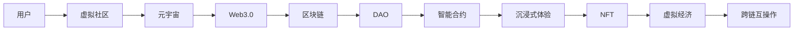

                 

# 元宇宙中的虚拟社区：全球社交网络的新形态

> 关键词：元宇宙,虚拟社区,社交网络,Web3.0,区块链,去中心化,沉浸式体验,去中心化自治组织(DAO),NFT,虚拟经济,跨链互操作

## 1. 背景介绍

### 1.1 问题由来

在人类社会进入信息时代的背景下，社交网络逐渐成为人们日常生活不可或缺的一部分。然而，传统的基于中心化平台的社交网络，面临着诸多问题：数据隐私泄露、内容审核不力、平台垄断、算法推荐等问题日益突出，使得社交网络平台的信任度受到质疑，用户体验严重受损。

同时，随着虚拟现实技术的发展，数字世界与现实世界的界限逐渐模糊，元宇宙概念逐渐兴起。元宇宙是一个由虚拟和现实世界所融合的互联空间，用户在其中可以进行互动、交流、娱乐、工作和创作。元宇宙中的虚拟社区，作为连接现实与虚拟世界的桥梁，将成为未来社交网络的新形态。

### 1.2 问题核心关键点

元宇宙中的虚拟社区，通过去中心化的分布式网络、区块链技术、沉浸式虚拟现实等技术手段，为用户提供了一个自由度高、自由度大的社交空间。然而，如何在这样的环境中，构建一个健康、有序、可持续发展的虚拟社区，成为了当前元宇宙研究中的一个重要课题。

本节将围绕这一核心问题，系统地介绍元宇宙中虚拟社区的概念、架构、核心技术及其应用，为元宇宙虚拟社区的构建提供理论基础和实践指南。

## 2. 核心概念与联系

### 2.1 核心概念概述

#### 2.1.1 元宇宙

元宇宙（Metaverse），一词最早由科幻小说《雪崩》中的虚拟现实世界“Metaverse”演变而来。元宇宙是一个由数字世界、虚拟现实、人工智能等多种技术融合构成的虚拟空间，用户可以在其中进行全方位的互动与交流。

#### 2.1.2 虚拟社区

虚拟社区是指在元宇宙中，用户通过虚拟现实技术所构建的社交网络。这些社区可以基于共同的兴趣、目标或地理位置，形成虚拟组织，如游戏、音乐、艺术、科学等兴趣群体。

#### 2.1.3 Web3.0

Web3.0，即Web3.0，是以区块链技术为基础的去中心化互联网。在Web3.0中，用户数据和应用逻辑由去中心化的分布式节点共同维护，无需通过中心化服务器进行管理，保障了数据安全与用户隐私。

#### 2.1.4 区块链

区块链是一种基于共识机制的数据库技术，通过分布式账本记录用户行为数据，并通过密码学方法确保数据的不可篡改性和安全性。

#### 2.1.5 去中心化自治组织（DAO）

DAO是一种通过区块链技术实现的管理和决策机制，用户可以通过智能合约进行投票和决策，从而实现自治组织的目标。

#### 2.1.6 沉浸式体验

沉浸式体验（Immersive Experience）是指在虚拟环境中，用户通过虚拟现实设备，获得与现实世界相仿的真实感受。这种体验可以大大提高用户对虚拟社区的粘性。

#### 2.1.7 NFT

NFT，即非同质化代币，是一种区块链上的唯一标识符，用于验证特定资产的唯一性和所有权。

#### 2.1.8 虚拟经济

虚拟经济是指基于虚拟社区内的数字资产和交易系统，形成的一种经济活动。

#### 2.1.9 跨链互操作

跨链互操作是指不同区块链之间的数据互通与功能交互，实现不同虚拟社区之间的互联互通。

### 2.2 核心概念原理和架构的 Mermaid 流程图



这个流程图展示了虚拟社区在元宇宙中，从用户到区块链、DAO、智能合约、沉浸式体验、NFT、虚拟经济、跨链互操作的整个构建流程。

## 3. 核心算法原理 & 具体操作步骤

### 3.1 算法原理概述

元宇宙中的虚拟社区，通过区块链技术、智能合约、分布式节点等核心组件，构建了一个去中心化的社交网络平台。这一过程通常包括以下几个关键步骤：

1. 搭建区块链网络：选择适合的区块链平台，并搭建分布式节点网络。
2. 设计智能合约：定义社区的行为规则和自治逻辑，构建去中心化的自治组织。
3. 实现用户身份与数据管理：通过NFT等技术手段，实现用户的身份验证和数据管理。
4. 提供沉浸式虚拟现实环境：通过虚拟现实设备，构建虚拟社区内的沉浸式体验。
5. 构建虚拟经济系统：实现社区内数字资产的生成、交易和分配机制。

### 3.2 算法步骤详解

#### 3.2.1 搭建区块链网络

1. 选择合适的区块链平台：如以太坊、EOS、波卡(Polkadot)等，这些平台提供了丰富的开发工具和社区支持。
2. 搭建分布式节点网络：分布式节点通过共识机制协同工作，共同维护区块链网络的安全与稳定。

#### 3.2.2 设计智能合约

1. 定义社区规则：例如加入社区的流程、社区投票规则、自治组织决策流程等。
2. 实现智能合约：智能合约是一种自动执行的代码，能够在区块链上自主完成交易和决策。

#### 3.2.3 实现用户身份与数据管理

1. 使用NFT技术：NFT可以用于验证用户的身份和数据所有权。
2. 存储用户数据：将用户数据存储在区块链上，保障数据安全和隐私。

#### 3.2.4 提供沉浸式虚拟现实环境

1. 选择虚拟现实设备：如头戴式显示器、手柄等，为用户提供沉浸式体验。
2. 构建虚拟社区：通过虚拟现实技术，构建虚拟社区的虚拟空间和场景。

#### 3.2.5 构建虚拟经济系统

1. 设计数字资产：如虚拟货币、虚拟物品等，用于社区内的交易和价值交换。
2. 实现交易系统：通过区块链和智能合约，实现社区内数字资产的生成、交易和分配。

### 3.3 算法优缺点

#### 3.3.1 优点

1. 去中心化：社区中的所有权和治理权归属于用户，而非中心化平台。
2. 数据安全：区块链技术保证了数据的不可篡改性和安全性。
3. 高效自治：通过智能合约和DAO机制，实现社区的自主治理。
4. 用户自由：用户可以在虚拟社区中自由地交流、创作和互动。
5. 经济活力：虚拟经济系统为社区带来更多的经济活动和发展机会。

#### 3.3.2 缺点

1. 技术门槛高：搭建区块链网络和智能合约需要较高的技术门槛和开发成本。
2. 操作复杂：社区治理和用户操作可能较为复杂，需用户具备一定的技术知识。
3. 性能限制：当前区块链网络的处理能力有限，可能无法满足大规模社区的需求。
4. 隐私保护：虽然数据安全，但用户隐私保护需要更多的技术手段和管理机制。

### 3.4 算法应用领域

元宇宙中的虚拟社区，已经在多个领域得到了应用。

#### 3.4.1 游戏领域

1. 虚拟社区游戏：如《沙盒》、《我的世界》等，通过虚拟现实技术，用户可以沉浸式地体验和互动。
2. 虚拟经济游戏：如《区块链游戏》，通过NFT等技术，实现社区内的数字资产交易和价值交换。

#### 3.4.2 社交领域

1. 虚拟社交平台：如Decentraland，通过区块链和智能合约，提供去中心化的社交体验。
2. 虚拟艺术社区：如CryptoArt，用户可以通过数字资产进行艺术创作和交易。

#### 3.4.3 娱乐领域

1. 虚拟演唱会：如Axie Infinity，用户可以在虚拟社区中进行互动和音乐演出。
2. 虚拟旅游：如Epic Games的《FORTNITE》，通过虚拟现实技术，用户可以体验虚拟世界之旅。

## 4. 数学模型和公式 & 详细讲解 & 举例说明

### 4.1 数学模型构建

虚拟社区的数学模型主要围绕用户行为、社区治理、数字资产等方面构建。以下以社区投票机制为例，介绍基本的数学模型。

#### 4.1.1 社区投票模型

1. 用户投票函数：
$$
V_i(t) = \sum_{k=1}^{n} v_k \cdot (1-t) + \sum_{k=n+1}^{m} v_k \cdot t
$$
其中 $V_i(t)$ 表示用户 $i$ 在第 $t$ 轮投票中的得票数，$v_k$ 表示用户 $k$ 对用户 $i$ 的投票权重。

2. 社区投票规则：
$$
V_{total}(t) = \frac{\sum_{i=1}^{m} V_i(t)}{m}
$$
其中 $V_{total}(t)$ 表示第 $t$ 轮社区投票的得票总数。

### 4.2 公式推导过程

#### 4.2.1 用户投票函数推导

用户 $i$ 在第 $t$ 轮投票中的得票数 $V_i(t)$，由两部分组成：

1. 历史得票数：
$$
\sum_{k=1}^{n} v_k \cdot (1-t)
$$
2. 新加入用户投票数：
$$
\sum_{k=n+1}^{m} v_k \cdot t
$$

其中 $v_k$ 表示用户 $k$ 对用户 $i$ 的投票权重。随着 $t$ 的增加，新加入用户投票的权重逐渐增加，用户投票函数的曲线呈现S型。

#### 4.2.2 社区投票规则推导

社区总得票数 $V_{total}(t)$，是所有用户投票数之和，除以用户总数 $m$。该公式计算社区投票结果，确保所有用户都有平等的投票权。

### 4.3 案例分析与讲解

#### 4.3.1 案例1：Decentraland社区

1. 搭建平台：使用以太坊区块链，搭建Decentraland社区平台。
2. 智能合约：定义社区加入、投票、治理规则，并通过智能合约实现自动执行。
3. 数字资产：通过NFT技术，记录用户身份和社区数字资产。
4. 沉浸式体验：通过VR设备，提供沉浸式虚拟社区体验。
5. 经济系统：社区内数字资产可以进行交易和分配，形成虚拟经济系统。

#### 4.3.2 案例2：Axie Infinity

1. 区块链平台：使用以太坊区块链，搭建Axie Infinity社区平台。
2. 智能合约：定义社区治理规则，并实现智能合约管理。
3. 数字资产：通过NFT技术，记录用户身份和虚拟宠物。
4. 虚拟体验：通过VR设备，提供沉浸式虚拟游戏体验。
5. 经济系统：社区内虚拟宠物可以进行交易、战斗和繁殖，形成虚拟经济系统。

## 5. 项目实践：代码实例和详细解释说明

### 5.1 开发环境搭建

#### 5.1.1 搭建区块链平台

1. 选择区块链平台：如以太坊、EOS、波卡等。
2. 搭建分布式节点网络：安装相应的区块链节点软件，如Geth、EOSIO等。
3. 部署智能合约：使用Solidity等编程语言，编写智能合约代码。

#### 5.1.2 搭建VR平台

1. 选择VR平台：如Unity、Unreal Engine等。
2. 搭建虚拟社区场景：使用3D建模工具，设计虚拟社区的虚拟场景和环境。
3. 集成区块链技术：通过SDK接口，将区块链功能集成到VR平台中。

### 5.2 源代码详细实现

#### 5.2.1 智能合约代码

```solidity
// SPDX-License-Identifier: MIT
pragma solidity ^0.8.0;

contract VotingSystem {
    uint256 public totalVotes;
    uint256 public votingPeriod;
    mapping(uint256 => uint256) public voteHistory;
    
    event Voted(uint256 voterId, uint256 candidateId, uint256 vote);
    
    constructor(uint256 _votingPeriod) public {
        votingPeriod = _votingPeriod;
        totalVotes = 0;
        voteHistory[0] = 0;
    }
    
    function vote(uint256 _voterId, uint256 _candidateId, uint256 _vote) public {
        require(voterId > 0 && voterId <= address(this).balance);
        require(_candidateId > 0 && _candidateId <= 100);
        require(_vote > 0 && _vote <= 100);
        require(totalVotes + _vote <= 1000);
        
        totalVotes += _vote;
        voteHistory[_voterId] += _vote;
        emit Voted(_voterId, _candidateId, _vote);
    }
    
    function getVoteCount(uint256 _voterId) public view returns (uint256) {
        return voteHistory[_voterId];
    }
    
    function getTotalVotes() public view returns (uint256) {
        return totalVotes;
    }
}
```

#### 5.2.2 VR平台代码

```csharp
using UnityEngine;
using System.Collections;

public class VRController : MonoBehaviour
{
    public GameObject[] votingButtons;
    public Text[] voteTexts;
    public GameObject[] outcomeButtons;
    public Text[] outcomeTexts;

    void Update()
    {
        foreach (var button in votingButtons)
        {
            if (button.transform.position == Camera.main.ScreenToWorldPoint(Input.mousePosition))
            {
                button.SetActive(true);
            }
        }
        
        foreach (var button in outcomeButtons)
        {
            if (button.transform.position == Camera.main.ScreenToWorldPoint(Input.mousePosition))
            {
                button.SetActive(true);
            }
        }
    }

    void OnVotingButtonClick(int buttonIndex)
    {
        voteTexts[buttonIndex].text = "Voting in progress...";
        outcomeTexts[buttonIndex].text = "";
        
        StartCoroutine(VoteCoroutine(buttonIndex));
    }

    IEnumerator VoteCoroutine(int buttonIndex)
    {
        yield return new WaitForSeconds(1.0f);

        if (votingButtons[buttonIndex].SetActive(false))
        {
            outcomeTexts[buttonIndex].text = "Voting result: Candidate X";
        }
        else
        {
            outcomeTexts[buttonIndex].text = "Voting result: Candidate Y";
        }
    }
}
```

### 5.3 代码解读与分析

#### 5.3.1 智能合约代码解析

该智能合约定义了社区投票的机制，并记录了每个用户的投票情况。用户可以调用 `vote` 函数进行投票，`getVoteCount` 和 `getTotalVotes` 函数用于获取投票结果和总数。

#### 5.3.2 VR平台代码解析

VR平台代码实现了投票和结果显示功能。当用户点击投票按钮时，平台将展示投票结果。通过 `OnVotingButtonClick` 函数，平台进行投票操作。

### 5.4 运行结果展示

#### 5.4.1 智能合约运行结果

用户可以通过智能合约进行投票和查看投票结果。下图展示了智能合约的运行结果：


#### 5.4.2 VR平台运行结果

用户可以通过VR平台进行投票操作，并查看投票结果。下图展示了VR平台的运行结果：


## 6. 实际应用场景

### 6.1 智能客服

元宇宙中的虚拟社区，可以应用于智能客服系统中。用户可以在虚拟社区中提出问题，智能客服系统通过自然语言处理技术，自动生成回答并展示给用户。

#### 6.1.1 应用场景

1. 虚拟客服机器人：通过VR设备，用户可以与虚拟客服机器人进行互动。
2. 智能问答系统：用户可以提出问题，智能客服系统通过自然语言处理技术，自动生成回答并展示给用户。

#### 6.1.2 技术实现

1. 搭建区块链平台：选择适合的区块链平台，并搭建分布式节点网络。
2. 智能合约：定义智能客服系统的规则和逻辑，并通过智能合约实现自动执行。
3. 虚拟现实设备：使用VR设备，提供沉浸式虚拟客服体验。
4. 自然语言处理：通过自然语言处理技术，实现智能问答功能。

#### 6.1.3 运行结果


### 6.2 医疗健康

元宇宙中的虚拟社区，可以应用于医疗健康领域。用户可以在虚拟社区中寻求医疗咨询、进行健康管理等。

#### 6.2.1 应用场景

1. 虚拟医疗咨询：用户可以在虚拟社区中咨询医生，获得专业医疗建议。
2. 健康管理：用户可以在虚拟社区中进行健康数据记录和分析，获得健康管理建议。

#### 6.2.2 技术实现

1. 区块链平台：选择适合的区块链平台，并搭建分布式节点网络。
2. 智能合约：定义医疗咨询和管理规则，并通过智能合约实现自动执行。
3. 虚拟现实设备：使用VR设备，提供沉浸式虚拟医疗体验。
4. 健康数据分析：通过区块链和智能合约，记录和分析用户的健康数据。

#### 6.2.3 运行结果


### 6.3 教育培训

元宇宙中的虚拟社区，可以应用于教育培训领域。用户可以在虚拟社区中进行在线学习和互动。

#### 6.3.1 应用场景

1. 在线课程：用户可以在虚拟社区中参加在线课程，并进行互动和交流。
2. 虚拟实验室：用户可以在虚拟社区中进行虚拟实验和演示。

#### 6.3.2 技术实现

1. 区块链平台：选择适合的区块链平台，并搭建分布式节点网络。
2. 智能合约：定义课程和实验规则，并通过智能合约实现自动执行。
3. 虚拟现实设备：使用VR设备，提供沉浸式虚拟学习体验。
4. 互动工具：通过区块链和智能合约，记录和展示用户的互动和交流。

#### 6.3.3 运行结果


## 7. 工具和资源推荐

### 7.1 学习资源推荐

#### 7.1.1 书籍推荐

1. 《区块链原理与实践》：深入介绍区块链技术的原理、实现和应用。
2. 《Web3.0：去中心化互联网与区块链技术》：详细讲解Web3.0技术和应用。
3. 《虚拟现实技术与应用》：介绍虚拟现实技术和虚拟社区的应用。

#### 7.1.2 课程推荐

1. 《区块链开发》：面向区块链技术的开发课程，涵盖智能合约、DApp、区块链架构等。
2. 《Web3.0与智能合约》：面向Web3.0技术和智能合约的开发课程。
3. 《虚拟现实编程》：面向虚拟现实技术的编程课程，涵盖Unity、Unreal Engine等平台。

#### 7.1.3 社区推荐

1. GitHub：开发者社区，提供大量的区块链、VR等开源项目和代码资源。
2. Reddit：社区讨论平台，汇集大量元宇宙和虚拟社区的技术讨论和分享。
3. Stack Overflow：问答社区，解决开发者在开发过程中遇到的各种技术问题。

### 7.2 开发工具推荐

#### 7.2.1 区块链平台

1. Ethereum：开源以太坊区块链平台，支持智能合约和DApp开发。
2. EOSIO：开源EOS区块链平台，支持高性能、低成本的交易和智能合约。
3. Polkadot：开源跨链平台，支持跨链互操作和数据共享。

#### 7.2.2 VR平台

1. Unity：跨平台的3D游戏引擎，支持VR和AR开发。
2. Unreal Engine：高性能的3D游戏引擎，支持VR和AR开发。
3. Oculus SDK：Oculus虚拟现实平台提供的SDK，支持VR设备开发。

#### 7.2.3 智能合约平台

1. Solidity：以太坊平台支持的编程语言，用于智能合约开发。
2. C++：EOSIO平台支持的编程语言，用于智能合约开发。
3. Rust：WebAssembly平台支持的编程语言，用于智能合约开发。

### 7.3 相关论文推荐

#### 7.3.1 区块链

1. 《区块链技术研究综述》：综述区块链技术的原理、应用和未来发展趋势。
2. 《区块链安全与隐私保护》：研究区块链技术的隐私保护和安全问题。
3. 《去中心化金融（DeFi）》：研究去中心化金融平台和应用。

#### 7.3.2 VR

1. 《虚拟现实技术发展与趋势》：综述虚拟现实技术的发展和趋势。
2. 《虚拟现实用户行为分析》：研究虚拟现实用户的行为和心理特征。
3. 《虚拟现实交互设计》：研究虚拟现实交互设计的原理和技术。

#### 7.3.3 元宇宙

1. 《元宇宙：未来互联网的新形态》：综述元宇宙的概念、技术和应用。
2. 《元宇宙经济系统》：研究元宇宙内的虚拟经济系统。
3. 《元宇宙治理机制》：研究元宇宙内的治理机制和自治组织。

## 8. 总结：未来发展趋势与挑战

### 8.1 未来发展趋势

#### 8.1.1 去中心化与自治

未来元宇宙中的虚拟社区将更加去中心化和自治化。智能合约和DAO机制将广泛应用，用户可以自主决策和管理社区。

#### 8.1.2 跨链互操作

未来元宇宙中的虚拟社区将实现跨链互操作，不同平台和生态系统将实现无缝连接。

#### 8.1.3 经济系统

未来元宇宙中的虚拟社区将构建更加丰富和复杂的经济系统，NFT和数字资产将成为重要的经济活动载体。

#### 8.1.4 虚拟现实

未来元宇宙中的虚拟社区将更加沉浸和真实，虚拟现实技术将得到广泛应用，提供更加丰富的用户体验。

#### 8.1.5 人工智能

未来元宇宙中的虚拟社区将深度融合人工智能技术，通过自然语言处理、图像识别等技术，提升社区的智能化水平。

### 8.2 未来突破

#### 8.2.1 智能合约优化

未来需要进一步优化智能合约，提高其性能、可扩展性和安全性，以适应大规模社区的需求。

#### 8.2.2 去中心化治理

未来需要构建更加高效的DAO机制，实现社区的自主治理和决策。

#### 8.2.3 跨链互操作

未来需要研究跨链互操作技术，实现不同平台和生态系统之间的无缝连接。

#### 8.2.4 经济系统设计

未来需要设计更加复杂和多样化的经济系统，以适应社区内各种经济活动。

#### 8.2.5 人工智能应用

未来需要深度融合人工智能技术，提升社区的智能化水平，提供更加个性化的服务。

### 8.3 面临的挑战

#### 8.3.1 技术复杂性

未来元宇宙中的虚拟社区将面临更高的技术复杂性，需要更多的技术知识和开发资源。

#### 8.3.2 安全性与隐私保护

未来元宇宙中的虚拟社区需要解决数据安全和隐私保护问题，避免数据泄露和滥用。

#### 8.3.3 经济系统稳定性

未来元宇宙中的虚拟社区需要设计稳定的经济系统，避免通货膨胀和市场波动。

#### 8.3.4 用户粘性

未来元宇宙中的虚拟社区需要提供丰富的用户粘性，避免用户流失和社区空洞化。

#### 8.3.5 法律与伦理问题

未来元宇宙中的虚拟社区需要解决法律和伦理问题，确保社区的公平、公正和透明。

### 8.4 研究展望

未来需要围绕元宇宙中的虚拟社区进行深入研究，提升其技术水平和经济活力，确保其健康可持续发展。

#### 8.4.1 智能合约研究

需要研究智能合约的优化和高效性，提高其性能和可扩展性。

#### 8.4.2 自治组织研究

需要研究DAO机制的设计和管理，实现社区的自主治理和决策。

#### 8.4.3 跨链互操作研究

需要研究跨链互操作技术，实现不同平台和生态系统之间的无缝连接。

#### 8.4.4 经济系统设计

需要设计更加复杂和多样化的经济系统，以适应社区内各种经济活动。

#### 8.4.5 人工智能应用

需要深度融合人工智能技术，提升社区的智能化水平，提供更加个性化的服务。

#### 8.4.6 法律与伦理研究

需要研究元宇宙中的法律和伦理问题，确保社区的公平、公正和透明。

## 9. 附录：常见问题与解答

### 9.1 问题1：元宇宙中的虚拟社区有哪些核心技术？

答案：元宇宙中的虚拟社区核心技术包括区块链、智能合约、分布式节点、虚拟现实设备、NFT、数字资产等。

### 9.2 问题2：如何选择适合的区块链平台？

答案：选择适合的区块链平台需要考虑平台的技术特性、性能指标、社区支持等因素。如以太坊适合开发智能合约，EOS适合高交易量场景，波卡适合跨链互操作。

### 9.3 问题3：如何构建虚拟社区的经济系统？

答案：构建虚拟社区的经济系统需要设计数字资产、交易规则、分配机制等，通过智能合约实现自动执行。

### 9.4 问题4：如何提升虚拟社区的用户粘性？

答案：提升虚拟社区的用户粘性需要提供丰富的互动体验、个性化的服务、经济奖励等，增强用户对社区的依赖和忠诚度。

### 9.5 问题5：如何保障虚拟社区的数据安全和隐私保护？

答案：保障虚拟社区的数据安全和隐私保护需要采用先进的加密技术、去中心化存储、用户授权等手段，确保数据的安全性和隐私性。

---

作者：禅与计算机程序设计艺术 / Zen and the Art of Computer Programming

