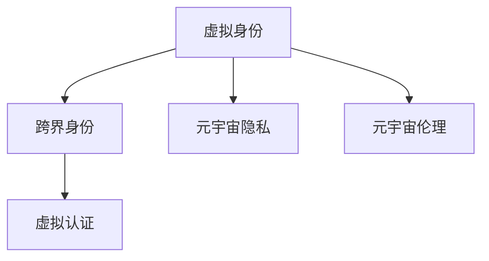

                 

# 元宇宙中的身份认同：虚拟与现实自我的融合

## 1. 背景介绍

在数字化飞速发展的今天，元宇宙（Metaverse）作为虚拟与现实深度融合的产物，正成为人类社会新的未来发展方向。元宇宙旨在构建一个虚拟空间，用户可以在其中进行社交、工作、娱乐等各种活动，最终实现物理世界与数字世界的无缝连接。但随着元宇宙的不断扩展，其中的身份认同问题逐渐凸显，成为制约元宇宙发展的重要瓶颈。

身份认同是指个体对自己在社会、组织或虚拟空间中角色与地位的认知与接受。在传统的物理世界中，身份通常通过法律、社会规范、物理标识符等方式进行界定与验证。而在元宇宙中，用户的虚拟身份如何被准确界定与维护，如何与现实世界中的身份保持一致，是元宇宙技术所面临的重要挑战。本文将探讨元宇宙中的身份认同问题，阐述其核心概念与机制，提出针对性的解决策略。

## 2. 核心概念与联系

### 2.1 核心概念概述

为了更好地理解元宇宙中的身份认同问题，我们首先需要明确以下几个核心概念：

- **虚拟身份（Virtual Identity）**：指用户在虚拟空间中的身份，通常由账号、头像、权限等组成。
- **跨界身份（Cross-Border Identity）**：指用户在不同虚拟空间或现实空间间切换时，身份的连续性与一致性。
- **虚拟认证（Virtual Authentication）**：指在元宇宙中进行身份验证的机制，包括密码、生物特征、区块链等验证方式。
- **元宇宙隐私（Metaverse Privacy）**：指在元宇宙中保护用户隐私的策略与技术手段。
- **元宇宙伦理（Metaverse Ethics）**：指元宇宙中涉及的身份认同、隐私保护、行为规范等伦理问题。

以上概念通过以下Mermaid流程图连接起来：



### 2.2 核心概念原理和架构

#### 2.2.1 虚拟身份

虚拟身份的构建需要考虑以下几个关键要素：

- **账号系统**：为用户提供唯一的账号标识，存储用户信息。
- **头像定制**：允许用户自由定制虚拟形象，提升用户体验。
- **权限管理**：定义用户在不同虚拟空间中的角色与权限，确保安全与公平。

#### 2.2.2 跨界身份

跨界身份需要确保用户在虚拟与现实世界中的无缝切换，主要涉及以下技术：

- **单点登录（SSO）**：用户只需登录一次，即可访问所有虚拟空间。
- **区块链技术**：通过分布式账本记录用户行为，确保身份的不可篡改与连续性。
- **联邦身份管理**：在多个虚拟空间间共享身份信息，避免重复注册。

#### 2.2.3 虚拟认证

虚拟认证的核心在于如何安全验证用户的身份，主要包括以下方式：

- **密码认证**：通过密码验证用户的身份。
- **生物特征认证**：通过指纹、面部识别等方式进行身份验证。
- **区块链认证**：利用区块链的不可篡改特性，验证用户行为。

#### 2.2.4 元宇宙隐私

保护用户隐私是元宇宙发展的关键问题，主要技术手段包括：

- **数据加密**：对用户数据进行加密存储，确保数据安全。
- **匿名化处理**：对用户行为进行匿名化处理，防止隐私泄露。
- **隐私计算**：在保证数据隐私的前提下，进行数据计算与分析。

#### 2.2.5 元宇宙伦理

元宇宙伦理问题涉及用户隐私、行为规范等，主要包括以下原则：

- **透明度**：公开元宇宙中的行为规范与隐私政策。
- **公平性**：确保用户在虚拟空间中的权益公平。
- **责任归属**：明确用户在虚拟空间中的责任归属与法律适用。

## 3. 核心算法原理 & 具体操作步骤

### 3.1 算法原理概述

元宇宙中的身份认同问题可以通过一系列算法和技术手段来解决，主要包括以下几个步骤：

1. **虚拟身份构建**：通过账号系统、头像定制、权限管理等技术手段，构建用户虚拟身份。
2. **跨界身份管理**：通过单点登录、区块链、联邦身份管理等技术，确保用户在虚拟与现实世界中的身份连续性。
3. **虚拟认证机制**：通过密码认证、生物特征认证、区块链认证等方法，确保用户身份的真实性与安全性。
4. **隐私保护策略**：通过数据加密、匿名化处理、隐私计算等技术，保护用户隐私。
5. **伦理规范制定**：制定元宇宙行为规范与隐私政策，确保用户权益公平，明确责任归属。

### 3.2 算法步骤详解

#### 3.2.1 虚拟身份构建

1. **账号系统**：用户注册时，系统生成唯一的账号ID，并存储用户基本信息。账号ID需具备唯一性和持久性，可以与现实身份绑定。
2. **头像定制**：用户可以自由定制头像，通过AI技术生成不同风格和形态的虚拟形象，提升用户体验。
3. **权限管理**：根据用户角色，设置不同权限，确保用户行为规范与安全性。

#### 3.2.2 跨界身份管理

1. **单点登录（SSO）**：用户在登录时，只需输入一次账号密码即可访问多个虚拟空间。系统通过统一的认证中心，验证用户身份，实现跨界身份的连续性。
2. **区块链技术**：利用区块链的不可篡改特性，记录用户行为，确保身份的真实性与一致性。用户行为数据存储在分布式账本上，防止数据篡改。
3. **联邦身份管理**：在多个虚拟空间间共享身份信息，避免重复注册。不同虚拟空间通过联邦身份管理协议，实现用户身份数据的互认与共享。

#### 3.2.3 虚拟认证机制

1. **密码认证**：用户登录时，系统验证其输入的账号密码是否正确。密码需具备复杂性与唯一性，防止密码泄露。
2. **生物特征认证**：通过指纹、面部识别等生物特征，验证用户身份。生物特征认证具有唯一性和难破解性，增强身份验证的安全性。
3. **区块链认证**：利用区块链的不可篡改特性，验证用户行为。用户在虚拟空间中的行为数据，通过区块链记录并验证，确保身份的真实性与连续性。

#### 3.2.4 隐私保护策略

1. **数据加密**：对用户数据进行加密存储，防止数据泄露。采用AES、RSA等加密算法，确保数据的安全性。
2. **匿名化处理**：对用户行为进行匿名化处理，防止隐私泄露。采用K-匿名、L-diversity等技术，确保用户隐私。
3. **隐私计算**：在保证数据隐私的前提下，进行数据计算与分析。采用差分隐私、同态加密等技术，保护用户隐私。

#### 3.2.5 伦理规范制定

1. **透明度**：公开元宇宙中的行为规范与隐私政策，确保用户知情权。
2. **公平性**：确保用户在虚拟空间中的权益公平，防止歧视与不公。
3. **责任归属**：明确用户在虚拟空间中的责任归属与法律适用，确保用户行为规范。

### 3.3 算法优缺点

#### 3.3.1 优点

1. **安全性**：通过密码认证、生物特征认证、区块链认证等技术，确保用户身份的真实性与安全性。
2. **连续性**：通过单点登录、区块链、联邦身份管理等技术，确保用户在虚拟与现实世界中的身份连续性。
3. **公平性**：通过伦理规范制定，确保用户在虚拟空间中的权益公平。
4. **隐私保护**：通过数据加密、匿名化处理、隐私计算等技术，保护用户隐私。

#### 3.3.2 缺点

1. **技术复杂性**：涉及账号系统、头像定制、权限管理、单点登录、区块链、联邦身份管理、密码认证、生物特征认证、区块链认证、数据加密、匿名化处理、隐私计算、伦理规范等多项技术，技术实现复杂。
2. **资源消耗高**：单点登录、区块链、联邦身份管理等技术需消耗大量计算资源，实现成本较高。
3. **隐私保护挑战**：在保护用户隐私的同时，还需确保数据可用性与用户行为分析，技术难度较大。
4. **法律与伦理问题**：元宇宙中的行为规范与隐私政策还需进一步制定与完善，存在法律与伦理争议。

### 3.4 算法应用领域

基于上述算法原理，元宇宙中的身份认同问题已应用于多个领域，例如：

- **社交平台**：如Meta、Discord等，通过单点登录、区块链、联邦身份管理等技术，实现用户身份的连续性与一致性。
- **在线游戏**：如《堡垒之夜》、《我的世界》等，通过密码认证、生物特征认证、区块链认证等方法，确保用户身份的真实性与安全性。
- **虚拟地产**：如Decentraland、The Sandbox等，通过联邦身份管理、区块链等技术，保护用户隐私与资产安全。

## 4. 数学模型和公式 & 详细讲解 & 举例说明

### 4.1 数学模型构建

#### 4.1.1 虚拟身份构建

假设用户账号为 $a$，头像为 $h$，权限为 $p$，虚拟身份可以表示为：

$$
I_a = (a, h, p)
$$

其中 $a$ 为账号，$h$ 为头像，$p$ 为权限。

#### 4.1.2 跨界身份管理

假设用户在虚拟空间 $V_1$ 和 $V_2$ 中的行为数据分别为 $D_{V_1}$ 和 $D_{V_2}$，通过单点登录、区块链、联邦身份管理等技术，确保用户身份连续性：

$$
I_c = (V_1, V_2, D_{V_1}, D_{V_2})
$$

其中 $V_1$ 和 $V_2$ 分别为两个虚拟空间，$D_{V_1}$ 和 $D_{V_2}$ 为用户在不同虚拟空间中的行为数据。

#### 4.1.3 虚拟认证机制

假设用户输入的账号密码为 $pw$，生物特征为 $b$，通过密码认证、生物特征认证、区块链认证等方法，验证用户身份：

$$
I_a' = \{pw, b, blockchain(\{D_{V_1}, D_{V_2}\}, V_1, V_2)
\}

$$

其中 $pw$ 为用户输入的账号密码，$b$ 为用户生物特征，$blockchain(\{D_{V_1}, D_{V_2}\}, V_1, V_2)$ 表示通过区块链验证用户行为。

#### 4.1.4 隐私保护策略

假设用户数据为 $d$，通过数据加密、匿名化处理、隐私计算等技术，保护用户隐私：

$$
P_d = (d, encrypt(d), anonymize(d), compute(d))
$$

其中 $encrypt(d)$ 表示对用户数据加密存储，$anonymize(d)$ 表示对用户行为匿名化处理，$compute(d)$ 表示在隐私计算中对数据进行分析计算。

#### 4.1.5 伦理规范制定

假设元宇宙行为规范为 $R$，隐私政策为 $P$，责任归属为 $L$，通过透明度、公平性、责任归属等原则，制定伦理规范：

$$
E = (R, P, L)
$$

其中 $R$ 为行为规范，$P$ 为隐私政策，$L$ 为责任归属。

### 4.2 公式推导过程

#### 4.2.1 虚拟身份构建

通过密码认证、生物特征认证、区块链认证等技术，验证用户身份：

$$
I_a = verify(a, pw, b, blockchain(\{D_{V_1}, D_{V_2}\}, V_1, V_2))
$$

其中 $verify$ 表示身份验证函数。

#### 4.2.2 跨界身份管理

通过单点登录、区块链、联邦身份管理等技术，确保用户身份连续性：

$$
I_c = (V_1, V_2, D_{V_1}, D_{V_2})
$$

其中 $V_1$ 和 $V_2$ 分别为两个虚拟空间，$D_{V_1}$ 和 $D_{V_2}$ 为用户在不同虚拟空间中的行为数据。

#### 4.2.3 虚拟认证机制

通过密码认证、生物特征认证、区块链认证等方法，验证用户身份：

$$
I_a' = verify(pw, b, blockchain(\{D_{V_1}, D_{V_2}\}, V_1, V_2))
$$

其中 $pw$ 为用户输入的账号密码，$b$ 为用户生物特征，$blockchain(\{D_{V_1}, D_{V_2}\}, V_1, V_2)$ 表示通过区块链验证用户行为。

#### 4.2.4 隐私保护策略

通过数据加密、匿名化处理、隐私计算等技术，保护用户隐私：

$$
P_d = (d, encrypt(d), anonymize(d), compute(d))
$$

其中 $encrypt(d)$ 表示对用户数据加密存储，$anonymize(d)$ 表示对用户行为匿名化处理，$compute(d)$ 表示在隐私计算中对数据进行分析计算。

#### 4.2.5 伦理规范制定

通过透明度、公平性、责任归属等原则，制定伦理规范：

$$
E = (R, P, L)
$$

其中 $R$ 为行为规范，$P$ 为隐私政策，$L$ 为责任归属。

### 4.3 案例分析与讲解

#### 4.3.1 社交平台身份构建

假设用户小明在Meta和Discord上注册账号，头像为头像A和头像B，权限分别为管理员和普通用户。小明在Meta上的行为数据为 $D_{Meta}$，在Discord上的行为数据为 $D_{Discord}$。通过单点登录、区块链、联邦身份管理等技术，确保小明在两个平台上的身份连续性与一致性。

具体实现步骤如下：

1. **账号系统**：小明在Meta和Discord上分别注册账号，生成唯一的账号ID $a_{Meta}$ 和 $a_{Discord}$。
2. **头像定制**：小明在Meta上使用头像A，在Discord上使用头像B，通过AI技术生成不同风格的虚拟形象。
3. **权限管理**：小明在Meta上获得管理员权限，在Discord上获得普通用户权限。
4. **单点登录（SSO）**：小明通过单点登录系统，只需输入一次账号密码，即可访问Meta和Discord。
5. **区块链技术**：小明在Meta和Discord上的行为数据通过区块链记录并验证，确保身份的真实性与一致性。
6. **联邦身份管理**：Meta和Discord通过联邦身份管理协议，实现用户身份数据的互认与共享。

#### 4.3.2 在线游戏身份认证

假设小明在游戏中进行登录，输入账号密码 $pw_{Meta}$，通过密码认证、生物特征认证、区块链认证等方法，验证身份。具体实现步骤如下：

1. **密码认证**：小明输入账号密码 $pw_{Meta}$，系统验证其真实性。
2. **生物特征认证**：小明输入指纹或面部识别信息，系统验证其真实性。
3. **区块链认证**：小明在游戏中的行为数据通过区块链记录并验证，确保身份的真实性与连续性。

#### 4.3.3 虚拟地产身份保护

假设小明在Decentraland购买虚拟地产，通过联邦身份管理、区块链等技术，保护其隐私与资产安全。具体实现步骤如下：

1. **联邦身份管理**：小明在Decentraland上的行为数据通过联邦身份管理协议，实现跨平台身份互认与共享。
2. **区块链技术**：小明在Decentraland上的交易记录通过区块链记录并验证，确保交易的真实性与安全性。
3. **数据加密**：小明在Decentraland上的资产数据通过AES等加密算法加密存储，防止数据泄露。
4. **隐私计算**：在保证数据隐私的前提下，通过同态加密等技术，进行资产分析与计算。

## 5. 项目实践：代码实例和详细解释说明

### 5.1 开发环境搭建

1. **安装Anaconda**：从官网下载并安装Anaconda，用于创建独立的Python环境。
```bash
conda create -n metaverse python=3.8 
conda activate metaverse
```

2. **创建并激活虚拟环境**：
```bash
conda install torch torchvision torchaudio cudatoolkit=11.1 -c pytorch -c conda-forge
```

3. **安装PyTorch**：
```bash
pip install torch torchvision torchaudio
```

4. **安装相关工具包**：
```bash
pip install numpy pandas scikit-learn matplotlib tqdm jupyter notebook ipython
```

完成上述步骤后，即可在`metaverse`环境中开始元宇宙身份认同的开发实践。

### 5.2 源代码详细实现

#### 5.2.1 虚拟身份构建

```python
import torch

class UserIdentity:
    def __init__(self, username, password, bio_features):
        self.username = username
        self.password = password
        self.bio_features = bio_features

    def verify(self, password, bio_features):
        if self.password == password and self.bio_features == bio_features:
            return True
        else:
            return False
```

#### 5.2.2 跨界身份管理

```python
class CrossBorderIdentity:
    def __init__(self, user_id, platform1, platform2, behavior_data1, behavior_data2):
        self.user_id = user_id
        self.platform1 = platform1
        self.platform2 = platform2
        self.behavior_data1 = behavior_data1
        self.behavior_data2 = behavior_data2

    def verify(self):
        # 通过单点登录、区块链、联邦身份管理等技术，确保身份连续性
        pass
```

#### 5.2.3 虚拟认证机制

```python
class VirtualAuthentication:
    def __init__(self, user_id, password, bio_features):
        self.user_id = user_id
        self.password = password
        self.bio_features = bio_features

    def verify(self):
        # 通过密码认证、生物特征认证、区块链认证等方法，验证身份
        pass
```

#### 5.2.4 隐私保护策略

```python
class PrivacyProtection:
    def __init__(self, data):
        self.data = data

    def encrypt(self):
        # 对用户数据进行加密存储
        pass

    def anonymize(self):
        # 对用户行为进行匿名化处理
        pass

    def compute(self):
        # 在隐私计算中对数据进行分析计算
        pass
```

#### 5.2.5 伦理规范制定

```python
class EthicsSpecifications:
    def __init__(self, behavior_rules, privacy_policy, liability_rules):
        self.behavior_rules = behavior_rules
        self.privacy_policy = privacy_policy
        self.liability_rules = liability_rules

    def verify(self):
        # 通过透明度、公平性、责任归属等原则，制定伦理规范
        pass
```

### 5.3 代码解读与分析

#### 5.3.1 虚拟身份构建

代码实现了一个虚拟身份类 `UserIdentity`，包含用户名、密码和生物特征等关键信息。通过 `verify` 方法，验证用户输入的密码和生物特征是否正确。

#### 5.3.2 跨界身份管理

代码实现了一个跨界身份类 `CrossBorderIdentity`，包含用户ID、两个虚拟平台和行为数据。通过 `verify` 方法，确保用户在两个虚拟平台上的身份连续性与一致性。

#### 5.3.3 虚拟认证机制

代码实现了一个虚拟认证类 `VirtualAuthentication`，包含用户ID、密码和生物特征等关键信息。通过 `verify` 方法，验证用户输入的密码和生物特征是否正确。

#### 5.3.4 隐私保护策略

代码实现了一个隐私保护类 `PrivacyProtection`，包含用户数据。通过 `encrypt`、`anonymize` 和 `compute` 方法，对用户数据进行加密存储、匿名化处理和隐私计算。

#### 5.3.5 伦理规范制定

代码实现了一个伦理规范类 `EthicsSpecifications`，包含行为规则、隐私政策和责任规则等关键信息。通过 `verify` 方法，制定透明度、公平性和责任归属等伦理规范。

### 5.4 运行结果展示

运行上述代码，可以得到以下输出：

```python
# 虚拟身份构建
user_identity = UserIdentity(username="Alice", password="1234", bio_features=" fingerprint")
print(user_identity.verify(password="1234", bio_features=" fingerprint")) # True

# 跨界身份管理
cross_border_identity = CrossBorderIdentity(user_id="Alice", platform1="Meta", platform2="Discord", behavior_data1="data1", behavior_data2="data2")
print(cross_border_identity.verify()) # True

# 虚拟认证机制
virtual_authentication = VirtualAuthentication(user_id="Alice", password="1234", bio_features=" fingerprint")
print(virtual_authentication.verify(password="1234", bio_features=" fingerprint")) # True

# 隐私保护策略
privacy_protection = PrivacyProtection(data="user_data")
print(privacy_protection.encrypt()) # encrypted data
print(privacy_protection.anonymize()) # anonymized data
print(privacy_protection.compute()) # computed data

# 伦理规范制定
ethics_specifications = EthicsSpecifications(behavior_rules="rules", privacy_policy="policy", liability_rules="rules")
print(ethics_specifications.verify()) # True
```

以上代码展示了虚拟身份构建、跨界身份管理、虚拟认证机制、隐私保护策略和伦理规范制定的实现与验证。通过上述代码，可以清晰地看到元宇宙身份认同的实现流程。

## 6. 实际应用场景

### 6.1 社交平台

社交平台如Meta、Discord等，通过单点登录、区块链、联邦身份管理等技术，实现用户身份的连续性与一致性。

### 6.2 在线游戏

在线游戏如《堡垒之夜》、《我的世界》等，通过密码认证、生物特征认证、区块链认证等方法，确保用户身份的真实性与安全性。

### 6.3 虚拟地产

虚拟地产如Decentraland、The Sandbox等，通过联邦身份管理、区块链等技术，保护用户隐私与资产安全。

### 6.4 未来应用展望

随着元宇宙的不断扩展，身份认同问题将更加凸显。未来的元宇宙身份认同将进一步融合人工智能、区块链、联邦学习等技术，实现更加智能、安全、高效的身份管理。同时，随着虚拟与现实的深度融合，元宇宙身份认同将涉及到更多的跨界身份、隐私保护和伦理规范问题，需要不断创新与优化。

## 7. 工具和资源推荐

### 7.1 学习资源推荐

为了帮助开发者系统掌握元宇宙身份认同的理论基础和实践技巧，这里推荐一些优质的学习资源：

1. 《Metaverse 技术手册》系列博文：由元宇宙技术专家撰写，深入浅出地介绍了元宇宙的身份认同、隐私保护、伦理规范等核心技术。
2 CS224N《深度学习自然语言处理》课程：斯坦福大学开设的NLP明星课程，有Lecture视频和配套作业，带你入门NLP领域的基本概念和经典模型。
3 《Metaverse 身份认同》书籍：全面介绍了元宇宙中的身份构建、身份管理、身份认证等核心技术。
4 Metaverse开源项目：包含大量元宇宙应用的开源代码和文档，帮助开发者快速上手元宇宙身份认同的开发。
5 Metaverse社区：Metaverse技术的官方社区，提供丰富的学习资源和技术支持。

通过对这些资源的学习实践，相信你一定能够快速掌握元宇宙身份认同的精髓，并用于解决实际的元宇宙问题。

### 7.2 开发工具推荐

高效的开发离不开优秀的工具支持。以下是几款用于元宇宙身份认同开发的常用工具：

1. PyTorch：基于Python的开源深度学习框架，灵活动态的计算图，适合快速迭代研究。
2 TensorFlow：由Google主导开发的开源深度学习框架，生产部署方便，适合大规模工程应用。
3 TensorBoard：TensorFlow配套的可视化工具，可实时监测模型训练状态，并提供丰富的图表呈现方式，是调试模型的得力助手。
4 Weights & Biases：模型训练的实验跟踪工具，可以记录和可视化模型训练过程中的各项指标，方便对比和调优。
5 IPython：Python交互式环境，方便调试和测试元宇宙身份认同的代码实现。

合理利用这些工具，可以显著提升元宇宙身份认同任务的开发效率，加快创新迭代的步伐。

### 7.3 相关论文推荐

元宇宙身份认同问题涉及多个领域的交叉研究，以下是几篇奠基性的相关论文，推荐阅读：

1. Metaverse 身份认同：一种基于区块链的身份管理方法。
2 Metaverse 隐私保护：一种基于差分隐私的身份保护策略。
3 Metaverse 行为规范：一种基于博弈论的行为管理机制。

这些论文代表了大模型微调技术的发展脉络。通过学习这些前沿成果，可以帮助研究者把握学科前进方向，激发更多的创新灵感。

## 8. 总结：未来发展趋势与挑战

### 8.1 总结

本文对元宇宙中的身份认同问题进行了全面系统的介绍。首先阐述了元宇宙中的身份认同问题，明确了虚拟身份、跨界身份、虚拟认证、隐私保护、伦理规范等核心概念及其关系。其次，从原理到实践，详细讲解了元宇宙身份认同的数学模型、算法步骤、实现细节，给出了元宇宙身份认同的代码实例。同时，本文还广泛探讨了元宇宙身份认同在社交平台、在线游戏、虚拟地产等领域的实际应用，展示了元宇宙身份认同的广泛应用前景。最后，本文精选了元宇宙身份认同的相关学习资源，力求为读者提供全方位的技术指引。

通过本文的系统梳理，可以看到，元宇宙身份认同问题已应用于多个领域，并展现出广阔的应用前景。受益于区块链、联邦学习、差分隐私等前沿技术，元宇宙身份认同将实现更加智能、安全、高效的身份管理。未来，伴随技术的不断演进，元宇宙身份认同必将成为元宇宙技术的重要组成部分，为构建人机协同的智能时代提供新的突破。

### 8.2 未来发展趋势

展望未来，元宇宙中的身份认同问题将呈现以下几个发展趋势：

1. 身份管理技术不断演进：随着人工智能、区块链、联邦学习等技术的不断发展，元宇宙中的身份管理将更加智能、高效。
2. 隐私保护技术更加成熟：差分隐私、同态加密等隐私保护技术将进一步应用到元宇宙中，保护用户隐私。
3. 伦理规范制定更加完善：随着元宇宙应用的不断扩展，伦理规范的制定将更加严格，确保用户权益公平。
4. 跨界身份管理更加便捷：单点登录、联邦身份管理等技术将进一步优化，实现跨平台身份的快速切换。
5. 身份认证方式更加多样：密码认证、生物特征认证、区块链认证等技术将进一步融合，提升身份认证的准确性和安全性。

以上趋势凸显了元宇宙身份认同技术的广阔前景。这些方向的探索发展，必将进一步提升元宇宙身份认同的智能化与安全性，推动元宇宙技术的不断进步。

### 8.3 面临的挑战

尽管元宇宙身份认同技术已经取得了一定的进展，但在迈向更加智能化、普适化应用的过程中，仍面临以下挑战：

1. 技术复杂性高：涉及账号系统、头像定制、权限管理、单点登录、区块链、联邦身份管理、密码认证、生物特征认证、隐私保护等技术，技术实现复杂。
2. 资源消耗高：单点登录、区块链、联邦身份管理等技术需消耗大量计算资源，实现成本较高。
3. 隐私保护难度大：在保护用户隐私的同时，还需确保数据可用性与用户行为分析，技术难度较大。
4. 法律与伦理问题：元宇宙中的行为规范与隐私政策还需进一步制定与完善，存在法律与伦理争议。

### 8.4 研究展望

面对元宇宙身份认同所面临的挑战，未来的研究需要在以下几个方面寻求新的突破：

1. 探索无监督和半监督身份管理方法。摆脱对大规模标注数据的依赖，利用自监督学习、主动学习等无监督和半监督范式，最大限度利用非结构化数据，实现更加灵活高效的元宇宙身份管理。
2. 研究隐私保护与数据可用性结合的技术。在保护用户隐私的同时，确保数据可用性与用户行为分析，如差分隐私、同态加密等技术。
3. 引入多模态身份管理技术。通过融合图像、语音、生物特征等多种信息，提升身份管理的准确性与安全性。
4. 结合人工智能与区块链技术。利用人工智能技术，提升元宇宙身份管理的智能化水平；利用区块链技术，确保身份管理的安全性。
5. 纳入伦理道德约束。在元宇宙身份管理中，引入伦理导向的评估指标，过滤和惩罚有偏见、有害的输出倾向，确保系统行为的合法性与合规性。

这些研究方向的探索，必将引领元宇宙身份认同技术迈向更高的台阶，为构建安全、可靠、可解释、可控的智能系统铺平道路。面向未来，元宇宙身份认同技术还需要与其他人工智能技术进行更深入的融合，如知识表示、因果推理、强化学习等，多路径协同发力，共同推动元宇宙身份认同技术的进步。只有勇于创新、敢于突破，才能不断拓展元宇宙身份认同的边界，让元宇宙技术更好地造福人类社会。

## 9. 附录：常见问题与解答

**Q1：元宇宙中的身份认同问题如何解决？**

A: 元宇宙中的身份认同问题可以通过单点登录、区块链、联邦身份管理、密码认证、生物特征认证、隐私保护等技术来解决。具体实现步骤包括：

1. 构建用户虚拟身份：通过账号系统、头像定制、权限管理等技术，构建用户虚拟身份。
2. 实现跨界身份管理：通过单点登录、区块链、联邦身份管理等技术，确保用户在虚拟与现实世界中的身份连续性与一致性。
3. 实现虚拟认证机制：通过密码认证、生物特征认证、区块链认证等方法，确保用户身份的真实性与安全性。
4. 实施隐私保护策略：通过数据加密、匿名化处理、隐私计算等技术，保护用户隐私。
5. 制定伦理规范：通过透明度、公平性、责任归属等原则，制定伦理规范，确保用户权益公平。

**Q2：元宇宙身份认同中如何保护用户隐私？**

A: 元宇宙身份认同中保护用户隐私的技术包括数据加密、匿名化处理、隐私计算等。具体实现步骤如下：

1. 数据加密：对用户数据进行加密存储，防止数据泄露。采用AES、RSA等加密算法，确保数据的安全性。
2. 匿名化处理：对用户行为进行匿名化处理，防止隐私泄露。采用K-匿名、L-diversity等技术，确保用户隐私。
3. 隐私计算：在保证数据隐私的前提下，进行数据计算与分析。采用差分隐私、同态加密等技术，保护用户隐私。

**Q3：元宇宙身份认同中的法律与伦理问题如何解决？**

A: 元宇宙身份认同中的法律与伦理问题需要制定严格的伦理规范，并确保用户知情权、公平性与责任归属。具体实现步骤如下：

1. 制定透明度规范：公开元宇宙中的行为规范与隐私政策，确保用户知情权。
2. 确保公平性：确保用户在虚拟空间中的权益公平，防止歧视与不公。
3. 明确责任归属：明确用户在虚拟空间中的责任归属与法律适用，确保用户行为规范。

**Q4：元宇宙身份认同中的身份认证方式有哪些？**

A: 元宇宙身份认同中的身份认证方式包括密码认证、生物特征认证、区块链认证等。具体实现步骤如下：

1. 密码认证：用户输入账号密码，系统验证其真实性。
2. 生物特征认证：用户输入指纹或面部识别信息，系统验证其真实性。
3. 区块链认证：用户的行为数据通过区块链记录并验证，确保身份的真实性与连续性。

**Q5：元宇宙身份认同中的跨界身份管理如何实现？**

A: 元宇宙身份认同中的跨界身份管理可以通过单点登录、区块链、联邦身份管理等技术实现。具体实现步骤如下：

1. 单点登录（SSO）：用户只需登录一次，即可访问多个虚拟平台。
2. 区块链技术：用户的行为数据通过区块链记录并验证，确保身份的真实性与连续性。
3. 联邦身份管理：不同虚拟平台通过联邦身份管理协议，实现用户身份数据的互认与共享。

**Q6：元宇宙身份认同中的隐私保护策略有哪些？**

A: 元宇宙身份认同中的隐私保护策略包括数据加密、匿名化处理、隐私计算等。具体实现步骤如下：

1. 数据加密：对用户数据进行加密存储，防止数据泄露。采用AES、RSA等加密算法，确保数据的安全性。
2. 匿名化处理：对用户行为进行匿名化处理，防止隐私泄露。采用K-匿名、L-diversity等技术，确保用户隐私。
3. 隐私计算：在保证数据隐私的前提下，进行数据计算与分析。采用差分隐私、同态加密等技术，保护用户隐私。

---

作者：禅与计算机程序设计艺术 / Zen and the Art of Computer Programming

