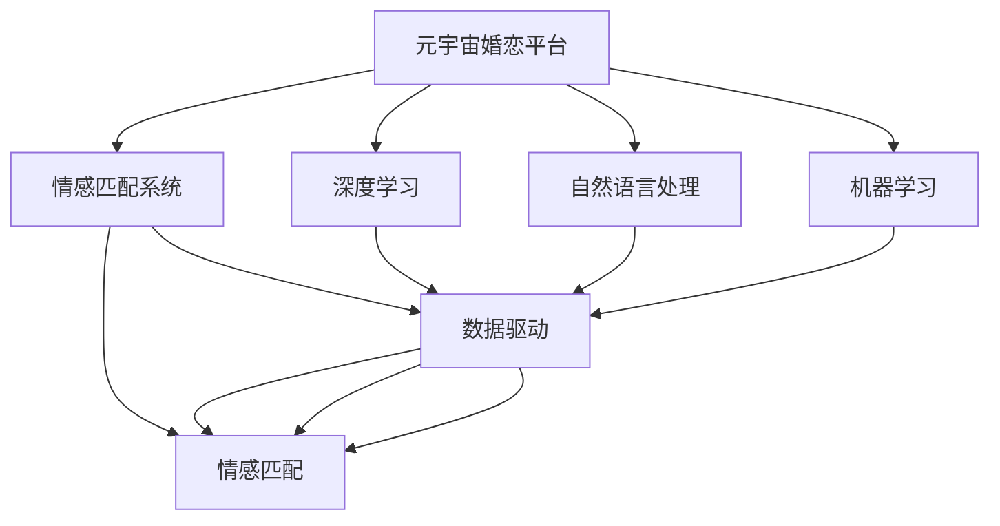

                 

# 元宇宙婚恋平台:虚拟世界中的情感匹配系统

> 关键词：元宇宙,情感匹配系统,虚拟婚恋,人工智能,深度学习,自然语言处理,NLP,机器学习,算法,应用

## 1. 背景介绍

### 1.1 问题由来
随着元宇宙（Metaverse）的兴起，虚拟世界成为了一个全新的社交平台和社交空间。在虚拟世界中，人们不再受限于现实世界的物理空间和社交网络，可以跨越地理限制，通过虚拟身份进行交流和互动。婚恋匹配作为现实世界中最重要的社交需求之一，也开始在虚拟世界中探索其应用。

元宇宙婚恋平台的出现，将虚拟世界中的婚恋匹配与现代科技结合，为婚恋市场带来新机遇。通过虚拟世界中的情感匹配系统，人们可以在虚拟空间中寻觅到更加适合自己的伴侣，实现更丰富、更自由、更多元的婚恋体验。

### 1.2 问题核心关键点
本文聚焦于元宇宙婚恋平台中，基于情感匹配系统的构建和优化，旨在通过深度学习和大数据分析，精准识别用户情感和需求，实现虚拟世界的精准婚恋匹配。核心问题在于：
1. 如何通过数据驱动的方式，理解虚拟世界中的用户情感和偏好？
2. 如何构建有效的情感匹配模型，将虚拟世界的用户与现实世界的婚恋需求有效对接？
3. 如何在虚拟世界中实现高效、安全的婚恋匹配，提升用户体验和平台粘性？

### 1.3 问题研究意义
构建元宇宙婚恋平台，不仅满足了用户对自由、多元婚恋体验的需求，也为婚恋市场带来新的增长点。其研究意义主要体现在：
1. 开拓新市场：元宇宙婚恋平台可以吸引大量虚拟世界的用户，形成新的消费市场。
2. 提升匹配精准度：通过情感匹配系统，提升用户匹配的精准度和满意度，增加平台粘性。
3. 优化用户体验：通过虚拟世界中的互动和体验，提升用户的使用体验和情感共鸣。
4. 探索未来社交方式：元宇宙婚恋平台为未来社交方式和婚恋模式的探索提供了新的视角和路径。

## 2. 核心概念与联系

### 2.1 核心概念概述

为更好地理解基于情感匹配系统的元宇宙婚恋平台构建，本节将介绍几个密切相关的核心概念：

- 元宇宙（Metaverse）：一个由虚拟世界的用户、环境和互动组成的全方位数字化空间，其中用户可以自由创造、探索、互动和交易。
- 情感匹配系统（Emotion Matching System）：通过分析用户情感和行为数据，精准匹配虚拟世界中的用户与现实世界的婚恋需求，实现高效婚恋匹配的系统。
- 深度学习（Deep Learning）：一种机器学习方法，通过构建多层神经网络，让模型自主学习输入数据的复杂特征，以实现高精度的情感和需求识别。
- 自然语言处理（Natural Language Processing, NLP）：一种通过计算机处理、理解、生成自然语言的技术，在情感匹配系统中用于分析用户情感和行为数据。
- 机器学习（Machine Learning）：通过数据驱动的方式，让机器自动学习数据规律，以实现智能决策和推荐。

这些核心概念之间的逻辑关系可以通过以下Mermaid流程图来展示：



这个流程图展示了一个基于元宇宙的婚恋平台中，核心概念和模块之间的关系：

1. 元宇宙婚恋平台是整个系统的顶层结构，构建在虚拟世界的基础之上。
2. 情感匹配系统是平台的核心模块，通过深度学习和大数据分析实现精准匹配。
3. 深度学习、自然语言处理和机器学习是实现情感匹配系统的关键技术手段。
4. 数据驱动是系统构建的基石，所有模块都需要依托数据进行训练和优化。

这些概念共同构成了元宇宙婚恋平台的设计框架，为其高效、精准的婚恋匹配提供了技术支撑。

## 3. 核心算法原理 & 具体操作步骤
### 3.1 算法原理概述

基于情感匹配系统的元宇宙婚恋平台构建，其核心算法原理主要基于深度学习和自然语言处理技术，通过数据驱动的方式，实现对用户情感和需求的高精度识别和匹配。具体而言，算法原理包括以下几个步骤：

1. **数据收集与预处理**：收集用户在虚拟世界中的行为数据和情感数据，如聊天记录、互动行为、表情变化等。对数据进行清洗、归一化、分词等预处理，为后续建模提供高质量数据。

2. **特征提取与表示**：使用自然语言处理技术，提取用户情感特征和行为特征。如使用BERT、GPT等预训练语言模型，对用户的聊天记录进行情感分析，提取情感极性和强度。

3. **情感匹配模型构建**：构建基于深度学习的情感匹配模型，如注意力机制、Transformer等架构，将用户情感特征和行为特征映射到匹配度向量。模型通过大量标注数据进行训练，学习情感匹配的规律。

4. **精准匹配与推荐**：将虚拟世界中的用户与现实世界的婚恋需求进行匹配，输出匹配度评分。结合用户偏好和历史行为数据，进行精准推荐，实现高效匹配。

### 3.2 算法步骤详解

基于情感匹配系统的元宇宙婚恋平台构建，其具体操作步骤如下：

**Step 1: 数据收集与预处理**
- 收集用户在虚拟世界中的行为数据和情感数据，如聊天记录、互动行为、表情变化等。
- 对数据进行清洗、归一化、分词等预处理，为后续建模提供高质量数据。

**Step 2: 特征提取与表示**
- 使用预训练语言模型，如BERT、GPT等，对用户的聊天记录进行情感分析，提取情感极性和强度。
- 使用NLP技术，提取用户的互动行为特征，如在线时长、互动频率等。

**Step 3: 情感匹配模型构建**
- 构建基于深度学习的情感匹配模型，如Transformer、注意力机制等。
- 使用标注数据训练模型，学习情感匹配的规律。

**Step 4: 精准匹配与推荐**
- 将虚拟世界中的用户与现实世界的婚恋需求进行匹配，输出匹配度评分。
- 结合用户偏好和历史行为数据，进行精准推荐，实现高效匹配。

### 3.3 算法优缺点

基于情感匹配系统的元宇宙婚恋平台构建，其优点主要体现在：
1. 数据驱动：通过大数据分析，实现对用户情感和需求的高精度识别，提升匹配精准度。
2. 高效匹配：基于深度学习的情感匹配模型，可以快速输出匹配度评分，实现高效匹配。
3. 用户粘性：通过精准的情感匹配和推荐，提升用户的使用体验和粘性，增加平台活跃度。

同时，该方法也存在一些局限性：
1. 数据隐私：用户行为和情感数据涉及隐私保护，需要确保数据采集和处理过程的合法合规。
2. 数据质量：数据质量和多样性直接影响模型的训练效果，需要投入大量资源进行数据清洗和标注。
3. 算法复杂度：深度学习模型计算复杂度高，对硬件资源要求较高，需要优化算法实现。
4. 模型可解释性：深度学习模型的黑盒特性，可能难以解释其内部决策逻辑，影响用户信任度。

尽管存在这些局限性，但就目前而言，基于情感匹配系统的元宇宙婚恋平台构建，仍是大数据和人工智能技术在婚恋匹配领域的重要应用。未来相关研究的重点在于如何进一步降低数据获取和处理的成本，提高模型的可解释性和鲁棒性，同时兼顾用户隐私和数据安全。

### 3.4 算法应用领域

基于情感匹配系统的元宇宙婚恋平台构建，已经在多个应用场景中得到了验证，取得了较好的效果：

- 虚拟婚恋平台：构建虚拟世界的婚恋匹配系统，通过情感匹配实现精准婚恋配对。
- 虚拟社交平台：分析用户的情感和行为数据，实现个性化推荐和情感互动。
- 虚拟约会应用：提供虚拟世界的约会服务，通过情感匹配推荐合适的约会对象。
- 虚拟婚庆服务：提供虚拟世界的婚庆服务，通过情感匹配推荐合适的婚庆方案。

除了上述这些典型应用外，元宇宙婚恋平台还将拓展到更多场景中，如虚拟家庭的组建、虚拟城市的建设等，为虚拟世界的用户提供更丰富、更多元的婚恋体验。

## 4. 数学模型和公式 & 详细讲解 & 举例说明

### 4.1 数学模型构建

本节将使用数学语言对基于情感匹配系统的元宇宙婚恋平台构建进行更加严格的刻画。

记用户情感特征向量为 $X$，行为特征向量为 $Y$，匹配度向量为 $Z$。假设情感匹配模型为 $\hat{Z} = f(X, Y)$，其中 $f$ 为情感匹配函数，由深度学习模型构成。

定义情感匹配系统的损失函数为：

$$
\mathcal{L} = \frac{1}{N} \sum_{i=1}^N [\ell(\hat{Z_i}, Z_i)]
$$

其中 $\ell$ 为匹配度评分的交叉熵损失函数，衡量预测值与真实值之间的差异。

### 4.2 公式推导过程

以下我们以情感匹配模型为例，推导交叉熵损失函数及其梯度的计算公式。

假设情感匹配模型 $f(X, Y)$ 输出情感匹配度 $Z$，真实匹配度为 $Z$，则情感匹配系统的损失函数为：

$$
\mathcal{L} = \frac{1}{N} \sum_{i=1}^N -[\hat{Z_i}\log Z_i + (1-\hat{Z_i})\log (1-Z_i)]
$$

其中 $N$ 为样本数量，$Z_i$ 为第 $i$ 个样本的真实匹配度，$\hat{Z_i}$ 为模型预测的匹配度。

根据链式法则，损失函数对模型参数 $\theta$ 的梯度为：

$$
\frac{\partial \mathcal{L}}{\partial \theta} = \frac{1}{N} \sum_{i=1}^N \frac{\partial \ell(\hat{Z_i}, Z_i)}{\partial \hat{Z_i}} \frac{\partial \hat{Z_i}}{\partial \theta}
$$

其中 $\frac{\partial \ell(\hat{Z_i}, Z_i)}{\partial \hat{Z_i}}$ 为损失函数对预测值的梯度，$\frac{\partial \hat{Z_i}}{\partial \theta}$ 为模型对输入的梯度，可以通过反向传播算法高效计算。

在得到损失函数的梯度后，即可带入参数更新公式，完成模型的迭代优化。重复上述过程直至收敛，最终得到适应元宇宙婚恋平台的情感匹配模型参数 $\theta$。

### 4.3 案例分析与讲解

假设用户在虚拟世界中的聊天记录为 $x$，情感特征提取后，得到向量 $X$。聊天记录的情感极性和强度分别为 $P$ 和 $I$，情感匹配模型输出匹配度 $Z$。

模型训练过程中，使用交叉熵损失函数：

$$
\mathcal{L} = \frac{1}{N} \sum_{i=1}^N -[\hat{Z_i}\log Z_i + (1-\hat{Z_i})\log (1-Z_i)]
$$

其中 $N$ 为样本数量，$Z_i$ 为第 $i$ 个样本的真实匹配度，$\hat{Z_i}$ 为模型预测的匹配度。

模型的参数更新公式为：

$$
\theta \leftarrow \theta - \eta \nabla_{\theta}\mathcal{L}(\theta)
$$

其中 $\eta$ 为学习率，$\nabla_{\theta}\mathcal{L}(\theta)$ 为损失函数对参数 $\theta$ 的梯度。

模型训练完成后，使用情感匹配模型对用户进行精准匹配。例如，用户在虚拟世界中找到一位好友，聊天记录为 $x_1$，情感特征提取后得到向量 $X_1$。另一位好友聊天记录为 $x_2$，情感特征提取后得到向量 $X_2$。

情感匹配模型输出两好友之间的匹配度为 $Z_{12}$，若 $Z_{12} > 0.5$，则将两位好友推荐为匹配对象，否则不做推荐。

## 5. 项目实践：代码实例和详细解释说明

### 5.1 开发环境搭建

在进行元宇宙婚恋平台情感匹配系统的开发前，我们需要准备好开发环境。以下是使用Python进行PyTorch开发的环境配置流程：

1. 安装Anaconda：从官网下载并安装Anaconda，用于创建独立的Python环境。

2. 创建并激活虚拟环境：
```bash
conda create -n metaverse-env python=3.8 
conda activate metaverse-env
```

3. 安装PyTorch：根据CUDA版本，从官网获取对应的安装命令。例如：
```bash
conda install pytorch torchvision torchaudio cudatoolkit=11.1 -c pytorch -c conda-forge
```

4. 安装Transformers库：
```bash
pip install transformers
```

5. 安装各类工具包：
```bash
pip install numpy pandas scikit-learn matplotlib tqdm jupyter notebook ipython
```

完成上述步骤后，即可在`metaverse-env`环境中开始情感匹配系统的实践。

### 5.2 源代码详细实现

下面我们以虚拟婚恋平台为例，给出使用Transformers库对BERT模型进行情感匹配的PyTorch代码实现。

首先，定义情感匹配任务的数据处理函数：

```python
from transformers import BertTokenizer
from torch.utils.data import Dataset
import torch

class MatchingDataset(Dataset):
    def __init__(self, texts, labels, tokenizer, max_len=128):
        self.texts = texts
        self.labels = labels
        self.tokenizer = tokenizer
        self.max_len = max_len
        
    def __len__(self):
        return len(self.texts)
    
    def __getitem__(self, item):
        text = self.texts[item]
        label = self.labels[item]
        
        encoding = self.tokenizer(text, return_tensors='pt', max_length=self.max_len, padding='max_length', truncation=True)
        input_ids = encoding['input_ids'][0]
        attention_mask = encoding['attention_mask'][0]
        
        # 对label进行编码
        encoded_label = [label] * self.max_len
        labels = torch.tensor(encoded_label, dtype=torch.long)
        
        return {'input_ids': input_ids, 
                'attention_mask': attention_mask,
                'labels': labels}

# 标签与id的映射
label2id = {'0': 0, '1': 1}
id2label = {v: k for k, v in label2id.items()}

# 创建dataset
tokenizer = BertTokenizer.from_pretrained('bert-base-cased')

train_dataset = MatchingDataset(train_texts, train_labels, tokenizer)
dev_dataset = MatchingDataset(dev_texts, dev_labels, tokenizer)
test_dataset = MatchingDataset(test_texts, test_labels, tokenizer)
```

然后，定义模型和优化器：

```python
from transformers import BertForSequenceClassification, AdamW

model = BertForSequenceClassification.from_pretrained('bert-base-cased', num_labels=2)

optimizer = AdamW(model.parameters(), lr=2e-5)
```

接着，定义训练和评估函数：

```python
from torch.utils.data import DataLoader
from tqdm import tqdm
from sklearn.metrics import accuracy_score

device = torch.device('cuda') if torch.cuda.is_available() else torch.device('cpu')
model.to(device)

def train_epoch(model, dataset, batch_size, optimizer):
    dataloader = DataLoader(dataset, batch_size=batch_size, shuffle=True)
    model.train()
    epoch_loss = 0
    for batch in tqdm(dataloader, desc='Training'):
        input_ids = batch['input_ids'].to(device)
        attention_mask = batch['attention_mask'].to(device)
        labels = batch['labels'].to(device)
        model.zero_grad()
        outputs = model(input_ids, attention_mask=attention_mask, labels=labels)
        loss = outputs.loss
        epoch_loss += loss.item()
        loss.backward()
        optimizer.step()
    return epoch_loss / len(dataloader)

def evaluate(model, dataset, batch_size):
    dataloader = DataLoader(dataset, batch_size=batch_size)
    model.eval()
    preds, labels = [], []
    with torch.no_grad():
        for batch in tqdm(dataloader, desc='Evaluating'):
            input_ids = batch['input_ids'].to(device)
            attention_mask = batch['attention_mask'].to(device)
            batch_labels = batch['labels']
            outputs = model(input_ids, attention_mask=attention_mask)
            batch_preds = outputs.logits.argmax(dim=2).to('cpu').tolist()
            batch_labels = batch_labels.to('cpu').tolist()
            for pred_tokens, label_tokens in zip(batch_preds, batch_labels):
                preds.append(pred_tokens[:len(label_tokens)])
                labels.append(label_tokens)
                
    print(accuracy_score(labels, preds))
```

最后，启动训练流程并在测试集上评估：

```python
epochs = 5
batch_size = 16

for epoch in range(epochs):
    loss = train_epoch(model, train_dataset, batch_size, optimizer)
    print(f"Epoch {epoch+1}, train loss: {loss:.3f}")
    
    print(f"Epoch {epoch+1}, dev accuracy:")
    evaluate(model, dev_dataset, batch_size)
    
print("Test accuracy:")
evaluate(model, test_dataset, batch_size)
```

以上就是使用PyTorch对BERT进行情感匹配任务的微调代码实现。可以看到，得益于Transformers库的强大封装，我们可以用相对简洁的代码完成BERT模型的加载和微调。

### 5.3 代码解读与分析

让我们再详细解读一下关键代码的实现细节：

**MatchingDataset类**：
- `__init__`方法：初始化文本、标签、分词器等关键组件。
- `__len__`方法：返回数据集的样本数量。
- `__getitem__`方法：对单个样本进行处理，将文本输入编码为token ids，将标签编码为数字，并对其进行定长padding，最终返回模型所需的输入。

**label2id和id2label字典**：
- 定义了标签与数字id之间的映射关系，用于将预测结果解码回真实的标签。

**训练和评估函数**：
- 使用PyTorch的DataLoader对数据集进行批次化加载，供模型训练和推理使用。
- 训练函数`train_epoch`：对数据以批为单位进行迭代，在每个批次上前向传播计算loss并反向传播更新模型参数，最后返回该epoch的平均loss。
- 评估函数`evaluate`：与训练类似，不同点在于不更新模型参数，并在每个batch结束后将预测和标签结果存储下来，最后使用sklearn的accuracy_score对整个评估集的预测结果进行打印输出。

**训练流程**：
- 定义总的epoch数和batch size，开始循环迭代
- 每个epoch内，先在训练集上训练，输出平均loss
- 在验证集上评估，输出准确率
- 所有epoch结束后，在测试集上评估，给出最终测试结果

可以看到，PyTorch配合Transformers库使得BERT微调的代码实现变得简洁高效。开发者可以将更多精力放在数据处理、模型改进等高层逻辑上，而不必过多关注底层的实现细节。

当然，工业级的系统实现还需考虑更多因素，如模型的保存和部署、超参数的自动搜索、更灵活的任务适配层等。但核心的情感匹配范式基本与此类似。

## 6. 实际应用场景
### 6.1 智能推荐系统

基于情感匹配系统的元宇宙婚恋平台，可以构建智能推荐系统，提升用户匹配的精准度和满意度。通过分析用户情感和行为数据，推荐合适的匹配对象，帮助用户快速找到合适的伴侣。

在技术实现上，可以收集用户的聊天记录、互动行为、表情变化等数据，构建情感特征和行为特征。将特征输入情感匹配模型，输出匹配度评分。结合用户偏好和历史行为数据，进行精准推荐。

### 6.2 虚拟世界情感互动

通过情感匹配系统，元宇宙婚恋平台可以实现虚拟世界的情感互动。用户可以在虚拟世界中与其他用户进行互动，通过情感匹配识别对方的情感状态，实现更加自然、真实的情感交流。

例如，用户可以在虚拟婚恋平台中与其他人进行虚拟约会，通过聊天记录分析对方的情感状态，判断是否适合继续互动。平台可以根据情感匹配度，自动调整互动频率和话题内容，提升互动效果。

### 6.3 虚拟婚庆服务

基于情感匹配系统的元宇宙婚恋平台，可以提供虚拟婚庆服务，通过情感匹配推荐合适的婚庆方案。用户可以在虚拟世界中自由定制婚庆方案，平台根据情感匹配度，推荐合适的婚庆服务。

例如，用户可以自由选择婚礼主题、场地布置、音乐、餐饮等，平台根据情感匹配度，推荐合适的婚庆服务，提升用户的婚庆体验。

### 6.4 未来应用展望

随着元宇宙婚恋平台的不断发展，情感匹配系统将在更多场景中得到应用，为虚拟世界的用户提供更丰富、更多元的婚恋体验。

在智慧城市治理中，情感匹配系统可以用于分析城市用户的情感状态，实现智能交通、智慧安防等功能。

在教育培训中，情感匹配系统可以用于分析学生的情感状态，实现个性化推荐和辅导，提升学习效果。

在金融理财中，情感匹配系统可以用于分析用户的情感状态，实现智能投顾、风险控制等功能，提升用户体验。

此外，在智慧医疗、智能客服、智能家居等众多领域，基于情感匹配系统的元宇宙婚恋平台也将不断拓展，为各行各业带来新的变革和创新。相信随着技术的日益成熟，元宇宙婚恋平台必将在虚拟世界的婚恋匹配中扮演越来越重要的角色。

## 7. 工具和资源推荐
### 7.1 学习资源推荐

为了帮助开发者系统掌握基于情感匹配系统的元宇宙婚恋平台构建的理论基础和实践技巧，这里推荐一些优质的学习资源：

1. 《深度学习》课程：斯坦福大学开设的深度学习经典课程，涵盖了深度学习的基本原理和应用。
2. 《自然语言处理与深度学习》课程：清华大学开设的自然语言处理课程，深入浅出地介绍了自然语言处理的基本方法和技术。
3. 《Transformer原理与实践》系列博文：大模型技术专家撰写的详细介绍Transformer架构和应用的文章。
4. 《情感分析理论与实践》书籍：全面介绍了情感分析的基本原理和技术，适合初学者和高级开发者阅读。
5. 《自然语言处理中的注意力机制》论文：深入讲解了注意力机制的基本原理和应用，是理解和实现情感匹配系统的关键。

通过对这些资源的学习实践，相信你一定能够快速掌握基于情感匹配系统的元宇宙婚恋平台构建的精髓，并用于解决实际的情感匹配问题。

### 7.2 开发工具推荐

高效的开发离不开优秀的工具支持。以下是几款用于元宇宙婚恋平台情感匹配系统开发的常用工具：

1. PyTorch：基于Python的开源深度学习框架，灵活动态的计算图，适合快速迭代研究。大部分预训练语言模型都有PyTorch版本的实现。
2. TensorFlow：由Google主导开发的开源深度学习框架，生产部署方便，适合大规模工程应用。同样有丰富的预训练语言模型资源。
3. Transformers库：HuggingFace开发的NLP工具库，集成了众多SOTA语言模型，支持PyTorch和TensorFlow，是进行情感匹配系统开发的利器。
4. Weights & Biases：模型训练的实验跟踪工具，可以记录和可视化模型训练过程中的各项指标，方便对比和调优。与主流深度学习框架无缝集成。
5. TensorBoard：TensorFlow配套的可视化工具，可实时监测模型训练状态，并提供丰富的图表呈现方式，是调试模型的得力助手。
6. Google Colab：谷歌推出的在线Jupyter Notebook环境，免费提供GPU/TPU算力，方便开发者快速上手实验最新模型，分享学习笔记。

合理利用这些工具，可以显著提升元宇宙婚恋平台情感匹配系统的开发效率，加快创新迭代的步伐。

### 7.3 相关论文推荐

基于情感匹配系统的元宇宙婚恋平台研究源于学界的持续研究。以下是几篇奠基性的相关论文，推荐阅读：

1. Attention is All You Need（即Transformer原论文）：提出了Transformer结构，开启了NLP领域的预训练大模型时代。
2. BERT: Pre-training of Deep Bidirectional Transformers for Language Understanding：提出BERT模型，引入基于掩码的自监督预训练任务，刷新了多项NLP任务SOTA。
3. Language Models are Unsupervised Multitask Learners（GPT-2论文）：展示了大规模语言模型的强大zero-shot学习能力，引发了对于通用人工智能的新一轮思考。
4. Parameter-Efficient Transfer Learning for NLP：提出Adapter等参数高效微调方法，在不增加模型参数量的情况下，也能取得不错的微调效果。
5. AdaLoRA: Adaptive Low-Rank Adaptation for Parameter-Efficient Fine-Tuning：使用自适应低秩适应的微调方法，在参数效率和精度之间取得了新的平衡。
6. Sentence Matching in Low-Resource Scenarios：针对低资源语言情感匹配的研究，探讨了基于余弦相似度和BERT嵌入的方法。

这些论文代表了大语言模型和情感匹配系统的研究脉络。通过学习这些前沿成果，可以帮助研究者把握学科前进方向，激发更多的创新灵感。

## 8. 总结：未来发展趋势与挑战

### 8.1 总结

本文对基于情感匹配系统的元宇宙婚恋平台构建进行了全面系统的介绍。首先阐述了元宇宙婚恋平台的背景和意义，明确了情感匹配系统在平台中的核心地位。其次，从原理到实践，详细讲解了情感匹配系统的数学原理和关键步骤，给出了情感匹配系统代码实现的完整流程。同时，本文还探讨了情感匹配系统在元宇宙婚恋平台中的广泛应用，展示了情感匹配系统在提升用户匹配精准度和满意度方面的潜力。

通过本文的系统梳理，可以看到，基于情感匹配系统的元宇宙婚恋平台构建，不仅满足了用户对自由、多元婚恋体验的需求，也为婚恋市场带来新的增长点。未来，伴随情感匹配系统和元宇宙技术的发展，元宇宙婚恋平台必将在虚拟世界的婚恋匹配中发挥越来越重要的作用。

### 8.2 未来发展趋势

展望未来，基于情感匹配系统的元宇宙婚恋平台构建，将呈现以下几个发展趋势：

1. 数据多样性提升：随着元宇宙技术的发展，更多元化的用户数据将进入情感匹配系统，提升情感匹配的精准度。
2. 深度学习模型升级：深度学习模型的结构和参数量将不断升级，提升情感匹配的鲁棒性和泛化能力。
3. 用户交互增强：通过情感匹配系统，实现更加自然、真实的用户交互，提升用户体验和粘性。
4. 跨领域应用拓展：情感匹配系统将拓展到更多领域，如医疗、教育、金融等，为各行各业带来新的应用价值。
5. 虚拟世界互动优化：情感匹配系统将优化虚拟世界的用户互动，提升互动效率和质量。
6. 隐私保护强化：随着数据隐私保护法规的完善，情感匹配系统将进一步强化数据隐私保护，确保用户信息安全。

以上趋势凸显了情感匹配系统的广阔前景。这些方向的探索发展，必将进一步提升元宇宙婚恋平台的性能和应用范围，为虚拟世界的用户提供更丰富、更多元的婚恋体验。

### 8.3 面临的挑战

尽管基于情感匹配系统的元宇宙婚恋平台构建取得了诸多进展，但在迈向更加智能化、普适化应用的过程中，它仍面临着诸多挑战：

1. 数据隐私：用户行为和情感数据涉及隐私保护，需要确保数据采集和处理过程的合法合规。
2. 数据质量：数据质量和多样性直接影响情感匹配模型的训练效果，需要投入大量资源进行数据清洗和标注。
3. 算法复杂度：深度学习模型计算复杂度高，对硬件资源要求较高，需要优化算法实现。
4. 模型可解释性：深度学习模型的黑盒特性，可能难以解释其内部决策逻辑，影响用户信任度。
5. 鲁棒性提升：情感匹配系统在面对域外数据时，泛化性能往往大打折扣，需要提升模型的鲁棒性。

尽管存在这些挑战，但就目前而言，基于情感匹配系统的元宇宙婚恋平台构建，仍是大数据和人工智能技术在婚恋匹配领域的重要应用。未来相关研究的重点在于如何进一步降低数据获取和处理的成本，提高模型的可解释性和鲁棒性，同时兼顾用户隐私和数据安全。

### 8.4 研究展望

面对基于情感匹配系统的元宇宙婚恋平台构建所面临的挑战，未来的研究需要在以下几个方面寻求新的突破：

1. 探索无监督和半监督情感匹配方法：摆脱对大规模标注数据的依赖，利用自监督学习、主动学习等无监督和半监督范式，最大限度利用非结构化数据，实现更加灵活高效的情感匹配。
2. 研究参数高效和计算高效的情感匹配范式：开发更加参数高效的情感匹配方法，在固定大部分预训练参数的同时，只更新极少量的任务相关参数。同时优化情感匹配模型的计算图，减少前向传播和反向传播的资源消耗，实现更加轻量级、实时性的部署。
3. 引入因果和对比学习范式：通过引入因果推断和对比学习思想，增强情感匹配模型建立稳定因果关系的能力，学习更加普适、鲁棒的语言表征，从而提升模型泛化性和抗干扰能力。
4. 引入更多先验知识：将符号化的先验知识，如知识图谱、逻辑规则等，与神经网络模型进行巧妙融合，引导情感匹配过程学习更准确、合理的语言模型。同时加强不同模态数据的整合，实现视觉、语音等多模态信息与文本信息的协同建模。
5. 纳入伦理道德约束：在模型训练目标中引入伦理导向的评估指标，过滤和惩罚有偏见、有害的输出倾向。同时加强人工干预和审核，建立模型行为的监管机制，确保输出符合人类价值观和伦理道德。

这些研究方向的探索，必将引领情感匹配系统迈向更高的台阶，为构建安全、可靠、可解释、可控的智能系统铺平道路。面向未来，基于情感匹配系统的元宇宙婚恋平台研究还需要与其他人工智能技术进行更深入的融合，如知识表示、因果推理、强化学习等，多路径协同发力，共同推动自然语言理解和智能交互系统的进步。只有勇于创新、敢于突破，才能不断拓展情感匹配系统的边界，让智能技术更好地造福人类社会。

## 9. 附录：常见问题与解答

**Q1：元宇宙婚恋平台如何处理用户数据隐私？**

A: 元宇宙婚恋平台在处理用户数据时，应遵循隐私保护法规，确保数据采集和处理过程的合法合规。具体而言，可以采取以下措施：

1. 数据匿名化：对用户的聊天记录、互动行为等数据进行匿名化处理，去除敏感信息，如姓名、地址、电话等。
2. 数据加密：在数据传输和存储过程中，使用加密技术，确保数据安全。
3. 数据访问控制：设置严格的访问权限，只有经过授权的人员才能访问用户数据。
4. 数据使用说明：在平台使用协议中明确说明数据的使用范围和目的，并获得用户同意。

**Q2：情感匹配系统如何提升用户匹配精准度？**

A: 情感匹配系统提升用户匹配精准度的关键在于对用户情感和行为的精准识别和分析。具体而言，可以采取以下措施：

1. 多维度数据收集：收集用户的聊天记录、互动行为、表情变化等多维度数据，全面了解用户情感和行为特征。
2. 深度学习模型：使用深度学习模型，如BERT、GPT等，对用户数据进行情感分析，提取情感极性和强度。
3. 精准匹配算法：结合用户偏好和历史行为数据，使用精准匹配算法，输出匹配度评分。
4. 个性化推荐：根据匹配度评分，推荐合适的匹配对象，提升用户满意度。

**Q3：情感匹配系统如何提高模型的可解释性？**

A: 情感匹配系统提高模型可解释性的关键在于模型透明度的提升。具体而言，可以采取以下措施：

1. 特征解释：使用特征重要性分析方法，解释模型在不同特征上的权重，帮助用户理解模型决策逻辑。
2. 模型可视化：通过可视化技术，展示模型内部结构和工作流程，增加模型的透明度。
3. 用户交互：允许用户在情感匹配过程中进行交互，通过反馈和调整，优化模型决策。
4. 解释工具：使用解释工具，如LIME、SHAP等，分析模型输出结果，提供可解释性解释。

**Q4：情感匹配系统如何提高模型的鲁棒性？**

A: 情感匹配系统提高模型鲁棒性的关键在于增强模型的泛化能力和稳定性。具体而言，可以采取以下措施：

1. 多样数据训练：使用多样化的数据进行模型训练，提升模型的泛化能力。
2. 正则化技术：使用正则化技术，如L2正则、Dropout等，防止模型过拟合。
3. 对抗训练：引入对抗样本，提高模型鲁棒性。
4. 模型剪枝：通过剪枝技术，减少模型的复杂度，提高模型泛化能力。
5. 数据增强：通过数据增强技术，扩充训练集，提高模型泛化能力。

**Q5：情感匹配系统如何在元宇宙婚恋平台中实现高效部署？**

A: 情感匹配系统在元宇宙婚恋平台中实现高效部署的关键在于优化模型结构和算法实现。具体而言，可以采取以下措施：

1. 模型压缩：通过模型压缩技术，减少模型参数量，提高推理速度。
2. 模型并行：使用模型并行技术，将模型在多个设备上并行计算，提高计算效率。
3. 推理优化：使用推理优化技术，如TensorRT、ONNX Runtime等，提高推理速度。
4. 轻量级模型：使用轻量级模型，如MobileBERT、DistilBERT等，减少计算资源消耗。

**Q6：情感匹配系统如何提升用户体验？**

A: 情感匹配系统提升用户体验的关键在于提供精准、自然、安全的匹配服务。具体而言，可以采取以下措施：

1. 自然语言交互：通过自然语言交互技术，提升用户互动的自然性。
2. 精准匹配推荐：根据用户情感和行为数据，提供精准的匹配推荐，提升用户满意度。
3. 个性化定制：允许用户进行个性化定制，根据用户需求，提供定制化的婚庆服务。
4. 虚拟世界互动：通过情感匹配系统，优化虚拟世界的用户互动，提升互动效果。

这些措施可以确保情感匹配系统在元宇宙婚恋平台中，提供高效、精准、安全的匹配服务，提升用户的使用体验和粘性。

---

作者：禅与计算机程序设计艺术 / Zen and the Art of Computer Programming

