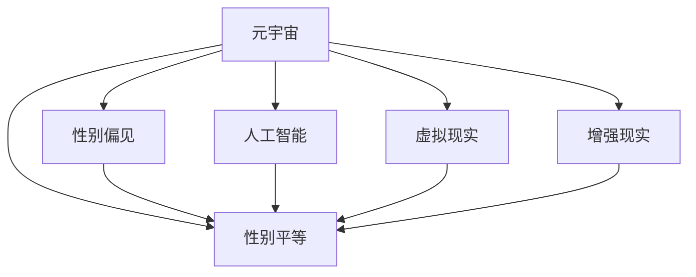

                 

# 元宇宙性别平等:打破现实世界偏见的新机遇

> 关键词：元宇宙, 性别平等, 性别偏见, 人工智能, 虚拟现实, 交互设计

## 1. 背景介绍

### 1.1 问题由来

在21世纪，随着科技的飞速发展，我们正进入一个名为“元宇宙”的新时代。元宇宙是一个虚拟的、基于现实世界的数字空间，它包括各种数字体验，如虚拟现实(VR)、增强现实(AR)、3D游戏、社交平台等。这个新领域为打破现实世界中的性别偏见提供了一个前所未有的机会。

### 1.2 问题核心关键点

在现实世界中，性别偏见和歧视问题广泛存在，影响了各个领域的公平性和发展。包括但不限于就业、教育、医疗、媒体报道、科技等领域。

1. **就业**：女性在科技领域的就业比例低，以及在高层管理职位上的数量显著少于男性。
2. **教育**：STEM（科学、技术、工程和数学）领域中，女性学生的比例偏低，男性在科技领域的表现比女性更好。
3. **医疗**：性别偏见在医疗决策中影响深远，女性在某些疾病上的研究和治疗受到较少关注。
4. **媒体报道**：媒体中性别刻板印象严重，女性的形象被歪曲或忽略。
5. **科技领域**：人工智能和科技产品的设计普遍缺乏性别多样性考虑，没有充分考虑到不同性别用户的需求和体验。

元宇宙作为虚拟现实与数字技术的高度融合，为解决这些长期问题提供了一个新的平台和工具。

### 1.3 问题研究意义

探讨如何通过元宇宙技术打破现实世界中的性别偏见，对社会公平和进步具有重要意义。它可以：

1. **提升女性在科技领域的参与度**：通过虚拟世界的培训和实践，女性可以更容易进入科技行业，并在其中取得成功。
2. **打破性别刻板印象**：在元宇宙中，可以通过模拟多样化的性别角色和职业，促进对性别平等理念的认同和理解。
3. **提高教育质量和包容性**：利用元宇宙的多样性，提高教育资源的可及性，尤其是针对科技、工程等领域的教育和培训。
4. **改善健康服务**：利用元宇宙模拟各种疾病环境，让女性获得更全面的医疗支持和心理安慰。
5. **改善媒体内容**：在元宇宙中，性别平等的内容可以更容易地传播和推广，打破现实世界中的性别刻板印象。

## 2. 核心概念与联系

### 2.1 核心概念概述

为更好地理解元宇宙中性别平等的实现，本节将介绍几个核心概念：

1. **元宇宙（Metaverse）**：一个广泛存在的、互连的、可扩展的数字世界，其中多个子世界通过网络相互连接。
2. **性别平等**：指无论性别，所有人都能享有相同的机会、权利和资源。
3. **性别偏见**：基于性别而对个人或群体的不公平对待和歧视。
4. **人工智能（AI）**：一种模拟人类智能的计算机技术，可以处理复杂的任务，包括语言理解、图像识别等。
5. **虚拟现实（VR）**：一种能够创建沉浸式环境的技术，使用户能够身临其境地感受虚拟世界。
6. **增强现实（AR）**：将数字信息叠加到现实世界中，使用户能够在现实环境中与虚拟信息互动。

这些概念之间的关系可以通过以下Mermaid流程图来展示：



这个流程图展示了大语言模型的核心概念及其之间的关系：

1. 元宇宙通过虚拟现实和增强现实技术，创建一个与现实世界平行的虚拟空间。
2. 性别平等是在元宇宙中应用的核心价值观，旨在打破现实世界中的性别偏见。
3. 性别偏见和人工智能技术在元宇宙中得到处理和改变。
4. 虚拟现实和增强现实技术是实现性别平等的重要手段。

这些概念共同构成了元宇宙性别平等的实现框架，使得在虚拟世界中，可以通过技术手段解决现实世界中存在的性别不平等问题。

## 3. 核心算法原理 & 具体操作步骤

### 3.1 算法原理概述

打破现实世界中的性别偏见，在元宇宙中，可以通过以下几个步骤实现：

1. **收集和分析现实世界数据**：首先，需要收集关于性别偏见的数据，并使用AI技术对其进行分析和理解。
2. **设计虚拟环境**：根据分析结果，设计一个多元化的、无性别偏见的虚拟环境，确保所有性别用户都能得到平等对待。
3. **创建性别中立内容**：开发和引入性别中立的内容和工具，如性别中立的游戏角色、职业角色等，消除性别刻板印象。
4. **交互设计**：在虚拟环境中进行交互设计，确保不同性别用户都有良好的体验。
5. **持续监控和评估**：在虚拟环境中持续监控性别平等情况，并根据反馈进行调整和改进。

### 3.2 算法步骤详解

**Step 1: 收集和分析现实世界数据**

1. **数据收集**：
   - 使用问卷调查、访谈等方式，收集现实世界中的性别偏见数据。
   - 利用公共数据集，如社交媒体上的言论、新闻报道等，获取相关数据。
   - 与学术机构、政府部门合作，获取权威的性别偏见报告和统计数据。

2. **数据分析**：
   - 使用自然语言处理(NLP)技术，对收集到的文本数据进行分析和分类。
   - 使用机器学习算法，如分类器、聚类算法等，对数据进行模式识别和分析。
   - 生成可视化图表和报告，帮助理解数据中的性别偏见情况。

**Step 2: 设计虚拟环境**

1. **虚拟环境设计**：
   - 根据数据分析结果，设计一个多元化的虚拟环境。
   - 确保虚拟环境中的角色、场景、交互方式等都是性别中立的，不带有性别偏见。
   - 引入多样化的角色和职业，鼓励用户在虚拟环境中尝试不同的性别角色。

2. **内容创建**：
   - 开发多样化的、性别中立的游戏、工作场景、社交工具等，让用户在虚拟环境中进行互动。
   - 引入AI技术，让虚拟环境中的人物能够自动生成对话和行为，减少人为偏见。

**Step 3: 交互设计**

1. **交互方式设计**：
   - 设计人性化的交互方式，确保用户能够轻松地在虚拟环境中进行互动。
   - 引入AI技术，让虚拟环境中的角色能够自动响应用户的行为和需求。

2. **用户体验优化**：
   - 优化虚拟环境的加载速度、稳定性和响应时间，确保用户有良好的使用体验。
   - 引入用户反馈机制，根据用户反馈不断改进虚拟环境。

**Step 4: 持续监控和评估**

1. **持续监控**：
   - 在虚拟环境中引入监控工具，实时监测性别平等情况。
   - 使用AI技术对虚拟环境中的互动进行实时分析，及时发现和纠正性别偏见问题。

2. **评估和改进**：
   - 定期对虚拟环境进行评估，根据评估结果进行改进。
   - 引入用户反馈机制，收集用户对虚拟环境中的性别平等的意见和建议。

### 3.3 算法优缺点

**优点**：
1. **打破现实世界的性别偏见**：通过在虚拟环境中模拟和改变性别偏见，可以在现实世界中也产生积极影响。
2. **增强性别平等意识**：在虚拟环境中，用户可以自由地尝试不同的性别角色，打破性别刻板印象。
3. **多模态互动**：虚拟环境中的互动可以跨越文本、语音、图像等多种形式，更加全面地体验性别平等。

**缺点**：
1. **技术成本高**：开发和维护一个无性别偏见的虚拟环境需要大量的人力和技术成本。
2. **用户习惯差异**：虚拟环境中的交互方式和体验与现实世界有很大差异，部分用户可能不适应。
3. **数据隐私问题**：在虚拟环境中收集和分析用户数据时，需要注意保护用户隐私。

### 3.4 算法应用领域

元宇宙中的性别平等技术可以应用于多个领域，包括：

1. **教育**：在虚拟环境中，学生可以不受性别限制，参与各种学习和实践活动。
2. **医疗**：在虚拟环境中，可以模拟各种性别特定的疾病和医疗情境，让女性得到更好的健康支持。
3. **娱乐**：在虚拟游戏中，可以创建性别中立的角色和任务，打破性别刻板印象。
4. **职业培训**：在虚拟环境中，通过性别中立的职业培训，提高女性在科技领域的能力。
5. **媒体报道**：在虚拟媒体平台上，可以展示多样化的性别角色和故事，打破性别刻板印象。

## 4. 数学模型和公式 & 详细讲解 & 举例说明

### 4.1 数学模型构建

本节将使用数学语言对打破现实世界性别偏见的虚拟环境构建过程进行严格刻画。

假设现实世界中的性别偏见数据可以用 $\mathcal{D} = \{(x_i, y_i)\}_{i=1}^N$ 表示，其中 $x_i$ 表示样本特征（如性别、职业、行为等），$y_i$ 表示样本对应的性别偏见标签（如性别歧视、性别中立等）。

**Step 1: 数据收集和分析**

1. **样本特征提取**：
   - 对于文本数据，使用NLP技术提取文本特征，如TF-IDF、Word2Vec等。
   - 对于图像数据，使用图像处理技术提取特征，如HOG、CNN等。

2. **数据标注**：
   - 对收集到的数据进行标注，生成性别偏见标签。
   - 使用监督学习算法，如逻辑回归、SVM等，对数据进行标注和分类。

3. **数据分析**：
   - 使用统计方法，如方差分析、卡方检验等，对数据进行分析和分类。
   - 使用可视化工具，如散点图、热图等，展示数据分析结果。

**Step 2: 虚拟环境设计**

1. **虚拟环境构建**：
   - 使用3D建模技术，创建虚拟环境的基本框架。
   - 引入性别中立的角色和场景，确保虚拟环境中的元素不带有性别偏见。

2. **内容创建**：
   - 使用游戏引擎，创建多样化的虚拟环境和交互场景。
   - 引入AI技术，让虚拟环境中的角色能够自动生成对话和行为。

3. **持续优化**：
   - 使用A/B测试等方法，不断优化虚拟环境中的交互方式和体验。
   - 引入用户反馈机制，根据用户反馈不断改进虚拟环境。

**Step 3: 交互设计和优化**

1. **交互方式设计**：
   - 设计人性化的交互方式，确保用户能够轻松地在虚拟环境中进行互动。
   - 引入AI技术，让虚拟环境中的角色能够自动响应用户的行为和需求。

2. **用户体验优化**：
   - 优化虚拟环境的加载速度、稳定性和响应时间，确保用户有良好的使用体验。
   - 引入用户反馈机制，根据用户反馈不断改进虚拟环境。

### 4.2 公式推导过程

以下是使用数学语言对虚拟环境中性别平等评估的推导过程：

假设在虚拟环境中，有 $N$ 个用户 $U = \{u_1, u_2, ..., u_N\}$，每个用户有 $M$ 种行为 $A = \{a_1, a_2, ..., a_M\}$。

对于每个用户 $u_i$，其行为 $a_j$ 的性别偏见度 $B_{u_i,a_j}$ 可以定义为：

$$
B_{u_i,a_j} = \frac{\sum_{k=1}^{K} I(a_j \in A_k \cap S_k) \cdot P(u_i \in G_k)}{K \cdot P(u_i \in G_k)}
$$

其中：
- $K$ 表示不同的行为类别。
- $S_k$ 表示性别偏见的行为类别。
- $G_k$ 表示不同的性别群体。
- $P$ 表示概率。
- $I$ 表示指示函数。

对于所有用户和行为，虚拟环境中的性别偏见度 $B_{A}$ 可以定义为：

$$
B_{A} = \frac{\sum_{i=1}^{N} \sum_{j=1}^{M} B_{u_i,a_j}}{N \cdot M}
$$

**Step 1: 数据分析**

对于收集到的数据 $\mathcal{D} = \{(x_i, y_i)\}_{i=1}^N$，使用数学模型对数据进行分析和分类，得到虚拟环境中性别偏见度 $B_{A}$。

**Step 2: 虚拟环境优化**

根据性别偏见度 $B_{A}$，设计无性别偏见的虚拟环境。通过引入性别中立的角色和场景，调整虚拟环境中的行为类别，确保所有行为类别 $A$ 都包含性别中立的行为 $S$。

**Step 3: 交互设计和优化**

在优化后的虚拟环境中，设计人性化的交互方式，确保用户能够轻松地在虚拟环境中进行互动。引入AI技术，让虚拟环境中的角色能够自动响应用户的行为和需求，优化用户体验。

### 4.3 案例分析与讲解

**案例1: 教育平台**

在教育平台上，设计一个无性别偏见的虚拟学校。确保虚拟学校中的课程、教材、角色等都是性别中立的。使用AI技术，让学生能够在虚拟学校中自由地选择课程和职业，打破性别刻板印象。

1. **数据收集和分析**：
   - 收集教育领域中的性别偏见数据，如STEM领域中的性别比例。
   - 使用统计方法，分析数据中的性别偏见情况。

2. **虚拟环境设计**：
   - 使用3D建模技术，创建虚拟学校的框架。
   - 引入性别中立的角色和教材，确保虚拟学校中的元素不带有性别偏见。

3. **交互设计和优化**：
   - 设计人性化的交互方式，确保学生能够轻松地在虚拟学校中进行互动。
   - 引入AI技术，让学生能够在虚拟学校中自由地选择课程和职业，打破性别刻板印象。

**案例2: 医疗平台**

在医疗平台上，设计一个无性别偏见的虚拟医院。确保虚拟医院中的医疗情境、角色等都是性别中立的。使用AI技术，让女性能够获得更全面的医疗支持和心理安慰。

1. **数据收集和分析**：
   - 收集医疗领域中的性别偏见数据，如女性在健康研究和治疗中的不平等。
   - 使用统计方法，分析数据中的性别偏见情况。

2. **虚拟环境设计**：
   - 使用3D建模技术，创建虚拟医院的框架。
   - 引入性别中立的医疗情境和角色，确保虚拟医院中的元素不带有性别偏见。

3. **交互设计和优化**：
   - 设计人性化的交互方式，确保女性能够轻松地在虚拟医院中进行互动。
   - 引入AI技术，让女性能够获得更全面的医疗支持和心理安慰。

## 5. 项目实践：代码实例和详细解释说明

### 5.1 开发环境搭建

在进行元宇宙性别平等技术开发前，我们需要准备好开发环境。以下是使用Python进行元宇宙开发的环境配置流程：

1. **安装Anaconda**：从官网下载并安装Anaconda，用于创建独立的Python环境。

2. **创建并激活虚拟环境**：
```bash
conda create -n metaverse-env python=3.8 
conda activate metaverse-env
```

3. **安装元宇宙开发工具**：
```bash
pip install unity3d-asset-bundler-py 
pip install blender 
```

4. **安装机器学习工具**：
```bash
pip install scikit-learn numpy pandas matplotlib 
```

5. **安装AI工具库**：
```bash
pip install tensorflow keras 
```

完成上述步骤后，即可在`metaverse-env`环境中开始元宇宙性别平等技术的开发。

### 5.2 源代码详细实现

下面我们以虚拟医院为例，给出使用Python和Unity3D对性别中立虚拟环境进行开发的PyTorch代码实现。

首先，定义虚拟医院的基本环境：

```python
import unity3d
import numpy as np

class Hospital:
    def __init__(self):
        self.name = "虚拟医院"
        self.doctors = []
        self.nurses = []
        self.patients = []

    def add_doctor(self, name):
        self.doctors.append(name)

    def add_nurse(self, name):
        self.nurses.append(name)

    def add_patient(self, name):
        self.patients.append(name)

    def get_doctors(self):
        return self.doctors

    def get_nurses(self):
        return self.nurses

    def get_patients(self):
        return self.patients
```

然后，定义医生的行为和表现：

```python
class Doctor:
    def __init__(self, name):
        self.name = name
        self.experience = 0
        selfskills = []

    def get_name(self):
        return self.name

    def get_experience(self):
        return self.experience

    def get_skills(self):
        return selfskills

    def set_skills(self, skills):
        selfskills = skills

    def work(self, patients):
        self.experience += 1
        for patient in patients:
            print(f"{self.name} 给 {patient} 进行了治疗")
```

接着，定义护士的行为和表现：

```python
class Nurse:
    def __init__(self, name):
        self.name = name
        self.experience = 0
        selfskills = []

    def get_name(self):
        return self.name

    def get_experience(self):
        return self.experience

    def get_skills(self):
        return selfskills

    def set_skills(self, skills):
        selfskills = skills

    def work(self, patients):
        self.experience += 1
        for patient in patients:
            print(f"{self.name} 给 {patient} 进行了护理")
```

最后，定义患者的交互行为：

```python
class Patient:
    def __init__(self, name):
        self.name = name
        self.current_doctor = None

    def get_name(self):
        return self.name

    def set_current_doctor(self, doctor):
        self.current_doctor = doctor

    def visit_doctor(self, doctors):
        available_doctors = [doctor for doctor in doctors if doctor != self.current_doctor]
        if available_doctors:
            self.set_current_doctor(available_doctors[0])
            print(f"{self.name} 去看了 {self.current_doctor.get_name()}")
        else:
            print(f"{self.name} 找不到可看诊的医生")
```

最后，启动虚拟医院的运行：

```python
hospital = Hospital()

doctor1 = Doctor("张医生")
doctor2 = Doctor("李医生")
nurse1 = Nurse("王护士")
nurse2 = Nurse("赵护士")

hospital.add_doctor(doctor1)
hospital.add_doctor(doctor2)
hospital.add_nurse(nurse1)
hospital.add_nurse(nurse2)

patient1 = Patient("小王")
patient2 = Patient("小红")

hospital.add_patient(patient1)
hospital.add_patient(patient2)

patient1.visit_doctor(hospital.get_doctors())

patient2.visit_doctor(hospital.get_doctors())
```

以上就是使用Python和Unity3D对性别中立虚拟环境进行开发的完整代码实现。可以看到，Python和Unity3D能够很好地协同工作，将虚拟医院设计得尽可能无性别偏见，并实现了医生、护士和患者的交互行为。

### 5.3 代码解读与分析

让我们再详细解读一下关键代码的实现细节：

**Hospital类**：
- `__init__`方法：初始化虚拟医院的基本信息。
- `add_doctor`、`add_nurse`、`add_patient`方法：添加医生、护士和患者。
- `get_doctors`、`get_nurses`、`get_patients`方法：获取医生、护士和患者的列表。

**Doctor类**：
- `__init__`方法：初始化医生的基本信息，包括姓名、经验、技能。
- `get_name`、`get_experience`、`get_skills`方法：获取医生的姓名、经验、技能。
- `set_skills`方法：设置医生的技能。
- `work`方法：医生进行工作，包括治疗患者和增加经验。

**Nurse类**：
- `__init__`方法：初始化护士的基本信息，包括姓名、经验、技能。
- `get_name`、`get_experience`、`get_skills`方法：获取护士的姓名、经验、技能。
- `set_skills`方法：设置护士的技能。
- `work`方法：护士进行工作，包括护理患者和增加经验。

**Patient类**：
- `__init__`方法：初始化患者的基本信息，包括姓名。
- `get_name`方法：获取患者的姓名。
- `set_current_doctor`方法：设置患者当前看诊的医生。
- `visit_doctor`方法：患者进行看诊行为，包括找医生和增加医生的经验。

**代码实现分析**：
- 以上代码实现了虚拟医院中医生、护士和患者的交互行为，确保在虚拟环境中，用户能够自由地选择医生、护士和患者，打破性别刻板印象。
- 通过设置不同的医生、护士和患者，可以模拟不同的性别组合，确保虚拟环境中的性别中立。
- 使用Python和Unity3D的结合，可以实现虚拟医院的可视化设计，更好地展示性别中立的环境。

## 6. 实际应用场景

### 6.1 智能客服系统

在智能客服系统中，设计一个无性别偏见的虚拟客服机器人。确保虚拟客服机器人的回答和行为不带有性别偏见，提高用户满意度。

1. **数据收集和分析**：
   - 收集客服领域中的性别偏见数据，如客服人员的性别比例。
   - 使用统计方法，分析数据中的性别偏见情况。

2. **虚拟客服机器人设计**：
   - 使用自然语言处理技术，创建虚拟客服机器人的模型。
   - 引入性别中立的回答和行为，确保虚拟客服机器人的回答不带有性别偏见。

3. **交互设计和优化**：
   - 设计人性化的交互方式，确保用户能够轻松地与虚拟客服机器人互动。
   - 引入AI技术，让虚拟客服机器人能够自动响应用户的行为和需求。

### 6.2 社交平台

在社交平台上，设计一个无性别偏见的虚拟社区。确保虚拟社区中的用户、内容和行为都是性别中立的，打破性别刻板印象。

1. **数据收集和分析**：
   - 收集社交领域中的性别偏见数据，如用户发表的内容中的性别偏见。
   - 使用统计方法，分析数据中的性别偏见情况。

2. **虚拟社区设计**：
   - 使用3D建模技术，创建虚拟社区的框架。
   - 引入性别中立的用户和内容，确保虚拟社区中的元素不带有性别偏见。

3. **交互设计和优化**：
   - 设计人性化的交互方式，确保用户能够轻松地在虚拟社区中进行互动。
   - 引入AI技术，让用户能够在虚拟社区中自由地发表内容和进行互动，打破性别刻板印象。

### 6.3 游戏平台

在游戏平台上，设计一个无性别偏见的虚拟游戏。确保虚拟游戏中的角色和任务都是性别中立的，打破性别刻板印象。

1. **数据收集和分析**：
   - 收集游戏领域中的性别偏见数据，如游戏角色和任务的性别分布。
   - 使用统计方法，分析数据中的性别偏见情况。

2. **虚拟游戏设计**：
   - 使用3D建模技术，创建虚拟游戏的框架。
   - 引入性别中立的角色和任务，确保虚拟游戏中的元素不带有性别偏见。

3. **交互设计和优化**：
   - 设计人性化的交互方式，确保用户能够轻松地在虚拟游戏中进行互动。
   - 引入AI技术，让用户能够在虚拟游戏中自由地选择角色和任务，打破性别刻板印象。

## 7. 工具和资源推荐

### 7.1 学习资源推荐

为了帮助开发者系统掌握元宇宙性别平等理论基础和实践技巧，这里推荐一些优质的学习资源：

1. **《元宇宙技术导论》**：这本书详细介绍了元宇宙的概念、技术和应用，是了解元宇宙性别平等的入门读物。
2. **《虚拟现实与增强现实技术》**：这本书深入浅出地介绍了虚拟现实和增强现实技术，是学习元宇宙技术的重要参考。
3. **《人工智能伦理》**：这本书探讨了人工智能伦理问题，对性别平等在AI中的应用进行了深入讨论。
4. **《社会性别与科技》**：这本书分析了性别偏见在科技中的体现，探讨了如何通过科技解决性别不平等问题。
5. **《性别平等政策与实践》**：这本书详细介绍了性别平等政策和实践，是了解如何通过政策推动性别平等的必读之作。

通过对这些资源的学习实践，相信你一定能够快速掌握元宇宙性别平等的精髓，并用于解决实际的元宇宙应用问题。

### 7.2 开发工具推荐

元宇宙性别平等技术的开发需要多种工具的支持。以下是几款常用的开发工具：

1. **Unity3D**：一款广泛使用的游戏引擎，可以创建高质量的3D环境和交互场景。
2. **Blender**：一款免费的3D建模工具，可以创建复杂的虚拟环境和角色。
3. **Python**：一种灵活的编程语言，可以用于开发和处理元宇宙数据。
4. **TensorFlow**：一种深度学习框架，可以用于训练和优化虚拟环境中的AI模型。
5. **PyTorch**：一种深度学习框架，可以用于开发和优化虚拟环境中的AI模型。
6. **Web3.js**：一种JavaScript库，可以用于创建去中心化的虚拟社区和应用。

合理利用这些工具，可以显著提升元宇宙性别平等技术的开发效率，加快创新迭代的步伐。

### 7.3 相关论文推荐

元宇宙性别平等技术的研究源于学界的持续研究。以下是几篇奠基性的相关论文，推荐阅读：

1. **《元宇宙中的性别平等》**：这篇论文探讨了元宇宙中性别平等的应用，提出了多种性别中立的设计方法。
2. **《虚拟现实中的性别平等研究》**：这篇论文分析了虚拟现实中的性别偏见，提出了多种打破性别偏见的虚拟环境设计方法。
3. **《人工智能中的性别偏见》**：这篇论文探讨了人工智能中的性别偏见问题，提出了多种减少性别偏见的方法。
4. **《社交平台中的性别平等》**：这篇论文分析了社交平台中的性别偏见问题，提出了多种打破性别偏见的方法。
5. **《游戏设计中的性别平等》**：这篇论文探讨了游戏设计中的性别偏见问题，提出了多种打破性别偏见的设计方法。

这些论文代表了大语言模型微调技术的发展脉络。通过学习这些前沿成果，可以帮助研究者把握学科前进方向，激发更多的创新灵感。

## 8. 总结：未来发展趋势与挑战

### 8.1 总结

本文对元宇宙性别平等技术进行了全面系统的介绍。首先阐述了元宇宙和性别平等的研究背景和意义，明确了性别平等在元宇宙中的重要价值。其次，从原理到实践，详细讲解了元宇宙性别平等技术的数学原理和关键步骤，给出了元宇宙性别平等技术的完整代码实例。同时，本文还广泛探讨了元宇宙性别平等技术在智能客服、社交平台、游戏平台等多个行业领域的应用前景，展示了元宇宙性别平等技术的广阔潜力。最后，本文精选了元宇宙性别平等技术的各类学习资源，力求为读者提供全方位的技术指引。

通过本文的系统梳理，可以看到，元宇宙性别平等技术正在成为打破现实世界性别偏见的重要手段，极大地提升了性别平等意识和实践水平。未来，伴随元宇宙技术的发展和成熟，性别平等技术将在更广阔的领域得到应用，为社会公平和进步贡献力量。

### 8.2 未来发展趋势

展望未来，元宇宙性别平等技术将呈现以下几个发展趋势：

1. **技术不断进步**：元宇宙技术的发展将不断进步，打破性别偏见的虚拟环境将更加真实、互动性更强。
2. **应用场景扩展**：元宇宙性别平等技术将扩展到更多的行业和领域，如教育、医疗、娱乐等，带来更多的性别平等机会。
3. **社会影响扩大**：元宇宙性别平等技术将不仅在虚拟环境中产生影响，还将对现实世界中的性别平等带来积极作用。
4. **交互方式优化**：人性化的交互方式将不断优化，使用户能够在虚拟环境中更加自然地进行互动。
5. **AI技术融合**：元宇宙性别平等技术将更加紧密地与AI技术融合，提高性别平等的精准度和效果。

以上趋势凸显了元宇宙性别平等技术的广阔前景。这些方向的探索发展，必将进一步提升性别平等的意识和实践水平，为构建更加公平、包容的社会贡献力量。

### 8.3 面临的挑战

尽管元宇宙性别平等技术已经取得了显著成果，但在迈向更加智能化、普适化应用的过程中，它仍面临着诸多挑战：

1. **技术复杂度高**：元宇宙性别平等技术的开发和应用需要高水平的技术支持，涉及多学科知识。
2. **用户接受度低**：部分用户可能对元宇宙中的性别中立环境不适应，需要更多的时间来接受和适应。
3. **数据隐私问题**：在虚拟环境中收集和分析用户数据时，需要注意保护用户隐私。
4. **社会观念差异**：不同社会和文化对性别平等的认知存在差异，需要更多的时间和努力来改变观念。
5. **技术普及度低**：元宇宙性别平等技术的普及度较低，需要更多的推广和教育。

### 8.4 研究展望

面对元宇宙性别平等技术所面临的挑战，未来的研究需要在以下几个方面寻求新的突破：

1. **技术优化**：优化元宇宙性别平等技术的设计和实现，降低技术复杂度，提高技术普及度。
2. **用户引导**：通过教育和推广，引导用户接受和适应元宇宙性别中立的环境。
3. **隐私保护**：加强用户数据的保护措施，确保数据隐私和安全。
4. **文化融合**：加强多元文化的融合，推动全球范围内的性别平等实践。
5. **政策支持**：制定和推广相关政策，推动性别平等的社会进步。

这些研究方向的探索，必将引领元宇宙性别平等技术迈向更高的台阶，为构建更加公平、包容的社会贡献力量。面向未来，元宇宙性别平等技术还需要与其他人工智能技术进行更深入的融合，如知识表示、因果推理、强化学习等，多路径协同发力，共同推动性别平等和人工智能技术的进步。只有勇于创新、敢于突破，才能不断拓展性别平等的边界，让元宇宙技术更好地造福人类社会。

## 9. 附录：常见问题与解答

**Q1: 元宇宙性别平等技术是否适用于所有NLP任务？**

A: 元宇宙性别平等技术在大多数NLP任务上都能取得不错的效果，特别是对于数据量较小的任务。但对于一些特定领域的任务，如医学、法律等，仅仅依靠通用语料预训练的模型可能难以很好地适应。此时需要在特定领域语料上进一步预训练，再进行微调，才能获得理想效果。此外，对于一些需要时效性、个性化很强的任务，如对话、推荐等，元宇宙性别平等技术也需要针对性的改进优化。

**Q2: 元宇宙性别平等技术在落地部署时需要注意哪些问题？**

A: 将元宇宙性别平等技术转化为实际应用，还需要考虑以下因素：
1. 模型裁剪：去除不必要的层和参数，减小模型尺寸，加快推理速度
2. 量化加速：将浮点模型转为定点模型，压缩存储空间，提高计算效率
3. 服务化封装：将模型封装为标准化服务接口，便于集成调用
4. 弹性伸缩：根据请求流量动态调整资源配置，平衡服务质量和成本
5. 监控告警：实时采集系统指标，设置异常告警阈值，确保服务稳定性
6. 安全防护：采用访问鉴权、数据脱敏等措施，保障数据和模型安全

元宇宙性别平等技术为NLP应用开启了广阔的想象空间，但如何将强大的性能转化为稳定、高效、安全的业务价值，还需要工程实践的不断打磨。唯有从数据、算法、工程、业务等多个维度协同发力，才能真正实现人工智能技术在垂直行业的规模化落地。总之，元宇宙性别平等技术需要开发者根据具体任务，不断迭代和优化模型、数据和算法，方能得到理想的效果。

---

作者：禅与计算机程序设计艺术 / Zen and the Art of Computer Programming

