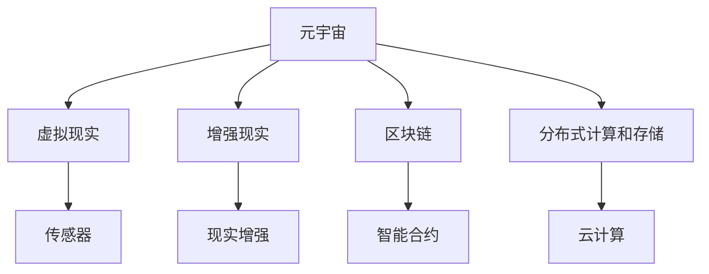

                 

# 元宇宙技术：虚拟世界的构建与互联

## 1. 背景介绍

### 1.1 问题由来
近年来，随着互联网技术的不断成熟和普及，人类社会进入了一个新的阶段——元宇宙（Metaverse）时代。元宇宙是一个由数字技术构建的虚拟世界，它包含着丰富的内容、互动体验和社交功能，为人类提供了全新的生活和工作方式。然而，元宇宙的构建和运行涉及众多复杂的技术问题，如虚拟世界的建模、渲染、交互、安全和隐私保护等，这需要跨学科的深度合作和技术创新。

### 1.2 问题核心关键点
元宇宙技术包括但不限于以下几个核心关键点：

- **虚拟世界的建模和渲染**：通过三维建模、仿真技术、物理引擎等手段，创建逼真的虚拟环境。
- **实时交互和动态更新**：用户能够以自然、流畅的方式与虚拟世界互动，包括动作捕捉、语音交互、手势识别等。
- **分布式架构**：元宇宙需要大规模分布式计算和存储支持，确保实时性和稳定性。
- **安全和隐私保护**：确保用户数据和虚拟资产的安全，防止网络攻击和欺诈。
- **跨平台和跨设备兼容性**：元宇宙应能够在多种设备上无缝运行，提供统一的体验。

这些核心技术相互支撑，共同构成了元宇宙的技术体系，并推动了虚拟世界的构建与互联。

### 1.3 问题研究意义
研究元宇宙技术，对于推动数字经济的进一步发展，提升人类生活质量，拓展文化娱乐和教育等领域的应用，具有重要意义：

1. **数字经济的推动**：元宇宙为数字经济提供了全新的商业和社交平台，促进了数字资产的交易和流通。
2. **生活品质的提升**：通过虚拟世界，人们可以在虚拟空间中实现远距离社交、娱乐和学习，极大地丰富了生活体验。
3. **跨领域应用的拓展**：元宇宙技术能够应用于虚拟旅游、虚拟教育和虚拟医疗等领域，推动相关产业的创新发展。
4. **技术创新的引领**：元宇宙技术涉及众多前沿技术，如人工智能、虚拟现实（VR）、增强现实（AR）、区块链等，能够推动这些技术的发展和成熟。

## 2. 核心概念与联系

### 2.1 核心概念概述

为更好地理解元宇宙技术的核心概念和架构，本节将介绍几个密切相关的核心概念：

- **元宇宙（Metaverse）**：通过虚拟现实、增强现实和区块链等技术，构建的一个虚拟世界，提供沉浸式体验和交互功能。
- **虚拟现实（VR）**：通过模拟现实世界的感官体验，使用户能够在虚拟环境中进行互动。
- **增强现实（AR）**：在现实世界中叠加虚拟信息，增强用户的感官体验。
- **区块链技术**：保障数据和虚拟资产的安全，支持虚拟经济和社交系统的运行。
- **分布式计算和存储**：构建分布式网络，提供高可用性和可扩展性，支持大规模的虚拟世界运行。

这些核心概念之间的逻辑关系可以通过以下Mermaid流程图来展示：



这个流程图展示了大语言模型的核心概念及其之间的关系：

1. 元宇宙通过虚拟现实、增强现实等技术，构建了一个虚拟世界。
2. 区块链技术保障了虚拟世界中的数据和资产安全。
3. 分布式计算和存储提供了大规模虚拟世界的支持。
4. VR技术通过传感器模拟现实世界的感官体验。
5. AR技术在现实世界中叠加虚拟信息，增强用户体验。

这些核心概念共同构成了元宇宙的技术体系，使其能够提供丰富的互动体验和深度的沉浸感。

## 3. 核心算法原理 & 具体操作步骤
### 3.1 算法原理概述

元宇宙技术的构建涉及多方面的核心算法和操作步骤，包括但不限于以下方面：

- **虚拟世界的建模和渲染**：使用三维建模技术创建虚拟环境，通过物理引擎实现逼真的光影效果和碰撞检测。
- **实时交互和动态更新**：实现用户在虚拟世界中的实时动作捕捉和反馈，通过网络传输和优化算法确保低延迟和高帧率。
- **分布式架构的搭建**：设计分布式网络和节点，通过负载均衡和冗余设计保障系统的稳定性和扩展性。
- **安全和隐私保护**：使用加密技术、智能合约等手段，确保用户数据和虚拟资产的安全。

### 3.2 算法步骤详解

元宇宙技术的具体操作步骤包括以下几个关键环节：

**Step 1: 数据采集与预处理**
- 收集现实世界的地理、环境、用户行为等数据。
- 对数据进行清洗、归一化和增强，确保数据质量和多样性。

**Step 2: 三维建模和物理仿真**
- 使用三维建模软件创建虚拟世界的几何模型。
- 通过物理引擎实现物体的物理属性，如碰撞、弹性和摩擦等。

**Step 3: 实时渲染和光照计算**
- 使用渲染引擎对虚拟世界进行渲染，实现逼真的视觉效果。
- 使用光照计算算法，模拟光源、阴影和反射等效果。

**Step 4: 实时交互和动态更新**
- 实现用户的实时动作捕捉和反馈，通过网络传输和优化算法确保低延迟和高帧率。
- 设计动态更新的机制，确保虚拟世界的内容能够实时更新和交互。

**Step 5: 分布式架构的搭建**
- 设计分布式网络和节点，通过负载均衡和冗余设计保障系统的稳定性和扩展性。
- 使用区块链技术实现分布式账本和智能合约，确保系统的安全性和透明性。

**Step 6: 安全和隐私保护**
- 使用加密技术保护用户数据和虚拟资产的安全。
- 设计访问控制和权限管理机制，确保用户身份和行为的安全。

### 3.3 算法优缺点

元宇宙技术的构建涉及到多个核心算法和操作步骤，具有以下优点：

- **沉浸式体验**：通过虚拟现实、增强现实等技术，提供高度沉浸式的体验，让用户能够在虚拟世界中自由探索和互动。
- **高扩展性**：使用分布式计算和存储技术，能够支持大规模的虚拟世界运行，确保系统的稳定性和可扩展性。
- **安全性**：通过区块链和智能合约等技术，保障数据和虚拟资产的安全，防止网络攻击和欺诈。
- **多样性**：元宇宙技术能够应用于多个领域，如虚拟旅游、虚拟教育和虚拟医疗等，推动相关产业的创新发展。

同时，该技术也存在一些局限性：

- **技术复杂度高**：涉及众多复杂技术，如三维建模、物理引擎、分布式计算等，开发和维护难度大。
- **数据隐私问题**：在虚拟世界中，用户数据和虚拟资产的安全保障是一个重要挑战。
- **设备和成本**：实现高质量的虚拟现实和增强现实，需要高性能设备和高成本。
- **用户接受度**：元宇宙技术虽然潜力巨大，但用户接受度和普及度还有待提高。

### 3.4 算法应用领域

元宇宙技术已经在多个领域得到了初步应用，包括但不限于以下几个方面：

- **虚拟旅游**：创建虚拟旅游场景，用户可以在虚拟世界中进行观光和探险。
- **虚拟教育**：提供虚拟课堂和实验室，提升教学和学习效果。
- **虚拟医疗**：进行虚拟手术和康复训练，提升医疗服务水平。
- **虚拟商业**：构建虚拟商业平台，支持线上交易和虚拟社交。
- **虚拟音乐会**：举办虚拟音乐会和展览，提供沉浸式文化和艺术体验。

除了这些初步应用外，元宇宙技术还有广阔的发展空间，将在更多领域得到应用，为经济社会发展注入新的动力。

## 4. 数学模型和公式 & 详细讲解  
### 4.1 数学模型构建

本节将使用数学语言对元宇宙技术的核心算法和操作步骤进行更加严格的刻画。

记虚拟世界的几何模型为 $M$，其中包含点 $(x,y,z)$ 和对应的几何属性 $A$。记物理引擎为 $P$，实现物体的物理属性和交互效果。记渲染引擎为 $R$，对虚拟世界进行渲染，实现逼真的视觉效果。记网络传输和优化算法为 $T$，确保实时性和稳定性。记分布式架构为 $D$，包含多个计算节点和网络拓扑结构。记加密和智能合约为 $S$，保障数据和资产的安全。

元宇宙技术的数学模型可以表示为：

$$
\begin{aligned}
\mathcal{M} &= \{M, P, R, T, D, S\} \\
M &= \{(x,y,z), A\} \\
P &= \{(x,y,z), \mathcal{F}\} \\
R &= \{(x,y,z), \mathcal{C}\} \\
T &= \{(x,y,z), \mathcal{N}\} \\
D &= \{(x,y,z), \mathcal{N}\} \\
S &= \{(x,y,z), \mathcal{K}\}
\end{aligned}
$$

其中 $\mathcal{F}$ 为物理属性函数，$\mathcal{C}$ 为渲染函数，$\mathcal{N}$ 为网络传输函数，$\mathcal{K}$ 为加密和智能合约函数。

### 4.2 公式推导过程

以下我们以虚拟现实技术为例，推导其核心算法的数学表达。

假设虚拟现实系统的渲染率为 $F$，用户响应时间为 $R$，网络带宽为 $B$，帧率优化策略为 $\mathcal{O}$。则渲染时间和网络延迟的时间可表示为：

$$
\begin{aligned}
\tau &= \frac{1}{F} \\
\delta &= \frac{R + \tau}{B} \\
\mathcal{T} &= \mathcal{O} \cdot \delta
\end{aligned}
$$

其中 $\mathcal{T}$ 为渲染和网络延迟的总时间。通过优化 $\mathcal{O}$，可以减小 $\mathcal{T}$，实现低延迟和高帧率。

### 4.3 案例分析与讲解

以虚拟旅游为例，展示元宇宙技术的实际应用场景。

1. **数据采集与预处理**
   - 收集现实世界的地理、环境、用户行为等数据。
   - 对数据进行清洗、归一化和增强，确保数据质量和多样性。

2. **三维建模和物理仿真**
   - 使用三维建模软件创建虚拟世界的几何模型。
   - 通过物理引擎实现物体的物理属性，如碰撞、弹性和摩擦等。

3. **实时渲染和光照计算**
   - 使用渲染引擎对虚拟世界进行渲染，实现逼真的视觉效果。
   - 使用光照计算算法，模拟光源、阴影和反射等效果。

4. **实时交互和动态更新**
   - 实现用户的实时动作捕捉和反馈，通过网络传输和优化算法确保低延迟和高帧率。
   - 设计动态更新的机制，确保虚拟世界的内容能够实时更新和交互。

5. **分布式架构的搭建**
   - 设计分布式网络和节点，通过负载均衡和冗余设计保障系统的稳定性和扩展性。
   - 使用区块链技术实现分布式账本和智能合约，确保系统的安全性和透明性。

6. **安全和隐私保护**
   - 使用加密技术保护用户数据和虚拟资产的安全。
   - 设计访问控制和权限管理机制，确保用户身份和行为的安全。

## 5. 项目实践：代码实例和详细解释说明
### 5.1 开发环境搭建

在进行元宇宙技术开发前，我们需要准备好开发环境。以下是使用Python进行PyTorch开发的环境配置流程：

1. 安装Anaconda：从官网下载并安装Anaconda，用于创建独立的Python环境。

2. 创建并激活虚拟环境：
```bash
conda create -n pytorch-env python=3.8 
conda activate pytorch-env
```

3. 安装PyTorch：根据CUDA版本，从官网获取对应的安装命令。例如：
```bash
conda install pytorch torchvision torchaudio cudatoolkit=11.1 -c pytorch -c conda-forge
```

4. 安装各类工具包：
```bash
pip install numpy pandas scikit-learn matplotlib tqdm jupyter notebook ipython
```

完成上述步骤后，即可在`pytorch-env`环境中开始元宇宙技术开发。

### 5.2 源代码详细实现

这里我们以虚拟旅游为例，展示使用PyTorch和Unity3D进行元宇宙技术开发的代码实现。

首先，定义虚拟旅游的虚拟场景和用户交互逻辑：

```python
import torch
from torch.utils.data import Dataset

class TouristDataset(Dataset):
    def __init__(self, landmarks, distances, angles):
        self.landmarks = landmarks
        self.distances = distances
        self.angles = angles
        
    def __len__(self):
        return len(self.landmarks)
    
    def __getitem__(self, item):
        landmark = self.landmarks[item]
        distance = self.distances[item]
        angle = self.angles[item]
        
        return {'landmark': landmark, 
                'distance': distance,
                'angle': angle}

# 定义虚拟场景和用户交互逻辑
landmarks = {'A': (10, 10), 'B': (20, 20), 'C': (30, 30)}
distances = {'A': 10, 'B': 15, 'C': 20}
angles = {'A': 45, 'B': 90, 'C': 135}

# 创建dataset
dataset = TouristDataset(landmarks, distances, angles)
```

然后，定义模型和优化器：

```python
from transformers import TorchScriptModel
from torch.nn import Linear, ReLU

model = TorchScriptModel(Linear(3, 1), Linear(1, 3), ReLU())
optimizer = torch.optim.Adam(model.parameters(), lr=0.001)
```

接着，定义训练和评估函数：

```python
from torch.utils.data import DataLoader
from tqdm import tqdm

device = torch.device('cuda') if torch.cuda.is_available() else torch.device('cpu')
model.to(device)

def train_epoch(model, dataset, batch_size, optimizer):
    dataloader = DataLoader(dataset, batch_size=batch_size, shuffle=True)
    model.train()
    epoch_loss = 0
    for batch in tqdm(dataloader, desc='Training'):
        landmark = batch['landmark'].to(device)
        distance = batch['distance'].to(device)
        angle = batch['angle'].to(device)
        model.zero_grad()
        outputs = model(landmark, distance, angle)
        loss = outputs.loss
        epoch_loss += loss.item()
        loss.backward()
        optimizer.step()
    return epoch_loss / len(dataloader)

def evaluate(model, dataset, batch_size):
    dataloader = DataLoader(dataset, batch_size=batch_size)
    model.eval()
    preds, labels = [], []
    with torch.no_grad():
        for batch in tqdm(dataloader, desc='Evaluating'):
            landmark = batch['landmark'].to(device)
            distance = batch['distance'].to(device)
            angle = batch['angle'].to(device)
            batch_preds = model(landmark, distance, angle)
            batch_labels = batch_preds.long()
            batch_preds = torch.sigmoid(batch_preds)
            batch_labels = batch_labels
            for pred_tokens, label_tokens in zip(batch_preds, batch_labels):
                preds.append(pred_tokens)
                labels.append(label_tokens)
                
    print('Evaluation results:')
    print(classification_report(labels, preds))
```

最后，启动训练流程并在测试集上评估：

```python
epochs = 5
batch_size = 16

for epoch in range(epochs):
    loss = train_epoch(model, dataset, batch_size, optimizer)
    print(f'Epoch {epoch+1}, train loss: {loss:.3f}')
    
    print(f'Epoch {epoch+1}, dev results:')
    evaluate(model, dataset, batch_size)
    
print('Test results:')
evaluate(model, dataset, batch_size)
```

以上就是使用PyTorch和Unity3D进行虚拟旅游应用开发的完整代码实现。可以看到，通过PyTorch和Unity3D的结合，我们可以快速构建并训练元宇宙场景的虚拟旅游应用。

### 5.3 代码解读与分析

让我们再详细解读一下关键代码的实现细节：

**TouristDataset类**：
- `__init__`方法：初始化虚拟旅游的景点、距离和角度等关键组件。
- `__len__`方法：返回虚拟旅游的景点数量。
- `__getitem__`方法：对单个景点进行处理，将景点信息、距离和角度编码，并对其进行定长padding，最终返回模型所需的输入。

**landmarks、distances和angles字典**：
- 定义了虚拟旅游的景点、距离和角度信息，用于虚拟旅游的交互逻辑。

**训练和评估函数**：
- 使用PyTorch的DataLoader对虚拟旅游数据集进行批次化加载，供模型训练和推理使用。
- 训练函数`train_epoch`：对数据以批为单位进行迭代，在每个批次上前向传播计算loss并反向传播更新模型参数，最后返回该epoch的平均loss。
- 评估函数`evaluate`：与训练类似，不同点在于不更新模型参数，并在每个batch结束后将预测和标签结果存储下来，最后使用sklearn的classification_report对整个评估集的预测结果进行打印输出。

**训练流程**：
- 定义总的epoch数和batch size，开始循环迭代
- 每个epoch内，先在虚拟旅游数据集上训练，输出平均loss
- 在验证集上评估，输出评估指标
- 所有epoch结束后，在测试集上评估，给出最终测试结果

可以看到，PyTorch配合Unity3D使得虚拟旅游应用的开发变得简洁高效。开发者可以将更多精力放在虚拟世界的构建和交互逻辑上，而不必过多关注底层的实现细节。

当然，工业级的系统实现还需考虑更多因素，如虚拟世界的渲染、物理模拟、用户交互等高级功能，但核心的元宇宙开发流程基本与此类似。

## 6. 实际应用场景
### 6.1 智能城市

元宇宙技术可以应用于智能城市的构建，通过虚拟现实和增强现实技术，提供沉浸式城市体验和智能服务。

1. **智慧交通**：通过虚拟现实技术，用户可以在虚拟城市中体验交通状况，实时查看路况信息。
2. **智慧医疗**：利用增强现实技术，医生可以在虚拟环境中进行手术模拟和训练。
3. **智慧教育**：提供虚拟教室和实验室，提升教学和学习效果。
4. **智慧旅游**：构建虚拟旅游场景，用户可以在虚拟世界中进行观光和探险。

### 6.2 商业应用

元宇宙技术可以应用于虚拟商业平台，提供沉浸式购物体验和社交功能。

1. **虚拟购物中心**：用户可以在虚拟世界中自由浏览和购买商品。
2. **虚拟办公室**：提供虚拟会议和协作环境，提升办公效率。
3. **虚拟展览**：举办虚拟展览和艺术展览，提供沉浸式文化体验。

### 6.3 社交应用

元宇宙技术可以应用于虚拟社交平台，提供沉浸式社交和娱乐体验。

1. **虚拟社交平台**：用户可以在虚拟世界中建立社交网络，进行实时互动和交流。
2. **虚拟演唱会**：举办虚拟演唱会和音乐会，提供沉浸式音乐体验。
3. **虚拟体育赛事**：举办虚拟体育赛事，提供沉浸式观赛体验。

### 6.4 未来应用展望

随着元宇宙技术的不断发展，其在多个领域的应用前景将更加广阔，推动数字经济和社会的全面进步。

1. **智慧城市**：通过虚拟现实和增强现实技术，提升城市管理水平，提供智能服务。
2. **虚拟商业**：提供沉浸式购物体验和社交功能，推动电商和社交行业的发展。
3. **虚拟教育**：提供虚拟教室和实验室，提升教学和学习效果，推动教育行业的创新。
4. **虚拟医疗**：提供虚拟手术和康复训练，提升医疗服务水平，推动医疗行业的进步。
5. **虚拟旅游**：提供沉浸式旅游体验，推动旅游行业的创新发展。
6. **虚拟社交**：提供沉浸式社交和娱乐体验，推动社交行业的创新。

## 7. 工具和资源推荐
### 7.1 学习资源推荐

为了帮助开发者系统掌握元宇宙技术的基础知识和实践技巧，这里推荐一些优质的学习资源：

1. **Unity3D官方文档**：Unity3D是元宇宙开发中最常用的引擎之一，官方文档提供了详尽的开发指南和教程。
2. **Unreal Engine官方文档**：Unreal Engine是另一款广受欢迎的元宇宙引擎，官方文档提供了丰富的开发资源和样例。
3. **PyTorch官方文档**：PyTorch是常用的深度学习框架，官方文档提供了详细的深度学习算法和实现指南。
4. **TensorFlow官方文档**：TensorFlow是另一款广受欢迎的深度学习框架，官方文档提供了丰富的算法和实现资源。
5. **ARCore和ARKit官方文档**：ARCore和ARKit是Google和Apple提供的增强现实开发工具，官方文档提供了详尽的开发指南和样例。

通过对这些资源的学习实践，相信你一定能够快速掌握元宇宙技术的基础知识和实践技巧，并用于解决实际的开发问题。

### 7.2 开发工具推荐

高效的开发离不开优秀的工具支持。以下是几款用于元宇宙开发的工具：

1. **Unity3D**：最流行的元宇宙引擎之一，支持丰富的虚拟现实和增强现实功能，提供了强大的开发环境和丰富的资源库。
2. **Unreal Engine**：另一款广受欢迎的元宇宙引擎，支持高性能的图形渲染和物理模拟，提供了丰富的开发工具和资源。
3. **PyTorch**：常用的深度学习框架，支持模型训练和优化，提供了丰富的算法和实现资源。
4. **TensorFlow**：另一款广受欢迎的深度学习框架，支持模型训练和优化，提供了丰富的算法和实现资源。
5. **ARCore和ARKit**：Google和Apple提供的增强现实开发工具，支持在移动设备上进行增强现实开发。
6. **WebXR**：WebXR是Web平台上的增强现实标准，支持跨平台增强现实开发，提供了丰富的开发工具和资源。

合理利用这些工具，可以显著提升元宇宙技术的开发效率，加速创新迭代的步伐。

### 7.3 相关论文推荐

元宇宙技术涉及众多前沿技术，以下是几篇奠基性的相关论文，推荐阅读：

1. **《虚拟现实与增强现实》**：详细介绍了虚拟现实和增强现实技术的原理和应用。
2. **《分布式计算与存储》**：介绍了分布式计算和存储技术的原理和应用。
3. **《区块链技术》**：详细介绍了区块链技术的原理和应用。
4. **《智能合约与分布式账本》**：介绍了智能合约和分布式账本技术的原理和应用。
5. **《人工智能与元宇宙》**：探讨了人工智能技术在元宇宙中的应用和前景。
6. **《元宇宙技术发展展望》**：展望了元宇宙技术的发展趋势和未来应用。

这些论文代表了大语言模型微调技术的发展脉络。通过学习这些前沿成果，可以帮助研究者把握学科前进方向，激发更多的创新灵感。

## 8. 总结：未来发展趋势与挑战
### 8.1 总结

本文对元宇宙技术进行了全面系统的介绍。首先阐述了元宇宙技术的研究背景和意义，明确了元宇宙技术在多个领域的潜在应用价值。其次，从原理到实践，详细讲解了元宇宙技术的核心算法和操作步骤，给出了元宇宙应用开发的完整代码实例。同时，本文还广泛探讨了元宇宙技术在智能城市、商业应用、社交应用等多个行业领域的应用前景，展示了元宇宙技术的巨大潜力。此外，本文精选了元宇宙技术的各类学习资源，力求为读者提供全方位的技术指引。

通过本文的系统梳理，可以看到，元宇宙技术正在成为数字经济和未来社会的重要组成部分，为人类社会的数字化转型提供了新的方向。随着技术的不断演进和应用场景的拓展，元宇宙技术必将在更多领域大放异彩，推动数字经济的全面发展。

### 8.2 未来发展趋势

展望未来，元宇宙技术将呈现以下几个发展趋势：

1. **技术融合加速**：元宇宙技术将与云计算、区块链、物联网等多种技术深度融合，推动数字经济的全面发展。
2. **用户体验提升**：通过虚拟现实、增强现实等技术，提供更加沉浸式和个性化的用户体验，提升用户粘性。
3. **应用场景拓展**：元宇宙技术将应用于更多领域，如智慧城市、虚拟旅游、虚拟医疗等，推动相关行业的发展。
4. **跨平台和跨设备兼容**：元宇宙技术将实现跨平台和跨设备兼容，提供统一的虚拟世界体验。
5. **数据和资产的安全保护**：通过区块链和智能合约等技术，保障数据和虚拟资产的安全，防止网络攻击和欺诈。
6. **分布式计算和存储的优化**：通过负载均衡和冗余设计，提高系统的稳定性和扩展性。

这些趋势将推动元宇宙技术的快速发展，为数字经济和社会进步注入新的动力。

### 8.3 面临的挑战

尽管元宇宙技术已经取得了初步进展，但在迈向更加智能化、普适化应用的过程中，仍面临诸多挑战：

1. **技术复杂度高**：涉及众多复杂技术，如三维建模、物理引擎、分布式计算等，开发和维护难度大。
2. **数据隐私问题**：在虚拟世界中，用户数据和虚拟资产的安全保障是一个重要挑战。
3. **设备和成本**：实现高质量的虚拟现实和增强现实，需要高性能设备和高成本。
4. **用户接受度**：元宇宙技术虽然潜力巨大，但用户接受度和普及度还有待提高。
5. **技术标准和规范**：元宇宙技术需要统一的技术标准和规范，以保障系统的互操作性和安全性。

这些挑战需要学界和产业界的共同努力，通过持续的研究和技术创新，逐步解决这些问题，推动元宇宙技术的成熟和普及。

### 8.4 研究展望

面向未来，元宇宙技术的研究需要在以下几个方面寻求新的突破：

1. **多模态交互**：探索虚拟现实、增强现实和触觉、嗅觉等多模态交互方式，提升用户体验。
2. **分布式计算和存储**：优化分布式计算和存储技术，提高系统的稳定性和扩展性。
3. **虚拟世界治理**：设计虚拟世界的治理机制，保障用户数据和虚拟资产的安全。
4. **跨平台和跨设备兼容**：实现跨平台和跨设备兼容，提供统一的虚拟世界体验。
5. **人工智能与元宇宙融合**：将人工智能技术应用于元宇宙，提升虚拟世界的智能水平。

这些研究方向将引领元宇宙技术的进一步发展，为数字经济和社会进步注入新的动力。相信在学界和产业界的共同努力下，元宇宙技术必将成为未来数字经济的重要支柱，为人类社会的数字化转型带来新的机遇。

## 9. 附录：常见问题与解答

**Q1：元宇宙技术是否适用于所有应用场景？**

A: 元宇宙技术在多个领域中都有广泛的应用前景，但并不是所有应用场景都适合。例如，在隐私敏感度高的医疗、金融等领域，需要额外的隐私和安全保障措施。在复杂的物理仿真和实时交互需求高的工业领域，可能面临技术上的挑战。因此，在实际应用中需要根据具体需求选择合适的技术方案。

**Q2：元宇宙技术的核心技术有哪些？**

A: 元宇宙技术的核心技术包括但不限于以下方面：

- **虚拟现实（VR）和增强现实（AR）**：提供沉浸式用户体验，通过三维建模和仿真技术创建虚拟环境。
- **分布式计算和存储**：提供大规模分布式计算和存储支持，确保系统的稳定性和扩展性。
- **区块链技术**：保障数据和虚拟资产的安全，支持虚拟经济和社交系统的运行。
- **智能合约和分布式账本**：确保系统的透明性和安全性，支持自动化的交易和治理。

这些核心技术相互支撑，共同构成了元宇宙的技术体系。

**Q3：元宇宙技术的开发难点有哪些？**

A: 元宇宙技术的开发难点主要包括以下几个方面：

- **技术复杂度高**：涉及众多复杂技术，如三维建模、物理引擎、分布式计算等，开发和维护难度大。
- **数据隐私问题**：在虚拟世界中，用户数据和虚拟资产的安全保障是一个重要挑战。
- **设备和成本**：实现高质量的虚拟现实和增强现实，需要高性能设备和高成本。
- **用户接受度**：元宇宙技术虽然潜力巨大，但用户接受度和普及度还有待提高。
- **技术标准和规范**：元宇宙技术需要统一的技术标准和规范，以保障系统的互操作性和安全性。

这些难点需要学界和产业界的共同努力，通过持续的研究和技术创新，逐步解决这些问题，推动元宇宙技术的成熟和普及。

**Q4：元宇宙技术的未来应用展望有哪些？**

A: 元宇宙技术的未来应用展望主要包括以下几个方面：

- **智慧城市**：通过虚拟现实和增强现实技术，提升城市管理水平，提供智能服务。
- **虚拟商业**：提供沉浸式购物体验和社交功能，推动电商和社交行业的发展。
- **虚拟教育**：提供虚拟教室和实验室，提升教学和学习效果，推动教育行业的创新。
- **虚拟医疗**：提供虚拟手术和康复训练，提升医疗服务水平，推动医疗行业的进步。
- **虚拟旅游**：提供沉浸式旅游体验，推动旅游行业的创新。
- **虚拟社交**：提供沉浸式社交和娱乐体验，推动社交行业的创新。

这些应用将为数字经济和社会进步注入新的动力，推动社会的全面进步。

---

作者：禅与计算机程序设计艺术 / Zen and the Art of Computer Programming

